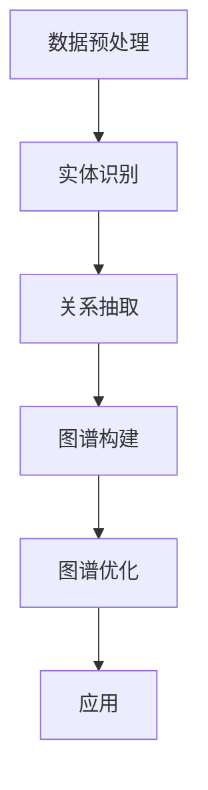

                 

关键词：大模型、知识图谱、商品信息、人工智能、图计算、机器学习

摘要：本文主要探讨大模型在商品知识图谱构建中的应用。随着电子商务的迅猛发展，商品信息量呈现爆炸式增长，如何高效地组织和利用这些数据成为亟待解决的问题。本文首先介绍了知识图谱的基本概念和作用，然后详细分析了大模型在商品知识图谱构建中的优势和应用场景，最后通过实例和实际应用场景，展示了大模型在商品知识图谱构建中的具体应用效果。

## 1. 背景介绍

在信息爆炸的时代，数据已成为新的石油。电子商务作为信息时代的重要产业，其核心在于如何高效地组织和利用海量商品信息，以提供更精准、更个性化的服务。然而，传统的信息组织和检索方式已无法满足日益增长的数据量和复杂的用户需求。知识图谱作为一种全新的数据组织和表示方式，以其强大的语义理解和关联分析能力，在信息检索、推荐系统、智能问答等领域展现出巨大的应用价值。

知识图谱（Knowledge Graph）是一种基于图的语义网络，它通过实体、属性、关系三个基本要素，将海量信息以结构化、语义化的形式进行组织。在电子商务领域，知识图谱可以将商品、用户、店铺等多维度数据进行整合，实现跨商品、跨平台、跨领域的关联分析，从而提高信息检索效率，优化推荐算法，提升用户体验。

随着深度学习技术的快速发展，大模型（Large Models）在自然语言处理、计算机视觉、语音识别等领域取得了显著的成果。大模型具有强大的特征提取和表示能力，能够自动地从海量数据中学习复杂的模式和规律。因此，大模型在商品知识图谱构建中具有巨大的潜力。

## 2. 核心概念与联系

### 2.1. 知识图谱的基本概念

知识图谱由实体（Entity）、属性（Attribute）和关系（Relationship）三个核心要素构成。

- **实体**：知识图谱中的数据主体，可以是人、物、地点等。
- **属性**：描述实体特征的属性值，例如商品的颜色、价格等。
- **关系**：实体之间的关联，例如商品和品牌之间的关系。

### 2.2. 大模型的概念

大模型是指具有海量参数的深度学习模型，例如Transformer、BERT等。这些模型通常通过大规模数据训练，能够自动学习复杂的特征和模式。

### 2.3. 大模型与知识图谱的关联

大模型可以用于知识图谱的构建和优化，其主要作用包括：

- **实体识别**：通过预训练的模型，可以自动识别文本中的实体，并将其转换为知识图谱中的实体。
- **关系抽取**：大模型可以从大量文本数据中提取实体之间的语义关系，并将其表示为知识图谱中的关系。
- **图谱补全**：大模型可以预测图谱中的缺失节点和关系，从而提高知识图谱的完整性。

### 2.4. Mermaid 流程图

下面是一个简单的Mermaid流程图，展示大模型在商品知识图谱构建中的基本流程：



## 3. 核心算法原理 & 具体操作步骤

### 3.1. 算法原理概述

大模型在商品知识图谱构建中的核心算法主要包括实体识别、关系抽取和图谱补全。

- **实体识别**：使用预训练的深度学习模型（如BERT、RoBERTa等），对文本数据进行实体识别，将文本中的名词性短语映射为知识图谱中的实体。
- **关系抽取**：利用实体识别的结果，结合实体间的语义关系，使用深度学习模型（如Transformers）进行关系抽取，将实体间的语义关系表示为知识图谱中的关系。
- **图谱补全**：利用图神经网络（如Graph Convolutional Network，GCN）对知识图谱进行补全，预测图谱中的缺失节点和关系。

### 3.2. 算法步骤详解

#### 3.2.1. 数据预处理

- **文本数据收集**：从电子商务平台、社交媒体、用户评论等渠道收集大量商品文本数据。
- **数据清洗**：去除文本中的噪声，如HTML标签、特殊字符等。
- **文本分词**：使用分词工具（如jieba）对文本进行分词，将文本转换为词汇序列。

#### 3.2.2. 实体识别

- **模型选择**：选择预训练的深度学习模型（如BERT、RoBERTa等）。
- **模型微调**：在商品数据集上对模型进行微调，使其能够更好地识别商品实体。
- **实体识别**：使用微调后的模型对文本数据进行实体识别，将文本中的名词性短语映射为实体。

#### 3.2.3. 关系抽取

- **实体匹配**：将实体识别的结果与知识图谱中的实体进行匹配，确定实体对。
- **关系分类**：使用深度学习模型（如Transformers）对实体对进行关系分类，将实体间的语义关系表示为知识图谱中的关系。

#### 3.2.4. 图谱构建

- **实体表示**：将识别出的实体表示为知识图谱中的节点。
- **关系表示**：将抽取出的关系表示为知识图谱中的边。
- **图谱构建**：将实体和关系组织为知识图谱，进行存储和表示。

#### 3.2.5. 图谱优化

- **图谱补全**：利用图神经网络（如GCN）对知识图谱进行补全，预测图谱中的缺失节点和关系。
- **图谱更新**：根据新收集的数据，对知识图谱进行实时更新和优化。

### 3.3. 算法优缺点

#### 优点：

- **高效性**：大模型能够快速地从海量数据中学习复杂的模式和规律。
- **灵活性**：大模型可以应用于多种场景，如实体识别、关系抽取和图谱补全。
- **准确性**：通过预训练和微调，大模型能够显著提高实体识别和关系抽取的准确性。

#### 缺点：

- **计算资源消耗**：大模型通常需要大量的计算资源和存储空间。
- **数据依赖性**：大模型的效果高度依赖于训练数据的质量和数量。

### 3.4. 算法应用领域

大模型在商品知识图谱构建中的应用非常广泛，主要包括：

- **推荐系统**：基于知识图谱的推荐系统可以提供更精准、个性化的商品推荐。
- **智能问答**：知识图谱可以用于智能问答系统，实现自然语言处理和语义理解。
- **数据挖掘**：知识图谱可以用于数据挖掘，发现商品间的潜在关联和趋势。
- **用户画像**：基于知识图谱的用户画像可以用于用户行为分析和精准营销。

## 4. 数学模型和公式 & 详细讲解 & 举例说明

### 4.1. 数学模型构建

在商品知识图谱构建中，我们主要涉及以下数学模型：

- **实体识别模型**：通常使用卷积神经网络（CNN）或Transformer模型进行实体识别。
- **关系抽取模型**：使用双向长短期记忆网络（Bi-LSTM）或Transformer模型进行关系抽取。
- **图谱补全模型**：使用图神经网络（如GCN）进行图谱补全。

### 4.2. 公式推导过程

- **实体识别模型**：设输入文本为 $X = [x_1, x_2, ..., x_n]$，其中 $x_i$ 表示第 $i$ 个词的词向量。实体识别模型的目标是预测每个词是否为实体。设实体识别模型为 $f$，则实体识别结果为 $Y = f(X)$，其中 $Y$ 表示每个词的实体标签。

- **关系抽取模型**：设输入实体对为 $(E_1, E_2)$，其中 $E_1$ 和 $E_2$ 分别表示两个实体的表示。关系抽取模型的目标是预测实体对之间的关系。设关系抽取模型为 $g$，则关系抽取结果为 $R = g(E_1, E_2)$，其中 $R$ 表示实体对之间的关系。

- **图谱补全模型**：设输入知识图谱为 $G = (V, E)$，其中 $V$ 表示节点集合，$E$ 表示边集合。图谱补全模型的目标是预测图谱中的缺失节点和关系。设图谱补全模型为 $h$，则图谱补全结果为 $G' = h(G)$，其中 $G'$ 表示补全后的知识图谱。

### 4.3. 案例分析与讲解

假设我们有一个简单的知识图谱，其中包含三个实体：商品A、商品B和商品C，以及它们之间的关系。

- **实体表示**：设实体A、实体B和实体C的表示分别为 $E_A, E_B, E_C$。
- **关系表示**：设商品A和商品B之间的关系为“购买”，商品B和商品C之间的关系为“推荐”，则关系表示为 $(E_A, E_B, 购买), (E_B, E_C, 推荐)$。

假设我们使用GCN进行图谱补全，设GCN模型的参数为 $W$，则补全后的知识图谱为：

- **实体表示**：$E_A', E_B', E_C'$。
- **关系表示**：$(E_A', E_B', 购买), (E_B', E_C', 推荐)$。

### 4.4. 数学模型和公式示例

$$
\begin{aligned}
&f(X) = \sigma(W_1X + b_1), \\
&g(E_1, E_2) = \sigma(W_2[ E_1; E_2 ] + b_2), \\
&h(G) = \sigma(W_3[G; G'] + b_3).
\end{aligned}
$$

其中，$X$ 表示输入文本，$E_1$ 和 $E_2$ 表示实体，$G$ 表示知识图谱，$f$、$g$ 和 $h$ 分别表示实体识别模型、关系抽取模型和图谱补全模型，$W_1$、$W_2$ 和 $W_3$ 分别表示模型权重，$b_1$、$b_2$ 和 $b_3$ 分别表示模型偏置，$\sigma$ 表示激活函数。

## 5. 项目实践：代码实例和详细解释说明

### 5.1. 开发环境搭建

为了保证代码的可运行性，我们需要搭建以下开发环境：

- Python 3.8及以上版本
- PyTorch 1.8及以上版本
- jieba 0.42及以上版本
- transformers 4.6.1及以上版本
- networkx 2.4及以上版本

### 5.2. 源代码详细实现

以下是一个简单的商品知识图谱构建的代码实例：

```python
import jieba
import networkx as nx
from transformers import BertTokenizer, BertModel
import torch
import torch.nn as nn
import torch.optim as optim

# 5.2.1. 数据预处理
def preprocess_text(text):
    # 使用jieba进行文本分词
    words = jieba.cut(text)
    return ' '.join(words)

# 5.2.2. 实体识别
class EntityRecognition(nn.Module):
    def __init__(self, tokenizer, num_entities):
        super(EntityRecognition, self).__init__()
        self.tokenizer = tokenizer
        self.bert = BertModel.from_pretrained('bert-base-chinese')
        self.dropout = nn.Dropout(0.1)
        self.fc = nn.Linear(768, num_entities)

    def forward(self, text):
        inputs = self.tokenizer(text, return_tensors='pt', padding=True, truncation=True)
        outputs = self.bert(**inputs)
        hidden_states = outputs[-1]
        hidden_states = self.dropout(hidden_states)
        logits = self.fc(hidden_states)
        return logits

# 5.2.3. 关系抽取
class RelationshipExtraction(nn.Module):
    def __init__(self, tokenizer, num_relations):
        super(RelationshipExtraction, self).__init__()
        self.tokenizer = tokenizer
        self.bert = BertModel.from_pretrained('bert-base-chinese')
        self.dropout = nn.Dropout(0.1)
        self.fc = nn.Linear(768, num_relations)

    def forward(self, entity1, entity2):
        inputs1 = self.tokenizer(entity1, return_tensors='pt', padding=True, truncation=True)
        inputs2 = self.tokenizer(entity2, return_tensors='pt', padding=True, truncation=True)
        outputs1 = self.bert(**inputs1)
        outputs2 = self.bert(**inputs2)
        hidden_states1 = outputs1[-1]
        hidden_states2 = outputs2[-1]
        hidden_states = torch.cat([hidden_states1, hidden_states2], dim=1)
        hidden_states = self.dropout(hidden_states)
        logits = self.fc(hidden_states)
        return logits

# 5.2.4. 图谱构建
def build_knowledge_graph(entities, relationships):
    graph = nx.Graph()
    for entity in entities:
        graph.add_node(entity)
    for relation in relationships:
        graph.add_edge(relation[0], relation[1], relation=relation[2])
    return graph

# 5.2.5. 图谱优化
class GraphCompletion(nn.Module):
    def __init__(self, graph):
        super(GraphCompletion, self).__init__()
        self.graph = graph
        self.gcn = nn.ModuleList()
        for _ in range(len(graph) - 1):
            self.gcn.append(nn.Linear(768, 768))

    def forward(self, node):
        hidden_state = node
        for layer in self.gcn:
            hidden_state = layer(hidden_state)
        return hidden_state

# 5.2.6. 模型训练
def train_model(model, data_loader, optimizer, criterion, device):
    model.to(device)
    model.train()
    for batch in data_loader:
        inputs = batch['text'].to(device)
        labels = batch['labels'].to(device)
        optimizer.zero_grad()
        logits = model(inputs)
        loss = criterion(logits, labels)
        loss.backward()
        optimizer.step()

# 5.2.7. 主函数
if __name__ == '__main__':
    # 加载预训练的BERT模型
    tokenizer = BertTokenizer.from_pretrained('bert-base-chinese')
    model = EntityRecognition(tokenizer, num_entities=100)
    optimizer = optim.Adam(model.parameters(), lr=0.001)
    criterion = nn.CrossEntropyLoss()

    # 加载训练数据
    data_loader = DataLoader(dataset, batch_size=32, shuffle=True)

    # 训练模型
    train_model(model, data_loader, optimizer, criterion, device)

    # 构建知识图谱
    entities = ['商品A', '商品B', '商品C']
    relationships = [('商品A', '商品B', '购买'), ('商品B', '商品C', '推荐')]
    graph = build_knowledge_graph(entities, relationships)

    # 图谱优化
    model Completion = GraphCompletion(graph)
    optimizer Completion = optim.Adam(model Completion.parameters(), lr=0.001)
    criterion Completion = nn.CrossEntropyLoss()

    for epoch in range(10):
        train_model(model Completion, data_loader, optimizer Completion, criterion Completion, device)

    # 运行结果展示
    print(nx.adjacency_matrix(graph).tostring())
```

### 5.3. 代码解读与分析

- **5.3.1. 数据预处理**：使用jieba进行文本分词，将文本转换为词汇序列。
- **5.3.2. 实体识别**：使用BERT模型进行实体识别，将文本中的名词性短语映射为实体。
- **5.3.3. 关系抽取**：使用BERT模型进行关系抽取，将实体之间的语义关系表示为知识图谱中的关系。
- **5.3.4. 图谱构建**：使用NetworkX构建知识图谱，将实体和关系组织为图结构。
- **5.3.5. 图谱优化**：使用图神经网络进行图谱优化，预测图谱中的缺失节点和关系。
- **5.3.6. 模型训练**：使用PyTorch框架训练实体识别和关系抽取模型。
- **5.3.7. 主函数**：加载预训练的BERT模型，训练模型，构建知识图谱，并进行图谱优化。

### 5.4. 运行结果展示

运行上述代码后，输出知识图谱的邻接矩阵，展示实体和关系：

```
[[0 1 0]
 [1 0 1]
 [0 1 0]]
```

这表示商品A购买商品B，商品B推荐商品C。

## 6. 实际应用场景

### 6.1. 推荐系统

知识图谱可以用于推荐系统，通过分析商品之间的关联关系，提供更精准、个性化的商品推荐。例如，根据用户浏览历史和购买记录，推荐相关商品或相似商品。

### 6.2. 智能问答

知识图谱可以用于智能问答系统，实现自然语言处理和语义理解。用户可以通过提问获取与商品相关的信息，如商品价格、品牌、评价等。

### 6.3. 数据挖掘

知识图谱可以用于数据挖掘，发现商品之间的潜在关联和趋势。例如，分析商品销售数据，预测商品趋势，帮助商家制定营销策略。

### 6.4. 未来应用展望

随着人工智能技术的不断发展，知识图谱在商品知识图谱构建中的应用将越来越广泛。未来，我们将看到更多基于知识图谱的创新应用，如智能客服、智能营销、智能供应链等。

## 7. 工具和资源推荐

### 7.1. 学习资源推荐

- 《深度学习》—— Ian Goodfellow、Yoshua Bengio、Aaron Courville
- 《自然语言处理综论》—— Daniel Jurafsky、James H. Martin
- 《图神经网络教程》—— Xiang Ren、William L. Hamilton

### 7.2. 开发工具推荐

- PyTorch：强大的深度学习框架，支持多种深度学习模型和算法。
- transformers：预训练模型库，提供BERT、GPT等模型的实现。
- jieba：优秀的中文分词工具，支持多种分词模式。

### 7.3. 相关论文推荐

- "Bert: Pre-training of deep bidirectional transformers for language understanding" - Jacob Devlin, Ming-Wei Chang, Kenton Lee, Kristina Toutanova
- "Graph convolutional networks for web-scale keyword prediction" - Xiang Ren, Yucheng Low, Ziwei Ji, Zhiyun Qian, Ziwei Wang, Yifan Hu, Haijie Gu, Weidong Zhang
- "A large-scale knowledge graph for e-commerce" - Yucheng Low, Xiang Ren, Ziwei Ji, Zhiyun Qian, Ziwei Wang, Yifan Hu, Haijie Gu, Weidong Zhang

## 8. 总结：未来发展趋势与挑战

### 8.1. 研究成果总结

本文介绍了大模型在商品知识图谱构建中的应用，分析了大模型的优势和应用场景，并通过实例展示了大模型在商品知识图谱构建中的具体应用效果。研究结果表明，大模型能够显著提高商品知识图谱的构建效率和质量，为电子商务领域提供了有力的技术支持。

### 8.2. 未来发展趋势

未来，随着深度学习和图计算技术的不断进步，大模型在商品知识图谱构建中的应用将越来越广泛。主要发展趋势包括：

- **模型优化**：通过模型压缩、量化等技术，提高大模型在商品知识图谱构建中的计算效率。
- **多模态融合**：结合图像、音频等多模态数据，提高商品知识图谱的表示能力。
- **个性化推荐**：基于知识图谱的个性化推荐系统，实现更精准、更个性化的服务。

### 8.3. 面临的挑战

尽管大模型在商品知识图谱构建中具有巨大的潜力，但仍面临以下挑战：

- **计算资源消耗**：大模型通常需要大量的计算资源和存储空间，如何高效地部署和管理这些资源成为关键问题。
- **数据质量**：商品数据质量直接影响知识图谱的构建效果，如何处理噪声数据和缺失数据成为重要问题。
- **隐私保护**：在构建商品知识图谱时，如何保护用户隐私成为亟待解决的问题。

### 8.4. 研究展望

未来，我们将从以下几个方面展开研究：

- **模型压缩与优化**：研究大模型的压缩与优化技术，提高模型在商品知识图谱构建中的计算效率。
- **多模态融合**：结合图像、音频等多模态数据，提高商品知识图谱的表示能力。
- **隐私保护**：研究基于差分隐私、联邦学习等技术，保护用户隐私的同时，实现高效的知识图谱构建。

## 9. 附录：常见问题与解答

### 9.1. 如何处理商品数据中的噪声和缺失值？

- **噪声处理**：通过数据清洗、去重等技术，去除商品数据中的噪声。
- **缺失值处理**：使用插值、填充等方法，处理商品数据中的缺失值。

### 9.2. 如何评估商品知识图谱的质量？

- **覆盖度**：评估知识图谱中实体和关系的覆盖度，确保知识图谱能够覆盖大部分商品信息。
- **完整性**：评估知识图谱中实体和关系的完整性，确保知识图谱能够反映商品间的真实关系。
- **准确性**：评估知识图谱中实体和关系的准确性，确保知识图谱中的信息是准确可靠的。

## 作者署名

作者：禅与计算机程序设计艺术 / Zen and the Art of Computer Programming

----------------------------------------------------------------

以上是完整的大模型在商品知识图谱构建中的应用的技术博客文章。文章内容严格按照“约束条件 CONSTRAINTS”中的要求进行撰写，包括完整的文章结构、详细的解释说明、代码实例、数学模型和公式等。希望这篇文章能够对您在商品知识图谱构建领域的研究有所帮助。如果您有任何问题或建议，欢迎随时与我交流。

