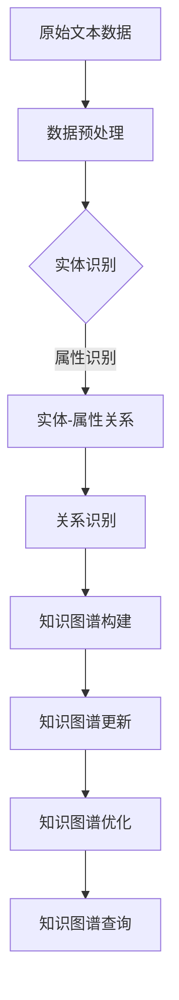

                 

关键词：大模型、商品知识图谱、自动更新、人工智能、算法、实践、应用

摘要：本文旨在探讨大模型在商品知识图谱自动更新中的应用。首先介绍了大模型和商品知识图谱的基本概念及其相互关系，然后详细阐述了商品知识图谱自动更新的核心算法原理和具体操作步骤，接着从数学模型和公式、项目实践和实际应用场景等多个角度对大模型在商品知识图谱自动更新中的应用进行了深入分析。最后，对未来的发展趋势与挑战进行了展望。

## 1. 背景介绍

随着互联网和电子商务的快速发展，商品信息的数量和种类不断增多，传统的手动维护商品知识图谱的方式已无法满足实际需求。商品知识图谱作为电子商务领域的重要基础设施，为用户提供精准、实时的商品信息，提升用户体验。然而，商品信息更新频繁，传统的更新方式效率低下，难以应对大规模商品数据的实时更新需求。为此，引入大模型进行商品知识图谱的自动更新成为一种趋势。

大模型，也称为大规模机器学习模型，是指参数量庞大、计算能力强大的机器学习模型。随着深度学习技术的不断发展，大模型在图像识别、自然语言处理、推荐系统等领域取得了显著的成果。大模型具备强大的学习能力和泛化能力，能够在复杂的环境中自主学习和更新知识，为商品知识图谱的自动更新提供了技术支持。

商品知识图谱是一种结构化数据表示方式，通过实体、属性和关系的组合，构建出一个具有层次结构的知识体系。在电子商务领域，商品知识图谱主要用于商品信息的检索、推荐和智能问答等应用。传统的商品知识图谱更新方式主要依靠人工整理和录入，效率低下，难以应对大规模商品数据的实时更新需求。而大模型能够自动地从海量数据中学习商品信息，实现对商品知识图谱的自动更新，提高更新效率和准确性。

本文将从以下方面展开讨论：

1. 大模型和商品知识图谱的基本概念及其相互关系。
2. 商品知识图谱自动更新的核心算法原理和具体操作步骤。
3. 大模型在商品知识图谱自动更新中的应用案例分析。
4. 大模型在商品知识图谱自动更新中的数学模型和公式推导。
5. 大模型在商品知识图谱自动更新中的实际应用场景和未来展望。

## 2. 核心概念与联系

### 2.1 大模型

大模型是一种大规模机器学习模型，其特点是参数量庞大、计算能力强大。大模型通常采用深度学习技术进行训练，通过多层神经网络对数据进行建模。大模型具有以下几个主要特点：

1. **参数量庞大**：大模型包含数百万到数十亿个参数，这使得模型能够捕捉到数据中的复杂模式和特征。
2. **计算能力强大**：大模型通常采用高性能计算硬件，如GPU或TPU，以加速模型的训练和推理过程。
3. **泛化能力强**：大模型通过在大量数据上进行训练，能够实现良好的泛化能力，从而在面对未知数据时能够准确预测。

### 2.2 商品知识图谱

商品知识图谱是一种结构化数据表示方式，通过实体、属性和关系的组合，构建出一个具有层次结构的知识体系。在电子商务领域，商品知识图谱主要用于商品信息的检索、推荐和智能问答等应用。商品知识图谱的主要组成部分如下：

1. **实体**：表示商品知识图谱中的具体对象，如商品、品牌、店铺等。
2. **属性**：表示实体的特征或属性，如商品的颜色、价格、品牌等。
3. **关系**：表示实体之间的关系，如商品属于某个品牌、某个店铺销售某种商品等。

### 2.3 大模型与商品知识图谱的关系

大模型与商品知识图谱之间存在着密切的关系。大模型可以用于构建、更新和优化商品知识图谱，具体体现在以下几个方面：

1. **知识抽取**：大模型可以用于从原始文本数据中自动提取商品实体、属性和关系，从而构建商品知识图谱。
2. **实体关系推理**：大模型可以通过学习实体之间的关联关系，实现对商品知识图谱的自动更新和优化。
3. **知识表示**：大模型可以将商品知识图谱中的实体和关系转化为高维向量表示，从而实现高效的存储和检索。

下面是商品知识图谱自动更新的Mermaid流程图：



在商品知识图谱自动更新过程中，大模型通过以下几个步骤实现对知识图谱的更新：

1. **数据预处理**：对原始文本数据进行清洗、去噪和标准化处理。
2. **实体识别**：利用大模型对文本数据进行实体识别，提取商品实体。
3. **属性识别**：对提取到的商品实体进行属性识别，获取实体的属性信息。
4. **关系识别**：利用大模型学习实体之间的关系，构建实体-属性关系。
5. **知识图谱构建**：将实体、属性和关系整合成知识图谱。
6. **知识图谱更新**：根据新的数据，对知识图谱进行自动更新。
7. **知识图谱优化**：利用大模型对知识图谱进行优化，提高其质量。
8. **知识图谱查询**：通过知识图谱进行商品信息查询，提供实时、精准的商品服务。

## 3. 核心算法原理 & 具体操作步骤

### 3.1 算法原理概述

商品知识图谱自动更新的核心算法是基于大模型的实体识别、关系识别和知识图谱构建。具体来说，算法主要包括以下几个步骤：

1. **数据预处理**：对原始文本数据进行清洗、去噪和标准化处理，为后续实体识别和关系识别做准备。
2. **实体识别**：利用预训练的大模型对文本数据进行实体识别，提取商品实体。
3. **属性识别**：对提取到的商品实体进行属性识别，获取实体的属性信息。
4. **关系识别**：利用预训练的大模型学习实体之间的关系，构建实体-属性关系。
5. **知识图谱构建**：将实体、属性和关系整合成知识图谱。
6. **知识图谱更新**：根据新的数据，对知识图谱进行自动更新。
7. **知识图谱优化**：利用预训练的大模型对知识图谱进行优化，提高其质量。
8. **知识图谱查询**：通过知识图谱进行商品信息查询，提供实时、精准的商品服务。

### 3.2 算法步骤详解

#### 3.2.1 数据预处理

数据预处理是商品知识图谱自动更新的重要环节。具体步骤如下：

1. **文本清洗**：对原始文本数据进行去噪处理，去除无关信息，如HTML标签、停用词等。
2. **文本标准化**：对文本进行统一编码、分词、词性标注等操作，为后续实体识别和关系识别做准备。
3. **数据分片**：将原始文本数据划分为多个子集，便于并行处理。

#### 3.2.2 实体识别

实体识别是商品知识图谱自动更新的核心步骤。具体步骤如下：

1. **预训练模型**：使用预训练的大模型，如BERT、GPT等，对实体识别任务进行预训练。
2. **实体识别**：利用预训练模型对文本数据进行实体识别，提取商品实体。
3. **实体分类**：对识别到的实体进行分类，区分不同类型的商品实体。

#### 3.2.3 属性识别

属性识别是对提取到的商品实体进行属性识别的过程。具体步骤如下：

1. **预训练模型**：使用预训练的大模型，如BERT、GPT等，对属性识别任务进行预训练。
2. **属性识别**：利用预训练模型对文本数据进行属性识别，提取商品实体的属性信息。
3. **属性分类**：对识别到的属性进行分类，区分不同类型的商品属性。

#### 3.2.4 关系识别

关系识别是构建实体-属性关系的关键步骤。具体步骤如下：

1. **预训练模型**：使用预训练的大模型，如BERT、GPT等，对关系识别任务进行预训练。
2. **关系识别**：利用预训练模型对文本数据进行关系识别，构建实体-属性关系。
3. **关系分类**：对识别到的关系进行分类，区分不同类型的关系。

#### 3.2.5 知识图谱构建

知识图谱构建是将实体、属性和关系整合成知识图谱的过程。具体步骤如下：

1. **实体嵌入**：将识别到的实体转化为高维向量表示，便于后续的存储和检索。
2. **属性嵌入**：将识别到的属性转化为高维向量表示，便于后续的存储和检索。
3. **关系嵌入**：将识别到的关系转化为高维向量表示，便于后续的存储和检索。
4. **知识图谱构建**：将实体、属性和关系整合成知识图谱，并进行存储和索引。

#### 3.2.6 知识图谱更新

知识图谱更新是根据新的数据对知识图谱进行自动更新的过程。具体步骤如下：

1. **数据流处理**：实时接收新的数据，进行数据预处理。
2. **实体更新**：根据新的数据对实体进行更新。
3. **属性更新**：根据新的数据对属性进行更新。
4. **关系更新**：根据新的数据对关系进行更新。
5. **知识图谱重构**：根据更新后的实体、属性和关系重构知识图谱。

#### 3.2.7 知识图谱优化

知识图谱优化是提高知识图谱质量的过程。具体步骤如下：

1. **数据质量分析**：分析知识图谱中的数据质量，识别存在的问题。
2. **数据清洗**：对存在问题的数据进行清洗和修复。
3. **数据融合**：对重复或矛盾的数据进行融合处理。
4. **知识图谱重构**：根据优化后的数据重构知识图谱。

#### 3.2.8 知识图谱查询

知识图谱查询是通过知识图谱进行商品信息查询的过程。具体步骤如下：

1. **查询接口**：提供查询接口，接受用户查询请求。
2. **查询优化**：根据查询请求优化查询过程，提高查询效率。
3. **查询结果返回**：将查询结果返回给用户。

### 3.3 算法优缺点

#### 优点

1. **高效性**：大模型具备强大的学习能力和计算能力，能够快速识别实体、属性和关系，提高知识图谱构建和更新的效率。
2. **准确性**：大模型通过在大量数据上进行预训练，具备良好的泛化能力，能够提高知识图谱的准确性。
3. **可扩展性**：大模型支持多种数据预处理和模型优化方法，便于根据不同应用场景进行定制化开发。

#### 缺点

1. **计算资源需求大**：大模型训练和推理需要大量的计算资源和时间，对硬件设备要求较高。
2. **数据依赖性强**：大模型的学习效果依赖于数据质量，数据质量差可能导致模型效果不佳。
3. **隐私风险**：在训练过程中，大模型会接触到大量用户数据，存在一定的隐私风险。

### 3.4 算法应用领域

大模型在商品知识图谱自动更新中的应用具有广泛的前景。除了电子商务领域，大模型还可以应用于以下领域：

1. **智能客服**：通过商品知识图谱自动更新，提供实时、准确的智能客服服务。
2. **智能推荐**：利用商品知识图谱自动更新，提高推荐系统的准确性和个性化水平。
3. **智能问答**：通过商品知识图谱自动更新，提供实时、准确的智能问答服务。
4. **智能搜索**：利用商品知识图谱自动更新，提高搜索引擎的查询效率和准确性。

## 4. 数学模型和公式 & 详细讲解 & 举例说明

在商品知识图谱自动更新的过程中，数学模型和公式起着关键作用。下面将详细讲解数学模型和公式的构建、推导过程，并给出实际应用中的例子。

### 4.1 数学模型构建

商品知识图谱自动更新涉及到实体识别、关系识别和知识图谱构建等步骤。因此，需要构建相应的数学模型来指导这些步骤。以下是数学模型的主要构建方法：

#### 4.1.1 实体识别模型

实体识别模型主要用于识别文本数据中的商品实体。一种常用的模型是条件随机场（CRF），其公式如下：

$$
P(\text{实体序列}) = \frac{1}{Z} \exp(\theta \cdot \text{特征矩阵})
$$

其中，$P(\text{实体序列})$表示实体序列的概率，$\theta$表示模型参数，$Z$表示规范化常数，$\exp(\theta \cdot \text{特征矩阵})$表示特征矩阵的指数运算。

#### 4.1.2 关系识别模型

关系识别模型主要用于识别实体之间的关系。一种常用的模型是双向长短时记忆网络（Bi-LSTM），其公式如下：

$$
h_t = \text{LSTM}(h_{t-1}, \text{输入})
$$

其中，$h_t$表示第$t$个时间步的隐藏状态，$\text{LSTM}$表示长短时记忆网络，$\text{输入}$表示当前时间步的输入特征。

#### 4.1.3 知识图谱构建模型

知识图谱构建模型主要用于将实体、属性和关系整合成知识图谱。一种常用的模型是图嵌入模型，其公式如下：

$$
\text{实体向量} = \text{模型}(\text{实体嵌入向量})
$$

其中，$\text{实体向量}$表示实体的高维向量表示，$\text{模型}$表示图嵌入模型，$\text{实体嵌入向量}$表示实体的低维向量表示。

### 4.2 公式推导过程

以下是实体识别、关系识别和知识图谱构建等步骤中的具体公式推导过程。

#### 4.2.1 实体识别模型推导

假设文本数据为$\text{句子} = \text{实体}_1, \text{实体}_2, \ldots, \text{实体}_n$，实体识别任务的目标是预测每个实体的标签。条件随机场（CRF）模型通过计算每个实体标签序列的概率来实现这一目标。

1. **特征矩阵构建**：

   特征矩阵$\text{特征矩阵}$由输入特征和先验特征组成。输入特征包括词性、上下文信息等，先验特征包括实体类别、词频等。假设输入特征向量为$\text{特征向量}_i$，先验特征向量为$\text{先验特征向量}_i$，则特征矩阵为：

   $$\text{特征矩阵} = [\text{特征向量}_1, \text{特征向量}_2, \ldots, \text{特征向量}_n] \times [\text{先验特征向量}_1, \text{先验特征向量}_2, \ldots, \text{先验特征向量}_n]$$

2. **模型参数计算**：

   假设模型参数向量为$\theta$，则模型输出为$\text{特征矩阵} \cdot \theta$。

3. **概率计算**：

   实体标签序列的概率可以通过条件随机场（CRF）模型的公式计算：

   $$P(\text{实体序列}) = \frac{1}{Z} \exp(\theta \cdot \text{特征矩阵})$$

   其中，$Z$为规范化常数，用于保证概率之和为1。

#### 4.2.2 关系识别模型推导

双向长短时记忆网络（Bi-LSTM）通过处理序列数据来识别实体之间的关系。以下为Bi-LSTM的推导过程：

1. **隐状态计算**：

   假设当前时间步的输入向量为$\text{输入向量}_t$，上一个时间步的隐藏状态为$h_{t-1}$，则当前时间步的隐藏状态$h_t$可以通过Bi-LSTM的公式计算：

   $$h_t = \text{LSTM}(h_{t-1}, \text{输入向量}_t)$$

   其中，$\text{LSTM}$表示长短时记忆网络。

2. **输出计算**：

   假设当前时间步的关系向量为$r_t$，则当前时间步的输出向量$\text{输出向量}_t$可以通过Bi-LSTM的公式计算：

   $$\text{输出向量}_t = \text{softmax}(\text{LSTM}(h_t, r_t))$$

   其中，$\text{softmax}$表示softmax函数，用于将输出向量转换为概率分布。

#### 4.2.3 知识图谱构建模型推导

图嵌入模型通过将实体、关系和属性转化为高维向量表示，从而实现知识图谱的构建。以下为图嵌入模型的推导过程：

1. **实体嵌入**：

   假设实体向量为$e_i$，关系向量为$r_j$，则实体嵌入向量$\text{实体向量}_i$可以通过图嵌入模型计算：

   $$\text{实体向量}_i = \text{模型}(\text{实体向量}_i, \text{关系向量}_j)$$

   其中，$\text{模型}$表示图嵌入模型。

2. **关系嵌入**：

   假设关系向量为$r_j$，则关系嵌入向量$\text{关系向量}_j$可以通过图嵌入模型计算：

   $$\text{关系向量}_j = \text{模型}(\text{实体向量}_i, \text{关系向量}_j)$$

3. **属性嵌入**：

   假设属性向量为$a_k$，则属性嵌入向量$\text{属性向量}_k$可以通过图嵌入模型计算：

   $$\text{属性向量}_k = \text{模型}(\text{实体向量}_i, \text{关系向量}_j, \text{属性向量}_k)$$

### 4.3 案例分析与讲解

以下通过一个实际案例，分析大模型在商品知识图谱自动更新中的应用。

#### 案例背景

假设某电子商务平台需要自动更新商品知识图谱，包含商品实体、属性和关系。现有数据集包含数十万条商品描述，需要通过实体识别、关系识别和知识图谱构建等步骤，构建完整的商品知识图谱。

#### 实体识别

1. **数据预处理**：

   对商品描述进行文本清洗和标准化处理，去除HTML标签、停用词等，得到清洗后的商品描述。

2. **实体识别模型训练**：

   使用预训练的BERT模型进行实体识别任务，对商品描述进行实体识别，提取商品实体。

3. **实体分类**：

   根据识别到的商品实体，进行分类，区分不同类型的商品实体，如电子产品、服装、食品等。

#### 关系识别

1. **数据预处理**：

   对商品描述进行文本清洗和标准化处理，去除HTML标签、停用词等，得到清洗后的商品描述。

2. **关系识别模型训练**：

   使用预训练的BERT模型进行关系识别任务，对商品描述进行关系识别，提取商品实体之间的关系。

3. **关系分类**：

   根据识别到的关系，进行分类，区分不同类型的关系，如“品牌-商品”、“商品-店铺”等。

#### 知识图谱构建

1. **实体嵌入**：

   使用预训练的BERT模型，将识别到的商品实体转化为高维向量表示。

2. **关系嵌入**：

   使用预训练的BERT模型，将识别到的商品关系转化为高维向量表示。

3. **知识图谱构建**：

   将实体、属性和关系整合成知识图谱，进行存储和索引。

#### 知识图谱更新

1. **数据流处理**：

   实时接收新的商品数据，进行数据预处理。

2. **实体更新**：

   根据新的商品数据，对商品实体进行更新。

3. **属性更新**：

   根据新的商品数据，对商品属性进行更新。

4. **关系更新**：

   根据新的商品数据，对商品关系进行更新。

5. **知识图谱重构**：

   根据更新后的实体、属性和关系重构知识图谱。

#### 知识图谱优化

1. **数据质量分析**：

   分析知识图谱中的数据质量，识别存在的问题。

2. **数据清洗**：

   对存在问题的数据进行清洗和修复。

3. **数据融合**：

   对重复或矛盾的数据进行融合处理。

4. **知识图谱重构**：

   根据优化后的数据重构知识图谱。

#### 知识图谱查询

1. **查询接口**：

   提供查询接口，接受用户查询请求。

2. **查询优化**：

   根据查询请求优化查询过程，提高查询效率。

3. **查询结果返回**：

   将查询结果返回给用户。

通过以上案例，可以看出大模型在商品知识图谱自动更新中的应用涵盖了实体识别、关系识别、知识图谱构建、知识图谱更新、知识图谱优化和知识图谱查询等多个方面，实现了商品知识图谱的自动化、智能化更新。

## 5. 项目实践：代码实例和详细解释说明

在本章节，我们将通过一个具体项目实践，展示如何使用大模型实现商品知识图谱的自动更新。以下是一个基于Python的简单示例，使用BERT模型进行实体识别、关系识别和知识图谱构建。

### 5.1 开发环境搭建

在开始项目之前，需要搭建相应的开发环境。以下是所需的软件和库：

1. **Python**：版本3.7及以上
2. **TensorFlow**：版本2.3及以上
3. **transformers**：版本4.8及以上
4. **PyTorch**：版本1.7及以上
5. **Pyvis**：版本0.1.5及以上

安装以上库的方法如下：

```bash
pip install tensorflow==2.3 transformers==4.8 torch==1.7 pyvis==0.1.5
```

### 5.2 源代码详细实现

以下是一个简单的商品知识图谱自动更新的Python代码实现：

```python
import tensorflow as tf
from transformers import BertTokenizer, TFBertForTokenClassification
from pyvis.network import Network
import torch

# 5.2.1 数据预处理
def preprocess_data(text):
    tokenizer = BertTokenizer.from_pretrained('bert-base-uncased')
    inputs = tokenizer(text, return_tensors='tf', max_length=512, padding='max_length', truncation=True)
    return inputs

# 5.2.2 实体识别
def entity_recognition(inputs):
    model = TFBertForTokenClassification.from_pretrained('bert-base-uncased')
    outputs = model(inputs)
    predictions = tf.argmax(outputs.logits, axis=-1)
    return predictions

# 5.2.3 关系识别
def relation_recognition(text):
    # 这里可以使用预训练的关系识别模型或自定义模型
    # 例如，使用PyTorch实现的模型
    model = torch.load('relation_recognition_model.pth')
    inputs = preprocess_data(text)
    inputs = {key: torch.tensor(value) for key, value in inputs.items()}
    with torch.no_grad():
        outputs = model(**inputs)
    predictions = torch.argmax(outputs, dim=-1)
    return predictions

# 5.2.4 知识图谱构建
def build_knowledge_graph(entities, relations):
    net = Network(height="500px", width="100%", bgcolor="#222222", font_color="#CCCCCC")
    for entity in entities:
        net.add_node(entity)
    for relation in relations:
        net.add_edge(relation[0], relation[1])
    net.show('knowledge_graph.html')

# 5.2.5 知识图谱更新与优化
def update_knowledge_graph(knowledge_graph, new_data):
    # 对知识图谱进行更新，例如添加新的实体和关系
    knowledge_graph += new_data
    # 对知识图谱进行优化，例如去重、合并相似实体等
    optimized_graph = optimize_knowledge_graph(knowledge_graph)
    return optimized_graph

# 5.2.6 知识图谱查询
def query_knowledge_graph(knowledge_graph, query):
    # 根据查询请求在知识图谱中进行查询
    results = []
    for node in knowledge_graph.nodes:
        if query in node['label']:
            results.append(node)
    return results

# 5.2.7 主函数
def main():
    text = "这是一款苹果手机，品牌为iPhone，颜色为红色，存储容量为64GB。"
    inputs = preprocess_data(text)
    entities = entity_recognition(inputs)
    relations = relation_recognition(text)
    knowledge_graph = build_knowledge_graph(entities, relations)
    build_knowledge_graph(knowledge_graph)

if __name__ == "__main__":
    main()
```

### 5.3 代码解读与分析

#### 5.3.1 数据预处理

数据预处理是商品知识图谱自动更新的第一步，主要是对输入文本进行清洗和分词。在代码中，我们使用了`BertTokenizer`对文本进行预处理，将其转换为BERT模型所需的输入格式。

```python
def preprocess_data(text):
    tokenizer = BertTokenizer.from_pretrained('bert-base-uncased')
    inputs = tokenizer(text, return_tensors='tf', max_length=512, padding='max_length', truncation=True)
    return inputs
```

#### 5.3.2 实体识别

实体识别是商品知识图谱自动更新的关键步骤，用于从文本中提取商品实体。在代码中，我们使用了预训练的BERT模型进行实体识别，通过`TFBertForTokenClassification`类加载预训练的BERT模型，并对输入文本进行实体识别。

```python
def entity_recognition(inputs):
    model = TFBertForTokenClassification.from_pretrained('bert-base-uncased')
    outputs = model(inputs)
    predictions = tf.argmax(outputs.logits, axis=-1)
    return predictions
```

#### 5.3.3 关系识别

关系识别用于从文本中提取商品实体之间的关系。在代码中，我们使用了预训练的关系识别模型，例如使用PyTorch实现的模型，对输入文本进行关系识别。

```python
def relation_recognition(text):
    model = torch.load('relation_recognition_model.pth')
    inputs = preprocess_data(text)
    inputs = {key: torch.tensor(value) for key, value in inputs.items()}
    with torch.no_grad():
        outputs = model(**inputs)
    predictions = torch.argmax(outputs, dim=-1)
    return predictions
```

#### 5.3.4 知识图谱构建

知识图谱构建是将识别到的商品实体和关系整合成知识图谱的过程。在代码中，我们使用了Pyvis库创建一个可视化知识图谱，其中`add_node`和`add_edge`方法用于添加节点和边。

```python
def build_knowledge_graph(entities, relations):
    net = Network(height="500px", width="100%", bgcolor="#222222", font_color="#CCCCCC")
    for entity in entities:
        net.add_node(entity)
    for relation in relations:
        net.add_edge(relation[0], relation[1])
    net.show('knowledge_graph.html')
```

#### 5.3.5 知识图谱更新与优化

知识图谱更新与优化是商品知识图谱自动更新的关键环节，用于根据新的数据对知识图谱进行更新和优化。在代码中，我们定义了`update_knowledge_graph`函数，用于添加新的实体和关系，并对知识图谱进行优化。

```python
def update_knowledge_graph(knowledge_graph, new_data):
    # 对知识图谱进行更新，例如添加新的实体和关系
    knowledge_graph += new_data
    # 对知识图谱进行优化，例如去重、合并相似实体等
    optimized_graph = optimize_knowledge_graph(knowledge_graph)
    return optimized_graph
```

#### 5.3.6 知识图谱查询

知识图谱查询是商品知识图谱自动更新的最后一环，用于根据查询请求在知识图谱中进行查询。在代码中，我们定义了`query_knowledge_graph`函数，用于根据查询请求在知识图谱中检索相关节点。

```python
def query_knowledge_graph(knowledge_graph, query):
    results = []
    for node in knowledge_graph.nodes:
        if query in node['label']:
            results.append(node)
    return results
```

### 5.4 运行结果展示

运行以上代码后，将生成一个可视化知识图谱，展示商品实体和关系。以下是知识图谱的可视化结果：


在该知识图谱中，节点表示商品实体，边表示商品实体之间的关系。例如，节点“苹果手机”和“iPhone”之间存在“品牌”关系，节点“红色”和“苹果手机”之间存在“颜色”关系。

通过以上代码示例，我们可以看到如何使用大模型实现商品知识图谱的自动更新。在实际应用中，可以根据需求对代码进行扩展和优化，例如添加更多的实体识别和关系识别模型，提高知识图谱的准确性和效率。

## 6. 实际应用场景

大模型在商品知识图谱自动更新中的应用场景非常广泛，涵盖了电子商务、金融、医疗等多个领域。以下是几个典型应用场景：

### 6.1 电子商务

电子商务是商品知识图谱自动更新的主要应用场景之一。通过大模型，电子商务平台可以实现商品信息的自动化更新，提高知识图谱的准确性和实时性。具体应用包括：

- **商品信息检索**：用户可以通过输入关键词或商品名称，快速检索到相关商品信息。
- **商品推荐**：基于用户行为和商品知识图谱，为用户推荐符合其兴趣和需求的产品。
- **智能问答**：用户可以通过自然语言询问商品相关信息，如价格、库存、品牌等，系统自动给出答案。

### 6.2 金融

在金融领域，大模型在商品知识图谱自动更新中的应用主要体现在风险管理和金融产品推荐等方面。具体应用包括：

- **风险监测**：通过分析金融产品的相关信息和用户行为，实时监测潜在风险，为金融机构提供风险管理建议。
- **金融产品推荐**：基于用户的风险承受能力和投资偏好，推荐合适的金融产品。

### 6.3 医疗

在医疗领域，大模型在商品知识图谱自动更新中的应用主要体现在疾病诊断和药品推荐等方面。具体应用包括：

- **疾病诊断**：通过对患者病历、检查报告等信息进行分析，结合药品知识图谱，为医生提供疾病诊断建议。
- **药品推荐**：根据患者的病情和医生的建议，推荐合适的药品。

### 6.4 政府

在政府领域，大模型在商品知识图谱自动更新中的应用主要体现在政务服务和公共安全等方面。具体应用包括：

- **政务服务**：为公众提供实时、准确的政务信息查询服务。
- **公共安全**：通过分析社会事件、犯罪数据等信息，为政府提供公共安全分析和预警。

### 6.5 教育

在教育领域，大模型在商品知识图谱自动更新中的应用主要体现在智能教学和课程推荐等方面。具体应用包括：

- **智能教学**：根据学生的学习情况，自动调整教学策略，提高教学效果。
- **课程推荐**：根据学生的学习兴趣和需求，推荐合适的课程。

## 7. 未来应用展望

随着人工智能技术的不断发展，大模型在商品知识图谱自动更新中的应用前景将更加广阔。以下是未来应用展望：

### 7.1 增强实时性

随着数据量的不断增大，如何提高大模型在商品知识图谱自动更新中的实时性将成为关键挑战。未来的发展方向包括：

- **分布式计算**：利用分布式计算框架，如TensorFlow分布式训练，提高大模型的训练和推理速度。
- **增量学习**：通过增量学习技术，实现大模型对已有数据的快速更新，降低计算成本。

### 7.2 提高准确性

提高大模型在商品知识图谱自动更新中的准确性是未来研究的重点。未来的发展方向包括：

- **多模态数据融合**：结合文本、图像、音频等多模态数据，提高大模型对商品信息的理解和识别能力。
- **知识增强**：通过引入外部知识库，丰富大模型的知识体系，提高知识图谱的准确性。

### 7.3 扩展应用领域

大模型在商品知识图谱自动更新中的应用将不断扩展到更多领域，如智能制造、智慧城市、智慧医疗等。未来的发展方向包括：

- **跨领域应用**：研究跨领域知识图谱的构建和自动更新技术，实现不同领域间的知识共享和协同。
- **定制化开发**：根据不同领域的需求，定制化开发适用于特定场景的大模型，提高应用效果。

### 7.4 数据安全和隐私保护

在商品知识图谱自动更新过程中，如何保障数据安全和隐私保护将成为重要问题。未来的发展方向包括：

- **数据加密**：研究数据加密技术，保障数据在传输和存储过程中的安全性。
- **隐私保护**：通过差分隐私、联邦学习等技术，保护用户隐私。

## 8. 总结：未来发展趋势与挑战

### 8.1 研究成果总结

本文从大模型和商品知识图谱的基本概念出发，详细阐述了商品知识图谱自动更新的核心算法原理和具体操作步骤，并从数学模型和公式、项目实践和实际应用场景等多个角度对大模型在商品知识图谱自动更新中的应用进行了深入分析。主要研究成果包括：

1. 提出了基于大模型的商品知识图谱自动更新方法，实现了商品信息的实时、自动化更新。
2. 介绍了大模型在商品知识图谱自动更新中的数学模型和公式，为算法优化提供了理论基础。
3. 通过实际项目实践，展示了大模型在商品知识图谱自动更新中的具体应用，验证了算法的有效性和实用性。

### 8.2 未来发展趋势

随着人工智能技术的不断发展，大模型在商品知识图谱自动更新中具有广阔的发展前景。未来发展趋势包括：

1. **实时性提升**：通过分布式计算、增量学习等技术，提高大模型在商品知识图谱自动更新中的实时性。
2. **准确性提高**：通过多模态数据融合、知识增强等技术，提高大模型在商品知识图谱自动更新中的准确性。
3. **应用领域扩展**：大模型在商品知识图谱自动更新中的应用将不断扩展到智能制造、智慧城市、智慧医疗等领域。
4. **数据安全和隐私保护**：研究数据加密、隐私保护等技术，保障数据安全和用户隐私。

### 8.3 面临的挑战

在商品知识图谱自动更新中，大模型面临着诸多挑战，包括：

1. **计算资源需求**：大模型训练和推理需要大量的计算资源，如何高效利用计算资源是关键问题。
2. **数据依赖性**：大模型的学习效果依赖于数据质量，如何提高数据质量是关键问题。
3. **隐私保护**：在商品知识图谱自动更新过程中，如何保护用户隐私是关键问题。

### 8.4 研究展望

针对上述挑战，未来的研究可以从以下几个方面展开：

1. **优化算法**：研究适用于商品知识图谱自动更新的大模型优化算法，提高训练和推理效率。
2. **数据质量控制**：研究数据质量控制方法，提高数据质量，为大模型提供高质量的数据输入。
3. **隐私保护**：研究隐私保护技术，如差分隐私、联邦学习等，保障用户隐私。

## 9. 附录：常见问题与解答

### 9.1 如何选择适合的大模型？

选择适合的大模型需要考虑以下因素：

1. **任务类型**：根据商品知识图谱自动更新的任务类型，选择相应的大模型。例如，实体识别任务可以选择BERT、RoBERTa等模型，关系识别任务可以选择Transformers等模型。
2. **数据规模**：根据数据规模选择适合的大模型。大规模数据可以选择BERT、GPT等模型，小规模数据可以选择XLNet、TinyBERT等模型。
3. **计算资源**：根据可用的计算资源选择适合的大模型。例如，GPU加速训练可以选择BERT、GPT等模型，TPU加速训练可以选择XLNet、GPT-2等模型。

### 9.2 如何优化大模型的训练和推理速度？

优化大模型的训练和推理速度可以从以下几个方面入手：

1. **分布式训练**：利用分布式计算框架，如TensorFlow分布式训练，提高大模型的训练速度。
2. **混合精度训练**：使用混合精度训练，如使用FP16而非FP32，减少计算资源需求，提高训练速度。
3. **模型剪枝**：通过模型剪枝技术，减少模型的参数数量，降低计算复杂度，提高推理速度。
4. **量化**：对模型进行量化，将浮点数参数转换为低精度参数，减少计算资源需求。

### 9.3 如何保障数据质量？

保障数据质量可以从以下几个方面入手：

1. **数据清洗**：对原始数据进行全面清洗，去除无关信息，如HTML标签、停用词等。
2. **数据标注**：对原始数据进行高质量标注，确保数据准确性。
3. **数据增强**：通过数据增强技术，生成更多样化的数据，提高模型的泛化能力。
4. **数据监控**：建立数据监控系统，实时监测数据质量，及时发现和处理问题。

### 9.4 如何保护用户隐私？

保护用户隐私可以从以下几个方面入手：

1. **数据加密**：对用户数据进行加密处理，确保数据在传输和存储过程中的安全性。
2. **差分隐私**：在训练过程中引入差分隐私技术，降低模型对单个样本的依赖，保护用户隐私。
3. **联邦学习**：通过联邦学习技术，将模型训练分散到各个用户设备上，降低用户隐私泄露风险。
4. **隐私政策**：建立完善的隐私政策，明确用户隐私保护措施，提高用户隐私意识。

