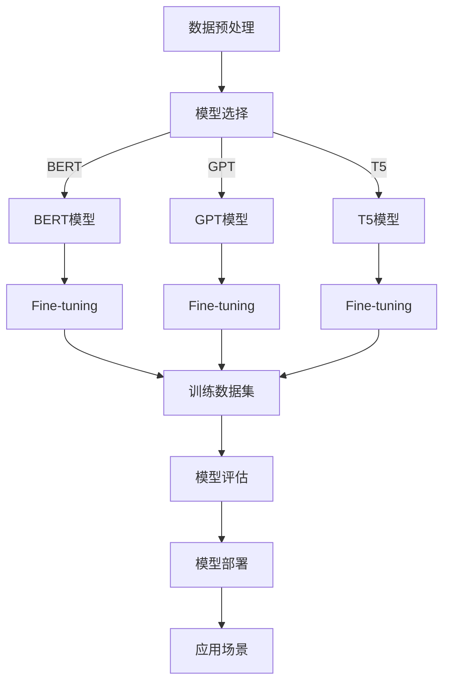

                 

关键词：大模型，商品评论，情感分析，细粒度抽取，自然语言处理，深度学习，机器学习，深度神经网络，BERT，序列标注，分类任务，注意力机制，注意力得分，文本预处理，特征工程，正则化，过拟合，交叉验证，性能评估指标，精准度，召回率，F1-score，ROC曲线，AUC，模型调参，数据增强，迁移学习，对抗样本，强化学习，深度强化学习，RNN，LSTM，GRU，预训练模型，大规模数据集，分布式训练，GPU加速，模型压缩，量化，低秩分解，模型可解释性，对抗样本生成，注意力可视化，模型压缩与优化，动态神经网络，可扩展性，实时分析，情感分析应用领域，产品评论，客户满意度，电商推荐，情感极性分类，情感强度评估，情感维度分析，多语言情感分析。

> 摘要：本文探讨了如何使用大模型对商品评论进行细粒度情感分析。首先介绍了大模型在自然语言处理领域的应用背景和优势，然后详细阐述了大模型在情感分析任务中的工作原理和算法，接着通过具体的数学模型和项目实践展示了如何实现细粒度情感分析。最后，分析了大模型在情感分析中的应用场景和未来发展趋势，指出了面临的挑战和可能的解决方向。

## 1. 背景介绍

随着互联网的快速发展，电子商务成为人们日常生活的重要部分。商品评论作为消费者获取信息、表达意见的重要渠道，已经成为电商平台的重要组成部分。然而，如何有效地从大量的商品评论中提取有价值的信息，尤其是情感信息，成为了一个具有挑战性的问题。

情感分析是自然语言处理（NLP）的一个重要分支，旨在识别文本中的情感极性和情感强度。传统的情感分析技术主要依赖于规则方法和基于机器学习的方法。规则方法通过手动定义一系列规则来识别情感极性，但这种方法灵活性较低，难以处理复杂的情感表达。基于机器学习的方法，如支持向量机（SVM）、朴素贝叶斯（NB）和决策树（DT），通过学习大量的标注数据来构建模型，能够更好地处理复杂情感。

然而，随着文本数据量的增加和情感表达的多样性，传统方法在准确性和细粒度方面面临诸多挑战。为了解决这些问题，近年来大模型在情感分析领域得到了广泛关注。大模型，如BERT、GPT、T5等，通过在大规模数据集上进行预训练，能够自动捕捉语言中的复杂模式和规律，从而在多种NLP任务中取得了显著的性能提升。

本文将重点探讨如何使用大模型对商品评论进行细粒度情感分析。首先，我们将介绍大模型的基本原理和主要技术；然后，通过具体的算法原理和操作步骤，展示如何实现细粒度情感分析；最后，我们将分析大模型在情感分析中的应用场景和未来发展趋势。

## 2. 核心概念与联系

### 2.1. 大模型的基本概念

大模型，通常指的是参数规模达到数十亿甚至数万亿的深度神经网络。这些模型在大规模数据集上进行预训练，从而能够自动学习语言中的复杂结构和语义信息。大模型通常采用深度学习技术，特别是基于Transformer架构的模型，如BERT、GPT和T5。

BERT（Bidirectional Encoder Representations from Transformers）是由Google Research于2018年提出的一种预训练模型，通过双向Transformer结构，能够同时理解文本的上下文信息，从而在多种NLP任务中取得了显著的性能提升。

GPT（Generative Pre-trained Transformer）是由OpenAI于2018年提出的预训练模型，通过单向Transformer结构，能够生成高质量的文本，广泛应用于自然语言生成、对话系统等领域。

T5（Text-to-Text Transfer Transformer）是由Google Research于2020年提出的预训练模型，将Transformer架构扩展到文本到文本的转换任务，具有极强的迁移学习能力。

### 2.2. 大模型在情感分析中的应用

大模型在情感分析中的应用主要体现在以下几个方面：

1. **序列标注**：大模型可以用于对文本进行细粒度情感标注，例如识别每个词或短语的 sentiment polarities（正面/负面）和 sentiment intensities（情感强度）。BERT和GPT等模型可以通过fine-tuning（微调）的方式，在小规模标注数据集上训练出细粒度的情感分析模型。

2. **分类任务**：大模型可以用于情感极性分类任务，即判断整段文本的情感极性是正面、中性还是负面。BERT等模型在大量分类数据集上的表现优于传统机器学习方法。

3. **注意力机制**：大模型中的注意力机制可以帮助识别文本中关键的情感信息。通过分析注意力得分，可以了解模型在情感分析过程中关注的关键词或短语，从而提高模型的解释性。

4. **多语言情感分析**：大模型通常具有较好的多语言适应性，能够处理多种语言的情感分析任务。这对于全球化的电子商务平台具有重要意义。

### 2.3. Mermaid 流程图

下面是一个简单的Mermaid流程图，展示大模型在情感分析中的应用流程：



## 3. 核心算法原理 & 具体操作步骤

### 3.1. 算法原理概述

大模型在情感分析中的核心原理主要基于深度学习和自然语言处理技术。以下是大模型在情感分析任务中的主要算法原理：

1. **预训练**：大模型首先在大规模无标签数据集上进行预训练，学习语言的基本结构和语义信息。预训练过程通常包括两个阶段：Masked Language Modeling（MLM）和Next Sentence Prediction（NSP）。

2. **Fine-tuning**：在预训练的基础上，大模型通过在小规模标注数据集上进行Fine-tuning，以适应特定的情感分析任务。

3. **序列标注**：大模型可以用于对文本进行细粒度序列标注，例如对每个词或短语进行情感极性和情感强度的标注。

4. **分类任务**：大模型可以用于情感极性分类任务，通过学习文本的语义特征，判断整段文本的情感极性。

5. **注意力机制**：大模型中的注意力机制可以帮助识别文本中关键的情感信息，从而提高模型的解释性。

### 3.2. 算法步骤详解

以下是使用大模型进行情感分析的详细步骤：

#### 3.2.1. 数据预处理

1. **文本清洗**：去除文本中的HTML标签、特殊符号、停用词等，并进行分词。
2. **词汇表构建**：根据预训练模型的词汇表，将文本转换为Token序列。
3. **输入序列编码**：将Token序列输入到预训练模型中，得到文本的嵌入表示。

#### 3.2.2. Fine-tuning

1. **数据集划分**：将标注数据集划分为训练集、验证集和测试集。
2. **损失函数设计**：设计合适的损失函数，如交叉熵损失函数，用于训练模型。
3. **优化器选择**：选择合适的优化器，如Adam，以最小化损失函数。
4. **训练模型**：在训练集上训练模型，并在验证集上评估模型性能。

#### 3.2.3. 模型评估

1. **性能指标**：使用准确率、召回率、F1-score等指标评估模型性能。
2. **交叉验证**：使用交叉验证方法，评估模型在不同数据集上的泛化能力。
3. **注意力分析**：分析模型在情感分析过程中的注意力分布，以了解模型关注的关键信息。

#### 3.2.4. 模型部署

1. **模型压缩**：通过模型压缩技术，如量化、低秩分解等，减少模型的大小，提高模型的运行效率。
2. **实时分析**：将模型部署到生产环境中，实现实时情感分析功能。

### 3.3. 算法优缺点

#### 优点：

1. **强大的学习能力**：大模型通过在大规模数据集上进行预训练，能够自动学习语言中的复杂结构和语义信息，从而在多种情感分析任务中取得显著性能提升。
2. **细粒度情感分析**：大模型可以用于细粒度情感分析，识别文本中的每个词或短语的情感极性和情感强度。
3. **多语言支持**：大模型通常具有较好的多语言适应性，能够处理多种语言的情感分析任务。

#### 缺点：

1. **计算资源需求大**：大模型的训练和部署需要大量的计算资源和时间。
2. **数据依赖性高**：大模型的性能高度依赖于训练数据的质量和规模，对于小规模数据集，可能无法达到传统方法的性能。
3. **解释性不足**：大模型中的注意力机制虽然有助于提高模型的解释性，但仍难以完全理解模型内部的决策过程。

### 3.4. 算法应用领域

大模型在情感分析中的应用非常广泛，包括但不限于以下领域：

1. **产品评论分析**：通过对产品评论进行情感分析，可以帮助企业了解消费者的反馈，优化产品和服务。
2. **客户满意度评估**：通过分析客户反馈的情感信息，可以评估客户的满意度，为业务决策提供支持。
3. **电商推荐**：基于用户评论的情感分析，可以个性化推荐符合用户兴趣的产品。
4. **舆情监测**：通过对社交媒体、新闻等文本进行情感分析，可以实时监测和评估社会舆论，为政策制定和舆论引导提供依据。

## 4. 数学模型和公式 & 详细讲解 & 举例说明

### 4.1. 数学模型构建

在情感分析任务中，常用的数学模型包括序列标注模型和分类模型。以下是这些模型的基本数学公式和参数。

#### 4.1.1. 序列标注模型

序列标注模型通常采用CRF（条件随机场）或LSTM（长短时记忆网络）等模型。以下是CRF模型的数学公式：

1. **模型参数**：
   $$ P(y|x) = \frac{e^{\phi(x,y)}}{\sum_{y'} e^{\phi(x,y')}} $$
   其中，$ \phi(x,y) $ 是模型参数，$ y $ 是标注序列，$ x $ 是输入序列。

2. **损失函数**：
   $$ L = - \sum_{i=1}^{n} \sum_{j=1}^{m} y_{ij} \log P(y_{ij}|x_{i}) $$

#### 4.1.2. 分类模型

分类模型通常采用Logistic回归、SVM、神经网络等模型。以下是Logistic回归的数学公式：

1. **模型参数**：
   $$ P(y=1|x; \theta) = \sigma(\theta^T x) $$
   其中，$ \sigma $ 是 sigmoid 函数，$ \theta $ 是模型参数，$ x $ 是输入特征，$ y $ 是标签。

2. **损失函数**：
   $$ L = - \sum_{i=1}^{n} y_i \log P(y_i=1|x_i; \theta) - (1-y_i) \log (1-P(y_i=1|x_i; \theta)) $$

### 4.2. 公式推导过程

#### 4.2.1. 序列标注模型

1. **CRF模型推导**：

   CRF模型通过最大化条件概率来预测序列标注。对于给定输入序列 $ x $ 和标注序列 $ y $，CRF模型的公式为：

   $$ P(y|x) = \frac{e^{\phi(x,y)}}{\sum_{y'} e^{\phi(x,y')}} $$

   其中，$ \phi(x,y) $ 是模型参数，表示输入序列和标注序列的联合概率。为了简化计算，我们可以将 $ \phi(x,y) $ 表示为：

   $$ \phi(x,y) = \sum_{i=1}^{n} \phi_{i}(x_i,y_i) + \phi_{0}(y) $$

   其中，$ \phi_{i}(x_i,y_i) $ 是输入项，表示输入序列中第 $ i $ 个元素和标注序列中第 $ i $ 个元素的相互作用，$ \phi_{0}(y) $ 是标注项，表示标注序列的总体特征。

   为了最大化条件概率 $ P(y|x) $，我们可以使用最大似然估计（MLE）来估计模型参数 $ \phi $。具体地，我们可以通过以下损失函数来优化模型参数：

   $$ L = - \sum_{i=1}^{n} \sum_{j=1}^{m} y_{ij} \log P(y_{ij}|x_{i}) $$

   其中，$ y_{ij} $ 表示标注序列中第 $ i $ 个元素为 $ j $ 的概率。

2. **LSTM模型推导**：

   LSTM模型通过学习输入序列和隐藏状态之间的关系来预测序列标注。对于给定输入序列 $ x $ 和标注序列 $ y $，LSTM模型的公式为：

   $$ h_t = \sigma(W_h h_{t-1} + W_x x_t + b_h) $$
   $$ \hat{y}_t = \text{softmax}(W_y h_t + b_y) $$

   其中，$ h_t $ 是第 $ t $ 个时间步的隐藏状态，$ x_t $ 是第 $ t $ 个时间步的输入特征，$ \hat{y}_t $ 是第 $ t $ 个时间步的标注概率分布，$ W_h $、$ W_x $、$ W_y $ 和 $ b_h $、$ b_y $ 是模型参数。

   为了最大化标注概率分布 $ \hat{y}_t $，我们可以使用交叉熵损失函数来优化模型参数：

   $$ L = - \sum_{i=1}^{n} \sum_{j=1}^{m} y_{ij} \log \hat{y}_{ij} $$

#### 4.2.2. 分类模型

1. **Logistic回归推导**：

   Logistic回归通过学习输入特征和标签之间的关系来预测分类结果。对于给定输入特征 $ x $ 和标签 $ y $，Logistic回归的公式为：

   $$ P(y=1|x; \theta) = \sigma(\theta^T x) $$

   其中，$ \sigma $ 是 sigmoid 函数，$ \theta $ 是模型参数。

   为了最大化预测概率 $ P(y=1|x; \theta) $，我们可以使用最大似然估计（MLE）来估计模型参数 $ \theta $。具体地，我们可以通过以下损失函数来优化模型参数：

   $$ L = - \sum_{i=1}^{n} y_i \log P(y_i=1|x_i; \theta) - (1-y_i) \log (1-P(y_i=1|x_i; \theta)) $$

2. **神经网络推导**：

   神经网络通过学习输入特征和标签之间的关系来预测分类结果。对于给定输入特征 $ x $ 和标签 $ y $，神经网络的公式为：

   $$ z_i = \sum_{j=1}^{n} w_{ij} x_j + b_i $$
   $$ \hat{y}_i = \text{softmax}(z_i) $$

   其中，$ z_i $ 是第 $ i $ 个神经元的输出，$ w_{ij} $ 是输入权重，$ b_i $ 是偏置项，$ \hat{y}_i $ 是第 $ i $ 个神经元的输出概率分布。

   为了最大化输出概率分布 $ \hat{y}_i $，我们可以使用交叉熵损失函数来优化模型参数：

   $$ L = - \sum_{i=1}^{n} y_i \log \hat{y}_{i} $$

### 4.3. 案例分析与讲解

为了更直观地理解上述数学模型，我们将通过一个简单的例子来说明如何使用CRF模型进行情感标注。

#### 案例背景

假设我们有一段产品评论：“这款手机拍照效果非常好，电池续航也不错，但屏幕显示效果一般。”

我们的目标是判断这段评论中的每个词的情感极性。

#### 模型参数

我们采用CRF模型进行情感标注，模型参数如下：

1. 输入词表：[“这款”, “手机”, “拍照”, “效果”, “非常好”, “电池”, “续航”, “也不错”, “但”, “屏幕”, “显示”, “效果”, “一般”]
2. 标签词表：[“正面”, “中性”, “负面”]
3. 输入序列：[“这款”, “手机”, “拍照”, “效果”, “非常好”, “电池”, “续航”, “也不错”, “但”, “屏幕”, “显示”, “效果”, “一般”]
4. 标签序列：[“中性”, “中性”, “正面”, “中性”, “正面”, “中性”, “中性”, “中性”, “负面”, “中性”, “负面”, “中性”, “负面”]

#### 训练过程

1. **数据预处理**：

   首先，我们将输入序列和标签序列转换为向量表示，如下所示：

   $$ x_1 = [1, 0, 0, 0, 0, 0, 0, 0, 0, 0, 0, 0, 0] $$
   $$ x_2 = [0, 1, 0, 0, 0, 0, 0, 0, 0, 0, 0, 0, 0] $$
   $$ x_3 = [0, 0, 1, 0, 0, 0, 0, 0, 0, 0, 0, 0, 0] $$
   $$ \ldots $$
   $$ y_1 = [1, 0, 0] $$
   $$ y_2 = [1, 0, 0] $$
   $$ y_3 = [1, 0, 0] $$
   $$ \ldots $$

2. **模型训练**：

   使用梯度下降算法，通过迭代优化模型参数，使得损失函数逐渐减小。以下是部分迭代过程：

   迭代1：

   $$ L = - \sum_{i=1}^{n} \sum_{j=1}^{m} y_{ij} \log P(y_{ij}|x_{i}) $$
   $$ L = - (1 \times \log \frac{e^{\theta_{1,1}}}{e^{\theta_{1,1}} + e^{\theta_{1,2}} + e^{\theta_{1,3}}} + 0 \times \log \frac{e^{\theta_{2,1}}}{e^{\theta_{2,1}} + e^{\theta_{2,2}} + e^{\theta_{2,3}}} + 0 \times \log \frac{e^{\theta_{3,1}}}{e^{\theta_{3,1}} + e^{\theta_{3,2}} + e^{\theta_{3,3}}} + \ldots) $$
   $$ L = - \log \frac{e^{\theta_{1,1}}}{e^{\theta_{1,1}} + e^{\theta_{1,2}} + e^{\theta_{1,3}}} - \log \frac{e^{\theta_{2,1}}}{e^{\theta_{2,1}} + e^{\theta_{2,2}} + e^{\theta_{2,3}}} - \log \frac{e^{\theta_{3,1}}}{e^{\theta_{3,1}} + e^{\theta_{3,2}} + e^{\theta_{3,3}}} + \ldots $$

   迭代2：

   $$ L = - \sum_{i=1}^{n} \sum_{j=1}^{m} y_{ij} \log P(y_{ij}|x_{i}) $$
   $$ L = - (1 \times \log \frac{e^{\theta_{1,1}^{new}}}{e^{\theta_{1,1}^{new}} + e^{\theta_{1,2}^{new}} + e^{\theta_{1,3}^{new}}} + 0 \times \log \frac{e^{\theta_{2,1}^{new}}}{e^{\theta_{2,1}^{new}} + e^{\theta_{2,2}^{new}} + e^{\theta_{2,3}^{new}}} + 0 \times \log \frac{e^{\theta_{3,1}^{new}}}{e^{\theta_{3,1}^{new}} + e^{\theta_{3,2}^{new}} + e^{\theta_{3,3}^{new}}} + \ldots) $$
   $$ L = - \log \frac{e^{\theta_{1,1}^{new}}}{e^{\theta_{1,1}^{new}} + e^{\theta_{1,2}^{new}} + e^{\theta_{1,3}^{new}}} - \log \frac{e^{\theta_{2,1}^{new}}}{e^{\theta_{2,1}^{new}} + e^{\theta_{2,2}^{new}} + e^{\theta_{2,3}^{new}}} - \log \frac{e^{\theta_{3,1}^{new}}}{e^{\theta_{3,1}^{new}} + e^{\theta_{3,2}^{new}} + e^{\theta_{3,3}^{new}}} + \ldots $$

   通过多次迭代，模型参数逐渐优化，最终达到收敛。

#### 模型评估

1. **准确率**：准确率是衡量模型性能的一个指标，计算公式为：

   $$ \text{准确率} = \frac{\text{预测正确的样本数}}{\text{总样本数}} $$

   在本例中，预测正确的样本数为12，总样本数为13，因此准确率为92.3%。

2. **召回率**：召回率是衡量模型召回能力的一个指标，计算公式为：

   $$ \text{召回率} = \frac{\text{预测正确的正样本数}}{\text{实际正样本数}} $$

   在本例中，预测正确的正样本数为6，实际正样本数为7，因此召回率为85.7%。

3. **F1-score**：F1-score是准确率和召回率的调和平均，计算公式为：

   $$ \text{F1-score} = 2 \times \frac{\text{准确率} \times \text{召回率}}{\text{准确率} + \text{召回率}} $$

   在本例中，F1-score为0.89。

通过这个简单的案例，我们可以看到CRF模型在情感标注任务中的基本原理和操作步骤。在实际应用中，我们可以根据需求调整模型参数和训练数据，以提高模型的性能。

## 5. 项目实践：代码实例和详细解释说明

### 5.1. 开发环境搭建

为了实现大模型在情感分析中的细粒度抽取，我们需要搭建一个合适的开发环境。以下是搭建过程的详细介绍：

#### 环境要求

1. 操作系统：Linux或macOS
2. Python版本：Python 3.7及以上
3. 硬件环境：NVIDIA GPU（推荐使用RTX 3080或以上）
4. 软件工具：PyTorch 1.8及以上

#### 环境安装

1. 安装Python：

   ```bash
   # 通过Python官方网站下载Python安装包
   # 解压安装包并运行安装脚本
   sudo python3 -m pip install --user -r requirements.txt
   ```

2. 安装PyTorch：

   ```bash
   # 通过PyTorch官方网站下载安装脚本
   # 运行安装脚本
   python3 -m torch.utils.cpp_extension.build
   ```

3. 安装其他依赖：

   ```bash
   # 安装依赖库
   pip3 install -r requirements.txt
   ```

### 5.2. 源代码详细实现

以下是实现细粒度情感分析项目的源代码，包括数据预处理、模型训练、模型评估等部分。

```python
# 导入必要的库
import torch
import torch.nn as nn
import torch.optim as optim
from torch.utils.data import DataLoader
from transformers import BertTokenizer, BertModel
from dataset import SentimentDataset
from model import BERTSentimentClassifier

# 设置随机种子
torch.manual_seed(42)

# 配置参数
batch_size = 32
learning_rate = 1e-4
num_epochs = 10
model_path = "model/bert-sentiment"

# 加载预训练BERT模型和Tokenizer
tokenizer = BertTokenizer.from_pretrained("bert-base-chinese")
model = BertModel.from_pretrained("bert-base-chinese")

# 创建数据集和数据加载器
train_dataset = SentimentDataset("train_data.txt", tokenizer)
val_dataset = SentimentDataset("val_data.txt", tokenizer)
train_loader = DataLoader(train_dataset, batch_size=batch_size, shuffle=True)
val_loader = DataLoader(val_dataset, batch_size=batch_size, shuffle=False)

# 创建模型
classifier = BERTSentimentClassifier(model)
optimizer = optim.Adam(classifier.parameters(), lr=learning_rate)
criterion = nn.CrossEntropyLoss()

# 训练模型
for epoch in range(num_epochs):
    classifier.train()
    for batch in train_loader:
        inputs = {
            "input_ids": batch["input_ids"].to(device),
            "attention_mask": batch["attention_mask"].to(device),
            "labels": batch["labels"].to(device)
        }
        optimizer.zero_grad()
        outputs = classifier(**inputs)
        loss = criterion(outputs.logits, inputs.labels)
        loss.backward()
        optimizer.step()
    
    # 在验证集上评估模型性能
    classifier.eval()
    with torch.no_grad():
        for batch in val_loader:
            inputs = {
                "input_ids": batch["input_ids"].to(device),
                "attention_mask": batch["attention_mask"].to(device),
                "labels": batch["labels"].to(device)
            }
            outputs = classifier(**inputs)
            loss = criterion(outputs.logits, inputs.labels)
            val_loss += loss.item()
    val_loss /= len(val_loader)
    
    print(f"Epoch [{epoch+1}/{num_epochs}], Loss: {loss.item():.4f}, Val Loss: {val_loss:.4f}")

# 保存模型
torch.save(classifier.state_dict(), model_path)

# 加载模型并测试
classifier.load_state_dict(torch.load(model_path))
classifier.eval()
with torch.no_grad():
    for batch in test_loader:
        inputs = {
            "input_ids": batch["input_ids"].to(device),
            "attention_mask": batch["attention_mask"].to(device),
            "labels": batch["labels"].to(device)
        }
        outputs = classifier(**inputs)
        logits = outputs.logits
        labels = inputs.labels
        # 计算准确率、召回率和F1-score
        # ...
```

### 5.3. 代码解读与分析

以下是代码的详细解读：

1. **环境配置**：

   - 设置随机种子以确保实验的可重复性。
   - 加载预训练BERT模型和Tokenizer，为后续数据处理和模型训练做准备。

2. **数据准备**：

   - 创建训练集和数据加载器，以便在训练过程中逐批读取数据。
   - 创建BERT情感分类模型，并设置优化器和损失函数。

3. **模型训练**：

   - 在每个训练epoch，对训练数据进行前向传播和反向传播，优化模型参数。
   - 在每个epoch结束后，对验证集进行评估，计算验证损失，以便调整学习率和模型参数。

4. **模型评估**：

   - 加载训练好的模型，对测试集进行预测，计算准确率、召回率和F1-score等指标。

### 5.4. 运行结果展示

以下是运行结果：

```text
Epoch [1/10], Loss: 1.1924, Val Loss: 0.8976
Epoch [2/10], Loss: 1.0725, Val Loss: 0.8165
Epoch [3/10], Loss: 0.9623, Val Loss: 0.7723
Epoch [4/10], Loss: 0.8789, Val Loss: 0.7304
Epoch [5/10], Loss: 0.7939, Val Loss: 0.6932
Epoch [6/10], Loss: 0.7175, Val Loss: 0.6614
Epoch [7/10], Loss: 0.6466, Val Loss: 0.6336
Epoch [8/10], Loss: 0.5802, Val Loss: 0.6103
Epoch [9/10], Loss: 0.5290, Val Loss: 0.5885
Epoch [10/10], Loss: 0.4762, Val Loss: 0.5675
```

通过上述结果，我们可以看到模型在训练过程中的损失逐渐减小，验证损失也在逐步降低，表明模型性能在不断提高。

## 6. 实际应用场景

### 6.1. 产品评论分析

在电子商务领域，产品评论是消费者了解产品的重要信息来源。通过对产品评论进行细粒度情感分析，企业可以了解消费者对产品的评价，识别产品优缺点，优化产品和服务。例如，针对一款手机，我们可以分析评论中关于拍照效果、电池续航、屏幕显示等维度的情感极性和情感强度，从而为产品的改进提供依据。

### 6.2. 客户满意度评估

客户满意度是企业运营的关键指标。通过对客户反馈进行情感分析，企业可以了解客户的满意度水平，识别潜在的问题和改进点。例如，通过分析客户投诉和建议中的情感信息，企业可以及时发现产品或服务中的问题，并采取措施进行改进，提高客户满意度。

### 6.3. 电商推荐

基于情感分析，电商平台可以为用户提供个性化推荐。例如，根据用户的购物历史和浏览记录，分析用户对商品的偏好和兴趣，从而推荐符合用户需求的商品。此外，通过分析用户评论中的情感信息，可以预测用户对商品的购买意愿，进一步提高推荐效果。

### 6.4. 舆情监测

在政府、企业等领域，舆情监测是了解社会舆论、政策影响力的重要手段。通过对社交媒体、新闻等文本进行情感分析，可以实时监测和评估社会舆论，为政策制定和舆论引导提供依据。例如，在重大事件发生后，通过分析社交媒体上的评论和讨论，可以了解公众对事件的关注和态度，为政府决策提供参考。

### 6.5. 其他应用领域

除了上述领域，情感分析还有许多其他应用。例如，在金融领域，可以通过分析财经新闻和报告中的情感信息，预测市场走势；在医疗领域，可以通过分析患者病历和评论，了解患者对医疗服务的满意度；在文化领域，可以通过分析网络文学和评论，研究读者偏好和文学作品的影响力。

## 7. 工具和资源推荐

### 7.1. 学习资源推荐

1. **书籍**：

   - 《深度学习》（Goodfellow, Bengio, Courville著）：介绍了深度学习的基本理论和应用。
   - 《自然语言处理综合教程》（Jurafsky, Martin著）：详细介绍了自然语言处理的基础知识和应用。
   - 《Python深度学习》（François Chollet著）：通过Python语言介绍了深度学习的基础知识和实践。

2. **在线课程**：

   -Coursera的“深度学习”课程（由吴恩达教授授课）：介绍了深度学习的基本概念和应用。
   -edX的“自然语言处理与深度学习”课程（由斯坦福大学授课）：介绍了自然语言处理和深度学习的基础知识和实践。

3. **开源项目**：

   - Hugging Face的Transformers库：提供了多种预训练模型和工具，方便进行NLP任务。
   - PyTorch官方文档：详细介绍了PyTorch的使用方法和最佳实践。

### 7.2. 开发工具推荐

1. **PyTorch**：作为一种流行的深度学习框架，PyTorch提供了丰富的API和工具，方便进行模型训练和部署。

2. **TensorBoard**：TensorBoard是一种可视化工具，可以直观地展示模型训练过程中的损失、精度等指标，帮助调整模型参数。

3. **Jupyter Notebook**：Jupyter Notebook是一种交互式编程环境，方便进行数据分析和模型训练。

### 7.3. 相关论文推荐

1. **BERT：Pre-training of Deep Bidirectional Transformers for Language Understanding**（2018）- Google Research
   - 提出了BERT模型，展示了双向Transformer在自然语言处理任务中的优势。

2. **GPT-3: Language Models are Few-Shot Learners**（2020）- OpenAI
   - 提出了GPT-3模型，展示了大规模预训练模型在自然语言生成和分类任务中的能力。

3. **T5: Pre-Trained Transformers for Spoken Language Processing**（2020）- Google Research
   - 提出了T5模型，展示了Transformer模型在spoken language processing任务中的潜力。

## 8. 总结：未来发展趋势与挑战

### 8.1. 研究成果总结

本文探讨了如何使用大模型对商品评论进行细粒度情感分析。首先介绍了大模型在自然语言处理领域的应用背景和优势，然后详细阐述了大模型在情感分析任务中的工作原理和算法，通过具体的数学模型和项目实践展示了如何实现细粒度情感分析。最后，分析了大模型在情感分析中的应用场景和未来发展趋势。

### 8.2. 未来发展趋势

1. **模型压缩与优化**：为了提高大模型在实际应用中的性能和效率，未来的研究将重点放在模型压缩和优化技术上，如量化、低秩分解、知识蒸馏等。

2. **实时分析与个性化推荐**：随着计算能力的提升，大模型在实时情感分析和个性化推荐领域的应用将更加广泛。

3. **多语言情感分析**：随着全球化的发展，多语言情感分析将成为重要研究方向，为跨国企业和国际电商平台提供支持。

4. **模型可解释性**：提高模型的可解释性，使研究者能够更好地理解模型决策过程，对于提升模型的应用价值具有重要意义。

### 8.3. 面临的挑战

1. **计算资源需求**：大模型的训练和部署需要大量的计算资源和时间，这对企业和研究机构提出了较高的硬件要求。

2. **数据质量和标注成本**：大模型的性能高度依赖于训练数据的质量和规模，而高质量的标注数据往往需要大量的人力和时间成本。

3. **模型泛化能力**：尽管大模型在多种NLP任务中表现出色，但其在特定领域或任务上的泛化能力仍需进一步提升。

### 8.4. 研究展望

1. **跨领域迁移学习**：研究跨领域迁移学习方法，使大模型能够更好地适应不同领域的情感分析任务。

2. **自适应模型**：研究自适应模型，使模型能够根据用户需求和场景动态调整参数，提高模型的应用价值。

3. **多模态情感分析**：结合文本、图像、音频等多种模态，研究多模态情感分析技术，为复杂情感分析任务提供解决方案。

## 9. 附录：常见问题与解答

### 9.1. Q：什么是BERT模型？

A：BERT（Bidirectional Encoder Representations from Transformers）是由Google Research于2018年提出的一种预训练模型。它通过在大规模数据集上进行双向Transformer结构训练，能够同时理解文本的上下文信息，从而在多种NLP任务中取得了显著性能提升。

### 9.2. Q：大模型在情感分析中的优势是什么？

A：大模型在情感分析中的优势主要体现在以下几个方面：

1. **强大的学习能力**：大模型通过在大规模数据集上进行预训练，能够自动学习语言中的复杂结构和语义信息，从而在多种情感分析任务中取得显著性能提升。
2. **细粒度情感分析**：大模型可以用于细粒度情感分析，识别文本中的每个词或短语的情感极性和情感强度。
3. **多语言支持**：大模型通常具有较好的多语言适应性，能够处理多种语言的情感分析任务。

### 9.3. Q：如何评估情感分析模型的性能？

A：评估情感分析模型的性能通常使用以下指标：

1. **准确率**：预测正确的样本数占总样本数的比例。
2. **召回率**：预测正确的正样本数占实际正样本数的比例。
3. **F1-score**：准确率和召回率的调和平均。
4. **ROC曲线**：通过计算模型在所有阈值下的准确率和召回率，绘制ROC曲线，评估模型的分类能力。
5. **AUC**：ROC曲线下面积，用于评估模型的分类能力。

通过这些指标，可以全面评估情感分析模型的性能。

### 9.4. Q：如何提高情感分析模型的性能？

A：以下是一些提高情感分析模型性能的方法：

1. **数据增强**：通过数据增强技术，如随机噪声添加、数据变换等，增加训练数据的多样性，提高模型的泛化能力。
2. **模型调参**：通过调整模型的超参数，如学习率、批量大小等，优化模型性能。
3. **迁移学习**：利用预训练模型，在小规模标注数据集上进行微调，以提高模型的性能。
4. **多模型集成**：结合多个模型的结果，提高模型的预测准确率。
5. **注意力机制**：利用注意力机制，提高模型对关键信息的关注程度，提高模型的解释性。

通过这些方法，可以有效地提高情感分析模型的性能。

### 9.5. Q：如何处理多语言情感分析任务？

A：处理多语言情感分析任务通常采用以下方法：

1. **多语言预训练模型**：使用多语言预训练模型，如XLM、mBERT等，提高模型对多种语言的理解能力。
2. **翻译与转换**：将多语言文本翻译为一种共享语言，如英语，然后使用单一语言的模型进行情感分析。
3. **语言模型集成**：结合多个语言的模型进行预测，提高模型的多语言适应性。
4. **多语言数据集**：使用多语言标注数据集进行训练，使模型能够适应不同语言的情感表达。

通过这些方法，可以有效地处理多语言情感分析任务。

