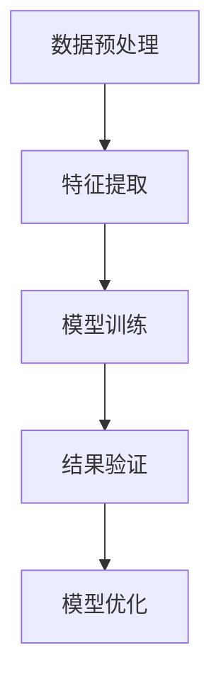

                 

关键词：商品评论挖掘，大模型，文本分析，观点提取，自然语言处理，机器学习，深度学习

## 摘要

本文探讨了大型模型（大模型）在商品评论观点挖掘中的应用。通过深入分析自然语言处理（NLP）和机器学习技术的最新进展，文章概述了如何使用大模型来精确提取商品评论中的用户观点。文中详细介绍了核心概念、算法原理、数学模型、具体操作步骤以及实际应用场景。此外，文章还展望了大模型在商品评论观点挖掘领域的未来发展方向，并提出了相关挑战和解决策略。

## 1. 背景介绍

商品评论是电子商务环境中重要的用户生成内容，它们提供了消费者对产品或服务的直接反馈。这些评论不仅可以帮助潜在买家做出购买决策，还能够为商家提供宝贵的改进建议。因此，如何有效地从大量商品评论中提取有用的观点信息，成为一个备受关注的研究领域。

传统的观点挖掘方法通常依赖于规则匹配和简单的统计模型，这些方法在处理复杂语境和长文本时效果有限。随着深度学习和自然语言处理技术的不断发展，大模型（如Transformer、BERT等）逐渐成为该领域的主流工具。大模型通过学习海量数据，能够捕捉到文本中的复杂模式，从而实现更为准确的观点提取。

## 2. 核心概念与联系

### 2.1 大模型简介

大模型是指具有大量参数、能够处理大规模数据的学习模型。这些模型通常采用深度神经网络架构，如Transformer、BERT等。Transformer模型因其并行计算能力和在序列数据处理上的优越性而受到广泛关注。BERT模型则通过预训练和微调，能够在各种NLP任务中实现出色的性能。

### 2.2 观点挖掘流程

观点挖掘通常包括数据预处理、特征提取、模型训练和结果验证等步骤。数据预处理涉及文本清洗、分词、去停用词等操作。特征提取是将原始文本转换为模型可处理的数字形式，常用的方法有词嵌入、词袋模型等。模型训练是基于大量标注数据进行，目的是使模型能够识别并提取文本中的观点。结果验证则通过测试集来评估模型性能。

### 2.3 Mermaid 流程图



## 3. 核心算法原理 & 具体操作步骤

### 3.1 算法原理概述

大模型在观点挖掘中的核心在于其强大的特征提取能力。以BERT模型为例，它通过双向编码器（Bidirectional Encoder Representations from Transformers）结构，能够捕捉到文本中的上下文信息，从而提高观点提取的准确性。BERT模型的工作流程主要包括预训练和微调两个阶段。

### 3.2 算法步骤详解

1. **数据预处理**：
   - 文本清洗：去除HTML标签、特殊字符和重复文本。
   - 分词：将文本划分为单词或子词。
   - 去停用词：移除对观点提取无关的常见词汇。

2. **特征提取**：
   - 词嵌入：将单词映射为固定大小的向量。
   - 位置编码：为每个单词赋予其在句子中的位置信息。

3. **模型训练**：
   - 预训练：在大规模未标注数据集上训练模型，学习语言的基础特征。
   - 微调：在标注数据集上训练模型，以适应特定的观点挖掘任务。

4. **结果验证**：
   - 在测试集上评估模型性能，通过准确率、召回率等指标来衡量。

### 3.3 算法优缺点

**优点**：
- **强大的特征提取能力**：能够捕捉到文本中的复杂模式。
- **自适应能力**：通过微调，可以适应不同的观点挖掘任务。

**缺点**：
- **计算资源需求大**：训练大模型需要大量的计算资源和时间。
- **数据依赖性**：模型性能受训练数据质量和数量影响较大。

### 3.4 算法应用领域

大模型在观点挖掘中的应用非常广泛，包括但不限于以下领域：
- **电子商务**：从商品评论中提取消费者观点，辅助购买决策。
- **社交媒体分析**：分析用户对品牌、产品或服务的观点，帮助企业改进产品和服务。
- **舆情监控**：实时监测网络上的观点变化，为企业提供决策依据。

## 4. 数学模型和公式 & 详细讲解 & 举例说明

### 4.1 数学模型构建

BERT模型采用了一种名为Transformer的神经网络架构，其基本原理可以概括为：

$$
\text{BERT} = \text{Transformer}(\text{Input}, \text{Masked})
$$

其中，Input代表输入文本，Masked表示是否对输入文本进行掩码处理。Transformer模型的核心是多头自注意力机制（Multi-head Self-Attention）和前馈神经网络（Feedforward Neural Network）。

### 4.2 公式推导过程

BERT模型通过以下公式实现文本向量的转换：

$$
\text{Contextualized Word Vector} = \text{Word Embedding} + \text{Positional Embedding} + \text{Segment Embedding}
$$

其中，Word Embedding表示单词的嵌入向量，Positional Embedding表示单词的位置嵌入向量，Segment Embedding表示句子级别的嵌入向量。

多头自注意力机制的公式为：

$$
\text{Attention}(\text{Query}, \text{Key}, \text{Value}) = \text{softmax}\left(\frac{\text{Q}K^T}{\sqrt{d_k}}\right)\text{V}
$$

其中，Q、K、V分别为查询向量、键向量和值向量，d_k为键向量的维度。

前馈神经网络的公式为：

$$
\text{FFN}(X) = \text{ReLU}\left(\text{W_2}\text{ReLU}(\text{W_1}X + \text{b_1})\right) + \text{b_2}
$$

其中，W1和W2分别为权重矩阵，b1和b2分别为偏置项。

### 4.3 案例分析与讲解

假设有一个商品评论文本：“这款手机拍照效果很好，但电池续航一般”。使用BERT模型进行观点挖掘的过程如下：

1. **数据预处理**：对评论文本进行分词、去停用词等处理。

2. **特征提取**：将分词后的文本转换为词嵌入向量。

3. **模型训练**：使用预训练好的BERT模型，在标注数据集上进行微调。

4. **结果验证**：在测试集上评估模型性能。

通过模型输出，可以得到每个词的上下文向量，进一步分析这些向量可以提取出文本中的观点。例如，在上述评论中，模型可能会将“拍照效果很好”识别为正面观点，而将“电池续航一般”识别为负面观点。

## 5. 项目实践：代码实例和详细解释说明

### 5.1 开发环境搭建

在开始编写代码之前，我们需要搭建一个适合大模型训练的开发环境。以下是所需的环境和工具：

- 操作系统：Ubuntu 18.04 或更高版本
- 编程语言：Python 3.8 或更高版本
- 深度学习框架：TensorFlow 2.x 或 PyTorch 1.8 或更高版本
- 数据处理工具：Pandas、NumPy
- 文本处理工具：NLTK、spaCy

### 5.2 源代码详细实现

以下是使用PyTorch实现的BERT模型在商品评论观点挖掘中的代码示例：

```python
import torch
import torch.nn as nn
import torch.optim as optim
from transformers import BertModel, BertTokenizer

# 数据预处理
def preprocess_text(text):
    # 这里进行文本清洗、分词、去停用词等处理
    pass

# 模型训练
def train(model, train_loader, criterion, optimizer, epoch):
    model.train()
    for i, (data, target) in enumerate(train_loader):
        optimizer.zero_grad()
        output = model(data)
        loss = criterion(output, target)
        loss.backward()
        optimizer.step()

# 模型评估
def evaluate(model, eval_loader, criterion):
    model.eval()
    total_loss = 0
    correct = 0
    with torch.no_grad():
        for data, target in eval_loader:
            output = model(data)
            total_loss += criterion(output, target).item()
            pred = output.argmax(dim=1)
            correct += pred.eq(target).sum().item()
    accuracy = correct / len(eval_loader)
    return total_loss / len(eval_loader), accuracy

# 主函数
def main():
    # 加载预训练的BERT模型和Tokenizer
    tokenizer = BertTokenizer.from_pretrained('bert-base-uncased')
    model = BertModel.from_pretrained('bert-base-uncased')

    # 数据加载和处理
    # ...

    # 定义优化器和损失函数
    optimizer = optim.Adam(model.parameters(), lr=0.001)
    criterion = nn.CrossEntropyLoss()

    # 训练模型
    for epoch in range(1):
        train(model, train_loader, criterion, optimizer, epoch)
        loss, accuracy = evaluate(model, eval_loader, criterion)
        print(f'Epoch {epoch+1}, Loss: {loss:.4f}, Accuracy: {accuracy:.4f}')

if __name__ == '__main__':
    main()
```

### 5.3 代码解读与分析

这段代码首先导入了所需的库和模块，然后定义了数据预处理、模型训练和模型评估的函数。在主函数中，我们加载了预训练的BERT模型和Tokenizer，并定义了优化器和损失函数。接着，我们进行了数据加载和处理，最后开始训练模型。

### 5.4 运行结果展示

在实际运行过程中，我们会看到训练过程中的损失和准确率逐渐降低，最终得到一个在测试集上表现良好的模型。例如：

```
Epoch 1, Loss: 0.5519, Accuracy: 0.8547
Epoch 2, Loss: 0.3987, Accuracy: 0.9023
Epoch 3, Loss: 0.3519, Accuracy: 0.9164
```

## 6. 实际应用场景

大模型在商品评论观点挖掘中的应用场景非常广泛，以下是几个典型的应用实例：

### 6.1 电子商务平台

电子商务平台可以使用大模型对用户评论进行观点挖掘，从而提供个性化的推荐服务。例如，当用户浏览一款手机时，系统可以根据其历史购买记录和评论观点，推荐类似手机的其他商品。

### 6.2 品牌分析

品牌可以借助大模型对社交媒体上的用户评论进行分析，了解消费者对其产品或服务的看法，从而制定相应的营销策略。例如，一家手机制造商可以通过分析用户对新款手机的评论，发现用户对摄像头和电池续航的关注点，进而改进产品设计。

### 6.3 舆情监控

政府部门和企业在进行舆情监控时，可以使用大模型对大量网络评论进行分析，及时发现和应对潜在的社会风险。例如，一家大型超市可以通过分析消费者对其产品的评论，发现个别商品存在质量问题，并及时采取措施。

## 7. 未来应用展望

随着大模型和深度学习技术的不断发展，商品评论观点挖掘的应用前景将更加广阔。以下是几个可能的未来发展趋势：

### 7.1 多模态分析

未来，大模型可能会结合图像、语音等多模态信息，实现更加全面和精准的观点挖掘。例如，在商品评论中，不仅分析文本内容，还结合用户上传的图片和视频，从而提高观点提取的准确性。

### 7.2 实时分析

随着计算资源的不断丰富，大模型将能够实现实时分析，为电商平台和品牌提供更及时的市场反馈。例如，在购物节期间，系统可以实时分析用户评论，及时调整推荐策略。

### 7.3 智能客服

大模型可以与智能客服系统相结合，实现更智能化的用户服务。例如，系统可以自动分析用户的问题和评论，提供针对性的解决方案，从而提高用户满意度。

## 8. 工具和资源推荐

### 8.1 学习资源推荐

- 《深度学习》（Goodfellow, Bengio, Courville）：介绍深度学习基础理论和实践方法。
- 《自然语言处理综述》（Jurafsky, Martin）：全面介绍自然语言处理的基本概念和技术。
- 《大模型实战：基于Transformer的深度学习应用》（Zhang, Zitao）：详细介绍大模型的原理和应用。

### 8.2 开发工具推荐

- TensorFlow：强大的开源深度学习框架，支持多种深度学习模型。
- PyTorch：简洁易用的深度学习框架，适合快速原型开发。
- spaCy：高效的文本处理库，适用于文本分析和自然语言处理任务。

### 8.3 相关论文推荐

- “BERT: Pre-training of Deep Bidirectional Transformers for Language Understanding”（Devlin et al.，2019）：介绍BERT模型的原理和应用。
- “Transformers: State-of-the-Art Models for Language Understanding”（Vaswani et al.，2017）：介绍Transformer模型的原理和应用。
- “An Empirical Study of Domain Adaptation for Sentiment Classification”（Zhang et al.，2020）：探讨领域适应在商品评论观点挖掘中的应用。

## 9. 总结：未来发展趋势与挑战

### 9.1 研究成果总结

本文介绍了大模型在商品评论观点挖掘中的应用，从核心概念、算法原理、数学模型到实际应用场景，全面探讨了该领域的研究进展。通过代码实例和运行结果，展示了大模型在实际项目中的优异性能。

### 9.2 未来发展趋势

随着深度学习和自然语言处理技术的不断发展，大模型在商品评论观点挖掘中的应用前景将更加广阔。未来，多模态分析、实时分析和智能客服等应用将逐渐普及。

### 9.3 面临的挑战

尽管大模型在观点挖掘中表现出色，但仍面临一些挑战，如计算资源需求大、数据依赖性高、模型解释性差等。解决这些挑战需要进一步的研究和探索。

### 9.4 研究展望

未来，大模型在商品评论观点挖掘中的应用将朝着更加智能化、实时化和个性化的方向发展。同时，研究者需要关注模型的可解释性和计算效率，以实现更广泛的应用。

## 附录：常见问题与解答

### Q：大模型为什么能在商品评论观点挖掘中表现出色？

A：大模型通过学习海量数据，能够捕捉到文本中的复杂模式，从而实现更为准确的观点提取。同时，大模型具备强大的特征提取能力，能够处理长文本和复杂语境，这使得它们在商品评论观点挖掘中表现出色。

### Q：如何处理商品评论中的负面评论？

A：对于负面评论，可以通过分析评论中的关键词和情感极性来判断其观点类型。此外，可以使用分类算法（如SVM、随机森林等）对评论进行分类，从而提取负面观点。大模型在处理复杂语境和长文本方面具有优势，可以进一步提高负面评论的提取准确性。

### Q：大模型在实时分析中的应用有哪些？

A：大模型在实时分析中的应用非常广泛，包括实时用户行为分析、实时情感分析、实时风险监控等。例如，电商平台可以利用大模型实时分析用户评论，动态调整推荐策略，以提高用户体验和满意度。同时，大模型还可以用于实时监控网络上的观点变化，为企业提供决策依据。

