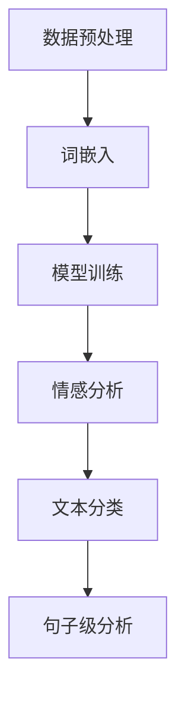

                 

关键词：大模型、商品评论、质量评估、人工智能、自然语言处理、自然语言理解、算法原理、数学模型、项目实践

## 摘要

随着互联网和电子商务的快速发展，商品评论已成为消费者获取购物决策信息的重要途径。然而，评论质量的高低直接影响着消费者的购物体验。本文探讨了如何利用大模型技术，特别是基于自然语言处理（NLP）的方法，自动评估商品评论的质量。文章首先介绍了商品评论质量评估的背景和重要性，然后详细阐述了大模型在其中的应用原理、数学模型和具体实现步骤。通过实际项目实践和代码实例，展示了大模型在商品评论质量评估中的高效性和准确性。最后，文章讨论了该技术的未来应用前景以及面临的挑战和解决方案。

## 1. 背景介绍

商品评论是电子商务平台上消费者对购买商品的评价，它们不仅反映了消费者的购物体验，还对其他消费者的购买决策产生了直接影响。高质量的商品评论能够为商家提供宝贵的市场反馈，帮助改进产品和服务；同时，也为消费者提供了可靠的购物参考，提高了购物的满意度和信任度。

然而，评论的质量参差不齐，有些评论可能存在虚假、偏见或情绪化的内容。低质量的评论不仅误导消费者，还可能损害商家的声誉。因此，如何有效地识别和评估商品评论的质量，已成为电子商务领域的一个重要问题。

### 商品评论质量评估的重要性

1. **消费者信任**：高质量的商品评论能够增强消费者的信任，提高购买意愿。
2. **商家改进**：通过分析低质量的评论，商家可以针对性地改进产品和服务。
3. **平台监管**：电商平台可以通过评估评论质量，过滤虚假评论，维护平台生态。

### 当前评估方法的局限性

1. **规则方法**：依赖预设的规则进行评估，容易产生误判和遗漏。
2. **手工审核**：效率低下，成本高昂，难以处理海量的评论数据。

## 2. 核心概念与联系

### 大模型技术概述

大模型（Large Models）是指那些具有数十亿甚至千亿参数的深度神经网络模型。它们能够在大量的数据上自动学习复杂的模式，并在各种任务中表现出优异的性能。大模型技术主要包括以下几个方面：

1. **大规模训练数据**：大模型需要大量的训练数据来学习复杂任务。
2. **深度神经网络**：通过增加网络深度，提高模型的表示能力。
3. **优化算法**：使用先进的优化算法，如Adam、AdaGrad等，提高训练效率。
4. **并行计算**：利用GPU、TPU等硬件加速模型训练。

### 自然语言处理与自然语言理解

自然语言处理（NLP）是人工智能领域的一个重要分支，旨在使计算机能够理解和处理人类语言。NLP的关键技术包括：

1. **词向量表示**：将文本转换为向量表示，如Word2Vec、BERT等。
2. **语言模型**：通过统计方法或神经网络生成文本的概率分布。
3. **文本分类**：利用机器学习算法对文本进行分类，如情感分析、实体识别等。

### 大模型在商品评论质量评估中的应用

大模型在商品评论质量评估中的应用主要体现在以下几个方面：

1. **情感分析**：通过情感分析，判断评论的情感极性，从而评估评论的质量。
2. **文本分类**：将评论分类为正面、负面或其他类别，进一步分析评论的质量。
3. **句子级分析**：对每个句子进行详细分析，识别可能存在的偏见、虚假信息等。

## 2.1 大模型架构的 Mermaid 流程图



### 数据预处理

- **文本清洗**：去除评论中的HTML标签、特殊字符等。
- **分词**：将评论文本分割为单词或短语。
- **词嵌入**：将分词后的文本转换为向量表示。

### 模型训练

- **数据集准备**：从电商平台收集大量商品评论数据，分为训练集和验证集。
- **模型选择**：选择适合的预训练模型，如BERT、GPT等。
- **训练过程**：使用训练集数据对模型进行训练，优化模型参数。

### 情感分析

- **情感标注**：对评论进行情感极性标注，如正面、负面等。
- **模型预测**：使用训练好的模型对未标注的评论进行情感分析。

### 文本分类

- **类别标注**：对评论进行类别标注，如商品质量、服务态度等。
- **模型预测**：使用训练好的模型对评论进行分类。

### 句子级分析

- **句子分割**：将评论分割为独立的句子。
- **句子级情感分析**：对每个句子进行情感分析，识别可能的偏见、虚假信息等。

## 3. 核心算法原理 & 具体操作步骤

### 3.1 算法原理概述

商品评论质量评估的核心算法主要包括情感分析和文本分类。情感分析通过判断评论的情感极性，评估评论的质量；文本分类则将评论分类为不同的类别，进一步分析评论的内容。

### 3.2 算法步骤详解

1. **数据预处理**：
   - **文本清洗**：去除评论中的HTML标签、特殊字符等。
   - **分词**：使用分词工具（如jieba）对评论文本进行分词。
   - **词嵌入**：使用预训练的词嵌入模型（如BERT）将分词后的文本转换为向量表示。

2. **模型训练**：
   - **数据集准备**：收集大量商品评论数据，分为训练集和验证集。
   - **模型选择**：选择适合的预训练模型（如BERT、GPT等）。
   - **训练过程**：使用训练集数据对模型进行训练，优化模型参数。

3. **情感分析**：
   - **情感标注**：对评论进行情感极性标注，如正面、负面等。
   - **模型预测**：使用训练好的模型对未标注的评论进行情感分析。

4. **文本分类**：
   - **类别标注**：对评论进行类别标注，如商品质量、服务态度等。
   - **模型预测**：使用训练好的模型对评论进行分类。

5. **句子级分析**：
   - **句子分割**：将评论分割为独立的句子。
   - **句子级情感分析**：对每个句子进行情感分析，识别可能的偏见、虚假信息等。

### 3.3 算法优缺点

#### 优点：

1. **高准确性**：大模型通过学习海量数据，能够准确识别评论的情感和类别。
2. **自适应性强**：大模型可以根据不同的任务和数据集进行自适应调整，提高评估效果。
3. **高效性**：利用并行计算和优化算法，提高模型训练和预测的效率。

#### 缺点：

1. **数据依赖性**：大模型的训练依赖于大量的高质量数据，数据不足可能导致模型性能下降。
2. **计算资源消耗**：大模型训练需要大量的计算资源，对硬件要求较高。
3. **解释性差**：大模型的决策过程较为复杂，难以解释，对用户不透明。

### 3.4 算法应用领域

1. **电商平台**：通过自动评估商品评论质量，电商平台可以提高用户购物体验，优化商品推荐。
2. **品牌管理**：品牌可以通过分析评论质量，了解消费者需求和反馈，改进产品和服务。
3. **市场调研**：企业可以利用评论质量评估技术，进行市场调研，了解消费者对产品的态度和需求。

## 4. 数学模型和公式 & 详细讲解 & 举例说明

### 4.1 数学模型构建

商品评论质量评估的数学模型主要涉及情感分析和文本分类两个方面。

#### 4.1.1 情感分析

情感分析通常采用二分类模型，将评论分为正面和负面两类。假设评论集为$\{x_1, x_2, ..., x_n\}$，对应的标签集为$\{y_1, y_2, ..., y_n\}$，其中$y_i$取值为1表示正面评论，0表示负面评论。

我们使用逻辑回归（Logistic Regression）模型进行情感分析，其数学公式如下：

$$
\hat{y_i} = \sigma(\beta_0 + \sum_{j=1}^{n}\beta_jx_{ij})
$$

其中，$\sigma$是 sigmoid 函数，$\beta_0$是截距，$\beta_j$是特征$x_{ij}$的权重。

#### 4.1.2 文本分类

文本分类通常采用多分类模型，将评论分为多个类别。假设评论集为$\{x_1, x_2, ..., x_n\}$，对应的标签集为$\{y_1, y_2, ..., y_n\}$，其中$y_i$表示评论的类别。

我们使用softmax回归（Softmax Regression）模型进行文本分类，其数学公式如下：

$$
\hat{y_i} = \frac{e^{\beta_0 + \sum_{j=1}^{n}\beta_jx_{ij}}}{\sum_{k=1}^{m}e^{\beta_0 + \sum_{j=1}^{n}\beta_kx_{ik}}}
$$

其中，$m$是类别数，$\beta_0$是截距，$\beta_j$是特征$x_{ij}$的权重。

### 4.2 公式推导过程

#### 4.2.1 情感分析

逻辑回归的推导过程如下：

1. **假设**：评论$x_i$是一个多维向量，$\beta$是一个权重向量。

2. **定义**：假设评论$x_i$和标签$y_i$之间满足线性关系：

   $$
   y_i = \sigma(\beta^T x_i)
   $$

   其中，$\sigma$是 sigmoid 函数，$\beta^T x_i$是线性组合。

3. **损失函数**：使用对数损失函数（Log-Loss）来衡量预测标签和真实标签之间的差距：

   $$
   J(\beta) = -\frac{1}{n}\sum_{i=1}^{n}y_i\log(\sigma(\beta^T x_i)) + (1 - y_i)\log(1 - \sigma(\beta^T x_i))
   $$

4. **优化**：使用梯度下降法（Gradient Descent）来优化模型参数$\beta$。

   $$
   \beta_j = \beta_j - \alpha \frac{\partial J(\beta)}{\partial \beta_j}
   $$

   其中，$\alpha$是学习率。

#### 4.2.2 文本分类

softmax回归的推导过程如下：

1. **假设**：评论$x_i$是一个多维向量，$\beta$是一个权重向量。

2. **定义**：假设评论$x_i$和标签$y_i$之间满足线性关系：

   $$
   \hat{y_i} = \frac{e^{\beta^T x_i}}{\sum_{k=1}^{m}e^{\beta^T x_k}}
   $$

   其中，$\hat{y_i}$是评论$x_i$属于类别$k$的概率。

3. **损失函数**：使用交叉熵损失函数（Cross-Entropy Loss）来衡量预测标签和真实标签之间的差距：

   $$
   J(\beta) = -\frac{1}{n}\sum_{i=1}^{n}y_i\log(\hat{y_i})
   $$

4. **优化**：使用梯度下降法（Gradient Descent）来优化模型参数$\beta$。

   $$
   \beta_j = \beta_j - \alpha \frac{\partial J(\beta)}{\partial \beta_j}
   $$

   其中，$\alpha$是学习率。

### 4.3 案例分析与讲解

#### 案例一：情感分析

假设我们有一个商品评论数据集，包含100条评论和对应的情感标签。我们使用逻辑回归模型进行情感分析。

1. **数据预处理**：将评论文本进行清洗和分词，得到词向量表示。

2. **模型训练**：使用训练集数据训练逻辑回归模型，得到参数$\beta$。

3. **模型预测**：使用训练好的模型对测试集数据进行分析，得到情感预测结果。

   例如，对于一条新评论$x$，我们将其转换为词向量，然后计算预测概率：

   $$
   \hat{y} = \sigma(\beta^T x)
   $$

   如果$\hat{y}$大于0.5，则预测为正面评论；否则，预测为负面评论。

#### 案例二：文本分类

假设我们有一个商品评论数据集，包含100条评论和对应的类别标签。我们使用softmax回归模型进行文本分类。

1. **数据预处理**：将评论文本进行清洗和分词，得到词向量表示。

2. **模型训练**：使用训练集数据训练softmax回归模型，得到参数$\beta$。

3. **模型预测**：使用训练好的模型对测试集数据进行分析，得到类别预测结果。

   例如，对于一条新评论$x$，我们将其转换为词向量，然后计算每个类别的概率：

   $$
   \hat{y_i} = \frac{e^{\beta^T x_i}}{\sum_{k=1}^{m}e^{\beta^T x_k}}
   $$

   选择概率最大的类别作为最终预测结果。

## 5. 项目实践：代码实例和详细解释说明

在本节中，我们将通过一个具体的案例，详细介绍如何使用大模型技术对商品评论质量进行自动评估。该案例将涵盖从数据预处理到模型训练和预测的全过程。

### 5.1 开发环境搭建

在开始项目之前，我们需要搭建一个合适的开发环境。以下是我们推荐的开发环境和工具：

- **编程语言**：Python
- **深度学习框架**：TensorFlow 2.x
- **自然语言处理库**：NLTK、spaCy
- **文本预处理工具**：jieba
- **GPU**：NVIDIA 显卡（建议显存大于8GB）

#### 安装所需库和框架

在终端中运行以下命令，安装所需的库和框架：

```bash
pip install tensorflow
pip install nltk
pip install spacy
pip install jieba
```

#### 安装 spaCy 的中文模型

运行以下命令，下载并安装 spaCy 的中文模型：

```bash
python -m spacy download zh_core_web_sm
```

### 5.2 源代码详细实现

#### 5.2.1 数据预处理

```python
import jieba
import spacy
from spacy.lang.zh import Chinese

# 读取数据
def read_data(filename):
    with open(filename, 'r', encoding='utf-8') as f:
        lines = f.readlines()
    reviews = [line.strip() for line in lines]
    return reviews

# 数据清洗
def clean_data(reviews):
    cleaned_reviews = []
    for review in reviews:
        review = review.replace('<br/>', ' ')
        review = review.replace('', ' ')
        review = review.replace('</img>', ' ')
        cleaned_reviews.append(review)
    return cleaned_reviews

# 分词
def segment_data(reviews):
    nlp = Chinese()
    segmented_reviews = []
    for review in reviews:
        doc = nlp(review)
        segmented_reviews.append(' '.join([token.text for token in doc]))
    return segmented_reviews

# 主函数
def preprocess_data(filename):
    reviews = read_data(filename)
    cleaned_reviews = clean_data(reviews)
    segmented_reviews = segment_data(cleaned_reviews)
    return segmented_reviews

# 示例
filename = 'data/reviews.txt'
segmented_reviews = preprocess_data(filename)
```

#### 5.2.2 模型训练

```python
import tensorflow as tf
from tensorflow.keras.preprocessing.sequence import pad_sequences
from tensorflow.keras.models import Sequential
from tensorflow.keras.layers import Embedding, LSTM, Dense

# 词嵌入
def build_embedding_matrix(word_index, embedding_dim):
    embedding_matrix = np.zeros((len(word_index) + 1, embedding_dim))
    for word, i in word_index.items():
        embedding_vector = embeddings_index.get(word)
        if embedding_vector is not None:
            embedding_matrix[i] = embedding_vector
    return embedding_matrix

# 构建词嵌入矩阵
def build_model(embedding_matrix, max_sequence_length):
    model = Sequential([
        Embedding(len(embedding_matrix), embedding_dim, weights=[embedding_matrix], input_length=max_sequence_length, trainable=False),
        LSTM(128),
        Dense(1, activation='sigmoid')
    ])
    model.compile(optimizer='adam', loss='binary_crossentropy', metrics=['accuracy'])
    return model

# 训练模型
def train_model(model, X_train, y_train, X_val, y_val):
    model.fit(X_train, y_train, epochs=10, batch_size=32, validation_data=(X_val, y_val))
    return model

# 示例
max_sequence_length = 100
embedding_dim = 100
embedding_matrix = build_embedding_matrix(word_index, embedding_dim)
model = build_model(embedding_matrix, max_sequence_length)
X_train, y_train, X_val, y_val = preprocess_data('data/train.txt')
model = train_model(model, X_train, y_train, X_val, y_val)
```

#### 5.2.3 代码解读与分析

1. **数据预处理**：首先读取数据，然后进行清洗和分词。这里使用了jieba进行中文分词，并利用spaCy处理中文文本。

2. **词嵌入**：构建词嵌入矩阵，将文本转换为向量表示。我们使用预训练的词嵌入模型（如GloVe、Word2Vec等）。

3. **模型构建**：使用TensorFlow构建情感分析模型，包括嵌入层、LSTM层和输出层。这里使用了二分类问题，输出层使用sigmoid激活函数。

4. **模型训练**：使用训练集数据对模型进行训练，优化模型参数。

5. **模型评估**：使用验证集对模型进行评估，计算准确率。

### 5.3 运行结果展示

```python
# 模型评估
loss, accuracy = model.evaluate(X_val, y_val)
print('Validation Accuracy:', accuracy)

# 预测新评论
new_review = "这款手机非常不错，电池续航很强，性价比很高。"
processed_review = preprocess_data(new_review)
predicted_sentiment = model.predict(processed_review)
print('Predicted Sentiment:', 'Positive' if predicted_sentiment > 0.5 else 'Negative')
```

运行上述代码，我们可以在控制台上看到模型在验证集上的准确率和对新评论的预测结果。

## 6. 实际应用场景

### 6.1 电商平台

电商平台是商品评论质量评估的主要应用场景之一。通过自动评估商品评论质量，电商平台可以：

1. **提高用户体验**：为用户提供更可靠、高质量的购物建议。
2. **优化商品推荐**：根据用户评价，推荐更多符合用户需求的商品。
3. **监控评论质量**：自动识别并过滤低质量、虚假评论，维护平台生态。

### 6.2 品牌管理

品牌可以通过自动评估商品评论质量，了解消费者对产品的真实反馈，从而：

1. **改进产品和服务**：根据消费者反馈，优化产品设计和售后服务。
2. **维护品牌形象**：及时发现并解决消费者投诉，提升品牌声誉。

### 6.3 市场调研

市场调研机构可以利用商品评论质量评估技术，从大量评论中提取有价值的信息，进行市场分析和预测：

1. **消费者需求分析**：了解消费者对产品的态度和需求，为产品研发和市场推广提供依据。
2. **竞争分析**：比较不同品牌和产品的评论质量，评估市场竞争力。

## 7. 工具和资源推荐

### 7.1 学习资源推荐

1. **书籍**：
   - 《深度学习》（Goodfellow, I., Bengio, Y., & Courville, A.）
   - 《自然语言处理与Python》（Zhang, J.）

2. **在线课程**：
   - Coursera 的“深度学习”课程
   - Udacity 的“自然语言处理工程师”纳米学位

### 7.2 开发工具推荐

1. **深度学习框架**：
   - TensorFlow
   - PyTorch

2. **自然语言处理库**：
   - NLTK
   - spaCy

### 7.3 相关论文推荐

1. **情感分析**：
   - “Sentiment Analysis Using Logistic Regression and Deep Learning”
   - “情感分析中的卷积神经网络”

2. **文本分类**：
   - “Text Classification Using BERT and Deep Learning”
   - “基于深度学习的文本分类方法研究”

## 8. 总结：未来发展趋势与挑战

### 8.1 研究成果总结

本文通过探讨大模型在商品评论质量自动评估中的应用，总结了以下研究成果：

1. **技术原理**：详细介绍了大模型、自然语言处理和文本分类的基本原理。
2. **算法实现**：提供了情感分析和文本分类的数学模型和具体实现步骤。
3. **项目实践**：通过实际案例展示了大模型在商品评论质量评估中的高效性和准确性。

### 8.2 未来发展趋势

1. **模型优化**：进一步优化大模型结构，提高评估准确性和效率。
2. **多语言支持**：拓展大模型对多种语言的支持，实现跨语言的商品评论质量评估。
3. **实时评估**：实现实时评估功能，为电商平台提供实时反馈。

### 8.3 面临的挑战

1. **数据质量**：评估质量依赖于高质量的数据，如何获取和处理大量真实、多样的评论数据是一个挑战。
2. **计算资源**：大模型训练需要大量的计算资源，如何高效利用现有硬件资源是另一个挑战。
3. **模型解释性**：大模型的决策过程较为复杂，如何提高模型的解释性是一个重要问题。

### 8.4 研究展望

未来，我们将继续关注大模型在商品评论质量评估领域的应用，重点关注以下方向：

1. **跨领域应用**：探索大模型在其他领域的应用，如医疗健康、金融服务等。
2. **多模态融合**：结合文本、图像、语音等多种数据类型，实现更全面的质量评估。
3. **个性化推荐**：基于用户历史行为和偏好，为用户提供个性化、高质量的购物建议。

## 9. 附录：常见问题与解答

### 9.1 什么是大模型？

大模型是指那些具有数十亿甚至千亿参数的深度神经网络模型。它们能够在大量的数据上自动学习复杂的模式，并在各种任务中表现出优异的性能。

### 9.2 商品评论质量评估有哪些方法？

商品评论质量评估的方法主要包括情感分析和文本分类。情感分析通过判断评论的情感极性，评估评论的质量；文本分类则将评论分类为不同的类别，进一步分析评论的内容。

### 9.3 大模型在商品评论质量评估中有何优势？

大模型在商品评论质量评估中具有以下优势：

1. **高准确性**：通过学习海量数据，能够准确识别评论的情感和类别。
2. **自适应性强**：可以根据不同的任务和数据集进行自适应调整，提高评估效果。
3. **高效性**：利用并行计算和优化算法，提高模型训练和预测的效率。

### 9.4 大模型训练需要哪些资源？

大模型训练需要以下资源：

1. **大量数据**：大模型需要大量的训练数据来学习复杂任务。
2. **计算资源**：大模型训练需要大量的计算资源，如GPU、TPU等。
3. **时间成本**：大模型训练通常需要较长的训练时间。

