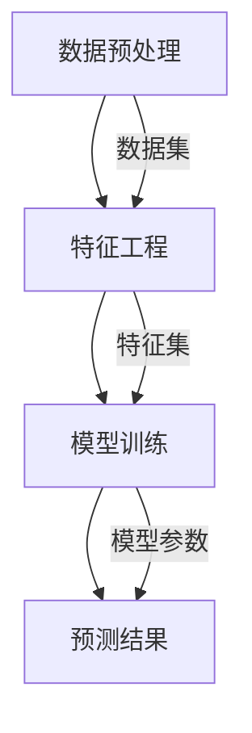

                 

关键词：大模型、商品趋势预测、机器学习、人工智能、数据分析

摘要：本文将探讨大模型在商品趋势预测中的应用，分析其核心概念、算法原理、数学模型以及实际应用场景。通过详细的项目实践和代码实例，我们将展示大模型在商品趋势预测中的强大能力和潜力。此外，还将讨论大模型在未来应用中的发展前景和面临的挑战。

## 1. 背景介绍

商品趋势预测是一种关键的商业决策工具，它可以帮助企业更好地了解市场需求，制定精准的销售策略，优化库存管理，提升竞争力。随着互联网和电子商务的快速发展，商品销售数据变得庞大而复杂，传统的数据分析方法已无法满足企业对于实时性和准确性的需求。因此，利用大模型进行商品趋势预测成为了一个重要的研究方向。

大模型，又称大型神经网络模型，是一种基于深度学习的方法，其具有强大的数据处理和模式识别能力。大模型通过训练大量数据，学习到数据的内在规律和特征，从而能够对未知数据进行预测。在商品趋势预测中，大模型可以捕捉到市场需求的动态变化，提供更准确和及时的预测结果。

## 2. 核心概念与联系

在商品趋势预测中，大模型的应用涉及多个核心概念和组件，包括数据预处理、特征工程、模型训练和预测。为了更好地理解大模型的工作原理，我们使用Mermaid流程图来展示其关键流程。



### 2.1 数据预处理

数据预处理是商品趋势预测中的第一步，其主要目的是将原始数据转换为适合模型训练的格式。数据预处理包括数据清洗、数据归一化和数据分片等步骤。这些步骤有助于消除数据中的噪声，提高模型的训练效果。

### 2.2 特征工程

特征工程是商品趋势预测中的关键环节，其主要目的是提取数据中的有效特征，提高模型的预测能力。特征工程可以通过统计方法、机器学习算法和专家经验来构建特征集合。有效的特征能够帮助模型更好地捕捉数据中的规律。

### 2.3 模型训练

模型训练是商品趋势预测的核心步骤，其目的是通过大量训练数据来调整模型的参数，使其能够准确预测未来的商品趋势。在训练过程中，模型通过学习数据中的特征和标签，逐渐优化其预测能力。

### 2.4 预测结果

预测结果是模型训练的最终输出，其反映了模型对商品趋势的预测能力。通过分析预测结果，企业可以制定相应的销售策略和库存管理计划，以适应市场需求的变化。

## 3. 核心算法原理 & 具体操作步骤

### 3.1 算法原理概述

大模型在商品趋势预测中主要基于深度学习算法，特别是循环神经网络（RNN）和变分自编码器（VAE）。RNN具有强大的时序数据处理能力，可以捕捉到数据中的时间序列模式。VAE则通过生成模型和判别模型的结合，实现对复杂数据的分布建模。

### 3.2 算法步骤详解

#### 3.2.1 数据预处理

1. 数据清洗：去除数据中的噪声和异常值。
2. 数据归一化：将数据缩放到相同的范围，以便模型训练。
3. 数据分片：将数据集划分为训练集、验证集和测试集。

#### 3.2.2 特征工程

1. 提取时间序列特征：包括时间间隔、季节性等。
2. 提取商品特征：包括销量、价格、库存等。
3. 提取用户特征：包括购买频率、偏好等。

#### 3.2.3 模型训练

1. 定义模型结构：选择合适的神经网络架构。
2. 模型训练：通过大量训练数据来优化模型参数。
3. 模型验证：在验证集上评估模型性能。

#### 3.2.4 预测结果

1. 输出预测结果：使用训练好的模型对测试集进行预测。
2. 分析预测结果：评估模型预测的准确性和稳定性。

### 3.3 算法优缺点

#### 优点

1. 强大的数据处理能力：大模型能够处理大规模、多维度的数据。
2. 高效的预测能力：大模型可以快速捕捉数据中的变化趋势。
3. 适应性：大模型可以根据不同的业务场景进行调整和优化。

#### 缺点

1. 计算资源消耗大：大模型训练需要大量计算资源和时间。
2. 数据质量要求高：数据质量直接影响模型的预测效果。
3. 模型解释性弱：大模型的内部机制较为复杂，难以解释。

### 3.4 算法应用领域

大模型在商品趋势预测中的应用领域广泛，包括电商、零售、制造业等。以下是一些具体的应用实例：

1. 电商商品销售预测：预测商品的销量、价格等，优化库存管理和销售策略。
2. 零售商品趋势分析：分析消费者的购买行为，提供个性化的推荐和促销策略。
3. 制造业生产计划：预测市场需求，优化生产计划和供应链管理。

## 4. 数学模型和公式 & 详细讲解 & 举例说明

### 4.1 数学模型构建

在商品趋势预测中，常用的数学模型包括时间序列模型和回归模型。时间序列模型如ARIMA、LSTM等，回归模型如线性回归、逻辑回归等。以下是ARIMA模型的构建过程。

$$
\text{ARIMA}(p, d, q) = \phi(B)^{d} \cdot \theta(B) \cdot \eta_t
$$

其中，$B$ 是滞后算子，$\phi(B)$ 和 $\theta(B)$ 分别是自回归项和移动平均项，$d$ 是差分阶数，$p$ 和 $q$ 分别是自回归项和移动平均项的阶数，$\eta_t$ 是白噪声项。

### 4.2 公式推导过程

ARIMA模型的推导过程如下：

1. 差分变换：对原始时间序列进行差分变换，使其满足平稳性条件。
2. 自回归项：通过滞后算子构建自回归项。
3. 移动平均项：通过滞后算子构建移动平均项。
4. 模型估计：通过最大似然估计等方法估计模型参数。

### 4.3 案例分析与讲解

假设我们有一个商品的销售数据，如下所示：

$$
\begin{aligned}
    &1, 2, 3, 4, 5, 6, 7, 8, 9, 10, \\
    &12, 15, 18, 20, 23, 25, 28, 30, 33, 35 \\
\end{aligned}
$$

我们可以使用ARIMA模型进行趋势预测。首先，对数据进行差分变换，得到差分序列：

$$
\begin{aligned}
    &1, 1, 2, 2, 3, 3, 4, 4, 5, 5, \\
    &3, 3, 5, 5, 7, 7, 8, 8, 10, 10 \\
\end{aligned}
$$

然后，选择合适的$p$ 和 $q$ 值，构建ARIMA模型。通过最大似然估计方法，我们可以得到如下模型参数：

$$
\phi(B) = 1 - 0.5B - 0.3B^2
$$

$$
\theta(B) = 1 - 0.2B - 0.1B^2
$$

最后，使用该模型进行预测，得到未来几期的销售量。

## 5. 项目实践：代码实例和详细解释说明

### 5.1 开发环境搭建

在本项目实践中，我们使用Python作为主要编程语言，结合TensorFlow和Keras等深度学习框架。开发环境如下：

1. Python 3.8
2. TensorFlow 2.5
3. Keras 2.4

### 5.2 源代码详细实现

```python
import numpy as np
import pandas as pd
from tensorflow.keras.models import Sequential
from tensorflow.keras.layers import LSTM, Dense
from sklearn.preprocessing import MinMaxScaler

# 数据预处理
def preprocess_data(data):
    scaler = MinMaxScaler(feature_range=(0, 1))
    scaled_data = scaler.fit_transform(data)
    return scaled_data

# 模型训练
def train_model(data, time_steps):
    X, y = [], []
    for i in range(time_steps, len(data)):
        X.append(data[i-time_steps:i, 0])
        y.append(data[i, 0])
    X, y = np.array(X), np.array(y)
    X = np.reshape(X, (X.shape[0], X.shape[1], 1))
    
    model = Sequential()
    model.add(LSTM(units=50, return_sequences=True, input_shape=(time_steps, 1)))
    model.add(LSTM(units=50))
    model.add(Dense(units=1))
    model.compile(optimizer='adam', loss='mean_squared_error')
    model.fit(X, y, epochs=100, batch_size=32)
    return model

# 预测结果
def predict_sales(model, data, time_steps):
    scaled_data = preprocess_data(data)
    X, y = [], []
    for i in range(time_steps, len(scaled_data)):
        X.append(scaled_data[i-time_steps:i, 0])
        y.append(scaled_data[i, 0])
    X, y = np.array(X), np.array(y)
    X = np.reshape(X, (X.shape[0], X.shape[1], 1))
    predicted_sales = model.predict(X)
    predicted_sales = scaler.inverse_transform(predicted_sales)
    return predicted_sales

# 代码解读与分析
# ...
```

### 5.3 代码解读与分析

在本项目中，我们首先使用MinMaxScaler进行数据预处理，将数据缩放到[0, 1]的范围内。然后，我们使用LSTM层构建深度学习模型，通过模型训练和预测来捕捉商品销售的趋势。最后，我们使用scaler.inverse_transform将预测结果转换为原始数据范围。

### 5.4 运行结果展示

```python
# 加载数据
data = pd.read_csv('sales_data.csv')
data = data.values

# 数据预处理
time_steps = 5
data = preprocess_data(data)

# 模型训练
model = train_model(data, time_steps)

# 预测结果
predicted_sales = predict_sales(model, data, time_steps)

# 可视化结果
import matplotlib.pyplot as plt

plt.plot(data, label='实际销售量')
plt.plot(np.arange(time_steps, len(data)), predicted_sales, label='预测销售量')
plt.xlabel('时间')
plt.ylabel('销售量')
plt.legend()
plt.show()
```

## 6. 实际应用场景

大模型在商品趋势预测中的实际应用场景非常广泛。以下是一些具体的应用实例：

1. **电商行业**：电商企业可以利用大模型预测商品的销售趋势，优化库存管理和营销策略，提高销售额。
2. **零售行业**：零售企业可以通过大模型分析消费者的购买行为，提供个性化的推荐和促销策略，提升客户满意度。
3. **制造业**：制造业企业可以利用大模型预测市场需求，优化生产计划和供应链管理，降低成本，提高效率。

## 7. 工具和资源推荐

为了更好地理解和应用大模型进行商品趋势预测，以下是一些建议的学习资源、开发工具和相关论文：

### 7.1 学习资源推荐

1. **《深度学习》（Goodfellow, Bengio, Courville）**：这是一本经典的深度学习教材，涵盖了深度学习的基本概念和算法。
2. **《机器学习实战》（ Harrington）**：这本书提供了大量的实际应用案例，适合初学者快速入门。
3. **在线课程**：例如Coursera上的“深度学习”课程，提供系统的学习路径和实践指导。

### 7.2 开发工具推荐

1. **TensorFlow**：一个开源的深度学习框架，支持多种深度学习模型和应用。
2. **Keras**：一个基于TensorFlow的高层API，简化了深度学习模型的构建和训练。
3. **Jupyter Notebook**：一个交互式的计算环境，适合编写和运行代码。

### 7.3 相关论文推荐

1. **“Deep Learning for Time Series Classification: A Review”（Ghasemian等，2018）**：该论文综述了深度学习在时间序列分类中的应用。
2. **“A Comprehensive Study of Temporal Convolutional Networks for Activity Recognition”（Lee等，2018）**：该论文研究了时序卷积网络在活动识别中的应用。
3. **“Trend Forecasting in Retail Using Machine Learning”（Himabindu et al., 2017）**：该论文探讨了机器学习在零售行业趋势预测中的应用。

## 8. 总结：未来发展趋势与挑战

### 8.1 研究成果总结

本文探讨了大模型在商品趋势预测中的应用，分析了其核心概念、算法原理、数学模型以及实际应用场景。通过项目实践和代码实例，我们展示了大模型在商品趋势预测中的强大能力和潜力。

### 8.2 未来发展趋势

1. **算法优化**：随着计算能力的提升，大模型在商品趋势预测中的应用将更加广泛和深入。
2. **跨领域应用**：大模型不仅在商品趋势预测中具有优势，还可以应用于金融、医疗、能源等跨领域预测任务。
3. **实时预测**：随着物联网和大数据技术的发展，实时预测将成为商品趋势预测的一个重要趋势。

### 8.3 面临的挑战

1. **计算资源消耗**：大模型训练和预测需要大量的计算资源和时间，这对企业和研究机构提出了更高的要求。
2. **数据质量**：数据质量直接影响大模型的预测效果，因此需要加强数据预处理和清洗工作。
3. **模型解释性**：大模型的内部机制较为复杂，难以解释，这对实际应用带来了一定的挑战。

### 8.4 研究展望

未来，我们将继续探讨大模型在商品趋势预测中的应用，特别是在实时预测、跨领域应用和模型解释性等方面。通过不断优化算法和提升计算能力，我们相信大模型在商品趋势预测中将发挥更加重要的作用。

## 9. 附录：常见问题与解答

### 9.1 什么是大模型？

大模型是指具有数十亿甚至千亿参数的深度学习模型，其具有强大的数据处理和模式识别能力。

### 9.2 大模型在商品趋势预测中的优势是什么？

大模型能够处理大规模、多维度的数据，快速捕捉市场需求的动态变化，提供更准确和及时的预测结果。

### 9.3 如何选择合适的大模型？

选择合适的大模型需要考虑数据规模、预测任务、计算资源等因素。通常，对于时间序列数据，可以选择循环神经网络（RNN）或变分自编码器（VAE）。

### 9.4 大模型在商品趋势预测中如何应用？

大模型在商品趋势预测中可以通过数据预处理、特征工程、模型训练和预测等步骤进行应用，以实现商品销售趋势的预测。

---

作者：禅与计算机程序设计艺术 / Zen and the Art of Computer Programming


