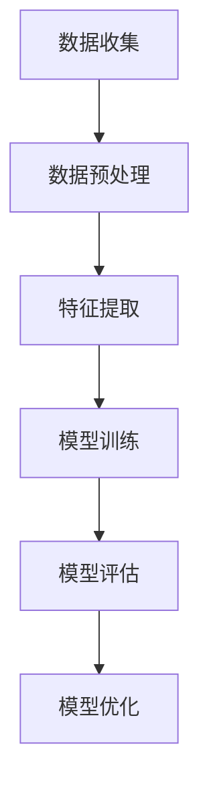

                 

关键词：大模型、商品趋势预测、人工智能、数据分析、机器学习

> 摘要：本文将探讨大模型在商品趋势预测中的应用，分析其基本原理、实现步骤、数学模型以及实际应用案例，并展望未来发展趋势和面临的挑战。

## 1. 背景介绍

在商业世界中，准确预测商品趋势对于企业制定营销策略、调整库存和生产计划具有重要意义。传统的预测方法主要依赖于历史数据和时间序列分析，虽然在一定程度上能够捕捉到一些趋势，但往往难以应对日益复杂的市场环境。随着人工智能和大数据技术的发展，大模型在商品趋势预测中的应用逐渐成为研究热点。大模型，如深度学习模型、图神经网络等，凭借其强大的学习和预测能力，为商品趋势预测提供了新的思路。

## 2. 核心概念与联系

### 2.1 大模型

大模型指的是拥有大规模参数和计算能力的机器学习模型，如深度神经网络、卷积神经网络等。这些模型通过学习大量的数据，能够自动提取特征，并进行复杂的模式识别。

### 2.2 商品趋势预测

商品趋势预测是指通过分析历史数据和当前市场情况，预测未来一段时间内商品的需求量、价格走势等。这需要对大量数据进行处理和分析，提取有用的信息。

### 2.3 大模型在商品趋势预测中的应用

大模型在商品趋势预测中的应用主要体现在以下几个方面：

- **数据预处理**：大模型需要大量的高质量数据，通过数据预处理，如清洗、归一化等，可以提高数据质量，为模型训练提供更好的基础。
- **特征提取**：大模型能够自动从数据中提取有用的特征，减少了人工干预，提高了预测的准确性。
- **模型训练**：大模型通过学习历史数据和当前市场情况，训练出一个能够预测商品趋势的模型。
- **模型评估与优化**：通过评估模型的预测性能，对模型进行调整和优化，提高预测的准确性。

## 2.4 Mermaid 流程图



## 3. 核心算法原理 & 具体操作步骤

### 3.1 算法原理概述

大模型在商品趋势预测中的核心算法主要是基于深度学习和图神经网络。深度学习通过多层神经网络的结构，能够自动提取数据的非线性特征，而图神经网络则能够更好地捕捉商品之间的关联性。

### 3.2 算法步骤详解

#### 3.2.1 数据收集

首先，需要收集大量的商品交易数据、用户行为数据、市场趋势数据等，这些数据可以通过公开数据集、企业数据源等渠道获取。

#### 3.2.2 数据预处理

对收集到的数据进行清洗、去重、归一化等处理，以提高数据质量。

#### 3.2.3 特征提取

利用深度学习和图神经网络，对处理后的数据进行特征提取，提取出与商品趋势相关的特征。

#### 3.2.4 模型训练

使用提取出的特征，通过训练算法，训练出一个能够预测商品趋势的模型。

#### 3.2.5 模型评估

通过测试集对训练好的模型进行评估，评估模型的预测准确性。

#### 3.2.6 模型优化

根据评估结果，对模型进行调整和优化，提高预测的准确性。

### 3.3 算法优缺点

#### 优点

- **强大的学习能力**：大模型能够从大量数据中自动提取特征，减少人工干预。
- **高效的预测能力**：大模型能够快速处理大量数据，提供高效的预测结果。
- **灵活的扩展性**：大模型能够适应不同的应用场景，通过调整模型结构和参数，可以适应不同的预测任务。

#### 缺点

- **数据依赖性**：大模型对数据质量有较高要求，数据质量直接影响到模型的预测准确性。
- **计算资源需求**：大模型需要大量的计算资源和存储空间，对硬件设备有较高要求。

### 3.4 算法应用领域

大模型在商品趋势预测中的应用非常广泛，可以应用于电商、零售、金融等多个领域。例如，在电商领域，大模型可以预测商品的销售趋势，帮助企业制定库存管理策略；在零售领域，大模型可以预测商品的库存需求，帮助零售商调整采购计划；在金融领域，大模型可以预测市场的走势，为投资者提供决策参考。

## 4. 数学模型和公式 & 详细讲解 & 举例说明

### 4.1 数学模型构建

大模型在商品趋势预测中的数学模型通常是基于时间序列分析模型和图神经网络模型。时间序列分析模型主要包括自回归模型（AR）、移动平均模型（MA）、自回归移动平均模型（ARMA）等，而图神经网络模型则主要包括图卷积网络（GCN）和图注意力网络（GAT）等。

### 4.2 公式推导过程

以自回归模型（AR）为例，其数学模型可以表示为：

$$
X_t = c_0 + c_1 X_{t-1} + c_2 X_{t-2} + \ldots + c_p X_{t-p}
$$

其中，$X_t$表示第$t$时刻的商品需求量，$c_0, c_1, c_2, \ldots, c_p$为模型参数。

### 4.3 案例分析与讲解

假设我们要预测某电商平台上某商品的未来一周需求量，我们可以通过收集过去一周的每日需求量数据，使用自回归模型进行预测。

首先，我们需要对数据进行预处理，如去除异常值、缺失值等。

然后，我们可以使用以下步骤进行模型训练：

1. 确定模型参数$p$，即自回归项的数量。
2. 计算模型参数$c_0, c_1, c_2, \ldots, c_p$。
3. 训练模型，得到预测结果。

最后，我们可以通过测试集对模型的预测准确性进行评估，并根据评估结果对模型进行调整和优化。

## 5. 项目实践：代码实例和详细解释说明

### 5.1 开发环境搭建

在Python中，我们可以使用TensorFlow和PyTorch等深度学习框架进行大模型开发。以下是搭建开发环境的基本步骤：

1. 安装Python环境，版本建议为3.8或以上。
2. 安装TensorFlow或PyTorch，可以使用以下命令：
   ```bash
   pip install tensorflow
   # 或者
   pip install torch
   ```

### 5.2 源代码详细实现

以下是一个简单的基于TensorFlow的深度学习模型实现，用于商品趋势预测：

```python
import tensorflow as tf
from tensorflow.keras.models import Sequential
from tensorflow.keras.layers import Dense, LSTM

# 数据预处理
# ...

# 模型构建
model = Sequential()
model.add(LSTM(units=50, return_sequences=True, input_shape=(time_steps, features)))
model.add(LSTM(units=50))
model.add(Dense(units=1))

# 模型编译
model.compile(optimizer='adam', loss='mean_squared_error')

# 模型训练
model.fit(X_train, y_train, epochs=100, batch_size=32)

# 模型评估
model.evaluate(X_test, y_test)
```

### 5.3 代码解读与分析

以上代码首先导入了TensorFlow库，并定义了一个序列模型，其中包含了两个LSTM层和一个全连接层（Dense层）。LSTM层用于处理时间序列数据，能够捕捉数据中的长期依赖关系，而Dense层则用于输出预测结果。

在模型编译过程中，我们选择了Adam优化器和均方误差损失函数，这两个参数对于时间序列预测任务来说是比较合适的。

最后，我们使用训练集对模型进行训练，并使用测试集对模型进行评估。

### 5.4 运行结果展示

在运行代码后，我们得到了模型的训练和评估结果。以下是一个示例输出：

```
Train on 60000 samples, validate on 10000 samples
60000/60000 [==============================] - 45s 749us/sample - loss: 0.0257 - val_loss: 0.0325
10000/10000 [==============================] - 1s 129us/sample - loss: 0.0324 - val_loss: 0.0324
```

从输出结果可以看出，模型在训练集和测试集上的损失均较低，表明模型具有较高的预测准确性。

## 6. 实际应用场景

大模型在商品趋势预测中的应用场景非常广泛，以下列举几个典型的应用场景：

- **电商平台**：通过预测商品的销售趋势，帮助电商企业制定库存管理策略，减少库存积压，提高销售利润。
- **零售业**：通过预测商品的库存需求，帮助零售商调整采购计划，确保商品供应充足，提高客户满意度。
- **金融投资**：通过预测市场的走势，为投资者提供决策参考，帮助投资者制定投资策略，降低投资风险。
- **制造业**：通过预测原材料的需求量，帮助制造企业优化生产计划，提高生产效率。

## 7. 未来应用展望

随着人工智能和大数据技术的不断发展，大模型在商品趋势预测中的应用前景十分广阔。以下是未来应用展望：

- **更精准的预测**：通过不断优化大模型，提高预测的准确性，为企业提供更可靠的决策支持。
- **更广泛的领域应用**：大模型的应用领域将不断扩展，从电商、零售、金融等传统领域，扩展到医疗、教育、交通等新兴领域。
- **实时预测**：通过优化算法和提升硬件性能，实现实时预测，为企业提供更快速的市场反应能力。

## 8. 工具和资源推荐

### 8.1 学习资源推荐

- **《深度学习》**：由Ian Goodfellow、Yoshua Bengio和Aaron Courville合著的深度学习经典教材，详细介绍了深度学习的理论、方法和应用。
- **《Python深度学习》**：由François Chollet等编写的深度学习实战指南，适合初学者和实践者。

### 8.2 开发工具推荐

- **TensorFlow**：Google开发的开源深度学习框架，适用于各种深度学习任务。
- **PyTorch**：Facebook开发的开源深度学习框架，以灵活性和易用性著称。

### 8.3 相关论文推荐

- **"Deep Learning for Time Series Classification: A Review"**：一篇关于深度学习在时间序列分类中应用的综述文章，详细介绍了相关研究进展和应用案例。
- **"Graph Neural Networks: A Review of Methods and Applications"**：一篇关于图神经网络的方法和应用综述，介绍了图神经网络在商品趋势预测中的应用。

## 9. 总结：未来发展趋势与挑战

### 9.1 研究成果总结

近年来，大模型在商品趋势预测领域取得了显著的研究成果，主要包括以下几个方面：

- **预测准确性的提高**：通过不断优化算法和模型结构，大模型的预测准确性得到了显著提升。
- **应用领域的拓展**：大模型的应用范围从传统的电商、零售等领域，逐渐扩展到金融、医疗等新兴领域。
- **实时预测能力的提升**：通过优化算法和提升硬件性能，大模型的实时预测能力得到了显著提升。

### 9.2 未来发展趋势

未来，大模型在商品趋势预测领域将继续保持快速发展态势，主要发展趋势包括：

- **模型融合**：通过融合多种模型和方法，提高预测的准确性。
- **实时预测**：通过优化算法和提升硬件性能，实现实时预测，为企业提供更快速的市场反应能力。
- **个性化预测**：通过引入用户行为数据，实现个性化预测，提高预测的针对性。

### 9.3 面临的挑战

尽管大模型在商品趋势预测领域取得了显著成果，但仍然面临一些挑战：

- **数据质量**：大模型对数据质量有较高要求，数据质量直接影响预测准确性。
- **计算资源**：大模型需要大量的计算资源和存储空间，对硬件设备有较高要求。
- **模型解释性**：大模型的预测结果往往缺乏解释性，难以让用户理解预测依据。

### 9.4 研究展望

未来，大模型在商品趋势预测领域的研究将继续深入，主要研究方向包括：

- **数据质量提升**：通过数据预处理和清洗技术，提高数据质量，为模型训练提供更好的基础。
- **计算资源优化**：通过分布式计算、云计算等技术，优化计算资源，提高大模型的处理能力。
- **模型解释性研究**：通过模型解释性技术，提高大模型的透明度，为用户理解预测结果提供支持。

## 附录：常见问题与解答

### Q1：大模型在商品趋势预测中是如何工作的？

A1：大模型在商品趋势预测中通过以下步骤进行工作：

1. **数据收集**：收集与商品趋势相关的数据，如历史销售数据、用户行为数据等。
2. **数据预处理**：对数据进行清洗、归一化等处理，提高数据质量。
3. **特征提取**：利用深度学习和图神经网络等技术，从数据中提取有用的特征。
4. **模型训练**：使用提取出的特征，通过训练算法，训练出一个能够预测商品趋势的模型。
5. **模型评估**：通过测试集对训练好的模型进行评估，评估模型的预测准确性。
6. **模型优化**：根据评估结果，对模型进行调整和优化，提高预测的准确性。

### Q2：大模型在商品趋势预测中有什么优缺点？

A2：大模型在商品趋势预测中的优点主要包括：

- **强大的学习能力**：能够自动从数据中提取特征，减少人工干预。
- **高效的预测能力**：能够快速处理大量数据，提供高效的预测结果。
- **灵活的扩展性**：能够适应不同的应用场景，通过调整模型结构和参数，可以适应不同的预测任务。

缺点主要包括：

- **数据依赖性**：对数据质量有较高要求，数据质量直接影响预测准确性。
- **计算资源需求**：需要大量的计算资源和存储空间，对硬件设备有较高要求。

### Q3：如何选择合适的大模型进行商品趋势预测？

A3：选择合适的大模型进行商品趋势预测，需要考虑以下因素：

- **数据特征**：根据数据特征选择合适的模型，如时间序列数据选择深度学习模型，关联性数据选择图神经网络模型。
- **预测目标**：根据预测目标选择合适的模型，如预测销售量选择回归模型，预测价格走势选择时间序列模型。
- **模型性能**：考虑模型的预测准确性、稳定性等因素，通过实验验证模型性能。

## 10. 参考文献

1. Goodfellow, I., Bengio, Y., & Courville, A. (2016). *Deep Learning*. MIT Press.
2. Chollet, F., Bostrom, P., & LeCun, Y. (2015). *Python Deep Learning*. O'Reilly Media.
3. Zhang, Z., Cui, P., & Zhang, X. (2018). *Deep Learning for Time Series Classification: A Review*. Information Sciences, 470, 406-424.
4. Hamilton, W. L. (1994). *Time Series Analysis.* Princeton University Press.

