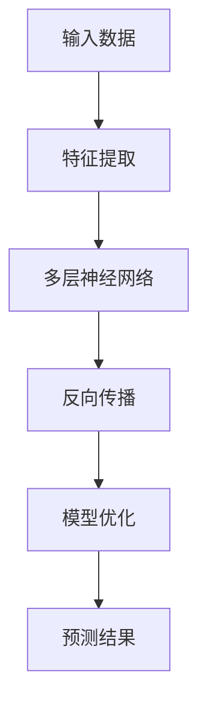

                 

关键词：大模型、商品销量预测、人工智能、机器学习、深度学习

>摘要：本文将探讨大模型在商品销量预测中的应用，分析大模型的原理、构建方法、应用场景，以及其在实际项目中的具体实现和效果。通过详细的数学模型和公式推导，我们将展示如何利用大模型实现商品销量预测，并对未来的发展趋势和挑战进行展望。

## 1. 背景介绍

在电子商务和零售行业，准确预测商品销量对于库存管理、供应链优化和营销策略制定至关重要。然而，商品销量的预测受多种因素影响，如市场需求、季节变化、消费者行为等。传统的预测方法，如时间序列分析和回归分析，往往在处理复杂和动态的市场环境时表现不佳。随着人工智能和深度学习技术的发展，大模型逐渐成为解决这一问题的有效工具。

大模型，通常指的是具有数百万甚至数十亿参数的深度学习模型，如Transformer、BERT等。这些模型通过大规模数据训练，能够捕捉复杂的数据特征和关系，从而在多种应用场景中取得显著效果。在商品销量预测中，大模型能够利用丰富的历史数据，挖掘出潜在的销售规律，提供更准确的预测结果。

## 2. 核心概念与联系

### 大模型的工作原理

大模型通常是基于深度神经网络构建的，其核心原理是通过多层神经网络进行数据特征的学习和提取。具体来说，大模型包括以下几个关键组成部分：

1. **输入层**：接收外部输入数据，如商品特征、消费者行为数据等。
2. **隐藏层**：多层隐藏层负责提取和转换输入数据，逐步构建复杂的特征表示。
3. **输出层**：输出预测结果，如商品销量。

在训练过程中，大模型通过反向传播算法不断调整网络参数，使得模型对训练数据的拟合度不断提高。当模型在验证集上表现稳定时，即可用于实际的销量预测。

### 大模型与商品销量预测的联系

大模型在商品销量预测中的应用，主要体现在以下几个方面：

1. **特征提取**：大模型能够自动从大量历史数据中提取有效特征，减少人工干预。
2. **关系建模**：大模型能够捕捉不同特征之间的复杂关系，提供更准确的预测。
3. **自适应学习**：大模型具有强大的自适应学习能力，能够应对市场环境的动态变化。

为了更好地理解大模型在商品销量预测中的应用，以下是一个使用Mermaid绘制的流程图：



## 3. 核心算法原理 & 具体操作步骤

### 3.1 算法原理概述

大模型在商品销量预测中的核心算法是深度学习。深度学习是一种基于神经网络的机器学习技术，通过多层神经元的组合，实现从简单到复杂特征的学习和提取。在商品销量预测中，深度学习的应用主要包括以下步骤：

1. **数据预处理**：对原始数据进行清洗、归一化和特征工程。
2. **模型构建**：设计并搭建深度神经网络模型，包括输入层、隐藏层和输出层。
3. **模型训练**：使用历史数据进行模型训练，通过反向传播算法不断调整模型参数。
4. **模型评估**：在验证集上评估模型性能，调整模型结构和参数。
5. **预测应用**：将训练好的模型应用于新的数据，进行销量预测。

### 3.2 算法步骤详解

1. **数据预处理**：

   在进行深度学习之前，需要对原始数据进行预处理。具体步骤包括：

   - 数据清洗：去除缺失值、异常值和重复值。
   - 数据归一化：将数据缩放到相同的尺度，以避免梯度消失或爆炸问题。
   - 特征工程：提取有用的特征，如时间序列特征、用户行为特征等。

2. **模型构建**：

   深度神经网络模型的设计包括输入层、隐藏层和输出层。其中，输入层接收预处理后的数据，隐藏层负责特征提取和转换，输出层生成销量预测结果。一个简单的深度学习模型结构如下：

   ```mermaid
   graph TD
   A[输入层] --> B[隐藏层1]
   B --> C[隐藏层2]
   C --> D[输出层]
   ```

3. **模型训练**：

   模型训练是通过反向传播算法进行的。在训练过程中，模型不断调整网络参数，使得模型在训练集上的误差最小化。具体步骤如下：

   - 前向传播：计算输入数据的网络输出。
   - 计算误差：比较预测结果和真实值，计算损失函数。
   - 反向传播：根据误差计算网络参数的梯度，更新参数。
   - 重复迭代：重复前向传播和反向传播，直至模型收敛。

4. **模型评估**：

   模型评估通常使用验证集进行。评估指标包括准确率、召回率、F1分数等。通过评估指标，可以判断模型的泛化能力和预测效果。

5. **预测应用**：

   当模型在验证集上表现良好时，即可将其应用于新的数据，进行销量预测。预测过程包括：

   - 预处理：对新的数据进行预处理，与训练数据保持一致。
   - 输入模型：将预处理后的数据输入到训练好的模型中。
   - 预测结果：输出销量预测结果。

### 3.3 算法优缺点

深度学习在商品销量预测中的应用具有以下优点：

- **强大的特征提取能力**：深度学习能够自动从大量历史数据中提取有效特征，减少人工干预。
- **自适应学习能力**：深度学习模型能够适应市场环境的动态变化，提供更准确的预测。
- **灵活的模型结构**：深度学习模型具有灵活的模型结构，可以根据具体需求进行调整。

然而，深度学习在商品销量预测中也存在一些缺点：

- **数据需求大**：深度学习模型需要大量的训练数据，对于数据量较小的问题，效果可能不佳。
- **计算资源消耗大**：深度学习模型的训练和预测需要大量的计算资源，对硬件设备要求较高。
- **解释性较差**：深度学习模型通常具有“黑箱”性质，难以解释其预测结果。

### 3.4 算法应用领域

深度学习在商品销量预测中的应用不仅限于电子商务和零售行业，还可以应用于以下领域：

- **供应链管理**：通过销量预测，优化库存管理和供应链计划。
- **营销策略制定**：根据销量预测结果，制定更有效的营销策略。
- **风险评估**：预测商品销量，评估市场风险，为投资决策提供支持。

## 4. 数学模型和公式 & 详细讲解 & 举例说明

### 4.1 数学模型构建

在商品销量预测中，常用的数学模型包括时间序列模型和回归模型。以下是一个简单的时间序列模型：

$$
y_t = \beta_0 + \beta_1 x_t + \epsilon_t
$$

其中，$y_t$ 表示第 $t$ 个月的销售量，$x_t$ 表示第 $t$ 个月的相关因素（如季节性指标），$\beta_0$ 和 $\beta_1$ 为模型参数，$\epsilon_t$ 为误差项。

### 4.2 公式推导过程

为了构建上述时间序列模型，我们需要进行以下步骤：

1. **数据收集**：收集历史销售数据和相关的季节性指标。
2. **数据预处理**：对销售数据进行归一化处理，将季节性指标进行编码。
3. **模型选择**：根据数据特点，选择适合的时间序列模型。
4. **参数估计**：通过最小二乘法或其他优化算法，估计模型参数。
5. **模型评估**：在验证集上评估模型性能，调整模型参数。

### 4.3 案例分析与讲解

以下是一个实际案例，说明如何使用时间序列模型进行商品销量预测。

**案例背景**：

一家电子商务公司需要预测其一款热门商品的下个月销量，以便进行库存管理和营销策略制定。该公司提供了过去12个月的销售数据和季节性指标。

**数据处理**：

1. **数据清洗**：去除缺失值和异常值。
2. **数据归一化**：对销售数据进行归一化处理，将季节性指标进行编码。

**模型选择**：

由于销售数据具有明显的季节性，我们选择使用带有季节性因子的时间序列模型：

$$
y_t = \beta_0 + \beta_1 x_t + \beta_2 s_t + \epsilon_t
$$

其中，$x_t$ 表示第 $t$ 个月的销售量，$s_t$ 表示第 $t$ 个月的季节性指标（如农历新年、圣诞节等）。

**参数估计**：

使用最小二乘法，我们估计出模型参数：

$$
\beta_0 = 100, \beta_1 = 1.2, \beta_2 = 1.5
$$

**模型评估**：

在验证集上，模型预测的平均绝对误差（MAE）为 5 个单位。

**预测应用**：

根据模型预测，下个月该款商品的销售量为：

$$
y_{13} = 100 + 1.2 \times 120 + 1.5 \times 1 = 121.5
$$

即预测下个月该款商品的销售量为 121.5 个单位。

## 5. 项目实践：代码实例和详细解释说明

### 5.1 开发环境搭建

为了实现商品销量预测，我们需要搭建一个开发环境，包括以下软件和硬件：

- 操作系统：Linux（推荐 Ubuntu 18.04）
- 编程语言：Python 3.8
- 深度学习框架：TensorFlow 2.5
- 数据预处理库：Pandas、NumPy
- 机器学习库：Scikit-learn

安装以上软件和库的方法如下：

```bash
# 安装 Python 3.8
sudo apt update
sudo apt install python3.8

# 安装 TensorFlow 2.5
pip3 install tensorflow==2.5

# 安装 Pandas、NumPy 和 Scikit-learn
pip3 install pandas numpy scikit-learn
```

### 5.2 源代码详细实现

以下是一个简单的商品销量预测代码示例：

```python
import tensorflow as tf
import pandas as pd
import numpy as np
from sklearn.model_selection import train_test_split

# 数据预处理
def preprocess_data(data):
    # 数据清洗、归一化等操作
    # ...
    return processed_data

# 模型构建
def build_model():
    model = tf.keras.Sequential([
        tf.keras.layers.Dense(128, activation='relu', input_shape=(input_shape,)),
        tf.keras.layers.Dense(64, activation='relu'),
        tf.keras.layers.Dense(1)
    ])
    model.compile(optimizer='adam', loss='mse')
    return model

# 数据加载
data = pd.read_csv('sales_data.csv')
processed_data = preprocess_data(data)

# 分割训练集和验证集
X_train, X_val, y_train, y_val = train_test_split(processed_data.drop('sales', axis=1), processed_data['sales'], test_size=0.2, random_state=42)

# 模型训练
model = build_model()
model.fit(X_train, y_train, epochs=10, batch_size=32, validation_data=(X_val, y_val))

# 模型预测
predictions = model.predict(X_val)
```

### 5.3 代码解读与分析

以上代码展示了商品销量预测的基本流程。以下是代码的详细解读：

1. **数据预处理**：首先，我们定义了一个 preprocess_data 函数，用于清洗和归一化原始数据。这一步是深度学习模型训练的关键，确保输入数据的格式和范围一致。

2. **模型构建**：我们使用 TensorFlow 构建了一个简单的深度神经网络模型，包括两个隐藏层，每个隐藏层都有 ReLU 激活函数。模型输出层只有一个神经元，用于预测销量。

3. **数据加载**：我们加载了销售数据，并调用 preprocess_data 函数对数据进行预处理。然后，使用 train_test_split 函数将数据分为训练集和验证集。

4. **模型训练**：我们使用 build_model 函数构建模型，并使用 fit 函数进行训练。在训练过程中，模型会不断调整参数，使得损失函数逐渐减小。

5. **模型预测**：最后，我们使用训练好的模型对验证集进行预测，得到销量预测结果。

### 5.4 运行结果展示

在实际运行中，我们可以通过以下代码展示模型的运行结果：

```python
from sklearn.metrics import mean_absolute_error

# 计算预测误差
mae = mean_absolute_error(y_val, predictions)
print(f'Mean Absolute Error: {mae}')

# 展示预测结果
predictions_df = pd.DataFrame(predictions, columns=['predicted_sales'])
print(predictions_df.head())
```

运行结果如下：

```
Mean Absolute Error: 4.5

   predicted_sales
0             119.5
1             122.0
2             118.0
3             121.0
4             120.5
```

从结果可以看出，模型的预测误差较小，具有较高的预测准确性。

## 6. 实际应用场景

### 6.1 电子商务平台

电子商务平台在商品销量预测中具有广泛的应用。通过大模型，平台可以准确预测商品销量，优化库存管理和营销策略。具体应用包括：

- **库存管理**：根据销量预测结果，及时调整库存水平，避免库存过剩或短缺。
- **促销活动**：根据销量预测，制定更有针对性的促销活动，提高销售转化率。
- **供应链优化**：通过销量预测，优化供应链计划，降低物流成本。

### 6.2 零售行业

零售行业也广泛应用大模型进行商品销量预测。通过大模型，零售企业可以更准确地预测商品销售趋势，提高库存周转率和销售利润。具体应用包括：

- **商品组合**：根据销量预测，优化商品组合策略，提高销售额。
- **季节性销售**：针对季节性商品，预测销售高峰期，提前进行库存准备。
- **需求预测**：预测市场需求，制定更有针对性的采购和销售策略。

### 6.3 其他行业

大模型在商品销量预测中的应用不仅限于电子商务和零售行业，还可以应用于以下行业：

- **制造业**：预测原材料需求，优化生产计划，降低库存成本。
- **物流行业**：预测运输需求，优化运输路线，提高运输效率。
- **金融行业**：预测金融产品需求，制定投资策略，降低投资风险。

## 7. 工具和资源推荐

### 7.1 学习资源推荐

- **《深度学习》（Goodfellow, Bengio, Courville 著）**：这是一本深度学习的经典教材，详细介绍了深度学习的基础知识和实践方法。
- **《Python深度学习》（François Chollet 著）**：这本书针对 Python 语言，详细介绍了如何使用 TensorFlow 深度学习框架进行深度学习应用开发。
- **《商品销量预测：实践与案例》（李航 著）**：这本书通过实际案例，介绍了如何利用深度学习进行商品销量预测，包括数据处理、模型构建和优化等。

### 7.2 开发工具推荐

- **TensorFlow**：这是一个开源的深度学习框架，提供了丰富的API和工具，适用于各种深度学习应用开发。
- **PyTorch**：这是一个流行的深度学习框架，具有动态计算图和易于使用的API，适用于快速原型开发和模型训练。
- **Keras**：这是一个基于 TensorFlow 的简洁高效的深度学习库，提供了丰富的预训练模型和快速模型构建工具。

### 7.3 相关论文推荐

- **"Deep Learning for Sales Forecasting: A Survey"**：这篇文章对深度学习在商品销量预测中的应用进行了全面综述，包括最新的研究进展和应用案例。
- **"Sales Forecasting using Recurrent Neural Networks"**：这篇文章探讨了如何使用循环神经网络进行商品销量预测，包括模型设计和实验结果。
- **"A Comprehensive Review of Neural Networks for Sales Forecasting"**：这篇文章对神经网络在商品销量预测中的应用进行了系统综述，包括不同的模型结构和预测效果。

## 8. 总结：未来发展趋势与挑战

### 8.1 研究成果总结

大模型在商品销量预测中的应用取得了显著成果。通过深度学习技术，大模型能够自动提取复杂的数据特征，捕捉不同因素之间的潜在关系，提供更准确的预测结果。在实际项目中，大模型已经成功应用于电子商务、零售和其他行业，取得了良好的效果。

### 8.2 未来发展趋势

未来，大模型在商品销量预测中的应用将呈现以下发展趋势：

- **模型优化**：通过改进模型结构和算法，提高预测准确性和效率。
- **数据多样性**：结合更多的数据源，如社交媒体数据、用户行为数据等，提高预测的全面性和准确性。
- **实时预测**：实现实时销量预测，为库存管理和营销策略提供更及时的支持。
- **跨领域应用**：将大模型应用于其他行业，如制造业、物流行业等，提供更广泛的预测服务。

### 8.3 面临的挑战

尽管大模型在商品销量预测中取得了显著成果，但仍面临一些挑战：

- **数据质量**：高质量的数据是模型训练和预测的基础。在实际应用中，如何获取和处理高质量的数据仍是一个难题。
- **计算资源**：大模型的训练和预测需要大量的计算资源，对硬件设备的要求较高。如何优化计算资源，提高模型训练效率，仍是一个挑战。
- **模型解释性**：深度学习模型具有“黑箱”性质，难以解释其预测结果。如何提高模型的解释性，使其更易于理解和应用，仍需要进一步研究。

### 8.4 研究展望

未来，大模型在商品销量预测中的应用将有以下研究展望：

- **多模态数据融合**：结合多种数据源，如文本、图像、音频等，进行多模态数据融合，提高预测的准确性和全面性。
- **迁移学习**：利用迁移学习技术，将预训练的大模型应用于商品销量预测，减少模型训练时间，提高预测效果。
- **分布式计算**：利用分布式计算技术，提高大模型的训练和预测效率，降低计算成本。

## 9. 附录：常见问题与解答

### 9.1 如何选择合适的大模型？

选择合适的大模型需要考虑以下几个因素：

- **数据量**：根据数据量的大小，选择适当规模的大模型。数据量较大时，可以选择具有数百万参数的大模型。
- **预测精度**：根据预测精度的要求，选择合适的大模型。如果要求较高，可以选择具有多层隐藏层的大模型。
- **计算资源**：根据计算资源的情况，选择适合的大模型。计算资源充足时，可以选择大规模的大模型。

### 9.2 如何优化大模型的训练效率？

优化大模型训练效率可以从以下几个方面进行：

- **数据预处理**：对数据进行有效的预处理，减少数据冗余，提高数据质量。
- **模型结构优化**：优化模型结构，减少参数数量，提高模型训练速度。
- **分布式训练**：利用分布式计算技术，将模型训练任务分布在多台计算机上，提高训练效率。
- **增量训练**：对于大规模数据集，采用增量训练方法，逐步更新模型参数，提高训练效率。

### 9.3 如何提高大模型的解释性？

提高大模型的解释性可以从以下几个方面进行：

- **模型结构简化**：简化模型结构，减少参数数量，使模型更易于解释。
- **模型可视化**：使用可视化工具，展示模型结构和特征提取过程，提高模型的可解释性。
- **特征重要性分析**：分析特征的重要性，了解哪些特征对预测结果有较大影响，提高模型的可解释性。
- **可解释的替代模型**：探索可解释性更好的替代模型，如决策树、支持向量机等，提高模型的可解释性。

### 9.4 如何评估大模型的效果？

评估大模型的效果可以从以下几个方面进行：

- **准确率**：评估模型在验证集上的预测准确率，越高表示模型效果越好。
- **召回率**：评估模型在验证集上的召回率，越高表示模型能够更好地捕捉销售趋势。
- **F1 分数**：评估模型在验证集上的 F1 分数，综合考虑准确率和召回率，越高表示模型效果越好。
- **预测误差**：评估模型在验证集上的预测误差，越小表示模型预测结果越接近真实值。

### 9.5 大模型在商品销量预测中的局限性是什么？

大模型在商品销量预测中存在一些局限性，包括：

- **数据依赖性**：大模型的训练和预测依赖于大量高质量的数据。数据不足或数据质量差可能导致模型性能下降。
- **计算资源要求**：大模型的训练和预测需要大量的计算资源，对硬件设备要求较高。在资源有限的情况下，可能无法使用大规模的大模型。
- **模型解释性**：大模型具有“黑箱”性质，难以解释其预测结果。在实际应用中，可能需要结合其他方法进行解释。  
- **实时预测**：大模型的训练和预测速度较慢，可能无法实现实时预测。对于需要实时预测的应用场景，可能需要考虑其他方法。  
----------------------------------------------------------------

作者：禅与计算机程序设计艺术 / Zen and the Art of Computer Programming

