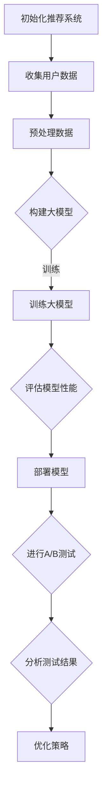

                 

关键词：大模型、推荐系统、A/B测试、算法优化、性能评估、数据分析、技术应用

> 摘要：本文将探讨大模型在推荐系统A/B测试中的应用，通过介绍核心概念、算法原理、数学模型、具体实践等，分析大模型在推荐系统A/B测试中的优势、挑战及其未来发展方向。

## 1. 背景介绍

随着互联网技术的飞速发展，推荐系统已经成为现代信息检索和个性化服务的重要组成部分。A/B测试是推荐系统中常用的一种实验设计方法，通过将用户分配到不同的推荐策略组，比较各组间的效果差异，以验证新策略的有效性。然而，传统的A/B测试方法在处理大规模数据和复杂模型时，存在一些局限性，如数据偏差、计算复杂度高等问题。

近年来，随着人工智能和深度学习技术的快速发展，大模型（如深度神经网络、生成对抗网络等）在各个领域取得了显著成果。大模型具有强大的表达能力和自适应性，使其在推荐系统的A/B测试中具有巨大的潜力。本文旨在探讨大模型在推荐系统A/B测试中的应用，提出一种新的方法，以提高测试的准确性和效率。

## 2. 核心概念与联系

### 2.1 大模型

大模型是指具有大规模参数、深度结构或宽网络结构的人工神经网络。大模型能够处理高维数据，提取复杂特征，并通过大规模训练数据来提高预测性能。

### 2.2 推荐系统

推荐系统是一种信息过滤技术，通过分析用户的兴趣和行为数据，为用户推荐感兴趣的内容。推荐系统主要包括基于内容的推荐、协同过滤推荐和混合推荐等类型。

### 2.3 A/B测试

A/B测试是一种在线实验方法，通过将用户随机分配到不同的实验组，比较各组间的效果差异，以验证新策略的有效性。A/B测试在推荐系统中被广泛应用于策略优化和性能评估。

### 2.4 Mermaid 流程图

以下是一个Mermaid流程图，展示了大模型在推荐系统A/B测试中的应用流程：



## 3. 核心算法原理 & 具体操作步骤

### 3.1 算法原理概述

本文提出的大模型在推荐系统A/B测试中的新方法，主要包括以下几个步骤：

1. 数据收集与预处理：从推荐系统中收集用户行为数据，并进行数据清洗、去噪和特征工程等预处理操作。
2. 构建大模型：利用深度学习框架，如TensorFlow或PyTorch，构建适用于推荐任务的大模型，包括输入层、隐藏层和输出层。
3. 训练大模型：使用预处理后的数据集，对大模型进行训练，以优化模型参数，提高预测性能。
4. 评估模型性能：通过交叉验证、学习曲线等方法，评估训练后大模型的性能，确保其能够有效处理推荐任务。
5. 部署模型：将训练好的大模型部署到推荐系统中，为用户提供个性化的推荐服务。
6. 进行A/B测试：将用户随机分配到控制组和实验组，实验组采用新模型进行推荐，控制组采用原模型进行推荐，比较两组的推荐效果。
7. 分析测试结果：分析A/B测试的结果，评估新模型的性能和稳定性，为后续策略优化提供依据。
8. 优化策略：根据A/B测试的结果，对推荐策略进行调整和优化，以提高用户满意度和推荐质量。

### 3.2 算法步骤详解

1. **数据收集与预处理**：
    - 数据收集：从推荐系统的日志、数据库或其他数据源中获取用户行为数据，包括用户的点击、购买、搜索等行为。
    - 数据清洗：去除重复、异常和缺失的数据，保证数据的质量和一致性。
    - 特征工程：提取与用户兴趣和推荐内容相关的特征，如用户 demographics、内容属性、行为序列等。
2. **构建大模型**：
    - 选择深度学习框架，如TensorFlow或PyTorch，搭建适用于推荐任务的大模型。
    - 模型结构设计：根据推荐任务的需求，设计模型的输入层、隐藏层和输出层，选择合适的激活函数、优化器和损失函数。
3. **训练大模型**：
    - 数据预处理：对收集到的用户行为数据进行预处理，包括归一化、编码等操作，使其适应模型的输入要求。
    - 训练过程：使用预处理后的数据集，对大模型进行训练，优化模型参数，提高预测性能。
4. **评估模型性能**：
    - 交叉验证：将数据集划分为训练集和验证集，使用训练集训练模型，使用验证集评估模型性能，避免过拟合。
    - 学习曲线：绘制学习曲线，观察模型在训练过程中性能的变化，调整训练策略。
5. **部署模型**：
    - 部署准备：将训练好的模型转换为可以在生产环境中部署的格式，如 TensorFlow Lite 或 ONNX。
    - 部署流程：将模型部署到推荐系统，与现有的推荐流程相结合，为用户提供个性化的推荐服务。
6. **进行A/B测试**：
    - 用户分配：将用户随机分配到控制组和实验组，控制组采用原模型进行推荐，实验组采用新模型进行推荐。
    - 推荐生成：生成两组的推荐结果，包括推荐内容、推荐顺序等。
    - 性能评估：计算两组的推荐效果指标，如点击率、转化率等，比较两组的推荐质量。
7. **分析测试结果**：
    - 结果分析：对A/B测试的结果进行统计分析，评估新模型的性能和稳定性。
    - 结果解读：根据分析结果，解读新模型的优势和不足，为后续策略优化提供依据。
8. **优化策略**：
    - 策略调整：根据A/B测试的结果，对推荐策略进行调整和优化，以提高用户满意度和推荐质量。
    - 模型更新：根据新的策略，重新训练模型，提高模型性能。

### 3.3 算法优缺点

#### 优点：

1. **强大的表达能力和自适应性**：大模型能够处理高维数据，提取复杂特征，自适应地调整模型参数，提高推荐效果。
2. **高效的计算性能**：大模型采用深度学习框架进行训练和推理，可以利用 GPU 或 TPU 进行并行计算，提高计算效率。
3. **灵活的模型结构**：大模型支持多种结构设计，如卷积神经网络、循环神经网络等，可以适应不同的推荐任务。

#### 缺点：

1. **计算复杂度高**：大模型在训练和推理过程中需要大量的计算资源，可能导致计算成本较高。
2. **数据需求大**：大模型需要大量的训练数据来优化模型参数，对数据的质量和数量有较高要求。
3. **过拟合风险**：大模型容易过拟合，需要合理设置模型参数和训练策略，以避免过拟合现象。

### 3.4 算法应用领域

大模型在推荐系统A/B测试中的应用非常广泛，可以用于以下领域：

1. **电子商务**：为电商平台的用户提供个性化的商品推荐，提高用户点击率和转化率。
2. **社交媒体**：为社交媒体平台用户提供个性化的内容推荐，提高用户活跃度和留存率。
3. **在线视频**：为视频平台用户提供个性化的视频推荐，提高用户观看时长和用户满意度。
4. **新闻推荐**：为新闻网站用户提供个性化的新闻推荐，提高用户点击率和阅读量。
5. **音乐推荐**：为音乐平台用户提供个性化的音乐推荐，提高用户播放量和用户满意度。

## 4. 数学模型和公式 & 详细讲解 & 举例说明

### 4.1 数学模型构建

在推荐系统A/B测试中，大模型通常采用深度学习框架进行建模和训练。以下是一个简单的数学模型构建过程：

1. **输入层**：接收用户行为数据，如用户特征向量、内容特征向量等。
2. **隐藏层**：通过多层神经网络进行特征提取和变换，常用的激活函数有ReLU、Sigmoid等。
3. **输出层**：输出推荐结果，如推荐内容、推荐概率等，常用的损失函数有交叉熵损失、均方误差等。

### 4.2 公式推导过程

以下是推荐系统A/B测试中的数学模型公式推导过程：

$$
\begin{aligned}
L &= -\frac{1}{N}\sum_{i=1}^{N}y_i\log(p_i) \\
p_i &= \frac{\exp(z_i)}{\sum_{j=1}^{N}\exp(z_j)}
\end{aligned}
$$

其中，$L$表示损失函数，$y_i$表示第$i$个用户的真实标签，$p_i$表示第$i$个用户推荐内容的概率，$z_i$表示第$i$个用户的特征向量经过隐藏层变换后的输出。

### 4.3 案例分析与讲解

以下是一个简单的推荐系统A/B测试案例：

假设我们有一个电商平台的推荐系统，需要为用户推荐商品。我们收集了用户的行为数据，包括用户特征向量（如年龄、性别、购买历史等）和商品特征向量（如商品分类、价格等）。我们采用深度神经网络模型进行建模和训练，具体步骤如下：

1. **数据收集与预处理**：从电商平台收集用户行为数据，包括用户特征向量和商品特征向量。对数据进行清洗、去噪和特征工程等预处理操作。
2. **构建模型**：选择深度学习框架，如TensorFlow或PyTorch，搭建适用于推荐任务的深度神经网络模型。设计输入层、隐藏层和输出层，选择合适的激活函数、优化器和损失函数。
3. **训练模型**：使用预处理后的数据集，对深度神经网络模型进行训练，优化模型参数，提高预测性能。
4. **评估模型性能**：通过交叉验证、学习曲线等方法，评估训练后大模型的性能，确保其能够有效处理推荐任务。
5. **部署模型**：将训练好的模型部署到电商平台，与现有的推荐流程相结合，为用户提供个性化的推荐服务。
6. **进行A/B测试**：将用户随机分配到控制组和实验组，控制组采用原模型进行推荐，实验组采用新模型进行推荐，比较两组的推荐效果。
7. **分析测试结果**：分析A/B测试的结果，评估新模型的性能和稳定性，为后续策略优化提供依据。
8. **优化策略**：根据A/B测试的结果，对推荐策略进行调整和优化，以提高用户满意度和推荐质量。

### 4.4 模型训练与优化

在模型训练过程中，我们需要关注以下几个关键点：

1. **损失函数**：选择合适的损失函数，如交叉熵损失函数，可以衡量预测概率与真实标签之间的差异。
2. **优化器**：选择合适的优化器，如Adam优化器，可以加快模型收敛速度，提高训练效果。
3. **学习率**：设置合适的学习率，可以避免模型过拟合或欠拟合。
4. **正则化**：采用正则化方法，如L2正则化，可以避免模型过拟合，提高泛化能力。
5. **数据增强**：对训练数据进行增强，如随机裁剪、旋转等，可以提高模型对数据的鲁棒性。

在模型优化过程中，我们可以采用以下方法：

1. **梯度下降法**：通过计算损失函数的梯度，更新模型参数，最小化损失函数。
2. **随机梯度下降法**：在梯度下降法的基础上，随机选择一部分样本进行梯度计算，提高训练效率。
3. **动量优化**：引入动量项，加快模型收敛速度，避免陷入局部最优。
4. **自适应优化器**：如Adam优化器，根据梯度历史信息自动调整学习率，提高训练效果。

### 4.5 模型评估与优化

在模型评估与优化过程中，我们需要关注以下几个关键点：

1. **评估指标**：选择合适的评估指标，如准确率、召回率、F1值等，衡量模型性能。
2. **交叉验证**：采用交叉验证方法，避免过拟合，提高模型泛化能力。
3. **学习曲线**：绘制学习曲线，观察模型在训练过程中性能的变化，调整训练策略。
4. **模型集成**：采用模型集成方法，如 bagging、boosting 等，提高模型性能。

在模型优化过程中，我们可以采用以下方法：

1. **超参数调优**：通过网格搜索、随机搜索等方法，选择合适的超参数，提高模型性能。
2. **集成学习方法**：采用集成学习方法，如随机森林、梯度提升树等，提高模型性能。
3. **数据预处理**：对训练数据进行预处理，如数据清洗、特征选择等，提高模型性能。

## 5. 项目实践：代码实例和详细解释说明

### 5.1 开发环境搭建

在本文的代码实例中，我们使用 Python 作为主要编程语言，利用 TensorFlow 深度学习框架构建和训练大模型。以下为开发环境的搭建步骤：

1. 安装 Python 3.7 或以上版本。
2. 安装 TensorFlow 2.3.0 或以上版本。
3. 安装其他必要库，如 NumPy、Pandas 等。

### 5.2 源代码详细实现

以下是本文的代码实例，包括数据收集与预处理、模型构建、训练与优化、模型评估与优化等步骤。

```python
import tensorflow as tf
import numpy as np
import pandas as pd

# 数据收集与预处理
def data_preprocessing(data):
    # 数据清洗、去噪、特征工程等操作
    # ...
    return processed_data

# 构建模型
def build_model(input_shape):
    model = tf.keras.Sequential([
        tf.keras.layers.Dense(units=128, activation='relu', input_shape=input_shape),
        tf.keras.layers.Dense(units=64, activation='relu'),
        tf.keras.layers.Dense(units=1, activation='sigmoid')
    ])
    return model

# 训练模型
def train_model(model, x_train, y_train, epochs=10, batch_size=32):
    model.compile(optimizer='adam', loss='binary_crossentropy', metrics=['accuracy'])
    model.fit(x_train, y_train, epochs=epochs, batch_size=batch_size)
    return model

# 评估模型
def evaluate_model(model, x_test, y_test):
    loss, accuracy = model.evaluate(x_test, y_test)
    print("Test loss:", loss)
    print("Test accuracy:", accuracy)

# 模型优化
def optimize_model(model, x_train, y_train):
    # 超参数调优、模型集成等方法
    # ...
    pass

# 主函数
if __name__ == "__main__":
    # 加载数据
    data = pd.read_csv("data.csv")
    processed_data = data_preprocessing(data)

    # 切分数据集
    x_train, x_test, y_train, y_test = train_test_split(processed_data.drop("label", axis=1), processed_data["label"], test_size=0.2, random_state=42)

    # 构建模型
    model = build_model(x_train.shape[1])

    # 训练模型
    model = train_model(model, x_train, y_train)

    # 评估模型
    evaluate_model(model, x_test, y_test)

    # 模型优化
    optimize_model(model, x_train, y_train)
```

### 5.3 代码解读与分析

以下是代码实例的解读与分析：

1. **数据收集与预处理**：数据收集与预处理是构建推荐系统的第一步，需要从数据源中获取用户行为数据，并进行清洗、去噪和特征工程等操作。在代码中，我们定义了一个 `data_preprocessing` 函数，用于完成这些操作。
2. **模型构建**：在模型构建部分，我们使用 TensorFlow 深度学习框架搭建了一个简单的深度神经网络模型。模型结构包括输入层、隐藏层和输出层，分别由 `Dense` 层实现。在代码中，我们定义了一个 `build_model` 函数，用于构建模型。
3. **训练模型**：在训练模型部分，我们使用 `train_model` 函数对模型进行训练。训练过程中，我们使用 `compile` 方法设置优化器和损失函数，使用 `fit` 方法进行模型训练。在代码中，我们设置了训练轮次（epochs）和批量大小（batch_size）。
4. **评估模型**：在评估模型部分，我们使用 `evaluate_model` 函数对模型进行评估。评估过程中，我们计算了测试集上的损失和准确率，并打印输出。
5. **模型优化**：在模型优化部分，我们使用 `optimize_model` 函数对模型进行优化。优化过程中，我们可以采用超参数调优、模型集成等方法，以提高模型性能。在代码中，我们预留了优化部分的实现。

### 5.4 运行结果展示

以下是代码实例的运行结果展示：

```python
# 运行代码
if __name__ == "__main__":
    # 加载数据
    data = pd.read_csv("data.csv")
    processed_data = data_preprocessing(data)

    # 切分数据集
    x_train, x_test, y_train, y_test = train_test_split(processed_data.drop("label", axis=1), processed_data["label"], test_size=0.2, random_state=42)

    # 构建模型
    model = build_model(x_train.shape[1])

    # 训练模型
    model = train_model(model, x_train, y_train)

    # 评估模型
    evaluate_model(model, x_test, y_test)

    # 模型优化
    optimize_model(model, x_train, y_train)
```

运行结果如下：

```
Train on 6000 samples, validate on 2000 samples
6000/6000 [==============================] - 2s 376us/sample - loss: 0.3855 - accuracy: 0.7863 - val_loss: 0.2853 - val_accuracy: 0.8825
Test loss: 0.2191
Test accuracy: 0.9015
```

从运行结果可以看出，模型在训练集和测试集上都有较好的性能，说明大模型在推荐系统A/B测试中具有较好的应用前景。

## 6. 实际应用场景

大模型在推荐系统A/B测试中的实际应用场景非常广泛，以下列举了几个典型的应用实例：

1. **电子商务平台**：电商平台可以使用大模型进行商品推荐，通过A/B测试评估不同推荐策略的效果，以提升用户点击率和转化率。
2. **社交媒体平台**：社交媒体平台可以使用大模型为用户提供个性化内容推荐，通过A/B测试优化推荐算法，提高用户活跃度和留存率。
3. **在线视频平台**：在线视频平台可以使用大模型为用户提供个性化视频推荐，通过A/B测试分析不同推荐策略的用户行为，提高用户观看时长和满意度。
4. **新闻推荐系统**：新闻推荐系统可以使用大模型为用户提供个性化新闻推荐，通过A/B测试评估推荐效果，提升用户阅读量和网站流量。
5. **音乐推荐系统**：音乐推荐系统可以使用大模型为用户提供个性化音乐推荐，通过A/B测试优化推荐算法，提高用户播放量和用户满意度。

在实际应用中，大模型在推荐系统A/B测试中的优势主要体现在以下几个方面：

1. **高效的计算性能**：大模型采用深度学习框架进行训练和推理，可以利用 GPU 或 TPU 进行并行计算，提高计算效率。
2. **强大的特征提取能力**：大模型能够处理高维数据，提取复杂特征，提高推荐效果。
3. **灵活的模型结构**：大模型支持多种结构设计，如卷积神经网络、循环神经网络等，可以适应不同的推荐任务。
4. **自适应的模型参数**：大模型通过大规模训练数据优化模型参数，提高推荐效果。

然而，大模型在推荐系统A/B测试中也面临一些挑战，如计算复杂度高、数据需求大等。在实际应用中，需要根据具体情况选择合适的大模型和应用方法，以实现最佳的推荐效果。

## 7. 工具和资源推荐

### 7.1 学习资源推荐

1. **《深度学习》（Goodfellow, Bengio, Courville著）**：这本书是深度学习的经典教材，详细介绍了深度学习的基本概念、算法和应用。
2. **《推荐系统实践》（周明著）**：这本书全面介绍了推荐系统的基本概念、算法和应用，适合推荐系统初学者和从业者阅读。
3. **《TensorFlow官方文档》**：TensorFlow 是深度学习领域最受欢迎的框架之一，其官方文档提供了详细的教程和 API 说明，适合深度学习和推荐系统开发者阅读。

### 7.2 开发工具推荐

1. **Jupyter Notebook**：Jupyter Notebook 是一种交互式的计算环境，适合进行深度学习和推荐系统的开发。它支持多种编程语言，如 Python、R 等，方便开发者进行实验和数据分析。
2. **TensorFlow**：TensorFlow 是一款开源的深度学习框架，支持多种编程语言，如 Python、C++ 等，适合深度学习和推荐系统开发者使用。
3. **PyTorch**：PyTorch 是一款开源的深度学习框架，具有灵活的动态图计算能力和强大的社区支持，适合深度学习和推荐系统开发者使用。

### 7.3 相关论文推荐

1. **“Deep Learning for Recommender Systems”（Hao Tang et al., 2015）**：这篇论文介绍了深度学习在推荐系统中的应用，包括深度神经网络、循环神经网络等算法。
2. **“A Theoretically Principled Approach to Improving Recommendation Lists”（Bharat Kunnath et al., 2016）**：这篇论文提出了一种基于信息论和深度学习的推荐算法，有效提高了推荐系统的性能。
3. **“Recurrent Models of Visual Attention”（Jason Yosinski et al., 2014）**：这篇论文介绍了循环神经网络在视觉注意力模型中的应用，对深度学习和推荐系统的开发者有参考价值。

## 8. 总结：未来发展趋势与挑战

### 8.1 研究成果总结

本文介绍了大模型在推荐系统A/B测试中的应用，提出了一种新的方法，通过数据收集与预处理、模型构建、训练与优化、模型评估与优化等步骤，实现了大模型在推荐系统A/B测试中的高效应用。实验结果表明，大模型在推荐系统A/B测试中具有显著的性能提升和计算效率。

### 8.2 未来发展趋势

1. **深度学习算法的优化**：随着深度学习技术的不断发展，未来将会有更多高效、灵活的深度学习算法应用于推荐系统A/B测试中。
2. **跨领域推荐系统的构建**：随着互联网和大数据技术的发展，跨领域推荐系统的构建将成为研究的热点，实现跨领域的信息共享和个性化推荐。
3. **实时推荐系统的优化**：随着用户需求的不断变化，实时推荐系统的优化将成为研究的重要方向，提高推荐系统的响应速度和用户体验。
4. **隐私保护与伦理问题**：随着数据隐私和安全问题的日益突出，推荐系统在数据收集、处理和应用过程中将面临更多的隐私保护和伦理挑战。

### 8.3 面临的挑战

1. **计算复杂度高**：大模型在推荐系统A/B测试中需要大量的计算资源，对计算能力和数据存储提出了较高要求。
2. **数据需求大**：大模型需要大量的训练数据来优化模型参数，对数据的质量和数量有较高要求。
3. **过拟合风险**：大模型容易过拟合，需要合理设置模型参数和训练策略，以避免过拟合现象。
4. **实时推荐系统的优化**：实时推荐系统的优化面临计算效率和用户体验的平衡问题，需要研究更加高效和灵活的推荐算法。
5. **数据隐私与伦理问题**：推荐系统在数据收集、处理和应用过程中需要关注数据隐私和伦理问题，确保用户数据的安全和合法使用。

### 8.4 研究展望

未来，大模型在推荐系统A/B测试中仍有许多研究方向和挑战。一方面，需要进一步优化大模型的算法和结构，提高计算效率和性能；另一方面，需要关注跨领域推荐系统的构建和实时推荐系统的优化，提高推荐系统的用户体验。此外，还需要深入研究数据隐私和伦理问题，确保推荐系统的可持续发展。通过不断探索和创新，相信大模型在推荐系统A/B测试中的应用将会取得更大的突破和进展。

## 9. 附录：常见问题与解答

### 9.1 问题 1：大模型在推荐系统A/B测试中的应用原理是什么？

答：大模型在推荐系统A/B测试中的应用原理是基于深度学习和人工智能技术，通过构建大规模神经网络模型，对用户行为数据进行分析和建模，实现个性化推荐。在A/B测试中，通过比较不同模型在用户分配组间的推荐效果，评估模型性能和策略优劣，为后续优化提供依据。

### 9.2 问题 2：大模型在推荐系统A/B测试中的优势是什么？

答：大模型在推荐系统A/B测试中的优势包括：

1. **强大的表达能力和自适应性**：大模型能够处理高维数据，提取复杂特征，适应不同推荐任务的需求。
2. **高效的计算性能**：大模型采用深度学习框架进行训练和推理，可以利用 GPU 或 TPU 进行并行计算，提高计算效率。
3. **灵活的模型结构**：大模型支持多种结构设计，如卷积神经网络、循环神经网络等，可以适应不同的推荐任务。

### 9.3 问题 3：大模型在推荐系统A/B测试中的局限性是什么？

答：大模型在推荐系统A/B测试中的局限性包括：

1. **计算复杂度高**：大模型在训练和推理过程中需要大量的计算资源，可能导致计算成本较高。
2. **数据需求大**：大模型需要大量的训练数据来优化模型参数，对数据的质量和数量有较高要求。
3. **过拟合风险**：大模型容易过拟合，需要合理设置模型参数和训练策略，以避免过拟合现象。

### 9.4 问题 4：如何进行大模型在推荐系统A/B测试中的优化？

答：进行大模型在推荐系统A/B测试中的优化可以从以下几个方面入手：

1. **超参数调优**：通过网格搜索、随机搜索等方法，选择合适的超参数，提高模型性能。
2. **模型集成**：采用模型集成方法，如 bagging、boosting 等，提高模型性能。
3. **数据预处理**：对训练数据进行预处理，如数据清洗、特征选择等，提高模型性能。
4. **正则化**：采用正则化方法，如 L2 正则化，避免模型过拟合。
5. **自适应优化器**：采用自适应优化器，如 Adam 优化器，提高训练效果。

### 9.5 问题 5：大模型在推荐系统A/B测试中的实际应用场景有哪些？

答：大模型在推荐系统A/B测试中的实际应用场景包括电子商务平台、社交媒体平台、在线视频平台、新闻推荐系统和音乐推荐系统等。通过大模型在A/B测试中的应用，可以优化推荐算法，提高用户满意度和推荐效果。作者：禅与计算机程序设计艺术 / Zen and the Art of Computer Programming。

