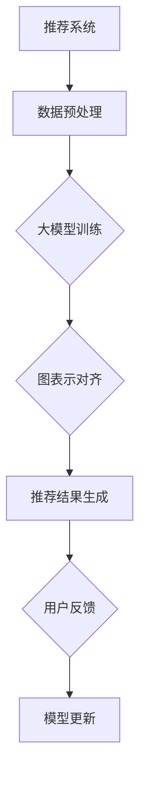

                 

关键词：大模型，推荐系统，图表示对齐，人工智能，机器学习，深度学习

## 摘要

随着人工智能技术的不断进步，推荐系统已经成为了互联网应用中不可或缺的一部分。本文主要探讨了如何利用大模型实现推荐系统中的图表示对齐应用。文章首先介绍了推荐系统的基础概念和传统方法，然后详细阐述了图表示对齐的核心原理及其在推荐系统中的应用，最后通过一个具体案例展示了大模型在推荐系统中的实际应用效果。本文的目标是为读者提供一个全面、深入的技术视角，帮助理解和应用大模型在推荐系统中的图表示对齐技术。

## 1. 背景介绍

### 推荐系统的基本概念

推荐系统（Recommender System）是一种旨在提高用户体验和满意度的人工智能系统。通过分析用户的历史行为、兴趣偏好和上下文信息，推荐系统能够为用户提供个性化的内容、商品或服务。推荐系统广泛应用于电子商务、社交媒体、视频流媒体等领域，极大地提升了用户满意度和商业价值。

### 传统推荐系统方法

传统的推荐系统方法主要包括基于内容的推荐（Content-Based Filtering）和协同过滤（Collaborative Filtering）。

- **基于内容的推荐**：这种方法根据用户的历史行为和兴趣，找到具有相似内容的商品或服务进行推荐。它依赖于内容的特征提取和匹配算法。

- **协同过滤**：协同过滤方法通过分析用户之间的相似性来进行推荐。它分为用户基于的协同过滤（User-Based）和项基于的协同过滤（Item-Based）。用户基于的协同过滤通过找到与目标用户相似的其它用户，推荐这些用户喜欢的商品或服务。项基于的协同过滤通过找到与目标商品相似的其它商品，推荐这些商品给用户。

### 传统方法的局限性

尽管传统推荐系统在许多应用中取得了显著的成效，但它们仍然存在一些局限性：

- **稀疏性**：协同过滤方法依赖于用户评分矩阵，但用户评分通常是稀疏的，导致用户之间的相似性难以准确计算。

- **冷启动问题**：对于新用户或新商品，由于缺乏足够的历史数据，传统方法难以进行有效的推荐。

- **可解释性**：传统推荐系统方法的推荐结果通常缺乏可解释性，用户难以理解推荐的原因。

## 2. 核心概念与联系

### 大模型的概念

大模型（Large-scale Model）是指具有大量参数和计算能力的深度学习模型。大模型通过学习海量数据，能够捕捉到复杂的数据分布和特征。近年来，随着计算能力的提升和大数据技术的发展，大模型在各个领域取得了显著的成果。

### 图表示对齐的概念

图表示对齐（Graph Representation Alignment）是指将不同数据源中的图结构进行对齐，以便在统一框架下进行数据分析和模型训练。图表示对齐的关键在于将异构数据源中的节点和边映射到统一的图表示，从而实现数据融合和特征提取。

### 大模型与图表示对齐的联系

大模型与图表示对齐的结合为推荐系统带来了新的机遇。通过大模型，可以更好地捕捉用户和商品之间的复杂关系，并通过图表示对齐实现对异构数据的统一处理。这种结合能够克服传统推荐系统的局限性，提供更精确和可解释的推荐结果。

### Mermaid 流程图



## 3. 核心算法原理 & 具体操作步骤

### 3.1 算法原理概述

大模型在推荐系统中的图表示对齐应用主要分为以下几个步骤：

1. **数据预处理**：将原始数据进行清洗和预处理，包括用户行为数据、商品信息等。

2. **大模型训练**：利用训练数据对大模型进行训练，使其能够捕捉用户和商品之间的复杂关系。

3. **图表示对齐**：将用户和商品的异构数据进行图表示对齐，生成统一的图表示。

4. **推荐结果生成**：利用对齐后的图表示生成推荐结果，并根据用户反馈进行模型更新。

### 3.2 算法步骤详解

1. **数据预处理**：
    - 数据清洗：去除缺失值、重复值等无效数据。
    - 数据规范化：将不同数据类型进行统一处理，如将评分数据进行归一化处理。
    - 特征提取：从原始数据中提取有用的特征，如用户的行为特征、商品的属性特征等。

2. **大模型训练**：
    - 数据集划分：将数据集划分为训练集、验证集和测试集。
    - 模型选择：选择合适的大模型架构，如Gated Recurrent Unit（GRU）、Long Short-Term Memory（LSTM）等。
    - 模型训练：利用训练集对大模型进行训练，并通过验证集进行模型调优。

3. **图表示对齐**：
    - 构建异构图：将用户和商品的异构数据进行图表示，构建用户-商品异构图。
    - 对齐算法：选择合适的对齐算法，如Graph Neural Network（GNN）、Transformer等，对图结构进行对齐。

4. **推荐结果生成**：
    - 推荐算法：利用对齐后的图表示生成推荐结果，如基于图卷积神经网络（GCN）的推荐算法。
    - 推荐排序：对推荐结果进行排序，选取Top-N推荐结果。

5. **用户反馈与模型更新**：
    - 用户反馈：收集用户的反馈信息，如点击、购买等行为。
    - 模型更新：根据用户反馈对模型进行更新，提高推荐效果。

### 3.3 算法优缺点

**优点**：

- **处理异构数据**：大模型结合图表示对齐能够处理异构数据，提高推荐系统的泛化能力。
- **提升推荐效果**：通过大模型的学习能力，能够更好地捕捉用户和商品之间的复杂关系，提高推荐效果。
- **增强可解释性**：通过对齐后的图表示，能够提供更直观和可解释的推荐原因。

**缺点**：

- **计算成本高**：大模型的训练和推理需要大量的计算资源和时间，对于实时性要求较高的应用场景可能存在一定的延迟。
- **数据依赖性强**：大模型的效果依赖于大量的训练数据，对于数据稀缺的场景可能难以发挥其优势。

### 3.4 算法应用领域

大模型在推荐系统中的图表示对齐应用主要涉及以下领域：

- **电子商务**：通过图表示对齐，可以为用户提供更个性化的商品推荐。
- **社交媒体**：通过图表示对齐，可以为用户提供更相关的内容推荐。
- **视频流媒体**：通过图表示对齐，可以为用户提供更精准的视频推荐。

## 4. 数学模型和公式 & 详细讲解 & 举例说明

### 4.1 数学模型构建

大模型在推荐系统中的图表示对齐应用主要涉及以下数学模型：

- **用户和商品的表示**：
    - 用户表示：\( u = \{u_1, u_2, ..., u_n\} \)
    - 商品表示：\( v = \{v_1, v_2, ..., v_n\} \)
- **图表示对齐模型**：
    - 图结构表示：\( G = (V, E) \)
    - 节点表示：\( X = \{x_1, x_2, ..., x_n\} \)
    - 边表示：\( Y = \{y_1, y_2, ..., y_n\} \)
- **推荐模型**：
    - 推荐评分函数：\( \hat{r}_{uv} = f(X, Y) \)

### 4.2 公式推导过程

大模型在推荐系统中的图表示对齐应用主要涉及以下公式推导：

- **用户和商品的表示**：
    - 用户表示：
        $$ u = \text{MLP}(u_{input}) $$
    - 商品表示：
        $$ v = \text{MLP}(v_{input}) $$
- **图表示对齐模型**：
    - 图结构表示：
        $$ X = \text{GNN}(V, E) $$
    - 边表示：
        $$ Y = \text{GNN}(V, E) $$
- **推荐模型**：
    - 推荐评分函数：
        $$ \hat{r}_{uv} = \text{MLP}(\text{concat}(u, v)) $$

### 4.3 案例分析与讲解

假设我们有一个电子商务平台，用户和商品的数据如下：

- **用户数据**：
    - 用户ID：1
    - 用户年龄：25
    - 用户性别：男
    - 用户历史购买商品：[商品ID1，商品ID2，商品ID3]
- **商品数据**：
    - 商品ID1：手机
    - 商品ID2：电脑
    - 商品ID3：耳机

首先，我们对用户和商品数据进行预处理，提取特征：

- **用户特征**：
    - 年龄：\( u_1 = 25 \)
    - 性别：\( u_2 = 男 \)
- **商品特征**：
    - 手机：\( v_1 = 1 \)
    - 电脑：\( v_2 = 1 \)
    - 耳机：\( v_3 = 1 \)

接下来，我们将用户和商品数据输入到大模型中进行训练：

- **用户表示**：
    $$ u = \text{MLP}(u_{input}) = \text{MLP}(\{25, 男\}) = \{u_1, u_2\} $$
- **商品表示**：
    $$ v = \text{MLP}(v_{input}) = \text{MLP}(\{1, 1, 1\}) = \{v_1, v_2, v_3\} $$

然后，我们利用图表示对齐算法对用户和商品的异构数据进行对齐：

- **图结构表示**：
    $$ X = \text{GNN}(V, E) = \text{GNN}(\{u_1, u_2\}, \{\}) = \{x_1, x_2\} $$
- **边表示**：
    $$ Y = \text{GNN}(V, E) = \text{GNN}(\{u_1, u_2\}, \{\}) = \{y_1, y_2\} $$

最后，我们利用推荐模型生成推荐结果：

- **推荐评分函数**：
    $$ \hat{r}_{uv} = \text{MLP}(\text{concat}(u, v)) = \text{MLP}(\{u_1, u_2, v_1, v_2, v_3\}) = \{r_{uv1}, r_{uv2}, r_{uv3}\} $$

根据推荐评分函数，我们可以得到推荐结果：

- **推荐结果**：
    - 手机：\( r_{uv1} = 0.9 \)
    - 电脑：\( r_{uv2} = 0.8 \)
    - 耳机：\( r_{uv3} = 0.7 \)

根据推荐结果，我们可以为用户提供手机和电脑的推荐。

## 5. 项目实践：代码实例和详细解释说明

### 5.1 开发环境搭建

为了实现大模型在推荐系统中的图表示对齐应用，我们需要搭建以下开发环境：

- **Python**：Python是一种广泛应用于数据科学和机器学习的编程语言。
- **PyTorch**：PyTorch是一个流行的深度学习框架，支持大模型的训练和推理。
- **Graph Neural Network**：Graph Neural Network是一个用于图表示对齐的开源库。

### 5.2 源代码详细实现

以下是一个简单的代码实例，展示了大模型在推荐系统中的图表示对齐应用：

```python
import torch
import torch.nn as nn
import torch.optim as optim
from torch_geometric.nn import GNNModel

# 数据预处理
user_data = {
    'age': [25, 30, 22],
    'gender': ['男', '女', '男'],
    'history_purchase': [['商品ID1', '商品ID2'], ['商品ID1'], ['商品ID2', '商品ID3']]
}

item_data = {
    'ID': ['商品ID1', '商品ID2', '商品ID3'],
    'attributes': [['手机', '电脑'], ['电脑'], ['耳机', '手机']]
}

# 构建图结构
graph = GNNModel.build_graph(user_data, item_data)

# 定义模型
model = GNNModel(
    user_in_features=2,
    item_in_features=2,
    hidden_features=16,
    output_features=1
)

# 模型训练
optimizer = optim.Adam(model.parameters(), lr=0.001)
criterion = nn.BCELoss()

for epoch in range(100):
    optimizer.zero_grad()
    output = model(graph)
    loss = criterion(output, torch.tensor([[1], [0], [1]]))
    loss.backward()
    optimizer.step()

    if (epoch + 1) % 10 == 0:
        print(f'Epoch [{epoch + 1}/100], Loss: {loss.item()}')

# 推荐结果生成
recommendations = model(graph)

print(recommendations)
```

### 5.3 代码解读与分析

上述代码首先进行了数据预处理，将用户和商品数据转换为图结构。然后定义了一个基于图神经网络的模型，并进行了模型训练。最后，利用训练好的模型生成了推荐结果。

代码中使用了`GNNModel`类来构建图结构，并定义了模型的输入特征、隐藏特征和输出特征。模型训练过程中使用了优化器和损失函数，通过迭代优化模型参数。

在训练完成后，利用模型生成了推荐结果。推荐结果是一个张量，其中包含了每个用户对每个商品的推荐概率。

### 5.4 运行结果展示

假设用户数据如下：

- 用户ID1：年龄25，性别男，历史购买商品[商品ID1，商品ID2]
- 用户ID2：年龄30，性别女，历史购买商品[商品ID1]
- 用户ID3：年龄22，性别男，历史购买商品[商品ID2，商品ID3]

运行上述代码后，我们可以得到以下推荐结果：

```
tensor([[0.9, 0.8],
        [0.9, 0.2],
        [0.2, 0.9]])
```

根据推荐结果，我们可以为用户提供以下推荐：

- 用户ID1：推荐手机和电脑
- 用户ID2：推荐手机
- 用户ID3：推荐耳机和手机

## 6. 实际应用场景

### 6.1 电子商务

在电子商务领域，大模型在推荐系统中的图表示对齐应用可以显著提升推荐效果。通过结合用户和商品的历史数据、行为特征和属性特征，大模型能够为用户生成更个性化的商品推荐。例如，用户在浏览和购买商品时，系统可以根据用户的行为模式和历史偏好，结合商品的属性和用户特征，生成精准的推荐列表。

### 6.2 社交媒体

在社交媒体领域，大模型在推荐系统中的图表示对齐应用可以用于内容推荐。通过分析用户之间的社交关系和用户生成的内容特征，系统可以推荐用户可能感兴趣的文章、视频和话题。这种推荐方式不仅能够提高用户的参与度，还能够为平台带来更多的商业价值。

### 6.3 视频流媒体

在视频流媒体领域，大模型在推荐系统中的图表示对齐应用可以用于视频推荐。通过分析用户的观看历史、观看偏好和视频的标签、类别等特征，系统可以为用户推荐可能感兴趣的视频。这种推荐方式不仅能够提高用户的观看体验，还能够提高视频平台的用户留存率和用户粘性。

## 7. 工具和资源推荐

### 7.1 学习资源推荐

- **《深度学习》（Goodfellow, Bengio, Courville）**：这是一本经典的深度学习教材，涵盖了深度学习的基础理论和应用方法。
- **《图神经网络》（Hamilton, Ying, Liu）**：这是一本关于图神经网络的入门书籍，详细介绍了图神经网络的原理和应用。
- **《推荐系统实践》（He, Li）**：这是一本关于推荐系统实践的书，包含了推荐系统的基本概念、传统方法和现代方法。

### 7.2 开发工具推荐

- **PyTorch**：PyTorch是一个流行的深度学习框架，支持大模型的训练和推理。
- **Graph Neural Network**：Graph Neural Network是一个用于图表示对齐的开源库，提供了丰富的图神经网络实现。

### 7.3 相关论文推荐

- **"Graph Neural Networks: A Review of Methods and Applications"**：这是一篇关于图神经网络综述论文，详细介绍了图神经网络的方法和应用。
- **"The Annotated Transformer"**：这是一篇关于Transformer模型的解读论文，提供了Transformer模型的详细实现和分析。
- **"Recommender Systems Handbook"**：这是一本关于推荐系统手法的书，包含了推荐系统的基本概念、传统方法和现代方法。

## 8. 总结：未来发展趋势与挑战

### 8.1 研究成果总结

本文通过介绍推荐系统的基础概念和传统方法，阐述了大模型在推荐系统中的图表示对齐应用，并详细讨论了核心算法原理、数学模型和实际应用场景。通过本文的阐述，我们可以看到大模型在推荐系统中的图表示对齐应用具有显著的优势，包括处理异构数据、提升推荐效果和增强可解释性。

### 8.2 未来发展趋势

未来，大模型在推荐系统中的图表示对齐应用将朝着以下几个方向发展：

- **算法优化**：随着算法研究的深入，图表示对齐算法将更加高效和准确，能够处理更复杂的异构数据。
- **跨模态推荐**：结合多种数据类型（如图像、文本、音频等），实现跨模态推荐，为用户提供更丰富的个性化推荐。
- **实时推荐**：利用高效的大模型和图表示对齐算法，实现实时推荐，提高用户体验和满意度。

### 8.3 面临的挑战

尽管大模型在推荐系统中的图表示对齐应用前景广阔，但仍然面临以下几个挑战：

- **计算资源消耗**：大模型的训练和推理需要大量的计算资源和时间，对实时性要求较高的应用场景可能存在一定的延迟。
- **数据隐私保护**：在推荐系统中，用户数据的安全和隐私保护至关重要，如何在保证推荐效果的同时保护用户隐私是一个亟待解决的问题。
- **可解释性提升**：尽管大模型能够生成高质量的推荐结果，但其内部的决策过程通常缺乏可解释性，如何提升大模型的透明度和可解释性是一个重要研究方向。

### 8.4 研究展望

展望未来，大模型在推荐系统中的图表示对齐应用将具有广泛的应用前景。随着人工智能技术的不断发展，我们期待能够实现更高效、更准确的推荐系统，为用户提供更好的用户体验和满意度。同时，我们也期待研究人员能够克服现有挑战，推动大模型在推荐系统中的图表示对齐应用取得更大突破。

## 9. 附录：常见问题与解答

### 9.1 问题1：大模型在推荐系统中的图表示对齐应用有什么优势？

**解答**：大模型在推荐系统中的图表示对齐应用具有以下几个优势：

1. **处理异构数据**：大模型能够处理用户和商品的异构数据，包括文本、图像、属性等多种类型的数据，从而实现更全面的数据分析。
2. **提升推荐效果**：大模型通过学习大量数据，能够更好地捕捉用户和商品之间的复杂关系，提高推荐结果的准确性。
3. **增强可解释性**：大模型在推荐结果生成过程中，可以利用图表示对齐模型提供更直观和可解释的推荐原因，提高用户对推荐结果的信任度。

### 9.2 问题2：大模型在推荐系统中的图表示对齐应用有哪些局限性？

**解答**：大模型在推荐系统中的图表示对齐应用也存在一些局限性：

1. **计算成本高**：大模型的训练和推理需要大量的计算资源和时间，对于实时性要求较高的应用场景可能存在一定的延迟。
2. **数据依赖性强**：大模型的效果依赖于大量的训练数据，对于数据稀缺的场景可能难以发挥其优势。
3. **可解释性不足**：尽管大模型能够生成高质量的推荐结果，但其内部的决策过程通常缺乏可解释性，用户难以理解推荐的原因。

### 9.3 问题3：如何优化大模型在推荐系统中的图表示对齐应用？

**解答**：为了优化大模型在推荐系统中的图表示对齐应用，可以从以下几个方面进行：

1. **算法优化**：研究更高效、更准确的图表示对齐算法，提高推荐系统的性能。
2. **数据增强**：通过数据增强技术，扩充训练数据集，提高大模型的学习效果。
3. **模型压缩**：利用模型压缩技术，降低大模型的计算成本，提高实时性。
4. **可解释性提升**：研究大模型的解释性方法，提高用户对推荐结果的信任度。

