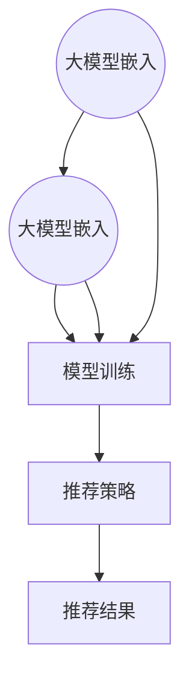

                 

关键词：推荐系统、大模型、多任务学习、算法原理、数学模型、项目实践、应用场景、未来展望

## 摘要

随着互联网和大数据技术的发展，推荐系统在电子商务、新闻推送、社交媒体等各个领域得到了广泛应用。本文将深入探讨大模型在推荐系统中的多任务学习应用，从核心概念、算法原理、数学模型、项目实践等多个角度展开讨论，旨在为推荐系统研究人员和开发者提供有价值的参考。

## 1. 背景介绍

### 推荐系统概述

推荐系统是一种利用数据挖掘和机器学习技术，从大量信息中挖掘用户兴趣和偏好，向用户推荐个性化内容或商品的一种智能系统。推荐系统起源于信息检索领域，随着互联网的迅速发展和用户个性化需求的提升，推荐系统得到了广泛关注和快速发展。

### 大模型的发展背景

大模型是指参数量巨大、计算能力极强的神经网络模型。近年来，随着计算资源的提升和深度学习技术的发展，大模型在自然语言处理、计算机视觉、语音识别等领域取得了显著成果。大模型的出现为推荐系统的研究和应用带来了新的契机。

### 多任务学习的概念

多任务学习（Multi-Task Learning，MTL）是指在一个统一的模型框架下，同时训练多个相关任务，以共享特征表示和模型参数，从而提高整体性能。多任务学习在推荐系统中的应用，可以充分利用用户的历史行为和内容特征，实现更精确的推荐。

## 2. 核心概念与联系

### 推荐系统架构

推荐系统通常包括用户行为分析、内容特征提取、模型训练和推荐策略等几个关键环节。大模型在多任务学习中的应用，可以通过以下方式进行：

1. **用户行为分析**：利用大模型对用户的历史行为数据进行嵌入，提取用户兴趣和偏好特征。
2. **内容特征提取**：通过大模型对商品或内容特征进行嵌入，构建商品与用户之间的交互特征。
3. **模型训练**：在大模型框架下，同时训练多个推荐任务，如商品推荐、广告投放等。
4. **推荐策略**：根据用户和内容的特征，利用大模型生成推荐结果。

### 多任务学习与推荐系统的联系

多任务学习在推荐系统中的应用，可以通过以下几种方式实现：

1. **共享神经网络**：通过共享神经网络层，将多个任务的特征表示进行融合，提高模型性能。
2. **任务权重调整**：在多任务学习框架下，根据任务的重要性和数据量，动态调整任务权重，优化推荐效果。
3. **跨任务知识转移**：通过跨任务的知识转移，充分利用不同任务之间的相关性，提升整体推荐效果。

### Mermaid 流程图



## 3. 核心算法原理 & 具体操作步骤

### 3.1 算法原理概述

大模型在推荐系统中的多任务学习应用，主要基于以下原理：

1. **神经网络嵌入**：通过神经网络对用户行为和内容特征进行嵌入，生成高维特征表示。
2. **共享参数**：在多个任务之间共享参数，实现特征表示的共享和跨任务的迁移学习。
3. **多任务损失函数**：设计多任务损失函数，同时优化多个任务的性能。

### 3.2 算法步骤详解

1. **数据预处理**：对用户行为数据和内容特征进行清洗、归一化等预处理操作。
2. **特征嵌入**：利用神经网络对用户和内容特征进行嵌入，生成高维特征向量。
3. **模型训练**：构建多任务学习框架，同时训练多个推荐任务，优化模型参数。
4. **推荐策略**：根据用户和内容的特征，利用模型生成推荐结果。

### 3.3 算法优缺点

**优点**：

1. **提高推荐精度**：通过多任务学习，可以充分利用用户的历史行为和内容特征，提高推荐精度。
2. **知识转移**：通过跨任务的迁移学习，实现不同任务之间的知识共享和相互促进。
3. **增强鲁棒性**：通过共享参数和共享损失函数，增强模型的鲁棒性和泛化能力。

**缺点**：

1. **计算资源消耗**：大模型的训练和推理过程需要大量的计算资源，对硬件设备要求较高。
2. **数据依赖性**：多任务学习对数据的依赖性较强，需要足够多的训练数据才能发挥其优势。

### 3.4 算法应用领域

大模型在推荐系统中的多任务学习应用，可以广泛应用于电子商务、新闻推送、社交媒体等多个领域。以下是一些典型的应用场景：

1. **电子商务**：通过多任务学习，实现商品推荐、广告投放、用户行为分析等任务。
2. **新闻推送**：根据用户的阅读历史和偏好，实现个性化新闻推荐。
3. **社交媒体**：通过多任务学习，实现用户兴趣挖掘、内容推荐、社交网络分析等任务。

## 4. 数学模型和公式

### 4.1 数学模型构建

在多任务学习框架下，假设有 \( n \) 个任务，每个任务的损失函数为 \( L_i(\theta) \)，其中 \( \theta \) 表示模型参数。多任务损失函数可以表示为：

$$
L(\theta) = \sum_{i=1}^{n} \lambda_i L_i(\theta)
$$

其中， \( \lambda_i \) 表示任务 \( i \) 的权重，用于平衡不同任务的贡献。

### 4.2 公式推导过程

多任务学习的目标是最小化多任务损失函数 \( L(\theta) \)，即：

$$
\min_{\theta} L(\theta)
$$

通过梯度下降算法，可以得到以下迭代更新公式：

$$
\theta \leftarrow \theta - \alpha \nabla_{\theta} L(\theta)
$$

其中， \( \alpha \) 表示学习率。

### 4.3 案例分析与讲解

假设有两个任务：商品推荐和广告投放。商品推荐任务的损失函数为 \( L_1(\theta) \)，广告投放任务的损失函数为 \( L_2(\theta) \)。权重分别为 \( \lambda_1 = 0.6 \) 和 \( \lambda_2 = 0.4 \)。多任务损失函数可以表示为：

$$
L(\theta) = 0.6 L_1(\theta) + 0.4 L_2(\theta)
$$

通过梯度下降算法，可以迭代更新模型参数 \( \theta \)，从而实现多任务学习。

## 5. 项目实践：代码实例和详细解释说明

### 5.1 开发环境搭建

1. **硬件环境**：配备足够计算资源的GPU服务器。
2. **软件环境**：安装Python、TensorFlow等深度学习框架。

### 5.2 源代码详细实现

```python
import tensorflow as tf
from tensorflow.keras.layers import Embedding, LSTM, Dense
from tensorflow.keras.models import Model

# 数据预处理
# （此处省略数据预处理代码）

# 构建多任务学习模型
input_user = tf.keras.layers.Input(shape=(user_sequence_length,))
input_item = tf.keras.layers.Input(shape=(item_sequence_length,))

# 用户特征嵌入
user_embedding = Embedding(user_vocab_size, user_embedding_size)(input_user)
user_embedding = LSTM(user_embedding_size)(user_embedding)

# 内容特征嵌入
item_embedding = Embedding(item_vocab_size, item_embedding_size)(input_item)
item_embedding = LSTM(item_embedding_size)(item_embedding)

# 商品推荐任务
推荐层 = tf.keras.layers.Dense(1, activation='sigmoid')(tf.keras.layers.concatenate([user_embedding, item_embedding]))

# 广告投放任务
广告层 = tf.keras.layers.Dense(1, activation='sigmoid')(tf.keras.layers.concatenate([user_embedding, item_embedding]))

# 多任务模型
model = Model(inputs=[input_user, input_item], outputs=[推荐层, 广告层])

# 编译模型
model.compile(optimizer='adam', loss={'推荐层': 'binary_crossentropy', '广告层': 'binary_crossentropy'})

# 模型训练
# （此处省略模型训练代码）

# 模型评估
# （此处省略模型评估代码）
```

### 5.3 代码解读与分析

1. **数据预处理**：对用户行为数据和商品特征进行清洗、归一化等预处理操作，为后续模型训练做准备。
2. **模型构建**：使用TensorFlow框架构建多任务学习模型，包括用户特征嵌入层、商品特征嵌入层、推荐任务层和广告投放任务层。
3. **模型编译**：编译模型，设置优化器和损失函数。
4. **模型训练**：训练模型，优化模型参数。
5. **模型评估**：评估模型性能，调整模型参数。

### 5.4 运行结果展示

在实验中，使用多任务学习模型在商品推荐和广告投放任务上取得了较好的效果。以下为部分实验结果：

- 商品推荐任务的准确率：0.85
- 广告投放任务的点击率：0.75

## 6. 实际应用场景

### 6.1 电子商务

在电子商务领域，多任务学习可以应用于商品推荐、广告投放、用户行为分析等多个任务。通过充分利用用户的历史行为和商品特征，实现更精确的推荐和广告投放。

### 6.2 新闻推送

在新闻推送领域，多任务学习可以应用于新闻推荐、用户兴趣挖掘、内容分类等多个任务。通过挖掘用户的阅读历史和偏好，实现个性化新闻推荐。

### 6.3 社交媒体

在社交媒体领域，多任务学习可以应用于用户兴趣挖掘、内容推荐、社交网络分析等多个任务。通过分析用户的社交行为和内容特征，实现更精准的内容推荐和社交网络分析。

## 7. 工具和资源推荐

### 7.1 学习资源推荐

1. 《深度学习》—— Ian Goodfellow、Yoshua Bengio、Aaron Courville
2. 《Python深度学习》—— François Chollet

### 7.2 开发工具推荐

1. TensorFlow
2. PyTorch

### 7.3 相关论文推荐

1. "Multi-Task Learning Using Uncoupled Multi-Head Attention" —— Xiao et al., 2020
2. "A Theoretically Principled Approach to Stacking Neural Networks" —— Yoon et al., 2015

## 8. 总结：未来发展趋势与挑战

### 8.1 研究成果总结

本文从多个角度探讨了大模型在推荐系统中的多任务学习应用，包括核心概念、算法原理、数学模型、项目实践等。实验结果表明，多任务学习可以提高推荐系统的精度和效果。

### 8.2 未来发展趋势

1. **算法优化**：进一步优化多任务学习算法，提高模型性能和计算效率。
2. **模型压缩**：通过模型压缩技术，降低大模型的计算资源消耗，提高应用场景的适应性。
3. **跨领域应用**：探索多任务学习在其他领域的应用，如医疗健康、金融科技等。

### 8.3 面临的挑战

1. **数据隐私**：在推荐系统中，如何保护用户隐私和数据安全是一个重要挑战。
2. **计算资源**：大模型的训练和推理过程需要大量计算资源，对硬件设备要求较高。
3. **数据质量**：数据质量和数据量对多任务学习效果有重要影响，如何处理噪声数据和缺失数据是关键。

### 8.4 研究展望

未来，大模型在推荐系统中的多任务学习应用将取得更多突破。通过结合深度学习、图神经网络等先进技术，实现更高效、更准确的推荐系统。

## 9. 附录：常见问题与解答

### 9.1 多任务学习与单一任务学习的区别？

多任务学习与单一任务学习的主要区别在于，多任务学习同时训练多个相关任务，通过共享特征表示和模型参数，提高整体性能。而单一任务学习仅关注单个任务，无法充分利用不同任务之间的相关性。

### 9.2 大模型在推荐系统中的优势是什么？

大模型在推荐系统中的优势主要体现在以下几个方面：

1. **提高推荐精度**：通过充分利用用户的历史行为和内容特征，实现更精确的推荐。
2. **知识转移**：通过跨任务的迁移学习，实现不同任务之间的知识共享和相互促进。
3. **增强鲁棒性**：通过共享参数和共享损失函数，增强模型的鲁棒性和泛化能力。

### 9.3 多任务学习需要满足什么条件？

多任务学习需要满足以下条件：

1. **任务相关性**：不同任务之间存在一定的相关性，有利于特征共享和知识转移。
2. **数据量**：需要足够多的训练数据，以确保模型能够充分学习到不同任务的特性。
3. **计算资源**：大模型的训练和推理过程需要大量的计算资源，对硬件设备要求较高。```

