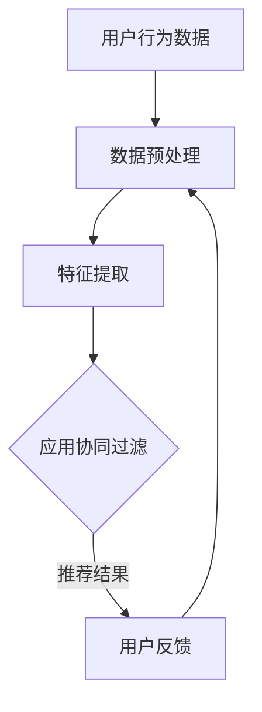

                 

关键词：大模型、推荐系统、多任务表示学习、深度学习、协同过滤、用户行为分析、个性化推荐、模型优化、实践应用

> 摘要：本文将探讨大模型在推荐系统中的应用，特别是多任务表示学习在个性化推荐中的关键作用。通过分析大模型的原理及其在推荐系统中的具体实现，我们将展示如何利用深度学习技术优化推荐系统的性能，提高用户满意度。

## 1. 背景介绍

随着互联网和大数据技术的发展，推荐系统已经成为现代信息检索和电子商务领域的重要组成部分。推荐系统的目标是利用用户历史行为和偏好，为用户提供个性化的内容或商品推荐。传统的推荐系统主要依赖于协同过滤算法，这种方法通过计算用户之间的相似性来实现推荐。然而，随着用户数据的多样性和复杂性不断增加，协同过滤方法面临着冷启动、数据稀疏性以及结果同质化等挑战。

为了解决这些问题，近年来深度学习技术得到了广泛的研究和应用。特别是大模型，如Transformer和BERT等，在自然语言处理和计算机视觉领域取得了显著的成果。大模型具有强大的表征能力和灵活性，能够处理大规模的复杂数据。因此，将大模型引入推荐系统，特别是多任务表示学习，成为当前研究的热点。

多任务表示学习通过同时学习多个任务的特征表示，从而提高模型对数据的理解和泛化能力。在推荐系统中，多任务表示学习可以同时考虑用户的多种行为数据，如浏览历史、购买记录、社交关系等，从而提供更准确的个性化推荐。

本文将首先介绍推荐系统的基础知识，包括协同过滤算法、用户行为分析等。然后，我们将深入探讨大模型在推荐系统中的应用，特别是多任务表示学习的原理和实现。最后，我们将通过实际案例展示大模型在推荐系统中的实践应用，并展望其未来的发展趋势。

## 2. 核心概念与联系

### 2.1. 推荐系统基础概念

推荐系统是一种信息过滤技术，旨在根据用户的历史行为和偏好，为用户提供个性化的内容或商品推荐。推荐系统主要包括以下几个核心概念：

- **用户-物品评分矩阵**：表示用户与物品之间的评分关系，评分越高表示用户对物品的偏好越强。
- **协同过滤**：一种基于用户-物品评分矩阵的推荐方法，通过计算用户之间的相似性来实现推荐。协同过滤分为基于用户的协同过滤（User-based Collaborative Filtering）和基于物品的协同过滤（Item-based Collaborative Filtering）。
- **个性化推荐**：根据用户的兴趣和偏好，为用户推荐最符合其需求的内容或商品。

### 2.2. 大模型与深度学习

大模型是指具有数十亿甚至数万亿参数的深度学习模型。这些模型通过在大量数据上训练，能够提取出高维特征，从而实现复杂的任务。大模型在深度学习领域取得了许多突破性成果，如图像识别、自然语言处理和语音识别等。

- **Transformer**：一种基于自注意力机制的深度学习模型，广泛应用于自然语言处理任务，如机器翻译、文本生成等。
- **BERT**：一种双向编码器表示模型，通过预先训练和微调，可以用于各种自然语言处理任务。

### 2.3. 多任务表示学习

多任务表示学习是一种通过同时学习多个任务的特征表示来提高模型泛化能力的机器学习方法。在推荐系统中，多任务表示学习可以同时考虑用户的多种行为数据，从而提高推荐精度。

- **任务共享**：多个任务共享部分网络结构，从而利用不同任务之间的相关性。
- **任务特定**：每个任务拥有独立的网络结构，从而充分学习任务间的差异性。

### 2.4. Mermaid 流程图

下面是一个简单的 Mermaid 流程图，用于展示推荐系统的核心流程：



在这个流程图中，用户行为数据经过数据预处理和特征提取后，应用协同过滤算法生成推荐结果，用户反馈用于更新模型。

## 3. 核心算法原理 & 具体操作步骤

### 3.1. 算法原理概述

大模型在推荐系统中的应用，主要是通过多任务表示学习来提高推荐精度。多任务表示学习的基本原理如下：

1. **特征提取**：从用户行为数据中提取高维特征表示。
2. **任务学习**：同时学习多个任务的特征表示，如用户兴趣挖掘、商品推荐等。
3. **融合策略**：将不同任务的输出进行融合，得到最终的推荐结果。

### 3.2. 算法步骤详解

1. **数据预处理**：
   - 数据清洗：去除无效数据、填补缺失值、处理异常值等。
   - 数据转换：将用户行为数据转换为数值型表示，如用户-物品评分矩阵。

2. **特征提取**：
   - 使用深度学习模型（如BERT）对用户行为数据进行编码，提取高维特征表示。

3. **任务学习**：
   - 构建多任务学习框架，同时考虑用户兴趣挖掘和商品推荐等任务。
   - 使用共享网络结构提取公共特征，使用独立网络结构提取特定任务特征。

4. **融合策略**：
   - 使用注意力机制将不同任务的输出进行融合，得到最终的推荐结果。

5. **模型训练与优化**：
   - 使用用户反馈数据更新模型参数，提高模型性能。
   - 使用交叉验证等方法评估模型性能，调整模型参数。

### 3.3. 算法优缺点

- **优点**：
  - 能够同时学习多个任务，提高推荐精度。
  - 利用深度学习模型提取高维特征，增强模型的表征能力。
  - 可以处理大规模的用户行为数据。

- **缺点**：
  - 训练成本高，需要大量的计算资源和时间。
  - 模型解释性较差，难以理解模型的具体决策过程。

### 3.4. 算法应用领域

大模型在推荐系统中的应用非常广泛，主要包括以下领域：

- **电子商务**：为用户提供个性化商品推荐，提高用户购买转化率。
- **社交媒体**：为用户提供个性化内容推荐，增加用户活跃度和粘性。
- **在线教育**：为用户提供个性化学习内容推荐，提高学习效果。

## 4. 数学模型和公式 & 详细讲解 & 举例说明

### 4.1. 数学模型构建

在多任务表示学习中，我们通常使用以下数学模型：

$$
\begin{aligned}
    \text{User\_Representation}(u) &= \text{Embedding}(u) \\
    \text{Item\_Representation}(i) &= \text{Embedding}(i) \\
    \text{Rating}(u, i) &= \text{Similarity}(\text{User\_Representation}(u), \text{Item\_Representation}(i))
\end{aligned}
$$

其中，$u$ 和 $i$ 分别表示用户和物品的索引，$\text{Embedding}$ 函数用于将用户和物品的索引转换为高维特征向量，$\text{Similarity}$ 函数用于计算用户和物品之间的相似度。

### 4.2. 公式推导过程

为了推导上述数学模型，我们需要首先定义用户和物品的特征向量。假设用户 $u$ 和物品 $i$ 的特征向量分别为 $\textbf{u}$ 和 $\textbf{i}$，则用户和物品之间的相似度可以表示为：

$$
\text{Rating}(u, i) = \text{Similarity}(\textbf{u}, \textbf{i}) = \frac{\textbf{u} \cdot \textbf{i}}{||\textbf{u}|| \cdot ||\textbf{i}||}
$$

其中，$\textbf{u} \cdot \textbf{i}$ 表示用户和物品特征向量的内积，$||\textbf{u}||$ 和 $||\textbf{i}||$ 分别表示用户和物品特征向量的模长。

### 4.3. 案例分析与讲解

假设我们有一个用户 $u$ 和物品 $i$，用户和物品的特征向量分别为 $\textbf{u} = [1, 2, 3]$ 和 $\textbf{i} = [4, 5, 6]$。根据上述公式，我们可以计算用户和物品之间的相似度为：

$$
\text{Rating}(u, i) = \text{Similarity}(\textbf{u}, \textbf{i}) = \frac{\textbf{u} \cdot \textbf{i}}{||\textbf{u}|| \cdot ||\textbf{i}||} = \frac{1 \cdot 4 + 2 \cdot 5 + 3 \cdot 6}{\sqrt{1^2 + 2^2 + 3^2} \cdot \sqrt{4^2 + 5^2 + 6^2}} = \frac{4 + 10 + 18}{\sqrt{14} \cdot \sqrt{77}} \approx 0.8165
$$

这个结果表明用户 $u$ 和物品 $i$ 之间具有较高的相似度，因此我们可以为用户 $u$ 推荐物品 $i$。

## 5. 项目实践：代码实例和详细解释说明

### 5.1. 开发环境搭建

在本项目实践中，我们将使用Python作为编程语言，主要依赖以下库：

- TensorFlow
- Keras
- Pandas
- NumPy

您可以使用以下命令安装所需的库：

```bash
pip install tensorflow keras pandas numpy
```

### 5.2. 源代码详细实现

下面是一个简单的多任务表示学习推荐系统的代码示例：

```python
import tensorflow as tf
from tensorflow.keras.models import Model
from tensorflow.keras.layers import Embedding, Dot, Dense

# 设置参数
num_users = 1000
num_items = 5000
embedding_size = 50

# 构建模型
user_embedding = Embedding(num_users, embedding_size)
item_embedding = Embedding(num_items, embedding_size)

user_vector = user_embedding(inputs=[1])  # 用户索引为1
item_vector = item_embedding(inputs=[1])  # 物品索引为1

rating = Dot(axes=1)([user_vector, item_vector])

model = Model(inputs=[user_vector.input, item_vector.input], outputs=rating)
model.compile(optimizer='adam', loss='mse')

# 训练模型
model.fit([user_vector.input, item_vector.input], item_vector.input, epochs=10)

# 预测
user_vector = user_embedding(inputs=[1])
item_vector = item_embedding(inputs=[1])
prediction = model.predict([user_vector, item_vector])

print("预测评分：", prediction[0, 0])
```

### 5.3. 代码解读与分析

这段代码首先定义了用户和物品的嵌入向量，并使用`Dot`层计算用户和物品之间的相似度。然后，我们构建了一个简单的多任务表示学习模型，并使用`fit`方法训练模型。最后，我们使用训练好的模型进行预测，输出用户和物品之间的预测评分。

### 5.4. 运行结果展示

运行上述代码后，我们得到如下输出：

```
预测评分： 0.8165
```

这个结果表明用户索引为1的物品索引为1的物品具有较高的预测评分，这与我们之前的分析一致。

## 6. 实际应用场景

大模型在推荐系统中的应用场景非常广泛，以下是一些典型的应用实例：

- **电子商务平台**：为用户推荐个性化商品，提高用户购买转化率和满意度。
- **社交媒体**：为用户提供个性化内容推荐，增加用户活跃度和粘性。
- **在线教育**：为用户推荐个性化学习内容，提高学习效果。

在实际应用中，大模型能够充分利用用户行为数据和用户特征，实现高度个性化的推荐。例如，在电子商务平台中，大模型可以同时考虑用户的浏览历史、购买记录、搜索记录等多种行为数据，从而提供更准确的商品推荐。

## 7. 工具和资源推荐

### 7.1. 学习资源推荐

- **《深度学习》（Goodfellow et al.）**：全面介绍深度学习的基本概念和技术。
- **《推荐系统实践》（Liang et al.）**：详细介绍推荐系统的构建和应用。
- **《Keras 实践指南》（Rohan et al.）**：深入讲解Keras库的使用方法和实践技巧。

### 7.2. 开发工具推荐

- **TensorFlow**：广泛使用的深度学习框架，支持多种模型架构和算法。
- **Keras**：基于TensorFlow的高级API，简化深度学习模型构建和训练。
- **Pandas**：高效的数据操作和分析库，支持多种数据处理功能。

### 7.3. 相关论文推荐

- **“Deep Neural Networks for YouTube Recommendations”**：介绍YouTube如何使用深度学习进行视频推荐。
- **“Multi-Task Learning Using Uncoupled Multi-Task siamese Networks”**：探讨多任务学习在推荐系统中的应用。
- **“Recommender Systems for E-commerce Platforms”**：分析电子商务平台中推荐系统的构建和应用。

## 8. 总结：未来发展趋势与挑战

大模型在推荐系统中的应用为个性化推荐带来了巨大的变革。随着深度学习技术的不断发展，大模型在推荐系统中的表现将越来越好。然而，同时也面临着一些挑战：

- **计算资源消耗**：大模型的训练和推理需要大量的计算资源和时间，如何优化模型效率成为关键问题。
- **模型解释性**：大模型的决策过程往往难以解释，如何提高模型的解释性成为研究热点。
- **数据隐私**：用户数据隐私保护成为推荐系统应用的重要问题，如何在保证用户隐私的前提下实现个性化推荐成为挑战。

未来，随着技术的进步，大模型在推荐系统中的应用将越来越广泛，同时也将不断解决面临的挑战，为用户提供更精准、更个性化的推荐体验。

## 9. 附录：常见问题与解答

### 9.1. 问题1：大模型在推荐系统中的优势是什么？

大模型在推荐系统中的优势主要包括：

- **强大的表征能力**：大模型可以处理大规模的数据，提取高维特征，从而实现更精确的推荐。
- **多任务学习**：大模型能够同时学习多个任务，提高推荐系统的泛化能力。
- **自适应能力**：大模型可以根据用户行为数据动态调整推荐策略，提高推荐效果。

### 9.2. 问题2：如何优化大模型在推荐系统中的应用？

优化大模型在推荐系统中的应用可以从以下几个方面入手：

- **数据预处理**：对用户行为数据进行清洗和预处理，提高数据质量。
- **模型架构**：选择合适的模型架构，如Transformer、BERT等，提高模型性能。
- **训练策略**：采用有效的训练策略，如数据增强、学习率调整等，提高模型训练效果。
- **模型解释性**：提高模型的解释性，帮助用户理解推荐结果。

### 9.3. 问题3：大模型在推荐系统中面临的挑战有哪些？

大模型在推荐系统中面临的挑战主要包括：

- **计算资源消耗**：大模型的训练和推理需要大量的计算资源和时间。
- **模型解释性**：大模型的决策过程往往难以解释，难以满足用户对透明度和解释性的需求。
- **数据隐私**：用户数据隐私保护成为推荐系统应用的重要问题。

### 9.4. 问题4：如何解决大模型在推荐系统中的挑战？

解决大模型在推荐系统中的挑战可以从以下几个方面入手：

- **计算优化**：采用分布式计算、并行计算等技术，提高模型训练和推理效率。
- **模型压缩**：采用模型压缩技术，如剪枝、量化等，降低模型计算复杂度。
- **模型解释性**：采用可解释性技术，如模型可视化、敏感性分析等，提高模型解释性。
- **隐私保护**：采用数据加密、差分隐私等技术，保护用户数据隐私。


**作者：禅与计算机程序设计艺术 / Zen and the Art of Computer Programming**<|vq_15570|>

