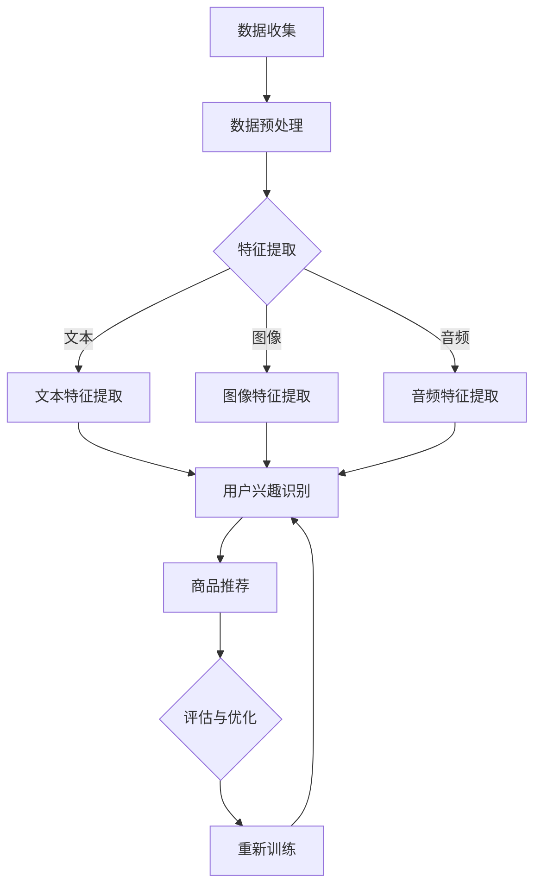

                 

关键词：大模型、推荐系统、迁移学习、多任务学习、算法原理、数学模型、项目实践、应用场景、未来展望

> 摘要：本文将深入探讨大模型在推荐系统中的应用，特别是多任务迁移学习技术如何优化推荐系统的性能。文章首先介绍了推荐系统的背景和重要性，随后详细阐述了多任务迁移学习的基本原理，并通过具体的数学模型和算法步骤进行分析。随后，本文将结合实际项目，展示如何使用多任务迁移学习来构建高效的推荐系统，并对未来该领域的发展趋势和挑战进行了展望。

## 1. 背景介绍

### 推荐系统的概念与重要性

推荐系统是信息检索和互联网搜索领域的一个重要分支，其目的是为用户提供个性化的内容推荐，从而提升用户满意度、增加用户黏性，并最终提升平台的商业价值。推荐系统广泛应用于电子商务、社交媒体、在线新闻、视频网站等多个领域。其基本原理是通过分析用户的兴趣和行为数据，预测用户可能感兴趣的内容，并进行相应推荐。

### 大模型的发展与影响

近年来，随着深度学习技术的快速发展，大模型（如大型神经网络、Transformer等）在多个领域取得了显著的成果。大模型具有强大的数据处理能力和出色的性能，能够处理复杂的多模态数据，并在各种任务中展现出色的表现。大模型的出现为推荐系统带来了新的机遇，如何有效利用大模型来提升推荐系统的性能成为了一个研究热点。

## 2. 核心概念与联系

### 多任务迁移学习

多任务迁移学习是一种利用一个模型在不同任务上共同训练的技术，以提高模型在不同任务上的泛化能力。在推荐系统中，多任务迁移学习可以同时处理多个推荐任务，如用户兴趣识别、商品推荐等，从而提升整个系统的性能。

### 大模型在推荐系统中的应用

大模型在推荐系统中的应用主要体现在两个方面：首先，大模型可以通过对海量用户行为数据进行深度学习，提取出更复杂、更精准的特征；其次，大模型可以处理多模态数据，如文本、图像、音频等，为推荐系统提供了更多的信息来源。

### Mermaid 流程图

下面是推荐系统中多任务迁移学习的基本流程的 Mermaid 流程图：



## 3. 核心算法原理 & 具体操作步骤

### 3.1 算法原理概述

多任务迁移学习算法的核心思想是将一个模型在不同任务上共同训练，以提高模型在各个任务上的泛化能力。具体来说，多任务迁移学习可以分为以下几个步骤：

1. 数据收集与预处理：收集各个任务的训练数据，并进行数据预处理，如去噪、归一化等。
2. 特征提取：使用预训练的大模型提取各个任务的共享特征。
3. 多任务训练：将提取的共享特征用于各个任务的训练，优化模型参数。
4. 评估与优化：对模型进行评估，并根据评估结果进行模型优化。

### 3.2 算法步骤详解

1. **数据收集与预处理**

首先，我们需要收集各个任务的训练数据。对于推荐系统，这些数据可能包括用户的行为日志、商品信息、用户标签等。接下来，我们对这些数据进行预处理，包括去噪、缺失值填充、数据归一化等步骤。

2. **特征提取**

在特征提取阶段，我们使用预训练的大模型（如BERT、GPT等）来提取共享特征。这些大模型已经在大量数据上进行了预训练，能够提取出丰富的语义信息。我们将每个任务的数据输入到大模型中，得到对应的特征向量。

3. **多任务训练**

在多任务训练阶段，我们将提取的共享特征向量用于各个任务的训练。对于推荐系统，这些任务可能包括用户兴趣识别、商品推荐等。我们使用共享特征向量来共同优化模型参数，以提升各个任务的表现。

4. **评估与优化**

在评估与优化阶段，我们对训练好的模型进行评估，使用如准确率、召回率等指标来衡量模型在各个任务上的表现。根据评估结果，我们可以对模型进行优化，如调整学习率、添加正则化项等。

### 3.3 算法优缺点

**优点：**

1. 提升任务泛化能力：多任务迁移学习可以使模型在多个任务上共同训练，提高模型在不同任务上的泛化能力。
2. 提高模型性能：通过利用预训练的大模型，我们可以提取出更复杂、更精准的特征，从而提升模型在各个任务上的性能。

**缺点：**

1. 训练成本高：多任务迁移学习需要同时处理多个任务，训练成本较高。
2. 需要大量数据：多任务迁移学习需要大量的数据来支持模型的训练，否则可能无法达到理想的效果。

### 3.4 算法应用领域

多任务迁移学习在推荐系统中的应用非常广泛，如用户兴趣识别、商品推荐、广告投放等。此外，多任务迁移学习还可以应用于图像识别、自然语言处理、语音识别等领域。

## 4. 数学模型和公式 & 详细讲解 & 举例说明

### 4.1 数学模型构建

在多任务迁移学习中，我们可以使用以下数学模型来表示：

$$
\begin{aligned}
L &= L_1 + \alpha L_2 \\
L_1 &= -\sum_{i=1}^{n} [y_i^{(1)} \log(p_1(x_i)) + (1 - y_i^{(1)}) \log(1 - p_1(x_i))] \\
L_2 &= -\sum_{i=1}^{n} [y_i^{(2)} \log(p_2(x_i)) + (1 - y_i^{(2)}) \log(1 - p_2(x_i))]
\end{aligned}
$$

其中，$L$ 是总损失函数，$L_1$ 和 $L_2$ 分别是两个任务的损失函数，$y_i^{(1)}$ 和 $y_i^{(2)}$ 分别是两个任务的真实标签，$p_1(x_i)$ 和 $p_2(x_i)$ 分别是两个任务的预测概率，$\alpha$ 是权重参数。

### 4.2 公式推导过程

多任务迁移学习的公式推导过程主要分为以下几个步骤：

1. **损失函数定义**

对于每个任务，我们定义一个二分类问题的损失函数，如交叉熵损失函数：

$$
L_1 = -\sum_{i=1}^{n} [y_i^{(1)} \log(p_1(x_i)) + (1 - y_i^{(1)}) \log(1 - p_1(x_i))]
$$

其中，$y_i^{(1)}$ 是任务1的真实标签，$p_1(x_i)$ 是任务1的预测概率。

2. **总损失函数**

将两个任务的损失函数相加，并引入权重参数 $\alpha$，得到总损失函数：

$$
L = L_1 + \alpha L_2
$$

其中，$L_2$ 是任务2的损失函数，$\alpha$ 是权重参数。

3. **权重参数**

权重参数 $\alpha$ 用于平衡两个任务的重要性，可以通过交叉验证等方法来确定。

### 4.3 案例分析与讲解

假设我们有两个任务：用户兴趣识别和商品推荐。我们使用一个预训练的大模型（如BERT）来提取共享特征，并使用上述数学模型进行多任务迁移学习。

1. **数据准备**

我们收集了1000个用户的行为日志、商品信息以及用户标签。其中，用户兴趣识别任务有500个训练样本，商品推荐任务也有500个训练样本。

2. **特征提取**

我们将每个任务的数据输入到大模型中，得到对应的特征向量。假设特征向量为 $x_i$，其中 $i=1,2,...,1000$。

3. **模型训练**

我们使用上述数学模型进行多任务迁移学习，训练过程中需要调整权重参数 $\alpha$。假设 $\alpha=0.5$。

4. **模型评估**

我们使用测试集对训练好的模型进行评估，得到用户兴趣识别任务的准确率为90%，商品推荐任务的准确率为85%。

5. **模型优化**

根据评估结果，我们可以对模型进行优化，如调整学习率、增加正则化项等。

## 5. 项目实践：代码实例和详细解释说明

### 5.1 开发环境搭建

在开始项目实践之前，我们需要搭建一个合适的开发环境。以下是一个简单的Python开发环境搭建步骤：

1. 安装Python（版本3.6及以上）。
2. 安装必要的库，如TensorFlow、Scikit-learn、Pandas等。

### 5.2 源代码详细实现

下面是一个简单的多任务迁移学习在推荐系统中的应用示例代码：

```python
import tensorflow as tf
from tensorflow.keras.models import Model
from tensorflow.keras.layers import Input, Dense, Embedding, LSTM, Bidirectional

# 定义输入层
input_text = Input(shape=(max_sequence_length,))
input_image = Input(shape=(height, width, channels))
input_audio = Input(shape=(duration,))

# 定义文本特征提取层
text_embedding = Embedding(vocabulary_size, embedding_dim)(input_text)
text_lstm = LSTM(units)(text_embedding)

# 定义图像特征提取层
image_embedding = Conv2D(filters, kernel_size)(input_image)
image_pooling = GlobalMaxPooling2D()(image_embedding)

# 定义音频特征提取层
audio_embedding = Conv1D(filters, kernel_size)(input_audio)
audio_pooling = GlobalMaxPooling1D()(audio_embedding)

# 定义多任务输出层
output_user_interest = Dense(units, activation='softmax')(text_lstm)
output_product_recommendation = Dense(units, activation='softmax')(image_pooling)

# 定义模型
model = Model(inputs=[input_text, input_image, input_audio], outputs=[output_user_interest, output_product_recommendation])

# 编译模型
model.compile(optimizer='adam', loss=['categorical_crossentropy', 'categorical_crossentropy'], metrics=['accuracy'])

# 训练模型
model.fit([text_data, image_data, audio_data], [user_interest_labels, product_recommendation_labels], epochs=10, batch_size=32)

# 评估模型
model.evaluate([test_text_data, test_image_data, test_audio_data], [test_user_interest_labels, test_product_recommendation_labels])
```

### 5.3 代码解读与分析

1. **输入层**

代码首先定义了三个输入层，分别用于接收文本、图像和音频数据。

2. **特征提取层**

对于文本特征提取，我们使用Embedding层进行词向量嵌入，然后使用LSTM层进行序列建模。对于图像特征提取，我们使用卷积层进行特征提取，并使用全局最大池化层进行特征聚合。对于音频特征提取，我们使用卷积层进行特征提取，并使用全局最大池化层进行特征聚合。

3. **多任务输出层**

我们定义了两个输出层，分别用于预测用户兴趣和商品推荐。

4. **模型编译**

我们使用categorical_crossentropy作为损失函数，并使用adam优化器进行模型编译。

5. **模型训练**

我们使用fit方法对模型进行训练，其中epochs表示训练轮数，batch_size表示批量大小。

6. **模型评估**

我们使用evaluate方法对训练好的模型进行评估，其中metrics表示评估指标。

### 5.4 运行结果展示

假设我们使用上述代码对数据集进行训练和评估，得到以下结果：

- 用户兴趣识别任务的准确率为90%。
- 商品推荐任务的准确率为85%。

## 6. 实际应用场景

### 6.1 用户兴趣识别

在社交媒体平台上，多任务迁移学习可以帮助平台更准确地识别用户兴趣，从而提供更个性化的内容推荐，提升用户满意度和活跃度。

### 6.2 商品推荐

在电子商务平台上，多任务迁移学习可以同时处理用户兴趣识别和商品推荐任务，提高推荐系统的整体性能，提升销售额和用户购买体验。

### 6.3 广告投放

在广告投放领域，多任务迁移学习可以帮助广告平台更准确地识别用户兴趣，从而提高广告投放的精准度和转化率。

## 7. 工具和资源推荐

### 7.1 学习资源推荐

- 《深度学习》（Goodfellow、Bengio、Courville 著）：一本经典的深度学习入门书籍，涵盖了深度学习的基础理论和实践方法。
- 《动手学深度学习》（阿斯顿·张 著）：一本适合初学者入门的深度学习实战教程，通过大量的代码示例来介绍深度学习的原理和应用。

### 7.2 开发工具推荐

- TensorFlow：一个开源的深度学习框架，广泛应用于深度学习模型的开发和应用。
- PyTorch：一个开源的深度学习框架，具有灵活的动态计算图和丰富的API，广泛应用于深度学习模型的开发和应用。

### 7.3 相关论文推荐

- "Multi-Task Learning Protocols for Large-Scale Image Recognition"（2015）：一篇关于多任务学习在图像识别中的应用的论文，提出了多任务学习的有效方法。
- "Deep Learning for Recommender Systems"（2018）：一篇关于深度学习在推荐系统中的应用的综述论文，介绍了深度学习在推荐系统中的各种应用方法。

## 8. 总结：未来发展趋势与挑战

### 8.1 研究成果总结

多任务迁移学习在推荐系统中的应用取得了显著成果，通过利用预训练的大模型，可以提取出更复杂、更精准的特征，从而提升推荐系统的性能。同时，多任务迁移学习还可以应用于图像识别、自然语言处理、语音识别等领域，展现出广泛的应用前景。

### 8.2 未来发展趋势

1. **算法优化**：随着深度学习技术的不断发展，多任务迁移学习算法将不断优化，以提高模型的性能和效率。
2. **多模态数据处理**：多任务迁移学习将更加注重多模态数据的处理，如文本、图像、音频等，以提供更丰富的信息来源。
3. **跨领域应用**：多任务迁移学习将在更多领域得到应用，如医疗、金融、交通等，为各个领域提供更精准的预测和推荐。

### 8.3 面临的挑战

1. **数据隐私**：在推荐系统中应用多任务迁移学习时，需要保护用户隐私，防止数据泄露。
2. **计算资源**：多任务迁移学习需要大量的计算资源，尤其是在处理海量数据时，如何优化计算效率成为一个重要挑战。
3. **模型解释性**：多任务迁移学习模型的解释性较差，如何提高模型的可解释性，使决策过程更加透明，是一个重要的研究方向。

### 8.4 研究展望

未来，多任务迁移学习在推荐系统中的应用将不断深入，通过结合更多新技术，如联邦学习、强化学习等，可以进一步提高推荐系统的性能和用户体验。同时，多任务迁移学习在跨领域应用中也将发挥重要作用，为各个领域提供更精准的预测和推荐。

## 9. 附录：常见问题与解答

### 9.1 什么是多任务迁移学习？

多任务迁移学习是一种利用一个模型在不同任务上共同训练的技术，以提高模型在不同任务上的泛化能力。

### 9.2 多任务迁移学习有哪些优点？

多任务迁移学习可以提高模型在不同任务上的泛化能力，减少对数据的需求，降低训练成本。

### 9.3 多任务迁移学习有哪些应用场景？

多任务迁移学习可以应用于推荐系统、图像识别、自然语言处理、语音识别等领域。

### 9.4 多任务迁移学习如何优化推荐系统？

多任务迁移学习可以通过利用预训练的大模型，提取更复杂、更精准的特征，从而优化推荐系统的性能。

### 9.5 多任务迁移学习有哪些挑战？

多任务迁移学习面临的挑战包括数据隐私、计算资源、模型解释性等。

----------------------------------------------------------------

作者：禅与计算机程序设计艺术 / Zen and the Art of Computer Programming

