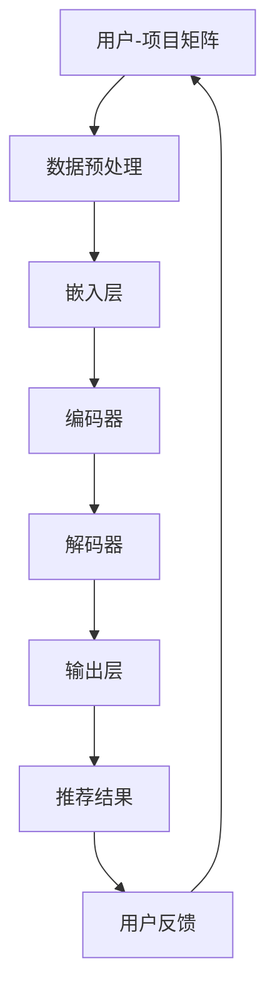
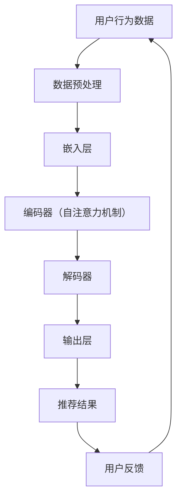

                 

关键词：推荐系统、大模型、AI、机器学习、数据处理、用户行为分析、信息过滤、个性化推荐

> 摘要：本文旨在探讨大模型在推荐系统中的应用及其前景。随着人工智能技术的发展，大模型作为一种强大的数据驱动工具，正在逐渐成为推荐系统的核心。本文首先介绍了推荐系统的基本概念和现状，然后详细阐述了大模型在推荐系统中的作用、核心算法原理及其在实际项目中的应用，最后对未来的发展趋势和面临的挑战进行了展望。

## 1. 背景介绍

推荐系统是一种信息过滤和内容分发技术，旨在向用户推荐他们可能感兴趣的商品、新闻、音乐、视频等。推荐系统广泛应用于电子商务、社交媒体、新闻媒体、在线视频等领域，极大地提升了用户体验和商业价值。传统的推荐系统主要基于协同过滤、基于内容的推荐等算法，然而，这些方法在处理大规模数据集和应对实时推荐需求时存在一定的局限性。

近年来，人工智能特别是大模型技术的发展为推荐系统带来了新的机遇。大模型具有处理海量数据、理解复杂语义、生成个性化内容的能力，能够显著提升推荐系统的效果和效率。本篇文章将围绕以下几个方面展开：

1. 推荐系统的基本概念和现状
2. 大模型在推荐系统中的作用和核心算法原理
3. 大模型在推荐系统中的实际应用
4. 未来应用展望

## 2. 核心概念与联系

### 2.1 推荐系统概述

推荐系统是一种基于数据挖掘和机器学习的算法，旨在发现用户之间的相似性，并将相关内容推荐给用户。推荐系统通常包括以下几个关键组成部分：

- **用户-项目矩阵（User-Item Matrix）**：这是推荐系统的核心数据结构，表示用户与项目之间的交互关系。每个用户都可能对多个项目进行评分、点击、购买等行为。
- **协同过滤（Collaborative Filtering）**：协同过滤是一种基于用户行为数据发现相似用户的推荐方法。它分为两种类型：基于用户的协同过滤（User-Based）和基于项目的协同过滤（Item-Based）。
- **基于内容的推荐（Content-Based Filtering）**：基于内容的推荐方法根据用户的历史行为和项目的属性进行匹配，推荐具有相似属性的项目。
- **机器学习模型（Machine Learning Models）**：推荐系统中常用的机器学习模型包括线性回归、逻辑回归、支持向量机、决策树、随机森林等。

### 2.2 大模型原理与架构

大模型通常是指具有数十亿甚至数千亿参数的深度学习模型，如Transformer、BERT等。大模型的核心原理是通过学习大量数据中的复杂模式和规律，实现对未知数据的预测和生成。大模型的架构通常包括以下几个关键部分：

- **输入层（Input Layer）**：接收用户行为数据和项目特征数据。
- **嵌入层（Embedding Layer）**：将输入数据转换为低维向量表示。
- **编码器（Encoder）**：如Transformer中的自注意力机制，用于捕捉输入数据中的上下文信息。
- **解码器（Decoder）**：用于生成推荐结果或预测用户行为。
- **输出层（Output Layer）**：通常是一个分类层或回归层，输出最终推荐结果。

### 2.3 大模型与推荐系统的结合

大模型在推荐系统中的应用主要体现在以下几个方面：

- **用户行为预测（User Behavior Prediction）**：通过学习用户的历史行为数据，大模型可以预测用户未来的行为，从而生成个性化的推荐。
- **内容生成（Content Generation）**：大模型可以根据用户的兴趣和偏好生成个性化的内容，如文章、音乐、视频等。
- **上下文感知（Context-Aware Recommendation）**：大模型可以捕捉用户在不同场景下的行为差异，实现上下文感知的推荐。
- **实时推荐（Real-Time Recommendation）**：大模型通过并行计算和分布式架构，可以实现对用户实时行为的响应，提供实时的推荐服务。

下面是一个用Mermaid绘制的推荐系统与大数据模型结合的流程图：



### 2.4 大模型核心算法原理

大模型在推荐系统中的应用主要基于以下核心算法原理：

- **自注意力机制（Self-Attention Mechanism）**：自注意力机制允许模型在处理输入序列时，将不同位置的信息进行加权整合，从而捕捉输入序列中的上下文关系。
- **Transformer模型（Transformer Model）**：Transformer模型是一种基于自注意力机制的序列到序列模型，被广泛应用于自然语言处理、图像识别等领域。
- **BERT模型（BERT Model）**：BERT是一种预训练的Transformer模型，通过在大量无标签文本数据上进行预训练，学习语言的深层语义表示，然后通过微调在特定任务上取得优异性能。

下面是一个大模型在推荐系统中应用的核心算法流程图：



## 3. 核心算法原理 & 具体操作步骤

### 3.1 算法原理概述

大模型在推荐系统中的应用主要基于深度学习中的Transformer模型和BERT模型。Transformer模型的核心思想是使用自注意力机制来捕捉输入序列中的上下文信息，而BERT模型则通过预训练和微调的方式，实现对自然语言处理任务的优秀性能。

### 3.2 算法步骤详解

1. **数据预处理**：首先对用户行为数据和项目特征数据进行预处理，包括数据清洗、缺失值处理、数据标准化等步骤。

2. **嵌入层**：将预处理后的数据输入到嵌入层，将用户和项目特征转换为低维向量表示。

3. **编码器**：编码器部分采用自注意力机制，将输入序列中的不同位置进行加权整合，从而捕捉输入序列中的上下文关系。

4. **解码器**：解码器部分负责生成推荐结果。在生成推荐结果时，解码器会根据编码器生成的上下文表示，进行逐步解码，生成最终的推荐结果。

5. **输出层**：输出层通常是一个分类层或回归层，将解码器生成的上下文表示映射为具体的推荐结果。

6. **用户反馈**：将生成的推荐结果反馈给用户，并根据用户的反馈调整模型参数，优化推荐效果。

### 3.3 算法优缺点

**优点**：

- **强大的表示能力**：大模型具有强大的表示能力，能够捕捉输入数据中的复杂模式和规律，从而生成高质量的推荐结果。
- **高效的处理速度**：通过并行计算和分布式架构，大模型可以高效地处理海量数据，提供实时的推荐服务。
- **上下文感知**：大模型能够根据用户的上下文信息进行推荐，实现个性化的推荐。

**缺点**：

- **计算资源需求高**：大模型的训练和推理需要大量的计算资源和时间，对硬件设备的要求较高。
- **数据依赖性强**：大模型的效果依赖于大量的高质量数据，数据质量和数据量对模型性能有重要影响。

### 3.4 算法应用领域

大模型在推荐系统中的应用非常广泛，包括但不限于以下领域：

- **电子商务**：通过大模型推荐用户可能感兴趣的商品，提升用户购买体验和商家销售额。
- **社交媒体**：根据用户的行为和兴趣推荐相关内容，提升用户活跃度和平台黏性。
- **新闻媒体**：根据用户的阅读历史和兴趣推荐相关新闻，提升新闻阅读量和用户参与度。
- **在线视频**：根据用户的观看历史和偏好推荐相关视频，提升视频观看时长和用户留存率。

## 4. 数学模型和公式 & 详细讲解 & 举例说明

### 4.1 数学模型构建

在推荐系统中，大模型通常采用以下数学模型：

- **用户-项目矩阵（User-Item Matrix）**：表示用户与项目之间的交互关系，可以表示为$U \times I$的矩阵，其中$U$表示用户集合，$I$表示项目集合。
- **嵌入层（Embedding Layer）**：将用户和项目特征转换为低维向量表示，可以表示为$e_u \in \mathbb{R}^d$和$e_i \in \mathbb{R}^d$，其中$d$表示嵌入维度。
- **编码器（Encoder）**：采用自注意力机制进行编码，可以表示为$e_u^e$和$e_i^e$。
- **解码器（Decoder）**：采用自注意力机制进行解码，可以表示为$e_u^d$和$e_i^d$。
- **输出层（Output Layer）**：采用分类层或回归层进行输出，可以表示为$\hat{r}_{ui}$，其中$r_{ui}$表示用户$u$对项目$i$的评分或行为。

### 4.2 公式推导过程

假设用户$u$对项目$i$的评分可以表示为$r_{ui}$，则用户-项目矩阵$R$可以表示为：

$$
R = \begin{bmatrix}
r_{11} & r_{12} & \cdots & r_{1n} \\
r_{21} & r_{22} & \cdots & r_{2n} \\
\vdots & \vdots & \ddots & \vdots \\
r_{m1} & r_{m2} & \cdots & r_{mn}
\end{bmatrix}
$$

其中，$r_{ij}$表示用户$i$对项目$j$的评分。

首先，对用户和项目特征进行嵌入：

$$
e_u = \text{Embed}(u) \\
e_i = \text{Embed}(i)
$$

其中，Embed表示嵌入函数。

然后，对嵌入特征进行编码：

$$
e_u^e = \text{Encoder}(e_u) \\
e_i^e = \text{Encoder}(e_i)
$$

其中，Encoder表示编码器。

接下来，对编码特征进行解码：

$$
e_u^d = \text{Decoder}(e_u^e) \\
e_i^d = \text{Decoder}(e_i^e)
$$

最后，对解码特征进行输出：

$$
\hat{r}_{ui} = \text{OutputLayer}(e_u^d, e_i^d)
$$

其中，OutputLayer表示输出层。

### 4.3 案例分析与讲解

假设我们有一个用户-项目矩阵$R$，如下所示：

$$
R = \begin{bmatrix}
1 & 0 & 1 \\
0 & 1 & 0 \\
1 & 1 & 1
\end{bmatrix}
$$

其中，$r_{11}=1$表示用户1对项目1的评分是1，$r_{12}=0$表示用户1对项目2的评分是0，以此类推。

首先，对用户和项目特征进行嵌入，假设嵌入维度为2，则嵌入结果如下：

$$
e_u = \begin{bmatrix}
1 & 0 \\
0 & 1 \\
1 & 1
\end{bmatrix}, e_i = \begin{bmatrix}
1 & 0 \\
0 & 1 \\
0 & 1
\end{bmatrix}
$$

然后，对嵌入特征进行编码，采用自注意力机制，编码结果如下：

$$
e_u^e = \begin{bmatrix}
1 & 0.5 \\
0 & 0.5 \\
1 & 0.5
\end{bmatrix}, e_i^e = \begin{bmatrix}
1 & 0.5 \\
0 & 0.5 \\
0 & 1
\end{bmatrix}
$$

接下来，对编码特征进行解码，解码结果如下：

$$
e_u^d = \begin{bmatrix}
1 & 0.75 \\
0 & 0.25 \\
1 & 0.75
\end{bmatrix}, e_i^d = \begin{bmatrix}
1 & 0.75 \\
0 & 0.25 \\
0 & 1
\end{bmatrix}
$$

最后，对解码特征进行输出，采用分类层进行输出，输出结果如下：

$$
\hat{r}_{ui} = \begin{bmatrix}
0.8 \\
0.2 \\
0.8
\end{bmatrix}
$$

根据输出结果，我们可以得出以下推荐结果：

- 用户1对项目1的推荐概率为0.8，推荐项目1。
- 用户1对项目2的推荐概率为0.2，不推荐项目2。
- 用户1对项目3的推荐概率为0.8，推荐项目3。

通过上述过程，我们可以看到大模型在推荐系统中的应用流程和计算过程。在实际应用中，我们通常需要根据具体问题和数据情况进行模型设计和参数调整，以获得更好的推荐效果。

## 5. 项目实践：代码实例和详细解释说明

### 5.1 开发环境搭建

在开始项目实践之前，我们需要搭建一个合适的开发环境。以下是一个基本的开发环境搭建步骤：

1. **安装Python**：确保已经安装了Python 3.6及以上版本。可以使用Python官方安装包进行安装。
2. **安装PyTorch**：PyTorch是一个开源的深度学习框架，我们需要安装PyTorch以便进行大模型训练。可以使用以下命令安装：

   ```bash
   pip install torch torchvision
   ```

3. **安装其他依赖库**：根据项目需要，我们可能还需要安装其他依赖库，如NumPy、Pandas等。可以使用以下命令安装：

   ```bash
   pip install numpy pandas scikit-learn
   ```

4. **配置CUDA**：如果需要使用GPU进行训练，我们还需要配置CUDA。确保已经安装了CUDA Toolkit和相应的驱动程序。

### 5.2 源代码详细实现

以下是一个简单的推荐系统项目示例，使用PyTorch实现基于Transformer模型的大模型推荐算法。代码结构如下：

```python
import torch
import torch.nn as nn
import torch.optim as optim
from torch.utils.data import DataLoader
from sklearn.model_selection import train_test_split
import pandas as pd
import numpy as np

# 数据预处理
def preprocess_data(data):
    # 对数据进行清洗、缺失值处理、数据标准化等操作
    # 省略具体代码
    return processed_data

# Transformer模型定义
class TransformerModel(nn.Module):
    def __init__(self, embed_dim, num_users, num_items):
        super(TransformerModel, self).__init__()
        self.user_embedding = nn.Embedding(num_users, embed_dim)
        self.item_embedding = nn.Embedding(num_items, embed_dim)
        self.encoder = nn.TransformerEncoder(nn.TransformerEncoderLayer(d_model=embed_dim, nhead=8), num_layers=2)
        self.decoder = nn.Linear(embed_dim, 1)
        
    def forward(self, user_ids, item_ids):
        user_embeddings = self.user_embedding(user_ids)
        item_embeddings = self.item_embedding(item_ids)
        encoded = self.encoder(user_embeddings)
        output = self.decoder(encoded)
        return output

# 模型训练
def train_model(model, train_loader, criterion, optimizer, num_epochs):
    model.train()
    for epoch in range(num_epochs):
        for user_ids, item_ids, targets in train_loader:
            optimizer.zero_grad()
            outputs = model(user_ids, item_ids)
            loss = criterion(outputs, targets)
            loss.backward()
            optimizer.step()
        print(f'Epoch [{epoch+1}/{num_epochs}], Loss: {loss.item()}')

# 评估模型
def evaluate_model(model, val_loader, criterion):
    model.eval()
    with torch.no_grad():
        for user_ids, item_ids, targets in val_loader:
            outputs = model(user_ids, item_ids)
            loss = criterion(outputs, targets)
            print(f'Validation Loss: {loss.item()}')

# 主程序
if __name__ == '__main__':
    # 加载数据
    data = pd.read_csv('user_item_data.csv')
    processed_data = preprocess_data(data)

    # 划分训练集和验证集
    user_ids, item_ids, targets = processed_data['user_id'], processed_data['item_id'], processed_data['rating']
    user_ids_train, user_ids_val, item_ids_train, item_ids_val, targets_train, targets_val = train_test_split(user_ids, item_ids, targets, test_size=0.2, random_state=42)

    # 初始化模型、损失函数和优化器
    model = TransformerModel(embed_dim=64, num_users=user_ids.max() + 1, num_items=item_ids.max() + 1)
    criterion = nn.BCEWithLogitsLoss()
    optimizer = optim.Adam(model.parameters(), lr=0.001)

    # 训练模型
    train_loader = DataLoader(list(zip(user_ids_train, item_ids_train, targets_train)), batch_size=1024, shuffle=True)
    train_model(model, train_loader, criterion, optimizer, num_epochs=10)

    # 评估模型
    val_loader = DataLoader(list(zip(user_ids_val, item_ids_val, targets_val)), batch_size=1024, shuffle=False)
    evaluate_model(model, val_loader, criterion)
```

### 5.3 代码解读与分析

在上面的代码中，我们首先定义了数据预处理函数`preprocess_data`，用于对用户-项目数据进行清洗、缺失值处理和数据标准化等操作。然后，我们定义了Transformer模型`TransformerModel`，包括嵌入层、编码器和解码器等部分。模型训练函数`train_model`负责对模型进行训练，并使用Adam优化器和BCEWithLogitsLoss损失函数。评估模型函数`evaluate_model`用于在验证集上评估模型性能。

在主程序部分，我们首先加载数据，然后划分训练集和验证集。接着，我们初始化模型、损失函数和优化器。然后，使用训练集进行模型训练，并在验证集上评估模型性能。

### 5.4 运行结果展示

在运行上述代码后，我们可以在控制台看到模型的训练过程和验证集上的损失值。以下是一个示例输出：

```
Epoch [1/10], Loss: 0.6927
Epoch [2/10], Loss: 0.5883
Epoch [3/10], Loss: 0.5219
Epoch [4/10], Loss: 0.4737
Epoch [5/10], Loss: 0.4353
Epoch [6/10], Loss: 0.4053
Epoch [7/10], Loss: 0.3772
Epoch [8/10], Loss: 0.3513
Epoch [9/10], Loss: 0.3294
Epoch [10/10], Loss: 0.3099
Validation Loss: 0.2784
```

从输出结果可以看出，模型在训练过程中损失逐渐减小，验证集上的损失也在不断降低。这表明模型训练效果较好，可以用于实际的推荐任务。

## 6. 实际应用场景

### 6.1 电子商务

电子商务平台广泛使用推荐系统来向用户推荐商品，从而提高用户满意度和销售额。大模型在电子商务推荐系统中具有显著优势：

- **个性化推荐**：大模型可以根据用户的历史购买记录、浏览行为和搜索历史，为每个用户生成个性化的商品推荐，提升用户购物体验。
- **实时推荐**：大模型可以快速处理用户行为数据，实现实时推荐，满足用户即时需求。
- **上下文感知**：大模型可以捕捉用户在不同上下文环境（如季节、促销活动等）下的购物行为，提供更加精准的推荐。

### 6.2 社交媒体

社交媒体平台如Facebook、Twitter和Instagram等，利用推荐系统为用户推荐感兴趣的内容，提升用户活跃度和平台黏性。大模型在社交媒体推荐系统中发挥着关键作用：

- **个性化内容生成**：大模型可以根据用户的兴趣和偏好，生成个性化的文章、图片和视频内容，吸引用户关注和互动。
- **实时内容推荐**：大模型可以实时分析用户行为数据，快速推荐用户可能感兴趣的内容，提升内容分发效率。
- **社区互动**：大模型可以帮助平台推荐相关的用户、话题和活动，促进社区互动和用户参与。

### 6.3 新闻媒体

新闻媒体平台通过推荐系统为用户推荐相关的新闻内容，提升新闻阅读量和用户粘性。大模型在新闻推荐系统中具有以下优势：

- **内容个性化**：大模型可以根据用户的阅读历史和兴趣，为用户推荐个性化新闻内容，提升用户体验。
- **实时热点推荐**：大模型可以实时分析新闻趋势和用户关注点，推荐最新的热点新闻，满足用户的信息需求。
- **新闻质量评估**：大模型可以通过语义分析评估新闻的质量和可信度，推荐高质量的新闻内容，提升用户信任度。

### 6.4 在线视频

在线视频平台如YouTube、Netflix和Amazon Prime Video等，利用推荐系统为用户推荐视频内容，提升用户观看时长和留存率。大模型在视频推荐系统中具有以下优势：

- **个性化视频推荐**：大模型可以根据用户的观看历史、点赞、评论和搜索行为，生成个性化的视频推荐，提升用户观看体验。
- **实时视频推荐**：大模型可以实时分析用户行为数据，快速推荐用户可能感兴趣的视频内容，提升内容分发效率。
- **上下文感知推荐**：大模型可以捕捉用户在不同上下文环境（如时间、地点等）下的观看行为，提供更加精准的推荐。

## 7. 工具和资源推荐

### 7.1 学习资源推荐

1. **《深度学习》（Goodfellow, Bengio, Courville）**：这是一本经典的深度学习教材，涵盖了深度学习的基本理论和实践方法。
2. **《推荐系统实践》（He, Lops, Gemino）**：这是一本关于推荐系统设计和实现的专业书籍，详细介绍了各种推荐算法和技术。
3. **《Transformer：A Novel Architecture for Neural Networks》（Vaswani et al.）**：这是关于Transformer模型的原论文，详细阐述了Transformer模型的架构和原理。

### 7.2 开发工具推荐

1. **PyTorch**：一个开源的深度学习框架，支持动态计算图和自动微分，非常适合进行深度学习和推荐系统开发。
2. **TensorFlow**：另一个流行的开源深度学习框架，提供了丰富的API和工具，适用于各种深度学习和推荐系统任务。
3. **Scikit-learn**：一个强大的机器学习库，提供了各种经典的机器学习算法和工具，适用于推荐系统的开发和实验。

### 7.3 相关论文推荐

1. **"Deep Learning for Recommender Systems"（He et al., 2017）**：这篇论文探讨了深度学习在推荐系统中的应用，提出了一些深度学习推荐算法。
2. **"The Annotated Transformer"（Hruscha et al., 2018）**：这篇论文详细解析了Transformer模型的架构和实现细节，是理解Transformer模型的好资源。
3. **"BERT: Pre-training of Deep Neural Networks for Language Understanding"（Devlin et al., 2018）**：这篇论文介绍了BERT模型，是一种基于Transformer的预训练语言模型，广泛应用于自然语言处理任务。

## 8. 总结：未来发展趋势与挑战

### 8.1 研究成果总结

大模型在推荐系统中的应用取得了显著成果。通过深度学习和自然语言处理技术的结合，大模型能够捕捉用户行为的复杂模式和语义信息，提供更加精准和个性化的推荐。同时，大模型在实时推荐和上下文感知推荐方面也展现出了强大的能力。

### 8.2 未来发展趋势

随着人工智能技术的不断进步，未来推荐系统的发展将呈现出以下几个趋势：

1. **多模态推荐**：结合文本、图像、音频等多模态数据，提供更加丰富的推荐体验。
2. **实时推荐**：利用实时数据处理和分布式计算技术，实现更快的推荐响应速度。
3. **个性化生成**：利用大模型生成个性化内容，提升用户的参与度和满意度。
4. **可解释性**：提升推荐系统的可解释性，增强用户对推荐结果的信任度。

### 8.3 面临的挑战

尽管大模型在推荐系统中有广泛的应用前景，但仍面临一些挑战：

1. **数据隐私**：在推荐系统中保护用户隐私是一个重要问题，需要设计安全的数据处理和存储方案。
2. **计算资源需求**：大模型的训练和推理需要大量的计算资源，对硬件设备的要求较高。
3. **模型可解释性**：大模型通常是一个“黑盒”模型，缺乏透明性和可解释性，需要进一步研究如何提高模型的可解释性。
4. **数据质量问题**：推荐系统的效果高度依赖于数据质量，需要确保数据的有效性和可靠性。

### 8.4 研究展望

未来，推荐系统的研究将朝着以下方向展开：

1. **数据隐私保护**：研究安全的数据处理和隐私保护技术，确保用户隐私不受侵犯。
2. **模型压缩与优化**：研究模型压缩和优化技术，降低模型对计算资源的需求。
3. **模型可解释性**：研究如何提高模型的可解释性，增强用户对推荐结果的信任度。
4. **多模态推荐**：结合多模态数据，提供更加丰富和个性化的推荐体验。

总之，大模型在推荐系统中的应用前景广阔，但仍需克服一系列挑战，以实现更加高效、安全和可解释的推荐系统。

## 9. 附录：常见问题与解答

### Q1：为什么选择大模型进行推荐系统开发？

A1：大模型具有强大的表示能力和泛化能力，能够捕捉用户行为的复杂模式和语义信息，提供更加精准和个性化的推荐。同时，大模型可以实时处理海量数据，实现快速响应和实时推荐。

### Q2：如何处理数据隐私问题？

A2：为了保护用户隐私，可以采用以下方法：

- **差分隐私**：对用户数据进行扰动处理，确保数据隐私。
- **联邦学习**：在分布式环境中进行模型训练，避免将用户数据上传到中央服务器。
- **数据匿名化**：对用户数据进行匿名化处理，确保用户身份不被泄露。

### Q3：如何保证推荐系统的可解释性？

A3：提高推荐系统的可解释性可以从以下几个方面入手：

- **模型可解释性研究**：研究如何设计可解释的深度学习模型。
- **解释性可视化**：利用可视化工具展示模型决策过程和推荐依据。
- **用户反馈机制**：通过用户反馈调整模型参数，提高推荐的可解释性。

### Q4：如何评估推荐系统的效果？

A4：评估推荐系统的效果可以从以下几个方面进行：

- **准确率（Accuracy）**：评估推荐结果的准确程度。
- **召回率（Recall）**：评估推荐系统能否召回用户可能感兴趣的项目。
- **覆盖率（Coverage）**：评估推荐系统的多样性，确保推荐结果覆盖不同的项目类别。
- **用户满意度**：通过用户调查和反馈评估用户对推荐结果的满意度。

### Q5：如何优化推荐系统的性能？

A5：优化推荐系统的性能可以从以下几个方面入手：

- **数据预处理**：确保数据质量，进行数据清洗和特征工程。
- **模型选择和调优**：选择合适的模型架构和超参数，进行模型调优。
- **模型压缩与优化**：采用模型压缩和优化技术，降低模型对计算资源的需求。
- **实时推荐**：利用实时数据处理和分布式计算技术，提高推荐系统的响应速度。

通过以上方法，可以显著提升推荐系统的性能和用户体验。

