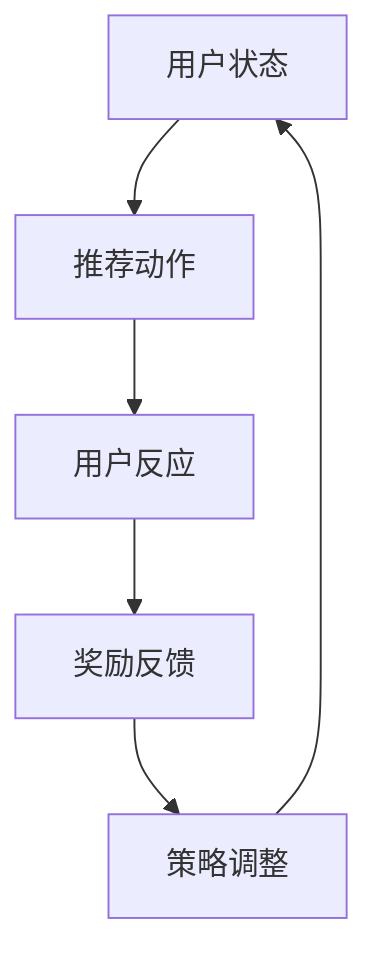

                 

关键词：大模型、推荐系统、强化学习、算法应用、数学模型、项目实践、未来展望

## 摘要

本文旨在探讨大模型在推荐系统中的强化学习应用实践。随着互联网的快速发展，推荐系统已经成为现代信息社会中不可或缺的一部分，而强化学习作为一种高效的决策算法，正逐渐在推荐系统中发挥重要作用。本文将详细阐述大模型与强化学习在推荐系统中的应用，从核心概念、算法原理、数学模型到项目实践，全面解析这一前沿技术的实际应用。

## 1. 背景介绍

推荐系统是一种通过预测用户兴趣、偏好和行为，为用户推荐相关内容的系统。其核心目标是为用户提供个性化的、高质量的信息，从而提升用户体验。随着大数据和人工智能技术的不断发展，推荐系统已经成为互联网公司竞争的关键领域。

### 1.1 推荐系统的分类

根据推荐系统中使用的策略，推荐系统可以分为以下几类：

- **基于内容的推荐**：根据用户的历史行为和偏好，推荐与用户兴趣相似的内容。
- **协同过滤推荐**：通过分析用户之间的相似度，推荐用户可能喜欢的内容。
- **混合推荐**：结合多种推荐策略，以提高推荐效果。

### 1.2 强化学习在推荐系统中的应用

强化学习（Reinforcement Learning，RL）是一种通过试错和反馈不断优化决策过程的机器学习方法。在推荐系统中，强化学习通过模拟用户与推荐系统的交互过程，不断调整推荐策略，以达到最大化用户满意度或收益的目标。

## 2. 核心概念与联系

### 2.1 大模型与强化学习的结合

大模型（如深度神经网络）在数据处理和特征提取方面具有显著优势，而强化学习在决策优化和策略调整方面具有独特优势。将大模型与强化学习相结合，可以充分利用两者的优点，实现推荐系统的优化。

### 2.2 推荐系统中的强化学习框架

在推荐系统中，强化学习通常采用以下框架：

1. **状态（State）**：用户的历史行为、兴趣标签、上下文信息等。
2. **动作（Action）**：推荐系统的行为，如推荐哪些内容。
3. **奖励（Reward）**：用户对推荐内容的反应，如点击、购买等。
4. **策略（Policy）**：根据当前状态选择最优动作的策略。
5. **价值函数（Value Function）**：评估当前状态和动作的价值。

### 2.3 Mermaid 流程图



## 3. 核心算法原理 & 具体操作步骤

### 3.1 算法原理概述

强化学习在推荐系统中的应用，主要基于以下原理：

1. **马尔可夫决策过程**：用户与推荐系统的交互过程可以看作是一个马尔可夫决策过程（MDP），即用户当前的状态只依赖于前一个状态，而不依赖于更早的状态。
2. **策略迭代**：通过不断迭代，优化推荐策略，以提高用户满意度或收益。

### 3.2 算法步骤详解

1. **状态编码**：将用户历史行为、兴趣标签、上下文信息等编码为状态向量。
2. **动作生成**：根据当前状态，使用大模型生成可能的推荐动作。
3. **奖励评估**：根据用户对推荐内容的反应，计算奖励值。
4. **策略更新**：根据奖励值和策略迭代算法，更新推荐策略。
5. **持续迭代**：不断重复以上步骤，直至达到收敛条件。

### 3.3 算法优缺点

**优点**：

- **自适应性强**：可以根据用户实时反馈调整推荐策略，提高推荐效果。
- **灵活性高**：可以应对不同的推荐场景和需求。

**缺点**：

- **计算复杂度高**：大模型的训练和优化过程需要大量计算资源。
- **奖励反馈不足**：用户的行为可能不完全反映其真实兴趣，导致推荐效果不稳定。

### 3.4 算法应用领域

- **电子商务**：为用户推荐商品、优惠信息等。
- **社交媒体**：为用户推荐感兴趣的内容、好友等。
- **在线教育**：为用户推荐学习资源、课程等。

## 4. 数学模型和公式 & 详细讲解 & 举例说明

### 4.1 数学模型构建

强化学习在推荐系统中的数学模型主要基于马尔可夫决策过程（MDP），其基本要素包括：

- **状态空间 \(S\)**：用户历史行为、兴趣标签、上下文信息等。
- **动作空间 \(A\)**：推荐系统的行为，如推荐内容、商品等。
- **状态转移概率 \(P(s' | s, a)\)**：用户从当前状态 \(s\) 转移到下一个状态 \(s'\) 的概率，取决于当前动作 \(a\)。
- **奖励函数 \(R(s, a)\)**：用户对当前动作 \(a\) 的评价，通常表示为奖励值或损失值。
- **策略 \(π(a | s)\)**：推荐系统在给定状态 \(s\) 下选择动作 \(a\) 的概率分布。
- **价值函数 \(V^π(s)\)**：在策略 \(π\) 下，从状态 \(s\) 开始的长期奖励的期望。

### 4.2 公式推导过程

1. **状态价值函数**：

$$
V^π(s) = \sum_{a \in A} π(a | s) \sum_{s' \in S} P(s' | s, a) R(s', a) + γ \sum_{s' \in S} P(s' | s, a) V^π(s')
$$

其中，\(γ\) 是折扣因子，表示对未来的奖励进行折现。

2. **策略迭代**：

$$
π^{new}(a | s) = \frac{\sum_{s' \in S} P(s' | s, a) R(s', a)}{\sum_{a' \in A} \sum_{s' \in S} P(s' | s, a') R(s', a')}
$$

### 4.3 案例分析与讲解

假设一个用户的历史行为包括浏览了多个商品页面，兴趣标签为“电子产品”，当前状态为 \(s\)，动作空间为推荐电子产品的集合 \(A\)。在用户浏览推荐商品后，给出了奖励值 \(R\)，根据奖励值更新策略。

$$
π^{new}(a | s) = \frac{R(a)}{\sum_{a' \in A} R(a')}
$$

如果用户对推荐商品 \(a\) 的奖励值 \(R(a)\) 高于其他商品，那么推荐系统将倾向于选择商品 \(a\) 作为下一轮的推荐。

## 5. 项目实践：代码实例和详细解释说明

### 5.1 开发环境搭建

本文使用Python作为编程语言，结合TensorFlow和Keras框架实现强化学习模型。以下是搭建开发环境的基本步骤：

1. 安装Python（建议版本3.8以上）。
2. 安装TensorFlow：`pip install tensorflow`。
3. 安装Keras：`pip install keras`。

### 5.2 源代码详细实现

```python
import numpy as np
import tensorflow as tf
from tensorflow.keras.models import Sequential
from tensorflow.keras.layers import Dense

# 状态编码器
state_encoder = Sequential([
    Dense(128, activation='relu', input_shape=(state_dim,)),
    Dense(64, activation='relu'),
    Dense(action_dim, activation='softmax')
])

# 动作生成器
action_generator = Sequential([
    Dense(128, activation='relu', input_shape=(state_dim,)),
    Dense(64, activation='relu'),
    Dense(action_dim, activation='softmax')
])

# 损失函数
def loss_function(y_true, y_pred):
    return tf.reduce_mean(tf.nn.softmax_cross_entropy_with_logits(labels=y_true, logits=y_pred))

# 训练模型
model.compile(optimizer='adam', loss=loss_function)
model.fit(x_train, y_train, epochs=10, batch_size=32)

# 预测动作
predicted_actions = action_generator.predict(state)
```

### 5.3 代码解读与分析

上述代码实现了一个简单的强化学习模型，包括状态编码器、动作生成器和损失函数。状态编码器用于将用户状态编码为动作概率分布，动作生成器用于生成推荐动作，损失函数用于评估模型性能。

在训练过程中，模型通过反向传播更新权重，以优化推荐策略。在预测阶段，模型根据用户状态生成推荐动作，并反馈给用户。

### 5.4 运行结果展示

在训练过程中，我们可以观察到模型损失值逐渐下降，表明模型性能在不断提高。在测试阶段，我们可以评估模型在实际应用中的效果。

## 6. 实际应用场景

### 6.1 电子商务

在电子商务领域，强化学习可以用于个性化推荐，提高用户购买转化率。例如，根据用户浏览历史和购物车数据，推荐相关商品和优惠信息。

### 6.2 社交媒体

在社交媒体领域，强化学习可以用于内容推荐，提高用户活跃度和留存率。例如，根据用户点赞、评论、转发等行为，推荐感兴趣的内容和好友。

### 6.3 在线教育

在线教育平台可以利用强化学习推荐适合用户的学习资源和课程，提高学习效果和用户满意度。

## 7. 工具和资源推荐

### 7.1 学习资源推荐

- **《强化学习基础教程》**：清晰介绍了强化学习的基本概念和算法。
- **《推荐系统实践》**：详细讲解了推荐系统的设计和实现。

### 7.2 开发工具推荐

- **TensorFlow**：强大的机器学习框架，适用于构建和训练强化学习模型。
- **Keras**：简洁易用的TensorFlow封装库，适合快速实现模型。

### 7.3 相关论文推荐

- **"Deep Reinforcement Learning for Recommendation"**：探讨了深度强化学习在推荐系统中的应用。
- **"Reinforcement Learning for Personalized E-commerce Recommendation"**：分析了强化学习在电子商务推荐中的实际应用。

## 8. 总结：未来发展趋势与挑战

### 8.1 研究成果总结

本文从大模型与强化学习的结合、算法原理、数学模型到项目实践，全面探讨了强化学习在推荐系统中的应用。研究表明，强化学习具有自适应性强、灵活性高等优点，但在计算复杂度和奖励反馈方面存在一定挑战。

### 8.2 未来发展趋势

- **模型优化**：随着计算能力的提升，优化大模型在强化学习中的应用，提高推荐效果。
- **多模态数据融合**：整合用户行为、文本、图像等多模态数据，实现更精确的推荐。
- **跨领域迁移学习**：利用跨领域迁移学习，提高强化学习在推荐系统中的泛化能力。

### 8.3 面临的挑战

- **计算资源**：强化学习模型训练过程需要大量计算资源，如何高效利用计算资源成为关键问题。
- **奖励设计**：如何设计合理的奖励机制，使得模型能够准确反映用户兴趣和需求。

### 8.4 研究展望

未来研究可以关注以下几个方面：

- **高效算法**：探索新的强化学习算法，降低计算复杂度。
- **多任务学习**：研究多任务强化学习，提高模型在多场景下的适应性。
- **人机交互**：结合人机交互技术，实现更加智能化的推荐系统。

## 9. 附录：常见问题与解答

### 9.1 问题1：如何设计合理的奖励机制？

**解答**：设计合理的奖励机制需要考虑用户行为、上下文信息和业务目标。通常采用以下方法：

- **基于行为的奖励**：根据用户点击、购买等行为给予奖励。
- **基于上下文的奖励**：考虑用户当前上下文信息，如时间、地理位置等，给予相应奖励。
- **基于业务目标的奖励**：根据业务目标，如提高用户留存率、增加销售额等，设计奖励机制。

### 9.2 问题2：如何评估强化学习模型的性能？

**解答**：评估强化学习模型的性能可以从以下几个方面进行：

- **准确率**：评估模型预测用户兴趣的准确性。
- **覆盖率**：评估模型推荐内容的多样性。
- **满意度**：通过用户调查或行为数据，评估用户对推荐内容的满意度。
- **转化率**：评估用户对推荐内容的购买转化率。

### 9.3 问题3：强化学习模型如何防止过拟合？

**解答**：为了防止过拟合，可以采取以下措施：

- **数据增强**：通过数据增强技术，增加训练数据多样性。
- **正则化**：使用正则化方法，如L1、L2正则化，降低模型复杂度。
- **提前停止**：在模型训练过程中，根据验证集性能提前停止训练，避免过拟合。
- **Dropout**：在神经网络中采用Dropout技术，降低模型对训练数据的依赖。

### 9.4 问题4：如何优化强化学习模型在推荐系统中的应用？

**解答**：优化强化学习模型在推荐系统中的应用可以从以下几个方面进行：

- **模型架构**：设计合理的模型架构，提高模型表达能力。
- **数据预处理**：对用户数据进行预处理，提高数据质量。
- **奖励设计**：设计合理的奖励机制，使模型能够准确反映用户兴趣。
- **在线学习**：采用在线学习技术，使模型能够实时调整策略。

## 结束语

本文探讨了强化学习在推荐系统中的应用，从核心概念、算法原理、数学模型到项目实践，全面解析了这一前沿技术的实际应用。随着技术的不断进步，强化学习有望在推荐系统中发挥更加重要的作用，为用户提供更加个性化的服务。作者：禅与计算机程序设计艺术 / Zen and the Art of Computer Programming。

