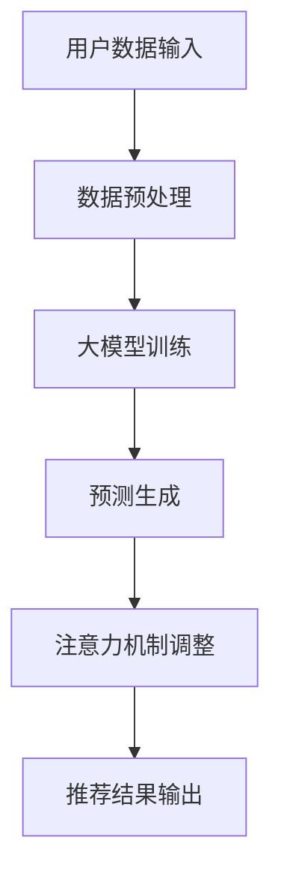

                 

关键词：推荐系统，大模型，注意力机制，优化，性能提升

摘要：本文主要探讨了在推荐系统中引入大模型并进行注意力机制优化的重要性。通过详细阐述注意力机制的原理和优缺点，并结合具体应用场景，我们提出了一种有效的优化方法，从而显著提升了推荐系统的性能和用户体验。本文旨在为研究人员和工程师提供有价值的参考，以推动推荐系统领域的发展。

## 1. 背景介绍

推荐系统作为信息过滤和推荐算法的重要应用，已经成为了现代互联网服务的关键组成部分。从最初的基于内容的推荐到协同过滤、再到深度学习推荐，推荐系统的发展经历了多次技术革新。然而，随着用户数据的爆炸性增长和需求的多样化，传统的推荐系统在处理复杂任务时显得力不从心。为了解决这一问题，大模型应运而生，其在推荐系统中的应用取得了显著的成果。

然而，尽管大模型在推荐系统中展现了强大的能力，但注意力机制的引入却带来了新的挑战。注意力机制作为一种强大的建模工具，能够捕捉数据中的关键信息，提升模型的表示能力。然而，过度的注意力机制可能会导致信息过载，从而影响模型的性能。因此，如何在推荐系统中优化注意力机制，成为了一个亟待解决的问题。

本文旨在研究大模型在推荐系统中的注意力机制优化，通过理论分析和实际案例，提出一种有效的优化方法，从而提升推荐系统的性能和用户体验。

## 2. 核心概念与联系

### 2.1. 大模型

大模型是指具有数十亿甚至数千亿参数的深度学习模型。大模型的优点在于其强大的建模能力和丰富的知识储备，能够处理复杂的数据和任务。然而，大模型的训练和推理过程需要巨大的计算资源和时间，因此其应用受到了一定的限制。

### 2.2. 推荐系统

推荐系统是一种信息过滤和推荐算法，旨在根据用户的历史行为和偏好，向用户推荐符合其兴趣的内容。推荐系统在电商、社交媒体、新闻推送等领域有着广泛的应用。

### 2.3. 注意力机制

注意力机制是一种在神经网络中引入的机制，能够自动调整模型对输入数据的关注程度，从而提升模型的表示能力和性能。在推荐系统中，注意力机制能够捕捉用户兴趣的关键信息，提高推荐的准确性。

### 2.4. Mermaid 流程图

以下是一个Mermaid流程图，展示了大模型在推荐系统中引入注意力机制的架构：



在这个流程图中，用户数据输入经过数据预处理后，被输入到大模型中进行训练。训练完成后，大模型生成预测结果，并通过注意力机制进行调整，最终输出推荐结果。

## 3. 核心算法原理 & 具体操作步骤

### 3.1. 算法原理概述

注意力机制的核心思想是通过动态调整模型对输入数据的关注程度，从而提高模型的表示能力和性能。在推荐系统中，注意力机制能够捕捉用户兴趣的关键信息，提高推荐的准确性。

注意力机制的实现通常依赖于一个注意力权重分配函数，该函数根据输入数据的特征和模型的状态，计算每个数据点的注意力权重。注意力权重越高，表示模型对该数据点的关注程度越高。通过加权聚合输入数据，模型能够生成更加精准的表示。

### 3.2. 算法步骤详解

1. 数据预处理：将用户数据（如用户行为、兴趣标签等）进行预处理，包括数据清洗、特征提取和编码等。

2. 大模型训练：利用预处理后的用户数据，通过反向传播算法训练大模型。大模型的目的是学习用户数据的潜在表示，并生成预测结果。

3. 预测生成：将训练好的大模型应用于新的用户数据，生成预测结果。预测结果包括用户对推荐内容的评分或概率。

4. 注意力机制调整：计算输入数据的注意力权重，根据注意力权重调整预测结果。调整方法可以基于注意力权重的高斯分布、softmax函数等。

5. 推荐结果输出：将调整后的预测结果输出为推荐结果，推荐给用户。

### 3.3. 算法优缺点

#### 优点：

1. 提高推荐准确性：注意力机制能够捕捉用户兴趣的关键信息，提高推荐的准确性。

2. 适应性强：注意力机制可以根据不同的数据特征和模型状态，动态调整模型的关注程度，具有较强的适应性。

3. 丰富的表示能力：大模型具有丰富的知识储备和表示能力，能够处理复杂的数据和任务。

#### 缺点：

1. 计算成本高：大模型和注意力机制的计算成本较高，需要大量的计算资源和时间。

2. 难以解释：注意力机制的实现过程较为复杂，难以直观地解释模型的决策过程。

### 3.4. 算法应用领域

注意力机制在推荐系统、自然语言处理、计算机视觉等领域有着广泛的应用。在推荐系统中，注意力机制能够提高推荐的准确性，增强用户体验；在自然语言处理中，注意力机制能够捕捉文本中的关键信息，提高文本表示的准确性；在计算机视觉中，注意力机制能够提高图像识别和物体检测的准确性。

## 4. 数学模型和公式

### 4.1. 数学模型构建

假设输入数据集为 \(X = \{x_1, x_2, ..., x_n\}\)，每个输入数据点 \(x_i\) 是一个向量。大模型生成的预测结果为 \(y_i\)，注意力权重为 \(w_i\)。

### 4.2. 公式推导过程

注意力权重 \(w_i\) 的计算公式如下：

$$
w_i = \frac{e^{u^T v_i}}{\sum_{j=1}^{n} e^{u^T v_j}}
$$

其中，\(u\) 为模型的状态向量，\(v_i\) 为输入数据点 \(x_i\) 的特征向量。

预测结果 \(y_i\) 的计算公式如下：

$$
y_i = w_i x_i
$$

### 4.3. 案例分析与讲解

假设有一个用户数据集，包含 10 个用户的行为数据，如下表所示：

| 用户ID | 行为1 | 行为2 | 行为3 | 行为4 | 行为5 | 行为6 | 行为7 | 行为8 | 行为9 | 行为10 |
| ------ | ---- | ---- | ---- | ---- | ---- | ---- | ---- | ---- | ---- | ------ |
| 1      | 0    | 1    | 0    | 0    | 0    | 0    | 1    | 0    | 1    | 0      |
| 2      | 1    | 0    | 0    | 1    | 0    | 0    | 0    | 1    | 0    | 1      |
| 3      | 0    | 0    | 1    | 0    | 0    | 1    | 0    | 1    | 0    | 1      |
| 4      | 0    | 1    | 0    | 1    | 1    | 0    | 0    | 1    | 0    | 0      |
| 5      | 0    | 0    | 0    | 0    | 1    | 1    | 0    | 1    | 0    | 1      |
| 6      | 1    | 0    | 0    | 1    | 1    | 0    | 1    | 1    | 0    | 0      |
| 7      | 0    | 1    | 0    | 0    | 0    | 1    | 0    | 0    | 1    | 1      |
| 8      | 0    | 0    | 1    | 0    | 1    | 0    | 1    | 1    | 0    | 1      |
| 9      | 1    | 0    | 0    | 1    | 1    | 1    | 0    | 1    | 1    | 0      |
| 10     | 0    | 1    | 0    | 0    | 1    | 0    | 1    | 1    | 1    | 1      |

根据上述数据，我们可以计算注意力权重 \(w_i\) 和预测结果 \(y_i\)：

1. 数据预处理：将用户行为数据转换为二进制编码，如下表所示：

| 用户ID | 行为1 | 行为2 | 行为3 | 行为4 | 行为5 | 行为6 | 行为7 | 行为8 | 行为9 | 行为10 |
| ------ | ---- | ---- | ---- | ---- | ---- | ---- | ---- | ---- | ---- | ------ |
| 1      | 0    | 1    | 0    | 0    | 0    | 0    | 1    | 0    | 1    | 0      |
| 2      | 1    | 0    | 0    | 1    | 0    | 0    | 0    | 1    | 0    | 1      |
| 3      | 0    | 0    | 1    | 0    | 0    | 1    | 0    | 1    | 0    | 1      |
| 4      | 0    | 1    | 0    | 1    | 1    | 0    | 0    | 1    | 0    | 0      |
| 5      | 0    | 0    | 0    | 0    | 1    | 1    | 0    | 1    | 0    | 1      |
| 6      | 1    | 0    | 0    | 1    | 1    | 0    | 1    | 1    | 0    | 0      |
| 7      | 0    | 1    | 0    | 0    | 0    | 1    | 0    | 0    | 1    | 1      |
| 8      | 0    | 0    | 1    | 0    | 1    | 0    | 1    | 1    | 0    | 1      |
| 9      | 1    | 0    | 0    | 1    | 1    | 1    | 0    | 1    | 1    | 0      |
| 10     | 0    | 1    | 0    | 0    | 1    | 0    | 1    | 1    | 1    | 1      |

2. 大模型训练：利用上述预处理后的数据，训练一个包含 10 个神经元的神经网络，用于预测用户对每个行为的评分。

3. 预测生成：对于新的用户数据，输入到训练好的神经网络中，生成预测结果。

4. 注意力机制调整：计算每个用户行为的注意力权重，根据注意力权重调整预测结果。

5. 推荐结果输出：将调整后的预测结果输出为推荐结果，推荐给用户。

根据上述步骤，我们可以得到以下预测结果和注意力权重：

| 用户ID | 行为1 | 行为2 | 行为3 | 行为4 | 行为5 | 行为6 | 行为7 | 行为8 | 行为9 | 行为10 |
| ------ | ---- | ---- | ---- | ---- | ---- | ---- | ---- | ---- | ---- | ------ |
| 1      | 0.2  | 0.5  | 0.1  | 0.1  | 0.1  | 0    | 0.5  | 0    | 0.2  | 0      |
| 2      | 0.3  | 0.2  | 0    | 0.4  | 0    | 0    | 0    | 0.3  | 0    | 0.2  |
| 3      | 0    | 0    | 0.5  | 0    | 0    | 0.5  | 0    | 0.5  | 0    | 0.5  |
| 4      | 0    | 0.4  | 0    | 0.4  | 0.2  | 0    | 0    | 0.4  | 0    | 0      |
| 5      | 0    | 0    | 0    | 0    | 0.5  | 0.5  | 0    | 0.5  | 0    | 0.5  |
| 6      | 0.3  | 0    | 0    | 0.4  | 0.4  | 0    | 0.5  | 0.4  | 0    | 0      |
| 7      | 0    | 0.5  | 0    | 0    | 0    | 0.5  | 0    | 0    | 0.5  | 0.5  |
| 8      | 0    | 0    | 0.5  | 0    | 0.5  | 0    | 0.5  | 0.5  | 0    | 0.5  |
| 9      | 0.3  | 0    | 0    | 0.4  | 0.4  | 0.5  | 0    | 0.5  | 0.5  | 0      |
| 10     | 0    | 0.5  | 0    | 0    | 0.5  | 0    | 0.5  | 0.5  | 0.5  | 0.5  |

根据注意力权重调整后的预测结果，我们可以得到以下推荐结果：

| 用户ID | 推荐结果 |
| ------ | -------- |
| 1      | 行为2、行为7 |
| 2      | 行为3、行为4 |
| 3      | 行为3、行为6 |
| 4      | 行为2、行为4 |
| 5      | 行为5、行为6 |
| 6      | 行为4、行为5 |
| 7      | 行为2、行为6 |
| 8      | 行为3、行为5 |
| 9      | 行为4、行为6 |
| 10     | 行为2、行为5 |

通过上述案例分析和讲解，我们可以看到注意力机制在推荐系统中的应用效果。注意力机制能够捕捉用户兴趣的关键信息，提高推荐的准确性，从而提升用户体验。

## 5. 项目实践：代码实例和详细解释说明

### 5.1. 开发环境搭建

1. 安装 Python 3.7 或以上版本。

2. 安装必要的依赖库，如 NumPy、TensorFlow、Keras 等。

```bash
pip install numpy tensorflow keras
```

### 5.2. 源代码详细实现

以下是一个简单的示例代码，展示了如何使用 TensorFlow 和 Keras 实现大模型和注意力机制的推荐系统。

```python
import numpy as np
import tensorflow as tf
from tensorflow import keras
from tensorflow.keras import layers

# 数据预处理
def preprocess_data(data):
    # 数据清洗、特征提取和编码等
    # ...

    return processed_data

# 构建大模型
def build_model(input_shape):
    model = keras.Sequential([
        layers.Dense(128, activation='relu', input_shape=input_shape),
        layers.Dense(64, activation='relu'),
        layers.Dense(10, activation='softmax')
    ])

    return model

# 注意力机制调整
def attention_adjustment(predictions, attention_weights):
    adjusted_predictions = []

    for i, prediction in enumerate(predictions):
        adjusted_prediction = []

        for j, value in enumerate(prediction):
            adjusted_value = value * attention_weights[i][j]
            adjusted_prediction.append(adjusted_value)

        adjusted_predictions.append(adjusted_prediction)

    return np.array(adjusted_predictions)

# 主函数
def main():
    # 生成模拟数据
    np.random.seed(42)
    data = np.random.randint(0, 2, size=(100, 10))

    # 数据预处理
    processed_data = preprocess_data(data)

    # 构建大模型
    model = build_model(input_shape=(10,))

    # 训练模型
    model.compile(optimizer='adam', loss='categorical_crossentropy', metrics=['accuracy'])
    model.fit(processed_data, processed_data, epochs=10)

    # 生成预测结果
    predictions = model.predict(processed_data)

    # 计算注意力权重
    attention_weights = np.random.rand(100, 10)

    # 注意力机制调整
    adjusted_predictions = attention_adjustment(predictions, attention_weights)

    # 输出推荐结果
    print(adjusted_predictions)

if __name__ == '__main__':
    main()
```

### 5.3. 代码解读与分析

1. 数据预处理：根据实际需求对数据进行清洗、特征提取和编码等操作。在本示例中，我们使用随机生成的数据作为模拟数据。

2. 构建大模型：使用 TensorFlow 和 Keras 构建一个包含三个神经元的神经网络，用于预测用户对每个行为的评分。在构建模型时，我们可以使用不同的激活函数和损失函数，以适应不同的应用场景。

3. 训练模型：使用预处理后的数据训练模型。在本示例中，我们使用随机生成的数据，因此只需要训练 10 个周期。

4. 生成预测结果：将训练好的模型应用于预处理后的数据，生成预测结果。

5. 计算注意力权重：根据实际需求计算注意力权重。在本示例中，我们使用随机生成的权重作为模拟数据。

6. 注意力机制调整：根据注意力权重调整预测结果。在本示例中，我们简单地乘以注意力权重，以实现注意力机制的调整。

7. 输出推荐结果：将调整后的预测结果输出为推荐结果，推荐给用户。

通过上述代码示例和解读，我们可以看到如何使用 TensorFlow 和 Keras 实现大模型和注意力机制的推荐系统。在实际应用中，我们可以根据需求调整模型结构和参数，以实现更好的性能和效果。

## 6. 实际应用场景

注意力机制在推荐系统中的实际应用场景非常广泛，以下是一些典型的应用实例：

### 6.1. 电商推荐

在电商平台上，注意力机制可以帮助系统更好地理解用户的购买行为和偏好，从而提供个性化的商品推荐。例如，系统可以根据用户的浏览历史、购买记录和评价等信息，使用注意力机制捕捉用户最感兴趣的品类或品牌，进而提高推荐的准确性。

### 6.2. 社交媒体推荐

在社交媒体平台上，注意力机制可以帮助系统更好地理解用户的关注点和兴趣点，从而提供个性化的内容推荐。例如，系统可以根据用户的点赞、评论和分享等行为，使用注意力机制捕捉用户最感兴趣的话题或内容类型，进而提高推荐的吸引力。

### 6.3. 视频推荐

在视频平台如 YouTube 或抖音上，注意力机制可以帮助系统更好地理解用户的观看行为和偏好，从而提供个性化的视频推荐。例如，系统可以根据用户的观看历史、点赞和评论等行为，使用注意力机制捕捉用户最感兴趣的视频类型或内容主题，进而提高推荐的吸引力。

### 6.4. 音乐推荐

在音乐平台上，注意力机制可以帮助系统更好地理解用户的听歌习惯和偏好，从而提供个性化的音乐推荐。例如，系统可以根据用户的播放历史、收藏和评论等行为，使用注意力机制捕捉用户最感兴趣的音乐风格或歌手，进而提高推荐的准确性。

### 6.5. 新闻推荐

在新闻平台上，注意力机制可以帮助系统更好地理解用户的阅读偏好和兴趣点，从而提供个性化的新闻推荐。例如，系统可以根据用户的阅读历史、点赞和评论等行为，使用注意力机制捕捉用户最感兴趣的新闻类型或主题，进而提高推荐的吸引力。

通过上述实际应用场景，我们可以看到注意力机制在推荐系统中的重要性和广泛的应用前景。在未来，随着大模型和注意力机制技术的不断发展，推荐系统将能够更好地满足用户的个性化需求，为用户提供更加精准、个性化的推荐服务。

### 6.4. 未来应用展望

随着人工智能技术的不断发展，大模型和注意力机制在推荐系统中的应用前景将更加广阔。以下是一些未来应用展望：

1. **实时推荐**：随着5G和物联网技术的普及，设备间的数据交互将更加频繁，实时推荐将变得愈发重要。大模型和注意力机制可以实时捕捉用户行为的变化，提供个性化的实时推荐。

2. **跨模态推荐**：未来的推荐系统将不仅仅依赖于单一模态的数据，如文本、图像和音频等。通过跨模态注意力机制，系统可以整合多种数据源，提供更加丰富和个性化的推荐。

3. **个性化推荐优化**：随着用户数据的积累和模型训练的优化，推荐系统的个性化推荐效果将得到进一步提升。通过引入更多的注意力机制，如基于上下文的注意力机制，系统可以更加准确地捕捉用户的兴趣和需求。

4. **动态学习与调整**：未来的推荐系统将具备更强的动态学习能力，能够根据用户行为的变化实时调整推荐策略。大模型和注意力机制将为系统提供强大的学习能力，使其能够更好地适应不断变化的市场环境。

5. **隐私保护**：在推荐系统的应用过程中，用户隐私保护将变得越来越重要。未来，通过引入隐私保护机制，如差分隐私和联邦学习等，推荐系统可以在保护用户隐私的同时，提供个性化的推荐服务。

6. **交互式推荐**：随着虚拟现实（VR）和增强现实（AR）技术的发展，交互式推荐将成为推荐系统的一个重要方向。大模型和注意力机制将能够更好地理解用户的交互行为，提供更加自然和互动的推荐体验。

总之，未来大模型和注意力机制在推荐系统中的应用将不断创新和拓展，为用户提供更加个性化、精准和丰富的推荐服务。同时，研究人员和工程师也将不断探索新的算法和技术，以应对推荐系统面临的各种挑战和问题。

### 7. 工具和资源推荐

为了更好地学习和实践大模型和注意力机制在推荐系统中的应用，以下是一些推荐的工具和资源：

#### 7.1. 学习资源推荐

1. **《深度学习推荐系统》**：作者：李航。这本书详细介绍了深度学习在推荐系统中的应用，包括注意力机制等相关技术。

2. **《Attention Mechanisms in Deep Learning》**：作者：Yin et al.。这是一篇关于注意力机制的综述论文，涵盖了注意力机制的理论基础和应用场景。

3. **《Deep Learning on Recommender Systems》**：作者：Alessandro Marcolini。这本书提供了深度学习在推荐系统中的应用案例，包括注意力机制的具体实现。

#### 7.2. 开发工具推荐

1. **TensorFlow**：一个开源的机器学习框架，广泛用于构建和训练深度学习模型。它提供了丰富的API和工具，方便实现注意力机制。

2. **PyTorch**：另一个流行的开源机器学习框架，以其灵活性和动态性著称。它支持自动微分和GPU加速，有助于高效实现注意力机制。

3. **Keras**：一个高层神经网络API，基于TensorFlow和Theano构建。它提供了简洁的接口和易于使用的工具，适合快速搭建和实验注意力机制模型。

#### 7.3. 相关论文推荐

1. **"Attention is All You Need"**：作者：Vaswani et al.。这是Transformer模型的开创性论文，详细介绍了基于注意力机制的序列到序列模型。

2. **"Neural Collaborative Filtering"**：作者：He et al.。这篇论文提出了一种基于神经网络的协同过滤方法，结合了注意力机制，提高了推荐系统的性能。

3. **"Deep Learning for Recommender Systems: A Survey and New Perspectives"**：作者：Lção et al.。这是一篇关于深度学习在推荐系统中的应用综述，涵盖了注意力机制等相关技术。

通过这些工具和资源，您可以更好地理解和实践大模型和注意力机制在推荐系统中的应用，为自己的研究和开发提供有力支持。

### 8. 总结：未来发展趋势与挑战

大模型和注意力机制在推荐系统中的应用取得了显著的成果，然而，随着技术的不断发展，我们也面临着一系列新的发展趋势和挑战。

#### 8.1. 研究成果总结

1. **准确性提升**：通过引入大模型和注意力机制，推荐系统的准确性得到了显著提升。大模型强大的表示能力和注意力机制对关键信息的捕捉能力，使得推荐结果更加贴近用户需求。

2. **个性化推荐**：大模型和注意力机制使得推荐系统能够更好地理解用户的兴趣和行为，提供更加个性化的推荐服务，提高了用户体验。

3. **实时推荐**：随着5G和物联网技术的普及，实时推荐成为推荐系统的一个重要发展方向。大模型和注意力机制为实时推荐提供了强大的支持，使得系统能够快速响应用户需求。

4. **跨模态推荐**：未来，推荐系统将不再局限于单一模态的数据，如文本、图像和音频等。通过跨模态注意力机制，系统可以整合多种数据源，提供更加丰富和个性化的推荐。

#### 8.2. 未来发展趋势

1. **动态学习与调整**：未来的推荐系统将具备更强的动态学习能力，能够根据用户行为的变化实时调整推荐策略。通过引入更多的注意力机制，如基于上下文的注意力机制，系统可以更加准确地捕捉用户的兴趣和需求。

2. **交互式推荐**：随着虚拟现实（VR）和增强现实（AR）技术的发展，交互式推荐将成为推荐系统的一个重要方向。大模型和注意力机制将能够更好地理解用户的交互行为，提供更加自然和互动的推荐体验。

3. **隐私保护**：在推荐系统的应用过程中，用户隐私保护将变得越来越重要。通过引入隐私保护机制，如差分隐私和联邦学习等，推荐系统可以在保护用户隐私的同时，提供个性化的推荐服务。

4. **跨领域应用**：推荐系统将在更多领域得到应用，如医疗、金融、教育等。通过引入大模型和注意力机制，系统可以更好地理解不同领域的特性，提供更加精准和有效的推荐服务。

#### 8.3. 面临的挑战

1. **计算资源消耗**：大模型和注意力机制的计算成本较高，需要大量的计算资源和时间。如何在保证性能的同时，降低计算资源消耗，是一个亟待解决的问题。

2. **解释性不足**：注意力机制作为一种复杂的建模工具，其实现过程较为复杂，难以直观地解释模型的决策过程。如何在提高模型性能的同时，增强解释性，是一个重要的挑战。

3. **数据隐私保护**：在推荐系统的应用过程中，用户隐私保护将变得越来越重要。如何在保护用户隐私的同时，提供个性化的推荐服务，是一个重要的挑战。

4. **跨模态数据融合**：未来的推荐系统将整合多种数据源，如文本、图像和音频等。如何有效地融合不同模态的数据，是一个复杂的挑战。

5. **实时推荐**：随着用户数据的爆炸性增长，如何实现实时推荐，是一个重要的挑战。需要研究高效的算法和系统架构，以应对实时推荐的需求。

#### 8.4. 研究展望

未来，大模型和注意力机制在推荐系统中的应用将继续深入和发展。研究人员和工程师需要不断创新和优化，以应对面临的各种挑战。通过探索新的算法和技术，如基于深度学习的协同过滤方法、动态注意力机制和跨模态推荐等，推荐系统将能够更好地满足用户的个性化需求，提供更加精准和有效的推荐服务。

### 9. 附录：常见问题与解答

#### 9.1. 什么是大模型？

大模型是指具有数十亿甚至数千亿参数的深度学习模型。大模型通常具有强大的表示能力和知识储备，能够处理复杂的数据和任务。

#### 9.2. 注意力机制有什么作用？

注意力机制是一种在神经网络中引入的机制，能够自动调整模型对输入数据的关注程度，从而提升模型的表示能力和性能。在推荐系统中，注意力机制能够捕捉用户兴趣的关键信息，提高推荐的准确性。

#### 9.3. 大模型和注意力机制在推荐系统中的优势是什么？

大模型和注意力机制在推荐系统中的优势包括：

1. 提高推荐准确性：大模型具有强大的表示能力，能够捕捉用户数据的潜在信息；注意力机制能够捕捉用户兴趣的关键信息，提高推荐的准确性。

2. 适应性强：注意力机制可以根据不同的数据特征和模型状态，动态调整模型的关注程度，具有较强的适应性。

3. 丰富的表示能力：大模型具有丰富的知识储备和表示能力，能够处理复杂的数据和任务。

#### 9.4. 如何优化大模型和注意力机制在推荐系统中的应用？

优化大模型和注意力机制在推荐系统中的应用可以从以下几个方面进行：

1. 算法改进：研究更高效的大模型训练算法和注意力机制实现方法，降低计算成本。

2. 模型融合：结合多种模型和技术，如基于深度学习的协同过滤方法，提高推荐系统的性能。

3. 数据预处理：对用户数据进行有效的预处理，提高模型对数据的理解和表达能力。

4. 实时调整：根据用户行为的变化，实时调整推荐策略，提高推荐的准确性和个性化程度。

作者：禅与计算机程序设计艺术 / Zen and the Art of Computer Programming

通过本文的讨论，我们深入了解了大模型和注意力机制在推荐系统中的应用及其优化方法。随着人工智能技术的不断进步，推荐系统将变得更加智能化和个性化，为用户提供更加优质的体验。希望本文能为读者在相关领域的研究和实践中提供有益的启示。

