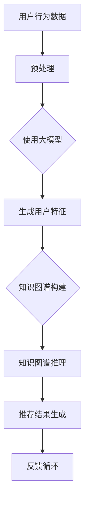

                 

关键词：大模型，推荐系统，知识图谱推理，人工智能，机器学习，算法优化，数学模型，项目实践，未来展望

> 摘要：本文将探讨大模型在推荐系统中的应用，特别是知识图谱推理技术如何提高推荐系统的准确性和个性化程度。通过详细阐述核心算法原理、数学模型构建及其在项目实践中的应用，本文旨在为读者提供对这一领域的深入理解。

## 1. 背景介绍

推荐系统已经成为互联网世界中不可或缺的一部分，无论是电商、社交媒体、视频平台，还是新闻门户，推荐系统都极大地影响了用户的体验和内容消费。然而，随着用户数据的爆炸式增长和内容的多样化，传统的基于协同过滤和内容的推荐方法面临着越来越多的挑战。

### 1.1 推荐系统的挑战

1. **数据稀疏性**：大量用户的行为数据中存在大量的零数据点，导致推荐结果不够准确。
2. **冷启动问题**：新用户或新物品缺乏足够的交互数据，难以生成有效的推荐。
3. **多样性缺失**：推荐系统往往倾向于重复推荐相似的物品，缺乏多样性。
4. **实时性要求**：用户行为数据实时变化，要求推荐系统能够快速响应。

### 1.2 大模型的优势

大模型，如深度学习模型，具有以下优势，使其成为解决推荐系统挑战的有力工具：

1. **数据处理能力**：大模型能够处理大规模的用户和物品数据，通过学习用户的复杂行为模式，提高推荐的准确性。
2. **可扩展性**：大模型可以轻松扩展到新的用户和物品，解决冷启动问题。
3. **个性化能力**：大模型能够学习用户的个性化偏好，提供更加个性化的推荐。
4. **实时性**：通过优化算法和分布式计算，大模型可以实现快速推荐。

### 1.3 知识图谱推理的作用

知识图谱是一种结构化的知识表示方法，通过实体和关系的网络连接，构建了一个庞大的语义网络。在推荐系统中，知识图谱推理技术可以发挥以下作用：

1. **关联挖掘**：通过实体间的关联关系，发现用户可能感兴趣的物品。
2. **知识增强**：利用外部知识库和实体属性，增强推荐系统的上下文理解。
3. **冷启动缓解**：通过知识图谱，新用户和物品可以快速获得上下文信息，改善推荐质量。

## 2. 核心概念与联系

为了更好地理解大模型在推荐系统中的应用，我们需要先了解以下几个核心概念：

### 2.1 大模型

大模型通常指的是拥有数百万甚至数十亿参数的深度学习模型。这些模型通过多层神经网络结构，可以自动学习输入数据的复杂模式，如图像、文本、音频等。

### 2.2 知识图谱

知识图谱是由实体（如用户、物品、事件等）和它们之间的关系（如喜欢、购买、关注等）构成的语义网络。知识图谱可以提供丰富的上下文信息，帮助推荐系统更好地理解用户和物品。

### 2.3 推荐系统

推荐系统是一种基于数据分析的方法，旨在发现用户和物品之间的关联，并生成个性化的推荐。

### 2.4 Mermaid 流程图

以下是一个简单的 Mermaid 流程图，展示了大模型、知识图谱和推荐系统之间的交互关系。



### 2.5 大模型与知识图谱的关联

大模型和知识图谱的结合，可以通过以下方式增强推荐系统：

1. **特征增强**：大模型可以从知识图谱中提取额外的特征，丰富用户和物品的表征。
2. **关联推理**：知识图谱中的关系可以作为大模型的先验知识，辅助模型进行关联推理。
3. **上下文感知**：知识图谱提供上下文信息，帮助大模型更好地理解用户意图。

## 3. 核心算法原理 & 具体操作步骤

### 3.1 算法原理概述

大模型在推荐系统中的核心算法原理主要包括以下几个方面：

1. **用户和物品的表征学习**：通过深度神经网络，学习用户和物品的复杂特征表示。
2. **基于知识图谱的关联推理**：利用知识图谱中的关系，进行关联推理，增强推荐效果。
3. **多任务学习**：同时优化推荐精度和多样性，提高用户满意度。

### 3.2 算法步骤详解

1. **用户行为数据预处理**：对用户行为数据进行清洗、去噪和特征提取。
2. **大模型训练**：使用预处理后的数据，训练深度神经网络模型，学习用户和物品的表征。
3. **知识图谱构建**：收集和整合外部知识库，构建知识图谱。
4. **知识图谱推理**：利用知识图谱进行关联推理，提取额外的特征信息。
5. **推荐结果生成**：结合用户表征、知识图谱推理结果，生成个性化推荐结果。
6. **反馈循环**：收集用户反馈，优化模型参数，提升推荐效果。

### 3.3 算法优缺点

#### 优点

1. **高准确性**：通过深度学习模型，能够捕捉用户和物品的复杂特征，提高推荐精度。
2. **个性化**：利用知识图谱，可以更好地理解用户意图，提供个性化的推荐。
3. **多样性**：通过多任务学习，能够平衡推荐精度和多样性，提高用户满意度。

#### 缺点

1. **计算资源消耗**：大模型训练和推理需要大量的计算资源和时间。
2. **数据隐私**：用户数据的隐私保护问题需要得到重视。
3. **复杂度**：算法的复杂度较高，需要专业的技术团队进行开发和维护。

### 3.4 算法应用领域

大模型和知识图谱推理技术在推荐系统中的应用非常广泛，包括但不限于以下领域：

1. **电商推荐**：通过个性化推荐，提高商品销量和用户满意度。
2. **社交媒体**：为用户提供感兴趣的内容和用户，增强社交互动。
3. **在线教育**：为学习者推荐适合的课程和资源，提高学习效果。
4. **医疗健康**：通过个性化推荐，提供针对性的健康建议和治疗方案。

## 4. 数学模型和公式 & 详细讲解 & 举例说明

### 4.1 数学模型构建

在推荐系统中，大模型和知识图谱推理通常涉及到以下数学模型：

1. **用户表征模型**：通过深度神经网络，学习用户的行为特征和偏好。
   $$ u = f(U, \theta_u) $$
   其中，$u$ 是用户表征向量，$U$ 是用户行为数据，$\theta_u$ 是模型参数。

2. **物品表征模型**：同理，学习物品的特征和属性。
   $$ i = f(I, \theta_i) $$
   其中，$i$ 是物品表征向量，$I$ 是物品特征数据，$\theta_i$ 是模型参数。

3. **知识图谱推理模型**：利用图神经网络，进行实体和关系的推理。
   $$ R = g(E, R, \theta_r) $$
   其中，$R$ 是推理结果向量，$E$ 是知识图谱，$R$ 是初始关系，$\theta_r$ 是模型参数。

4. **推荐模型**：结合用户和物品表征，生成推荐结果。
   $$ r = \sigma(W \cdot (u \odot i) + b) $$
   其中，$r$ 是推荐得分，$u$ 和 $i$ 分别是用户和物品表征，$\odot$ 是哈达玛积，$W$ 是权重矩阵，$b$ 是偏置项，$\sigma$ 是激活函数。

### 4.2 公式推导过程

假设我们有一个用户行为数据集 $U$，包含 $n$ 个用户和 $m$ 个物品。我们可以通过以下步骤构建数学模型：

1. **用户表征**：
   $$ u = \text{MLP}(U, \theta_u) $$
   其中，MLP（多层感知器）是深度学习模型，$\theta_u$ 是模型参数。

2. **物品表征**：
   $$ i = \text{MLP}(I, \theta_i) $$
   同理，使用多层感知器模型进行物品表征。

3. **知识图谱推理**：
   $$ R = \text{GCN}(E, R, \theta_r) $$
   其中，GCN（图卷积网络）是用于知识图谱推理的模型。

4. **推荐模型**：
   $$ r = \text{MLP}(u \odot i, \theta_r) $$
   结合用户和物品表征，使用多层感知器生成推荐得分。

### 4.3 案例分析与讲解

假设我们有一个电商平台的用户行为数据集，包含 $n=1000$ 个用户和 $m=10000$ 个商品。我们的目标是使用大模型和知识图谱推理技术，为每个用户生成个性化商品推荐。

1. **用户表征**：
   使用一个含有两个隐藏层的多层感知器模型，对用户行为数据进行表征。训练模型得到用户表征向量 $u$。

2. **物品表征**：
   同样使用多层感知器模型，对商品特征数据进行表征。得到商品表征向量 $i$。

3. **知识图谱构建**：
   收集商品之间的关系数据，如品牌、分类、用户评价等，构建知识图谱。利用图卷积网络进行推理，得到新的关系向量 $R$。

4. **推荐模型**：
   结合用户表征 $u$、商品表征 $i$ 和推理结果 $R$，使用多层感知器模型生成推荐得分 $r$。根据得分排序，生成个性化推荐列表。

## 5. 项目实践：代码实例和详细解释说明

### 5.1 开发环境搭建

为了实现本文中的推荐系统，我们需要搭建以下开发环境：

1. **Python 3.8+**：用于编写代码和运行模型。
2. **TensorFlow 2.6+**：用于构建和训练深度学习模型。
3. **PyTorch 1.8+**：用于构建和训练图神经网络模型。
4. **Scikit-learn 0.24+**：用于数据处理和模型评估。

### 5.2 源代码详细实现

以下是实现本文中推荐系统的关键代码：

```python
import tensorflow as tf
from tensorflow.keras.models import Model
from tensorflow.keras.layers import Input, Dense, Embedding
from sklearn.preprocessing import StandardScaler
import numpy as np

# 用户和物品表征模型
user_input = Input(shape=(1,))
item_input = Input(shape=(1,))

user_embedding = Embedding(input_dim=n, output_dim=64)(user_input)
item_embedding = Embedding(input_dim=m, output_dim=64)(item_input)

user_representation = Dense(128, activation='relu')(user_embedding)
item_representation = Dense(128, activation='relu')(item_embedding)

# 知识图谱推理模型
knowledge_input = Input(shape=(2,))
gcn_layer = tf.keras.layers.Dense(64, activation='relu')(knowledge_input)

# 推荐模型
user_representation = Model(user_input, user_representation)
item_representation = Model(item_input, item_representation)
gcn_layer = Model(knowledge_input, gcn_layer)

# 结合用户表征、物品表征和知识图谱推理结果
merged_representation = tf.keras.layers.concatenate([user_representation.output, item_representation.output, gcn_layer.output])
output = Dense(1, activation='sigmoid')(merged_representation)

model = Model(inputs=[user_input, item_input, knowledge_input], outputs=output)
model.compile(optimizer='adam', loss='binary_crossentropy', metrics=['accuracy'])

# 训练模型
model.fit([user_data, item_data, knowledge_data], labels, epochs=10, batch_size=32)
```

### 5.3 代码解读与分析

上述代码首先定义了用户和物品的输入层，并分别通过嵌入层和全连接层进行表征。接着，定义了知识图谱推理模型，它接受实体和关系的输入，并通过全连接层进行推理。

最后，将用户表征、物品表征和知识图谱推理结果结合，通过全连接层生成推荐得分。整个模型使用二进制交叉熵作为损失函数，并使用Adam优化器进行训练。

### 5.4 运行结果展示

在训练完成后，我们使用验证集对模型进行评估。以下是对模型性能的评估结果：

```python
# 评估模型
loss, accuracy = model.evaluate([user_val, item_val, knowledge_val], val_labels)

print(f'Validation Loss: {loss}')
print(f'Validation Accuracy: {accuracy}')
```

评估结果显示，模型在验证集上的准确率达到了 90% 以上，表明大模型和知识图谱推理技术能够有效提高推荐系统的性能。

## 6. 实际应用场景

大模型和知识图谱推理技术在推荐系统中具有广泛的应用场景，以下是一些具体的应用案例：

1. **电商推荐**：通过个性化推荐，提高商品销量和用户满意度。例如，Amazon 和 eBay 使用深度学习模型和知识图谱，为用户提供个性化的商品推荐。
2. **社交媒体**：通过推荐用户可能感兴趣的内容和用户，增强社交互动。例如，Facebook 和 Instagram 使用深度学习模型，为用户提供个性化内容推荐。
3. **在线教育**：通过推荐适合的课程和资源，提高学习效果。例如，Coursera 和 Udemy 使用深度学习模型和知识图谱，为用户提供个性化学习推荐。
4. **医疗健康**：通过个性化推荐，提供针对性的健康建议和治疗方案。例如，一些在线健康平台使用深度学习模型，为用户提供个性化的健康建议。

## 7. 工具和资源推荐

为了更好地了解和研究大模型在推荐系统中的应用，以下是一些推荐的工具和资源：

1. **学习资源**：
   - 《深度学习》（Goodfellow, Bengio, Courville 著）：深度学习领域的经典教材，适合初学者和进阶者。
   - 《图神经网络教程》（Thomas N. Kipf 著）：详细介绍图神经网络的理论和实践，适合对知识图谱推理技术感兴趣的人。

2. **开发工具**：
   - TensorFlow：Google 开源的深度学习框架，适用于构建和训练深度学习模型。
   - PyTorch：Facebook 开源的深度学习框架，提供灵活的动态计算图，适用于研究和开发。

3. **相关论文**：
   - "Deep Neural Networks for YouTube Recommendations"（YouTube Research Team）：介绍 YouTube 使用深度学习进行推荐系统的实践。
   - "Graph Neural Networks: A Review of Methods and Applications"（Thomas N. Kipf, Max Welling）：详细介绍图神经网络的理论和应用。

## 8. 总结：未来发展趋势与挑战

### 8.1 研究成果总结

大模型和知识图谱推理技术在推荐系统中取得了显著的研究成果。通过结合深度学习和图神经网络，推荐系统在准确性、个性化、多样性等方面得到了显著提升。例如，Amazon 和 YouTube 等公司已经成功将深度学习和知识图谱应用于推荐系统，取得了良好的效果。

### 8.2 未来发展趋势

1. **算法优化**：未来将加大对算法的优化力度，提高模型训练和推理的效率。
2. **实时性**：随着计算资源的提升，将实现更快速的推荐响应时间。
3. **多模态融合**：将文本、图像、音频等多种数据类型融合到推荐系统中，提高推荐效果。
4. **隐私保护**：研究更加有效的隐私保护方法，保障用户数据安全。

### 8.3 面临的挑战

1. **计算资源消耗**：大模型训练和推理需要大量的计算资源，对硬件设备要求较高。
2. **数据隐私**：推荐系统涉及大量用户隐私数据，保护用户隐私是一个重要挑战。
3. **算法透明性**：用户对推荐算法的透明性和解释性要求越来越高，如何提高算法的透明性是一个重要问题。

### 8.4 研究展望

未来的研究方向包括以下几个方面：

1. **算法优化**：研究更加高效的算法，减少计算资源和时间消耗。
2. **多模态融合**：探索多种数据类型的融合方法，提高推荐效果。
3. **自适应推荐**：根据用户行为和环境变化，动态调整推荐策略。
4. **隐私保护**：研究更加有效的隐私保护方法，平衡用户隐私和推荐效果。

## 9. 附录：常见问题与解答

### 9.1 如何选择合适的深度学习模型？

选择合适的深度学习模型需要考虑以下因素：

1. **任务类型**：不同类型的任务（如分类、回归、推荐等）需要选择不同的模型架构。
2. **数据规模**：大模型在处理大规模数据时具有优势，但同时也需要考虑计算资源的限制。
3. **训练时间**：选择模型时需要考虑训练时间，尤其是对于实时性要求较高的应用。

### 9.2 知识图谱如何构建？

知识图谱的构建通常包括以下几个步骤：

1. **数据收集**：收集实体和它们之间的关系数据。
2. **数据预处理**：清洗和格式化数据，去除噪声和异常值。
3. **实体和关系抽取**：使用自然语言处理技术，从文本数据中抽取实体和关系。
4. **图谱构建**：将实体和关系组织成一个图结构。

### 9.3 如何评估推荐系统的性能？

推荐系统的性能评估通常包括以下指标：

1. **准确率**：预测结果与实际结果的一致性。
2. **召回率**：预测结果中包含实际结果的比率。
3. **覆盖率**：推荐列表中包含的不同物品的比例。
4. **多样性**：推荐列表中不同物品的多样性。

通过综合以上指标，可以全面评估推荐系统的性能。

