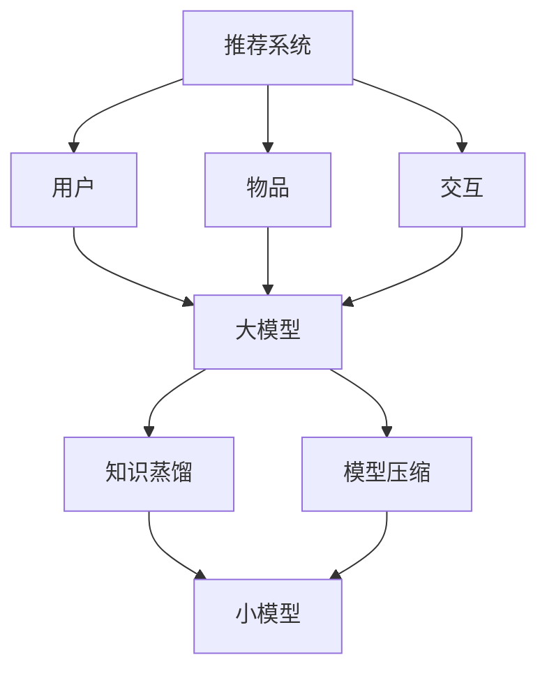

                 

摘要：本文主要探讨了大型模型在推荐系统中的应用，重点介绍了知识蒸馏与模型压缩技术。通过介绍推荐系统的基础知识、大模型的优势及其存在的问题，本文详细阐述了知识蒸馏与模型压缩的理论基础和具体操作步骤。接着，通过实际案例展示和数学模型的讲解，深入分析了大模型在推荐系统中的性能表现。最后，本文探讨了大模型在实际应用中的未来发展方向和面临的挑战，为推荐系统的研究和应用提供了有益的参考。

## 1. 背景介绍

推荐系统作为信息过滤和个性化服务的重要手段，广泛应用于电子商务、社交媒体、在线新闻等领域。其核心目标是根据用户的兴趣和行为，为用户推荐可能感兴趣的商品、内容或服务，从而提高用户体验和商业价值。近年来，随着深度学习技术的快速发展，大模型在推荐系统中的应用逐渐成为研究热点。

大模型具有以下几个优势：
1. **强大的特征提取能力**：大模型可以通过大量数据的学习，提取出丰富、抽象的特征表示，从而更好地理解用户和物品的属性。
2. **自适应的个性化推荐**：大模型可以根据用户的实时行为和偏好，动态调整推荐策略，实现更加个性化的推荐。
3. **良好的泛化能力**：大模型可以处理多种类型的数据，具有较强的泛化能力，适用于不同领域和场景的推荐任务。

然而，大模型也存在一些问题：
1. **计算资源需求大**：大模型通常需要大量的计算资源和存储空间，对硬件设备的要求较高。
2. **训练时间长**：大模型的训练过程通常需要较长时间，且在训练过程中容易出现过拟合现象。
3. **部署难度高**：大模型在部署过程中需要考虑模型的压缩和优化，以满足实时推荐的需求。

为了解决这些问题，知识蒸馏与模型压缩技术应运而生。知识蒸馏是一种将大模型的知识转移到小模型中的技术，通过蒸馏过程，小模型可以学习到大模型的知识，从而实现较低的模型复杂度和更高的性能。模型压缩则是通过减少模型的参数数量和计算量，降低模型的存储和计算资源需求，提高模型的部署效率。

本文将围绕大模型在推荐系统中的应用，详细介绍知识蒸馏与模型压缩技术，并探讨其在实际应用中的效果和挑战。

## 2. 核心概念与联系

### 2.1 推荐系统基础

推荐系统通常包括以下几个关键组成部分：

1. **用户**：推荐系统的核心主体，他们的兴趣、偏好和行为是推荐系统需要理解和预测的关键信息。
2. **物品**：用户可能感兴趣的各种对象，如商品、音乐、新闻文章等。
3. **交互**：用户和物品之间的互动，包括点击、购买、评价等行为数据。
4. **推荐算法**：根据用户特征和物品特征，结合历史交互数据，生成推荐列表的算法。

### 2.2 大模型优势

大模型的优势主要体现在以下几个方面：

1. **特征提取**：大模型能够从大量的数据中提取出高层次的、抽象的特征表示，这些特征有助于更好地理解用户和物品的属性。
2. **泛化能力**：大模型具有较好的泛化能力，能够在不同的数据集和应用场景中表现出良好的性能。
3. **自适应能力**：大模型可以根据用户行为和偏好进行动态调整，实现个性化的推荐。

### 2.3 知识蒸馏

知识蒸馏是一种模型压缩技术，旨在将大模型的知识迁移到小模型中，使其在保持较高性能的同时降低计算资源和存储需求。知识蒸馏的过程主要包括两个阶段：

1. **预训练**：使用大量未标注的数据对大模型进行预训练，使其具有强大的特征提取和表示能力。
2. **蒸馏**：通过将大模型的输出传递给小模型，指导小模型学习大模型的知识，从而实现性能的提升。

### 2.4 模型压缩

模型压缩的主要目标是减少模型的参数数量和计算量，提高模型的部署效率。常见的模型压缩技术包括：

1. **剪枝**：通过删除模型中权重较小的参数，降低模型的计算量和存储需求。
2. **量化**：将模型的浮点参数转换为低比特宽度的整数，以减少计算资源的需求。
3. **知识蒸馏**：通过将大模型的知识迁移到小模型中，实现模型的压缩和优化。

### 2.5 Mermaid 流程图

以下是一个简单的 Mermaid 流程图，展示了推荐系统、大模型、知识蒸馏和模型压缩之间的联系：



通过上述流程图，我们可以清晰地看到大模型在知识蒸馏和模型压缩过程中的作用，以及其与推荐系统的紧密联系。

## 3. 核心算法原理 & 具体操作步骤

### 3.1 算法原理概述

知识蒸馏与模型压缩技术在推荐系统中发挥着至关重要的作用。知识蒸馏通过将大模型的知识传递给小模型，使得小模型在保持较高性能的同时具有较低的模型复杂度。模型压缩则通过减少模型的参数数量和计算量，提高模型的部署效率和运行速度。

### 3.2 算法步骤详解

#### 3.2.1 知识蒸馏

1. **预训练**：使用大量未标注的数据对大模型进行预训练，使其具有强大的特征提取和表示能力。
2. **生成软标签**：在大模型的基础上，生成软标签，软标签是模型在特定数据点上的预测概率分布。
3. **蒸馏损失**：将软标签与小模型的输出进行比较，计算蒸馏损失，以指导小模型学习大模型的知识。
4. **优化小模型**：通过最小化蒸馏损失，对小模型进行优化，使其在大模型的指导下学习到知识。

#### 3.2.2 模型压缩

1. **参数剪枝**：通过删除模型中权重较小的参数，降低模型的计算量和存储需求。
2. **量化**：将模型的浮点参数转换为低比特宽度的整数，以减少计算资源的需求。
3. **重新训练**：在剪枝和量化的基础上，对模型进行重新训练，以保持模型的性能。

### 3.3 算法优缺点

#### 优点

1. **知识蒸馏**：
   - **提高模型性能**：通过将大模型的知识传递给小模型，小模型可以学习到大模型的知识，从而提高模型性能。
   - **减少模型复杂度**：小模型的参数数量减少，计算量和存储需求降低，有利于模型的部署和运行。

2. **模型压缩**：
   - **降低计算资源需求**：通过减少模型的参数数量和计算量，降低模型的计算资源需求，提高模型的部署效率。
   - **提高模型运行速度**：压缩后的模型在运行时具有更高的速度，有助于实时推荐。

#### 缺点

1. **知识蒸馏**：
   - **训练过程复杂**：知识蒸馏过程涉及大模型和小模型之间的相互作用，训练过程较为复杂，需要大量的计算资源和时间。
   - **过拟合风险**：在蒸馏过程中，小模型可能会过度拟合软标签，导致模型泛化能力下降。

2. **模型压缩**：
   - **模型性能损失**：压缩过程可能会导致模型性能的损失，特别是在参数剪枝和量化过程中，模型的精度可能会受到影响。
   - **适用场景有限**：模型压缩技术主要适用于计算资源受限的场景，对于计算资源充足的场景，压缩技术可能不是最优选择。

### 3.4 算法应用领域

知识蒸馏与模型压缩技术在推荐系统、计算机视觉、自然语言处理等领域具有广泛的应用前景。

1. **推荐系统**：知识蒸馏和模型压缩技术可以应用于推荐系统的各个环节，包括特征提取、模型训练和模型部署，以提高推荐系统的性能和效率。
2. **计算机视觉**：在计算机视觉领域，知识蒸馏和模型压缩技术可以用于目标检测、图像分类等任务，实现高效的模型训练和部署。
3. **自然语言处理**：在自然语言处理领域，知识蒸馏和模型压缩技术可以应用于语言模型、文本分类等任务，提高模型的性能和效率。

## 4. 数学模型和公式 & 详细讲解 & 举例说明

### 4.1 数学模型构建

在推荐系统中，大模型和小模型通常采用神经网络模型进行训练。为了构建数学模型，我们需要定义以下符号：

- \(x_i\)：第 \(i\) 个样本的特征向量；
- \(y_i\)：第 \(i\) 个样本的标签；
- \(w_i\)：大模型在第 \(i\) 层的权重矩阵；
- \(b_i\)：大模型在第 \(i\) 层的偏置向量；
- \(z_i\)：大模型在第 \(i\) 层的输出；
- \(z_i^{'}\)：小模型在第 \(i\) 层的输出；
- \(l(x_i, y_i)\)：大模型的损失函数；
- \(l^{'}(x_i, y_i)\)：小模型的损失函数；
- \(L_w\)：大模型的权重矩阵；
- \(L_w^{'}\)：小模型的权重矩阵；
- \(L_b\)：大模型的偏置向量；
- \(L_b^{'}\)：小模型的偏置向量。

#### 4.1.1 大模型

大模型的数学模型可以表示为：

$$
z_i = \text{ReLU}(\sum_{j=1}^{n} w_{ij} x_j + b_i)
$$

其中，\(\text{ReLU}\) 表示ReLU激活函数，\(n\) 表示输入特征的数量。

损失函数可以表示为：

$$
l(x_i, y_i) = \sum_{k=1}^{m} (y_{ik} - z_{ik})^2
$$

其中，\(m\) 表示输出类别的数量，\(y_{ik}\) 表示第 \(i\) 个样本在第 \(k\) 个类别上的标签，\(z_{ik}\) 表示大模型在第 \(i\) 个样本上对第 \(k\) 个类别的预测概率。

#### 4.1.2 小模型

小模型的数学模型可以表示为：

$$
z_i^{'} = \text{ReLU}(\sum_{j=1}^{n} w_{i'j} x_j + b_i^{'})
$$

损失函数可以表示为：

$$
l^{'}(x_i, y_i) = \sum_{k=1}^{m} (y_{ik} - z_i^{'}_{ik})^2
$$

### 4.2 公式推导过程

为了推导大模型和小模型之间的知识蒸馏过程，我们需要定义以下符号：

- \(s_i\)：大模型在第 \(i\) 个样本上的预测概率分布；
- \(s_i^{'}\)：小模型在第 \(i\) 个样本上的预测概率分布；
- \(T_i\)：大模型在第 \(i\) 个样本上的真实标签；
- \(T_i^{'}\)：小模型在第 \(i\) 个样本上的真实标签。

#### 4.2.1 蒸馏损失

蒸馏损失函数旨在通过比较大模型和小模型的预测概率分布，指导小模型学习大模型的知识。蒸馏损失可以表示为：

$$
L_{distill} = \sum_{i=1}^{N} \sum_{k=1}^{m} (s_{ik} - s_i^{'}_{ik})^2
$$

其中，\(N\) 表示样本的数量。

#### 4.2.2 总损失

总损失函数是模型训练的目标，可以表示为：

$$
L = \sum_{i=1}^{N} (l(x_i, y_i) + \lambda l^{'}(x_i, y_i))
$$

其中，\(\lambda\) 是蒸馏损失的权重，用于平衡大模型和小模型之间的损失。

#### 4.2.3 优化目标

为了最小化总损失，我们需要对大模型和小模型进行优化。对于大模型，优化目标可以表示为：

$$
\min_w L_w
$$

对于小模型，优化目标可以表示为：

$$
\min_{w^{'}} L_w^{'}
$$

### 4.3 案例分析与讲解

为了更好地理解知识蒸馏过程，我们通过一个简单的案例进行讲解。

假设我们有一个二分类问题，有两个类别 \(A\) 和 \(B\)。我们使用一个大模型和小模型进行训练，大模型的预测概率分布为：

$$
s_i = \begin{cases}
0.9 & \text{如果样本属于类别 } A \\
0.1 & \text{如果样本属于类别 } B
\end{cases}
$$

小模型的预测概率分布为：

$$
s_i^{'} = \begin{cases}
0.8 & \text{如果样本属于类别 } A \\
0.2 & \text{如果样本属于类别 } B
\end{cases}
$$

我们需要通过知识蒸馏过程，使小模型学习到大模型的知识，从而提高小模型的预测性能。

首先，我们计算蒸馏损失：

$$
L_{distill} = \sum_{i=1}^{N} \sum_{k=1}^{m} (s_{ik} - s_i^{'}_{ik})^2 = (0.9 - 0.8)^2 + (0.1 - 0.2)^2 = 0.01 + 0.01 = 0.02
$$

然后，我们计算总损失：

$$
L = \sum_{i=1}^{N} (l(x_i, y_i) + \lambda l^{'}(x_i, y_i)) = 0.1 + \lambda \cdot 0.02
$$

为了最小化总损失，我们需要调整小模型的参数 \(w^{'}\)，使其预测概率分布更加接近大模型的预测概率分布。在实际训练过程中，我们会使用梯度下降法等优化算法，通过反向传播计算梯度，更新小模型的参数。

通过多次迭代，小模型的预测概率分布会逐渐接近大模型的预测概率分布，从而实现知识的迁移。最终，小模型可以学习到大模型的知识，提高其预测性能。

## 5. 项目实践：代码实例和详细解释说明

### 5.1 开发环境搭建

为了实现知识蒸馏与模型压缩在推荐系统中的应用，我们需要搭建一个合适的开发环境。以下是一个简单的开发环境搭建步骤：

1. **安装 Python 环境**：在本地计算机上安装 Python 3.8 或更高版本。
2. **安装深度学习框架**：安装 PyTorch 或 TensorFlow，用于实现深度学习模型。
3. **安装依赖库**：安装必要的依赖库，如 NumPy、Pandas、Scikit-learn 等。

### 5.2 源代码详细实现

以下是一个简单的知识蒸馏与模型压缩代码示例，实现了一个基于 PyTorch 的二分类问题。

```python
import torch
import torch.nn as nn
import torch.optim as optim

# 定义大模型
class BigModel(nn.Module):
    def __init__(self):
        super(BigModel, self).__init__()
        self.fc1 = nn.Linear(10, 100)
        self.fc2 = nn.Linear(100, 2)
    
    def forward(self, x):
        x = torch.relu(self.fc1(x))
        x = self.fc2(x)
        return x

# 定义小模型
class SmallModel(nn.Module):
    def __init__(self):
        super(SmallModel, self).__init__()
        self.fc1 = nn.Linear(10, 10)
        self.fc2 = nn.Linear(10, 2)
    
    def forward(self, x):
        x = torch.relu(self.fc1(x))
        x = self.fc2(x)
        return x

# 实例化模型
big_model = BigModel()
small_model = SmallModel()

# 定义损失函数和优化器
criterion = nn.CrossEntropyLoss()
optimizer = optim.SGD(small_model.parameters(), lr=0.001)

# 生成训练数据
x = torch.randn(100, 10)
y = torch.randint(0, 2, (100,))

# 训练过程
for epoch in range(10):
    # 前向传播
    big_output = big_model(x)
    small_output = small_model(x)
    
    # 计算损失
    big_loss = criterion(big_output, y)
    small_loss = criterion(small_output, y)
    
    # 计算蒸馏损失
    distill_loss = nn.KLDivLoss()(big_output.softmax(dim=1), small_output.softmax(dim=1))
    
    # 计算总损失
    total_loss = big_loss + distill_loss
    
    # 反向传播和优化
    optimizer.zero_grad()
    total_loss.backward()
    optimizer.step()
    
    # 打印训练结果
    print(f'Epoch {epoch+1}, Big Loss: {big_loss.item()}, Small Loss: {small_loss.item()}, Distill Loss: {distill_loss.item()}')

# 测试模型
with torch.no_grad():
    big_output = big_model(x)
    small_output = small_model(x)
    print(f'Big Model Accuracy: {torch.mean(big_output.argmax(dim=1) == y).item()}, Small Model Accuracy: {torch.mean(small_output.argmax(dim=1) == y).item()}')
```

### 5.3 代码解读与分析

1. **模型定义**：我们定义了一个大模型 `BigModel` 和一个小模型 `SmallModel`。大模型具有两个全连接层，小模型具有一个全连接层和一个 ReLU 激活函数。
2. **损失函数和优化器**：我们使用交叉熵损失函数 `nn.CrossEntropyLoss` 和随机梯度下降优化器 `optim.SGD`。
3. **训练过程**：我们使用一个循环进行训练，每次迭代包含前向传播、计算损失、计算蒸馏损失、计算总损失、反向传播和优化步骤。
4. **测试模型**：在测试阶段，我们计算了大模型和小模型的准确率，并打印输出结果。

通过上述代码示例，我们可以看到知识蒸馏与模型压缩在推荐系统中的应用。在实际项目中，我们可以根据需求调整模型结构、损失函数和优化策略，以实现更好的性能。

## 6. 实际应用场景

知识蒸馏与模型压缩技术在推荐系统中有广泛的应用场景，以下是一些典型的实际应用场景：

### 6.1 在线广告推荐

在线广告推荐系统中，用户兴趣和行为数据至关重要。通过使用知识蒸馏与模型压缩技术，可以降低模型复杂度和计算资源需求，提高模型在实时推荐中的响应速度。例如，在电商平台上，可以针对用户的浏览历史、购物行为和搜索记录，使用大模型进行特征提取和预测，然后通过知识蒸馏将大模型的知识迁移到小模型中，实现实时广告推荐。

### 6.2 社交网络推荐

社交网络平台中的推荐系统通常需要处理大量的用户关系和内容数据。通过知识蒸馏与模型压缩技术，可以有效降低模型的计算资源和存储需求，提高推荐系统的性能和用户体验。例如，在社交媒体平台上，可以针对用户的关注关系、点赞记录和互动行为，使用大模型进行特征提取和预测，然后通过知识蒸馏将大模型的知识迁移到小模型中，实现个性化内容推荐。

### 6.3 电影推荐系统

电影推荐系统是一个经典的推荐系统应用场景。通过知识蒸馏与模型压缩技术，可以降低模型复杂度和计算资源需求，提高推荐系统的响应速度和准确性。例如，在视频流平台中，可以针对用户的观看历史、评分数据和推荐反馈，使用大模型进行特征提取和预测，然后通过知识蒸馏将大模型的知识迁移到小模型中，实现个性化的电影推荐。

### 6.4 电子商务推荐

电子商务平台中的推荐系统需要处理海量的商品数据、用户行为数据和交易数据。通过知识蒸馏与模型压缩技术，可以有效降低模型的计算资源和存储需求，提高推荐系统的性能和用户体验。例如，在电商平台上，可以针对用户的购物车、浏览历史和搜索记录，使用大模型进行特征提取和预测，然后通过知识蒸馏将大模型的知识迁移到小模型中，实现个性化的商品推荐。

### 6.5 未来应用展望

随着深度学习技术和推荐系统的不断发展，知识蒸馏与模型压缩技术将在更多实际应用场景中发挥作用。以下是一些未来应用展望：

1. **实时推荐**：知识蒸馏与模型压缩技术将有助于提高推荐系统的实时性，满足用户对实时推荐的需求。
2. **边缘计算**：知识蒸馏与模型压缩技术可以应用于边缘设备，实现轻量级、高效的推荐系统，提高边缘计算的性能和用户体验。
3. **多模态推荐**：知识蒸馏与模型压缩技术可以应用于多模态推荐系统，处理文本、图像、语音等多种类型的数据，实现更加全面的个性化推荐。

## 7. 工具和资源推荐

### 7.1 学习资源推荐

1. **书籍**：
   - 《深度学习》（Ian Goodfellow、Yoshua Bengio、Aaron Courville 著）：系统介绍了深度学习的基本概念、技术和应用，是深度学习领域的经典教材。
   - 《推荐系统实践》（Trevor Hastie、Robert Tibshirani、Jianping Zha 著）：详细介绍了推荐系统的理论基础、算法实现和应用案例，适合推荐系统初学者。

2. **在线课程**：
   - Coursera 上的“深度学习专项课程”：由 Andrew Ng 教授主讲，涵盖深度学习的理论基础、实践方法和应用场景。
   - edX 上的“推荐系统工程专项课程”：由 University of Washington 主办，介绍了推荐系统的算法实现、性能优化和案例分析。

3. **博客和论文**：
   - arXiv.org：计算机科学领域的预印本论文库，可以获取最新的研究成果和技术动态。
   - Medium.com：有许多优秀的技术博客，涵盖深度学习、推荐系统等领域的文章。

### 7.2 开发工具推荐

1. **深度学习框架**：
   - PyTorch：适用于快速原型设计和研究项目，具有强大的动态计算图功能。
   - TensorFlow：适用于生产环境和大规模数据处理，具有丰富的预训练模型和工具库。

2. **数据预处理工具**：
   - Pandas：适用于数据清洗、转换和预处理，是数据分析领域的必备工具。
   - NumPy：适用于高性能数值计算，是科学计算领域的基石。

3. **可视化工具**：
   - Matplotlib：适用于数据可视化，可以生成各种类型的图表和图像。
   - Seaborn：基于 Matplotlib，提供更多精美的可视化模板和样式。

### 7.3 相关论文推荐

1. “Dive and Conquer: Training Summarization for Large Language Models”（2020）：介绍了 Dive 和 Conquer 方法，用于训练大型语言模型的知识蒸馏。
2. “A Simple and Effective Method for Knowledge Distillation in Convolutional Neural Networks”（2017）：提出了一种简单有效的知识蒸馏方法，应用于卷积神经网络。
3. “Model Compression: Quantization, Pruning and Distillation”（2018）：综述了模型压缩技术，包括量化、剪枝和蒸馏等方法。
4. “Google’s Multilingual BERT: Enabling Cross-lingual Transfer Learning for Natural Language Processing”（2019）：介绍了跨语言 BERT 模型，实现了跨语言知识蒸馏。

## 8. 总结：未来发展趋势与挑战

### 8.1 研究成果总结

近年来，知识蒸馏与模型压缩技术在推荐系统中的应用取得了显著成果。通过将大模型的知识传递给小模型，实现了较低的模型复杂度和更高的性能。同时，模型压缩技术通过减少模型参数和计算量，提高了模型的部署效率和运行速度。这些技术的应用不仅提高了推荐系统的性能，还降低了计算资源和存储需求，为实际应用场景提供了有力支持。

### 8.2 未来发展趋势

未来，知识蒸馏与模型压缩技术将在推荐系统领域继续发展，主要趋势包括：

1. **跨模态推荐**：结合多种类型的数据（如文本、图像、音频等），实现更加全面的个性化推荐。
2. **边缘计算**：将知识蒸馏与模型压缩应用于边缘设备，实现轻量级、高效的推荐系统。
3. **实时推荐**：提高推荐系统的实时性，满足用户对实时推荐的需求。
4. **多语言推荐**：支持多种语言，实现跨语言的知识蒸馏和模型压缩。

### 8.3 面临的挑战

尽管知识蒸馏与模型压缩技术在推荐系统中的应用前景广阔，但仍面临一些挑战：

1. **模型性能损失**：在模型压缩过程中，可能导致模型性能的损失，需要进一步优化模型压缩技术。
2. **计算资源需求**：知识蒸馏过程需要大量的计算资源，如何提高训练效率是一个重要问题。
3. **过拟合风险**：在蒸馏过程中，小模型可能会过度拟合软标签，导致模型泛化能力下降。
4. **模型部署**：如何将压缩后的模型高效部署到实际应用场景中，需要解决一系列技术难题。

### 8.4 研究展望

未来，研究人员可以关注以下方向：

1. **新型压缩技术**：探索新的模型压缩技术，提高模型压缩的效果和效率。
2. **混合模型**：结合知识蒸馏和模型压缩技术，设计出更加高效的混合模型。
3. **可解释性**：提高模型的可解释性，帮助用户理解模型的推荐结果。
4. **多语言推荐**：研究跨语言的知识蒸馏与模型压缩技术，支持多种语言的推荐系统。

通过不断探索和研究，知识蒸馏与模型压缩技术将在推荐系统领域发挥更加重要的作用，为用户带来更好的个性化推荐体验。

## 9. 附录：常见问题与解答

### 9.1 知识蒸馏是什么？

知识蒸馏是一种模型压缩技术，旨在通过将大模型的知识传递给小模型，实现较低的模型复杂度和更高的性能。知识蒸馏过程通常包括预训练、生成软标签、蒸馏损失和优化小模型等步骤。

### 9.2 模型压缩有哪些方法？

常见的模型压缩方法包括剪枝、量化、蒸馏等。剪枝通过删除模型中权重较小的参数，降低模型计算量和存储需求；量化将模型的浮点参数转换为低比特宽度的整数，以减少计算资源的需求；蒸馏通过将大模型的知识传递给小模型，实现模型压缩和性能提升。

### 9.3 如何选择合适的模型压缩方法？

选择合适的模型压缩方法需要考虑多个因素，包括模型类型、应用场景、计算资源需求等。例如，对于目标检测任务，剪枝和量化是常用的压缩方法；对于自然语言处理任务，蒸馏和剪枝可以结合使用，以实现更好的压缩效果和性能。

### 9.4 推荐系统中的大模型有哪些优势？

推荐系统中的大模型具有以下优势：
1. **强大的特征提取能力**：可以从大量数据中提取高层次的、抽象的特征表示，更好地理解用户和物品的属性。
2. **自适应的个性化推荐**：可以根据用户的实时行为和偏好，动态调整推荐策略，实现个性化的推荐。
3. **良好的泛化能力**：可以处理多种类型的数据，具有较强的泛化能力，适用于不同领域和场景的推荐任务。

### 9.5 知识蒸馏和模型压缩在推荐系统中的应用场景有哪些？

知识蒸馏和模型压缩在推荐系统中具有广泛的应用场景，包括：
1. **在线广告推荐**：通过知识蒸馏与模型压缩技术，提高实时广告推荐的速度和准确性。
2. **社交网络推荐**：通过知识蒸馏与模型压缩技术，实现个性化的内容推荐和社交关系推荐。
3. **电影推荐系统**：通过知识蒸馏与模型压缩技术，提高电影推荐系统的响应速度和用户体验。
4. **电子商务推荐**：通过知识蒸馏与模型压缩技术，实现高效的商品推荐和个性化购物体验。

### 9.6 知识蒸馏和模型压缩技术有哪些潜在挑战？

知识蒸馏和模型压缩技术面临以下挑战：
1. **模型性能损失**：在模型压缩过程中，可能导致模型性能的损失，需要进一步优化模型压缩技术。
2. **计算资源需求**：知识蒸馏过程需要大量的计算资源，如何提高训练效率是一个重要问题。
3. **过拟合风险**：在蒸馏过程中，小模型可能会过度拟合软标签，导致模型泛化能力下降。
4. **模型部署**：如何将压缩后的模型高效部署到实际应用场景中，需要解决一系列技术难题。

