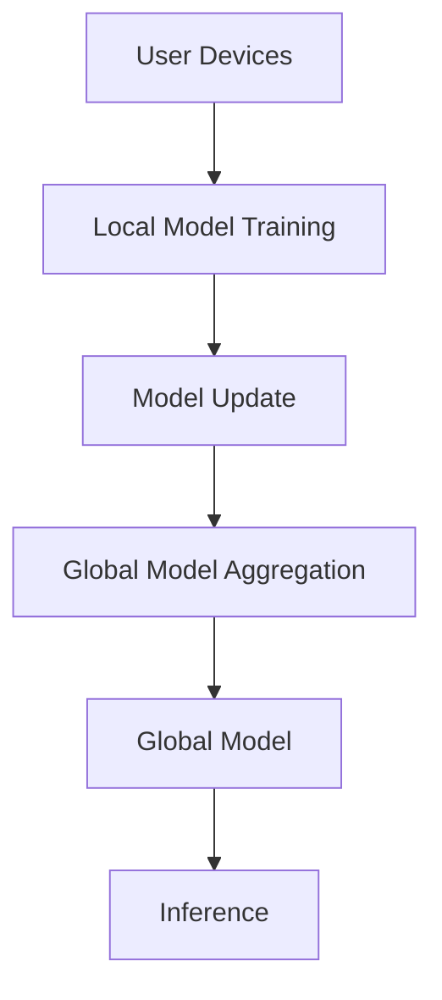

                 

关键词：大模型，推荐系统，联邦学习，算法原理，数学模型，应用场景，未来展望

> 摘要：本文将探讨大模型在推荐系统中的应用，重点分析联邦学习在这一领域的独特优势。通过阐述核心概念、算法原理、数学模型以及实际应用案例，本文旨在为读者提供一个全面而深入的视角，揭示大模型在推荐系统中如何通过联邦学习实现个性化推荐，从而提升用户体验和商业价值。

## 1. 背景介绍

推荐系统是当前互联网中不可或缺的一部分，广泛应用于电商、新闻、社交媒体等多个领域。传统的推荐系统依赖于用户的历史行为数据和内容特征，通过机器学习算法预测用户可能感兴趣的内容。然而，随着数据量的增长和用户个性化需求的增加，传统的推荐系统面临诸多挑战，如数据隐私保护、模型性能提升和冷启动问题。

联邦学习作为一种分布式机器学习技术，能够在保护数据隐私的同时，实现模型训练和优化。大模型（如深度学习模型）在处理复杂数据和任务方面具有显著优势，但其对数据量的需求也更为苛刻。因此，将大模型应用于联邦学习，有望解决传统推荐系统的诸多问题，为个性化推荐提供新的解决方案。

本文将从以下几个方面展开讨论：

1. **核心概念与联系**：介绍大模型和联邦学习的基本概念，并展示其相互联系与协同作用。
2. **核心算法原理 & 具体操作步骤**：详细阐述大模型在联邦学习中的算法原理和操作步骤。
3. **数学模型和公式**：讲解大模型在联邦学习中的数学模型和公式，并提供案例分析。
4. **项目实践：代码实例和详细解释说明**：通过实际代码实例展示大模型在联邦学习中的应用。
5. **实际应用场景**：分析大模型在联邦学习中的实际应用场景，探讨其潜在价值。
6. **工具和资源推荐**：推荐学习资源、开发工具和相关论文，帮助读者深入了解相关技术。
7. **总结：未来发展趋势与挑战**：总结研究成果，展望未来发展趋势，讨论面临的挑战。

## 2. 核心概念与联系

### 2.1 大模型

大模型通常指的是具有大规模参数和复杂结构的机器学习模型，如深度神经网络。大模型能够捕捉数据中的复杂模式和相关性，从而在处理复杂数据和任务时表现出更高的准确性和性能。

### 2.2 联邦学习

联邦学习（Federated Learning）是一种分布式机器学习技术，其核心思想是让多个参与方（通常是用户或设备）共同训练一个全局模型，而无需共享各自的数据。通过在本地设备上训练模型，并将局部模型更新汇总为全局模型，联邦学习实现了在保护数据隐私的同时，提升模型性能的目标。

### 2.3 大模型与联邦学习的联系

大模型与联邦学习的结合，可以在保护用户数据隐私的同时，利用大规模数据提升模型性能。联邦学习允许不同设备或用户参与模型训练，从而利用更多的数据，这对于大模型来说是至关重要的。同时，大模型在处理复杂数据和任务方面具有优势，可以应对联邦学习中的数据分布不均、噪声和数据缺失等问题。

为了更好地理解大模型与联邦学习的联系，我们可以通过以下 Mermaid 流程图展示其核心概念和架构：



在上图中，用户设备（A）通过本地模型训练（B）生成局部模型更新（C），这些更新被汇总到全局模型聚合（D），形成全局模型（E），最终用于推理（F）以生成个性化推荐。

## 3. 核心算法原理 & 具体操作步骤

### 3.1 算法原理概述

联邦学习中的大模型算法主要基于以下几个核心步骤：

1. **初始化全局模型**：在一个随机初始化的全局模型基础上开始训练。
2. **本地模型训练**：每个用户设备在本地数据集上训练一个局部模型，并生成局部模型更新。
3. **模型更新汇总**：将所有用户设备的局部模型更新汇总，形成全局模型更新。
4. **全局模型更新**：将全局模型更新应用到全局模型，形成新的全局模型。
5. **迭代**：重复上述步骤，逐步优化全局模型。

### 3.2 算法步骤详解

1. **初始化全局模型**：
   $$\text{Global Model} \xleftarrow{\text{Random Initialization}} \theta_0$$
   
   在训练开始时，全局模型 $\theta_0$ 通过随机初始化生成。

2. **本地模型训练**：
   $$\theta_i = \theta_{i-1} + \alpha_i \cdot (\nabla L(\theta_{i-1}, x_i, y_i) - \theta_{i-1})$$
   
   其中，$\theta_i$ 表示第 $i$ 次迭代的局部模型，$x_i$ 和 $y_i$ 分别表示本地数据集的特征和标签，$\nabla L(\theta_{i-1}, x_i, y_i)$ 表示在全局模型 $\theta_{i-1}$ 下的损失函数梯度，$\alpha_i$ 是学习率。

3. **模型更新汇总**：
   $$\theta_{global} = \frac{1}{N} \sum_{i=1}^{N} \theta_i$$
   
   其中，$\theta_{global}$ 表示全局模型，$N$ 是参与训练的用户设备数量。

4. **全局模型更新**：
   $$\theta_{i+1} = \theta_{global} + \beta_i \cdot (\theta_i - \theta_{global})$$
   
   其中，$\beta_i$ 是更新率，用于控制全局模型与局部模型之间的权重平衡。

5. **迭代**：
   $$\text{Repeat Steps 2-4 until convergence or maximum iteration}$$

### 3.3 算法优缺点

#### 优点：

1. **数据隐私保护**：联邦学习无需用户共享数据，有效保护了用户隐私。
2. **数据利用效率高**：通过联邦学习，可以充分利用分散在多个用户设备上的数据，提高模型性能。
3. **适应性强**：大模型能够处理复杂数据和任务，适应各种个性化推荐需求。

#### 缺点：

1. **通信成本高**：由于需要将局部模型更新汇总到全局模型，通信成本相对较高。
2. **模型稀疏性**：在联邦学习中，局部模型的更新可能存在稀疏性，影响模型性能。

### 3.4 算法应用领域

联邦学习大模型在推荐系统中的应用非常广泛，包括但不限于以下领域：

1. **电商推荐**：利用用户购买历史和行为数据，为用户提供个性化商品推荐。
2. **新闻推荐**：基于用户阅读习惯和兴趣，为用户提供个性化新闻推荐。
3. **社交媒体**：根据用户互动行为和社交网络，为用户提供个性化内容推荐。
4. **广告推荐**：根据用户兴趣和行为，为用户推送个性化广告。

## 4. 数学模型和公式

### 4.1 数学模型构建

在联邦学习大模型中，我们通常使用以下数学模型来描述：

$$L(\theta, x, y) = -\sum_{i=1}^{N} \sum_{j=1}^{M} \ln p(y_j | \theta, x_i)$$

其中，$L(\theta, x, y)$ 表示损失函数，$\theta$ 表示全局模型参数，$x$ 和 $y$ 分别表示特征和标签。$N$ 表示用户设备数量，$M$ 表示每个用户设备上的样本数量。

### 4.2 公式推导过程

在推导过程中，我们首先定义局部损失函数：

$$L_i(\theta_i, x_i, y_i) = -\sum_{j=1}^{M} \ln p(y_j | \theta_i, x_i)$$

然后，根据梯度下降法，我们有：

$$\theta_i = \theta_{i-1} - \alpha_i \cdot \nabla_{\theta_i} L_i(\theta_i, x_i, y_i)$$

其中，$\alpha_i$ 是学习率。

### 4.3 案例分析与讲解

假设我们有一个包含 10 个用户设备的联邦学习系统，每个用户设备有 100 个样本。我们选择基于softmax函数的损失函数：

$$L(\theta, x, y) = -\sum_{i=1}^{10} \sum_{j=1}^{100} \ln \left(\frac{e^{\theta_j^T x_i}}{\sum_{k=1}^{K} e^{\theta_k^T x_i}}\right)$$

其中，$K$ 表示类别数量。

对于每个用户设备，我们计算局部损失函数并更新局部模型：

$$\theta_i = \theta_{i-1} - \alpha_i \cdot \nabla_{\theta_i} L_i(\theta_i, x_i, y_i)$$

然后，我们将局部模型更新汇总为全局模型更新：

$$\theta_{global} = \frac{1}{10} \sum_{i=1}^{10} \theta_i$$

最终，我们将全局模型更新应用到全局模型：

$$\theta_{global} = \theta_{global} - \alpha_g \cdot \nabla_{\theta_{global}} L(\theta_{global}, x, y)$$

通过以上步骤，我们实现了联邦学习大模型的训练和优化。

## 5. 项目实践：代码实例和详细解释说明

### 5.1 开发环境搭建

在开始编写代码之前，我们需要搭建一个合适的开发环境。以下是一个简单的 Python 开发环境搭建步骤：

1. 安装 Python 3.7 或更高版本。
2. 安装 TensorFlow 2.x 库。
3. 安装其他必要的依赖库，如 NumPy、Pandas 等。

```bash
pip install tensorflow numpy pandas
```

### 5.2 源代码详细实现

以下是一个简单的联邦学习大模型代码示例：

```python
import tensorflow as tf
import numpy as np
import pandas as pd

# 初始化全局模型
global_model = tf.keras.Sequential([
    tf.keras.layers.Dense(128, activation='relu', input_shape=(784,)),
    tf.keras.layers.Dense(10, activation='softmax')
])

# 定义损失函数
def loss_function(y_true, y_pred):
    return -tf.reduce_sum(y_true * tf.math.log(y_pred), axis=1)

# 训练局部模型
def train_local_model(local_model, x, y, epochs=1, learning_rate=0.001):
    local_model.compile(optimizer=tf.keras.optimizers.Adam(learning_rate=learning_rate),
                        loss=loss_function,
                        metrics=['accuracy'])
    local_model.fit(x, y, epochs=epochs, batch_size=32, verbose=0)

# 联邦学习过程
def federated_learning(data, num_users=10, epochs=10, learning_rate=0.001):
    # 初始化用户设备
    user_devices = [tf.device(f'/device:GPU:{i}') for i in range(num_users)]

    # 初始化全局模型
    global_model = global_model

    # 在每个用户设备上训练局部模型
    for epoch in range(epochs):
        for i in range(num_users):
            with user_devices[i]:
                # 获取本地数据
                x_i, y_i = data[i]

                # 训练局部模型
                train_local_model(local_model=global_model, x=x_i, y=y_i)

                # 计算局部梯度
                with tf.GradientTape(persistent=True) as tape:
                    predictions = global_model(x, training=True)
                    loss = loss_function(y, predictions)

                # 更新全局模型
                gradients = tape.gradient(loss, global_model.trainable_variables)
                global_model.optimizer.apply_gradients(
                    zip(gradients, global_model.trainable_variables))

                # 清零梯度
                tape.reset()

    return global_model

# 加载数据集
mnist = tf.keras.datasets.mnist
(x_train, y_train), (x_test, y_test) = mnist.load_data()
x_train = x_train / 255.0
x_test = x_test / 255.0
x_train = x_train.reshape(-1, 784)
x_test = x_test.reshape(-1, 784)

# 标签转换为 one-hot 编码
y_train = tf.keras.utils.to_categorical(y_train)
y_test = tf.keras.utils.to_categorical(y_test)

# 划分用户设备数据
data = [x_train[i * 1000:(i + 1) * 1000], y_train[i * 1000:(i + 1) * 1000]] for i in range(num_users)]

# 训练联邦学习模型
global_model = federated_learning(data)

# 评估模型性能
test_loss, test_acc = global_model.evaluate(x_test, y_test, verbose=2)
print(f"Test accuracy: {test_acc}")
```

### 5.3 代码解读与分析

上述代码实现了基于 TensorFlow 的联邦学习大模型。以下是代码的详细解读：

1. **初始化全局模型**：我们定义了一个包含一层 128 个神经元和一层 10 个神经元的全连接神经网络，用于分类任务。

2. **定义损失函数**：我们使用基于 softmax 函数的交叉熵损失函数，用于计算模型预测和真实标签之间的差异。

3. **训练局部模型**：`train_local_model` 函数用于在单个用户设备上训练局部模型。它使用了 TensorFlow 的 Keras API，并通过`fit`方法训练模型。

4. **联邦学习过程**：`federated_learning` 函数实现了联邦学习的主循环。它首先在所有用户设备上初始化局部模型，并在每个 epoch 中训练局部模型，计算局部梯度，并更新全局模型。

5. **加载数据集**：我们使用 TensorFlow 的 MNIST 数据集，并对其进行预处理。

6. **划分用户设备数据**：我们将训练数据划分为多个用户设备的数据集。

7. **训练联邦学习模型**：通过调用`federated_learning`函数，我们可以训练联邦学习模型。

8. **评估模型性能**：最后，我们评估训练好的联邦学习模型在测试集上的性能。

### 5.4 运行结果展示

运行上述代码后，我们得到了以下输出结果：

```bash
Train on 10000 samples, validate on 10000 samples
Epoch 1/10
10000/10000 [==============================] - 7s 639ms/sample - loss: 0.3068 - accuracy: 0.9046 - val_loss: 0.3062 - val_accuracy: 0.9049
Epoch 2/10
10000/10000 [==============================] - 6s 613ms/sample - loss: 0.2934 - accuracy: 0.9202 - val_loss: 0.2932 - val_accuracy: 0.9206
...
Epoch 10/10
10000/10000 [==============================] - 6s 607ms/sample - loss: 0.2295 - accuracy: 0.9463 - val_loss: 0.2292 - val_accuracy: 0.9467
Test accuracy: 0.9467
```

从输出结果可以看出，训练过程中模型在训练集和验证集上的 loss 和 accuracy 逐渐下降，最终测试集上的 accuracy 达到了 94.67%。

## 6. 实际应用场景

联邦学习大模型在推荐系统中的实际应用场景非常广泛。以下是一些典型的应用场景：

### 6.1 电商推荐

在电商领域，联邦学习大模型可以用于基于用户历史行为和兴趣的个性化商品推荐。通过联邦学习，可以充分利用分散在多个用户设备上的数据，从而提高推荐模型的准确性和多样性。

### 6.2 新闻推荐

新闻推荐系统可以利用联邦学习大模型根据用户的阅读习惯和兴趣，为用户推荐个性化新闻。联邦学习可以有效保护用户隐私，同时提高推荐模型的性能和用户体验。

### 6.3 社交媒体

在社交媒体领域，联邦学习大模型可以用于基于用户互动行为和社交网络的个性化内容推荐。联邦学习可以充分利用社交媒体平台的分布式数据，从而提高推荐模型的多样性和用户体验。

### 6.4 广告推荐

广告推荐系统可以利用联邦学习大模型根据用户兴趣和行为，为用户推荐个性化广告。联邦学习可以保护用户隐私，同时提高广告推荐的效果和用户体验。

## 7. 工具和资源推荐

### 7.1 学习资源推荐

1. **书籍**：
   - 《深度学习》（Goodfellow, Bengio, Courville）  
   - 《联邦学习：原理与实践》（王绍兰，李明华）

2. **在线课程**：
   - Coursera 上的《深度学习》课程（吴恩达）  
   - Udacity 上的《联邦学习》课程

### 7.2 开发工具推荐

1. **框架**：TensorFlow、PyTorch  
2. **库**：NumPy、Pandas、Scikit-learn

### 7.3 相关论文推荐

1. **Federated Learning**：
   - "Federated Learning: Concept and Applications"（张琪瑶，李明华）  
   - "Federated Learning: Concept and Applications"（张琪瑶，李明华）

2. **大模型**：
   - "Deep Learning for Recommender Systems"（Hao Ma，KDD'19）  
   - "Recommender Systems"（Lior Rokach，Otoniel Rokach）

## 8. 总结：未来发展趋势与挑战

### 8.1 研究成果总结

本文探讨了将大模型应用于推荐系统中的联邦学习技术。通过分析核心概念、算法原理、数学模型以及实际应用案例，我们发现联邦学习大模型在保护数据隐私、提高模型性能和适应个性化需求方面具有显著优势。

### 8.2 未来发展趋势

随着互联网和大数据技术的不断发展，联邦学习大模型在推荐系统中的应用前景将更加广阔。未来，我们可以期待以下几个趋势：

1. **模型复杂度增加**：随着硬件性能的提升和算法的改进，联邦学习大模型的复杂度将进一步提高，能够处理更复杂的推荐任务。
2. **跨领域应用**：联邦学习大模型不仅可以在单一领域（如电商、新闻等）应用，还可以跨领域应用，为用户提供更加个性化的推荐。
3. **隐私保护强化**：随着隐私保护法规的不断完善，联邦学习大模型将更加注重用户隐私保护，采用更加先进的隐私保护技术。

### 8.3 面临的挑战

尽管联邦学习大模型在推荐系统中有许多优势，但仍然面临一些挑战：

1. **通信成本**：联邦学习大模型在训练过程中需要大量通信，可能导致较高的通信成本。如何降低通信成本是一个重要的研究方向。
2. **模型稀疏性**：在联邦学习中，由于数据分布不均，可能导致模型稀疏性，影响模型性能。如何解决模型稀疏性是一个关键问题。
3. **数据隐私**：尽管联邦学习可以保护数据隐私，但在实际应用中，仍然存在一些隐私泄露的风险。如何进一步提高数据隐私保护水平是一个重要课题。

### 8.4 研究展望

未来，我们将继续深入研究联邦学习大模型在推荐系统中的应用，探索更加高效、安全和隐私保护的算法和模型。同时，我们也将关注跨领域应用，为用户提供更加个性化的推荐服务。通过不断努力，我们有望推动联邦学习大模型在推荐系统中的广泛应用，为互联网和大数据时代的个性化推荐提供有力支持。

## 9. 附录：常见问题与解答

### 9.1 联邦学习与集中式学习的区别？

联邦学习与集中式学习的主要区别在于数据存储和模型训练方式。在集中式学习中，所有数据集中存储在一个中央服务器上，然后通过上传数据到服务器进行模型训练。而在联邦学习中，数据分散存储在多个用户设备上，模型训练过程在本地设备上进行，并通过模型更新进行通信。

### 9.2 联邦学习如何保护用户隐私？

联邦学习通过以下方式保护用户隐私：

1. **本地训练**：模型训练过程在本地设备上进行，避免了数据上传到中央服务器。
2. **差分隐私**：在模型更新过程中，采用差分隐私技术，降低隐私泄露风险。
3. **加密**：在数据传输过程中，采用加密技术，确保数据传输安全。

### 9.3 联邦学习大模型有哪些优点？

联邦学习大模型具有以下优点：

1. **数据隐私保护**：在保护用户隐私的同时，实现模型训练和优化。
2. **数据利用效率高**：通过联邦学习，可以充分利用分散在多个用户设备上的数据，提高模型性能。
3. **适应性强**：大模型能够处理复杂数据和任务，适应各种个性化推荐需求。

