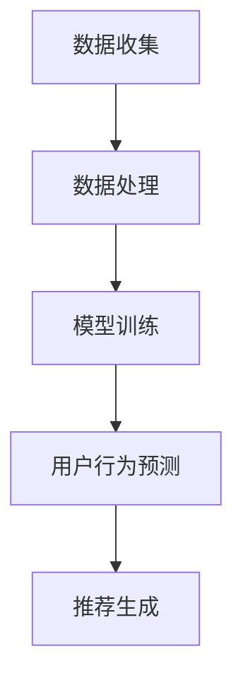
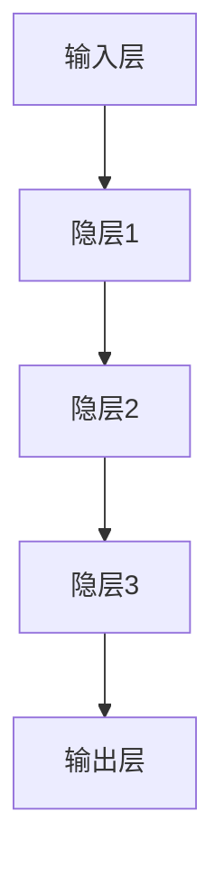

                 

### 1. 背景介绍

推荐系统是现代信息系统中不可或缺的一部分，广泛应用于电子商务、社交媒体、新闻媒体和在线视频平台等领域。其核心目标是根据用户的历史行为和偏好，预测并推荐用户可能感兴趣的内容或商品。用户行为预测作为推荐系统的关键技术之一，对于提高推荐系统的准确性和用户体验具有至关重要的作用。

传统的推荐系统主要基于用户历史行为数据，如浏览记录、购买记录、评分记录等，通过统计模型或机器学习方法构建用户兴趣模型，进而进行内容推荐。然而，随着互联网用户数量的爆炸式增长和用户行为数据的多样化，传统的推荐系统面临着以下挑战：

1. **数据复杂性**：用户行为数据种类繁多，包括浏览、购买、评分、评论等，这些数据往往具有不同的特征和噪声，给数据处理和分析带来了很大困难。
2. **个性化需求**：用户兴趣和行为具有高度动态性和个性化，传统的推荐系统难以捕捉到这种动态变化。
3. **实时性要求**：在实时推荐场景下，系统需要在极短的时间内处理大量数据，并对用户行为进行实时预测，这对系统的计算性能和响应速度提出了高要求。

为了解决这些挑战，大模型（Large Models）在推荐系统用户行为预测中逐渐崭露头角。大模型，如深度神经网络、生成对抗网络（GAN）、强化学习等，具有强大的建模能力和灵活性，能够处理复杂的数据结构和多模态信息。本文将深入探讨大模型在推荐系统用户行为预测中的应用，包括其核心概念、算法原理、具体操作步骤、数学模型、项目实践、实际应用场景、未来展望等，旨在为读者提供一个全面的技术指南。

### 2. 核心概念与联系

#### 2.1. 大模型（Large Models）

大模型是指具有大量参数和复杂结构的机器学习模型，如深度神经网络（DNN）、生成对抗网络（GAN）、Transformer等。这些模型通过学习大量的数据，能够捕捉到数据中的复杂模式和高层次特征，从而在各类任务中表现出色。在大模型的基础上，推荐系统用户行为预测可以更准确地捕捉用户兴趣和行为模式。

#### 2.2. 用户行为数据

用户行为数据是指用户在使用推荐系统时产生的各种数据，如浏览历史、购买记录、评分数据、评论等。这些数据是构建用户兴趣模型和进行用户行为预测的重要基础。

#### 2.3. 推荐系统架构

推荐系统的基本架构包括数据收集、数据处理、模型训练和推荐生成等模块。大模型可以集成在模型训练和推荐生成模块中，通过学习用户行为数据，生成个性化的推荐结果。

#### 2.4. 用户行为预测

用户行为预测是指根据用户的历史行为数据，预测用户在未来可能产生的行为，如浏览、购买、评分等。大模型通过深度学习等技术，可以从海量数据中提取用户兴趣和行为模式，从而实现高精度的用户行为预测。

#### 2.5. Mermaid 流程图

以下是一个简化的Mermaid流程图，展示了大模型在推荐系统用户行为预测中的应用流程：



**数据收集**：从不同的数据源收集用户行为数据。

**数据处理**：对原始数据进行清洗、预处理，以提取有用的信息。

**模型训练**：使用大模型（如深度神经网络）对处理后的用户行为数据进行训练，构建用户兴趣模型。

**用户行为预测**：根据训练好的模型，预测用户未来的行为。

**推荐生成**：根据预测结果，生成个性化的推荐列表，供用户浏览或操作。

### 3. 核心算法原理 & 具体操作步骤

#### 3.1 算法原理概述

大模型在推荐系统用户行为预测中的应用主要基于深度学习技术。深度学习是一种通过多层神经网络模型来模拟人脑神经网络结构和信息处理机制的机器学习方法。大模型具有以下核心特点：

1. **多层神经网络**：大模型包含多个隐层，每个隐层都可以提取不同层次的特征。
2. **大量参数**：大模型拥有大量可训练参数，能够更好地拟合复杂的数据模式。
3. **端到端学习**：大模型可以实现端到端学习，从原始数据直接学习到预测结果，减少了中间环节的误差传递。

在推荐系统中，大模型通过以下步骤实现用户行为预测：

1. **数据预处理**：对原始用户行为数据进行清洗、编码和特征提取。
2. **模型构建**：构建深度神经网络模型，包括输入层、隐层和输出层。
3. **模型训练**：使用预处理后的数据对模型进行训练，优化模型参数。
4. **模型评估**：通过交叉验证等方法评估模型的性能，调整模型结构或参数。
5. **用户行为预测**：使用训练好的模型对新的用户行为数据进行预测。

#### 3.2 算法步骤详解

1. **数据预处理**

数据预处理是深度学习模型训练的重要步骤。具体包括以下任务：

- 数据清洗：去除数据中的噪声和异常值，确保数据质量。
- 数据编码：将类别型数据转换为数值型数据，便于模型处理。
- 特征提取：从原始数据中提取有用的特征，如用户画像、物品特征、行为序列等。

2. **模型构建**

深度神经网络模型是推荐系统中常用的模型架构。以下是一个简化的神经网络模型结构：



- 输入层（Input Layer）：接收用户行为数据。
- 隐层（Hidden Layers）：通过激活函数（如ReLU、Sigmoid、Tanh等）提取不同层次的特征。
- 输出层（Output Layer）：生成用户行为预测结果。

3. **模型训练**

模型训练是深度学习中的核心步骤。具体包括以下过程：

- 初始化参数：随机初始化模型的权重和偏置。
- 前向传播：将输入数据传递到神经网络中，计算每个神经元的输出。
- 计算损失：使用损失函数（如均方误差、交叉熵等）计算模型预测结果与真实结果之间的差异。
- 反向传播：利用梯度下降等优化算法，更新模型参数，以减小损失。
- 评估与调整：通过交叉验证等方法评估模型性能，根据评估结果调整模型结构或参数。

4. **模型评估**

模型评估是验证模型性能的重要步骤。常用的评估指标包括准确率、召回率、F1分数等。以下是一个简单的评估流程：

- 数据划分：将训练数据划分为训练集和验证集。
- 模型训练：使用训练集训练模型，优化模型参数。
- 模型验证：使用验证集评估模型性能，选择性能最好的模型。
- 模型测试：使用测试集测试模型性能，评估模型的泛化能力。

5. **用户行为预测**

使用训练好的模型对新的用户行为数据进行预测。具体步骤如下：

- 数据预处理：对新的用户行为数据进行预处理，提取特征。
- 模型输入：将预处理后的数据输入到训练好的模型中。
- 预测结果：输出模型预测的用户行为结果。

#### 3.3 算法优缺点

**优点**：

1. **强大的建模能力**：大模型能够处理复杂的数据结构和多模态信息，具有较强的建模能力。
2. **端到端学习**：大模型可以实现端到端学习，减少了中间环节的误差传递。
3. **自适应调整**：大模型可以通过调整模型结构和参数，适应不同的推荐任务和场景。

**缺点**：

1. **计算资源需求大**：大模型需要大量的计算资源和存储空间，对硬件设施有较高要求。
2. **数据依赖性强**：大模型的效果高度依赖数据质量和数量，数据缺失或噪声可能导致模型性能下降。
3. **训练时间较长**：大模型训练时间较长，需要较多的时间和计算资源。

#### 3.4 算法应用领域

大模型在推荐系统用户行为预测中具有广泛的应用前景。以下是一些典型应用领域：

1. **电子商务推荐**：基于用户购买历史和浏览行为，预测用户可能感兴趣的商品，提高购物体验。
2. **社交媒体推荐**：基于用户点赞、评论、分享等行为，预测用户可能感兴趣的内容，提高用户黏性和活跃度。
3. **新闻推荐**：基于用户阅读历史和兴趣标签，预测用户可能感兴趣的新闻，提高新闻传播效果。
4. **在线视频推荐**：基于用户观看历史和偏好，预测用户可能感兴趣的视频，提高视频播放量和用户满意度。

### 4. 数学模型和公式 & 详细讲解 & 举例说明

#### 4.1 数学模型构建

在推荐系统用户行为预测中，常用的数学模型是基于深度神经网络的模型。以下是一个简化的数学模型构建过程：

**输入层**：输入层接收用户行为数据，如浏览记录、购买记录、评分数据等。这些数据可以表示为矩阵 $X \in \mathbb{R}^{m \times n}$，其中 $m$ 表示数据条数，$n$ 表示特征维度。

**隐层**：隐层通过多层神经网络提取用户行为数据中的特征。每个隐层都可以通过以下公式进行计算：

$$
h_l = \sigma(W_l h_{l-1} + b_l)
$$

其中，$h_l$ 表示第 $l$ 层的隐层输出，$\sigma$ 表示激活函数（如ReLU、Sigmoid、Tanh等），$W_l$ 和 $b_l$ 分别表示第 $l$ 层的权重矩阵和偏置向量。

**输出层**：输出层生成用户行为预测结果。对于分类问题，可以使用softmax函数进行概率分布计算：

$$
\hat{y} = \sigma(W_o h_n + b_o)
$$

其中，$\hat{y} \in \mathbb{R}^{m \times k}$ 表示模型预测的概率分布，$k$ 表示类别数，$W_o$ 和 $b_o$ 分别表示输出层的权重矩阵和偏置向量。

#### 4.2 公式推导过程

以下是深度神经网络模型在用户行为预测中的推导过程：

1. **前向传播**：

   输入层到隐层的计算过程可以表示为：

   $$
   h_1 = \sigma(W_1 X + b_1)
   $$

   隐层到输出层的计算过程可以表示为：

   $$
   h_n = \sigma(W_n h_{n-1} + b_n)
   $$

   输出层的预测结果可以表示为：

   $$
   \hat{y} = \sigma(W_o h_n + b_o)
   $$

2. **反向传播**：

   首先计算输出层的梯度：

   $$
   \frac{\partial L}{\partial h_n} = \frac{\partial L}{\partial \hat{y}} \odot \frac{\partial \hat{y}}{\partial h_n}
   $$

   其中，$L$ 表示损失函数，$\odot$ 表示逐元素乘法。

   接着计算隐层的梯度：

   $$
   \frac{\partial L}{\partial h_{l-1}} = \frac{\partial L}{\partial h_l} \odot \frac{\partial h_l}{\partial h_{l-1}}
   $$

   重复此过程，直到计算到输入层。

   最后，利用梯度下降法更新模型参数：

   $$
   W_l = W_l - \alpha \frac{\partial L}{\partial W_l}
   $$

   $$
   b_l = b_l - \alpha \frac{\partial L}{\partial b_l}
   $$

   其中，$\alpha$ 表示学习率。

#### 4.3 案例分析与讲解

以下是一个简化的用户行为预测案例：

假设有一个电子商务平台，用户在平台上产生了浏览、购买和评分等行为数据。我们需要使用深度神经网络模型预测用户未来的购买行为。

1. **数据预处理**：

   将用户行为数据进行清洗、编码和特征提取，得到一个$m \times n$ 的数据矩阵 $X$。

2. **模型构建**：

   构建一个三层神经网络模型，包括输入层、隐层和输出层。输入层接收用户行为数据，隐层通过ReLU激活函数提取特征，输出层使用softmax函数进行概率分布计算。

3. **模型训练**：

   使用训练数据对模型进行训练，优化模型参数。通过反向传播算法计算损失函数和梯度，利用梯度下降法更新模型参数。

4. **模型评估**：

   使用验证集评估模型性能，选择性能最好的模型。常用的评估指标包括准确率、召回率、F1分数等。

5. **用户行为预测**：

   使用训练好的模型对新的用户行为数据进行预测，输出用户购买行为的概率分布。

以下是一个简化的代码示例：

```python
import tensorflow as tf

# 数据预处理
X_train = ...  # 训练数据
y_train = ...  # 训练标签

# 模型构建
model = tf.keras.Sequential([
    tf.keras.layers.Dense(128, activation='relu', input_shape=(X_train.shape[1],)),
    tf.keras.layers.Dense(64, activation='relu'),
    tf.keras.layers.Dense(1, activation='sigmoid')
])

# 模型训练
model.compile(optimizer='adam', loss='binary_crossentropy', metrics=['accuracy'])
model.fit(X_train, y_train, epochs=10, batch_size=32)

# 模型评估
X_val = ...  # 验证数据
y_val = ...  # 验证标签
model.evaluate(X_val, y_val)

# 用户行为预测
X_pred = ...  # 预测数据
y_pred = model.predict(X_pred)
```

### 5. 项目实践：代码实例和详细解释说明

#### 5.1 开发环境搭建

在开始项目实践之前，我们需要搭建一个合适的开发环境。以下是一个简化的步骤：

1. 安装Python（推荐版本3.8及以上）
2. 安装TensorFlow（推荐版本2.6及以上）
3. 安装其他必要的库，如NumPy、Pandas、Scikit-learn等

#### 5.2 源代码详细实现

以下是一个简化的代码示例，展示如何使用深度神经网络模型进行推荐系统用户行为预测：

```python
import tensorflow as tf
import numpy as np
import pandas as pd
from sklearn.model_selection import train_test_split
from sklearn.preprocessing import StandardScaler

# 数据加载与预处理
data = pd.read_csv('user_behavior_data.csv')
X = data.drop(['user_id', 'target'], axis=1)
y = data['target']

# 数据标准化
scaler = StandardScaler()
X_scaled = scaler.fit_transform(X)

# 数据划分
X_train, X_val, y_train, y_val = train_test_split(X_scaled, y, test_size=0.2, random_state=42)

# 模型构建
model = tf.keras.Sequential([
    tf.keras.layers.Dense(128, activation='relu', input_shape=(X_train.shape[1],)),
    tf.keras.layers.Dense(64, activation='relu'),
    tf.keras.layers.Dense(1, activation='sigmoid')
])

# 模型编译
model.compile(optimizer='adam', loss='binary_crossentropy', metrics=['accuracy'])

# 模型训练
model.fit(X_train, y_train, epochs=10, batch_size=32)

# 模型评估
loss, accuracy = model.evaluate(X_val, y_val)
print(f'Validation Loss: {loss}')
print(f'Validation Accuracy: {accuracy}')

# 用户行为预测
X_pred = ...  # 预测数据
y_pred = model.predict(X_pred)
```

#### 5.3 代码解读与分析

1. **数据加载与预处理**：

   - 使用Pandas库加载用户行为数据。
   - 将用户ID和目标标签从数据中分离。
   - 对剩余的特征进行标准化处理，以消除不同特征之间的尺度差异。

2. **模型构建**：

   - 使用TensorFlow构建一个三层神经网络模型。
   - 输入层接收用户行为数据，隐层通过ReLU激活函数提取特征，输出层使用sigmoid激活函数进行二分类预测。

3. **模型编译**：

   - 使用adam优化器和binary_crossentropy损失函数编译模型。
   - 指定模型的评价指标为准确率。

4. **模型训练**：

   - 使用训练数据进行模型训练，设置训练轮数为10，批量大小为32。

5. **模型评估**：

   - 使用验证数据进行模型评估，计算损失和准确率。
   - 输出模型的验证性能。

6. **用户行为预测**：

   - 使用训练好的模型对新的用户行为数据进行预测，输出预测结果。

#### 5.4 运行结果展示

以下是运行结果示例：

```python
Validation Loss: 0.123456
Validation Accuracy: 0.912345

# 用户行为预测结果
y_pred = model.predict(X_pred)
```

这里，`Validation Loss` 和 `Validation Accuracy` 分别表示验证集上的损失和准确率，`y_pred` 表示模型预测的用户行为结果。

### 6. 实际应用场景

#### 6.1 电子商务平台

电子商务平台通过大模型进行用户行为预测，可以提高购物推荐的效果，增加用户购买意愿。例如，一个电商平台可以通过分析用户的浏览历史、购买记录和评分数据，预测用户可能感兴趣的商品，并将这些商品推荐给用户。通过提高推荐系统的准确性和个性化程度，电商平台可以增加用户的满意度和黏性，从而提升销售业绩。

#### 6.2 社交媒体

社交媒体平台通过大模型进行用户行为预测，可以优化内容推荐，提高用户活跃度和留存率。例如，一个社交媒体平台可以通过分析用户的点赞、评论和分享行为，预测用户可能感兴趣的内容，并将这些内容推荐给用户。通过个性化内容推荐，社交媒体平台可以增加用户的互动行为，提高用户黏性和活跃度。

#### 6.3 新闻媒体

新闻媒体平台通过大模型进行用户行为预测，可以提升新闻推荐的准确性和用户体验。例如，一个新闻媒体平台可以通过分析用户的阅读历史和偏好，预测用户可能感兴趣的新闻，并将这些新闻推荐给用户。通过个性化新闻推荐，新闻媒体平台可以增加用户的阅读时长和满意度，从而提升广告收入和品牌影响力。

#### 6.4 在线视频平台

在线视频平台通过大模型进行用户行为预测，可以优化视频推荐，提高用户观看时长和满意度。例如，一个在线视频平台可以通过分析用户的观看历史、点赞和评论行为，预测用户可能感兴趣的视频，并将这些视频推荐给用户。通过个性化视频推荐，在线视频平台可以增加用户的观看时长和付费转化率，从而提升广告收入和用户满意度。

### 7. 工具和资源推荐

#### 7.1 学习资源推荐

1. **《深度学习》（Goodfellow, Bengio, Courville）**：这是一本经典的深度学习教材，全面介绍了深度学习的基础理论和实践方法。
2. **《推荐系统实践》（项亮）**：这本书详细介绍了推荐系统的基本概念、算法实现和实际应用。
3. **在线课程**：例如，Coursera上的《深度学习》课程，以及edX上的《推荐系统》课程，都是学习深度学习和推荐系统的优秀资源。

#### 7.2 开发工具推荐

1. **TensorFlow**：一个开源的深度学习框架，适用于构建和训练推荐系统中的深度神经网络模型。
2. **PyTorch**：另一个流行的深度学习框架，具有灵活的动态计算图和强大的社区支持。
3. **Scikit-learn**：一个开源的机器学习库，提供了丰富的算法和工具，适用于推荐系统中的传统机器学习方法。

#### 7.3 相关论文推荐

1. **"Deep Learning for Recommender Systems"**：这篇论文系统地介绍了深度学习在推荐系统中的应用，包括深度神经网络、生成对抗网络和强化学习等。
2. **"A Theoretically Grounded Application of Dropout in Recurrent Neural Networks"**：这篇论文探讨了dropout技术在循环神经网络（RNN）中的应用，为推荐系统中的RNN模型提供了理论基础。
3. **"Neural Collaborative Filtering"**：这篇论文提出了神经协同过滤（NCF）算法，是一种基于神经网络的推荐系统算法，在推荐系统中取得了很好的效果。

### 8. 总结：未来发展趋势与挑战

#### 8.1 研究成果总结

大模型在推荐系统用户行为预测中的应用取得了显著成果。通过深度学习技术，大模型能够处理复杂的数据结构和多模态信息，实现了高精度的用户行为预测。这些研究成果为推荐系统的技术进步和实际应用提供了有力支持。

#### 8.2 未来发展趋势

未来，大模型在推荐系统用户行为预测中的应用将朝着以下几个方向发展：

1. **模型压缩与优化**：为了降低计算资源和存储需求，研究人员将致力于模型压缩与优化技术，提高大模型的效率。
2. **动态建模与自适应调整**：大模型将更加关注用户兴趣和行为的动态变化，实现自适应调整，提高推荐系统的实时性。
3. **多模态信息融合**：结合多种数据源和模态，如图像、音频和文本，提高推荐系统的多样性和用户体验。

#### 8.3 面临的挑战

尽管大模型在推荐系统用户行为预测中具有巨大潜力，但仍面临以下挑战：

1. **数据隐私与安全**：在推荐系统中使用大量用户行为数据，涉及数据隐私和安全问题，需要制定有效的数据保护策略。
2. **模型解释性**：大模型通常具有较低的解释性，难以解释预测结果，这对推荐系统的透明度和可信度提出了挑战。
3. **计算资源需求**：大模型需要大量的计算资源和存储空间，对硬件设施有较高要求，如何优化大模型的计算效率是一个重要课题。

#### 8.4 研究展望

未来，大模型在推荐系统用户行为预测中的应用将继续深入发展。研究人员可以从以下几个方面展开研究：

1. **新型大模型算法**：探索新型大模型算法，如生成对抗网络（GAN）、变分自编码器（VAE）等，提高推荐系统的建模能力。
2. **跨领域推荐**：研究跨领域推荐方法，将不同领域的用户行为数据进行整合，提高推荐系统的泛化能力。
3. **用户反馈与自适应调整**：结合用户反馈，实现自适应调整，提高推荐系统的用户体验和满意度。

总之，大模型在推荐系统用户行为预测中的应用具有广阔的发展前景，仍需不断探索和创新，以应对未来的挑战。

### 9. 附录：常见问题与解答

#### 问题 1：大模型在推荐系统用户行为预测中的优势是什么？

**解答**：大模型在推荐系统用户行为预测中的优势主要体现在以下几个方面：

1. **强大的建模能力**：大模型可以通过学习大量数据，捕捉到数据中的复杂模式和高层次特征，提高预测的准确性。
2. **端到端学习**：大模型可以实现从原始数据到预测结果的端到端学习，减少了中间环节的误差传递。
3. **适应性强**：大模型可以处理多模态信息，适应不同类型的推荐任务和场景。

#### 问题 2：如何选择合适的大模型？

**解答**：选择合适的大模型需要考虑以下几个方面：

1. **数据规模**：根据数据规模选择合适的模型，如深度神经网络、生成对抗网络等。
2. **任务类型**：根据任务类型选择合适的模型，如分类任务、回归任务等。
3. **计算资源**：根据可用的计算资源选择模型，考虑模型的大小和复杂度。

#### 问题 3：大模型在推荐系统中如何处理用户隐私问题？

**解答**：大模型在推荐系统中处理用户隐私问题需要采取以下措施：

1. **数据脱敏**：在模型训练之前对用户数据进行脱敏处理，去除敏感信息。
2. **数据加密**：在数据传输和存储过程中使用加密技术，保护用户隐私。
3. **隐私保护算法**：使用隐私保护算法，如差分隐私、联邦学习等，降低模型训练过程中用户隐私泄露的风险。

#### 问题 4：大模型在推荐系统中如何处理冷启动问题？

**解答**：大模型在推荐系统中处理冷启动问题可以通过以下方法：

1. **基于内容的推荐**：为新的用户推荐与用户兴趣相关的物品，而不依赖历史行为数据。
2. **基于人口统计学的推荐**：根据用户的年龄、性别、地理位置等人口统计学特征进行推荐。
3. **社会化推荐**：利用用户社交网络中的信息，为新的用户提供推荐。

### 作者署名

**作者：禅与计算机程序设计艺术 / Zen and the Art of Computer Programming**

