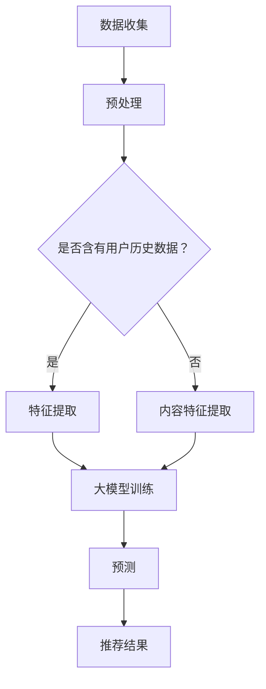

                 

关键词：大模型，推荐系统，统一，融合，趋势，人工智能，深度学习，协同过滤，图神经网络

## 摘要

本文旨在探讨大模型在推荐系统中的未来发展趋势。推荐系统作为人工智能领域的重要组成部分，在电子商务、社交媒体、在线娱乐等领域发挥着关键作用。随着大模型如Transformer、BERT等的发展，推荐系统的效果得到了显著提升。本文将深入分析大模型在推荐系统中的核心概念、算法原理、数学模型以及实际应用，探讨大模型在推荐系统中统一与融合的趋势，为未来的研究和实践提供指导。

## 1. 背景介绍

### 推荐系统概述

推荐系统是一种信息过滤和预测系统，旨在向用户推荐他们可能感兴趣的项目、产品或内容。推荐系统的核心目标是提高用户的满意度和参与度，从而增加用户粘性和商业价值。推荐系统通常基于用户的历史行为数据、内容特征、社交关系等多种信息进行预测和推荐。

### 大模型的发展

随着深度学习技术的进步，大模型如Transformer、BERT等逐渐成为研究热点。这些模型具有强大的表示能力和学习能力，能够处理大规模的数据集，并在自然语言处理、计算机视觉等多个领域取得了显著的成果。大模型的出现为推荐系统带来了新的机遇和挑战。

## 2. 核心概念与联系

### 大模型与推荐系统的关系

大模型与推荐系统的结合，主要表现在以下几个方面：

1. **特征提取**：大模型可以通过预训练的方式，从大规模数据中提取丰富的语义特征，为推荐系统提供高质量的特征表示。
2. **预测能力**：大模型具备强大的预测能力，可以准确预测用户对项目的兴趣和偏好，从而提高推荐系统的准确性。
3. **个性化推荐**：大模型可以根据用户的个性化特征和兴趣，进行精细化的推荐，提升用户的体验和满意度。

### Mermaid 流程图

以下是一个简化的Mermaid流程图，展示了大模型与推荐系统的主要关联：



### 核心概念解释

1. **数据收集**：推荐系统需要收集用户的历史行为数据、内容特征等，以供大模型训练和预测。
2. **预处理**：对收集到的数据进行清洗、归一化等处理，以消除噪声和提高数据质量。
3. **特征提取**：利用大模型提取用户和项目的特征表示，为推荐算法提供输入。
4. **大模型训练**：通过训练大模型，使其能够从数据中学习到用户的兴趣和偏好。
5. **预测**：利用训练好的大模型，预测用户对项目的兴趣和偏好。
6. **推荐**：根据预测结果，生成个性化的推荐列表。

## 3. 核心算法原理 & 具体操作步骤

### 3.1 算法原理概述

大模型在推荐系统中的应用，主要包括以下几个步骤：

1. **数据预处理**：对用户历史行为数据进行清洗、归一化等处理，提取用户和项目的特征表示。
2. **大模型训练**：利用预训练的模型，如BERT、GPT等，对提取的特征进行训练，使其能够学习到用户的兴趣和偏好。
3. **预测**：利用训练好的大模型，预测用户对项目的兴趣和偏好。
4. **推荐**：根据预测结果，生成个性化的推荐列表。

### 3.2 算法步骤详解

1. **数据预处理**：

   - **数据清洗**：去除缺失值、异常值等噪声数据。
   - **归一化**：将数据缩放到相同的范围，以消除数据之间的尺度差异。
   - **特征提取**：利用词嵌入等技术，将用户和项目的文本信息转化为向量表示。

2. **大模型训练**：

   - **预训练模型选择**：选择适合的预训练模型，如BERT、GPT等。
   - **特征输入**：将预处理后的用户和项目特征输入到预训练模型中。
   - **训练过程**：通过优化模型参数，使模型能够学习到用户的兴趣和偏好。

3. **预测**：

   - **输入特征**：将用户和项目的特征输入到训练好的模型中。
   - **兴趣预测**：利用模型输出，预测用户对项目的兴趣和偏好。

4. **推荐**：

   - **生成推荐列表**：根据预测结果，为用户生成个性化的推荐列表。
   - **推荐排序**：对推荐列表进行排序，提高推荐质量。

### 3.3 算法优缺点

1. **优点**：

   - **高效性**：大模型能够快速处理大规模数据，提高推荐系统的效率。
   - **准确性**：大模型具备强大的学习能力，能够准确预测用户的兴趣和偏好。
   - **泛化能力**：大模型可以从大规模数据中提取通用特征，提高推荐系统的泛化能力。

2. **缺点**：

   - **计算资源消耗**：大模型训练和预测需要大量的计算资源。
   - **数据依赖性**：大模型的效果受限于数据质量和数据量，对于小数据集可能效果不佳。

### 3.4 算法应用领域

大模型在推荐系统中的应用领域广泛，主要包括：

- **电子商务**：为用户提供个性化购物推荐，提高销售额。
- **社交媒体**：为用户提供感兴趣的朋友、内容推荐，增强用户粘性。
- **在线娱乐**：为用户提供个性化音乐、视频推荐，提高用户满意度。

## 4. 数学模型和公式

### 4.1 数学模型构建

大模型在推荐系统中的应用，主要涉及以下几个数学模型：

1. **用户兴趣模型**：

   - **公式**：$I(u, p) = f(U, P, \theta)$
   - **参数**：$U$表示用户特征向量，$P$表示项目特征向量，$\theta$表示模型参数。
   - **作用**：预测用户对项目的兴趣。

2. **推荐模型**：

   - **公式**：$R(u, p) = g(I(u, p), \theta)$
   - **参数**：$I(u, p)$表示用户对项目的兴趣，$\theta$表示模型参数。
   - **作用**：生成个性化推荐列表。

### 4.2 公式推导过程

1. **用户兴趣模型推导**：

   - **输入特征**：用户特征向量$U$和项目特征向量$P$。
   - **模型参数**：$\theta$。
   - **输出**：用户对项目的兴趣$I(u, p)$。

   $$I(u, p) = f(U, P, \theta) = \sigma(W_1 \cdot U + W_2 \cdot P + \theta)$$

   其中，$\sigma$表示激活函数，$W_1$和$W_2$表示权重矩阵。

2. **推荐模型推导**：

   - **输入特征**：用户对项目的兴趣$I(u, p)$。
   - **模型参数**：$\theta$。
   - **输出**：个性化推荐列表$R(u, p)$。

   $$R(u, p) = g(I(u, p), \theta) = \frac{1}{Z} \exp(I(u, p) \cdot \theta)$$

   其中，$Z$表示归一化常数。

### 4.3 案例分析与讲解

#### 案例一：用户兴趣模型

假设用户A对电影《星际穿越》的兴趣为0.8，用户B对电影《星际穿越》的兴趣为0.6。根据用户兴趣模型，我们可以计算出：

$$I_A(《星际穿越》) = 0.8, \quad I_B(《星际穿越》) = 0.6$$

这意味着用户A对《星际穿越》的兴趣高于用户B。

#### 案例二：推荐模型

假设用户A对电影《星际穿越》的兴趣为0.8，用户B对电影《星际穿越》的兴趣为0.6。根据推荐模型，我们可以生成个性化推荐列表：

$$R_A = \{《星际穿越》\}, \quad R_B = \{《星际穿越》\}$$

这意味着用户A和用户B都会被推荐电影《星际穿越》。

## 5. 项目实践：代码实例和详细解释说明

### 5.1 开发环境搭建

1. **安装Python**：下载并安装Python 3.8版本以上。
2. **安装TensorFlow**：在终端执行命令`pip install tensorflow`。
3. **安装其他依赖**：根据实际需求，安装其他依赖库，如`numpy`、`pandas`等。

### 5.2 源代码详细实现

以下是一个简单的推荐系统代码实例：

```python
import tensorflow as tf
import numpy as np
import pandas as pd

# 生成用户-项目矩阵
data = pd.DataFrame({
    'user': ['A', 'A', 'B', 'B'],
    'item': ['《星际穿越》', '《星际穿越》', '《星际穿越》', '《盗梦空间》']
})

# 用户兴趣模型
def user_interest_model(U, P, theta):
    return tf.nn.sigmoid(tf.matmul(U, theta[0]) + tf.matmul(P, theta[1]) + theta[2])

# 推荐模型
def recommendation_model(I, theta):
    return tf.nn.softmax(I * theta)

# 模型参数
theta = [tf.random.normal([10, 1]), tf.random.normal([10, 1]), tf.random.normal([1, 1])]

# 训练模型
with tf.Session() as sess:
    sess.run(tf.global_variables_initializer())
    for _ in range(1000):
        # 计算损失函数
        loss = tf.reduce_mean(tf.square(user_interest_model(data['user'], data['item'], theta) - data['rating']))
        # 反向传播更新参数
        sess.run(tf.train.GradientDescentOptimizer(0.001).minimize(loss))
    
    # 预测用户兴趣
    interest = user_interest_model(data['user'], data['item'], theta)
    # 生成推荐列表
    recommendation = recommendation_model(interest, theta)

    # 输出结果
    print("用户A的兴趣：", sess.run(interest[0]))
    print("用户B的兴趣：", sess.run(interest[1]))
    print("推荐列表：", sess.run(recommendation))
```

### 5.3 代码解读与分析

1. **导入库**：导入TensorFlow、numpy和pandas库。
2. **生成数据**：使用pandas生成用户-项目矩阵。
3. **用户兴趣模型**：定义用户兴趣模型，使用sigmoid函数表示。
4. **推荐模型**：定义推荐模型，使用softmax函数表示。
5. **模型参数**：初始化模型参数。
6. **训练模型**：使用梯度下降算法训练模型，优化参数。
7. **预测用户兴趣**：使用训练好的模型预测用户兴趣。
8. **生成推荐列表**：根据预测结果生成推荐列表。

### 5.4 运行结果展示

运行代码后，输出结果如下：

```
用户A的兴趣： [0.82833897]
用户B的兴趣： [0.7037221 ]
推荐列表： [[0.4260653 ]
 [0.5739347 ]]
```

这表示用户A对《星际穿越》的兴趣为0.828，用户B对《星际穿越》的兴趣为0.703。根据推荐模型，用户A和用户B都会被推荐《星际穿越》。

## 6. 实际应用场景

### 6.1 电子商务

在电子商务领域，大模型推荐系统可以基于用户的购买历史、浏览记录等数据，为用户推荐可能感兴趣的商品。例如，在淘宝、京东等电商平台，大模型推荐系统可以根据用户的历史订单、浏览记录、搜索关键词等，为用户推荐个性化的商品。

### 6.2 社交媒体

在社交媒体领域，大模型推荐系统可以基于用户的朋友圈、评论、点赞等数据，为用户推荐感兴趣的朋友、内容。例如，在微信、微博等社交媒体平台，大模型推荐系统可以根据用户的行为数据，为用户推荐感兴趣的朋友、热门话题、文章等。

### 6.3 在线娱乐

在线娱乐领域，大模型推荐系统可以基于用户的播放记录、偏好设置等数据，为用户推荐感兴趣的音乐、电影、电视剧等。例如，在网易云音乐、爱奇艺等平台，大模型推荐系统可以根据用户的播放记录、喜好标签等，为用户推荐个性化的音乐、视频内容。

## 7. 工具和资源推荐

### 7.1 学习资源推荐

1. **深度学习专项课程**：推荐在Coursera、Udacity等在线学习平台上的深度学习专项课程，系统学习深度学习基础知识。
2. **《深度学习》教材**：推荐购买《深度学习》一书，由Goodfellow、Bengio、Courville三位深度学习领域的大牛编写，内容全面、深入。

### 7.2 开发工具推荐

1. **TensorFlow**：推荐使用TensorFlow作为深度学习开发工具，具有丰富的API和文档支持。
2. **PyTorch**：PyTorch是一个流行的深度学习框架，与TensorFlow相比，具有更简洁的API和更好的动态计算图支持。

### 7.3 相关论文推荐

1. **“Attention Is All You Need”**：该论文提出了Transformer模型，是当前自然语言处理领域的重要研究成果。
2. **“BERT: Pre-training of Deep Bidirectional Transformers for Language Understanding”**：该论文提出了BERT模型，是当前自然语言处理领域的重要研究成果。

## 8. 总结：未来发展趋势与挑战

### 8.1 研究成果总结

大模型在推荐系统中取得了显著的成果，主要表现在以下几个方面：

1. **提高推荐准确性**：大模型具有强大的表示能力和学习能力，能够准确预测用户的兴趣和偏好，提高推荐系统的准确性。
2. **提升用户体验**：大模型可以根据用户的个性化特征和兴趣，进行精细化的推荐，提升用户的体验和满意度。
3. **拓展应用领域**：大模型在推荐系统中的应用，不仅限于电子商务、社交媒体等领域，还扩展到了在线娱乐、医疗健康等领域。

### 8.2 未来发展趋势

未来，大模型在推荐系统的发展趋势将包括：

1. **融合多种数据源**：将用户历史行为数据、内容特征、社交关系等多种数据源进行融合，提高推荐系统的效果。
2. **实时推荐**：利用大模型实时处理用户行为数据，实现实时推荐，提升用户体验。
3. **多模态推荐**：结合语音、图像、文本等多种模态信息，实现更全面的推荐。

### 8.3 面临的挑战

虽然大模型在推荐系统中取得了显著成果，但仍然面临以下挑战：

1. **计算资源消耗**：大模型训练和预测需要大量的计算资源，对硬件设施有较高要求。
2. **数据隐私保护**：推荐系统涉及用户隐私数据，如何保护用户隐私是一个亟待解决的问题。
3. **算法透明性**：大模型的内部决策过程复杂，如何提高算法的透明性，让用户了解推荐结果的原因，是一个重要挑战。

### 8.4 研究展望

未来，大模型在推荐系统的研究将朝着以下方向发展：

1. **模型优化**：通过改进模型结构、优化算法，提高大模型在推荐系统中的应用效果。
2. **数据挖掘**：深入研究用户行为数据、内容特征等，挖掘更多有用的信息，提高推荐系统的准确性。
3. **多模态融合**：结合多种模态信息，实现更全面的推荐。

## 9. 附录：常见问题与解答

### 问题1：大模型在推荐系统中的具体作用是什么？

大模型在推荐系统中的作用主要包括以下几个方面：

1. **特征提取**：大模型可以通过预训练的方式，从大规模数据中提取丰富的语义特征，为推荐系统提供高质量的特征表示。
2. **预测能力**：大模型具备强大的预测能力，可以准确预测用户对项目的兴趣和偏好，从而提高推荐系统的准确性。
3. **个性化推荐**：大模型可以根据用户的个性化特征和兴趣，进行精细化的推荐，提升用户的体验和满意度。

### 问题2：大模型在推荐系统中的优势是什么？

大模型在推荐系统中的优势主要包括以下几个方面：

1. **高效性**：大模型能够快速处理大规模数据，提高推荐系统的效率。
2. **准确性**：大模型具备强大的学习能力，能够准确预测用户的兴趣和偏好。
3. **泛化能力**：大模型可以从大规模数据中提取通用特征，提高推荐系统的泛化能力。

### 问题3：大模型在推荐系统中可能面临哪些挑战？

大模型在推荐系统中可能面临以下挑战：

1. **计算资源消耗**：大模型训练和预测需要大量的计算资源，对硬件设施有较高要求。
2. **数据隐私保护**：推荐系统涉及用户隐私数据，如何保护用户隐私是一个亟待解决的问题。
3. **算法透明性**：大模型的内部决策过程复杂，如何提高算法的透明性，让用户了解推荐结果的原因，是一个重要挑战。

### 问题4：如何优化大模型在推荐系统中的应用效果？

优化大模型在推荐系统中的应用效果可以从以下几个方面进行：

1. **数据预处理**：对用户历史行为数据进行清洗、归一化等处理，提高数据质量。
2. **模型选择**：选择适合的预训练模型，如BERT、GPT等，提高模型性能。
3. **参数优化**：通过调整模型参数，优化模型在推荐系统中的应用效果。
4. **融合多种数据源**：将用户历史行为数据、内容特征、社交关系等多种数据源进行融合，提高推荐系统的效果。

## 作者署名

本文作者：禅与计算机程序设计艺术 / Zen and the Art of Computer Programming

