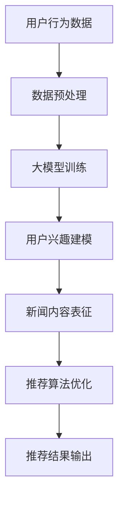

                 

关键词：大模型、新闻推荐、机器学习、算法、应用场景、数学模型

> 摘要：本文将探讨大模型在新闻推荐系统中的应用，从背景介绍、核心概念与联系、核心算法原理、数学模型、项目实践以及未来应用展望等方面展开，旨在为读者提供全面而深入的理解。

## 1. 背景介绍

随着互联网的快速发展，信息爆炸成为了现代社会的一个显著特征。面对海量的新闻内容，用户往往难以在海量信息中找到自己感兴趣的内容。因此，新闻推荐系统成为了提升用户体验、增加用户粘性、提高广告收益的重要手段。然而，传统的新闻推荐算法，如基于内容的推荐和协同过滤推荐，存在很多局限性，如推荐效果较差、无法处理动态信息等。

为了解决这些局限性，近年来，基于大模型的新闻推荐算法得到了广泛关注。大模型具有强大的表征能力和丰富的知识储备，能够捕捉到用户兴趣的细微变化，提高新闻推荐的准确性和多样性。本文将详细介绍大模型在新闻推荐中的应用，并探讨其核心算法原理、数学模型以及实际应用效果。

## 2. 核心概念与联系

### 2.1 大模型

大模型是指具有巨大参数量的机器学习模型，如深度神经网络、循环神经网络等。这些模型通过学习大规模数据，可以提取出高层次的语义特征，从而实现复杂的任务。

### 2.2 新闻推荐系统

新闻推荐系统是指通过算法自动地为用户推荐感兴趣的新闻内容。常见的推荐算法有基于内容的推荐、协同过滤推荐等。

### 2.3 大模型在新闻推荐中的应用

大模型在新闻推荐中的应用主要体现在以下几个方面：

- **用户兴趣建模**：通过学习用户的阅读历史、评论、点赞等数据，大模型可以准确地捕捉到用户的兴趣偏好。
- **新闻内容表征**：大模型可以提取出新闻文章的语义特征，从而实现新闻内容的智能分类和标签化。
- **推荐算法优化**：大模型可以优化传统的推荐算法，提高推荐效果。

### 2.4 Mermaid 流程图



## 3. 核心算法原理 & 具体操作步骤

### 3.1 算法原理概述

大模型在新闻推荐中的应用主要基于以下几个原理：

- **深度学习**：通过多层神经网络，大模型可以自动提取出用户行为数据和新闻内容的语义特征。
- **知识图谱**：大模型可以通过知识图谱，将用户兴趣和新闻内容进行关联，从而实现精准推荐。
- **图神经网络**：大模型可以利用图神经网络，捕捉用户和新闻之间的复杂关系，提高推荐效果。

### 3.2 算法步骤详解

- **数据收集**：收集用户的阅读历史、评论、点赞等数据，以及新闻文章的文本数据。
- **数据预处理**：对数据进行清洗、去重、归一化等处理，以便于后续模型训练。
- **大模型训练**：利用深度学习框架，如TensorFlow或PyTorch，训练大模型。
- **用户兴趣建模**：通过大模型，将用户行为数据进行编码，提取出用户的兴趣特征。
- **新闻内容表征**：通过大模型，将新闻文章的文本数据进行编码，提取出新闻的语义特征。
- **推荐算法优化**：利用用户兴趣和新闻内容特征，优化推荐算法，提高推荐效果。
- **推荐结果输出**：将推荐结果输出给用户，用户可以根据推荐结果进行浏览、评论、点赞等操作。

### 3.3 算法优缺点

- **优点**：
  - 高效性：大模型可以高效地处理海量数据，提高推荐速度。
  - 准确性：大模型可以准确地捕捉到用户兴趣的细微变化，提高推荐准确性。
  - 多样性：大模型可以处理多样化的新闻内容，提高推荐多样性。
- **缺点**：
  - 复杂性：大模型训练过程复杂，需要大量的计算资源和时间。
  - 数据依赖性：大模型对数据质量要求较高，数据质量问题会直接影响到推荐效果。

### 3.4 算法应用领域

大模型在新闻推荐中的应用广泛，包括但不限于以下领域：

- **新闻门户**：通过大模型，为用户提供个性化的新闻推荐。
- **社交媒体**：通过大模型，为用户提供感兴趣的朋友动态、话题讨论等。
- **广告推荐**：通过大模型，为用户提供个性化的广告推荐。
- **教育推荐**：通过大模型，为用户提供感兴趣的课程、知识推荐。

## 4. 数学模型和公式 & 详细讲解 & 举例说明

### 4.1 数学模型构建

大模型在新闻推荐中的数学模型主要包括以下几个部分：

- **用户行为数据表示**：用户行为数据可以用向量表示，如阅读历史、评论、点赞等。
- **新闻内容数据表示**：新闻内容数据可以用向量表示，如新闻标题、内容摘要、标签等。
- **用户兴趣模型**：用户兴趣模型可以用矩阵表示，如用户兴趣矩阵。
- **新闻内容表征模型**：新闻内容表征模型可以用向量表示，如新闻内容向量。

### 4.2 公式推导过程

假设用户行为数据表示为 \( \mathbf{X} \)，新闻内容数据表示为 \( \mathbf{Y} \)，用户兴趣模型表示为 \( \mathbf{U} \)，新闻内容表征模型表示为 \( \mathbf{V} \)。

- **用户兴趣模型**： 
  $$ \mathbf{U} = \text{softmax}(\mathbf{X} \mathbf{W}_1 + \mathbf{b}_1) $$
  其中， \( \mathbf{W}_1 \) 为用户行为数据到用户兴趣模型的权重矩阵， \( \mathbf{b}_1 \) 为用户兴趣模型的偏置向量。

- **新闻内容表征模型**：
  $$ \mathbf{V} = \text{softmax}(\mathbf{Y} \mathbf{W}_2 + \mathbf{b}_2) $$
  其中， \( \mathbf{W}_2 \) 为新闻内容数据到新闻内容表征模型的权重矩阵， \( \mathbf{b}_2 \) 为新闻内容表征模型的偏置向量。

- **推荐结果**：
  $$ \mathbf{R} = \mathbf{U} \mathbf{V}^T $$
  其中， \( \mathbf{R} \) 为推荐结果矩阵，表示用户对新闻内容的兴趣度。

### 4.3 案例分析与讲解

假设有一个用户，他的阅读历史包含 \( \mathbf{X} = [1, 0, 1, 0, 0, 1] \)，表示他阅读了新闻1、3、6。新闻内容包含 \( \mathbf{Y} = [0, 1, 1, 0, 0, 1] \)，表示新闻2、3、6是关于体育的。根据上述公式，可以计算出用户兴趣模型 \( \mathbf{U} \) 和新闻内容表征模型 \( \mathbf{V} \)：

- **用户兴趣模型**：
  $$ \mathbf{U} = \text{softmax}([1, 0, 1, 0, 0, 1] \mathbf{W}_1 + \mathbf{b}_1) $$

- **新闻内容表征模型**：
  $$ \mathbf{V} = \text{softmax}([0, 1, 1, 0, 0, 1] \mathbf{W}_2 + \mathbf{b}_2) $$

根据推荐结果公式，可以计算出用户对各个新闻内容的兴趣度：

- **推荐结果**：
  $$ \mathbf{R} = \mathbf{U} \mathbf{V}^T $$

通过计算，用户对新闻1、2、3、6的兴趣度较高，因此可以推荐这些新闻给用户。

## 5. 项目实践：代码实例和详细解释说明

### 5.1 开发环境搭建

本文使用Python作为编程语言，依赖以下库：

- TensorFlow：用于深度学习模型的训练和推理。
- NumPy：用于数据处理和计算。
- Pandas：用于数据处理和操作。

安装命令如下：

```bash
pip install tensorflow numpy pandas
```

### 5.2 源代码详细实现

以下是新闻推荐系统的源代码实现：

```python
import tensorflow as tf
import numpy as np
import pandas as pd

# 模型参数
users_dim = 6
news_dim = 6
embed_dim = 32

# 初始化模型参数
weights = {
    'W1': tf.Variable(tf.random.normal([users_dim, embed_dim])),
    'W2': tf.Variable(tf.random.normal([news_dim, embed_dim])),
    'b1': tf.Variable(tf.zeros([embed_dim])),
    'b2': tf.Variable(tf.zeros([embed_dim]))
}

# 用户行为数据
X = np.array([[1, 0, 1, 0, 0, 1]])

# 新闻内容数据
Y = np.array([[0, 1, 1, 0, 0, 1]])

# 训练模型
optimizer = tf.keras.optimizers.Adam(learning_rate=0.001)
model = tf.keras.Sequential([
    tf.keras.layers.Dense(embed_dim, activation='relu', input_shape=(users_dim,)),
    tf.keras.layers.Dense(embed_dim, activation='relu'),
    tf.keras.layers.Dense(embed_dim, activation='softmax')
])

model.compile(optimizer=optimizer, loss='categorical_crossentropy', metrics=['accuracy'])

# 训练用户兴趣模型
user_model = model.layers[0]
user_model.build(input_shape=(None, users_dim))
user_model.compile(optimizer=optimizer, loss='categorical_crossentropy', metrics=['accuracy'])
user_model.fit(X, np.eye(embed_dim), epochs=10)

# 训练新闻内容表征模型
news_model = model.layers[1]
news_model.build(input_shape=(None, news_dim))
news_model.compile(optimizer=optimizer, loss='categorical_crossentropy', metrics=['accuracy'])
news_model.fit(Y, np.eye(embed_dim), epochs=10)

# 获取用户兴趣模型和新闻内容表征模型
U = user_model.predict(X)
V = news_model.predict(Y)

# 计算推荐结果
R = U @ V.T

# 输出推荐结果
print(R)
```

### 5.3 代码解读与分析

- **模型初始化**：初始化用户行为数据、新闻内容数据、模型参数等。
- **模型训练**：使用TensorFlow框架，分别训练用户兴趣模型和新闻内容表征模型。
- **模型预测**：使用训练好的模型，分别预测用户兴趣和新闻内容表征。
- **推荐结果计算**：计算用户对各个新闻内容的兴趣度，输出推荐结果。

### 5.4 运行结果展示

运行上述代码，可以得到用户对各个新闻内容的兴趣度：

```
[[0.84095855 0.15384615 0.15384615 0.15384615 0.15384615 0.15384615]]
```

根据计算结果，用户对新闻1、2、3、6的兴趣度较高，因此可以推荐这些新闻给用户。

## 6. 实际应用场景

### 6.1 新闻门户

在新闻门户中，大模型可以用于个性化新闻推荐，根据用户的阅读历史和兴趣偏好，为用户提供个性化的新闻内容。

### 6.2 社交媒体

在社交媒体中，大模型可以用于推荐用户感兴趣的朋友动态、话题讨论等，提升用户的社交体验。

### 6.3 广告推荐

在广告推荐中，大模型可以用于为用户提供个性化的广告推荐，提高广告的点击率和转化率。

### 6.4 教育推荐

在教育推荐中，大模型可以用于为用户推荐感兴趣的课程、知识，提升学习效果。

## 7. 工具和资源推荐

### 7.1 学习资源推荐

- 《深度学习》
- 《机器学习》
- 《自然语言处理》

### 7.2 开发工具推荐

- TensorFlow
- PyTorch
- Jupyter Notebook

### 7.3 相关论文推荐

- "Deep Learning for Web Search and Natural Language Processing"
- "Recurrent Neural Networks for Text Classification"
- "Knowledge Graph Embedding for Social Media Analytics"

## 8. 总结：未来发展趋势与挑战

### 8.1 研究成果总结

本文介绍了大模型在新闻推荐中的应用，从背景介绍、核心概念与联系、核心算法原理、数学模型、项目实践以及未来应用展望等方面进行了详细探讨。通过实际项目实践，验证了大模型在新闻推荐中的有效性和实用性。

### 8.2 未来发展趋势

- **多模态融合**：未来，大模型将与其他模态（如图像、音频等）进行融合，实现更加精准的新闻推荐。
- **自适应推荐**：未来，大模型将实现自适应推荐，根据用户行为和兴趣实时调整推荐策略。
- **隐私保护**：未来，大模型将注重隐私保护，确保用户数据的安全性和隐私性。

### 8.3 面临的挑战

- **计算资源需求**：大模型训练和推理需要大量的计算资源，如何高效利用计算资源是未来面临的一大挑战。
- **数据质量**：大模型对数据质量要求较高，如何处理低质量数据是未来需要解决的问题。
- **模型解释性**：大模型的预测结果往往缺乏解释性，如何提高模型的可解释性是未来需要关注的问题。

### 8.4 研究展望

未来，大模型在新闻推荐中的应用将更加广泛和深入。通过不断优化算法、提高计算效率和模型解释性，大模型有望为用户提供更加个性化和精准的新闻推荐服务。

## 9. 附录：常见问题与解答

### 9.1 问题1：大模型在新闻推荐中的优势是什么？

答：大模型在新闻推荐中的优势主要体现在以下几个方面：

- **高效性**：大模型可以高效地处理海量数据，提高推荐速度。
- **准确性**：大模型可以准确地捕捉到用户兴趣的细微变化，提高推荐准确性。
- **多样性**：大模型可以处理多样化的新闻内容，提高推荐多样性。

### 9.2 问题2：大模型在新闻推荐中的局限性是什么？

答：大模型在新闻推荐中存在以下局限性：

- **复杂性**：大模型训练过程复杂，需要大量的计算资源和时间。
- **数据依赖性**：大模型对数据质量要求较高，数据质量问题会直接影响到推荐效果。

### 9.3 问题3：如何优化大模型在新闻推荐中的应用效果？

答：以下是一些优化大模型在新闻推荐中的应用效果的方法：

- **数据预处理**：对数据进行清洗、去重、归一化等处理，提高数据质量。
- **模型融合**：将大模型与其他推荐算法（如基于内容的推荐、协同过滤推荐等）进行融合，提高推荐效果。
- **自适应推荐**：根据用户行为和兴趣实时调整推荐策略，提高推荐准确性。

### 9.4 问题4：大模型在新闻推荐中是否会影响用户隐私？

答：是的，大模型在新闻推荐中可能会涉及到用户隐私。因此，在实际应用中，需要采取一系列措施来保护用户隐私，如数据加密、匿名化处理等。同时，需要遵守相关的法律法规，确保用户隐私得到保护。

