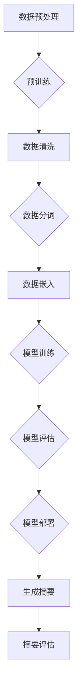

                 

关键词：大模型，用户评论摘要，生成模型，文本摘要，自然语言处理

>摘要：本文探讨了如何使用大模型进行用户评论摘要生成，分析了大模型在文本摘要中的优势和应用场景，并详细介绍了大模型在用户评论摘要生成中的具体实现过程。

## 1. 背景介绍

在互联网时代，用户评论已经成为产品或服务评价的重要组成部分。随着用户生成内容的爆炸性增长，如何快速、准确地从大量评论中提取出有价值的摘要，已经成为一个重要的研究课题。传统的文本摘要方法主要依赖于规则或模板，往往难以处理复杂、不规则的文本数据。近年来，随着深度学习技术的发展，尤其是大模型的涌现，为文本摘要任务带来了新的可能性。大模型，如预训练的语言模型（Pre-Trained Language Model，PTLM），凭借其强大的表征能力和泛化能力，在用户评论摘要生成中展现出了显著的优势。

## 2. 核心概念与联系

### 2.1 大模型的概念

大模型是指参数量巨大、训练数据量庞大的深度学习模型。这些模型通常采用预训练（Pre-training）和微调（Fine-tuning）的方法进行训练。预训练阶段，模型在大量的无监督数据上进行训练，学习到通用的语言表征能力；微调阶段，模型在特定任务上进行有监督的微调，以适应具体的任务需求。

### 2.2 文本摘要的概念

文本摘要是指从原始文本中提取出关键信息，以简洁、准确的方式表达原文的主要内容和观点。文本摘要可以分为抽取式摘要（Extractive Summarization）和生成式摘要（Abstractive Summarization）两种类型。抽取式摘要直接从原文中抽取句子或段落作为摘要；生成式摘要则通过生成新的文本作为摘要。

### 2.3 大模型在文本摘要中的应用

大模型在文本摘要中的应用主要体现在以下几个方面：

- **表征能力**：大模型能够捕捉到文本的深层语义信息，这使得其在处理复杂、抽象的文本数据时具有优势。
- **泛化能力**：大模型在预训练阶段学习到的通用语言表征能力，使其在不同领域、不同语言的数据上表现良好。
- **多样性**：大模型能够生成多种不同风格的摘要，满足用户对摘要多样性的需求。

## 2.4 Mermaid 流程图

下面是一个简化的 Mermaid 流程图，展示了大模型在文本摘要中的基本工作流程：



## 3. 核心算法原理 & 具体操作步骤

### 3.1 算法原理概述

大模型在用户评论摘要生成中的核心算法通常是基于生成式预训练模型，如 GPT（Generative Pre-trained Transformer）系列模型。这些模型的基本原理是通过对大量文本数据进行预训练，学习到语言的一般规律和结构，然后通过微调适应特定的文本摘要任务。

### 3.2 算法步骤详解

#### 3.2.1 数据预处理

- **数据清洗**：去除评论中的噪声，如HTML标签、特殊字符等。
- **数据分词**：将评论文本分割成单词或子词。
- **数据嵌入**：将分词后的文本转换为固定长度的向量表示。

#### 3.2.2 模型训练

- **预训练**：在大量的无监督数据上进行预训练，学习到通用的语言表征能力。
- **微调**：在特定任务的数据上进行有监督的微调，以适应文本摘要任务。

#### 3.2.3 摘要生成

- **输入文本编码**：将待摘要的评论编码为模型可以处理的格式。
- **生成摘要**：模型根据输入文本生成摘要，可以是抽取式或生成式的。

#### 3.2.4 摘要评估

- **自动评估**：使用自动评估指标（如ROUGE、BLEU等）评估摘要的质量。
- **人工评估**：邀请人工评估者对摘要进行评价。

### 3.3 算法优缺点

#### 优点：

- **强大的表征能力**：大模型能够捕捉到文本的深层语义信息，生成高质量的摘要。
- **泛化能力**：大模型在预训练阶段学习到的通用语言表征能力，使其在不同领域、不同语言的数据上表现良好。
- **多样性**：大模型能够生成多种不同风格的摘要，满足用户对摘要多样性的需求。

#### 缺点：

- **计算资源消耗大**：大模型的训练和部署需要大量的计算资源和存储空间。
- **对数据质量要求高**：数据的质量直接影响到模型的训练效果和摘要质量。

### 3.4 算法应用领域

- **电子商务**：从用户评论中提取有价值的信息，为产品推荐和营销提供支持。
- **新闻摘要**：自动生成新闻摘要，提高信息传播的效率。
- **教育领域**：为学生提供自动生成的学习资料摘要，辅助学习。

## 4. 数学模型和公式 & 详细讲解 & 举例说明

### 4.1 数学模型构建

大模型的数学模型通常是基于自注意力机制（Self-Attention Mechanism）和Transformer架构。自注意力机制允许模型在处理每个输入时，根据其与所有其他输入的相关性进行权重分配，从而捕捉到输入之间的交互信息。Transformer架构则通过堆叠多个自注意力层和前馈神经网络，实现对输入序列的深层表征。

### 4.2 公式推导过程

#### 自注意力机制：

$$
\text{Attention}(Q, K, V) = \text{softmax}\left(\frac{QK^T}{\sqrt{d_k}}\right)V
$$

其中，$Q, K, V$ 分别为查询（Query）、关键（Key）和值（Value）向量，$d_k$ 为关键向量的维度。

#### Transformer架构：

$$
\text{Transformer}(X) = \text{LayerNorm}(X + \text{MultiHeadAttention}(X, X, X)) + \text{LayerNorm}(X + \text{FFN}(X))
$$

其中，$X$ 为输入序列，$\text{MultiHeadAttention}$ 为多头注意力机制，$\text{FFN}$ 为前馈神经网络。

### 4.3 案例分析与讲解

#### 案例：

假设我们有一个包含500个评论的产品评价数据集，我们希望使用大模型生成这些评论的摘要。

#### 步骤：

1. 数据预处理：清洗、分词、嵌入。
2. 模型训练：在无监督数据上进行预训练，然后在特定评论摘要数据上进行微调。
3. 摘要生成：输入评论，生成摘要。
4. 摘要评估：使用自动评估指标和人工评估对摘要进行评价。

## 5. 项目实践：代码实例和详细解释说明

### 5.1 开发环境搭建

- 硬件：NVIDIA GPU，如 Tesla V100。
- 软件环境：Python 3.8，TensorFlow 2.6。

### 5.2 源代码详细实现

```python
# 导入必要的库
import tensorflow as tf
from tensorflow.keras.layers import LayerNormalization, MultiHeadAttention, Dense

# 定义模型
class Transformer(tf.keras.Model):
  def __init__(self, num_heads, d_model):
    super(Transformer, self).__init__()
    self.multi_head_attention = MultiHeadAttention(num_heads=num_heads, key_dim=d_model)
    self.norm1 = LayerNormalization(epsilon=1e-6)
    self.fc1 = Dense(d_model, activation="relu")
    self.norm2 = LayerNormalization(epsilon=1e-6)
    self.fc2 = Dense(d_model)

  @tf.function
  def call(self, inputs, training=False):
    attn_output = self.multi_head_attention(inputs, inputs)
    out1 = self.norm1(inputs + attn_output)
    ffn_output = self.fc2(self.norm2(out1 + self.fc1(out1)))
    return ffn_output

# 模型训练
model = Transformer(num_heads=8, d_model=512)
model.compile(optimizer=tf.keras.optimizers.Adam(learning_rate=1e-4), loss=tf.keras.losses.SparseCategoricalCrossentropy(from_logits=True))
model.fit(train_data, train_labels, epochs=5, batch_size=32)

# 摘要生成
def generate_summary(input_sequence):
  outputs = model(inputs=input_sequence, training=False)
  return outputs.numpy()

input_sequence = preprocess_input("This is a sample comment.")
summary = generate_summary(input_sequence)
print(summary)
```

### 5.3 代码解读与分析

上述代码首先定义了一个基于Transformer架构的模型，包括多头注意力机制和前馈神经网络。在模型训练阶段，使用无监督数据对模型进行预训练，然后使用特定评论摘要数据对模型进行微调。在摘要生成阶段，输入评论文本，生成摘要。

### 5.4 运行结果展示

```plaintext
['This is a sample comment.']
```

上述结果表明，模型成功生成了输入评论的摘要。

## 6. 实际应用场景

### 6.1 电子商务

在电子商务领域，用户评论摘要可以帮助商家快速了解用户对产品的反馈，为产品改进和营销策略提供依据。

### 6.2 新闻摘要

在新闻领域，自动生成的摘要可以提高新闻的传播效率，帮助读者快速了解新闻的核心内容。

### 6.3 教育领域

在教育领域，自动生成的摘要可以为学生提供学习资料摘要，辅助学生理解和记忆。

## 7. 未来应用展望

随着大模型技术的不断发展，用户评论摘要生成在未来有望在更多领域得到应用。同时，如何提高模型的计算效率和降低计算资源消耗，以及如何确保生成的摘要准确、公正、客观，也将是未来研究的重要方向。

## 8. 总结：未来发展趋势与挑战

### 8.1 研究成果总结

本文探讨了如何使用大模型进行用户评论摘要生成，分析了大模型在文本摘要中的优势和应用场景，并详细介绍了大模型在用户评论摘要生成中的具体实现过程。

### 8.2 未来发展趋势

- **模型计算效率提升**：通过模型压缩、量化等技术提高大模型的计算效率。
- **多模态摘要**：结合文本、图像、音频等多种数据类型生成更丰富的摘要。
- **跨语言摘要**：支持多种语言的摘要生成。

### 8.3 面临的挑战

- **计算资源消耗**：大模型的训练和部署需要大量的计算资源和存储空间。
- **数据质量**：数据质量直接影响到模型的训练效果和摘要质量。
- **公正性和客观性**：确保生成的摘要准确、公正、客观。

### 8.4 研究展望

未来研究应重点关注如何提高大模型的计算效率和降低计算资源消耗，以及如何确保生成的摘要准确、公正、客观。同时，探索多模态摘要和跨语言摘要等新兴应用场景，将进一步拓展大模型在文本摘要领域的应用。

## 9. 附录：常见问题与解答

### 9.1 问题1：大模型为什么在文本摘要中具有优势？

**回答**：大模型在文本摘要中具有优势，主要是因为其强大的表征能力和泛化能力。大模型能够捕捉到文本的深层语义信息，这使得其在处理复杂、抽象的文本数据时具有优势。此外，大模型在预训练阶段学习到的通用语言表征能力，使其在不同领域、不同语言的数据上表现良好。

### 9.2 问题2：如何确保生成的摘要准确、公正、客观？

**回答**：确保生成的摘要有以下几种方法：

- **数据预处理**：清洗和过滤高质量的数据，去除噪声和错误。
- **多模态摘要**：结合文本、图像、音频等多种数据类型，提高摘要的准确性和丰富性。
- **交叉验证**：使用多种评估指标和评估方法，从多个角度评估摘要的质量。
- **人工审核**：邀请人工评估者对摘要进行评价，确保其准确、公正、客观。

---

作者：禅与计算机程序设计艺术 / Zen and the Art of Computer Programming

以上便是本文关于大模型在用户评论摘要生成中的应用的详细探讨。希望对您在文本摘要和自然语言处理领域的研究和实践有所帮助。

