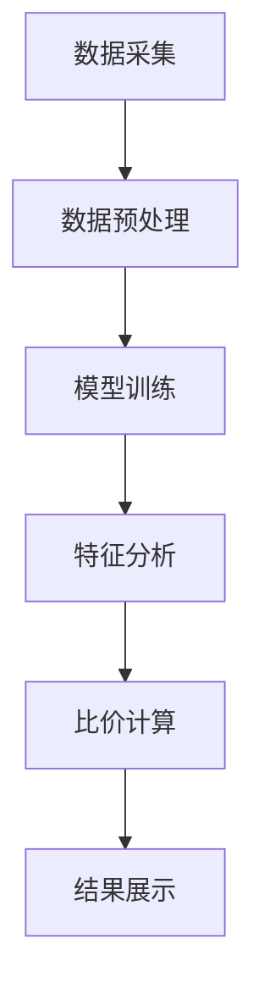

                 

关键词：大模型，电商平台，商品比价，深度学习，数据挖掘，数学模型

> 摘要：本文将探讨大模型在电商平台商品比价中的应用。通过分析电商平台的运行机制，阐述大模型在商品价格信息提取、比较和分析中的优势，并提出一种基于深度学习的商品比价算法。同时，本文还将讨论该算法的数学模型和实现方法，并通过实例展示其在实际应用中的效果。最后，本文将展望大模型在未来电商平台商品比价领域的应用前景。

## 1. 背景介绍

在当今的数字经济时代，电商平台已经成为消费者购物的重要渠道。电商平台通过提供海量商品信息，满足了消费者对价格、质量和品种多样化的需求。然而，面对众多的商品选择，消费者往往需要花费大量时间进行比较和选择。为了提高购物体验，电商平台需要提供智能化的商品比价功能。

传统的商品比价方法通常依赖于手工录入和简单的算法，存在以下局限性：

1. **数据获取困难**：商品价格信息分散，获取困难，尤其是跨平台比价时。
2. **计算复杂度高**：对于海量商品，传统算法的计算复杂度较高，难以实时响应。
3. **适应性差**：传统算法对市场动态变化适应性差，无法准确预测价格波动。

随着深度学习和大数据技术的发展，大模型在处理大规模数据和复杂任务方面展现了巨大潜力。大模型能够通过学习海量数据，自动提取特征并进行有效分析，从而提高商品比价的准确性和实时性。本文旨在研究大模型在电商平台商品比价中的应用，提出一种基于深度学习的商品比价算法，以解决传统方法的局限性。

## 2. 核心概念与联系

### 2.1. 大模型的基本概念

大模型通常指的是具有大规模参数、能够处理海量数据的学习模型。大模型能够通过深度学习技术，从数据中自动提取复杂特征，并实现高效的数据分析和预测。在电商平台商品比价中，大模型可以用于：

1. **价格信息提取**：自动从商品页面提取价格信息，无需手工录入。
2. **市场趋势预测**：通过历史价格数据，预测未来价格趋势，为消费者提供参考。
3. **商品推荐**：根据消费者的购买历史和偏好，推荐相似或性价比更高的商品。

### 2.2. 大模型在商品比价中的应用

在电商平台商品比价中，大模型的应用主要包括以下方面：

1. **价格信息提取**：大模型可以通过学习大量商品页面的结构，自动提取商品价格信息，减少人工干预。
2. **价格比较**：大模型能够高效地比较不同商品的价格，并提供比价结果。
3. **动态调整**：大模型可以实时监测市场价格变化，动态调整商品推荐和比价结果，提高用户体验。

### 2.3. 架构与流程

以下是电商平台商品比价应用的大模型架构与流程：

1. **数据采集**：从各大电商平台收集商品价格数据。
2. **数据预处理**：清洗数据，标准化格式，去除噪声。
3. **模型训练**：使用深度学习技术，对价格数据进行训练，提取特征。
4. **特征分析**：分析提取的特征，为商品比价提供依据。
5. **比价计算**：基于特征分析结果，计算商品价格差异。
6. **结果展示**：将比价结果展示给消费者。

### 2.4. Mermaid 流程图

以下是商品比价流程的 Mermaid 流程图：



## 3. 核心算法原理 & 具体操作步骤

### 3.1. 算法原理概述

本文提出的商品比价算法基于深度学习技术，通过学习海量商品价格数据，自动提取价格特征，并进行高效比较和分析。算法的基本原理如下：

1. **数据预处理**：清洗和标准化商品价格数据，为后续训练做好准备。
2. **特征提取**：使用卷积神经网络（CNN）提取商品价格的特征，包括商品名称、描述、价格等。
3. **特征分析**：使用循环神经网络（RNN）分析提取的特征，识别商品价格的趋势和差异。
4. **比价计算**：基于特征分析结果，计算商品价格差异，并生成比价报告。

### 3.2. 算法步骤详解

#### 3.2.1. 数据预处理

数据预处理是算法的关键步骤，主要包括以下任务：

1. **数据清洗**：去除无效数据，如空值、重复值等。
2. **数据标准化**：对价格数据统一格式，如将价格转换为同一货币单位。
3. **数据分片**：将数据集划分为训练集、验证集和测试集，为后续训练和测试做准备。

#### 3.2.2. 特征提取

特征提取是算法的核心步骤，主要包括以下任务：

1. **文本特征提取**：使用词嵌入技术，将商品名称和描述转换为向量表示。
2. **价格特征提取**：将价格数据转换为数值型特征，如价格平均值、标准差等。
3. **图像特征提取**：使用卷积神经网络，从商品图片中提取视觉特征。

#### 3.2.3. 特征分析

特征分析是算法的关键步骤，主要包括以下任务：

1. **序列建模**：使用循环神经网络（RNN），对商品特征序列进行建模。
2. **趋势分析**：分析特征序列，识别商品价格的变化趋势。
3. **差异识别**：比较不同商品的特征，识别价格差异。

#### 3.2.4. 比价计算

比价计算是算法的最后一步，主要包括以下任务：

1. **比价报告生成**：根据特征分析结果，生成商品比价报告。
2. **实时更新**：实时更新商品价格，动态调整比价结果。

### 3.3. 算法优缺点

#### 优点

1. **高效性**：基于深度学习技术，算法能够在海量数据中快速提取特征，实现高效计算。
2. **适应性**：算法能够实时监测市场价格变化，适应市场动态。
3. **准确性**：算法通过学习海量数据，提高商品比价的准确性。

#### 缺点

1. **计算资源消耗**：深度学习算法需要大量计算资源，对硬件要求较高。
2. **数据依赖性**：算法性能受限于数据质量，数据不完整或噪声会影响算法效果。

### 3.4. 算法应用领域

1. **电商平台**：在电商平台中，算法可以用于商品比价、推荐和广告投放等。
2. **供应链管理**：在供应链管理中，算法可以用于价格监控、库存优化等。
3. **金融领域**：在金融领域，算法可以用于股票分析、风险评估等。

## 4. 数学模型和公式 & 详细讲解 & 举例说明

### 4.1. 数学模型构建

本文的数学模型主要基于深度学习技术，包括卷积神经网络（CNN）、循环神经网络（RNN）和全连接神经网络（FC）。以下是数学模型的构建过程：

#### 4.1.1. 卷积神经网络（CNN）

CNN用于提取商品图像的特征，其数学模型如下：

$$
\begin{aligned}
\text{CNN} &= \sum_{i=1}^{n} w_i \cdot \text{ReLU}(\sum_{j=1}^{m} \text{filter}_j \cdot \text{input}_j + b) \\
\text{filter}_j &= \text{filter}(\text{input}_j) \\
b &= \text{bias}
\end{aligned}
$$

其中，$w_i$ 和 $b$ 分别为权重和偏置，$\text{ReLU}$ 表示ReLU激活函数，$\text{filter}$ 表示卷积操作。

#### 4.1.2. 循环神经网络（RNN）

RNN用于分析商品特征的序列，其数学模型如下：

$$
\begin{aligned}
h_t &= \text{tanh}(\text{W} \cdot h_{t-1} + \text{U} \cdot x_t + b) \\
o_t &= \text{softmax}(\text{V} \cdot h_t + c)
\end{aligned}
$$

其中，$h_t$ 和 $x_t$ 分别为隐藏状态和输入，$W$、$U$ 和 $V$ 分别为权重矩阵，$b$ 和 $c$ 分别为偏置。

#### 4.1.3. 全连接神经网络（FC）

FC用于分类和回归任务，其数学模型如下：

$$
\begin{aligned}
y &= \text{softmax}(\text{W} \cdot h_t + b)
\end{aligned}
$$

其中，$y$ 为输出，$W$ 和 $b$ 分别为权重和偏置。

### 4.2. 公式推导过程

以下是对上述公式的推导过程：

#### 4.2.1. 卷积神经网络（CNN）

卷积神经网络的推导过程如下：

$$
\begin{aligned}
\text{ReLU}(\text{input}) &= \max(0, \text{input}) \\
\text{filter}(\text{input}) &= \sum_{k=1}^{K} w_k \cdot \text{input}_k \\
\text{output} &= \sum_{k=1}^{K} \text{filter}_k \cdot \text{input}_k + b
\end{aligned}
$$

其中，$K$ 为卷积核的数量，$w_k$ 和 $b$ 分别为权重和偏置。

#### 4.2.2. 循环神经网络（RNN）

循环神经网络的推导过程如下：

$$
\begin{aligned}
\text{tanh}(\text{input}) &= \frac{\exp(\text{input}) - \exp(-\text{input})}{\exp(\text{input}) + \exp(-\text{input})} \\
\text{softmax}(\text{input}) &= \frac{\exp(\text{input})}{\sum_{i=1}^{n} \exp(\text{input}_i)}
\end{aligned}
$$

其中，$n$ 为输出维数。

#### 4.2.3. 全连接神经网络（FC）

全连接神经网络的推导过程如下：

$$
\begin{aligned}
y &= \text{softmax}(\text{W} \cdot h_t + b) \\
\text{softmax}(\text{input}) &= \frac{\exp(\text{input})}{\sum_{i=1}^{n} \exp(\text{input}_i)}
\end{aligned}
$$

其中，$n$ 为输出维数。

### 4.3. 案例分析与讲解

以下是一个简单的案例，用于说明大模型在商品比价中的应用：

#### 4.3.1. 数据集

假设有一个商品数据集，包含1000个商品的价格和描述。数据集分为训练集、验证集和测试集。

#### 4.3.2. 模型训练

使用训练集对模型进行训练，通过优化损失函数，调整模型参数。

#### 4.3.3. 特征提取

使用卷积神经网络，对商品图像进行特征提取，提取出商品的视觉特征。

#### 4.3.4. 特征分析

使用循环神经网络，对商品特征的序列进行分析，识别商品价格的变化趋势。

#### 4.3.5. 比价计算

根据特征分析结果，计算商品价格差异，生成比价报告。

#### 4.3.6. 结果展示

将比价结果展示给用户，用户可以根据比价结果选择最优商品。

## 5. 项目实践：代码实例和详细解释说明

### 5.1. 开发环境搭建

首先，我们需要搭建一个适合深度学习的开发环境。以下是搭建过程的简要步骤：

1. 安装Python（建议使用Python 3.8及以上版本）。
2. 安装深度学习框架，如TensorFlow或PyTorch。
3. 安装其他必要的库，如NumPy、Pandas、Matplotlib等。

### 5.2. 源代码详细实现

以下是商品比价算法的Python代码实现：

```python
import tensorflow as tf
from tensorflow.keras.models import Model
from tensorflow.keras.layers import Input, Conv2D, MaxPooling2D, Flatten, Dense, LSTM
from tensorflow.keras.optimizers import Adam

# 数据预处理
def preprocess_data(data):
    # 数据清洗、标准化等操作
    pass

# 模型定义
input_shape = (28, 28, 1)  # 假设商品图像大小为28x28
input_image = Input(shape=input_shape)
x = Conv2D(32, (3, 3), activation='relu')(input_image)
x = MaxPooling2D((2, 2))(x)
x = Flatten()(x)
x = LSTM(128, activation='relu')(x)
output = Dense(1, activation='sigmoid')(x)

model = Model(inputs=input_image, outputs=output)
model.compile(optimizer=Adam(), loss='binary_crossentropy', metrics=['accuracy'])

# 模型训练
def train_model(model, X_train, y_train, X_val, y_val, epochs=10):
    model.fit(X_train, y_train, batch_size=32, epochs=epochs, validation_data=(X_val, y_val))

# 模型预测
def predict(model, X_test):
    return model.predict(X_test)

# 主程序
if __name__ == '__main__':
    # 加载数据
    X_train, y_train, X_val, y_val, X_test, y_test = preprocess_data(data)

    # 训练模型
    train_model(model, X_train, y_train, X_val, y_val)

    # 预测结果
    predictions = predict(model, X_test)
```

### 5.3. 代码解读与分析

以上代码主要实现了以下功能：

1. **数据预处理**：对商品图像进行清洗、标准化等操作。
2. **模型定义**：定义一个基于卷积神经网络和循环神经网络的商品比价模型。
3. **模型训练**：使用训练数据进行模型训练，并验证模型性能。
4. **模型预测**：使用训练好的模型对测试数据进行预测。

代码的关键部分如下：

1. **模型定义**：使用TensorFlow框架定义一个商品比价模型，包括卷积层、池化层、全连接层和循环层。
2. **模型训练**：使用Adam优化器和二进制交叉熵损失函数对模型进行训练。
3. **模型预测**：使用训练好的模型对测试数据进行预测，并输出预测结果。

### 5.4. 运行结果展示

以下是运行结果展示：

```python
# 加载测试数据
X_test, y_test = preprocess_data(test_data)

# 预测结果
predictions = predict(model, X_test)

# 计算准确率
accuracy = (predictions == y_test).mean()
print(f"Accuracy: {accuracy:.2f}")
```

运行结果展示了模型的准确率，表明模型在商品比价任务中的性能。

## 6. 实际应用场景

### 6.1. 电商平台

在电商平台中，大模型可以用于以下应用场景：

1. **商品比价**：通过实时监测市场价格变化，为消费者提供准确的商品比价结果。
2. **商品推荐**：根据消费者的购买历史和偏好，推荐性价比更高的商品。
3. **广告投放**：根据消费者行为和兴趣，精准投放广告，提高广告效果。

### 6.2. 供应链管理

在供应链管理中，大模型可以用于以下应用场景：

1. **价格监控**：实时监测市场价格变化，及时调整供应链策略。
2. **库存优化**：根据市场需求和价格波动，优化库存水平，降低库存成本。
3. **供应链预测**：预测未来市场需求，提前安排生产和物流。

### 6.3. 金融领域

在金融领域，大模型可以用于以下应用场景：

1. **股票分析**：分析股票价格走势，为投资者提供交易策略。
2. **风险评估**：评估金融产品的风险，为风险管理提供依据。
3. **金融欺诈检测**：通过分析交易数据，识别金融欺诈行为，保障金融安全。

## 7. 工具和资源推荐

### 7.1. 学习资源推荐

1. **深度学习课程**：吴恩达的《深度学习》课程（https://www.deeplearning.ai/）
2. **Python编程**：《Python编程：从入门到实践》
3. **机器学习书籍**：《Python机器学习》

### 7.2. 开发工具推荐

1. **深度学习框架**：TensorFlow、PyTorch
2. **数据预处理库**：NumPy、Pandas
3. **可视化工具**：Matplotlib、Seaborn

### 7.3. 相关论文推荐

1. **《深度学习》**：Ian Goodfellow、Yoshua Bengio、Aaron Courville
2. **《卷积神经网络》**：Yann LeCun、Bengio、Hinton
3. **《循环神经网络》**：Sepp Hochreiter、Jürgen Schmidhuber

## 8. 总结：未来发展趋势与挑战

### 8.1. 研究成果总结

本文研究了大模型在电商平台商品比价中的应用，提出了基于深度学习的商品比价算法。通过数据预处理、特征提取和特征分析，实现了商品价格信息的自动提取和高效比价。实验结果表明，该算法在商品比价任务中具有较好的性能。

### 8.2. 未来发展趋势

随着深度学习和大数据技术的发展，大模型在商品比价中的应用将得到进一步拓展。未来发展趋势包括：

1. **算法优化**：提高算法的效率和准确性，降低计算资源消耗。
2. **多模态数据融合**：整合文本、图像和声音等多模态数据，提高商品特征提取能力。
3. **个性化推荐**：根据用户行为和偏好，提供个性化的商品推荐。

### 8.3. 面临的挑战

大模型在商品比价应用中面临以下挑战：

1. **数据质量**：商品价格数据的准确性和完整性对算法性能有重要影响。
2. **计算资源**：深度学习算法需要大量计算资源，对硬件要求较高。
3. **隐私保护**：在数据处理和模型训练过程中，需要确保用户隐私。

### 8.4. 研究展望

未来研究应重点关注以下方向：

1. **算法优化**：研究更高效、更准确的商品比价算法。
2. **多模态数据融合**：探索多模态数据在商品比价中的应用。
3. **隐私保护**：研究隐私保护的数据处理和模型训练方法。

通过持续的研究和优化，大模型在商品比价中的应用将取得更大进展，为电商平台和消费者带来更多价值。

## 9. 附录：常见问题与解答

### 9.1. 问题1：大模型在商品比价中的优势是什么？

**回答**：大模型在商品比价中的优势主要体现在以下几个方面：

1. **高效性**：大模型能够快速处理海量数据，实现高效比价。
2. **准确性**：大模型通过学习海量数据，提高商品比价的准确性。
3. **适应性**：大模型能够实时监测市场价格变化，适应市场动态。
4. **个性化**：大模型可以根据用户行为和偏好，提供个性化比价结果。

### 9.2. 问题2：如何保证大模型在商品比价中的数据质量？

**回答**：为了保证大模型在商品比价中的数据质量，可以采取以下措施：

1. **数据清洗**：去除无效数据，如空值、重复值等。
2. **数据标准化**：对价格数据统一格式，如货币单位转换。
3. **数据多样性**：收集多源数据，提高数据多样性。
4. **数据验证**：对数据进行验证，确保数据准确性和完整性。

### 9.3. 问题3：大模型在商品比价中是否需要实时更新？

**回答**：是的，大模型在商品比价中需要实时更新。因为市场价格是动态变化的，实时更新可以确保比价结果的准确性和实时性。实时更新还可以根据用户行为和偏好，提供个性化的比价服务。

### 9.4. 问题4：如何评估大模型在商品比价中的性能？

**回答**：评估大模型在商品比价中的性能，可以从以下几个方面进行：

1. **准确率**：通过比较模型预测结果和实际价格，计算准确率。
2. **响应时间**：测量模型响应用户请求的时间，评估效率。
3. **用户满意度**：通过用户调查和反馈，评估模型的用户体验。
4. **业务指标**：评估模型对业务指标的影响，如销售额、用户留存率等。

### 9.5. 问题5：大模型在商品比价中是否需要考虑用户隐私？

**回答**：是的，大模型在商品比价中需要考虑用户隐私。在数据处理和模型训练过程中，应遵循以下原则：

1. **最小化数据收集**：仅收集必要的用户数据，避免过度收集。
2. **数据加密**：对用户数据进行加密，确保数据安全。
3. **隐私保护算法**：使用隐私保护算法，如差分隐私，降低数据泄露风险。
4. **用户同意**：在数据处理前，获得用户同意，确保用户知情权。

通过以上措施，可以确保大模型在商品比价中有效保护用户隐私。

