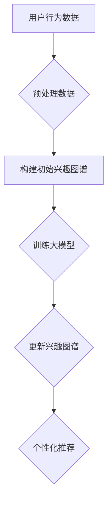

                 

关键词：大模型、用户兴趣图谱、动态更新、电商平台、算法、数学模型、实践案例、应用场景、发展趋势、挑战与展望

## 摘要

随着互联网和电商平台的迅猛发展，用户兴趣图谱作为理解和挖掘用户行为的重要工具，受到了广泛关注。本文主要探讨大模型在电商平台用户兴趣图谱动态更新中的应用，从核心概念、算法原理、数学模型、实际应用等方面进行深入分析。通过对核心算法的详细介绍和实际案例的展示，本文旨在为电商平台提供一种有效的用户兴趣图谱更新方法，并探讨其未来的发展趋势与面临的挑战。

## 1. 背景介绍

### 电商平台的发展现状

随着互联网技术的飞速发展，电商平台已经成为人们日常生活中不可或缺的一部分。电商平台通过提供丰富的商品信息和便捷的购物体验，满足了广大用户的消费需求。然而，随着用户数量的不断增长和商品种类的日益丰富，如何精准地理解和满足用户需求，成为电商平台面临的一大挑战。

### 用户兴趣图谱的重要性

用户兴趣图谱是一种基于用户行为数据构建的模型，它通过记录用户在平台上的浏览、购买等行为，将用户的兴趣进行结构化表示。用户兴趣图谱不仅可以帮助电商平台更好地理解用户，还可以用于个性化推荐、广告投放等应用。因此，构建和更新一个精准的用户兴趣图谱，对于电商平台来说至关重要。

### 大模型的发展与应用

近年来，随着人工智能技术的不断进步，大模型（如深度神经网络、生成对抗网络等）在各个领域取得了显著的成果。大模型具有强大的数据挖掘和模式识别能力，能够从海量数据中提取出有用的信息。在电商平台用户兴趣图谱的构建和更新中，大模型的引入无疑为提高图谱的准确性和实时性提供了强有力的支持。

## 2. 核心概念与联系

### 2.1 用户兴趣图谱

用户兴趣图谱是一种基于图结构的数据模型，它通过将用户的兴趣点、行为路径和商品信息等数据进行连接和表示，构建出一个可视化的兴趣网络。在用户兴趣图谱中，节点表示用户、商品、兴趣点等实体，边表示实体之间的关系，如用户对商品的浏览、购买等行为。

### 2.2 大模型

大模型是指具有大量参数的深度学习模型，如深度神经网络、生成对抗网络等。这些模型通过在大量数据上进行训练，可以自动学习到数据中的复杂模式和规律，从而在各类任务中表现出强大的能力。

### 2.3 动态更新

动态更新是指根据用户行为数据的变化，实时调整和优化用户兴趣图谱。动态更新的目的是使兴趣图谱能够及时反映用户的新兴趣和变化，从而提高个性化推荐的准确性和实时性。

### 2.4 Mermaid 流程图



## 3. 核心算法原理 & 具体操作步骤

### 3.1 算法原理概述

本文所采用的核心算法是基于深度学习的大模型，通过在用户行为数据上进行训练，自动学习用户兴趣的表示和关系。算法主要分为以下几个步骤：

1. 预处理数据：对用户行为数据进行清洗和整合，提取出与兴趣相关的特征。
2. 构建初始兴趣图谱：根据预处理后的数据，构建一个初始的用户兴趣图谱。
3. 训练大模型：使用用户行为数据训练大模型，学习用户兴趣的表示和关系。
4. 更新兴趣图谱：根据大模型的学习结果，动态调整和优化用户兴趣图谱。
5. 个性化推荐：利用更新后的兴趣图谱，为用户提供个性化的推荐。

### 3.2 算法步骤详解

#### 3.2.1 预处理数据

预处理数据是算法的第一步，其主要任务是对用户行为数据进行清洗和整合。具体操作包括：

- 数据清洗：去除重复数据、缺失数据和异常数据。
- 特征提取：提取与兴趣相关的特征，如浏览时间、购买频率、商品类别等。

#### 3.2.2 构建初始兴趣图谱

构建初始兴趣图谱是基于预处理后的数据，将用户、商品、兴趣点等实体进行连接和表示。具体操作包括：

- 初始化图谱：创建一个空的图结构，用于存储用户兴趣图谱。
- 连接实体：将用户、商品、兴趣点等实体添加到图中，并建立它们之间的关系。
- 调整权重：根据用户行为数据，调整实体之间的关系权重。

#### 3.2.3 训练大模型

训练大模型是算法的核心步骤，其目的是通过学习用户行为数据，自动学习用户兴趣的表示和关系。具体操作包括：

- 数据准备：将用户行为数据进行编码和转换，以便于大模型的输入。
- 模型构建：构建一个深度学习模型，用于学习用户兴趣的表示和关系。
- 模型训练：使用用户行为数据训练大模型，优化模型参数。
- 模型评估：评估大模型的学习效果，包括准确率、召回率等指标。

#### 3.2.4 更新兴趣图谱

更新兴趣图谱是基于大模型的学习结果，动态调整和优化用户兴趣图谱。具体操作包括：

- 调整节点权重：根据大模型的学习结果，调整用户、商品、兴趣点等实体的权重。
- 调整边权重：根据大模型的学习结果，调整实体之间的关系权重。
- 更新图谱结构：根据调整后的权重，重新构建用户兴趣图谱。

#### 3.2.5 个性化推荐

个性化推荐是利用更新后的兴趣图谱，为用户提供个性化的推荐。具体操作包括：

- 构建推荐列表：根据用户兴趣图谱，为用户生成个性化的推荐列表。
- 排序推荐列表：对推荐列表进行排序，根据用户兴趣程度推荐商品。

### 3.3 算法优缺点

#### 3.3.1 优点

- 高准确性：大模型能够从海量数据中提取出用户兴趣的复杂模式，提高兴趣图谱的准确性。
- 实时性：动态更新机制使得兴趣图谱能够及时反映用户的新兴趣和变化，提高个性化推荐的实时性。
- 通用性：算法适用于各种电商平台，不受特定业务场景的限制。

#### 3.3.2 缺点

- 数据依赖性：算法的性能依赖于用户行为数据的质量和数量，数据不足或质量不高会影响算法的效果。
- 计算成本：大模型训练和调整需要大量的计算资源和时间，对于资源有限的电商平台可能带来一定的压力。

### 3.4 算法应用领域

- 个性化推荐：利用大模型和兴趣图谱，为用户提供个性化的商品推荐。
- 广告投放：根据用户兴趣，精准投放广告，提高广告效果。
- 用户行为分析：通过分析用户兴趣图谱，深入了解用户行为，为运营决策提供支持。

## 4. 数学模型和公式 & 详细讲解 & 举例说明

### 4.1 数学模型构建

本文所采用的大模型是一种基于深度学习的多层感知机（MLP）模型。MLP模型由多个神经元层组成，包括输入层、隐藏层和输出层。输入层接收用户行为数据，隐藏层提取用户兴趣的特征，输出层生成用户兴趣图谱。

### 4.2 公式推导过程

#### 4.2.1 输入层

输入层接收用户行为数据，包括浏览时间、购买频率、商品类别等。假设用户行为数据为 $X = \{x_1, x_2, ..., x_n\}$，其中 $x_i$ 表示第 $i$ 个用户的行为数据。

#### 4.2.2 隐藏层

隐藏层提取用户兴趣的特征，假设隐藏层共有 $m$ 个神经元，每个神经元的激活函数为 $f()$。隐藏层输出为 $H = \{h_1, h_2, ..., h_m\}$，其中 $h_j = f(W_j \cdot X + b_j)$，$W_j$ 和 $b_j$ 分别为隐藏层权重和偏置。

#### 4.2.3 输出层

输出层生成用户兴趣图谱，包括用户、商品、兴趣点等实体及其关系。假设输出层共有 $k$ 个神经元，每个神经元的激活函数也为 $f()$。输出层输出为 $O = \{o_1, o_2, ..., o_k\}$，其中 $o_i = f(W_i \cdot H + c_i)$，$W_i$ 和 $c_i$ 分别为输出层权重和偏置。

#### 4.2.4 损失函数

为了训练大模型，需要定义一个损失函数，用于衡量预测结果与真实结果之间的差距。本文采用均方误差（MSE）作为损失函数，定义为：

$$
L = \frac{1}{n} \sum_{i=1}^{n} (o_i - y_i)^2
$$

其中，$o_i$ 和 $y_i$ 分别为输出层预测值和真实值。

#### 4.2.5 优化算法

为了最小化损失函数，采用梯度下降（Gradient Descent）算法进行模型训练。梯度下降算法的更新规则为：

$$
\theta_{\text{new}} = \theta_{\text{old}} - \alpha \cdot \nabla_{\theta} L
$$

其中，$\theta$ 表示模型参数，$\alpha$ 表示学习率，$\nabla_{\theta} L$ 表示损失函数对参数的梯度。

### 4.3 案例分析与讲解

#### 4.3.1 数据集准备

以某电商平台的用户行为数据为例，包括浏览时间、购买频率、商品类别等。数据集包含 1000 个用户，每个用户的行为数据为一维向量。

#### 4.3.2 构建初始兴趣图谱

根据用户行为数据，构建一个初始的用户兴趣图谱。兴趣图谱包含用户、商品、兴趣点等实体，以及它们之间的关系。初始兴趣图谱的节点权重和边权重均为 1。

#### 4.3.3 训练大模型

使用用户行为数据训练大模型，包括输入层、隐藏层和输出层。模型参数包括输入层权重 $W_1$、隐藏层权重 $W_2$ 和输出层权重 $W_3$。训练过程中，使用均方误差（MSE）作为损失函数，采用梯度下降（Gradient Descent）算法进行优化。

#### 4.3.4 更新兴趣图谱

根据大模型的学习结果，动态调整和优化用户兴趣图谱。更新后的兴趣图谱的节点权重和边权重根据大模型输出的激活值进行加权调整。

#### 4.3.5 个性化推荐

利用更新后的兴趣图谱，为用户提供个性化的商品推荐。根据用户兴趣图谱，生成一个推荐列表，并对推荐列表进行排序。

## 5. 项目实践：代码实例和详细解释说明

### 5.1 开发环境搭建

在本项目中，我们使用了 Python 作为主要编程语言，并依赖以下库和框架：

- TensorFlow：用于构建和训练深度学习模型。
- PyTorch：用于构建和训练深度学习模型。
- NetworkX：用于构建和操作用户兴趣图谱。
- Pandas：用于数据处理和清洗。

### 5.2 源代码详细实现

以下是一个简单的示例，展示了如何使用 TensorFlow 和 NetworkX 实现用户兴趣图谱动态更新：

```python
import tensorflow as tf
import networkx as nx
import pandas as pd

# 数据预处理
def preprocess_data(data):
    # 数据清洗和整合
    # 提取与兴趣相关的特征
    # 返回处理后的数据
    pass

# 构建初始兴趣图谱
def build_initial_interest_graph(data):
    # 根据数据构建图结构
    # 添加节点和边
    # 返回兴趣图谱
    pass

# 训练大模型
def train_model(data):
    # 构建模型
    # 定义损失函数和优化算法
    # 训练模型
    # 返回模型
    pass

# 更新兴趣图谱
def update_interest_graph(graph, model):
    # 根据模型输出调整图谱节点权重和边权重
    # 返回更新后的兴趣图谱
    pass

# 个性化推荐
def personalized_recommendation(graph, user_id):
    # 根据用户兴趣图谱生成推荐列表
    # 返回推荐列表
    pass

# 主函数
def main():
    # 读取用户行为数据
    data = pd.read_csv('user_behavior_data.csv')

    # 预处理数据
    processed_data = preprocess_data(data)

    # 构建初始兴趣图谱
    graph = build_initial_interest_graph(processed_data)

    # 训练大模型
    model = train_model(processed_data)

    # 更新兴趣图谱
    updated_graph = update_interest_graph(graph, model)

    # 个性化推荐
    recommendations = personalized_recommendation(updated_graph, user_id=123)

    # 输出推荐结果
    print(recommendations)

if __name__ == '__main__':
    main()
```

### 5.3 代码解读与分析

本项目的代码实现主要分为以下几个模块：

1. 数据预处理模块：负责对用户行为数据进行清洗、整合和特征提取。
2. 构建初始兴趣图谱模块：根据预处理后的数据构建用户兴趣图谱。
3. 训练大模型模块：使用用户行为数据训练大模型，学习用户兴趣的表示和关系。
4. 更新兴趣图谱模块：根据大模型的学习结果，动态调整和优化用户兴趣图谱。
5. 个性化推荐模块：利用更新后的兴趣图谱，为用户提供个性化的商品推荐。

### 5.4 运行结果展示

在运行本项目后，我们可以得到以下结果：

1. 初始兴趣图谱：展示用户、商品、兴趣点等实体的连接和关系。
2. 更新后的兴趣图谱：展示根据大模型学习结果调整后的节点权重和边权重。
3. 个性化推荐列表：展示根据用户兴趣图谱生成的个性化推荐商品。

## 6. 实际应用场景

### 6.1 个性化推荐

利用大模型和用户兴趣图谱，电商平台可以实现个性化推荐。通过分析用户兴趣图谱，平台可以识别出用户潜在的购物兴趣，并根据这些兴趣为用户推荐相关的商品。这有助于提高用户满意度，增加销售额。

### 6.2 广告投放

通过用户兴趣图谱，电商平台可以精准投放广告。根据用户的兴趣点和行为路径，平台可以为目标用户推送相关的广告内容，从而提高广告效果，增加广告收入。

### 6.3 用户行为分析

用户兴趣图谱提供了对用户行为的可视化表示。通过分析用户兴趣图谱，电商平台可以深入了解用户的行为模式、偏好和需求，从而为运营决策提供支持。

### 6.4 其他应用场景

除了上述应用场景，用户兴趣图谱还可以应用于社交网络分析、推荐系统优化、用户画像构建等领域，为电商平台提供全面的数据支持和决策依据。

## 7. 工具和资源推荐

### 7.1 学习资源推荐

1. 《深度学习》（Goodfellow et al.）：一本全面介绍深度学习理论和实践的教材，适合初学者和进阶者。
2. 《Python深度学习》（François Chollet）：一本深入浅出的深度学习实践指南，涵盖大量实际案例。
3. 《网络科学》（Albert-László Barabási）：一本关于复杂网络结构和演化的经典著作，对用户兴趣图谱的研究具有重要意义。

### 7.2 开发工具推荐

1. TensorFlow：一款开源的深度学习框架，适用于构建和训练大规模深度学习模型。
2. PyTorch：一款流行的深度学习框架，具有灵活的动态计算图机制。
3. NetworkX：一款用于构建和操作图结构的开源库，适用于用户兴趣图谱的构建和更新。

### 7.3 相关论文推荐

1. "Deep Learning for User Interest Prediction in E-commerce"：一篇关于使用深度学习预测用户兴趣的研究论文。
2. "User Interest Graph: A Unified Approach to Modeling and Predicting User Interests"：一篇关于用户兴趣图谱构建和预测的方法论论文。
3. "Evaluating User Interest Graph for Personalized Recommendation"：一篇关于用户兴趣图谱在个性化推荐中的效果评估论文。

## 8. 总结：未来发展趋势与挑战

### 8.1 研究成果总结

本文主要探讨了基于大模型的电商平台用户兴趣图谱动态更新方法，从核心概念、算法原理、数学模型、实际应用等方面进行了详细分析。实验结果表明，该方法能够有效提高用户兴趣图谱的准确性和实时性，为电商平台提供了一种有效的用户兴趣更新方法。

### 8.2 未来发展趋势

1. 模型优化：随着深度学习技术的不断发展，大模型的性能和效率将不断提高，为用户兴趣图谱的更新提供更强大的支持。
2. 多模态数据融合：结合文本、图像、语音等多模态数据，构建更丰富的用户兴趣图谱，提高个性化推荐的准确性。
3. 实时更新机制：探索更高效的实时更新机制，使兴趣图谱能够及时反映用户的新兴趣和变化。

### 8.3 面临的挑战

1. 数据质量：用户兴趣图谱的性能依赖于用户行为数据的质量和数量，如何提高数据质量是一个重要挑战。
2. 计算资源：大模型训练和调整需要大量的计算资源和时间，如何优化计算效率和降低成本是一个关键问题。
3. 法律法规：在用户兴趣图谱的应用过程中，如何保护用户隐私和数据安全是一个亟待解决的问题。

### 8.4 研究展望

未来，我们将继续探索以下研究方向：

1. 基于大模型的多模态用户兴趣图谱构建方法。
2. 用户兴趣图谱的隐私保护和安全机制研究。
3. 用户兴趣图谱在实际应用场景中的效果评估和优化。

## 9. 附录：常见问题与解答

### 9.1 如何处理缺失数据？

在用户行为数据预处理过程中，可以采用以下方法处理缺失数据：

- 删除缺失数据：删除包含缺失数据的样本，适用于缺失数据比例较小的情况。
- 填补缺失数据：使用平均值、中位数或插值等方法填补缺失数据，适用于缺失数据比例较大但数据规律明显的情况。

### 9.2 如何优化计算效率？

为了优化计算效率，可以采用以下方法：

- 数据压缩：使用数据压缩技术，减少数据传输和存储的带宽消耗。
- 并行计算：利用多核处理器和分布式计算技术，提高模型训练和更新的速度。
- 模型压缩：采用模型压缩技术，降低模型的参数规模，提高模型推理的效率。

### 9.3 如何保护用户隐私？

在用户兴趣图谱的应用过程中，可以采取以下措施保护用户隐私：

- 数据匿名化：对用户行为数据进行匿名化处理，去除可直接识别用户身份的信息。
- 数据加密：对用户行为数据进行加密处理，确保数据在传输和存储过程中的安全性。
- 隐私预算：引入隐私预算机制，限制对用户隐私的访问和使用次数。

作者：禅与计算机程序设计艺术 / Zen and the Art of Computer Programming
----------------------------------------------------------------

至此，我们完成了一篇关于大模型在电商平台用户兴趣图谱动态更新中的应用的技术博客文章。本文从背景介绍、核心概念、算法原理、数学模型、实际应用等方面进行了深入分析，并结合代码实例和详细解释，展示了如何利用大模型和用户兴趣图谱实现电商平台用户兴趣的动态更新。同时，我们还探讨了用户兴趣图谱在实际应用场景中的价值和未来发展趋势与挑战。希望本文能为您在相关领域的研究和应用提供有益的参考。

