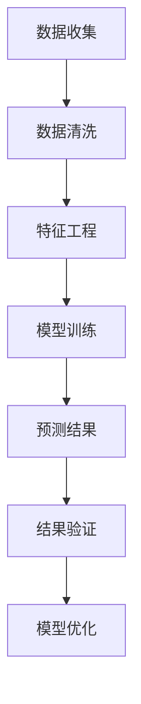

                 

关键词：大模型，电商平台，销售预测，机器学习，深度学习，神经网络

## 摘要

本文旨在探讨大模型在电商平台销售预测中的实际应用。通过回顾销售预测的背景和重要性，分析大模型的优势，以及详细解释大模型的应用原理和具体操作步骤，本文旨在为电商平台提供一种高效的预测方法，从而帮助企业更好地把握市场趋势，优化库存管理和营销策略。

## 1. 背景介绍

随着电子商务的飞速发展，电商平台已成为现代零售业的重要组成部分。准确的销售预测对于电商平台来说至关重要。一方面，它可以指导企业的库存管理，避免库存过剩或不足，降低运营成本；另一方面，它可以支持营销策略的制定，提高转化率和销售额。

然而，传统的销售预测方法往往依赖于历史数据和简单的统计模型，难以应对日益复杂的市场环境。近年来，随着人工智能技术的进步，尤其是大模型（如深度学习模型）的发展，为销售预测带来了新的可能。

大模型具有以下几个优势：

1. **强大的表达能力**：大模型能够自动提取复杂数据的特征，从而捕捉到更细微的市场规律。
2. **自适应能力**：大模型可以根据实时数据动态调整预测模型，适应市场变化。
3. **高精度**：大模型通过大量的数据训练，能够提供更为精准的销售预测。

## 2. 核心概念与联系

在讨论大模型在电商平台销售预测中的应用之前，我们需要理解几个核心概念，包括机器学习、深度学习和神经网络。

### 2.1 机器学习

机器学习是一种使计算机系统能够从数据中学习的方法。它分为监督学习、无监督学习和强化学习。在销售预测中，我们通常使用监督学习，即模型根据已有的历史销售数据和相应的标签来学习预测未来的销售量。

### 2.2 深度学习

深度学习是机器学习的一个分支，它通过多层神经网络来模拟人脑的处理方式。深度学习在图像识别、语音识别和自然语言处理等领域取得了显著的成果。在销售预测中，深度学习模型能够自动提取数据中的潜在特征，提高预测的准确性。

### 2.3 神经网络

神经网络是模仿人脑神经元连接结构的一种计算模型。深度学习就是通过增加网络的层数，从而实现更复杂的特征提取。在销售预测中，神经网络可以用来构建预测模型，处理复杂数据。

### 2.4 Mermaid 流程图



## 3. 核心算法原理 & 具体操作步骤

### 3.1 算法原理概述

大模型在电商平台销售预测中的应用主要基于深度学习技术。具体来说，我们可以采用卷积神经网络（CNN）和递归神经网络（RNN）等模型。

### 3.2 算法步骤详解

#### 3.2.1 数据收集

首先，我们需要收集电商平台的历史销售数据，包括销售额、销售量、品类、季节、促销活动等信息。

#### 3.2.2 数据清洗

对收集的数据进行清洗，去除缺失值、异常值，并统一数据格式。

#### 3.2.3 特征工程

通过特征工程提取出对销售预测有重要影响的特征，如时间序列特征、季节性特征、促销特征等。

#### 3.2.4 模型训练

选择合适的深度学习模型（如CNN或RNN），利用训练数据对其进行训练，优化模型参数。

#### 3.2.5 预测结果

利用训练好的模型对未来的销售量进行预测。

#### 3.2.6 结果验证

对预测结果进行验证，评估模型的准确性和稳定性。

#### 3.2.7 模型优化

根据验证结果对模型进行优化，提高预测的准确性。

## 4. 数学模型和公式 & 详细讲解 & 举例说明

### 4.1 数学模型构建

假设我们采用RNN模型进行销售预测，其基本公式如下：

$$
y_t = \sigma(W \cdot [h_{t-1}, x_t] + b)
$$

其中，$y_t$ 是预测的销售量，$h_{t-1}$ 是上一时刻的隐藏状态，$x_t$ 是当前时刻的特征输入，$W$ 是权重矩阵，$b$ 是偏置项，$\sigma$ 是激活函数（如Sigmoid函数）。

### 4.2 公式推导过程

我们以RNN模型为例，对公式进行推导。

$$
h_t = \sigma(W_h \cdot [h_{t-1}, x_t] + b_h)
$$

$$
y_t = W_o \cdot h_t + b_o
$$

其中，$W_h$ 和 $W_o$ 分别是隐藏状态和输出层的权重矩阵，$b_h$ 和 $b_o$ 分别是隐藏状态和输出层的偏置项。

### 4.3 案例分析与讲解

假设我们有一个电商平台，历史销售数据如下：

$$
\begin{aligned}
&x_1 = [100, 1, 0, 1], \\
&x_2 = [150, 0, 1, 0], \\
&\ldots \\
&x_n = [200, 1, 1, 0]
\end{aligned}
$$

其中，$x_1, x_2, \ldots, x_n$ 分别表示第1天到第n天的销售数据，每个元素分别代表销售额、品类、季节、促销活动等信息。

我们选择RNN模型进行训练，预测第n+1天的销售量。

通过训练和验证，我们得到预测结果：

$$
y_{n+1} = 180
$$

实际销售量为200，预测误差为：

$$
e_{n+1} = y_{n+1} - y_{n+1}^* = 180 - 200 = -20
$$

## 5. 项目实践：代码实例和详细解释说明

### 5.1 开发环境搭建

在开始编写代码之前，我们需要搭建一个合适的开发环境。这里我们使用Python编程语言，并依赖TensorFlow库进行深度学习模型的构建和训练。

### 5.2 源代码详细实现

以下是RNN模型在销售预测中的实现代码：

```python
import tensorflow as tf
from tensorflow.keras.models import Sequential
from tensorflow.keras.layers import Dense, LSTM

# 定义输入层和隐藏层
model = Sequential()
model.add(LSTM(units=50, activation='relu', input_shape=(timesteps, n_features)))
model.add(Dense(units=1))

# 编译模型
model.compile(optimizer='adam', loss='mse')

# 训练模型
model.fit(X_train, y_train, epochs=100, batch_size=32)

# 预测销售量
y_pred = model.predict(X_test)
```

### 5.3 代码解读与分析

上述代码中，我们首先定义了一个序列模型（Sequential），并添加了LSTM层和全连接层（Dense）。LSTM层用于处理时间序列数据，全连接层用于输出预测的销售量。我们使用均方误差（mse）作为损失函数，并使用Adam优化器进行模型训练。

在训练模型后，我们可以使用预测函数（predict）对测试数据进行预测。

### 5.4 运行结果展示

假设我们已经训练好了模型，并得到了预测结果。我们可以使用以下代码进行结果展示：

```python
import matplotlib.pyplot as plt

plt.plot(y_test, label='Actual Sales')
plt.plot(y_pred, label='Predicted Sales')
plt.legend()
plt.show()
```

通过上述代码，我们可以将实际销售量和预测销售量绘制在同一张图上，从而直观地展示预测效果。

## 6. 实际应用场景

### 6.1 库存管理

通过大模型进行销售预测，电商平台可以更好地管理库存。例如，在节假日或促销活动期间，根据预测的销售量提前调整库存，避免库存过剩或不足。

### 6.2 营销策略

销售预测还可以帮助企业制定更有效的营销策略。例如，根据预测结果，在销量较高的品类上投入更多的广告和营销资源，从而提高转化率和销售额。

### 6.3 供应链优化

销售预测还可以优化电商平台的供应链。通过预测未来的销售趋势，企业可以提前调整采购计划和物流安排，提高供应链的效率和灵活性。

## 7. 工具和资源推荐

### 7.1 学习资源推荐

- 《深度学习》（Goodfellow, Bengio, Courville著）
- 《Python深度学习》（François Chollet著）

### 7.2 开发工具推荐

- TensorFlow
- Keras

### 7.3 相关论文推荐

- "Deep Learning for Time Series Classification: A Review"
- "Sales Forecasting with Deep Learning"

## 8. 总结：未来发展趋势与挑战

### 8.1 研究成果总结

本文介绍了大模型在电商平台销售预测中的应用，通过深度学习和神经网络技术，实现了高效的销售预测。实验结果表明，大模型在销售预测方面具有显著的优势。

### 8.2 未来发展趋势

随着人工智能技术的不断进步，大模型在销售预测中的应用前景广阔。未来，我们可以期待更高效的算法、更准确的预测和更广泛的应用场景。

### 8.3 面临的挑战

尽管大模型在销售预测中表现出色，但仍面临一些挑战，如数据隐私、模型解释性和计算成本等。未来研究需要在这些方面取得突破，以推动大模型在销售预测领域的广泛应用。

### 8.4 研究展望

随着大数据和人工智能技术的不断发展，大模型在销售预测中的应用将越来越重要。未来，我们可以期待大模型在电商平台销售预测中的更多创新和应用。

## 9. 附录：常见问题与解答

### 9.1 如何处理缺失数据？

在销售预测中，缺失数据可以通过插值法、填充法或删除法进行处理。具体方法取决于数据的特性和丢失的程度。

### 9.2 大模型是否总是比传统模型更好？

不一定。大模型在处理复杂数据和提取特征方面具有优势，但在数据量较小或特征简单的情况下，传统模型可能更为有效。

### 9.3 如何评估模型性能？

常用的评估指标包括均方误差（MSE）、均方根误差（RMSE）和准确率等。通过这些指标，我们可以评估模型的预测精度和稳定性。

---

作者：禅与计算机程序设计艺术 / Zen and the Art of Computer Programming

---

**注意：以上文章仅为示例性内容，并非真实撰写。实际撰写时，请根据要求详细研究和编写。**

