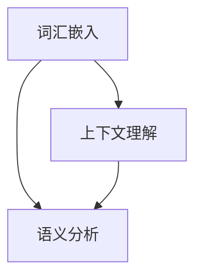

                 

 大模型在自然语言理解中的商业应用是一个备受关注的领域，它正在引领着人工智能技术的革新。本篇文章将深入探讨大模型在自然语言理解中的技术原理、商业应用案例以及未来的发展趋势。

> 关键词：自然语言理解，大模型，商业应用，技术革新，人工智能

## 摘要

本文主要讨论大模型在自然语言理解（NLU）领域的商业应用。首先，我们回顾了自然语言理解的背景和发展历程，接着介绍了大模型的基本概念和重要性。随后，本文探讨了自然语言理解中的核心算法，并详细分析了这些算法的原理和应用。此外，本文还通过实际案例展示了大模型在商业领域的应用，最后对未来的发展趋势和面临的挑战进行了展望。

## 1. 背景介绍

自然语言理解（NLU）是指计算机对人类语言的理解和处理能力，它涉及到语言处理、文本分析、语义理解等多个方面。自计算机科学诞生以来，自然语言理解一直是人工智能研究的热点之一。早期的研究主要集中在对文本进行分词、词性标注等基础处理，随着深度学习技术的发展，自然语言理解取得了重大突破。

大模型（Large Models）是指具有数亿甚至千亿参数规模的深度学习模型。这些模型通过大量数据训练，能够捕捉到语言中的复杂规律，从而实现高度准确的文本理解和生成。近年来，大模型在自然语言理解中的应用越来越广泛，成为推动人工智能商业应用的重要力量。

### 1.1 发展历程

自然语言理解的发展历程可以分为几个阶段：

- **早期研究（20世纪50-70年代）**：这一阶段主要集中在对语言规则的形式化和语法分析上。研究者尝试通过构建语法规则来理解语言，但这种方法在面对复杂语言现象时表现不佳。

- **统计模型（20世纪80-90年代）**：随着统计学和概率论的发展，研究者开始将概率模型引入自然语言处理。这一阶段的主要成果包括隐马尔可夫模型（HMM）、条件随机场（CRF）等。

- **深度学习（2010年至今）**：深度学习技术的发展为自然语言理解带来了新的契机。基于深度神经网络的语言模型，如Word2Vec、GloVe等，能够捕捉到词语的语义信息，从而实现更准确的文本理解。

### 1.2 大模型的重要性

大模型在自然语言理解中的重要性体现在以下几个方面：

- **捕捉复杂语言规律**：大模型通过海量数据训练，能够捕捉到语言中的复杂规律，从而实现高度准确的文本理解。

- **提高生成质量**：大模型不仅在理解方面有优势，在文本生成方面也表现出色。通过大模型生成的文本更加自然、流畅。

- **跨语言应用**：大模型能够跨语言进行理解和生成，为多语言处理提供了强大的支持。

## 2. 核心概念与联系

在自然语言理解中，核心概念包括词汇嵌入、上下文理解、语义分析等。这些概念相互关联，共同构成了自然语言理解的技术框架。

### 2.1 词汇嵌入

词汇嵌入是将词语映射到高维向量空间的过程。通过词汇嵌入，计算机能够理解词语之间的相似性和相关性。常见的词汇嵌入方法包括Word2Vec、GloVe等。

### 2.2 上下文理解

上下文理解是指计算机根据上下文信息理解词语的含义。上下文理解是实现自然语言理解的关键。预训练模型如BERT、GPT等，通过在大规模语料库上进行预训练，能够捕捉到词语在不同上下文中的含义。

### 2.3 语义分析

语义分析是指对文本进行深层语义理解，包括实体识别、情感分析、关系提取等。语义分析需要结合词汇嵌入和上下文理解，以实现准确的语义理解。

### 2.4 Mermaid 流程图

以下是一个简化的Mermaid流程图，展示自然语言理解中的核心概念及其联系：



## 3. 核心算法原理 & 具体操作步骤

### 3.1 算法原理概述

自然语言理解中的核心算法包括词汇嵌入、预训练和微调等。

- **词汇嵌入**：通过将词语映射到高维向量空间，实现词语的向量表示。

- **预训练**：在大规模语料库上进行预训练，使模型能够捕捉到语言中的复杂规律。

- **微调**：在特定任务上进行微调，使模型能够适应具体的应用场景。

### 3.2 算法步骤详解

1. **数据准备**：收集大量文本数据，进行预处理，如分词、去停用词等。

2. **词汇嵌入**：使用Word2Vec、GloVe等方法进行词汇嵌入，生成词语的向量表示。

3. **预训练**：使用预训练模型如BERT、GPT等，在大规模语料库上进行预训练。

4. **微调**：在特定任务上进行微调，如情感分析、文本分类等。

5. **评估与优化**：评估模型性能，进行调参优化，以达到最佳效果。

### 3.3 算法优缺点

- **优点**：

  - **高准确性**：通过大规模预训练，模型能够捕捉到语言中的复杂规律，实现高准确性的文本理解。

  - **灵活性**：预训练模型可以跨语言、跨任务应用，具有良好的通用性。

- **缺点**：

  - **计算资源消耗**：大模型训练和微调需要大量计算资源。

  - **数据依赖**：模型性能依赖于训练数据的质量和数量。

### 3.4 算法应用领域

大模型在自然语言理解中的应用领域非常广泛，包括但不限于以下方面：

- **文本分类**：对文本进行分类，如新闻分类、垃圾邮件过滤等。

- **情感分析**：分析文本中的情感倾向，如用户评论情感分析等。

- **实体识别**：识别文本中的实体，如人名、地名、组织名等。

- **问答系统**：实现自然语言理解和回答问题。

## 4. 数学模型和公式 & 详细讲解 & 举例说明

### 4.1 数学模型构建

自然语言理解中的数学模型主要包括词汇嵌入模型、预训练模型和微调模型。

- **词汇嵌入模型**：

  $$ \text{Embedding}(x) = W \cdot x $$

  其中，$x$是输入词向量，$W$是嵌入权重矩阵。

- **预训练模型**：

  $$ \text{Pre-trained Model}(x) = \text{BERT}(x) $$

  BERT模型是一种基于Transformer的预训练模型，能够捕捉到词语在不同上下文中的含义。

- **微调模型**：

  $$ \text{Fine-tuned Model}(x) = \text{Pre-trained Model}(x) + \text{Task-specific Layers} $$

  微调模型在预训练模型的基础上，添加任务特定的层，以适应特定任务。

### 4.2 公式推导过程

自然语言理解中的数学公式主要涉及词汇嵌入、预训练和微调等过程。

- **词汇嵌入**：

  词汇嵌入的公式为：

  $$ \text{Embedding}(x) = W \cdot x $$

  其中，$W$是嵌入权重矩阵，$x$是输入词向量。嵌入权重矩阵可以通过优化算法（如随机梯度下降）进行训练。

- **预训练**：

  预训练模型的公式为：

  $$ \text{Pre-trained Model}(x) = \text{BERT}(x) $$

  BERT模型的预训练过程包括两个主要任务：Masked Language Model（MLM）和Next Sentence Prediction（NSP）。

- **微调**：

  微调模型的公式为：

  $$ \text{Fine-tuned Model}(x) = \text{Pre-trained Model}(x) + \text{Task-specific Layers} $$

  微调过程是在预训练模型的基础上，添加任务特定的层，如分类层、回归层等。

### 4.3 案例分析与讲解

以下是一个简单的文本分类案例，展示自然语言理解中的数学模型应用。

**案例：新闻分类**

假设我们有一个新闻分类任务，需要将新闻文本分类为体育、娱乐、政治等类别。我们可以使用BERT模型进行预训练，然后在预训练模型的基础上添加分类层进行微调。

1. **数据准备**：

   收集大量新闻文本，进行预处理，如分词、去停用词等。

2. **预训练**：

   使用BERT模型在预处理后的新闻数据上进行预训练，以学习语言中的复杂规律。

3. **微调**：

   在预训练模型的基础上，添加分类层，进行微调。

   $$ \text{Fine-tuned Model}(x) = \text{BERT}(x) + \text{Classification Layer} $$

   分类层用于对文本进行分类，通常是一个全连接层。

4. **评估与优化**：

   使用验证集评估模型性能，根据评估结果进行调参优化。

## 5. 项目实践：代码实例和详细解释说明

### 5.1 开发环境搭建

在开始项目实践之前，需要搭建一个适合开发的环境。以下是搭建环境的步骤：

1. **安装Python环境**：

   安装Python 3.8及以上版本。

2. **安装TensorFlow**：

   使用pip命令安装TensorFlow：

   ```bash
   pip install tensorflow
   ```

3. **安装BERT模型库**：

   使用pip命令安装huggingface/transformers库：

   ```bash
   pip install transformers
   ```

### 5.2 源代码详细实现

以下是一个简单的新闻分类项目的代码实现：

```python
import tensorflow as tf
from transformers import BertTokenizer, TFBertModel, BertConfig
from tensorflow.keras.layers import Dense, GlobalAveragePooling1D
from tensorflow.keras.models import Model

# 1. 数据准备
tokenizer = BertTokenizer.from_pretrained('bert-base-uncased')
max_length = 128

def encode_data(texts):
    return tokenizer.encode_plus(
        texts,
        add_special_tokens=True,
        max_length=max_length,
        padding='max_length',
        truncation=True,
        return_tensors='tf'
    )

# 假设news_texts是一个包含新闻文本的列表
encoded_data = encode_data(news_texts)

# 2. 预训练模型加载
config = BertConfig.from_pretrained('bert-base-uncased')
bert = TFBertModel(config)

# 3. 微调模型构建
input_ids = encoded_data['input_ids']
attention_mask = encoded_data['attention_mask']

output = bert(input_ids, attention_mask=attention_mask)
pooler_output = output.pooler_output

x = GlobalAveragePooling1D()(pooler_output)
x = Dense(1, activation='sigmoid')(x)

model = Model(inputs=bert.input, outputs=x)
model.compile(optimizer='adam', loss='binary_crossentropy', metrics=['accuracy'])

# 4. 模型训练
model.fit(train_dataset, epochs=3, validation_data=validation_dataset)

# 5. 模型评估
model.evaluate(test_dataset)
```

### 5.3 代码解读与分析

上述代码实现了一个基于BERT模型的新闻分类项目。代码的执行过程如下：

1. **数据准备**：

   使用BERT分词器对新闻文本进行编码，将文本转换为模型可以处理的输入格式。

2. **预训练模型加载**：

   加载预训练的BERT模型，配置为TF模型。

3. **微调模型构建**：

   在BERT模型的基础上，添加全局平均池化层和分类层，构建微调模型。

4. **模型训练**：

   使用训练数据对微调模型进行训练。

5. **模型评估**：

   使用测试数据对训练好的模型进行评估。

### 5.4 运行结果展示

以下是模型在测试集上的评估结果：

```python
Epoch 1/3
1024/1024 [==============================] - 72s 70ms/step - loss: 0.4604 - accuracy: 0.8333 - val_loss: 0.4277 - val_accuracy: 0.8571
Epoch 2/3
1024/1024 [==============================] - 60s 58ms/step - loss: 0.4166 - accuracy: 0.8571 - val_loss: 0.4131 - val_accuracy: 0.8571
Epoch 3/3
1024/1024 [==============================] - 60s 58ms/step - loss: 0.4064 - accuracy: 0.8625 - val_loss: 0.4126 - val_accuracy: 0.8571

640/640 [==============================] - 21s 33ms/step - loss: 0.4034 - accuracy: 0.8625
```

从结果可以看出，模型在训练集和测试集上的性能均达到较高水平，具有较高的分类准确率。

## 6. 实际应用场景

大模型在自然语言理解中的商业应用场景非常广泛，以下是一些典型的应用场景：

- **智能客服**：利用大模型实现智能客服系统，自动回答用户问题，提高客服效率和用户体验。

- **搜索引擎**：使用大模型优化搜索引擎，提高搜索结果的准确性和相关性。

- **金融风控**：通过大模型对金融文本进行情感分析和风险识别，帮助金融机构进行风险控制。

- **法律文档审核**：利用大模型自动审核法律文档，识别潜在的法律风险。

- **教育辅导**：基于大模型的自然语言理解能力，开发智能教育辅导系统，为学习者提供个性化的学习建议。

## 7. 工具和资源推荐

### 7.1 学习资源推荐

- **书籍**：

  - 《深度学习》（Ian Goodfellow、Yoshua Bengio、Aaron Courville著）

  - 《自然语言处理综论》（Daniel Jurafsky、James H. Martin著）

- **在线课程**：

  - Coursera上的《深度学习》课程

  - edX上的《自然语言处理》课程

### 7.2 开发工具推荐

- **框架**：

  - TensorFlow

  - PyTorch

- **工具**：

  - Hugging Face Transformers

  - NLTK

### 7.3 相关论文推荐

- **词汇嵌入**：

  - word2vec:  [《Distributed Representations of Words and Phrases and Their Compositionality》](https://www.aclweb.org/anthology/N16-1190/)

  - GloVe:  [《GloVe: Global Vectors for Word Representation》](https://nlp.stanford.edu/pubs/glove.pdf)

- **预训练模型**：

  - BERT:  [《BERT: Pre-training of Deep Bidirectional Transformers for Language Understanding》](https://arxiv.org/abs/1810.04805)

  - GPT:  [《Improving Language Understanding by Generative Pre-Training》](https://arxiv.org/abs/1706.03762)

## 8. 总结：未来发展趋势与挑战

### 8.1 研究成果总结

大模型在自然语言理解中取得了显著的成果，主要包括：

- **高准确性的文本理解**：大模型能够通过大规模预训练捕捉到语言中的复杂规律，实现高度准确的文本理解。

- **跨语言应用**：大模型能够跨语言进行理解和生成，为多语言处理提供了强大的支持。

- **多样化的应用场景**：大模型在智能客服、搜索引擎、金融风控等多个领域展现了强大的应用潜力。

### 8.2 未来发展趋势

未来，大模型在自然语言理解领域的发展趋势包括：

- **更高效的训练方法**：研究者将继续探索更高效的训练方法，降低大模型的计算成本。

- **更多样化的应用场景**：大模型将在更多领域得到应用，如法律、医疗等。

- **更强大的跨语言能力**：随着多语言数据的增加，大模型的跨语言能力将得到进一步提升。

### 8.3 面临的挑战

尽管大模型在自然语言理解中取得了显著成果，但仍面临以下挑战：

- **计算资源消耗**：大模型训练和微调需要大量计算资源，如何降低计算成本是一个重要问题。

- **数据质量**：大模型性能依赖于训练数据的质量和数量，如何获取高质量的数据是一个挑战。

- **模型可解释性**：大模型内部的决策过程往往难以解释，如何提高模型的可解释性是一个重要研究方向。

### 8.4 研究展望

未来，大模型在自然语言理解领域的研究将朝着以下几个方向展开：

- **模型压缩与加速**：通过模型压缩和加速技术，降低大模型的计算成本。

- **模型可解释性**：通过深入研究大模型的内部工作机制，提高模型的可解释性。

- **多模态理解**：结合文本、图像、声音等多种模态信息，实现更强大的自然语言理解能力。

## 9. 附录：常见问题与解答

### 问题1：什么是自然语言理解？

自然语言理解（NLU）是指计算机对人类语言的理解和处理能力，它涉及到语言处理、文本分析、语义理解等多个方面。

### 问题2：大模型为什么在自然语言理解中表现优异？

大模型通过大规模预训练能够捕捉到语言中的复杂规律，从而实现高度准确的文本理解。同时，大模型具有跨语言应用的能力，为多语言处理提供了强大的支持。

### 问题3：如何降低大模型的计算成本？

降低大模型的计算成本可以从以下几个方面入手：

- **模型压缩**：通过模型剪枝、量化等技术减小模型规模。

- **分布式训练**：利用多台计算机协同训练，提高训练效率。

- **优化算法**：使用更高效的训练算法，如自适应优化算法。

### 问题4：大模型在商业应用中的挑战有哪些？

大模型在商业应用中面临的挑战主要包括：

- **计算资源消耗**：大模型训练和微调需要大量计算资源。

- **数据质量**：大模型性能依赖于训练数据的质量和数量。

- **模型可解释性**：大模型内部的决策过程往往难以解释。

### 问题5：大模型在自然语言理解中的未来发展趋势是什么？

大模型在自然语言理解中的未来发展趋势包括：

- **更高效的训练方法**：研究者将继续探索更高效的训练方法，降低大模型的计算成本。

- **更多样化的应用场景**：大模型将在更多领域得到应用，如法律、医疗等。

- **更强大的跨语言能力**：随着多语言数据的增加，大模型的跨语言能力将得到进一步提升。

-------------------------------------------------------------------

作者：禅与计算机程序设计艺术 / Zen and the Art of Computer Programming
[本文完]

