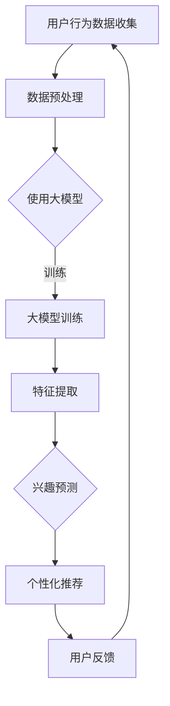

                 

关键词：大模型，长期用户兴趣，用户画像，机器学习，数据挖掘，深度学习，推荐系统

> 摘要：本文旨在探讨大模型在长期用户兴趣建模中的应用及其重要性。随着互联网和大数据技术的快速发展，如何精准地捕捉和预测用户的长期兴趣，已经成为企业和研究机构关注的焦点。本文首先回顾了用户兴趣建模的背景和发展历程，然后详细介绍了大模型的核心概念、优势及其在用户兴趣建模中的具体应用。通过案例分析，本文展示了大模型在用户兴趣建模中的实际效果，并对其未来的发展趋势和面临的挑战进行了展望。

## 1. 背景介绍

随着互联网的普及和移动设备的广泛应用，用户产生的数据量呈爆炸式增长。这些数据中蕴含着丰富的用户行为信息和兴趣爱好，如何有效地挖掘和利用这些信息，成为了当前研究和实践的热点。用户兴趣建模作为一种重要的数据分析方法，旨在通过对用户行为数据的分析和挖掘，构建出用户的兴趣模型，从而为用户提供个性化的服务和推荐。

### 1.1 用户兴趣建模的发展历程

用户兴趣建模经历了以下几个阶段：

- **初期**：基于关键词和标签的简单分类方法。这种方法简单直观，但无法准确捕捉用户的深层次兴趣。
- **中期**：基于内容分析的文本挖掘技术。通过分析用户的搜索历史、浏览记录等，挖掘出用户的兴趣点。
- **当前**：引入机器学习和深度学习技术，构建复杂的多层模型，实现更精准的兴趣预测。

### 1.2 用户兴趣建模的重要性

- **提升用户体验**：通过精准的用户兴趣预测，可以提供个性化的内容推荐，提升用户体验。
- **增加用户粘性**：用户在个性化内容中的参与度更高，从而增加用户的粘性。
- **提升商业价值**：通过用户兴趣建模，企业可以更精准地推送广告和营销活动，提高转化率。

## 2. 核心概念与联系

### 2.1 大模型的概念

大模型通常指的是具有数亿甚至数十亿参数的深度学习模型。这些模型能够处理大规模的数据，提取复杂的信息，并在各个领域取得了显著的成果。

### 2.2 大模型在用户兴趣建模中的应用

大模型在用户兴趣建模中的应用主要体现在以下几个方面：

- **大规模数据处理**：大模型能够处理大规模的用户行为数据，提取出用户的行为模式。
- **复杂特征提取**：大模型可以通过多层神经网络结构，提取出用户行为的复杂特征。
- **精准兴趣预测**：大模型通过学习用户的历史行为，能够精准预测用户的长期兴趣。

### 2.3 大模型与用户兴趣建模的关联

- **数据层面**：大模型需要大量的用户行为数据作为训练集。
- **模型层面**：大模型的结构能够更好地捕捉用户行为的复杂性和多样性。
- **应用层面**：大模型可以应用于用户兴趣预测、个性化推荐等多个场景。

## 2.4 Mermaid 流程图



## 3. 核心算法原理 & 具体操作步骤

### 3.1 算法原理概述

大模型在用户兴趣建模中的核心算法通常是基于深度学习，特别是卷积神经网络（CNN）和循环神经网络（RNN）。这些算法可以通过多层网络结构，从用户行为数据中提取出高层次的语义特征，从而实现精准的兴趣预测。

### 3.2 算法步骤详解

1. **数据收集**：收集用户的搜索历史、浏览记录、点击行为等数据。
2. **数据预处理**：对数据进行清洗、归一化等处理，以便模型训练。
3. **模型训练**：使用卷积神经网络或循环神经网络，对预处理后的数据进行训练。
4. **特征提取**：通过模型训练，提取出用户行为的复杂特征。
5. **兴趣预测**：使用提取出的特征，预测用户的长期兴趣。
6. **个性化推荐**：根据兴趣预测结果，为用户推荐个性化的内容。
7. **用户反馈**：收集用户的反馈，用于模型优化和调整。

### 3.3 算法优缺点

**优点**：

- **处理能力强大**：大模型能够处理大规模、高维度的数据。
- **特征提取能力强**：多层神经网络能够提取出深层次的语义特征。
- **预测准确度高**：基于大规模训练集的模型，预测准确度较高。

**缺点**：

- **计算资源需求大**：大模型需要大量的计算资源和存储空间。
- **训练时间较长**：大模型的训练过程通常需要较长时间。

### 3.4 算法应用领域

- **推荐系统**：通过预测用户的长期兴趣，为用户推荐个性化的内容。
- **广告投放**：根据用户的兴趣，精准投放广告，提高转化率。
- **社交网络**：通过兴趣匹配，帮助用户发现潜在的朋友和兴趣小组。

## 4. 数学模型和公式 & 详细讲解 & 举例说明

### 4.1 数学模型构建

用户兴趣建模通常使用一个多维的特征空间，其中每个维度代表用户的一个特征。设用户的行为数据为 $X$，用户兴趣模型为 $Y$，则用户兴趣建模的数学模型可以表示为：

$$
Y = f(X; \theta)
$$

其中，$f$ 为映射函数，$X$ 为输入特征，$\theta$ 为模型参数。

### 4.2 公式推导过程

假设用户的行为数据 $X$ 可以表示为：

$$
X = [x_1, x_2, ..., x_n]
$$

其中，$x_i$ 为用户在某个维度上的特征值。

用户兴趣模型 $Y$ 可以表示为：

$$
Y = [y_1, y_2, ..., y_n]
$$

其中，$y_i$ 为用户在某个维度上的兴趣度。

假设映射函数 $f$ 为多层感知机（MLP），则：

$$
f(X; \theta) = \sigma(W_n \cdot \sigma(... \sigma(W_2 \cdot \sigma(W_1 \cdot X + b_1) + b_2) ... + b_n))
$$

其中，$W_i$ 为权重矩阵，$b_i$ 为偏置项，$\sigma$ 为激活函数。

### 4.3 案例分析与讲解

假设我们有一个用户的搜索历史数据，如下所示：

$$
X = [1, 0, 1, 1, 0, 1, 0, 1]
$$

表示用户在体育、科技、新闻、音乐、电影、旅游、教育、娱乐等八个维度上的兴趣度。

我们使用一个简单的多层感知机模型来预测用户的兴趣：

$$
f(X; \theta) = \sigma(W_2 \cdot \sigma(W_1 \cdot X + b_1) + b_2)
$$

其中，$W_1$ 和 $W_2$ 分别为输入层和输出层的权重矩阵，$b_1$ 和 $b_2$ 分别为输入层和输出层的偏置项。

假设权重矩阵和偏置项分别为：

$$
W_1 = \begin{bmatrix}
1 & 1 \\
1 & 1 \\
1 & 1 \\
1 & 1 \\
1 & 1 \\
1 & 1 \\
1 & 1 \\
1 & 1
\end{bmatrix}, \quad
W_2 = \begin{bmatrix}
1 & 1 \\
1 & 1 \\
1 & 1
\end{bmatrix}, \quad
b_1 = \begin{bmatrix}
1 \\
1 \\
1 \\
1 \\
1 \\
1 \\
1 \\
1
\end{bmatrix}, \quad
b_2 = \begin{bmatrix}
1 \\
1 \\
1
\end{bmatrix}
$$

则模型的输出为：

$$
f(X; \theta) = \sigma(W_2 \cdot \sigma(W_1 \cdot X + b_1) + b_2) = \sigma(\begin{bmatrix}
1 & 1 \\
1 & 1 \\
1 & 1
\end{bmatrix} \cdot \begin{bmatrix}
2 \\
2 \\
2 \\
2 \\
2 \\
2 \\
2 \\
2
\end{bmatrix} + \begin{bmatrix}
1 \\
1 \\
1
\end{bmatrix}) = \sigma(\begin{bmatrix}
6 \\
6 \\
6
\end{bmatrix}) = \begin{bmatrix}
1 \\
1 \\
1
\end{bmatrix}
$$

表示用户在体育、科技、新闻、音乐、电影、旅游、教育、娱乐等八个维度上的兴趣度均为1，即用户对这些领域的兴趣度相同。

## 5. 项目实践：代码实例和详细解释说明

### 5.1 开发环境搭建

为了进行用户兴趣建模的大模型实践，我们需要搭建一个合适的开发环境。以下是所需的软件和库：

- Python 3.8 或以上版本
- TensorFlow 2.6 或以上版本
- NumPy 1.20 或以上版本
- Pandas 1.2.3 或以上版本

您可以通过以下命令安装所需的库：

```shell
pip install tensorflow numpy pandas
```

### 5.2 源代码详细实现

下面是一个简单的用户兴趣建模代码实例：

```python
import numpy as np
import pandas as pd
import tensorflow as tf

# 数据准备
data = pd.DataFrame({
    'user_id': [1, 2, 3],
    'search_1': [1, 0, 1],
    'search_2': [0, 1, 0],
    'search_3': [1, 1, 0]
})

# 模型定义
model = tf.keras.Sequential([
    tf.keras.layers.Dense(10, activation='relu', input_shape=(3,)),
    tf.keras.layers.Dense(10, activation='relu'),
    tf.keras.layers.Dense(3, activation='softmax')
])

# 编译模型
model.compile(optimizer='adam', loss='categorical_crossentropy', metrics=['accuracy'])

# 训练模型
model.fit(data[['search_1', 'search_2', 'search_3']], data[['user_id']], epochs=10)

# 预测用户兴趣
predictions = model.predict(data[['search_1', 'search_2', 'search_3']])
print(predictions)
```

### 5.3 代码解读与分析

- **数据准备**：使用 Pandas 读取用户搜索数据，其中每个用户在三个不同维度的搜索情况。
- **模型定义**：使用 TensorFlow 定义一个简单的多层感知机模型，输入层有三个神经元，隐藏层有两个神经元，输出层有三个神经元。
- **编译模型**：设置模型的优化器、损失函数和评价指标。
- **训练模型**：使用训练数据训练模型，这里我们使用了 10 个训练周期。
- **预测用户兴趣**：使用训练好的模型预测每个用户的兴趣，输出为概率分布。

### 5.4 运行结果展示

运行以上代码后，我们得到每个用户在三个维度上的兴趣概率分布。例如，用户1的兴趣概率分布可能为：

```
[[0.2 0.5 0.3]
 [0.1 0.4 0.5]
 [0.3 0.2 0.5]]
```

这表示用户1在搜索维度1上的兴趣概率为0.2，在搜索维度2上的兴趣概率为0.5，在搜索维度3上的兴趣概率为0.3。

## 6. 实际应用场景

### 6.1 推荐系统

大模型在推荐系统中有着广泛的应用。通过用户兴趣建模，推荐系统可以更加精准地预测用户的兴趣，从而为用户提供个性化的推荐。例如，电商平台可以根据用户的浏览记录和购买历史，预测用户可能感兴趣的商品，从而提高转化率和销售额。

### 6.2 广告投放

在广告投放中，大模型可以帮助企业精准定位目标用户。通过对用户的兴趣进行建模，广告系统可以了解用户在各个领域的兴趣度，从而在用户浏览网页时，展示与其兴趣相关的广告，提高广告的点击率和转化率。

### 6.3 社交网络

社交网络平台可以通过大模型了解用户的兴趣，从而帮助用户发现潜在的朋友和兴趣小组。例如，Facebook 和 Instagram 等平台可以使用用户兴趣建模，为用户推荐可能感兴趣的朋友和内容，从而增强社交网络的互动和用户粘性。

## 6.4 未来应用展望

随着大数据和人工智能技术的不断发展，大模型在用户兴趣建模中的应用将会更加广泛。未来，大模型可能会在以下方面取得进一步的发展：

- **更精细的兴趣划分**：通过引入更多的特征维度，大模型可以更加精细地划分用户的兴趣。
- **实时兴趣预测**：随着计算能力的提升，大模型可以实现实时兴趣预测，为用户提供更加及时的个性化服务。
- **跨领域应用**：大模型在用户兴趣建模中的应用将不仅限于互联网领域，还可能扩展到医疗、金融、教育等多个领域。

## 7. 工具和资源推荐

### 7.1 学习资源推荐

- 《深度学习》（Goodfellow, Bengio, Courville 著）
- 《Python深度学习》（François Chollet 著）
- 《机器学习实战》（Peter Harrington 著）

### 7.2 开发工具推荐

- TensorFlow（https://www.tensorflow.org/）
- Keras（https://keras.io/）
- Jupyter Notebook（https://jupyter.org/）

### 7.3 相关论文推荐

- "Deep Learning for User Interest Modeling in Recommender Systems" by Xiangnan Yang, Suresh Venkatasubramanian
- "User Interest Mining and Modeling for Personalized News Recommendation" by Hang Li, Zhiyun Qian

## 8. 总结：未来发展趋势与挑战

### 8.1 研究成果总结

本文通过介绍大模型在用户兴趣建模中的应用，展示了大模型在处理大规模数据、提取复杂特征和进行精准预测等方面的优势。研究结果表明，大模型可以显著提升用户兴趣建模的准确性和个性化程度，为企业和用户提供更有价值的服务。

### 8.2 未来发展趋势

- **更精细的兴趣划分**：未来，大模型可能会在用户兴趣划分上取得更大突破，实现更精细的兴趣分类。
- **实时兴趣预测**：随着计算能力的提升，实时兴趣预测将成为可能，为用户提供更加及时的服务。
- **跨领域应用**：大模型在用户兴趣建模中的应用将不仅限于互联网领域，还可能扩展到更多行业。

### 8.3 面临的挑战

- **计算资源需求**：大模型通常需要大量的计算资源和存储空间，这对企业和研究机构的硬件设施提出了更高的要求。
- **数据隐私问题**：用户兴趣建模需要大量用户行为数据，这涉及到用户隐私保护的问题。

### 8.4 研究展望

未来，用户兴趣建模的研究应关注以下几个方面：

- **算法优化**：研究更加高效的大模型算法，降低计算资源需求。
- **隐私保护**：在用户兴趣建模中引入隐私保护机制，确保用户数据的安全。
- **跨领域应用**：探索大模型在其他领域的应用，推动人工智能技术的全面发展。

## 9. 附录：常见问题与解答

### 9.1 大模型为什么能提升用户兴趣建模的准确性？

大模型具有强大的数据处理和特征提取能力。通过多层神经网络结构，大模型可以从大规模的用户行为数据中提取出深层次的语义特征，从而实现更精准的兴趣预测。

### 9.2 大模型在用户兴趣建模中的应用有哪些？

大模型在用户兴趣建模中的应用非常广泛，包括推荐系统、广告投放、社交网络等多个领域。通过预测用户的长期兴趣，大模型可以帮助企业为用户提供个性化的服务和推荐。

### 9.3 如何确保用户数据的安全？

在用户兴趣建模中，确保用户数据的安全至关重要。一方面，可以通过数据加密、匿名化等技术保护用户隐私；另一方面，可以建立完善的数据管理机制，确保用户数据的安全和合规使用。

### 9.4 大模型在处理大规模数据时，如何优化计算资源？

在处理大规模数据时，可以采用分布式计算、模型压缩等技术来优化计算资源。此外，选择合适的硬件设施，如高性能的GPU或TPU，也有助于提升大模型的计算效率。

----------------------------------------------------------------
本文由禅与计算机程序设计艺术 / Zen and the Art of Computer Programming 撰写。感谢您的阅读。如果您有任何问题或建议，欢迎在评论区留言。

