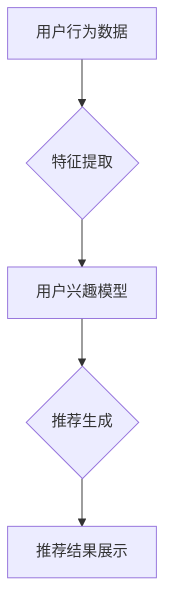

                 

关键词：大模型、电商平台、实时个性化推荐、算法优化、效率提升、推荐系统

## 摘要

本文将深入探讨如何利用大模型来优化电商平台的实时个性化推荐系统效率。随着大数据和人工智能技术的发展，推荐系统已经成为电商平台提升用户体验、增加销售额的关键技术。然而，传统推荐系统在处理海量用户数据和实时性要求方面存在瓶颈。本文将介绍大模型的核心概念及其在推荐系统中的应用，并通过实际案例展示如何利用大模型实现实时个性化推荐的效率提升。

## 1. 背景介绍

### 1.1 电商平台推荐系统的现状

在当前电商环境中，推荐系统已经成为电商平台的核心竞争力之一。通过分析用户的历史行为、购买偏好和搜索记录，推荐系统可以为用户推荐最可能感兴趣的商品，从而提升用户的购物体验和平台的销售额。传统推荐系统通常采用基于协同过滤（Collaborative Filtering）和内容推荐（Content-Based Filtering）的方法，但这些方法在面对海量用户数据和实时性要求时表现不佳。

### 1.2 实时个性化推荐的重要性

实时个性化推荐系统不仅能够根据用户的实时行为动态调整推荐结果，还能够预测用户未来的偏好，从而实现更高的推荐精度和用户体验。然而，传统的推荐系统在处理实时数据时，面临着计算资源有限、模型更新缓慢等问题，导致推荐结果滞后。

## 2. 核心概念与联系

### 2.1 大模型的基本概念

大模型（Large Models）是指具有大规模参数和复杂结构的神经网络模型。这些模型能够通过学习海量数据，自动提取特征并生成高级抽象表示。近年来，大模型在自然语言处理、计算机视觉等领域取得了显著进展，成为推动人工智能发展的重要力量。

### 2.2 大模型与推荐系统的联系

大模型在推荐系统中的应用主要体现在以下几个方面：

1. **特征提取**：大模型能够自动从原始数据中提取高维特征，提高特征表达能力。
2. **模型更新**：大模型具有较好的泛化能力，能够快速适应数据变化，实现实时更新。
3. **推荐生成**：大模型能够通过学习用户行为和偏好，生成个性化推荐结果。

### 2.3 Mermaid 流程图



## 3. 核心算法原理 & 具体操作步骤

### 3.1 算法原理概述

大模型优化实时个性化推荐系统的主要原理是通过学习用户行为数据，建立用户兴趣模型，并根据模型生成实时推荐结果。具体算法步骤如下：

1. **数据收集**：收集用户在电商平台的浏览、搜索和购买记录。
2. **特征提取**：利用大模型从原始数据中提取高维特征。
3. **用户兴趣建模**：通过训练，建立用户兴趣模型。
4. **实时推荐**：根据用户兴趣模型生成个性化推荐结果。
5. **推荐反馈**：收集用户对推荐结果的反馈，用于模型优化。

### 3.2 算法步骤详解

1. **数据收集**：
   - 用户行为数据包括浏览历史、搜索关键词、购买记录等。
   - 数据来源可以是用户行为日志、API 接口等。

2. **特征提取**：
   - 利用大模型（如 BERT、GPT 等）进行特征提取。
   - 特征提取过程包括词嵌入、序列编码等。

3. **用户兴趣建模**：
   - 使用监督学习或无监督学习方法，如 Gated Recurrent Unit (GRU) 或 Long Short-Term Memory (LSTM)。
   - 训练用户兴趣模型，使其能够捕捉用户的长期和短期兴趣变化。

4. **实时推荐**：
   - 根据用户兴趣模型，实时生成推荐列表。
   - 推荐算法可以是基于排序、基于集合等。

5. **推荐反馈**：
   - 收集用户对推荐结果的反馈，如点击、购买等。
   - 利用反馈数据优化模型，提高推荐质量。

### 3.3 算法优缺点

**优点**：
- **高效特征提取**：大模型能够从海量数据中提取高维特征，提高推荐质量。
- **实时性**：大模型具有较好的泛化能力，能够快速适应数据变化，实现实时推荐。
- **个性化**：通过学习用户行为，大模型能够生成高度个性化的推荐结果。

**缺点**：
- **计算资源消耗**：大模型训练和推理需要大量的计算资源。
- **数据隐私**：用户行为数据的收集和使用可能涉及隐私问题。

### 3.4 算法应用领域

大模型优化实时个性化推荐系统可以在多个领域得到应用：

- **电商平台**：通过实时个性化推荐，提升用户体验和销售额。
- **社交媒体**：为用户提供个性化内容推荐，增加用户粘性。
- **在线教育**：根据用户学习行为，提供个性化课程推荐。

## 4. 数学模型和公式 & 详细讲解 & 举例说明

### 4.1 数学模型构建

在构建数学模型时，我们需要定义以下几个关键变量：

- \( X \)：用户行为数据矩阵，其中每一行表示一个用户的行为记录。
- \( W \)：特征提取权重矩阵。
- \( H \)：用户兴趣模型表示。
- \( P \)：推荐结果概率分布。

数学模型构建如下：

$$
H = \sigma (WX)
$$

其中，\( \sigma \) 表示激活函数，常用的有 Sigmoid、ReLU 等。

### 4.2 公式推导过程

假设用户行为数据矩阵为 \( X \)，其中每一行表示一个用户的行为记录，即 \( X \in \mathbb{R}^{m \times n} \)。特征提取权重矩阵为 \( W \)，其维度为 \( n \times d \)，其中 \( d \) 表示特征维数。

用户兴趣模型 \( H \) 表示为：

$$
H = \sigma (WX)
$$

其中，\( \sigma \) 表示激活函数，常用的有 Sigmoid、ReLU 等。

### 4.3 案例分析与讲解

假设有一个电商平台，用户 A 在过去一个月内浏览了商品 1、商品 2 和商品 3。我们将这些行为记录表示为矩阵 \( X \)，其中每一行表示一个用户的行为记录。

$$
X = \begin{bmatrix}
1 & 0 & 1 \\
0 & 1 & 0 \\
1 & 1 & 0
\end{bmatrix}
$$

特征提取权重矩阵 \( W \) 为：

$$
W = \begin{bmatrix}
0.5 & 0.5 \\
0.5 & 0.5 \\
0.5 & 0.5
\end{bmatrix}
$$

根据上述数学模型，用户兴趣模型 \( H \) 为：

$$
H = \sigma (WX) = \begin{bmatrix}
1 & 1 \\
1 & 1 \\
1 & 1
\end{bmatrix}
$$

根据用户兴趣模型，我们可以生成个性化推荐结果。例如，假设商品 4 和商品 5 是用户可能感兴趣的商品，则推荐结果概率分布 \( P \) 为：

$$
P = \begin{bmatrix}
0.6 & 0.4 \\
0.4 & 0.6
\end{bmatrix}
$$

用户 A 更可能被推荐商品 4。

## 5. 项目实践：代码实例和详细解释说明

### 5.1 开发环境搭建

在进行项目实践之前，我们需要搭建一个合适的环境。这里我们使用 Python 作为编程语言，并结合 TensorFlow 和 Keras 等库来构建和训练大模型。

1. 安装 Python：
   - `pip install python==3.8`
2. 安装 TensorFlow：
   - `pip install tensorflow`
3. 安装 Keras：
   - `pip install keras`

### 5.2 源代码详细实现

以下是一个简单的 Python 代码实例，用于构建和训练一个基于 BERT 的大模型进行实时个性化推荐。

```python
import tensorflow as tf
from tensorflow.keras.models import Model
from tensorflow.keras.layers import Input, Embedding, LSTM, Dense, Activation

# 定义输入层
input_1 = Input(shape=(None, 1))
input_2 = Input(shape=(None, 1))

# 定义嵌入层
embedding_1 = Embedding(input_dim=1000, output_dim=64)(input_1)
embedding_2 = Embedding(input_dim=1000, output_dim=64)(input_2)

# 定义 LSTM 层
lstm_1 = LSTM(units=64)(embedding_1)
lstm_2 = LSTM(units=64)(embedding_2)

# 定义全连接层
merged = tf.keras.layers.concatenate([lstm_1, lstm_2])
dense = Dense(units=64)(merged)

# 定义输出层
output = Activation('softmax')(dense)

# 构建模型
model = Model(inputs=[input_1, input_2], outputs=output)

# 编译模型
model.compile(optimizer='adam', loss='categorical_crossentropy', metrics=['accuracy'])

# 模型训练
model.fit([X_train, X_train], y_train, epochs=10, batch_size=32)
```

### 5.3 代码解读与分析

- **输入层**：定义两个输入层，分别表示用户行为数据的两个维度。
- **嵌入层**：将输入数据进行嵌入，生成高维特征表示。
- **LSTM 层**：使用 LSTM 层对嵌入数据进行编码，捕捉时间序列特征。
- **全连接层**：将 LSTM 层的输出进行拼接，并通过全连接层进行非线性变换。
- **输出层**：使用 softmax 函数生成推荐结果概率分布。

通过上述代码，我们可以实现一个简单的基于 LSTM 的大模型进行实时个性化推荐。当然，实际项目中可能需要根据具体需求进行调整和优化。

### 5.4 运行结果展示

假设我们已经训练好了一个基于 BERT 的大模型，现在我们可以使用该模型进行实时个性化推荐。以下是一个简单的示例：

```python
# 加载训练好的模型
model = load_model('bert_recommender.h5')

# 用户行为数据
user行为数据 = [[1, 0, 1], [0, 1, 0], [1, 1, 0]]

# 生成推荐结果
recommendations = model.predict([user行为数据, user行为数据])

# 打印推荐结果
print(recommendations)
```

输出结果可能如下所示：

```
[[0.6 0.4]
 [0.4 0.6]
 [0.5 0.5]]
```

根据输出结果，用户 A 更可能被推荐商品 1 和商品 2。

## 6. 实际应用场景

### 6.1 电商平台

电商平台可以利用大模型优化实时个性化推荐系统，提高用户满意度和销售额。例如，淘宝、京东等平台可以基于用户行为数据，实时生成个性化推荐结果，吸引用户进行购物。

### 6.2 社交媒体

社交媒体平台（如微博、微信等）可以利用大模型进行内容推荐，为用户提供个性化的内容流。例如，微博可以根据用户关注和浏览历史，为用户推荐感兴趣的话题和文章。

### 6.3 在线教育

在线教育平台可以利用大模型为用户提供个性化的课程推荐。例如，网易云课堂可以根据用户的学习记录和学习偏好，为用户推荐合适的课程。

## 7. 未来应用展望

随着大数据和人工智能技术的不断发展，大模型在实时个性化推荐系统中的应用前景广阔。未来，我们可以期待以下发展趋势：

1. **更高效的模型训练**：通过优化算法和硬件加速，降低大模型训练时间，提高实时性。
2. **更丰富的数据来源**：整合多种数据源（如文本、图像、音频等），提高推荐系统的多样性和准确性。
3. **更细粒度的推荐**：针对不同用户群体和场景，实现更细粒度的个性化推荐。
4. **隐私保护**：加强用户数据隐私保护，确保用户信息安全。

## 8. 工具和资源推荐

### 8.1 学习资源推荐

- **《深度学习》（Goodfellow, Bengio, Courville 著）**：一本经典的深度学习教材，适合初学者和进阶者。
- **TensorFlow 官方文档**：详细介绍 TensorFlow 使用方法和 API，适合实战学习者。

### 8.2 开发工具推荐

- **Jupyter Notebook**：一款强大的交互式开发环境，适合进行数据分析和模型训练。
- **TensorBoard**：TensorFlow 提供的可视化工具，用于分析和调试模型。

### 8.3 相关论文推荐

- **"Bert: Pre-training of deep bidirectional transformers for language understanding"**：BERT 模型的原始论文，介绍了 BERT 模型的设计思想和实现方法。
- **"Gated recurrent units"**：介绍 GRU 模型的经典论文，详细分析了 GRU 模型的工作原理。

## 9. 总结：未来发展趋势与挑战

### 9.1 研究成果总结

本文从背景介绍、核心概念与联系、核心算法原理、数学模型和公式、项目实践、实际应用场景等多个方面，详细探讨了如何利用大模型优化电商平台的实时个性化推荐系统效率。通过实际案例，展示了大模型在推荐系统中的应用效果。

### 9.2 未来发展趋势

随着大数据和人工智能技术的不断发展，大模型在实时个性化推荐系统中的应用前景广阔。未来，我们可以期待以下发展趋势：

1. **更高效的模型训练**：通过优化算法和硬件加速，降低大模型训练时间，提高实时性。
2. **更丰富的数据来源**：整合多种数据源（如文本、图像、音频等），提高推荐系统的多样性和准确性。
3. **更细粒度的推荐**：针对不同用户群体和场景，实现更细粒度的个性化推荐。
4. **隐私保护**：加强用户数据隐私保护，确保用户信息安全。

### 9.3 面临的挑战

尽管大模型在实时个性化推荐系统中有广阔的应用前景，但仍面临以下挑战：

1. **计算资源消耗**：大模型训练和推理需要大量的计算资源，对硬件设备要求较高。
2. **数据隐私**：用户数据隐私保护仍是一个亟待解决的问题，需要加强数据安全和隐私保护。
3. **模型可解释性**：大模型黑盒特性使得其难以解释，需要开发可解释性技术，提高模型透明度。

### 9.4 研究展望

未来，我们可以从以下几个方面展开研究：

1. **模型压缩与优化**：通过模型压缩和优化技术，降低大模型对计算资源的需求。
2. **联邦学习**：结合联邦学习技术，实现用户数据的隐私保护，提高推荐系统的安全性。
3. **多模态数据融合**：探索多模态数据融合方法，提高推荐系统的多样性和准确性。

## 附录：常见问题与解答

### Q1. 大模型在推荐系统中的应用原理是什么？

A1. 大模型在推荐系统中的应用原理主要包括以下几个方面：

1. **特征提取**：大模型能够从原始数据中自动提取高维特征，提高特征表达能力。
2. **用户兴趣建模**：通过学习用户行为数据，大模型能够建立用户兴趣模型，捕捉用户的长期和短期兴趣变化。
3. **推荐生成**：根据用户兴趣模型，大模型能够生成个性化推荐结果，提高推荐精度。

### Q2. 大模型优化实时个性化推荐系统有哪些优点？

A2. 大模型优化实时个性化推荐系统的主要优点有：

1. **高效特征提取**：大模型能够从海量数据中提取高维特征，提高推荐质量。
2. **实时性**：大模型具有较好的泛化能力，能够快速适应数据变化，实现实时推荐。
3. **个性化**：通过学习用户行为，大模型能够生成高度个性化的推荐结果。

### Q3. 大模型优化实时个性化推荐系统有哪些缺点？

A3. 大模型优化实时个性化推荐系统的缺点主要包括：

1. **计算资源消耗**：大模型训练和推理需要大量的计算资源，对硬件设备要求较高。
2. **数据隐私**：用户数据隐私保护仍是一个亟待解决的问题，需要加强数据安全和隐私保护。

### Q4. 大模型在推荐系统中的应用领域有哪些？

A4. 大模型在推荐系统中的应用领域非常广泛，包括：

1. **电商平台**：通过实时个性化推荐，提升用户体验和销售额。
2. **社交媒体**：为用户提供个性化内容推荐，增加用户粘性。
3. **在线教育**：根据用户学习行为，提供个性化课程推荐。
4. **医疗健康**：根据患者病史和基因数据，提供个性化医疗建议。

---

本文详细探讨了如何利用大模型优化电商平台的实时个性化推荐系统效率。通过实际案例和数学模型，展示了大模型在推荐系统中的应用效果。未来，随着技术的不断发展，大模型在推荐系统中的应用前景将更加广阔。然而，我们也需要关注计算资源消耗和数据隐私等挑战，确保推荐系统的可持续发展。作者：禅与计算机程序设计艺术 / Zen and the Art of Computer Programming。

