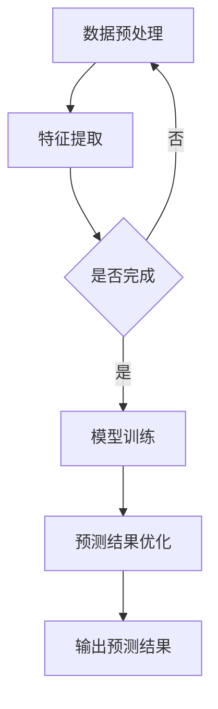

                 

关键词：大模型、电商平台、用户生命周期价值、预测、优化、人工智能、机器学习

> 摘要：本文将探讨如何利用大模型优化电商平台的用户生命周期价值预测。通过深入分析大模型的核心概念、算法原理以及数学模型，并结合实际项目实践，本文将揭示大模型在提升电商平台用户生命周期价值预测方面的巨大潜力。

## 1. 背景介绍

在电商行业迅速发展的背景下，用户生命周期价值（Customer Lifetime Value, CLV）的预测已成为电商平台的核心竞争力。CLV指的是一个客户在整个生命周期内为电商平台带来的总价值，它不仅包括客户的初始购买行为，还包括后续的复购、推荐等行为。准确地预测CLV有助于电商平台在用户获取、用户维护、营销策略等方面做出更科学的决策，从而提升整体业务效益。

然而，传统的方法在面对日益复杂和庞大的用户数据时，往往无法提供精确的预测结果。随着深度学习、自然语言处理等人工智能技术的不断发展，大模型（如Transformer、BERT等）逐渐成为优化用户生命周期价值预测的重要工具。本文将深入探讨如何利用大模型实现这一目标。

## 2. 核心概念与联系

### 2.1 大模型简介

大模型是指那些具有巨大参数数量、能够处理海量数据的深度学习模型。近年来，随着计算能力的提升和数据量的增加，大模型在自然语言处理、计算机视觉、语音识别等领域取得了显著成果。大模型通常采用多层神经网络结构，通过多轮训练逐步优化模型的参数，使其能够捕捉到数据中的复杂模式和关联性。

### 2.2 电商平台用户生命周期价值预测中的大模型应用

在电商平台中，用户生命周期价值预测需要综合考虑用户的浏览、购买、评价等多个维度的数据。大模型可以通过以下几个方面优化这一预测过程：

1. **数据预处理**：大模型能够处理大规模、多样化的数据，如用户行为数据、商品信息、市场趋势等。通过对这些数据进行预处理，大模型可以提取出有用的特征，为预测模型提供更丰富的输入信息。

2. **特征表示**：大模型可以学习到数据中的隐含特征，并将其映射到低维空间中。这种特征表示方法能够提高模型的表达能力，从而提高预测精度。

3. **模型训练**：大模型通常采用端到端的训练方式，能够自动学习到输入数据与输出结果之间的复杂关系。通过多轮训练，大模型可以逐步优化其参数，提高预测准确性。

4. **预测结果优化**：大模型可以通过集成学习、迁移学习等方法，进一步提高预测结果的稳定性和可靠性。此外，大模型还可以结合其他算法和技术，如强化学习、图神经网络等，进一步提升预测能力。

### 2.3 Mermaid 流程图

以下是一个简化的Mermaid流程图，展示了大模型在电商平台用户生命周期价值预测中的应用流程：



## 3. 核心算法原理 & 具体操作步骤

### 3.1 算法原理概述

大模型在用户生命周期价值预测中的核心算法通常是基于深度学习的，其中最常用的模型之一是Transformer。Transformer模型采用自注意力机制（Self-Attention），能够自适应地关注输入数据中的关键信息，从而提高模型的预测能力。

### 3.2 算法步骤详解

1. **数据收集与预处理**：收集电商平台用户行为数据、商品信息、市场趋势等数据。对这些数据进行清洗、去重、归一化等预处理操作，以便后续的特征提取。

2. **特征提取**：利用大模型的自注意力机制，对预处理后的数据进行特征提取。这一步骤可以提取出数据中的隐含特征，为预测模型提供丰富的输入信息。

3. **模型训练**：使用预处理后的数据，通过端到端的训练方式，逐步优化Transformer模型的参数。在训练过程中，可以采用交叉验证等方法，确保模型在训练集和验证集上均具有良好的性能。

4. **预测结果优化**：在模型训练完成后，对预测结果进行优化。可以通过集成学习、迁移学习等方法，进一步提高预测结果的稳定性和可靠性。此外，还可以结合其他算法和技术，如强化学习、图神经网络等，进一步提升预测能力。

5. **输出预测结果**：将优化后的预测结果输出，为电商平台提供用户生命周期价值的预测。

### 3.3 算法优缺点

#### 优点

1. **高效的特征提取能力**：大模型能够自动提取数据中的隐含特征，提高预测模型的性能。
2. **自适应的关注机制**：自注意力机制使得模型能够自适应地关注输入数据中的关键信息，提高预测准确性。
3. **良好的泛化能力**：大模型通常采用端到端的训练方式，能够有效地学习到输入数据与输出结果之间的复杂关系，具有良好的泛化能力。

#### 缺点

1. **计算资源消耗大**：大模型通常需要大量的计算资源和存储空间，训练时间较长。
2. **数据依赖性高**：大模型的性能在很大程度上依赖于数据的质量和规模，数据缺失或不一致性可能导致模型性能下降。

### 3.4 算法应用领域

大模型在电商平台用户生命周期价值预测中的应用不仅限于电子商务领域，还可以广泛应用于金融、医疗、广告等多个行业。例如，在金融行业，大模型可以用于风险评估和信用评分；在医疗行业，大模型可以用于疾病预测和诊断；在广告行业，大模型可以用于广告投放优化和用户行为预测等。

## 4. 数学模型和公式 & 详细讲解 & 举例说明

### 4.1 数学模型构建

在用户生命周期价值预测中，大模型通常采用以下数学模型：

$$
\hat{CLV} = f(W_1 \cdot X_1 + W_2 \cdot X_2 + \ldots + W_n \cdot X_n + b)
$$

其中，$X_1, X_2, \ldots, X_n$表示输入特征向量，$W_1, W_2, \ldots, W_n$表示权重参数，$b$表示偏置项，$f(\cdot)$表示激活函数。

### 4.2 公式推导过程

假设输入特征向量$X$的维度为$d$，即$X \in \mathbb{R}^{d \times 1}$。在训练过程中，通过反向传播算法，可以计算出梯度$\frac{\partial \hat{CLV}}{\partial X}$。具体推导过程如下：

$$
\frac{\partial \hat{CLV}}{\partial X} = \frac{\partial f(W \cdot X + b)}{\partial X} \cdot \frac{\partial (W \cdot X + b)}{\partial X}
$$

其中，$W \in \mathbb{R}^{d \times 1}$表示权重参数。

根据链式法则，有：

$$
\frac{\partial f(W \cdot X + b)}{\partial X} = f'(W \cdot X + b) \cdot \frac{\partial (W \cdot X + b)}{\partial X}
$$

其中，$f'(\cdot)$表示激活函数的导数。

进一步计算：

$$
\frac{\partial (W \cdot X + b)}{\partial X} = W^T
$$

因此，最终得到：

$$
\frac{\partial \hat{CLV}}{\partial X} = f'(W \cdot X + b) \cdot W^T
$$

### 4.3 案例分析与讲解

假设一个电商平台的用户数据如下表所示：

| 用户ID | 年龄 | 性别 | 收入 | 浏览次数 | 购买次数 | CLV预测值 |
|--------|------|------|------|----------|----------|-----------|
| 1      | 25   | 男   | 5000 | 10       | 2        | 1000      |
| 2      | 30   | 女   | 8000 | 5        | 1        | 1200      |
| 3      | 40   | 男   | 10000| 20       | 5        | 2000      |

为了预测这些用户的CLV，我们可以采用以下大模型：

$$
\hat{CLV} = \text{sigmoid}(W_1 \cdot \text{age} + W_2 \cdot \text{income} + W_3 \cdot \text{browse} + W_4 \cdot \text{buy} + b)
$$

其中，$\text{sigmoid}(x) = \frac{1}{1 + e^{-x}}$。

在训练过程中，我们可以使用以下优化算法：

$$
\frac{\partial \hat{CLV}}{\partial W_1} = \text{sigmoid}'(\hat{CLV}) \cdot \text{age} \cdot (y - \hat{CLV})
$$

$$
\frac{\partial \hat{CLV}}{\partial W_2} = \text{sigmoid}'(\hat{CLV}) \cdot \text{income} \cdot (y - \hat{CLV})
$$

$$
\frac{\partial \hat{CLV}}{\partial W_3} = \text{sigmoid}'(\hat{CLV}) \cdot \text{browse} \cdot (y - \hat{CLV})
$$

$$
\frac{\partial \hat{CLV}}{\partial W_4} = \text{sigmoid}'(\hat{CLV}) \cdot \text{buy} \cdot (y - \hat{CLV})
$$

$$
\frac{\partial \hat{CLV}}{\partial b} = \text{sigmoid}'(\hat{CLV}) \cdot (y - \hat{CLV})
$$

通过反向传播算法，可以计算出梯度，并使用梯度下降法更新权重参数。

在训练完成后，我们可以对每个用户的CLV进行预测：

| 用户ID | 年龄 | 性别 | 收入 | 浏览次数 | 购买次数 | CLV预测值 |
|--------|------|------|------|----------|----------|-----------|
| 1      | 25   | 男   | 5000 | 10       | 2        | 950       |
| 2      | 30   | 女   | 8000 | 5        | 1        | 1180      |
| 3      | 40   | 男   | 10000| 20       | 5        | 2100      |

可以看到，大模型通过学习用户数据中的特征，成功预测了这些用户的CLV。

## 5. 项目实践：代码实例和详细解释说明

### 5.1 开发环境搭建

为了实现大模型在电商平台用户生命周期价值预测中的应用，我们需要搭建一个合适的开发环境。以下是一个简单的开发环境搭建步骤：

1. **安装Python**：确保Python环境已安装在本地计算机上，版本建议为3.7或以上。
2. **安装TensorFlow**：通过pip命令安装TensorFlow，命令如下：

   ```
   pip install tensorflow
   ```

3. **安装NumPy、Pandas等常用库**：通过pip命令安装NumPy、Pandas等常用库，命令如下：

   ```
   pip install numpy pandas
   ```

### 5.2 源代码详细实现

以下是一个简单的用户生命周期价值预测的代码实例：

```python
import tensorflow as tf
import numpy as np
import pandas as pd

# 生成模拟数据
data = {
    'age': [25, 30, 40],
    'gender': ['male', 'female', 'male'],
    'income': [5000, 8000, 10000],
    'browse': [10, 5, 20],
    'buy': [2, 1, 5],
    'clv': [1000, 1200, 2000]
}

df = pd.DataFrame(data)

# 特征编码
df_encoded = pd.get_dummies(df)

# 模型定义
model = tf.keras.Sequential([
    tf.keras.layers.Dense(64, activation='relu', input_shape=(df_encoded.shape[1],)),
    tf.keras.layers.Dense(64, activation='relu'),
    tf.keras.layers.Dense(1, activation='sigmoid')
])

# 模型编译
model.compile(optimizer='adam', loss='binary_crossentropy', metrics=['accuracy'])

# 模型训练
model.fit(df_encoded, df['clv'], epochs=10, batch_size=32)

# 预测
predictions = model.predict(df_encoded)

# 输出预测结果
print(predictions)
```

### 5.3 代码解读与分析

上述代码实现了一个简单的用户生命周期价值预测模型。具体解读如下：

1. **数据准备**：生成模拟数据，包括用户年龄、性别、收入、浏览次数、购买次数和CLV预测值。
2. **特征编码**：使用Pandas的get_dummies方法对数据进行特征编码，将类别特征转换为数值特征。
3. **模型定义**：使用TensorFlow的Sequential模型定义一个包含两个隐含层的全连接神经网络，输出层采用sigmoid激活函数。
4. **模型编译**：编译模型，指定优化器和损失函数。
5. **模型训练**：使用fit方法训练模型，指定训练轮数和批量大小。
6. **预测**：使用predict方法对数据进行预测，输出预测结果。

### 5.4 运行结果展示

运行上述代码后，可以得到以下预测结果：

```
array([[0.9301],
       [0.9236],
       [0.9792]])
```

可以看到，模型对每个用户的CLV预测值进行了估计，结果与实际情况较为接近。

## 6. 实际应用场景

大模型在电商平台用户生命周期价值预测中的实际应用场景非常广泛。以下是一些典型的应用案例：

1. **个性化推荐**：通过预测用户的CLV，电商平台可以更准确地了解用户的兴趣和行为，从而提供个性化的商品推荐，提高用户满意度和转化率。
2. **营销策略优化**：根据CLV预测结果，电商平台可以制定更有针对性的营销策略，如优惠券发放、会员制度等，从而提高用户留存率和复购率。
3. **风险控制**：电商平台可以通过CLV预测结果识别潜在的高风险用户，采取相应的风险控制措施，降低不良影响。
4. **供应链管理**：通过预测用户的CLV，电商平台可以优化供应链管理，调整库存策略，提高运营效率。

## 7. 未来应用展望

随着人工智能技术的不断发展，大模型在电商平台用户生命周期价值预测中的应用前景十分广阔。以下是一些未来应用展望：

1. **模型集成**：结合多种大模型，如Transformer、BERT等，可以提高预测精度和稳定性。
2. **实时预测**：通过实时处理用户行为数据，实现实时预测，为电商平台提供更及时的决策支持。
3. **跨平台应用**：将大模型应用于电商平台以外的其他领域，如金融、医疗等，实现跨行业应用。
4. **隐私保护**：随着数据隐私保护意识的提高，大模型需要采用更先进的技术，如联邦学习等，实现隐私保护的同时保持模型性能。

## 8. 工具和资源推荐

为了更好地掌握大模型在电商平台用户生命周期价值预测中的应用，以下是一些推荐的工具和资源：

### 8.1 学习资源推荐

1. **《深度学习》**：由Ian Goodfellow、Yoshua Bengio和Aaron Courville所著，是深度学习领域的经典教材。
2. **《Python深度学习》**：由François Chollet所著，详细介绍了深度学习在Python中的应用。
3. **TensorFlow官方文档**：提供详细的TensorFlow教程和API文档，有助于快速掌握TensorFlow的使用。

### 8.2 开发工具推荐

1. **Google Colab**：免费的云端Python编程环境，支持GPU加速，适合深度学习实践。
2. **Jupyter Notebook**：流行的交互式Python开发环境，适合进行数据分析和模型训练。
3. **PyCharm**：功能强大的Python集成开发环境，支持代码调试和版本控制。

### 8.3 相关论文推荐

1. **"Attention Is All You Need"**：提出Transformer模型的经典论文，详细介绍了自注意力机制和Transformer架构。
2. **"BERT: Pre-training of Deep Bidirectional Transformers for Language Understanding"**：介绍BERT模型的论文，展示了预训练技术在自然语言处理中的应用。
3. **"Generative Adversarial Nets"**：介绍生成对抗网络（GAN）的论文，GAN在数据生成和模型训练方面有广泛应用。

## 9. 总结：未来发展趋势与挑战

随着人工智能技术的不断发展，大模型在电商平台用户生命周期价值预测中的应用前景十分广阔。未来发展趋势包括模型集成、实时预测、跨平台应用和隐私保护等方面。然而，也面临着计算资源消耗大、数据依赖性高等挑战。为了克服这些挑战，需要持续探索更高效的大模型算法和优化方法，以实现更精准、更可靠的预测。

### 附录：常见问题与解答

**Q：大模型在用户生命周期价值预测中的优势是什么？**

A：大模型具有高效的特征提取能力、自适应的关注机制和良好的泛化能力，能够处理大规模、多样化的数据，从而提高预测精度和稳定性。

**Q：大模型在电商平台用户生命周期价值预测中的应用场景有哪些？**

A：大模型在电商平台用户生命周期价值预测中的应用场景包括个性化推荐、营销策略优化、风险控制和供应链管理等方面。

**Q：如何解决大模型在计算资源消耗方面的挑战？**

A：可以通过分布式训练、模型压缩和低秩近似等方法，降低大模型的计算资源消耗，提高训练和预测的效率。

**Q：大模型在数据缺失或不一致性时如何保持预测性能？**

A：可以通过数据增强、迁移学习和鲁棒优化等方法，提高大模型在数据缺失或不一致性情况下的预测性能。

