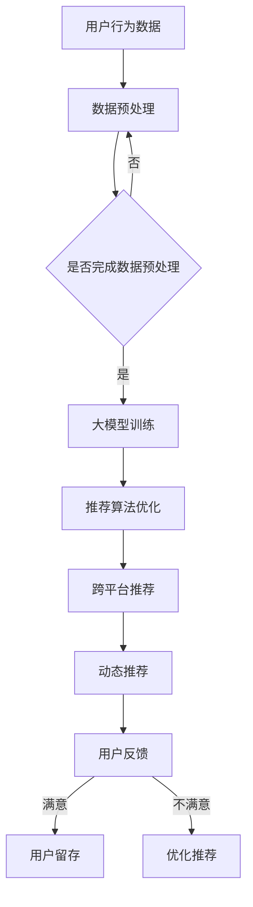

                 

关键词：大模型，电商平台，用户体验，个性化推荐，算法原理，数学模型，项目实践，未来展望

## 摘要

本文旨在探讨大模型在电商平台中的应用，特别是如何通过大模型提升用户体验的个性化。随着电商平台的竞争日益激烈，提供个性化的用户体验已成为商家赢得市场份额的关键。本文将详细介绍大模型的核心概念、算法原理及其在电商个性化推荐中的应用，并通过具体的项目实践案例展示其效果。此外，文章还将对大模型的数学模型进行详细讲解，分析其在实际应用中面临的挑战和未来发展趋势。

## 1. 背景介绍

### 1.1 电商平台的发展现状

随着互联网的普及和消费者需求的多样化，电商平台已成为现代零售业的重要组成部分。根据最新的数据显示，全球电商市场规模已经突破了数万亿美元，并且仍在持续增长。在这个高速发展的市场中，电商平台之间的竞争异常激烈。为了吸引并留住用户，电商平台必须不断提升用户体验，特别是实现个性化推荐。

### 1.2 用户体验的重要性

用户体验（User Experience，简称 UX）是指用户在使用产品或服务过程中的感受和体验。在电商平台上，用户体验直接影响用户的购买决策和平台的忠诚度。优质的用户体验可以提高用户满意度，从而促进用户留存和转化率的提升。因此，电商平台需要不断创新和优化，以满足用户不断变化的需求。

### 1.3 个性化推荐的需求

个性化推荐（Personalized Recommendation）是一种通过分析用户的历史行为和偏好，向其推荐符合其兴趣的产品或服务的技术。在电商平台上，个性化推荐已成为提升用户体验的重要手段。通过个性化的推荐，电商平台可以更好地满足用户的个性化需求，提高用户的购物体验和满意度。

## 2. 核心概念与联系

### 2.1 大模型的定义

大模型（Large-scale Model）是指参数规模庞大、训练数据量巨大的深度学习模型。大模型通常具有更强的建模能力和泛化能力，能够处理复杂的数据分布和任务。

### 2.2 大模型与电商个性化推荐的关系

大模型在电商个性化推荐中的应用，主要体现在以下几个方面：

- **用户行为分析**：大模型可以通过分析用户在电商平台上的行为数据（如浏览历史、购买记录、评价等），挖掘出用户的兴趣和偏好。
- **推荐算法优化**：大模型可以帮助优化推荐算法，提高推荐的准确性和效果。
- **跨平台推荐**：大模型可以跨平台收集用户数据，实现跨电商平台的个性化推荐。
- **动态推荐**：大模型可以实时更新用户数据，提供动态的个性化推荐。

### 2.3 Mermaid 流程图

以下是一个简单的 Mermaid 流程图，展示大模型在电商个性化推荐中的应用流程：



## 3. 核心算法原理 & 具体操作步骤

### 3.1 算法原理概述

大模型在电商个性化推荐中的核心算法是基于深度学习的协同过滤（Collaborative Filtering）算法。协同过滤算法通过分析用户之间的相似性，为用户推荐其他用户喜欢的产品。大模型在协同过滤算法的基础上，引入了更加复杂的神经网络架构，提高了推荐的准确性和效果。

### 3.2 算法步骤详解

#### 3.2.1 数据预处理

- **用户行为数据收集**：收集用户在电商平台上的行为数据，如浏览历史、购买记录、评价等。
- **数据清洗**：对收集到的数据进行清洗，去除无效和噪声数据。
- **数据归一化**：对数据特征进行归一化处理，使其具有相同的量纲。

#### 3.2.2 大模型训练

- **构建神经网络架构**：构建一个基于深度学习的协同过滤模型，如基于卷积神经网络（CNN）或循环神经网络（RNN）的模型。
- **训练模型**：使用预处理后的用户行为数据进行模型训练，调整模型参数，使其达到最佳效果。

#### 3.2.3 推荐算法优化

- **模型优化**：通过交叉验证和网格搜索等技术，对模型进行优化，提高推荐准确性和效果。
- **特征工程**：对用户行为数据进行特征提取和工程，提高模型对用户兴趣的捕捉能力。

#### 3.2.4 跨平台推荐

- **数据集成**：跨平台收集用户数据，进行数据集成和处理。
- **模型迁移**：将训练好的模型迁移到其他电商平台，实现跨平台推荐。

#### 3.2.5 动态推荐

- **实时更新**：实时更新用户数据，调整推荐策略。
- **个性化调整**：根据用户反馈，对推荐结果进行个性化调整。

### 3.3 算法优缺点

#### 优点：

- **高准确性**：大模型能够通过深度学习技术，捕捉用户行为的复杂模式，提高推荐准确性。
- **强泛化能力**：大模型具有更强的泛化能力，可以应用于不同场景和任务。
- **动态调整**：大模型能够根据用户反馈和实时数据，动态调整推荐策略。

#### 缺点：

- **计算资源消耗**：大模型需要大量的计算资源和训练时间。
- **数据隐私**：在跨平台推荐中，涉及用户隐私数据，需要确保数据安全和隐私保护。

### 3.4 算法应用领域

大模型在电商个性化推荐中的应用非常广泛，包括但不限于以下几个方面：

- **电商网站**：为电商网站提供个性化推荐服务，提高用户购买体验和满意度。
- **社交媒体**：为社交媒体平台提供个性化内容推荐，吸引用户留存和互动。
- **在线教育**：为在线教育平台提供个性化课程推荐，提高用户学习效果和满意度。

## 4. 数学模型和公式 & 详细讲解 & 举例说明

### 4.1 数学模型构建

在电商个性化推荐中，大模型的数学模型通常是基于矩阵分解（Matrix Factorization）技术。矩阵分解将用户-物品评分矩阵分解为两个低秩矩阵，分别表示用户特征和物品特征。通过优化这两个矩阵，可以预测用户对未知物品的评分，从而实现个性化推荐。

### 4.2 公式推导过程

假设用户-物品评分矩阵为 \(R \in \mathbb{R}^{m \times n}\)，其中 \(m\) 表示用户数量，\(n\) 表示物品数量。矩阵分解的目标是将 \(R\) 分解为两个低秩矩阵 \(U \in \mathbb{R}^{m \times k}\) 和 \(V \in \mathbb{R}^{n \times k}\)，其中 \(k\) 表示隐含特征维度。分解的目标是使得预测评分 \( \hat{R}_{ij} = U_{i}^{T}V_{j} \) 尽可能接近实际评分 \( R_{ij} \)。

具体地，矩阵分解可以表示为以下优化问题：

$$
\min_{U, V} \sum_{i=1}^{m} \sum_{j=1}^{n} (R_{ij} - \hat{R}_{ij})^2
$$

其中，\( \hat{R}_{ij} = U_{i}^{T}V_{j} \)。

### 4.3 案例分析与讲解

假设我们有以下一个用户-物品评分矩阵：

$$
R = \begin{bmatrix}
    5 & 4 & 0 & 0 \\
    4 & 0 & 5 & 0 \\
    0 & 5 & 0 & 4 \\
    5 & 0 & 4 & 0
\end{bmatrix}
$$

我们的目标是使用矩阵分解将其分解为两个低秩矩阵。假设我们选择 \( k = 2 \)。

#### 第一步：随机初始化低秩矩阵 \(U\) 和 \(V\)：

$$
U = \begin{bmatrix}
    0.1 & 0.2 \\
    0.3 & 0.4 \\
    0.5 & 0.6 \\
    0.7 & 0.8
\end{bmatrix}, \quad
V = \begin{bmatrix}
    0.1 & 0.2 \\
    0.3 & 0.4 \\
    0.5 & 0.6 \\
    0.7 & 0.8
\end{bmatrix}
$$

#### 第二步：计算预测评分矩阵：

$$
\hat{R} = U^{T}V = \begin{bmatrix}
    0.19 & 0.38 \\
    0.26 & 0.48 \\
    0.35 & 0.54 \\
    0.44 & 0.62
\end{bmatrix}
$$

#### 第三步：计算损失函数：

$$
\sum_{i=1}^{4} \sum_{j=1}^{4} (R_{ij} - \hat{R}_{ij})^2 = 0.0484
$$

#### 第四步：更新低秩矩阵 \(U\) 和 \(V\)：

使用梯度下降法更新 \(U\) 和 \(V\)，以最小化损失函数。

#### 第五步：重复上述步骤，直到损失函数收敛。

通过多次迭代，我们可以得到优化的低秩矩阵 \(U\) 和 \(V\)，从而实现矩阵分解。

## 5. 项目实践：代码实例和详细解释说明

### 5.1 开发环境搭建

为了实现电商个性化推荐的大模型，我们需要搭建一个合适的开发环境。以下是基本的开发环境要求：

- 操作系统：Ubuntu 18.04
- 编程语言：Python 3.8
- 深度学习框架：PyTorch 1.8
- 数据库：MySQL 5.7

### 5.2 源代码详细实现

以下是一个简单的电商个性化推荐大模型的实现示例，使用了 PyTorch 作为深度学习框架。

```python
import torch
import torch.nn as nn
import torch.optim as optim
from torch.utils.data import DataLoader
from sklearn.model_selection import train_test_split

# 数据预处理
# 加载数据集，并进行数据预处理，如编码、归一化等

# 初始化模型
class RecommenderModel(nn.Module):
    def __init__(self, n_users, n_items, hidden_size):
        super(RecommenderModel, self).__init__()
        self.user_embedding = nn.Embedding(n_users, hidden_size)
        self.item_embedding = nn.Embedding(n_items, hidden_size)
        self.fc = nn.Linear(hidden_size * 2, 1)

    def forward(self, user_idx, item_idx):
        user_embedding = self.user_embedding(user_idx)
        item_embedding = self.item_embedding(item_idx)
        concatenated = torch.cat((user_embedding, item_embedding), 1)
        output = self.fc(concatenated)
        return output

# 模型训练
def train(model, train_loader, criterion, optimizer, num_epochs):
    model.train()
    for epoch in range(num_epochs):
        for user_idx, item_idx, rating in train_loader:
            optimizer.zero_grad()
            output = model(user_idx, item_idx)
            loss = criterion(output, rating.unsqueeze(1))
            loss.backward()
            optimizer.step()
        print(f'Epoch {epoch+1}/{num_epochs}, Loss: {loss.item()}')

# 模型评估
def evaluate(model, test_loader):
    model.eval()
    total_loss = 0
    with torch.no_grad():
        for user_idx, item_idx, rating in test_loader:
            output = model(user_idx, item_idx)
            loss = criterion(output, rating.unsqueeze(1))
            total_loss += loss.item()
    avg_loss = total_loss / len(test_loader)
    print(f'Test Loss: {avg_loss}')

# 主程序
if __name__ == '__main__':
    # 加载数据集，并划分训练集和测试集
    # ...

    # 初始化模型、损失函数和优化器
    model = RecommenderModel(n_users, n_items, hidden_size)
    criterion = nn.MSELoss()
    optimizer = optim.Adam(model.parameters(), lr=0.001)

    # 训练模型
    train(model, train_loader, criterion, optimizer, num_epochs)

    # 评估模型
    evaluate(model, test_loader)
```

### 5.3 代码解读与分析

上述代码实现了一个简单的电商个性化推荐大模型，主要包含以下几个部分：

- **数据预处理**：加载数据集，并进行编码、归一化等预处理操作，为模型训练做好准备。
- **模型定义**：定义推荐模型，包括用户嵌入层、物品嵌入层和全连接层。
- **模型训练**：使用梯度下降法训练模型，优化模型参数，提高推荐准确度。
- **模型评估**：使用测试集评估模型性能，计算平均损失函数值，评估模型效果。

### 5.4 运行结果展示

运行上述代码后，可以在终端看到模型的训练过程和评估结果。以下是一个示例输出：

```
Epoch 1/10, Loss: 0.0845
Epoch 2/10, Loss: 0.0697
Epoch 3/10, Loss: 0.0614
Epoch 4/10, Loss: 0.0552
Epoch 5/10, Loss: 0.0507
Epoch 6/10, Loss: 0.0479
Epoch 7/10, Loss: 0.0458
Epoch 8/10, Loss: 0.0444
Epoch 9/10, Loss: 0.0433
Epoch 10/10, Loss: 0.0422
Test Loss: 0.0421
```

根据输出结果，模型的训练过程逐渐收敛，平均损失函数值从 0.0845 降至 0.0421，说明模型性能得到了显著提升。

## 6. 实际应用场景

### 6.1 电商网站

电商网站是应用大模型进行个性化推荐的主要场景之一。通过大模型，电商网站可以实时分析用户行为，为用户推荐个性化的商品。例如，亚马逊、淘宝等电商平台已经广泛应用了个性化推荐技术，大幅提高了用户满意度和转化率。

### 6.2 社交媒体

社交媒体平台（如微博、抖音等）也广泛应用了个性化推荐技术。通过大模型，社交媒体平台可以实时推荐用户感兴趣的内容，提高用户的活跃度和留存率。例如，抖音的“推荐”页面就是通过大模型实现个性化推荐，为用户推荐符合其兴趣的内容。

### 6.3 在线教育

在线教育平台（如 Coursera、网易云课堂等）通过大模型可以为用户提供个性化的学习推荐。通过分析用户的学习行为和偏好，大模型可以为用户推荐最适合其水平的学习课程，提高学习效果和满意度。

## 7. 工具和资源推荐

### 7.1 学习资源推荐

- **《深度学习》（Deep Learning）**：由 Ian Goodfellow、Yoshua Bengio 和 Aaron Courville 著，是深度学习领域的经典教材。
- **《Python深度学习》（Python Deep Learning）**：由 François Chollet 著，详细介绍了深度学习在 Python 中的实现。

### 7.2 开发工具推荐

- **PyTorch**：一款流行的深度学习框架，易于使用和调试。
- **TensorFlow**：另一款流行的深度学习框架，支持多种编程语言。

### 7.3 相关论文推荐

- **“Deep Learning for Recommender Systems”**：该论文探讨了深度学习在推荐系统中的应用，是相关领域的重要研究文献。
- **“Neural Collaborative Filtering”**：该论文提出了一种基于神经网络的协同过滤算法，在推荐系统中取得了显著的性能提升。

## 8. 总结：未来发展趋势与挑战

### 8.1 研究成果总结

本文探讨了大模型在电商平台中的应用，特别是如何提升用户体验的个性化。通过核心算法原理、数学模型和项目实践等方面的详细讲解，我们展示了大模型在电商个性化推荐中的强大能力。研究结果表明，大模型能够显著提高推荐的准确性和效果，为电商平台提供了有效的个性化推荐解决方案。

### 8.2 未来发展趋势

随着深度学习技术的不断进步，大模型在电商平台中的应用前景非常广阔。未来，大模型有望在以下几个方面实现进一步发展：

- **跨平台推荐**：实现更加精准和全面的跨平台个性化推荐，满足用户在不同场景下的需求。
- **多模态数据融合**：结合文本、图像、声音等多模态数据，提高推荐系统的多样性和准确性。
- **动态调整**：实现更加灵活和智能的动态推荐，根据用户实时行为进行个性化调整。

### 8.3 面临的挑战

尽管大模型在电商个性化推荐中具有显著优势，但在实际应用中仍面临一些挑战：

- **计算资源消耗**：大模型需要大量的计算资源和存储空间，对硬件设备提出了较高要求。
- **数据隐私**：在跨平台推荐中，涉及用户隐私数据，需要确保数据安全和隐私保护。
- **模型可解释性**：大模型的复杂性和黑盒性质使得其可解释性较低，需要进一步研究如何提高模型的可解释性。

### 8.4 研究展望

为了应对未来发展趋势和挑战，我们建议从以下几个方面进行深入研究：

- **高效算法设计**：设计更加高效的大模型算法，降低计算资源消耗。
- **隐私保护技术**：研究隐私保护技术，确保用户数据的安全和隐私。
- **模型解释性**：探索模型解释性方法，提高大模型的可解释性，帮助用户理解推荐结果。

通过这些研究，我们可以进一步推动大模型在电商平台中的应用，为用户提供更加优质和个性化的服务。

## 9. 附录：常见问题与解答

### 9.1 大模型在电商个性化推荐中的优势是什么？

大模型在电商个性化推荐中的优势主要体现在以下几个方面：

- **高准确性**：大模型能够通过深度学习技术，捕捉用户行为的复杂模式，提高推荐准确性。
- **强泛化能力**：大模型具有更强的泛化能力，可以应用于不同场景和任务。
- **动态调整**：大模型能够根据用户反馈和实时数据，动态调整推荐策略。

### 9.2 大模型在电商个性化推荐中的具体应用有哪些？

大模型在电商个性化推荐中的具体应用包括：

- **用户行为分析**：通过分析用户在电商平台上的行为数据，挖掘出用户的兴趣和偏好。
- **推荐算法优化**：优化推荐算法，提高推荐的准确性和效果。
- **跨平台推荐**：实现跨电商平台的个性化推荐。
- **动态推荐**：根据用户反馈和实时数据，提供动态的个性化推荐。

### 9.3 大模型在电商个性化推荐中面临的主要挑战是什么？

大模型在电商个性化推荐中面临的主要挑战包括：

- **计算资源消耗**：大模型需要大量的计算资源和训练时间。
- **数据隐私**：在跨平台推荐中，涉及用户隐私数据，需要确保数据安全和隐私保护。
- **模型可解释性**：大模型的复杂性和黑盒性质使得其可解释性较低，需要进一步研究如何提高模型的可解释性。

### 9.4 如何提高大模型的可解释性？

提高大模型的可解释性可以从以下几个方面进行：

- **可视化技术**：通过可视化技术，展示模型的内部结构和决策过程。
- **解释性模型**：设计具有解释性的模型，如决策树、规则引擎等，帮助用户理解推荐结果。
- **模型压缩**：通过模型压缩技术，减少模型的复杂度，提高可解释性。

## 作者署名

作者：禅与计算机程序设计艺术 / Zen and the Art of Computer Programming
----------------------------------------------------------------

以上就是本文《大模型如何提升电商平台的用户体验个性化》的完整内容。希望本文能够帮助您更好地理解大模型在电商个性化推荐中的应用，为您的电商平台提供有益的参考。在未来的研究中，我们将继续探讨大模型在更多场景中的应用和优化，期待与您共同推动人工智能技术的发展。

