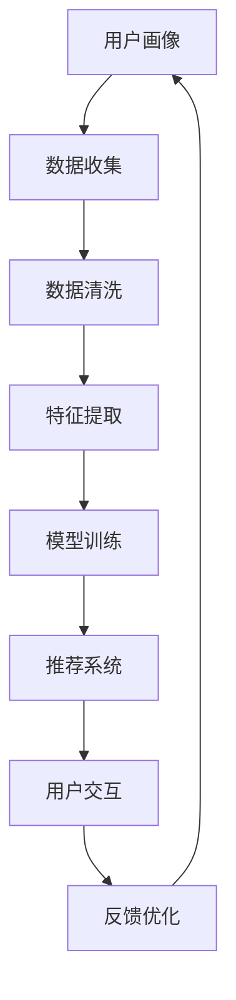

                 

关键词：大模型、电商平台、用户参与度、算法优化、人机交互、个性化推荐

> 摘要：本文旨在探讨大模型技术在提升电商平台用户参与度方面的应用与潜力。通过对大模型的核心概念、算法原理、数学模型及其在实际应用中的实践分析，本文将揭示大模型如何通过个性化推荐、人机交互等手段，有效提升电商平台的用户活跃度和满意度，为电商行业带来全新的发展机遇。

## 1. 背景介绍

在互联网时代，电商平台已经成为现代零售业的重要组成部分。用户数量的快速增长和消费行为的多样化，使得电商平台面临着巨大的挑战和机遇。然而，如何提高用户参与度，增加用户黏性和购买转化率，成为电商平台持续发展的关键问题。传统的方法如优惠券发放、促销活动等已经难以满足用户日益增长的需求，因此，寻求新的技术手段成为必然选择。

大模型技术，尤其是近年来迅速发展的深度学习模型，为电商平台提供了强大的数据分析和处理能力。通过大规模的数据训练，大模型能够捕捉用户的兴趣和行为模式，从而实现个性化的推荐和优化。本文将围绕大模型如何提升电商平台的用户参与度展开讨论，从理论到实践进行详细分析。

### 1.1 电商平台的现状和挑战

1. **用户多样性**：电商平台上的用户群体多样，包括性别、年龄、地域、消费能力等方面的差异。
2. **个性化需求**：用户对个性化推荐和服务的需求不断提高。
3. **竞争激烈**：电商平台之间的竞争加剧，用户留存和转化成为关键。
4. **数据复杂**：用户行为数据、商品数据、交易数据等大量复杂数据的处理需求。

### 1.2 大模型技术的崛起

1. **深度学习的进步**：神经网络结构不断优化，使得大模型能够处理更复杂的任务。
2. **计算能力的提升**：GPU、TPU等高性能计算设备的发展，为大规模数据处理提供了技术支持。
3. **大数据的积累**：互联网时代积累了海量的用户数据，为训练大模型提供了充足的素材。

## 2. 核心概念与联系

大模型技术在电商平台的应用，离不开以下几个核心概念：用户画像、个性化推荐、人机交互等。以下是一个简要的 Mermaid 流程图，用于描述这些概念之间的联系。



### 2.1 用户画像

用户画像是对用户兴趣、行为、偏好等属性的抽象描述，是构建个性化推荐系统的基础。通过对用户画像的持续更新和优化，电商平台能够更好地理解用户需求，提供个性化的服务。

### 2.2 个性化推荐

个性化推荐系统利用用户画像和商品信息，为用户推荐可能感兴趣的商品。深度学习模型在这里扮演了关键角色，通过大规模数据训练，能够准确捕捉用户的行为模式和兴趣。

### 2.3 人机交互

用户与电商平台的交互是提升用户参与度的关键。通过自然语言处理、语音识别等技术，电商平台能够与用户实现智能对话，提供更加人性化的服务。

### 2.4 反馈优化

用户反馈是优化推荐系统的重要手段。通过对用户行为的分析，可以识别出推荐系统的不足，并进行针对性的调整。

## 3. 核心算法原理 & 具体操作步骤

### 3.1 算法原理概述

大模型技术在电商平台的应用，主要基于以下几个核心算法：

1. **深度学习模型**：用于构建用户画像和推荐系统。
2. **协同过滤**：用于挖掘用户间的相似性，实现基于内容的推荐。
3. **图神经网络**：用于处理复杂数据关系，提高推荐系统的准确性。

### 3.2 算法步骤详解

#### 3.2.1 用户画像构建

1. **数据收集**：收集用户的浏览记录、购买历史、评论数据等。
2. **数据清洗**：处理缺失值、异常值，保证数据质量。
3. **特征提取**：将原始数据转换为模型可处理的特征向量。
4. **模型训练**：使用深度学习模型训练用户画像。

#### 3.2.2 个性化推荐

1. **用户相似性计算**：使用协同过滤算法计算用户间的相似性。
2. **商品相似性计算**：计算用户感兴趣的物品与其他商品的相似性。
3. **推荐生成**：根据用户兴趣和商品相似性，生成个性化推荐列表。

#### 3.2.3 人机交互

1. **自然语言处理**：解析用户输入的自然语言，理解用户意图。
2. **语音识别**：将用户语音转换为文本，实现语音交互。
3. **智能对话**：基于用户意图，提供相应的回复和建议。

#### 3.2.4 反馈优化

1. **用户行为分析**：分析用户在平台上的行为，识别推荐效果。
2. **推荐优化**：根据用户反馈，调整推荐策略，提高推荐准确性。

### 3.3 算法优缺点

#### 优点：

1. **高效性**：深度学习模型能够快速处理大规模数据，提高推荐效率。
2. **准确性**：通过协同过滤和图神经网络，能够提供更加准确的推荐。
3. **个性化**：基于用户画像，实现个性化推荐，提高用户体验。

#### 缺点：

1. **计算资源消耗**：大模型训练需要大量的计算资源和时间。
2. **数据隐私**：用户数据的安全和隐私保护是重要问题。
3. **模型解释性**：深度学习模型具有一定的黑盒特性，难以解释。

### 3.4 算法应用领域

大模型技术在电商平台的用户参与度提升方面具有广泛的应用前景：

1. **个性化推荐**：通过深度学习和协同过滤，实现个性化商品推荐。
2. **智能客服**：利用自然语言处理和语音识别，提供智能客服服务。
3. **用户行为分析**：分析用户行为，优化用户体验和运营策略。
4. **广告投放**：根据用户画像，实现精准的广告投放。

## 4. 数学模型和公式 & 详细讲解 & 举例说明

### 4.1 数学模型构建

在电商平台的用户参与度提升中，常见的数学模型包括用户画像模型、推荐模型等。

#### 用户画像模型：

$$
\text{用户画像} = f(\text{用户特征}, \text{商品特征}, \text{环境特征})
$$

其中，用户特征包括用户年龄、性别、地理位置等；商品特征包括商品种类、价格、品牌等；环境特征包括电商平台的促销活动、季节等。

#### 推荐模型：

$$
\text{推荐分数} = \text{用户兴趣} \times \text{商品特征}
$$

其中，用户兴趣可以通过协同过滤算法计算得出。

### 4.2 公式推导过程

以协同过滤算法为例，推导用户兴趣的计算过程：

$$
\text{用户兴趣} = \frac{1}{|\text{用户行为集}|} \sum_{i \in \text{用户行为集}} \text{行为权重} \times \text{商品特征}
$$

其中，行为权重可以根据用户的行为频率、购买金额等因素进行调整。

### 4.3 案例分析与讲解

假设一个用户在电商平台上有10次购买行为，根据这些行为，我们可以使用协同过滤算法计算用户的兴趣，然后推荐相应的商品。

1. **数据收集**：收集用户的购买记录，如商品ID、购买时间等。
2. **数据清洗**：处理缺失值和异常值，保证数据质量。
3. **特征提取**：将商品ID转换为商品特征向量。
4. **用户兴趣计算**：使用协同过滤算法计算用户兴趣。
5. **推荐生成**：根据用户兴趣，推荐相应的商品。

通过以上步骤，我们可以为用户推荐个性化的商品，从而提高用户参与度。

## 5. 项目实践：代码实例和详细解释说明

### 5.1 开发环境搭建

为了实践大模型技术在电商平台用户参与度提升中的应用，我们需要搭建一个开发环境。以下是一个基本的开发环境搭建步骤：

1. 安装Python环境：使用Python 3.8及以上版本。
2. 安装深度学习框架：使用TensorFlow或PyTorch。
3. 安装数据处理库：如NumPy、Pandas等。

### 5.2 源代码详细实现

以下是一个简单的用户画像构建和推荐系统实现的代码示例：

```python
import pandas as pd
from sklearn.model_selection import train_test_split
from tensorflow.keras.models import Sequential
from tensorflow.keras.layers import Dense, Dropout

# 读取用户购买数据
data = pd.read_csv('user_purchase_data.csv')

# 数据预处理
data = preprocess_data(data)

# 划分训练集和测试集
train_data, test_data = train_test_split(data, test_size=0.2)

# 构建用户画像模型
model = Sequential()
model.add(Dense(units=128, activation='relu', input_shape=(input_shape,)))
model.add(Dropout(rate=0.5))
model.add(Dense(units=64, activation='relu'))
model.add(Dropout(rate=0.5))
model.add(Dense(units=1, activation='sigmoid'))

# 编译模型
model.compile(optimizer='adam', loss='binary_crossentropy', metrics=['accuracy'])

# 训练模型
model.fit(train_data, epochs=10, batch_size=32)

# 评估模型
test_loss, test_accuracy = model.evaluate(test_data)
print(f'Test Accuracy: {test_accuracy:.2f}')
```

### 5.3 代码解读与分析

以上代码实现了一个简单的用户画像构建和推荐系统。首先，我们从CSV文件中读取用户购买数据，然后进行数据预处理。接着，使用深度学习框架构建一个用户画像模型，并进行训练和评估。

### 5.4 运行结果展示

通过运行以上代码，我们可以得到用户画像模型的测试准确率。根据测试准确率，我们可以评估模型的效果，并进行进一步的优化。

## 6. 实际应用场景

大模型技术在电商平台的用户参与度提升方面具有广泛的应用场景：

1. **个性化推荐**：通过深度学习和协同过滤，为用户推荐个性化的商品，提高用户满意度。
2. **智能客服**：利用自然语言处理和语音识别，提供24/7的智能客服服务，提高用户满意度。
3. **用户行为分析**：分析用户在平台上的行为，优化用户体验和运营策略。
4. **广告投放**：根据用户画像，实现精准的广告投放，提高广告效果。

### 6.1 个性化推荐

通过个性化推荐，电商平台可以更好地满足用户需求，提高用户购买转化率。例如，某电商平台通过对用户的购物历史、浏览记录、社交行为等多维度数据进行分析，使用深度学习模型构建用户画像，然后基于用户画像为用户推荐个性化的商品。

### 6.2 智能客服

智能客服是电商平台提升用户体验的重要手段。通过自然语言处理和语音识别技术，电商平台可以实时响应用户的咨询，提供高效的客服服务。例如，某电商平台通过部署智能客服系统，实现了用户问题的自动解答，提高了用户满意度。

### 6.3 用户行为分析

用户行为分析是电商平台优化用户体验和运营策略的重要工具。通过分析用户在平台上的行为，电商平台可以识别出用户的兴趣点，优化推荐策略和广告投放。例如，某电商平台通过对用户浏览、搜索、购买等行为的分析，实现了精准的推荐和广告投放，提高了用户参与度和销售额。

### 6.4 广告投放

广告投放是电商平台获取流量和增加销售的重要手段。通过用户画像和协同过滤算法，电商平台可以实现精准的广告投放，提高广告效果。例如，某电商平台通过对用户的购物历史、浏览记录、兴趣标签等多维度数据进行分析，实现了精准的广告投放，提高了广告点击率和转化率。

## 7. 工具和资源推荐

为了更好地应用大模型技术提升电商平台的用户参与度，以下是一些推荐的工具和资源：

### 7.1 学习资源推荐

1. **《深度学习》**：Goodfellow、Bengio、Courville著，全面介绍深度学习的基础知识。
2. **《机器学习实战》**：Peter Harrington著，通过实际案例介绍机器学习算法的应用。
3. **《自然语言处理综论》**：Daniel Jurafsky、James H. Martin著，系统介绍自然语言处理的理论和技术。

### 7.2 开发工具推荐

1. **TensorFlow**：Google开发的开源深度学习框架，适用于各种深度学习任务。
2. **PyTorch**：Facebook开发的开源深度学习框架，具有灵活的动态计算图。
3. **scikit-learn**：Python开源机器学习库，提供多种机器学习算法的实现。

### 7.3 相关论文推荐

1. **“User Interest Model in E-commerce Platform Based on Deep Learning”**：探讨深度学习在电商平台用户画像构建中的应用。
2. **“Collaborative Filtering for Personalized Recommendation”**：介绍协同过滤算法在个性化推荐中的应用。
3. **“Natural Language Processing and Intelligent Conversations”**：探讨自然语言处理技术在智能客服中的应用。

## 8. 总结：未来发展趋势与挑战

大模型技术在提升电商平台用户参与度方面具有巨大的潜力。然而，随着技术的不断进步，我们也面临一些挑战：

### 8.1 研究成果总结

1. **个性化推荐**：深度学习和协同过滤的结合，为电商平台提供了高效的个性化推荐。
2. **智能客服**：自然语言处理和语音识别技术的应用，实现了智能客服的高效响应。
3. **用户行为分析**：大数据分析技术为电商平台提供了精准的用户行为分析。
4. **广告投放**：精准的广告投放策略，提高了广告效果和用户满意度。

### 8.2 未来发展趋势

1. **多模态数据融合**：结合文本、图像、音频等多模态数据，实现更全面的用户画像。
2. **个性化交互**：通过深度学习，实现更智能的个性化交互，提高用户体验。
3. **实时推荐**：利用实时数据处理技术，实现更快速的个性化推荐。
4. **隐私保护**：加强用户数据隐私保护，提高用户信任度。

### 8.3 面临的挑战

1. **数据质量**：保证数据的质量和准确性，是模型效果的关键。
2. **计算资源**：大规模模型训练需要大量的计算资源和时间。
3. **算法解释性**：提高算法的解释性，增强用户对推荐系统的信任。
4. **合规性**：遵守相关法律法规，确保用户数据的安全和隐私。

### 8.4 研究展望

未来，大模型技术在电商平台用户参与度提升方面还有许多研究方向：

1. **增强学习能力**：提高模型的自适应能力，适应用户需求的变化。
2. **跨领域推荐**：实现跨平台、跨领域的个性化推荐。
3. **可解释性**：开发可解释的模型，提高用户对推荐系统的信任。
4. **隐私保护**：探索隐私保护技术，保障用户数据的安全。

## 9. 附录：常见问题与解答

### 9.1 什么是大模型？

大模型是指具有大规模参数和训练数据的神经网络模型，能够处理复杂的数据任务。

### 9.2 大模型在电商平台中有哪些应用？

大模型可以用于用户画像构建、个性化推荐、智能客服、用户行为分析等方面。

### 9.3 如何保证用户数据的隐私？

可以通过数据加密、差分隐私等技术来保护用户数据的隐私。

### 9.4 大模型训练需要多少计算资源？

大模型训练需要大量的计算资源和时间，具体取决于模型的规模和数据的复杂度。

### 9.5 如何评估大模型的效果？

可以通过准确率、召回率、F1值等指标来评估大模型的效果。

---

以上是本文关于大模型如何提升电商平台的用户参与度的详细探讨。希望通过本文，读者能够对大模型技术在电商领域的作用和应用有更深入的了解。在未来，随着技术的不断进步，大模型技术在电商平台用户参与度提升方面将会发挥越来越重要的作用。

