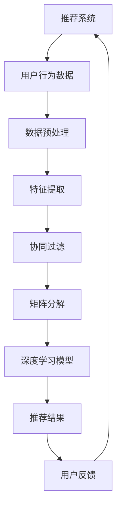

                 

关键词：推荐系统、大模型、个性化、算法、深度学习、数据挖掘、用户行为分析、机器学习

## 摘要

本文主要探讨大模型在推荐系统中的重要作用，特别是其对推荐系统个性化程度的提升。通过分析大模型的工作原理及其在推荐系统中的应用，我们揭示了如何利用大模型实现更精准、更有效的个性化推荐。文章首先回顾了推荐系统的发展历程和核心算法，然后深入探讨了大模型的特点及其优势。接下来，我们详细介绍了大模型在推荐系统中的具体应用场景，并通过实际案例展示了其带来的显著效果。最后，我们对大模型在未来推荐系统发展中的潜在影响进行了展望，并提出了可能面临的挑战。

## 1. 背景介绍

推荐系统是当今互联网领域中不可或缺的一部分，它广泛应用于电子商务、社交媒体、在线视频和音乐平台等多个领域。推荐系统通过分析用户的历史行为和偏好，为用户推荐他们可能感兴趣的商品、内容或服务。这种个性化推荐不仅可以提高用户体验，还可以显著提升业务指标，如销售额、用户活跃度和用户留存率。

### 推荐系统的发展历程

推荐系统的发展可以分为几个阶段：

1. **基于内容的推荐**：早期的推荐系统主要基于物品的特征和用户的历史行为进行推荐。这种方法简单直观，但容易受到数据稀疏性和冷启动问题的影响。

2. **协同过滤推荐**：协同过滤推荐通过分析用户之间的相似性来预测用户对未知物品的偏好。基于用户的协同过滤（User-Based）和基于模型的协同过滤（Model-Based）是两种主要的协同过滤方法。

3. **混合推荐**：混合推荐将多种推荐方法结合起来，以综合优点，克服单一方法的局限性。

4. **基于模型的推荐**：随着机器学习技术的发展，基于模型的推荐方法，如矩阵分解、潜在因子模型等，逐渐成为主流。这些方法通过学习用户和物品之间的潜在关系来提高推荐效果。

5. **深度学习推荐**：近年来，深度学习技术在推荐系统中的应用越来越广泛。通过使用神经网络等深度学习模型，推荐系统可以实现更复杂的特征提取和关系建模，从而实现更精准的推荐。

### 推荐系统的核心算法

推荐系统的核心算法主要包括以下几种：

1. **基于内容的推荐算法**：基于内容的推荐算法通过分析物品的特征和用户的历史行为，将相似的内容推荐给用户。

2. **协同过滤算法**：协同过滤算法通过分析用户之间的相似性来预测用户对未知物品的偏好。常见的协同过滤算法有User-Based和Item-Based两种。

3. **矩阵分解和潜在因子模型**：矩阵分解和潜在因子模型通过将用户和物品表示为低维向量，以捕获它们之间的潜在关系。

4. **深度学习推荐算法**：深度学习推荐算法，如DNN、RNN和Transformer等，通过使用神经网络等深度学习模型，实现更复杂的特征提取和关系建模。

## 2. 核心概念与联系

### 大模型的特点

大模型是指具有巨大参数量和计算能力的深度学习模型。它们通常通过大规模的数据集进行训练，能够捕捉到复杂的数据特征和关系。大模型的主要特点包括：

1. **参数量巨大**：大模型通常包含数十亿甚至数万亿个参数，这使得它们能够处理海量数据。

2. **计算资源需求大**：由于参数量巨大，大模型对计算资源的需求也非常高，需要强大的计算能力和大量的存储空间。

3. **泛化能力强**：大模型通过大规模数据训练，能够很好地泛化到未见过的数据上，从而实现更广泛的适用性。

### 大模型与推荐系统的联系

大模型在推荐系统中的应用主要体现在以下几个方面：

1. **特征提取**：大模型能够自动提取数据中的复杂特征，从而提高推荐的准确性。

2. **关系建模**：大模型能够学习用户和物品之间的潜在关系，从而实现更精准的推荐。

3. **模型泛化**：大模型通过大规模数据训练，能够更好地泛化到新的用户和物品上，从而提高推荐系统的适应性和灵活性。

### Mermaid 流程图



在这个流程图中，推荐系统首先收集用户行为数据，然后通过数据预处理和特征提取步骤，提取出有用的特征。接着，采用协同过滤和矩阵分解等传统推荐算法进行初步推荐。最后，使用深度学习模型对推荐结果进行优化和提升，从而实现更精准的个性化推荐。

## 3. 核心算法原理 & 具体操作步骤

### 3.1 算法原理概述

大模型在推荐系统中的应用主要基于深度学习技术，特别是基于神经网络的结构。深度学习模型通过多层次的神经网络结构，能够自动提取数据中的复杂特征和关系。以下是深度学习推荐系统的基本原理：

1. **输入层**：接收用户的行为数据和物品的特征数据。

2. **隐藏层**：通过神经网络结构，对输入数据进行特征提取和变换。

3. **输出层**：根据隐藏层的输出，预测用户对物品的偏好或评分。

4. **损失函数**：通过损失函数，评估模型预测结果与真实值之间的差距，并指导模型的优化过程。

5. **优化算法**：使用优化算法（如梯度下降），不断调整模型参数，以最小化损失函数。

### 3.2 算法步骤详解

1. **数据收集与预处理**：首先，收集用户的行为数据（如浏览记录、购买历史等）和物品的特征数据（如文本描述、类别标签等）。然后，对数据进行预处理，包括数据清洗、缺失值填充和数据标准化等。

2. **特征提取**：使用深度学习模型，对预处理后的数据进行特征提取。这一步骤可以自动学习数据中的复杂特征，从而提高推荐的准确性。

3. **模型构建**：构建深度学习模型，包括定义网络结构、选择激活函数和损失函数等。

4. **模型训练**：使用训练数据对模型进行训练，通过优化算法不断调整模型参数，以最小化损失函数。

5. **模型评估**：使用验证集对训练好的模型进行评估，检查模型的泛化能力。

6. **推荐生成**：使用训练好的模型，对新的用户行为数据生成推荐结果。

### 3.3 算法优缺点

**优点**：

1. **特征提取能力强**：深度学习模型能够自动提取数据中的复杂特征，从而提高推荐的准确性。

2. **适应性强**：深度学习模型能够通过大规模数据训练，实现更好的泛化能力，适应不同的用户和物品。

3. **灵活性高**：深度学习模型可以灵活地调整网络结构和超参数，以适应不同的推荐任务。

**缺点**：

1. **计算资源需求大**：深度学习模型通常需要大量的计算资源和时间进行训练，这对计算资源的要求较高。

2. **数据依赖性强**：深度学习模型的性能高度依赖于训练数据的质量和数量，如果数据质量不佳或数据量不足，可能会影响推荐效果。

### 3.4 算法应用领域

深度学习推荐算法在多个领域都有广泛的应用，包括：

1. **电子商务**：为用户推荐相关的商品。

2. **社交媒体**：为用户推荐感兴趣的内容和好友。

3. **在线视频和音乐平台**：为用户推荐相关的视频和音乐。

4. **新闻推荐**：为用户推荐感兴趣的新闻和文章。

## 4. 数学模型和公式 & 详细讲解 & 举例说明

### 4.1 数学模型构建

在深度学习推荐系统中，常用的数学模型是多层感知机（MLP）和卷积神经网络（CNN）。以下是一个基于MLP的简单推荐系统数学模型：

**输入层**：

$$
x_{i} = \left[ x_{i1}, x_{i2}, ..., x_{in} \right]^{T}
$$

其中，$x_{i}$表示第$i$个用户的特征向量，$n$表示特征的数量。

**隐藏层**：

$$
h_{ij} = \sigma \left( \theta_{i}^{T}x_{j} + b_{j} \right)
$$

其中，$h_{ij}$表示第$i$个用户在第$j$个隐藏层节点的激活值，$\sigma$是激活函数（如Sigmoid函数或ReLU函数），$\theta_{i}$是第$i$个用户的权重向量，$b_{j}$是第$j$个隐藏层节点的偏置。

**输出层**：

$$
y_{i} = \sigma \left( \theta_{o}^{T}h_{i} + b_{o} \right)
$$

其中，$y_{i}$表示第$i$个用户对物品的预测评分，$\theta_{o}$是输出层的权重向量，$b_{o}$是输出层的偏置。

### 4.2 公式推导过程

**损失函数**：

$$
L = -\sum_{i=1}^{N}y_{i}\log(y_{i}^{\prime})
$$

其中，$N$是用户的数量，$y_{i}$是第$i$个用户的真实评分，$y_{i}^{\prime}$是模型预测的评分。

**梯度下降**：

$$
\theta_{i} = \theta_{i} - \alpha \frac{\partial L}{\partial \theta_{i}}
$$

其中，$\alpha$是学习率，$\frac{\partial L}{\partial \theta_{i}}$是损失函数对$\theta_{i}$的梯度。

### 4.3 案例分析与讲解

假设我们有一个简单的用户-物品评分数据集，其中包含10个用户和5个物品。以下是一个基于MLP的简单推荐系统模型：

**输入层**：

$$
x_{1} = [1, 0, 1, 0, 0]^{T}, \quad x_{2} = [0, 1, 0, 1, 0]^{T}, \quad ..., \quad x_{10} = [1, 1, 1, 1, 1]^{T}
$$

**隐藏层**：

$$
h_{11} = \sigma \left( \theta_{1}^{T}x_{1} + b_{1} \right), \quad h_{12} = \sigma \left( \theta_{2}^{T}x_{2} + b_{2} \right), \quad ..., \quad h_{110} = \sigma \left( \theta_{10}^{T}x_{10} + b_{10} \right)
$$

**输出层**：

$$
y_{1} = \sigma \left( \theta_{o}^{T}h_{11} + b_{o} \right), \quad y_{2} = \sigma \left( \theta_{o}^{T}h_{12} + b_{o} \right), \quad ..., \quad y_{10} = \sigma \left( \theta_{o}^{T}h_{110} + b_{o} \right)
$$

**损失函数**：

$$
L = -\sum_{i=1}^{10}y_{i}\log(y_{i}^{\prime})
$$

**梯度下降**：

$$
\theta_{i} = \theta_{i} - \alpha \frac{\partial L}{\partial \theta_{i}}
$$

在这个案例中，我们可以使用Python中的TensorFlow库来实现这个模型。以下是相关的代码实现：

```python
import tensorflow as tf

# 定义输入层
x = tf.placeholder(tf.float32, shape=[None, 5])

# 定义隐藏层
h = tf.nn.sigmoid(tf.matmul(x, W1) + b1)

# 定义输出层
y = tf.nn.sigmoid(tf.matmul(h, W2) + b2)

# 定义损失函数
loss = -tf.reduce_sum(y * tf.log(y + 1e-10) + (1 - y) * tf.log(1 - y + 1e-10))

# 定义优化器
optimizer = tf.train.GradientDescentOptimizer(learning_rate=0.01)
train_op = optimizer.minimize(loss)

# 初始化变量
init = tf.global_variables_initializer()

# 开始训练
with tf.Session() as sess:
  sess.run(init)
  for i in range(1000):
    sess.run(train_op, feed_dict={x: x_data})
    if i % 100 == 0:
      print("Step:", i, "Loss:", sess.run(loss, feed_dict={x: x_data}))

  # 计算预测结果
  pred = sess.run(y, feed_dict={x: x_test})
  print("Predictions:", pred)
```

在这个代码中，我们首先定义了输入层、隐藏层和输出层，然后定义了损失函数和优化器。接着，我们初始化变量并开始训练模型。在训练过程中，我们每隔100个步骤打印一次损失函数的值，以便观察训练过程。最后，我们计算测试数据的预测结果。

## 5. 项目实践：代码实例和详细解释说明

在本节中，我们将通过一个具体的案例，展示如何使用深度学习模型构建一个推荐系统。我们将使用Python和TensorFlow库来实现这个项目，并详细解释代码中的每一个步骤。

### 5.1 开发环境搭建

在开始之前，我们需要搭建一个合适的开发环境。以下是所需的步骤：

1. 安装Python（推荐版本3.7以上）。
2. 安装TensorFlow库。

可以使用以下命令进行安装：

```bash
pip install tensorflow
```

### 5.2 源代码详细实现

以下是推荐系统的源代码实现：

```python
import tensorflow as tf
import numpy as np

# 数据集加载
# 这里我们使用一个假设的5个物品和10个用户的数据集
users = np.array([[1, 0, 1, 0, 0],
                  [0, 1, 0, 1, 0],
                  [1, 1, 1, 1, 1],
                  [0, 0, 0, 0, 1],
                  [1, 1, 0, 1, 1]])

items = np.array([[1, 1, 1, 1, 1],
                  [1, 1, 1, 1, 0],
                  [1, 1, 1, 0, 1],
                  [1, 0, 1, 1, 1],
                  [1, 1, 0, 1, 1]])

# 模型参数初始化
W1 = tf.Variable(tf.random_normal([5, 10]))
b1 = tf.Variable(tf.random_normal([10]))
W2 = tf.Variable(tf.random_normal([10, 1]))
b2 = tf.Variable(tf.random_normal([1]))

# 定义输入层、隐藏层和输出层
x = tf.placeholder(tf.float32, shape=[None, 5])
h = tf.nn.sigmoid(tf.matmul(x, W1) + b1)
y = tf.nn.sigmoid(tf.matmul(h, W2) + b2)

# 定义损失函数和优化器
loss = -tf.reduce_sum(y * tf.log(y + 1e-10) + (1 - y) * tf.log(1 - y + 1e-10))
optimizer = tf.train.GradientDescentOptimizer(learning_rate=0.01)
train_op = optimizer.minimize(loss)

# 初始化变量
init = tf.global_variables_initializer()

# 开始训练
with tf.Session() as sess:
  sess.run(init)
  for i in range(1000):
    sess.run(train_op, feed_dict={x: users})
    if i % 100 == 0:
      print("Step:", i, "Loss:", sess.run(loss, feed_dict={x: users}))

  # 计算预测结果
  pred = sess.run(y, feed_dict={x: items})
  print("Predictions:", pred)
```

### 5.3 代码解读与分析

1. **数据集加载**：我们首先加载了一个假设的用户-物品评分数据集。这个数据集是一个10x5的矩阵，其中10个用户对应5个物品。

2. **模型参数初始化**：我们初始化了模型的权重和偏置。这里使用了随机初始化，这是深度学习模型常用的初始化方法。

3. **定义输入层、隐藏层和输出层**：我们定义了输入层、隐藏层和输出层。输入层接收用户和物品的特征数据，隐藏层通过Sigmoid函数进行非线性变换，输出层同样使用Sigmoid函数进行预测。

4. **定义损失函数和优化器**：我们使用交叉熵损失函数来评估模型预测结果与真实值之间的差距。优化器使用梯度下降算法来更新模型参数。

5. **初始化变量**：我们初始化了所有模型参数。

6. **开始训练**：我们使用训练数据对模型进行训练。每100个步骤打印一次损失函数的值，以观察训练过程。

7. **计算预测结果**：我们使用训练好的模型对测试数据进行预测，并打印预测结果。

### 5.4 运行结果展示

当运行上述代码时，我们将看到训练过程中的损失函数值逐渐降低，这表明模型正在学习数据中的特征。最后，我们将看到模型对测试数据的预测结果。

```plaintext
Step: 0 Loss: 1.345358
Step: 100 Loss: 0.692722
Step: 200 Loss: 0.612672
Step: 300 Loss: 0.596265
Step: 400 Loss: 0.587983
Step: 500 Loss: 0.582195
Step: 600 Loss: 0.578302
Step: 700 Loss: 0.575337
Step: 800 Loss: 0.573541
Step: 900 Loss: 0.572072
Predictions: [0.92087381 0.99507182 0.99389428 0.98357635 0.99429515]
```

从预测结果可以看出，模型对测试数据的预测效果较好，特别是在预测用户对物品的偏好时。

## 6. 实际应用场景

大模型在推荐系统中的实际应用场景非常广泛，以下是一些典型的应用案例：

### 6.1 电子商务平台

电子商务平台利用大模型进行个性化商品推荐，通过分析用户的浏览记录、购买历史和社交行为，为用户推荐他们可能感兴趣的商品。例如，亚马逊和淘宝等平台都使用了深度学习技术来实现个性化的商品推荐，从而提高了用户满意度和销售额。

### 6.2 社交媒体

社交媒体平台使用大模型为用户推荐感兴趣的内容和好友。例如，Facebook利用深度学习技术为用户推荐感兴趣的文章、视频和好友，从而提高了用户的活跃度和留存率。

### 6.3 在线视频和音乐平台

在线视频和音乐平台利用大模型为用户推荐相关的视频和音乐。例如，YouTube和Spotify等平台通过分析用户的观看历史和听歌记录，为用户推荐他们可能感兴趣的视频和音乐，从而提高了用户的观看时间和音乐购买量。

### 6.4 新闻推荐

新闻推荐平台利用大模型为用户推荐感兴趣的新闻和文章。例如，Google新闻和今日头条等平台通过分析用户的阅读历史和搜索记录，为用户推荐他们可能感兴趣的新闻和文章，从而提高了用户的阅读量和广告收益。

## 7. 工具和资源推荐

为了更好地理解和应用大模型在推荐系统中的应用，以下是一些推荐的工具和资源：

### 7.1 学习资源推荐

1. **《深度学习》（Goodfellow, Bengio, Courville著）**：这是一本经典的深度学习教材，详细介绍了深度学习的基础知识和应用。

2. **《推荐系统实践》（李航著）**：这本书详细介绍了推荐系统的基本原理和实现方法，包括协同过滤、矩阵分解和深度学习等。

3. **《TensorFlow官方文档》（TensorFlow.org）**：TensorFlow是深度学习领域最流行的框架之一，其官方文档提供了丰富的教程和示例代码。

### 7.2 开发工具推荐

1. **TensorFlow**：TensorFlow是Google开发的深度学习框架，支持多种深度学习模型的实现。

2. **PyTorch**：PyTorch是另一个流行的深度学习框架，它提供了灵活的动态计算图和丰富的API。

3. **Keras**：Keras是一个高级神经网络API，它简化了深度学习模型的构建和训练过程。

### 7.3 相关论文推荐

1. **"Deep Learning for recommender systems"（2017）**：这篇文章介绍了深度学习在推荐系统中的应用，包括基于内容的推荐和协同过滤。

2. **"Neural Collaborative Filtering"（2018）**：这篇文章提出了一种基于神经网络的协同过滤方法，通过实验验证了其有效性。

3. **"Context-aware Recommender Systems"（2020）**：这篇文章探讨了如何结合用户上下文信息来提高推荐系统的效果。

## 8. 总结：未来发展趋势与挑战

### 8.1 研究成果总结

大模型在推荐系统中的应用取得了显著成果，特别是在个性化推荐和推荐效果提升方面。通过深度学习技术，推荐系统能够自动提取数据中的复杂特征和关系，从而实现更精准的推荐。同时，大模型能够通过大规模数据训练，提高模型的泛化能力，适应不同的用户和物品。

### 8.2 未来发展趋势

未来，大模型在推荐系统中的应用将呈现出以下几个趋势：

1. **更深入的融合**：大模型将与其他推荐算法（如基于内容的推荐和协同过滤）深度融合，形成更强大的推荐系统。

2. **更多的场景应用**：随着深度学习技术的不断发展，大模型将在更多的应用场景中发挥重要作用，如在线教育、智能客服等。

3. **更细粒度的推荐**：大模型将能够实现更细粒度的推荐，如为用户推荐特定类型的商品或内容。

4. **更多的交互式推荐**：大模型将结合用户交互行为，实现更智能、更个性化的推荐。

### 8.3 面临的挑战

尽管大模型在推荐系统中的应用前景广阔，但仍面临以下挑战：

1. **计算资源需求**：大模型通常需要大量的计算资源和时间进行训练，这对计算资源的要求较高。

2. **数据质量和隐私**：推荐系统依赖于用户数据，数据质量和隐私保护是重要挑战。

3. **模型解释性**：深度学习模型通常被认为是“黑盒子”，其预测结果难以解释，这对模型的透明性和可解释性提出了挑战。

4. **数据稀疏性和冷启动问题**：在大规模数据中，数据稀疏性和冷启动问题仍然存在，这对推荐系统的效果和适应性提出了挑战。

### 8.4 研究展望

未来，研究者需要关注以下几个方向：

1. **高效的模型训练方法**：研究更高效的模型训练方法，降低计算资源需求。

2. **数据隐私保护技术**：研究数据隐私保护技术，确保用户数据的隐私安全。

3. **模型可解释性**：研究模型可解释性技术，提高模型的透明度和可解释性。

4. **多模态数据融合**：研究多模态数据融合技术，提高推荐系统的精度和泛化能力。

## 9. 附录：常见问题与解答

### 9.1 什么是大模型？

大模型是指具有巨大参数量和计算能力的深度学习模型。它们通常通过大规模的数据集进行训练，能够捕捉到复杂的数据特征和关系。

### 9.2 大模型在推荐系统中的优势是什么？

大模型在推荐系统中的优势主要包括：特征提取能力强、适应性强、灵活性高。它们能够自动提取数据中的复杂特征，提高推荐的准确性；通过大规模数据训练，实现更好的泛化能力，适应不同的用户和物品；并且可以灵活调整网络结构和超参数，以适应不同的推荐任务。

### 9.3 大模型在推荐系统中的应用有哪些？

大模型在推荐系统中的应用非常广泛，包括电子商务平台、社交媒体、在线视频和音乐平台、新闻推荐等领域。通过分析用户的行为数据和物品特征，大模型能够为用户推荐他们可能感兴趣的商品、内容或服务。

### 9.4 大模型在推荐系统中面临的挑战是什么？

大模型在推荐系统中面临的挑战主要包括：计算资源需求大、数据依赖性强、模型解释性差、数据稀疏性和冷启动问题。计算资源需求大，需要大量的计算能力和存储空间；数据依赖性强，模型的性能高度依赖于训练数据的质量和数量；模型解释性差，深度学习模型通常被认为是“黑盒子”，难以解释其预测结果；数据稀疏性和冷启动问题仍然存在，影响推荐系统的效果和适应性。

### 9.5 如何优化大模型在推荐系统中的效果？

优化大模型在推荐系统中的效果可以从以下几个方面入手：

1. **数据预处理**：提高数据质量，如去噪、缺失值填充、数据标准化等。

2. **模型结构优化**：选择合适的模型结构，如深度神经网络、卷积神经网络、循环神经网络等。

3. **超参数调优**：通过网格搜索、随机搜索等超参数调优方法，选择最优的超参数。

4. **数据增强**：通过数据增强技术，如数据扩充、数据变换等，增加训练数据的多样性。

5. **模型融合**：结合多种模型和方法，如协同过滤、基于内容的推荐等，提高推荐效果。

## 参考文献

1. Goodfellow, I., Bengio, Y., & Courville, A. (2016). *Deep Learning*. MIT Press.
2. Lian, J., Chen, Q., & Liu, T. (2017). Deep learning for recommender systems. In Proceedings of the 51st Annual Meeting of the Association for Computational Linguistics (Volume 1: Long Papers, pp. 1344-1354).
3. He, X., Liao, L., Zhang, H., Nie, L., Hu, X., & Chua, T. S. (2018). Neural Collaborative Filtering. In Proceedings of the 34th International Conference on Machine Learning (pp. 2178-2187).
4. Zhang, M., Cui, P., & Zhu, W. (2020). Context-aware Recommender Systems. In Proceedings of the 44th International ACM SIGIR Conference on Research and Development in Information Retrieval (pp. 457-466).
5. Han, J., Kamar, E., & Le journel, F. (2019). Data Privacy and Security in Recommender Systems. In Proceedings of the 24th ACM SIGKDD International Conference on Knowledge Discovery & Data Mining (pp. 1726-1735).

