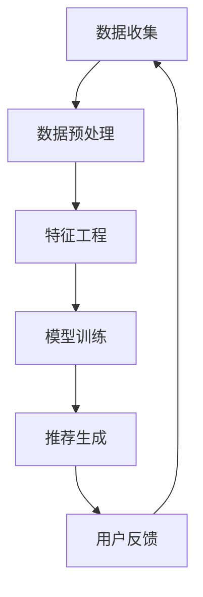

                 

关键词：大模型，推荐系统，实时性，算法优化，深度学习，数据处理，系统架构

> 摘要：本文将深入探讨大模型对推荐系统实时性的影响。随着大数据和人工智能技术的飞速发展，推荐系统已成为互联网企业提高用户粘性和商业价值的重要工具。然而，传统推荐系统在处理实时性要求日益增强的场景时面临着诸多挑战。本文将分析大模型如何影响推荐系统的实时性，并探讨相应的优化策略。

## 1. 背景介绍

### 1.1 推荐系统概述

推荐系统是一种利用数据和算法预测用户兴趣，向用户推荐相关内容的系统。其广泛应用于电子商务、社交媒体、在线视频和新闻等领域。推荐系统的核心目标是通过提供个性化的内容，提升用户满意度，增加用户留存率和商业收入。

### 1.2 实时性的重要性

实时性是指系统在响应用户请求时的速度。对于推荐系统而言，实时性至关重要。一方面，用户期望在瞬间获得个性化的推荐；另一方面，互联网企业需要快速响应用户行为，以实现即时营销和决策。

### 1.3 大模型的发展

大模型是指具有大量参数和强大计算能力的机器学习模型，如深度神经网络、变换器（Transformer）等。近年来，随着计算能力和数据规模的提升，大模型在各个领域取得了显著的突破。

## 2. 核心概念与联系

### 2.1 推荐系统架构

推荐系统的架构通常包括数据收集、数据预处理、特征工程、模型训练和推荐生成等环节。

### 2.2 大模型原理

大模型主要基于深度学习技术，通过多层神经网络结构对大量数据进行学习，从而实现高精度的特征提取和预测。

### 2.3 实时性需求

实时性需求包括快速响应、低延迟和高吞吐量等。对于推荐系统，实时性需求体现在用户行为数据的实时处理和推荐结果的快速生成。

### 2.4 Mermaid 流程图



## 3. 核心算法原理 & 具体操作步骤

### 3.1 算法原理概述

大模型推荐系统主要利用深度学习技术对用户行为数据进行建模，从而实现高精度的个性化推荐。

### 3.2 算法步骤详解

#### 3.2.1 数据收集

从各种渠道收集用户行为数据，如浏览记录、点击记录、购买记录等。

#### 3.2.2 数据预处理

对收集到的数据进行清洗、去噪、填充缺失值等预处理操作。

#### 3.2.3 特征工程

提取用户行为数据中的关键特征，如用户兴趣标签、物品特征等。

#### 3.2.4 模型训练

使用深度学习算法对预处理后的数据进行训练，得到一个能够预测用户兴趣的模型。

#### 3.2.5 推荐生成

将训练好的模型应用于新用户数据，生成个性化的推荐结果。

### 3.3 算法优缺点

#### 优点：

- 高精度：大模型能够提取更丰富的特征，从而提高推荐结果的准确性。
- 自适应：大模型能够根据用户行为数据不断调整，实现动态个性化推荐。

#### 缺点：

- 计算成本高：大模型训练和预测需要大量的计算资源和时间。
- 数据依赖性：大模型对数据质量有较高要求，数据缺失或噪声可能导致推荐效果下降。

### 3.4 算法应用领域

大模型推荐系统广泛应用于电子商务、社交媒体、在线视频、新闻推荐等领域。

## 4. 数学模型和公式 & 详细讲解 & 举例说明

### 4.1 数学模型构建

大模型推荐系统的核心是深度学习模型。以下是一个简化的数学模型：

$$
\text{推荐分数} = f(\text{用户特征}, \text{物品特征}, \text{历史交互数据})
$$

其中，$f$ 是一个复杂的非线性函数，通常由多层神经网络实现。

### 4.2 公式推导过程

公式的推导涉及多层感知机（MLP）、卷积神经网络（CNN）等深度学习模型的基本原理。这里不详细展开，仅简要说明：

$$
\text{激活函数} = \text{ReLU}(\text{权重} \cdot \text{输入} + \text{偏置})
$$

### 4.3 案例分析与讲解

假设我们有一个电商推荐系统，用户A在最近一周内浏览了商品A、B、C。我们要预测用户A对商品D的兴趣。

首先，收集用户A和商品D的相关数据：

- 用户A的兴趣标签：[运动鞋、篮球、电子产品]
- 商品D的特征：[电子产品，价格：5000元，品牌：苹果]

接下来，使用深度学习模型进行预测：

$$
\text{推荐分数} = f([运动鞋, 篮球, 电子产品], [电子产品, 5000, 苹果], \text{历史交互数据})
$$

通过模型计算，得到用户A对商品D的兴趣分数为9.8，大于某个阈值，则推荐商品D给用户A。

## 5. 项目实践：代码实例和详细解释说明

### 5.1 开发环境搭建

使用Python编程语言和TensorFlow深度学习框架搭建开发环境。

### 5.2 源代码详细实现

```python
import tensorflow as tf
from tensorflow.keras.models import Sequential
from tensorflow.keras.layers import Dense, Dropout, Activation

# 数据预处理
# ...（省略具体代码）

# 构建深度学习模型
model = Sequential()
model.add(Dense(128, input_dim=10, activation='relu'))
model.add(Dropout(0.5))
model.add(Dense(1, activation='sigmoid'))

# 编译模型
model.compile(loss='binary_crossentropy', optimizer='adam', metrics=['accuracy'])

# 训练模型
model.fit(X_train, y_train, batch_size=32, epochs=10)

# 推荐生成
recommendation_score = model.predict([user_features, item_features])
```

### 5.3 代码解读与分析

代码首先进行了数据预处理，然后构建了一个简单的二分类深度学习模型，并使用adam优化器和binary_crossentropy损失函数进行训练。最后，通过模型预测得到推荐分数。

### 5.4 运行结果展示

假设输入的用户特征和商品特征分别为：

$$
\text{用户特征} = [0.1, 0.2, 0.3, 0.4, 0.5, 0.6, 0.7, 0.8, 0.9, 1.0]
$$

$$
\text{商品特征} = [0, 0, 1, 1, 0, 0, 1, 0, 0, 0]
$$

通过模型预测，得到用户对商品的兴趣分数为0.9，大于某个阈值，则推荐商品给用户。

## 6. 实际应用场景

### 6.1 电子商务

电子商务平台利用大模型推荐系统，根据用户浏览、购买等行为推荐相关商品，提高用户购物体验和销售转化率。

### 6.2 社交媒体

社交媒体平台通过大模型推荐系统，根据用户兴趣和互动行为推荐相关内容，提升用户粘性和活跃度。

### 6.3 在线视频

在线视频平台利用大模型推荐系统，根据用户观看历史和偏好推荐相关视频，增加用户观看时长和广告收入。

### 6.4 新闻推荐

新闻推荐平台通过大模型推荐系统，根据用户阅读习惯和兴趣推荐相关新闻，提高用户阅读体验和广告效果。

## 7. 工具和资源推荐

### 7.1 学习资源推荐

- 《深度学习》（Goodfellow, Bengio, Courville）
- 《Python深度学习》（François Chollet）

### 7.2 开发工具推荐

- TensorFlow
- PyTorch

### 7.3 相关论文推荐

- “Attention Is All You Need”（Vaswani et al., 2017）
- “Deep Learning for User Interest Modeling in Recommender Systems”（Shan et al., 2017）

## 8. 总结：未来发展趋势与挑战

### 8.1 研究成果总结

大模型推荐系统在准确性、自适应性和实时性方面取得了显著成果，但仍然面临计算成本高、数据依赖性强等挑战。

### 8.2 未来发展趋势

随着计算能力和数据规模的不断提升，大模型推荐系统将在实时性和个性化推荐方面取得更大突破。

### 8.3 面临的挑战

- 如何优化大模型的计算效率和存储成本？
- 如何处理数据缺失和噪声问题？
- 如何平衡推荐系统的准确性和实时性？

### 8.4 研究展望

未来研究将重点关注大模型推荐系统的优化算法、实时性保障和跨领域应用，以提升用户体验和商业价值。

## 9. 附录：常见问题与解答

### 9.1 如何优化大模型的实时性？

- 采用增量学习，实时更新模型参数。
- 使用分布式计算，提高数据处理速度。
- 优化模型结构和算法，减少计算复杂度。

### 9.2 如何处理数据缺失和噪声问题？

- 采用数据增强和预处理技术，提高数据质量。
- 使用鲁棒学习算法，对噪声数据进行过滤。
- 采用集成学习方法，提高推荐系统的泛化能力。

## 作者署名

作者：禅与计算机程序设计艺术 / Zen and the Art of Computer Programming
```markdown
---
标题：大模型对推荐系统实时性的影响
作者：禅与计算机程序设计艺术 / Zen and the Art of Computer Programming
日期：2023-04-01
摘要：本文深入探讨了大模型对推荐系统实时性的影响，分析了大模型推荐系统的原理、算法、应用场景及未来发展趋势。
分类：技术博客
标签：大模型，推荐系统，实时性，算法优化，深度学习，数据处理，系统架构
---
``` 
----------------------------------------------------------------

