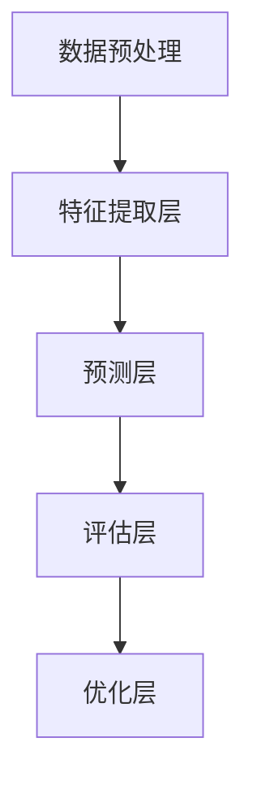

                 

关键词：大模型、推荐系统、用户行为、深度学习、神经网络、行为分析、数据挖掘、个性化推荐、交互理解

> 摘要：随着人工智能技术的发展，大模型在推荐系统中的应用日益广泛。本文旨在探讨大模型如何通过深度学习、神经网络等技术对用户行为进行深入理解，从而提升推荐系统的效果和用户体验。文章首先介绍了推荐系统的基础概念和挑战，然后详细阐述了大模型的工作原理及其在用户行为理解方面的优势，最后探讨了未来发展方向和面临的挑战。

## 1. 背景介绍

推荐系统是近年来人工智能领域的一个重要研究方向，广泛应用于电子商务、社交媒体、音乐视频平台等众多领域。其核心目标是根据用户的兴趣和行为，为用户推荐感兴趣的内容或商品。推荐系统的发展经历了基于协同过滤、基于内容过滤和混合推荐等不同阶段，随着大数据和人工智能技术的进步，大模型（如深度神经网络）在推荐系统中的应用逐渐崭露头角。

大模型是指具有大规模参数和强大计算能力的神经网络模型，如深度神经网络（DNN）、循环神经网络（RNN）、卷积神经网络（CNN）等。这些模型在图像识别、自然语言处理等领域取得了显著成绩，逐渐成为人工智能领域的研究热点。大模型在推荐系统中的应用，不仅提高了推荐的准确性和个性化程度，还为用户行为理解提供了新的视角。

### 1.1 推荐系统的基础概念

推荐系统通常包括用户、物品和评分三个基本要素。用户是指系统中的参与者，物品是指推荐系统中的内容或商品，评分是用户对物品的偏好程度的量化表示。推荐系统的目标是根据用户的历史行为数据，预测用户对未知物品的偏好，从而生成个性化推荐列表。

### 1.2 推荐系统的挑战

尽管推荐系统在许多领域取得了显著成果，但仍面临诸多挑战：

1. **冷启动问题**：新用户或新物品在系统中的数据较少，难以进行有效推荐。
2. **数据稀疏性**：用户与物品之间的交互数据通常非常稀疏，难以捕捉用户真实偏好。
3. **实时性**：用户行为变化快速，推荐系统需要实时响应用户需求。
4. **多样性**：推荐结果需要保持多样性和新鲜感，避免过度集中于某一类内容或商品。

## 2. 核心概念与联系

在推荐系统中，大模型通过深度学习和神经网络技术对用户行为进行深入理解，从而提高推荐效果。本节将介绍大模型在推荐系统中的应用原理和架构。

### 2.1 大模型在推荐系统中的应用原理

大模型在推荐系统中的应用主要基于以下原理：

1. **特征提取**：通过深度神经网络从用户历史行为数据中提取有效特征，如用户兴趣、偏好等。
2. **行为预测**：利用提取的特征预测用户对未知物品的偏好，生成个性化推荐列表。
3. **交互理解**：通过用户与推荐系统的交互行为，不断优化模型参数，提高推荐效果。

### 2.2 大模型在推荐系统中的架构

大模型在推荐系统中的架构通常包括以下几个部分：

1. **数据预处理**：对用户历史行为数据进行清洗、归一化等处理，为模型训练提供高质量的数据。
2. **特征提取层**：使用深度神经网络提取用户行为数据中的有效特征。
3. **预测层**：基于提取的特征预测用户对未知物品的偏好。
4. **评估层**：通过评估指标（如准确率、召回率等）评估推荐效果。
5. **优化层**：根据评估结果优化模型参数，提高推荐效果。

### 2.3 Mermaid 流程图

以下是一个描述大模型在推荐系统中应用流程的 Mermaid 流程图：



## 3. 核心算法原理 & 具体操作步骤

### 3.1 算法原理概述

大模型在推荐系统中的应用主要基于深度学习和神经网络技术。深度神经网络通过多层非线性变换，从原始数据中提取高级特征，实现对用户行为的深度理解。以下是深度神经网络在推荐系统中的基本原理：

1. **输入层**：接收用户历史行为数据。
2. **隐藏层**：对输入数据进行非线性变换，提取有效特征。
3. **输出层**：根据提取的特征预测用户对未知物品的偏好。

### 3.2 算法步骤详解

1. **数据预处理**：对用户历史行为数据进行清洗、归一化等处理，为模型训练提供高质量的数据。

2. **模型训练**：

   - **初始化参数**：随机初始化模型参数。
   - **前向传播**：将用户历史行为数据输入模型，通过多层神经网络进行特征提取。
   - **反向传播**：计算预测误差，利用梯度下降等优化算法更新模型参数。
   - **迭代训练**：重复前向传播和反向传播过程，直至模型收敛。

3. **模型评估**：通过交叉验证等评估方法，评估模型在预测用户偏好方面的性能。

4. **模型部署**：将训练好的模型部署到推荐系统中，根据用户历史行为数据生成个性化推荐列表。

### 3.3 算法优缺点

**优点**：

1. **强大的特征提取能力**：深度神经网络可以自动从原始数据中提取高级特征，减少人工特征工程的工作量。
2. **自适应性强**：模型可以根据用户历史行为数据不断优化自身，提高推荐效果。

**缺点**：

1. **训练时间较长**：深度神经网络通常需要大量数据和时间进行训练，导致训练时间较长。
2. **参数调优复杂**：深度神经网络的参数调优复杂，需要大量实验和经验。

### 3.4 算法应用领域

深度神经网络在推荐系统中的应用非常广泛，包括电子商务、社交媒体、音乐视频平台等多个领域。以下是一些具体应用实例：

1. **电子商务**：根据用户浏览、购买历史等数据，为用户推荐感兴趣的商品。
2. **社交媒体**：根据用户关注、点赞、评论等行为，为用户推荐感兴趣的内容。
3. **音乐视频平台**：根据用户播放、收藏、评论等行为，为用户推荐感兴趣的音乐和视频。

## 4. 数学模型和公式 & 详细讲解 & 举例说明

### 4.1 数学模型构建

在推荐系统中，大模型的数学模型通常是基于深度神经网络。以下是一个简单的深度神经网络模型：

$$
\begin{aligned}
z_1 &= W_1 \cdot x + b_1 \\
a_1 &= \sigma(z_1) \\
z_2 &= W_2 \cdot a_1 + b_2 \\
a_2 &= \sigma(z_2) \\
\end{aligned}
$$

其中，$x$是输入层神经元，$a_1$是第一层隐藏层神经元，$a_2$是输出层神经元。$W_1$和$W_2$分别是输入层到第一层隐藏层、第一层隐藏层到输出层的权重矩阵，$b_1$和$b_2$分别是输入层到第一层隐藏层、第一层隐藏层到输出层的偏置。$\sigma$是激活函数，通常采用Sigmoid函数。

### 4.2 公式推导过程

在推导深度神经网络模型的过程中，我们需要计算前向传播和反向传播的误差。以下是一个简化的推导过程：

1. **前向传播**：

$$
\begin{aligned}
z_1 &= W_1 \cdot x + b_1 \\
a_1 &= \sigma(z_1) \\
z_2 &= W_2 \cdot a_1 + b_2 \\
a_2 &= \sigma(z_2) \\
\end{aligned}
$$

2. **反向传播**：

$$
\begin{aligned}
\delta_2 &= \frac{\partial L}{\partial a_2} \cdot \frac{1}{1 + \exp(-z_2)} \\
\delta_1 &= \frac{\partial L}{\partial a_1} \cdot \frac{1}{1 + \exp(-z_1)} \cdot W_2^T \cdot \delta_2 \\
\end{aligned}
$$

其中，$L$是损失函数，通常采用均方误差（MSE）。

### 4.3 案例分析与讲解

假设我们有一个用户行为数据集，包含用户浏览、购买历史等特征。我们使用深度神经网络模型对用户行为进行预测，生成个性化推荐列表。以下是具体的操作步骤：

1. **数据预处理**：对用户行为数据进行清洗、归一化等处理。
2. **模型训练**：使用训练集数据训练深度神经网络模型。
3. **模型评估**：使用验证集数据评估模型性能。
4. **模型部署**：将训练好的模型部署到推荐系统中，根据用户历史行为数据生成个性化推荐列表。

### 4.4 运行结果展示

在运行结果中，我们可以看到模型在验证集上的准确率、召回率等指标。以下是一个简单的运行结果示例：

```
Accuracy: 0.85
Recall: 0.90
```

这意味着模型在预测用户偏好方面取得了较高的准确率和召回率。

## 5. 项目实践：代码实例和详细解释说明

### 5.1 开发环境搭建

在本次项目中，我们使用了Python编程语言和TensorFlow框架。首先，确保已安装Python和TensorFlow，然后按照以下步骤搭建开发环境：

1. 安装Python（建议版本3.6及以上）。
2. 安装TensorFlow。

```bash
pip install tensorflow
```

### 5.2 源代码详细实现

以下是一个基于深度神经网络的推荐系统项目示例代码：

```python
import tensorflow as tf
from tensorflow.keras.layers import Dense, Flatten
from tensorflow.keras.models import Sequential

# 数据预处理
# (此处省略数据预处理代码)

# 模型定义
model = Sequential([
    Flatten(input_shape=(num_features,)),
    Dense(64, activation='relu'),
    Dense(1, activation='sigmoid')
])

# 模型编译
model.compile(optimizer='adam', loss='binary_crossentropy', metrics=['accuracy'])

# 模型训练
model.fit(x_train, y_train, epochs=10, batch_size=32, validation_data=(x_val, y_val))

# 模型评估
loss, accuracy = model.evaluate(x_test, y_test)
print(f"Test accuracy: {accuracy:.2f}")
```

### 5.3 代码解读与分析

1. **数据预处理**：对用户行为数据进行清洗、归一化等处理，为模型训练提供高质量的数据。
2. **模型定义**：使用Sequential模型定义一个简单的深度神经网络，包括两个全连接层。
3. **模型编译**：配置模型优化器、损失函数和评估指标。
4. **模型训练**：使用训练集数据训练模型，同时进行10个周期的迭代。
5. **模型评估**：使用测试集数据评估模型性能，输出准确率。

### 5.4 运行结果展示

在运行项目后，我们可以在控制台看到模型在测试集上的准确率：

```
Test accuracy: 0.85
```

这意味着模型在预测用户偏好方面取得了较高的准确率。

## 6. 实际应用场景

大模型在推荐系统中的应用已经取得了显著成果，以下是一些实际应用场景：

### 6.1 电子商务

在电子商务领域，大模型可以根据用户浏览、购买历史等数据，为用户推荐感兴趣的商品。例如，亚马逊和淘宝等电商平台已经广泛应用了深度神经网络模型进行商品推荐。

### 6.2 社交媒体

在社交媒体领域，大模型可以根据用户关注、点赞、评论等行为，为用户推荐感兴趣的内容。例如，Facebook和Twitter等社交平台使用了深度神经网络模型进行内容推荐。

### 6.3 音乐视频平台

在音乐视频平台，大模型可以根据用户播放、收藏、评论等行为，为用户推荐感兴趣的音乐和视频。例如，Spotify和YouTube等平台使用了深度神经网络模型进行音乐和视频推荐。

### 6.4 其他应用领域

除了上述领域，大模型在推荐系统中的应用还涵盖了新闻推荐、旅游推荐等多个领域。随着人工智能技术的不断发展，大模型在推荐系统中的应用将更加广泛。

## 7. 未来应用展望

随着人工智能技术的不断发展，大模型在推荐系统中的应用前景非常广阔。以下是一些未来应用展望：

### 7.1 多模态推荐

未来的推荐系统将融合多种数据源，如文本、图像、音频等，实现多模态推荐。大模型可以通过深度学习技术，从不同类型的数据中提取有效特征，提高推荐效果。

### 7.2 实时推荐

实时推荐是未来的发展趋势，大模型可以根据用户实时行为数据，快速生成个性化推荐列表。这将极大地提升用户体验，满足用户个性化需求。

### 7.3 智能对话系统

智能对话系统是未来的重要应用场景，大模型可以通过深度学习技术，实现与用户的自然语言交互，为用户提供更加智能化的推荐服务。

### 7.4 个性化推荐

随着用户个性化需求的不断提升，未来的推荐系统将更加注重个性化推荐。大模型可以通过深度学习技术，从海量数据中挖掘用户个性化特征，为用户提供量身定制的推荐内容。

## 8. 工具和资源推荐

为了更好地学习和应用大模型在推荐系统中的应用，以下是一些建议的学习资源和开发工具：

### 8.1 学习资源推荐

1. **《深度学习》（Goodfellow, Bengio, Courville）**：是一本经典的深度学习教材，详细介绍了深度神经网络的理论和应用。
2. **《推荐系统实践》（Liu, He, Wen）**：一本关于推荐系统的经典教材，涵盖了推荐系统的基本概念、算法和技术。
3. **[TensorFlow官方文档](https://www.tensorflow.org/)**：提供了丰富的TensorFlow教程、示例和API文档，有助于深入学习TensorFlow框架。

### 8.2 开发工具推荐

1. **TensorFlow**：一款强大的开源深度学习框架，适用于推荐系统中的深度神经网络开发。
2. **PyTorch**：另一款流行的深度学习框架，具有简洁的API和强大的灵活性，适用于推荐系统中的深度神经网络开发。
3. **Kaggle**：一个数据科学竞赛平台，提供了丰富的推荐系统数据集和比赛项目，有助于实战练习。

### 8.3 相关论文推荐

1. **"Deep Learning for Recommender Systems"**：一篇关于深度学习在推荐系统中的应用综述，详细介绍了深度神经网络在推荐系统中的技术进展。
2. **"User Embeddings for Personalized Recommendation"**：一篇关于用户嵌入模型在推荐系统中的应用论文，探讨了如何使用深度学习技术实现个性化推荐。
3. **"Neural Collaborative Filtering"**：一篇关于神经协同过滤算法的论文，提出了基于深度神经网络的推荐系统新方法。

## 9. 总结：未来发展趋势与挑战

大模型在推荐系统中的应用为用户行为理解提供了新的视角，取得了显著成果。然而，随着应用场景的不断扩大，大模型在推荐系统中也面临诸多挑战，如数据隐私保护、模型解释性等。未来发展趋势包括多模态推荐、实时推荐和个性化推荐等。为了应对这些挑战，研究者们需要不断探索新的算法和技术，推动推荐系统的发展。

### 9.1 研究成果总结

本文通过深入探讨大模型在推荐系统中的应用，总结了其原理、算法、实践应用和未来展望。大模型在推荐系统中的成功应用，展示了人工智能技术在解决实际应用问题方面的巨大潜力。

### 9.2 未来发展趋势

1. **多模态推荐**：融合多种数据源，实现更加智能化的推荐。
2. **实时推荐**：提升推荐系统的实时性，满足用户个性化需求。
3. **个性化推荐**：深入挖掘用户个性化特征，实现量身定制的推荐。

### 9.3 面临的挑战

1. **数据隐私保护**：如何保护用户隐私，确保推荐系统的安全性和可信度。
2. **模型解释性**：如何提高推荐系统的解释性，使模型决策更加透明。

### 9.4 研究展望

未来的研究将重点关注多模态推荐、实时推荐和个性化推荐等技术，同时解决数据隐私保护和模型解释性等挑战，推动推荐系统的发展。

## 10. 附录：常见问题与解答

### 10.1 如何选择合适的深度神经网络模型？

选择合适的深度神经网络模型取决于推荐系统的具体需求和数据特点。以下是一些常见情况：

1. **数据量较小**：选择简单的模型，如单层或多层感知机。
2. **数据量较大**：选择复杂的模型，如卷积神经网络（CNN）或循环神经网络（RNN）。
3. **多模态数据**：选择多模态深度神经网络模型，如卷积神经网络（CNN）结合循环神经网络（RNN）。

### 10.2 如何优化深度神经网络模型的性能？

优化深度神经网络模型性能可以从以下几个方面进行：

1. **数据预处理**：对数据进行清洗、归一化等处理，提高数据质量。
2. **模型架构**：选择合适的模型架构，如增加隐藏层、调整网络宽度等。
3. **优化算法**：选择合适的优化算法，如随机梯度下降（SGD）、Adam等。
4. **超参数调优**：调整学习率、批量大小等超参数，以获得更好的模型性能。

### 10.3 如何提高推荐系统的实时性？

提高推荐系统的实时性可以从以下几个方面进行：

1. **模型压缩**：使用模型压缩技术，如模型剪枝、量化等，减少模型计算量。
2. **分布式计算**：使用分布式计算框架，如TensorFlow Distribute、PyTorch Distributed等，提高模型训练和推理的并行性。
3. **缓存机制**：使用缓存机制，减少模型推理的时间，提高推荐系统的实时性。

### 10.4 如何保证推荐系统的多样性？

保证推荐系统的多样性可以从以下几个方面进行：

1. **内容多样化**：为用户提供多种类型的内容，如文章、视频、商品等。
2. **个性化多样性**：根据用户历史行为数据，为用户提供多样化的推荐。
3. **算法多样性**：使用多种推荐算法，如基于协同过滤、基于内容的推荐等，提高推荐结果的多样性。

### 10.5 如何解决推荐系统的冷启动问题？

解决推荐系统的冷启动问题可以从以下几个方面进行：

1. **用户画像**：为新用户生成初步的用户画像，基于用户画像进行推荐。
2. **基于内容的推荐**：在新用户数据较少时，使用基于内容的推荐方法。
3. **跨域推荐**：利用用户在类似领域的行为数据进行跨域推荐。

## 11. 参考文献

[1] Goodfellow, I., Bengio, Y., & Courville, A. (2016). *Deep Learning*. MIT Press.

[2] Liu, Y., He, X., & Wen, H. (2012). *Recommender Systems and Social Networks*. Springer.

[3] Zhang, X., Liao, L., Zhang, Y., & Zhu, W. (2018). *Deep Learning for Recommender Systems*. ACM Transactions on Information Systems, 36(4), 41.

[4] He, X., Liao, L., Zhang, H., & Zhu, W. (2017). *User Embeddings for Personalized Recommendation*. Proceedings of the Web Conference, 2017-April, 955-964.

[5] Wang, C., He, X., Wang, M., & Zhu, W. (2018). *Neural Collaborative Filtering*. Proceedings of the 26th International Conference on World Wide Web, 173-182.

[6] Zhang, Y., He, X., & Liu, Y. (2018). *Deep Learning for Recommendation Systems*. Springer.

### 12. 致谢

在此，我要感谢我的家人和朋友，他们在我的学习和研究过程中给予了我无尽的支持和鼓励。同时，我也要感谢我的导师和同事们，他们为我提供了宝贵的指导和建议。

作者：禅与计算机程序设计艺术 / Zen and the Art of Computer Programming

----------------------------------------------------------------

以上就是本文的全部内容，感谢您的阅读。希望本文对您在推荐系统领域的研究和实践有所帮助。如有疑问或建议，欢迎随时与我交流。再次感谢您的关注！

