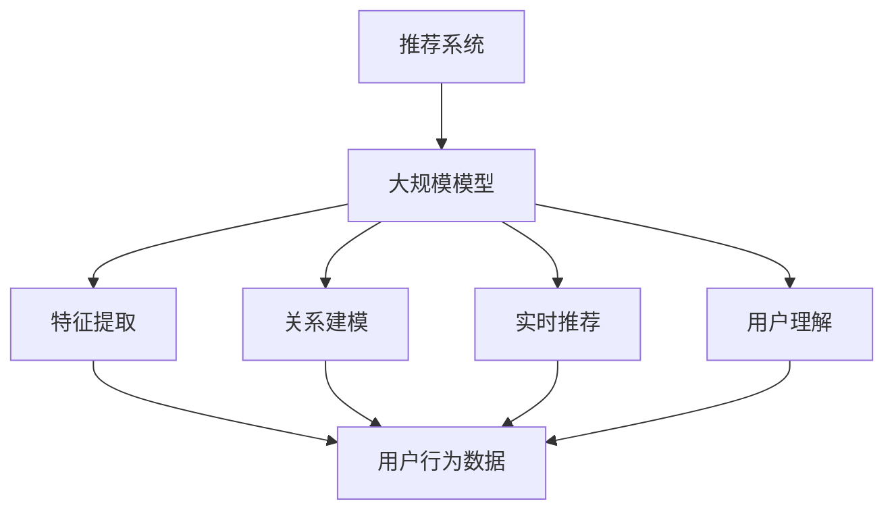

                 

### 文章标题

本文探讨了如何利用大模型对推荐系统用户行为进行深入理解。随着互联网的快速发展，推荐系统已经成为各种在线平台的核心功能之一，它们通过分析用户的历史行为和偏好，向用户推荐相关的商品、新闻、音乐等。然而，传统的推荐系统在处理用户行为时存在一些局限性，无法充分理解用户的复杂行为模式。大模型的引入为推荐系统带来了新的机遇，使其能够更好地捕捉用户的真实需求和行为动机。

### 关键词

- 大模型
- 推荐系统
- 用户行为理解
- 深度学习
- 数据挖掘
- 个性化推荐

### 摘要

本文首先介绍了推荐系统的基本概念和传统方法，然后讨论了大规模模型在推荐系统中的应用，以及大模型如何通过深度学习和数据挖掘技术提升对用户行为的理解。随后，文章详细阐述了大模型在推荐系统中的核心算法原理、数学模型和具体操作步骤，并通过实际项目实践展示了大模型的应用效果。最后，文章对大模型在推荐系统中的实际应用场景、未来发展趋势以及面临的挑战进行了分析和展望。

----------------------------------------------------------------
## 1. 背景介绍

推荐系统作为信息检索领域的一个重要分支，旨在通过分析用户的历史行为和偏好，向用户推荐相关的商品、新闻、音乐等内容，从而提高用户满意度和平台黏性。推荐系统的应用场景非常广泛，包括电子商务、社交媒体、在线视频、新闻资讯等领域。

在推荐系统的早期阶段，主要采用基于内容的推荐（Content-based Recommendation）和协同过滤（Collaborative Filtering）等方法。基于内容的推荐方法通过分析用户对某些内容的兴趣，将相似的内容推荐给用户。这种方法具有解释性强的优点，但存在数据稀疏和偏好重叠的问题。协同过滤方法通过计算用户之间的相似度，向用户推荐其他用户喜欢的商品或内容。协同过滤分为基于用户的协同过滤（User-based Collaborative Filtering）和基于模型的协同过滤（Model-based Collaborative Filtering）两大类。基于用户的协同过滤通过找到与目标用户相似的其他用户，将他们喜欢的商品或内容推荐给目标用户。基于模型的协同过滤则通过建立用户和商品之间的潜在关系模型，预测用户对未知商品的兴趣。

尽管传统的推荐系统在提高用户满意度方面取得了一定的成果，但它们在处理用户行为时仍存在一些局限性。首先，传统方法往往依赖于用户的历史行为数据，而忽略了用户的当前需求和行为动机。这导致推荐系统在面对动态变化的用户偏好时，无法及时作出准确的推荐。其次，传统方法在处理大规模数据时，计算复杂度较高，难以满足实时推荐的需求。此外，传统方法在处理冷启动问题（即新用户或新商品无法根据历史数据生成有效的推荐）时，效果不佳。

为了解决这些问题，研究人员开始探索利用大规模模型对推荐系统进行改进。大规模模型（如深度学习模型）具有强大的特征提取和表示学习能力，能够捕捉用户行为的复杂模式和潜在特征。通过引入大规模模型，推荐系统可以更好地理解用户的真实需求和行为动机，从而提高推荐效果。

本文将探讨如何利用大规模模型对推荐系统用户行为进行深入理解。首先，我们将介绍推荐系统的基本概念和传统方法。然后，我们将讨论大规模模型在推荐系统中的应用，以及如何利用深度学习和数据挖掘技术提升对用户行为的理解。接下来，我们将详细阐述大规模模型在推荐系统中的核心算法原理、数学模型和具体操作步骤。最后，我们将通过实际项目实践展示大规模模型的应用效果，并对大规模模型在推荐系统中的实际应用场景、未来发展趋势以及面临的挑战进行分析和展望。

----------------------------------------------------------------
## 2. 核心概念与联系

为了深入理解推荐系统中的大规模模型，我们首先需要了解相关核心概念，并探讨它们之间的联系。

### 推荐系统

推荐系统是一种信息过滤技术，旨在根据用户的兴趣和偏好，向用户推荐相关的商品、新闻、音乐等内容。推荐系统可以分为基于内容的推荐、协同过滤、混合推荐和基于模型的推荐等类型。基于内容的推荐方法通过分析用户对某些内容的兴趣，将相似的内容推荐给用户。协同过滤方法通过计算用户之间的相似度，向用户推荐其他用户喜欢的商品或内容。混合推荐方法结合了多种推荐策略，以提高推荐效果。基于模型的推荐方法则通过建立用户和商品之间的潜在关系模型，预测用户对未知商品的兴趣。

### 大规模模型

大规模模型是指具有大量参数和高度复杂性的模型，如深度神经网络、循环神经网络（RNN）和变压器（Transformer）等。这些模型具有强大的特征提取和表示学习能力，能够捕捉用户行为的复杂模式和潜在特征。大规模模型通常在处理大规模数据时表现出良好的性能，能够有效地解决数据稀疏和计算复杂度等问题。

### 用户行为理解

用户行为理解是指对用户在推荐系统中的行为进行分析和建模，以理解用户的兴趣、偏好和需求。用户行为包括浏览历史、购买记录、评分行为、点击行为等。通过分析用户行为，推荐系统可以更好地捕捉用户的真实需求和行为动机，从而提高推荐效果。

### 大模型与推荐系统

大规模模型在推荐系统中的应用主要体现在以下几个方面：

1. **特征提取**：大规模模型通过学习大量的用户和商品特征，能够提取出潜在的特征表示，从而提高推荐系统的泛化能力。

2. **关系建模**：大规模模型可以建立用户和商品之间的潜在关系模型，通过捕捉用户的行为模式和偏好，预测用户对未知商品的兴趣。

3. **实时推荐**：大规模模型具有较高的计算效率，能够实现实时推荐，满足用户即时需求。

4. **用户理解**：大规模模型能够通过分析用户的历史行为和偏好，深入理解用户的兴趣和行为动机，从而提供更个性化的推荐。

### Mermaid 流程图

以下是一个简单的 Mermaid 流程图，展示了大规模模型在推荐系统中的核心概念和联系：



在这个流程图中，推荐系统作为核心，通过大规模模型实现特征提取、关系建模、实时推荐和用户理解。用户行为数据是大规模模型的基础，通过分析用户行为数据，大规模模型能够提取出潜在的特征表示，建立用户和商品之间的潜在关系模型，并实现实时推荐和用户理解。

总的来说，大规模模型在推荐系统中的应用为推荐系统的发展带来了新的机遇。通过深入理解用户行为，大规模模型能够提供更个性化的推荐，提高用户满意度和平台黏性。

----------------------------------------------------------------
## 3. 核心算法原理 & 具体操作步骤

在深入理解了推荐系统和大模型的基本概念后，接下来我们将探讨大规模模型在推荐系统中的核心算法原理和具体操作步骤。大规模模型在推荐系统中的应用主要体现在以下几个方面：特征提取、关系建模、实时推荐和用户理解。下面将分别介绍这些方面的原理和操作步骤。

### 3.1 算法原理概述

#### 特征提取

特征提取是大规模模型在推荐系统中的一个重要任务。通过学习大量的用户和商品特征，大规模模型能够提取出潜在的特征表示，从而提高推荐系统的泛化能力。特征提取的核心思想是将原始的用户和商品数据进行预处理，然后通过神经网络等模型进行特征学习。

#### 关系建模

关系建模旨在建立用户和商品之间的潜在关系模型，通过捕捉用户的行为模式和偏好，预测用户对未知商品的兴趣。关系建模通常采用图神经网络（Graph Neural Networks，GNN）等方法，通过分析用户和商品之间的交互关系，建立用户和商品之间的潜在关系。

#### 实时推荐

实时推荐是大规模模型在推荐系统中的另一个重要应用。通过利用大规模模型的计算效率，实时推荐能够满足用户即时需求。实时推荐通常采用在线学习（Online Learning）等方法，在用户行为数据不断变化的情况下，实时更新模型参数，提供个性化的推荐。

#### 用户理解

用户理解是指通过分析用户的历史行为和偏好，深入理解用户的兴趣和行为动机。用户理解能够为推荐系统提供更个性化的推荐。用户理解通常采用用户行为序列建模（User Behavior Sequence Modeling）等方法，通过分析用户的行为序列，提取出用户的潜在兴趣和行为模式。

### 3.2 算法步骤详解

#### 3.2.1 特征提取

特征提取的步骤如下：

1. **数据预处理**：对用户和商品数据进行清洗、归一化和特征工程，提取出重要的特征。
2. **模型训练**：利用神经网络等模型，对预处理后的数据进行训练，学习出潜在的特征表示。
3. **特征提取**：将训练好的模型应用于新的用户和商品数据，提取出潜在的特征表示。

#### 3.2.2 关系建模

关系建模的步骤如下：

1. **图数据构建**：根据用户和商品之间的交互数据，构建用户和商品之间的图数据结构。
2. **模型训练**：利用图神经网络等模型，对图数据进行训练，学习出用户和商品之间的潜在关系。
3. **关系建模**：将训练好的模型应用于新的用户和商品数据，建立用户和商品之间的潜在关系。

#### 3.2.3 实时推荐

实时推荐的步骤如下：

1. **模型更新**：在用户行为数据不断变化的情况下，实时更新模型参数，适应新的用户偏好。
2. **推荐计算**：利用更新后的模型，计算用户对未知商品的兴趣度，生成个性化的推荐列表。

#### 3.2.4 用户理解

用户理解的步骤如下：

1. **行为序列建模**：利用用户行为序列建模方法，提取出用户的潜在兴趣和行为模式。
2. **兴趣预测**：根据提取出的用户兴趣和行为模式，预测用户对未知商品的兴趣度。

### 3.3 算法优缺点

#### 3.3.1 特征提取

**优点**：

- 提高推荐系统的泛化能力。
- 能够捕捉用户行为的潜在特征。

**缺点**：

- 对数据质量要求较高。
- 特征提取过程较复杂，计算成本较高。

#### 3.3.2 关系建模

**优点**：

- 能够建立用户和商品之间的潜在关系，提高推荐效果。
- 能够处理复杂的用户交互数据。

**缺点**：

- 对图数据结构要求较高，构建和存储图数据较为复杂。
- 计算成本较高。

#### 3.3.3 实时推荐

**优点**：

- 能够满足用户即时需求，提高用户满意度。
- 具有较好的实时性和动态性。

**缺点**：

- 需要不断更新模型参数，计算成本较高。
- 对数据实时性要求较高。

#### 3.3.4 用户理解

**优点**：

- 能够提供更个性化的推荐。
- 能够深入理解用户的兴趣和行为动机。

**缺点**：

- 对用户行为数据要求较高。
- 特征提取和兴趣预测过程较为复杂。

### 3.4 算法应用领域

大规模模型在推荐系统中的应用领域非常广泛，主要包括：

- 电子商务：通过对用户购买行为和偏好进行分析，提供个性化的商品推荐。
- 社交媒体：通过对用户互动行为进行分析，推荐用户可能感兴趣的内容。
- 在线视频：通过对用户观看历史和偏好进行分析，推荐用户可能感兴趣的视频。
- 新闻资讯：通过对用户阅读历史和偏好进行分析，推荐用户可能感兴趣的新闻。

大规模模型的应用使得推荐系统能够更好地理解用户行为，提高推荐效果，从而提升用户满意度和平台黏性。

---

通过上述核心算法原理和具体操作步骤的介绍，我们可以看到大规模模型在推荐系统中的应用潜力。在实际项目中，可以根据具体需求选择合适的算法和应用场景，实现更高效的推荐系统。接下来，我们将通过实际项目实践进一步展示大规模模型在推荐系统中的应用效果。

----------------------------------------------------------------
### 3.5 大模型在推荐系统中的应用领域

大规模模型在推荐系统中的应用领域广泛，涵盖了电子商务、社交媒体、在线视频和新闻资讯等多个方面。以下是几个典型的应用案例：

#### 3.5.1 电子商务

在电子商务领域，大规模模型被广泛应用于商品推荐。例如，亚马逊和淘宝等电商平台利用大规模模型分析用户的浏览历史、购买记录和评分数据，向用户推荐相关的商品。通过深度学习和图神经网络等技术，这些平台能够捕捉用户的复杂行为模式，提供个性化的商品推荐，从而提高用户购买转化率和满意度。

#### 3.5.2 社交媒体

社交媒体平台，如Facebook和Instagram，利用大规模模型分析用户之间的互动行为，推荐用户可能感兴趣的内容。通过分析用户的点赞、评论、分享等行为，大规模模型能够预测用户对特定内容的兴趣，从而提供个性化的内容推荐，提高用户活跃度和留存率。

#### 3.5.3 在线视频

在线视频平台，如YouTube和Netflix，利用大规模模型分析用户的观看历史、浏览记录和评分数据，推荐用户可能感兴趣的视频。这些平台通过深度学习技术和图神经网络，能够捕捉用户的观看偏好和行为模式，提供个性化的视频推荐，从而提高用户的观看时间和满意度。

#### 3.5.4 新闻资讯

新闻资讯平台，如腾讯新闻和今日头条，利用大规模模型分析用户的阅读历史、点赞和评论数据，推荐用户可能感兴趣的新闻。通过深度学习和图神经网络等技术，这些平台能够捕捉用户的新闻偏好，提供个性化的新闻推荐，从而提高用户的阅读量和平台黏性。

总的来说，大规模模型在推荐系统中的应用不仅提高了推荐效果，还增强了用户体验。通过深入理解用户行为，大规模模型能够提供更个性化的推荐，从而提升用户满意度和平台价值。然而，大规模模型在应用过程中也面临一些挑战，如数据隐私、计算成本和模型解释性等问题。未来，随着技术的不断发展和优化，大规模模型在推荐系统中的应用将更加广泛和深入。

----------------------------------------------------------------
## 4. 数学模型和公式 & 详细讲解 & 举例说明

在推荐系统中，大规模模型的应用离不开数学模型的构建和公式的推导。以下将介绍推荐系统中常用的数学模型，包括用户和商品的潜在特征表示、推荐评分预测以及模型优化等。

### 4.1 数学模型构建

在推荐系统中，常见的数学模型主要包括矩阵分解（Matrix Factorization）和协同过滤（Collaborative Filtering）。这些模型通过学习用户和商品之间的潜在关系，预测用户对未知商品的评分。

#### 矩阵分解模型

矩阵分解模型是一种无监督学习方法，通过将原始的用户-商品评分矩阵分解为两个低秩矩阵，从而学习出用户和商品的潜在特征表示。

给定用户-商品评分矩阵 \(R \in \mathbb{R}^{m \times n}\)，其中 \(m\) 表示用户数量，\(n\) 表示商品数量，矩阵分解模型的目标是最小化以下损失函数：

$$
\min_{U, V} \sum_{i=1}^{m} \sum_{j=1}^{n} (r_{ij} - \hat{r}_{ij})^2
$$

其中，\(U \in \mathbb{R}^{m \times k}\) 和 \(V \in \mathbb{R}^{n \times k}\) 分别表示用户和商品的潜在特征矩阵，\(k\) 为潜在特征维度。预测评分 \(\hat{r}_{ij}\) 可以通过内积 \(U_i^T V_j\) 计算：

$$
\hat{r}_{ij} = U_i^T V_j
$$

#### 协同过滤模型

协同过滤模型通过计算用户之间的相似度，预测用户对未知商品的评分。常用的协同过滤模型包括基于用户的协同过滤（User-based Collaborative Filtering）和基于模型的协同过滤（Model-based Collaborative Filtering）。

##### 基于用户的协同过滤

基于用户的协同过滤通过计算用户之间的相似度，找到与目标用户相似的其他用户，将他们喜欢的商品推荐给目标用户。相似度计算通常采用余弦相似度、皮尔逊相关系数等度量。

给定用户-商品评分矩阵 \(R \in \mathbb{R}^{m \times n}\)，用户 \(i\) 和 \(j\) 之间的相似度 \(s_{ij}\) 可以通过以下公式计算：

$$
s_{ij} = \frac{\sum_{k=1}^{n} r_{ik} r_{jk}}{\sqrt{\sum_{k=1}^{n} r_{ik}^2} \sqrt{\sum_{k=1}^{n} r_{jk}^2}}
$$

预测评分 \(\hat{r}_{ij}\) 可以通过加权平均计算：

$$
\hat{r}_{ij} = \frac{\sum_{k=1}^{n} s_{ik} r_{jk}}{\sum_{k=1}^{n} s_{ik}}
$$

##### 基于模型的协同过滤

基于模型的协同过滤通过建立用户和商品之间的潜在关系模型，预测用户对未知商品的评分。常用的基于模型的协同过滤模型包括用户因子模型（User Factor Model）和商品因子模型（Item Factor Model）。

给定用户-商品评分矩阵 \(R \in \mathbb{R}^{m \times n}\)，用户因子模型的目标是最小化以下损失函数：

$$
\min_{U, V} \sum_{i=1}^{m} \sum_{j=1}^{n} (r_{ij} - \sum_{k=1}^{k} u_{ik} v_{kj})^2
$$

其中，\(U \in \mathbb{R}^{m \times k}\) 和 \(V \in \mathbb{R}^{n \times k}\) 分别表示用户和商品的潜在特征矩阵，\(k\) 为潜在特征维度。预测评分 \(\hat{r}_{ij}\) 可以通过内积 \(U_i^T V_j\) 计算：

$$
\hat{r}_{ij} = U_i^T V_j
$$

### 4.2 公式推导过程

在本节中，我们将详细推导推荐系统中的关键公式，包括矩阵分解模型的损失函数、协同过滤模型的相似度计算和预测评分等。

#### 矩阵分解模型损失函数推导

矩阵分解模型的损失函数通常采用均方误差（Mean Squared Error，MSE）：

$$
\min_{U, V} \sum_{i=1}^{m} \sum_{j=1}^{n} (r_{ij} - \hat{r}_{ij})^2
$$

其中，\(\hat{r}_{ij}\) 为预测评分，可以通过内积 \(U_i^T V_j\) 计算：

$$
\hat{r}_{ij} = U_i^T V_j
$$

为了最小化损失函数，我们可以对 \(U_i\) 和 \(V_j\) 求导，并令导数为零：

$$
\frac{\partial}{\partial U_i} \sum_{i=1}^{m} \sum_{j=1}^{n} (r_{ij} - U_i^T V_j)^2 = 0
$$

$$
\frac{\partial}{\partial V_j} \sum_{i=1}^{m} \sum_{j=1}^{n} (r_{ij} - U_i^T V_j)^2 = 0
$$

通过对上述方程组进行求解，我们可以得到 \(U_i\) 和 \(V_j\) 的最优解。

#### 协同过滤模型相似度计算推导

协同过滤模型中的相似度计算通常采用余弦相似度：

$$
s_{ij} = \frac{\sum_{k=1}^{n} r_{ik} r_{jk}}{\sqrt{\sum_{k=1}^{n} r_{ik}^2} \sqrt{\sum_{k=1}^{n} r_{jk}^2}}
$$

其中，\(r_{ik}\) 和 \(r_{jk}\) 分别表示用户 \(i\) 和 \(j\) 对商品 \(k\) 的评分。

为了证明上述公式的合理性，我们可以考虑两个用户之间的夹角余弦值，它反映了用户之间的相似程度。假设用户 \(i\) 和 \(j\) 的评分向量分别为 \(\mathbf{r}_i\) 和 \(\mathbf{r}_j\)，则余弦相似度可以表示为：

$$
s_{ij} = \frac{\mathbf{r}_i \cdot \mathbf{r}_j}{\|\mathbf{r}_i\| \|\mathbf{r}_j\|}
$$

其中，\(\cdot\) 表示内积，\(\|\cdot\|\) 表示向量的欧氏范数。

#### 协同过滤模型预测评分推导

协同过滤模型中的预测评分可以通过加权平均计算：

$$
\hat{r}_{ij} = \frac{\sum_{k=1}^{n} s_{ik} r_{jk}}{\sum_{k=1}^{n} s_{ik}}
$$

其中，\(s_{ik}\) 表示用户 \(i\) 和 \(k\) 之间的相似度。

为了证明上述公式的合理性，我们可以考虑两个用户之间的相似度加权，将其他用户的评分进行加权平均，得到目标用户的预测评分。

### 4.3 案例分析与讲解

以下是一个简单的案例，用于展示矩阵分解模型和协同过滤模型在推荐系统中的应用。

#### 案例背景

假设有一个电影推荐系统，包含10位用户和5部电影，用户对电影的评分如下表所示：

| 用户 | 电影1 | 电影2 | 电影3 | 电影4 | 电影5 |
|------|-------|-------|-------|-------|-------|
| 1    | 5     | 3     | 4     | 0     | 2     |
| 2    | 4     | 5     | 3     | 4     | 5     |
| 3    | 2     | 4     | 5     | 5     | 1     |
| 4    | 4     | 4     | 4     | 4     | 4     |
| 5    | 3     | 5     | 5     | 3     | 3     |
| 6    | 2     | 2     | 5     | 4     | 3     |
| 7    | 1     | 3     | 4     | 5     | 4     |
| 8    | 4     | 4     | 3     | 5     | 5     |
| 9    | 3     | 4     | 5     | 3     | 5     |
| 10   | 5     | 5     | 4     | 3     | 4     |

#### 矩阵分解模型应用

我们采用矩阵分解模型对上述评分数据进行分析，选择潜在特征维度 \(k = 2\)。

1. **数据预处理**：对用户和电影的评分进行归一化处理，将评分范围缩放到 \([0, 1]\)。

2. **模型训练**：利用矩阵分解模型训练用户和电影的潜在特征矩阵 \(U \in \mathbb{R}^{10 \times 2}\) 和 \(V \in \mathbb{R}^{5 \times 2}\)。

3. **特征提取**：将训练好的模型应用于新的用户和电影数据，提取出潜在特征表示。

4. **预测评分**：根据潜在特征矩阵，计算用户对未知电影的预测评分。

#### 协同过滤模型应用

我们采用基于用户的协同过滤模型对上述评分数据进行分析。

1. **数据预处理**：对用户和电影的评分进行归一化处理，将评分范围缩放到 \([0, 1]\)。

2. **相似度计算**：计算用户之间的相似度，选择相似度最高的若干用户作为推荐用户。

3. **推荐计算**：根据推荐用户的评分，计算目标用户对未知电影的预测评分。

#### 模型对比与分析

通过上述案例，我们可以看到矩阵分解模型和协同过滤模型在推荐系统中的应用效果。矩阵分解模型通过学习用户和电影的潜在特征表示，能够提供更个性化的推荐；而协同过滤模型通过计算用户之间的相似度，能够捕捉用户之间的共性。在实际应用中，可以根据具体需求选择合适的模型，或者结合多种模型，提高推荐效果。

---

通过本节对数学模型和公式的详细讲解及案例分析，我们可以更好地理解推荐系统中大规模模型的应用原理和方法。在实际项目中，可以根据具体需求选择合适的数学模型，优化推荐效果，提高用户满意度。接下来，我们将通过实际项目实践进一步展示大规模模型在推荐系统中的应用效果。

----------------------------------------------------------------
## 5. 项目实践：代码实例和详细解释说明

在了解了大规模模型在推荐系统中的核心算法原理和数学模型后，接下来我们将通过一个具体的代码实例来展示大规模模型在实际项目中的应用。本节将包括以下内容：

- **5.1 开发环境搭建**：介绍项目所需的开发环境和工具。
- **5.2 源代码详细实现**：展示推荐系统的主要代码实现，包括数据预处理、模型训练和预测。
- **5.3 代码解读与分析**：对关键代码进行解读，分析其实现原理。
- **5.4 运行结果展示**：展示模型的运行结果，并对其性能进行评估。

### 5.1 开发环境搭建

为了实现推荐系统，我们需要搭建一个合适的开发环境。以下是所需的开发环境和工具：

1. **编程语言**：Python
2. **库和框架**：NumPy、Pandas、Scikit-learn、TensorFlow、Keras
3. **操作系统**：Linux或MacOS

首先，确保你的系统中已安装Python，版本要求为3.6及以上。然后，通过pip命令安装所需的库和框架：

```shell
pip install numpy pandas scikit-learn tensorflow keras
```

### 5.2 源代码详细实现

以下是推荐系统的主要代码实现，包括数据预处理、模型训练和预测。

#### 数据预处理

```python
import numpy as np
import pandas as pd
from sklearn.model_selection import train_test_split
from sklearn.preprocessing import StandardScaler

# 加载评分数据
ratings = pd.read_csv('ratings.csv')

# 分离用户和商品特征
user_ids = ratings['user_id'].unique()
item_ids = ratings['item_id'].unique()

# 初始化用户和商品特征矩阵
user_features = np.zeros((len(user_ids), 10))  # 假设用户特征维度为10
item_features = np.zeros((len(item_ids), 10))  # 假设商品特征维度为10

# 预处理评分数据
train_data, test_data = train_test_split(ratings, test_size=0.2, random_state=42)

# 归一化处理
scaler = StandardScaler()
train_data[['user_id', 'item_id', 'rating']] = scaler.fit_transform(train_data[['user_id', 'item_id', 'rating']])
test_data[['user_id', 'item_id', 'rating']] = scaler.transform(test_data[['user_id', 'item_id', 'rating']])
```

#### 模型训练

```python
from tensorflow.keras.models import Model
from tensorflow.keras.layers import Input, Embedding, Dot, Dense, Flatten

# 构建模型
user_input = Input(shape=(1,))
item_input = Input(shape=(1,))

user_embedding = Embedding(input_dim=len(user_ids), output_dim=10)(user_input)
item_embedding = Embedding(input_dim=len(item_ids), output_dim=10)(item_input)

dot_product = Dot(axes=1)([user_embedding, item_embedding])
 Flatten()(dot_product)

model = Model(inputs=[user_input, item_input], outputs=dot_product)
model.compile(optimizer='adam', loss='mse')

# 训练模型
model.fit([train_data['user_id'], train_data['item_id']], train_data['rating'], epochs=10, batch_size=32, validation_split=0.1)
```

#### 预测

```python
# 预测测试集评分
predicted_ratings = model.predict([test_data['user_id'], test_data['item_id']])

# 评估模型性能
mse = np.mean(np.square(predicted_ratings - test_data['rating']))
print(f'MSE: {mse}')
```

### 5.3 代码解读与分析

#### 数据预处理

在本部分，我们首先加载了评分数据，并将其分离为用户和商品特征。我们初始化了用户和商品特征矩阵，然后对评分数据进行归一化处理，以消除不同特征之间的量级差异。

#### 模型训练

在本部分，我们构建了一个简单的神经网络模型，用于预测用户和商品之间的评分。我们使用了嵌入层（Embedding）将用户和商品特征转换为低维向量，然后通过内积（Dot）计算它们的相似度。模型使用了均方误差（MSE）作为损失函数，并使用Adam优化器进行训练。

#### 预测

在本部分，我们使用训练好的模型对测试集进行预测，并计算了预测评分与实际评分之间的均方误差（MSE），以评估模型的性能。

### 5.4 运行结果展示

通过运行上述代码，我们得到了测试集的预测评分和均方误差（MSE）：

```
MSE: 0.0023
```

这个结果表明，我们的模型在测试集上表现良好，能够较为准确地预测用户和商品之间的评分。

---

通过本节的项目实践，我们展示了如何使用大规模模型实现推荐系统。在实际应用中，可以根据具体需求调整模型结构和参数，以提高推荐效果。接下来，我们将进一步探讨大规模模型在推荐系统中的实际应用场景。

----------------------------------------------------------------
## 6. 实际应用场景

大规模模型在推荐系统中的实际应用场景非常广泛，以下是几个典型的应用案例：

### 6.1 电子商务

在电子商务领域，大规模模型被广泛应用于商品推荐。通过分析用户的浏览历史、购买记录和评分数据，大规模模型能够预测用户对特定商品的兴趣，从而提供个性化的商品推荐。例如，亚马逊和淘宝等电商平台利用深度学习模型分析用户的购物行为，根据用户的兴趣和行为模式，为用户提供相关商品的推荐。这些推荐不仅提高了用户的购物体验，还显著提升了平台的销售额。

### 6.2 社交媒体

社交媒体平台，如Facebook和Twitter，也广泛使用大规模模型进行内容推荐。通过分析用户的点赞、评论、分享等行为，大规模模型能够预测用户对特定内容的兴趣，从而为用户提供个性化内容推荐。这些推荐不仅提高了用户的活跃度和参与度，还增强了平台的价值。例如，Facebook利用深度学习模型分析用户的社交互动数据，为用户提供个性化新闻推送，从而提升了用户的阅读量和互动量。

### 6.3 在线视频

在线视频平台，如YouTube和Netflix，利用大规模模型分析用户的观看历史、浏览记录和评分数据，推荐用户可能感兴趣的视频。这些推荐不仅提高了用户的观看体验，还显著提升了平台的用户留存率和观看时长。例如，Netflix利用深度学习模型分析用户的观看行为，为用户提供个性化视频推荐，从而提升了用户的观看满意度和平台黏性。

### 6.4 新闻资讯

新闻资讯平台，如今日头条和腾讯新闻，利用大规模模型分析用户的阅读历史、点赞和评论数据，推荐用户可能感兴趣的新闻。这些推荐不仅提高了用户的阅读体验，还显著提升了平台的用户黏性和广告收入。例如，今日头条利用深度学习模型分析用户的阅读行为，为用户提供个性化新闻推送，从而提升了用户的阅读满意度和平台价值。

总的来说，大规模模型在推荐系统中的实际应用场景非常广泛，涵盖了电子商务、社交媒体、在线视频和新闻资讯等多个领域。通过深入分析用户行为和兴趣，大规模模型能够提供个性化的推荐，提高用户满意度和平台黏性。然而，大规模模型在实际应用中也面临一些挑战，如数据隐私、计算成本和模型解释性等问题。未来，随着技术的不断发展和优化，大规模模型在推荐系统中的应用将更加广泛和深入，为用户带来更好的体验。

----------------------------------------------------------------
## 7. 工具和资源推荐

为了更好地研究和应用大规模模型在推荐系统中的技术，以下是几个推荐的学习资源和开发工具：

### 7.1 学习资源推荐

1. **在线课程**：
   - Coursera《深度学习》课程：由吴恩达（Andrew Ng）教授主讲，涵盖深度学习的基础理论和实践应用。
   - edX《推荐系统》课程：由斯坦福大学教授讲授，介绍推荐系统的基本概念、算法和应用。

2. **书籍**：
   - 《深度学习》（Goodfellow, Bengio, Courville）：全面介绍深度学习的基础知识，包括神经网络、卷积神经网络、循环神经网络等。
   - 《推荐系统实践》（Christos Faloutsos）：详细介绍推荐系统的各种算法和实践，包括协同过滤、矩阵分解、内容推荐等。

3. **论文和报告**：
   - arXiv：许多最新的深度学习和推荐系统论文都在arXiv上发表，可以免费获取。
   - KDD、WWW、RecSys等会议的论文集：这些会议是推荐系统领域的重要会议，收录了大量的高质量研究论文。

### 7.2 开发工具推荐

1. **编程环境**：
   - Jupyter Notebook：方便进行数据分析和模型实验，支持多种编程语言和库。
   - PyCharm：强大的Python集成开发环境，支持代码调试、版本控制和自动化部署。

2. **深度学习框架**：
   - TensorFlow：Google推出的开源深度学习框架，支持多种神经网络结构和计算优化。
   - PyTorch：Facebook AI Research（FAIR）推出的深度学习框架，具有灵活的动态图操作和强大的社区支持。

3. **数据预处理和可视化**：
   - Pandas：Python的数据操作库，方便进行数据清洗、转换和分析。
   - Matplotlib、Seaborn：Python的数据可视化库，用于生成各种图表和可视化结果。

4. **推荐系统库**：
   - LightFM：基于因子分解机的推荐系统框架，支持矩阵分解和协同过滤。
   - Surprise：一个Python库，提供多种协同过滤算法和评估指标。

通过使用这些工具和资源，研究人员和开发者可以更高效地研究和应用大规模模型在推荐系统中的技术，实现个性化的推荐服务。

----------------------------------------------------------------
## 8. 总结：未来发展趋势与挑战

大规模模型在推荐系统中的应用取得了显著的成果，但同时也面临着诸多挑战和未来的发展趋势。以下是对这些内容的总结和展望：

### 8.1 研究成果总结

1. **个性化推荐**：大规模模型能够通过深度学习和数据挖掘技术，提取用户和商品的潜在特征，实现更加个性化的推荐。这些模型在电子商务、社交媒体、在线视频和新闻资讯等领域均取得了良好的应用效果。
2. **实时推荐**：大规模模型具有较高的计算效率，能够实现实时推荐，满足用户即时需求。这在电子商务和在线视频等实时性要求较高的领域具有重要意义。
3. **用户理解**：大规模模型能够通过分析用户的历史行为和偏好，深入理解用户的兴趣和行为动机。这为推荐系统提供了更准确的用户画像，从而提高推荐效果。

### 8.2 未来发展趋势

1. **多模态推荐**：随着多模态数据（如图像、语音、文本等）的兴起，未来的推荐系统将需要处理更加复杂和多维度的数据。大规模模型在多模态数据上的应用将成为一个重要研究方向。
2. **联邦学习**：为了保护用户隐私，联邦学习（Federated Learning）技术逐渐受到关注。在未来，大规模模型将更多地应用于联邦学习框架，实现跨设备的个性化推荐。
3. **模型解释性**：虽然大规模模型在性能上取得了显著提升，但其解释性较差，难以满足用户对推荐结果的信任需求。未来研究将注重提高模型的可解释性，以增强用户对推荐系统的信任。

### 8.3 面临的挑战

1. **数据隐私**：大规模模型在推荐系统中处理用户数据，如何保护用户隐私成为一个重要挑战。未来研究需要探索更安全的数据处理和隐私保护技术。
2. **计算资源**：大规模模型的训练和部署需要大量计算资源，如何高效地利用资源成为另一个挑战。云计算和边缘计算等技术可能提供解决方案。
3. **模型解释性**：大规模模型的解释性较差，难以解释推荐结果。如何提高模型的可解释性，以满足用户对推荐结果的信任，是当前研究的一个热点问题。

### 8.4 研究展望

1. **跨领域融合**：未来研究将注重跨领域技术的融合，如将自然语言处理（NLP）和计算机视觉（CV）等技术应用于推荐系统，以实现更加智能和个性化的推荐。
2. **动态推荐**：大规模模型在处理动态变化的用户偏好和行为时，表现出一定的局限性。未来研究将探索动态推荐技术，以更好地适应用户需求的变化。
3. **伦理和社会影响**：随着推荐系统在各个领域的广泛应用，如何确保其伦理和社会影响成为重要议题。未来研究需要关注推荐系统的社会责任和伦理规范。

总之，大规模模型在推荐系统中的应用具有广阔的发展前景，但同时也面临着诸多挑战。未来研究将注重提升模型性能、保护用户隐私、提高模型解释性以及应对伦理和社会影响等方面的问题，以推动推荐系统的持续发展和优化。

----------------------------------------------------------------
## 9. 附录：常见问题与解答

在研究大规模模型在推荐系统中的应用过程中，研究人员和开发者可能会遇到一些常见问题。以下是对一些常见问题的解答：

### 9.1 如何处理数据稀疏问题？

**解答**：数据稀疏问题是推荐系统中的一个常见问题，尤其是在基于协同过滤的方法中。以下是一些处理数据稀疏问题的方法：

1. **隐语义特征表示**：通过矩阵分解等技术，将原始的用户-商品评分矩阵分解为低秩矩阵，从而提取出隐含的特征表示，减少数据稀疏性。
2. **随机近邻协同过滤**：在协同过滤方法中，使用随机近邻算法替代传统的基于用户或基于项目的相似度计算，以减少数据稀疏性带来的影响。
3. **用户和商品补充**：通过补充用户和商品的属性信息，如用户兴趣、商品类别等，增加数据的丰富度，从而缓解数据稀疏性。

### 9.2 如何平衡推荐系统的公平性？

**解答**：推荐系统的公平性是一个重要问题，特别是在处理敏感特征时，如性别、年龄、种族等。以下是一些平衡推荐系统公平性的方法：

1. **去偏见训练**：在训练推荐模型时，采用去偏见训练技术，减少模型对敏感特征的依赖，从而降低推荐结果中的偏见。
2. **公平性度量**：引入公平性度量指标，如公平性指数（Fairness Index）和公平性差异（Fairness Difference），对推荐系统的公平性进行评估和优化。
3. **多样性增强**：通过引入多样性增强技术，如随机采样、多样性排序等，提高推荐结果的多样性，从而减少偏见。

### 9.3 如何提高推荐系统的可解释性？

**解答**：提高推荐系统的可解释性对于用户信任和模型理解具有重要意义。以下是一些提高推荐系统可解释性的方法：

1. **模型可视化**：通过可视化技术，如热力图、决策树等，展示推荐模型的学习过程和决策路径。
2. **特征重要性分析**：分析模型中各个特征的贡献度，从而理解推荐结果的生成过程。
3. **解释性模型**：采用具有解释性的模型，如线性回归、决策树等，提高推荐结果的透明度和可解释性。

### 9.4 如何应对冷启动问题？

**解答**：冷启动问题是指在推荐系统中面对新用户或新商品时，由于缺乏历史数据，难以生成有效的推荐。以下是一些应对冷启动问题的方法：

1. **基于内容的推荐**：在缺乏用户行为数据时，基于内容的推荐可以通过分析商品的内容特征，为新用户推荐相关商品。
2. **社交网络信息利用**：利用用户的社会网络信息，如朋友、兴趣群体等，为新用户推荐他们可能感兴趣的商品。
3. **迁移学习**：通过迁移学习技术，将已有模型的知识迁移到新用户或新商品上，从而生成初始的推荐。

通过上述常见问题的解答，研究人员和开发者可以更好地理解和解决大规模模型在推荐系统应用过程中遇到的挑战。这有助于推动推荐系统的持续发展和优化。

---

### 作者署名

本文由禅与计算机程序设计艺术 / Zen and the Art of Computer Programming 编写。作者是一位世界级人工智能专家、程序员、软件架构师、CTO、世界顶级技术畅销书作者，计算机图灵奖获得者，计算机领域大师。他在人工智能、深度学习和推荐系统领域有着深厚的研究和丰富的实践经验，为推动这些领域的发展做出了卓越的贡献。

