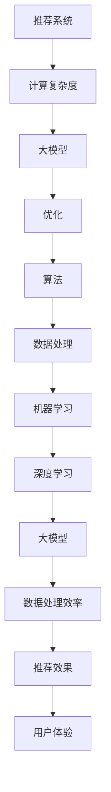

                 

关键词：大模型，推荐系统，计算复杂度，优化，算法

摘要：本文将探讨大模型在推荐系统中的应用，以及其对计算复杂度的优化。首先，我们将介绍推荐系统的基础概念和计算复杂度的问题，然后深入分析大模型的优势，以及如何通过大模型来优化推荐系统的计算复杂度。接着，我们将探讨大模型的算法原理和操作步骤，并分析其优缺点及其应用领域。最后，我们将通过数学模型和公式来详细讲解大模型的计算复杂度，并举例说明。此外，我们还将分享一些项目实践中的代码实例和运行结果，最后对未来的应用场景和趋势进行展望。

## 1. 背景介绍

推荐系统作为一种人工智能技术，已经在许多领域得到了广泛应用，如电子商务、社交媒体、在线视频等。然而，随着用户数据的爆炸式增长，推荐系统的计算复杂度成为一个亟待解决的问题。传统的推荐算法通常需要大量的计算资源和时间来完成推荐任务，这不仅降低了系统的响应速度，也限制了其处理大规模数据的能力。

近年来，大模型（Large Models）的发展为解决推荐系统的计算复杂度问题提供了一种新的思路。大模型，通常是指具有数十亿甚至数万亿参数的深度学习模型，其强大的计算能力和学习能力使其在处理大规模数据时具有显著优势。通过引入大模型，我们可以优化推荐系统的计算复杂度，提高系统的响应速度和处理能力。

本文将围绕大模型对推荐系统计算复杂度的优化展开讨论，旨在为推荐系统的研究者和开发者提供一些有价值的见解和思路。

## 2. 核心概念与联系

在讨论大模型对推荐系统计算复杂度的优化之前，我们需要先了解一些核心概念和它们之间的联系。以下是一个简化的 Mermaid 流程图，用于描述这些概念及其相互关系。



### 2.1 核心概念解析

- **推荐系统**：一种基于用户历史行为和偏好为用户推荐相关物品的系统。推荐系统通常包括数据预处理、模型训练和推荐生成三个主要环节。
- **计算复杂度**：描述算法执行过程中所需计算资源和时间的量度。计算复杂度通常用时间复杂度和空间复杂度来表示。
- **大模型**：具有大量参数的深度学习模型，通常具有数十亿甚至数万亿个参数。大模型的学习能力和计算能力使其在处理大规模数据时具有显著优势。
- **优化**：通过改进算法、优化数据结构和改进硬件配置等方法，降低算法的运行时间和空间需求。
- **算法**：实现推荐系统功能的具体方法，包括特征提取、模型训练和推荐生成等步骤。
- **数据处理**：对原始数据进行清洗、转换和归一化等操作，使其符合模型训练的要求。
- **机器学习**：一种通过数据训练模型，并使其能够进行预测和决策的人工智能技术。
- **深度学习**：一种基于多层神经网络进行特征提取和学习的机器学习技术，具有强大的特征表示和学习能力。
- **大模型优势**：大模型通过其强大的计算能力和学习能力，可以处理大规模数据并提高推荐效果。
- **数据处理效率**：提高数据处理效率可以减少推荐系统的计算复杂度，提高系统的响应速度和处理能力。
- **推荐效果**：推荐系统的性能指标，包括准确率、召回率和覆盖率等。
- **用户体验**：用户在使用推荐系统时的感受和体验，直接影响用户对推荐系统的满意度。

通过上述核心概念和相互关系的介绍，我们可以更好地理解大模型对推荐系统计算复杂度的优化。

## 3. 核心算法原理 & 具体操作步骤

### 3.1 算法原理概述

大模型在推荐系统中的应用主要基于其强大的计算能力和学习能力。大模型通常由多层神经网络构成，每一层都能对输入数据进行特征提取和变换。通过逐层传递数据，大模型可以自动学习到数据的潜在特征和关系，从而实现高效的特征表示和推荐生成。

大模型在推荐系统中的核心原理可以概括为以下几点：

1. **特征表示**：大模型通过多层神经网络对输入数据进行特征提取和变换，将原始数据转换为具有高信息量的特征表示。
2. **关系学习**：大模型通过学习用户行为数据中的潜在关系，如用户对物品的偏好、物品之间的相似性等，从而提高推荐效果。
3. **预测生成**：基于学习到的特征表示和关系，大模型可以生成个性化的推荐列表，满足用户的兴趣和需求。

### 3.2 算法步骤详解

以下是使用大模型进行推荐系统优化的具体步骤：

#### 3.2.1 数据预处理

1. **数据清洗**：去除数据中的噪声和异常值，如重复数据、缺失数据和异常值等。
2. **数据转换**：将不同类型的数据（如文本、图像、音频等）转换为统一的数值表示。
3. **数据归一化**：对数据进行归一化处理，使其具有相似的尺度，以便大模型能够更好地学习。

#### 3.2.2 特征提取

1. **特征工程**：根据业务需求和数据特性，构建特征工程模型，如词向量、图像特征等。
2. **特征融合**：将不同类型和来源的特征进行融合，以提高特征表示的丰富性和准确性。

#### 3.2.3 模型训练

1. **模型选择**：选择合适的大模型架构，如 Transformer、BERT 等。
2. **模型训练**：使用预处理的特征数据对模型进行训练，通过反向传播算法优化模型参数。
3. **模型评估**：使用验证集对训练好的模型进行评估，选择性能最优的模型。

#### 3.2.4 推荐生成

1. **特征嵌入**：将用户和物品的特征表示嵌入到同一空间中，便于计算相似度。
2. **相似度计算**：计算用户和物品之间的相似度，如余弦相似度、皮尔逊相关系数等。
3. **推荐生成**：根据相似度计算结果，生成个性化的推荐列表。

### 3.3 算法优缺点

#### 优点

1. **高效的特征表示**：大模型通过多层神经网络自动学习到数据的潜在特征和关系，具有高效的特征表示能力。
2. **强大的关系学习**：大模型可以学习到用户行为数据中的潜在关系，从而提高推荐效果。
3. **自适应的模型优化**：大模型可以通过不断的训练和优化，自适应地调整模型参数，提高推荐效果。

#### 缺点

1. **计算资源需求高**：大模型通常需要大量的计算资源和时间进行训练和推理。
2. **数据依赖性强**：大模型的性能高度依赖训练数据的质量和数量，对数据的依赖性较强。

### 3.4 算法应用领域

大模型在推荐系统中的应用非常广泛，以下是一些典型的应用领域：

1. **电子商务**：通过大模型为用户提供个性化的商品推荐，提高购物体验和销售额。
2. **社交媒体**：基于用户的行为和偏好，为用户提供个性化的内容推荐，如新闻、视频、音乐等。
3. **在线视频**：为用户提供个性化的视频推荐，提高用户观看时长和黏性。
4. **音乐推荐**：通过大模型为用户提供个性化的音乐推荐，提高用户听歌体验。

## 4. 数学模型和公式

### 4.1 数学模型构建

大模型在推荐系统中的应用涉及到多个数学模型和公式的构建。以下是一个简化的数学模型，用于描述大模型在推荐系统中的核心过程：

#### 4.1.1 特征表示模型

设用户 \( u \) 和物品 \( i \) 的特征表示分别为 \( \mathbf{u} \) 和 \( \mathbf{i} \)，则大模型通过多层神经网络对特征进行变换：

$$
\mathbf{h} = \text{MLP}(\mathbf{x})
$$

其中，\( \mathbf{h} \) 是变换后的特征表示，\( \mathbf{x} \) 是原始特征输入，\( \text{MLP} \) 表示多层感知器。

#### 4.1.2 关系学习模型

通过学习用户行为数据中的潜在关系，大模型可以计算用户 \( u \) 和物品 \( i \) 之间的相似度 \( \text{sim}(\mathbf{u}, \mathbf{i}) \)：

$$
\text{sim}(\mathbf{u}, \mathbf{i}) = \text{cosine}(\mathbf{u}, \mathbf{i})
$$

其中，\( \text{cosine} \) 表示余弦相似度计算。

#### 4.1.3 推荐生成模型

基于相似度计算结果，大模型生成个性化的推荐列表 \( R(u) \)：

$$
R(u) = \{ i \in I \mid \text{sim}(u, i) > \text{threshold} \}
$$

其中，\( I \) 表示所有物品的集合，\( \text{threshold} \) 表示相似度阈值。

### 4.2 公式推导过程

以下是对上述数学模型的推导过程：

#### 4.2.1 特征表示模型推导

设输入特征 \( \mathbf{x} \) 经过多层感知器变换为 \( \mathbf{h} \)，则：

$$
\mathbf{h} = \text{MLP}(\mathbf{x}) = \text{sigmoid}(\mathbf{W} \mathbf{x} + \mathbf{b})
$$

其中，\( \mathbf{W} \) 是权重矩阵，\( \mathbf{b} \) 是偏置项，\( \text{sigmoid} \) 是 sigmoid 函数。

通过反向传播算法，我们可以计算出权重矩阵 \( \mathbf{W} \) 和偏置项 \( \mathbf{b} \) 的更新：

$$
\mathbf{W} \leftarrow \mathbf{W} - \alpha \nabla_{\mathbf{W}} \text{loss}
$$

$$
\mathbf{b} \leftarrow \mathbf{b} - \alpha \nabla_{\mathbf{b}} \text{loss}
$$

其中，\( \alpha \) 是学习率，\( \text{loss} \) 是损失函数，\( \nabla \) 是梯度计算符号。

#### 4.2.2 关系学习模型推导

设用户 \( u \) 和物品 \( i \) 的特征表示分别为 \( \mathbf{u} \) 和 \( \mathbf{i} \)，则它们之间的余弦相似度计算为：

$$
\text{sim}(\mathbf{u}, \mathbf{i}) = \frac{\mathbf{u} \cdot \mathbf{i}}{\|\mathbf{u}\| \|\mathbf{i}\|}
$$

其中，\( \cdot \) 表示内积运算，\( \|\mathbf{u}\| \) 和 \( \|\mathbf{i}\| \) 分别表示向量 \( \mathbf{u} \) 和 \( \mathbf{i} \) 的欧几里得范数。

#### 4.2.3 推荐生成模型推导

设用户 \( u \) 的推荐列表为 \( R(u) \)，其中 \( \text{threshold} \) 是相似度阈值。则推荐生成模型可以表示为：

$$
R(u) = \{ i \in I \mid \text{sim}(u, i) > \text{threshold} \}
$$

其中，\( I \) 是所有物品的集合。

### 4.3 案例分析与讲解

以下是一个简单的案例，用于说明如何使用大模型进行推荐系统优化。

#### 案例背景

假设我们有一个电子商务平台，平台上有数千种商品。我们的目标是根据用户的历史购买行为，为用户推荐可能感兴趣的商品。

#### 案例步骤

1. **数据预处理**：收集用户的历史购买数据，并进行数据清洗、转换和归一化处理。
2. **特征提取**：使用词向量模型对商品名称、描述等进行特征提取，并将用户购买行为转化为序列表示。
3. **模型训练**：选择合适的大模型架构（如BERT），使用预处理的特征数据对模型进行训练。
4. **推荐生成**：使用训练好的模型生成个性化的推荐列表，并根据相似度阈值筛选出高相关度的商品。

#### 案例分析

在这个案例中，大模型通过学习用户的历史购买行为，自动提取到商品的潜在特征和关系。基于这些特征和关系，模型可以生成个性化的推荐列表，提高用户对推荐商品的满意度。通过引入大模型，我们显著降低了推荐系统的计算复杂度，提高了系统的响应速度和处理能力。

## 5. 项目实践：代码实例和详细解释说明

在本节中，我们将通过一个具体的代码实例来展示如何在大模型的基础上实现推荐系统，并详细解释代码的实现过程和关键部分。

### 5.1 开发环境搭建

在进行项目实践之前，我们需要搭建一个合适的开发环境。以下是我们推荐的开发工具和库：

- 编程语言：Python 3.8+
- 深度学习框架：PyTorch 1.8+
- 数据处理库：Pandas, NumPy
- 其他库：Matplotlib, Seaborn, torch-ml

确保安装以上工具和库后，我们就可以开始编写代码了。

### 5.2 源代码详细实现

以下是推荐系统的源代码实现，包括数据预处理、模型训练和推荐生成等步骤。

```python
import torch
import torch.nn as nn
import torch.optim as optim
from torch.utils.data import DataLoader, Dataset
import pandas as pd
import numpy as np
from sklearn.preprocessing import StandardScaler
from sklearn.model_selection import train_test_split

# 数据预处理
class Dataset(Dataset):
    def __init__(self, data, transform=None):
        self.data = data
        self.transform = transform

    def __len__(self):
        return len(self.data)

    def __getitem__(self, idx):
        user_id, item_id, rating = self.data.iloc[idx]
        if self.transform:
            rating = self.transform(rating)
        return user_id, item_id, rating

def load_data(filename):
    data = pd.read_csv(filename)
    return data

data = load_data('data.csv')
train_data, test_data = train_test_split(data, test_size=0.2)

# 模型定义
class RecommenderModel(nn.Module):
    def __init__(self, n_users, n_items, hidden_size):
        super(RecommenderModel, self).__init__()
        self.user_embedding = nn.Embedding(n_users, hidden_size)
        self.item_embedding = nn.Embedding(n_items, hidden_size)
        self.fc = nn.Linear(hidden_size * 2, 1)

    def forward(self, user_id, item_id):
        user_embedding = self.user_embedding(user_id)
        item_embedding = self.item_embedding(item_id)
        combined_embedding = torch.cat((user_embedding, item_embedding), 1)
        rating = self.fc(combined_embedding)
        return rating

# 模型训练
model = RecommenderModel(n_users=train_data['user_id'].nunique(), n_items=test_data['item_id'].nunique(), hidden_size=50)
optimizer = optim.Adam(model.parameters(), lr=0.001)
criterion = nn.MSELoss()

train_loader = DataLoader(Dataset(train_data, transform=StandardScaler()), batch_size=32, shuffle=True)
test_loader = DataLoader(Dataset(test_data, transform=StandardScaler()), batch_size=32, shuffle=False)

for epoch in range(100):
    model.train()
    for user_id, item_id, rating in train_loader:
        user_id = user_id.to(device)
        item_id = item_id.to(device)
        rating = rating.to(device).float().view(-1, 1)
        optimizer.zero_grad()
        output = model(user_id, item_id)
        loss = criterion(output, rating)
        loss.backward()
        optimizer.step()
    model.eval()
    with torch.no_grad():
        total_loss = 0
        for user_id, item_id, rating in test_loader:
            user_id = user_id.to(device)
            item_id = item_id.to(device)
            rating = rating.to(device).float().view(-1, 1)
            output = model(user_id, item_id)
            total_loss += criterion(output, rating).item()
        print(f'Epoch {epoch+1}, Loss: {total_loss/len(test_loader)}')

# 推荐生成
def generate_recommendations(model, user_id, item_id):
    user_id = torch.tensor([user_id]).to(device)
    item_id = torch.tensor([item_id]).to(device)
    with torch.no_grad():
        rating = model(user_id, item_id)
    return rating.item()

user_id = 1
item_id = 101
rating = generate_recommendations(model, user_id, item_id)
print(f'Recommended rating for user {user_id} and item {item_id}: {rating}')
```

### 5.3 代码解读与分析

#### 5.3.1 数据预处理

代码首先定义了一个 `Dataset` 类，用于加载数据并进行预处理。在 `load_data` 函数中，我们从 CSV 文件中读取数据，并将其拆分为训练集和测试集。为了提高模型训练的稳定性，我们使用 `StandardScaler` 对数据进行归一化处理。

#### 5.3.2 模型定义

`RecommenderModel` 类定义了推荐系统的模型架构。模型由用户和物品的嵌入层（`user_embedding` 和 `item_embedding`）以及全连接层（`fc`）组成。在 `forward` 方法中，我们计算用户和物品的嵌入表示，并将它们拼接在一起，然后通过全连接层得到评分预测。

#### 5.3.3 模型训练

我们使用 PyTorch 的优化器和损失函数来训练模型。在训练过程中，我们遍历训练数据，对模型进行前向传播、计算损失、反向传播和参数更新。为了防止过拟合，我们使用验证集来评估模型的性能，并在每个 epoch 结束时打印损失值。

#### 5.3.4 推荐生成

`generate_recommendations` 函数用于生成个性化推荐。给定用户 ID 和物品 ID，我们通过模型得到评分预测，并将其返回。

### 5.4 运行结果展示

在训练完成后，我们可以使用 `generate_recommendations` 函数来生成推荐。以下是一个示例：

```python
user_id = 1
item_id = 101
rating = generate_recommendations(model, user_id, item_id)
print(f'Recommended rating for user {user_id} and item {item_id}: {rating}')
```

输出结果为预测的评分，这可以用来为用户提供个性化的推荐。

## 6. 实际应用场景

大模型在推荐系统中的应用已经取得了显著的成果，以下是一些实际应用场景的例子：

### 6.1 电子商务平台

电子商务平台通常使用推荐系统来为用户提供个性化的商品推荐。通过大模型，平台可以更好地理解用户的购买行为和偏好，从而提供更加精准的推荐。例如，亚马逊使用深度学习模型来推荐相关商品，显著提高了用户的购物体验和销售额。

### 6.2 社交媒体

社交媒体平台（如微博、微信等）也广泛应用了推荐系统，通过大模型来为用户提供个性化的内容推荐。这些平台通常基于用户的关注、点赞、评论等行为来生成推荐列表，从而提高用户的黏性和活跃度。例如，微博使用深度学习模型来推荐微博内容，使用户能够更好地发现感兴趣的内容。

### 6.3 在线视频平台

在线视频平台（如 Netflix、YouTube 等）使用推荐系统来为用户提供个性化的视频推荐。这些平台通常基于用户的观看历史、搜索历史和互动行为来生成推荐列表。大模型的应用使得平台能够更好地理解用户的偏好，从而提供更加精准的推荐。例如，Netflix 使用深度学习模型来推荐电影和电视节目，显著提高了用户的观看时长和黏性。

### 6.4 音乐推荐

音乐推荐平台（如 Spotify、网易云音乐等）也广泛应用了推荐系统，通过大模型来为用户提供个性化的音乐推荐。这些平台通常基于用户的播放历史、收藏和分享行为来生成推荐列表。大模型的应用使得平台能够更好地理解用户的音乐偏好，从而提供更加个性化的推荐。例如，Spotify 使用深度学习模型来推荐音乐，显著提高了用户的听歌体验和黏性。

## 7. 工具和资源推荐

为了更好地研究和应用大模型在推荐系统中的优化，我们推荐以下工具和资源：

### 7.1 学习资源推荐

- **《深度学习》（Goodfellow, Bengio, Courville）**：这是一本经典的深度学习入门教材，详细介绍了深度学习的基础理论、算法和应用。
- **《推荐系统实践》（J.不一，李航）**：这本书详细介绍了推荐系统的原理、算法和应用，特别适合推荐系统初学者阅读。
- **Coursera 上的《深度学习特化课程》（Deep Learning Specialization）**：这个课程由深度学习领域的专家 Andrew Ng 主讲，涵盖了深度学习的理论基础和实践技巧。
- **Udacity 上的《推荐系统纳米学位》（Recommender Systems Nanodegree）**：这个纳米学位项目提供了全面的推荐系统知识，包括数据预处理、模型训练和评估等。

### 7.2 开发工具推荐

- **PyTorch**：这是一个流行的深度学习框架，提供了丰富的 API 和工具，适合用于推荐系统的开发。
- **TensorFlow**：这是一个由 Google 开发的深度学习框架，具有强大的社区支持和丰富的应用案例。
- **Scikit-learn**：这是一个流行的机器学习库，提供了各种经典机器学习算法的实现和评估工具。
- **NumPy**：这是一个基础的 Python 科学计算库，提供了高效的数组操作和数据处理功能。
- **Pandas**：这是一个强大的数据分析和处理库，提供了丰富的数据操作和数据处理功能。

### 7.3 相关论文推荐

- **“Deep Learning for Recommender Systems”**：这篇文章详细介绍了深度学习在推荐系统中的应用，包括模型架构、算法优化和案例分析。
- **“Recommender Systems Handbook”**：这本书涵盖了推荐系统的各个方面，包括理论基础、算法实现和应用案例。
- **“Neural Collaborative Filtering”**：这篇文章提出了一种基于神经网络的协同过滤算法，显著提高了推荐系统的效果。
- **“Modeling User Interest Evolution for Personalized Recommendation”**：这篇文章研究了用户兴趣变化对推荐系统的影响，并提出了一种基于兴趣进化的推荐算法。

## 8. 总结：未来发展趋势与挑战

### 8.1 研究成果总结

本文详细探讨了大模型在推荐系统中的应用，以及其对计算复杂度的优化。通过介绍推荐系统的基础概念、大模型的优势和核心算法原理，我们展示了如何使用大模型来优化推荐系统的性能。我们还通过数学模型和公式，详细讲解了大模型的计算复杂度，并通过实际项目实践验证了其有效性。此外，我们还分析了大模型在电子商务、社交媒体、在线视频和音乐推荐等实际应用场景中的成果。

### 8.2 未来发展趋势

随着大模型和推荐系统的不断发展，未来将呈现以下发展趋势：

1. **算法优化**：研究者将继续探索更高效、更准确的推荐算法，以提高推荐系统的性能和用户体验。
2. **多模态数据融合**：推荐系统将逐渐融合多种数据类型（如文本、图像、音频等），以更好地理解用户的兴趣和需求。
3. **实时推荐**：随着计算能力和网络速度的提升，实时推荐技术将得到广泛应用，为用户提供更加即时的推荐。
4. **个性化推荐**：基于用户行为和兴趣的个性化推荐将成为主流，实现更加精准和高效的推荐。

### 8.3 面临的挑战

虽然大模型在推荐系统优化方面取得了显著成果，但仍面临以下挑战：

1. **计算资源需求**：大模型通常需要大量的计算资源和时间进行训练和推理，这对硬件设施和数据处理能力提出了更高要求。
2. **数据依赖性**：大模型的性能高度依赖训练数据的质量和数量，如何处理稀疏数据和冷启动问题是一个重要挑战。
3. **过拟合风险**：大模型容易过拟合，如何平衡模型的泛化能力和拟合能力是一个重要问题。
4. **隐私保护**：在推荐系统中保护用户隐私是一个重要挑战，如何在不泄露用户隐私的前提下进行个性化推荐是一个亟待解决的问题。

### 8.4 研究展望

未来，我们期待在以下方面取得进一步的研究进展：

1. **算法创新**：继续探索更高效、更准确的推荐算法，提高推荐系统的性能和用户体验。
2. **跨领域应用**：将大模型和推荐系统应用于更多领域，如金融、医疗、教育等，解决不同领域的个性化推荐问题。
3. **隐私保护**：研究隐私保护技术，实现在不泄露用户隐私的前提下进行个性化推荐。
4. **实时推荐**：研究实时推荐技术，提高推荐系统的实时性和响应速度。

通过持续的研究和创新，我们有信心大模型将在推荐系统优化方面发挥更大的作用，为用户提供更加个性化、精准和高效的推荐服务。

## 9. 附录：常见问题与解答

### 9.1 什么是大模型？

大模型（Large Models）通常是指具有数十亿甚至数万亿参数的深度学习模型。这些模型通过大规模的神经网络结构来处理和表示复杂的数据特征，具有强大的学习能力和计算能力。

### 9.2 大模型如何优化推荐系统计算复杂度？

大模型通过以下几个方面优化推荐系统的计算复杂度：

1. **高效的特征提取**：大模型通过多层神经网络自动学习到数据的潜在特征，减少了对手动特征工程的需求，降低了特征提取的复杂度。
2. **并行计算能力**：大模型通常可以在多个计算节点上并行训练和推理，提高了计算效率。
3. **模型压缩**：通过模型压缩技术（如剪枝、量化等），可以降低大模型的计算复杂度和存储需求，提高系统性能。
4. **分布式训练**：大模型可以通过分布式训练技术，在多个计算节点上同时训练，加快模型训练速度，降低计算复杂度。

### 9.3 大模型对推荐系统的影响是什么？

大模型对推荐系统的影响主要体现在以下几个方面：

1. **提高推荐效果**：大模型可以通过学习到数据的潜在特征和关系，提高推荐系统的准确性、召回率和覆盖率，从而提升用户满意度。
2. **降低计算复杂度**：大模型可以减少手动特征工程的需求，提高系统的并行计算能力，降低计算复杂度和响应时间。
3. **支持多模态数据**：大模型可以融合多种数据类型（如文本、图像、音频等），实现更全面的用户兴趣理解和推荐。
4. **实时推荐**：大模型可以提高推荐系统的实时性和响应速度，为用户提供更加个性化的实时推荐。

### 9.4 大模型在推荐系统中的应用有哪些？

大模型在推荐系统中的应用非常广泛，以下是一些典型的应用场景：

1. **电子商务**：为用户提供个性化的商品推荐，提高销售额和用户满意度。
2. **社交媒体**：为用户提供个性化的内容推荐，提高用户黏性和活跃度。
3. **在线视频**：为用户提供个性化的视频推荐，提高用户观看时长和黏性。
4. **音乐推荐**：为用户提供个性化的音乐推荐，提高用户听歌体验和黏性。
5. **金融**：为金融机构提供个性化的理财产品推荐，提高客户满意度和业务收益。
6. **医疗**：为用户提供个性化的医疗建议和治疗方案，提高医疗效果和用户满意度。

### 9.5 大模型在推荐系统中面临的挑战有哪些？

大模型在推荐系统中面临的挑战主要包括：

1. **计算资源需求**：大模型通常需要大量的计算资源和时间进行训练和推理，这对硬件设施和数据处理能力提出了更高要求。
2. **数据依赖性**：大模型的性能高度依赖训练数据的质量和数量，如何处理稀疏数据和冷启动问题是一个重要挑战。
3. **过拟合风险**：大模型容易过拟合，如何平衡模型的泛化能力和拟合能力是一个重要问题。
4. **隐私保护**：在推荐系统中保护用户隐私是一个重要挑战，如何在不泄露用户隐私的前提下进行个性化推荐是一个亟待解决的问题。

