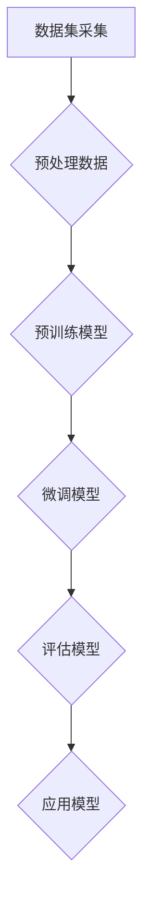

                 

在当今技术发展的快车道上，人工智能（AI）已成为推动各行业变革的核心动力。随着深度学习、神经网络等技术的不断进步，大模型如GPT-3、BERT等在全球范围内得到广泛应用。然而，如何最大化大模型的应用价值，实现AI解决问题能力的最大化，而不仅仅是关注其成本，成为了业界关注的焦点。本文将深入探讨大模型应用的关键所在，强调解决问题能力的重要性，同时审视价格因素在其中的角色。

## 关键词
- 大模型
- AI应用
- 解决问题能力
- 成本效益
- 技术创新

## 摘要
本文从理论与实践角度出发，详细分析了大模型在AI应用中的关键作用。我们首先回顾了大模型的发展历程和基本原理，然后探讨了其在解决问题方面的显著优势。在此基础上，我们探讨了如何在实际应用中平衡价格与解决问题能力，最终提出了未来发展的趋势和面临的挑战。

## 1. 背景介绍
大模型的发展起源于深度学习技术的突破。在过去的十年中，随着计算能力和数据量的指数增长，神经网络模型得到了前所未有的发展。从最初的浅层网络到如今的大型预训练模型，大模型在图像识别、自然语言处理、推荐系统等领域取得了显著的进展。

### 1.1 大模型的发展历程
- **浅层网络**：早期的神经网络模型主要采用多层感知器（MLP）等简单的结构，但由于梯度消失和梯度爆炸等问题，其性能受到限制。
- **深层网络**：通过引入ReLU激活函数、Dropout等技术，深层网络得以克服训练难题，并在图像分类任务中取得突破。
- **预训练与微调**：随着数据量的增加和计算资源的提升，预训练技术成为主流。预训练模型在大规模数据集上预训练，然后在特定任务上微调，大幅提升了模型性能。
- **大模型时代**：随着Transformer架构的提出和BERT、GPT-3等大模型的问世，模型参数量从数百万增长到数十亿，甚至百亿以上。

### 1.2 大模型的基本原理
大模型的核心在于其参数规模和架构设计。以BERT和GPT-3为例，它们采用了Transformer架构，通过自注意力机制实现对输入数据的全局依赖建模。大模型通常经过大规模预训练，然后通过微调适应特定任务，从而实现了在多种任务上的优异表现。

## 2. 核心概念与联系
大模型的应用价值不仅体现在其模型规模上，更在于其解决实际问题的能力。为了深入理解这一概念，我们需要从以下几个方面进行探讨。

### 2.1 解决问题的能力
- **泛化能力**：大模型在预训练阶段学习了大量知识，使其在未见过的数据上仍能保持良好的性能，这是其解决问题的关键。
- **灵活性**：大模型通过微调能够适应不同领域的任务，从而发挥其解决问题的广泛性。

### 2.2 大模型的架构与机制
- **Transformer架构**：Transformer引入了自注意力机制，通过计算输入序列中每个元素与其他元素的相关性，实现了对全局依赖的建模。
- **自监督学习**：大模型通常采用自监督学习技术进行预训练，从而在无监督环境中获得大量数据。

### 2.3 Mermaid流程图
以下是一个简化的Mermaid流程图，展示了大模型的基本架构和关键步骤：



### 2.4 大模型的优缺点
- **优点**：大模型具有强大的泛化能力和灵活性，能够处理复杂任务。
- **缺点**：大模型需要大量的计算资源和数据，且可能存在过拟合的风险。

## 3. 核心算法原理 & 具体操作步骤
### 3.1 算法原理概述
大模型的核心算法是Transformer架构，其基本原理是通过自注意力机制计算输入序列中每个元素与其他元素的相关性，从而实现对全局依赖的建模。以下是一个简化的Transformer模型：


### 3.2 算法步骤详解
- **嵌入层**：将输入序列转换为固定长度的向量。
- **位置编码**：为序列中的每个元素添加位置信息。
- **多头自注意力**：通过多个注意力头来计算输入序列中每个元素与其他元素的相关性。
- **前馈神经网络**：对自注意力层的输出进行进一步处理。
- **层归一化**和**Dropout**：防止过拟合，提高模型泛化能力。
- **加和**和**输出层**：将处理后的特征进行加和，并输出预测结果。

### 3.3 算法优缺点
- **优点**：Transformer架构具有并行计算的优势，训练速度快；能够处理长距离依赖；适用于多种任务。
- **缺点**：参数量大，计算资源需求高；可能存在过拟合风险。

### 3.4 算法应用领域
- **自然语言处理**：如文本分类、机器翻译、问答系统等。
- **计算机视觉**：如图像分类、目标检测等。
- **推荐系统**：如商品推荐、用户行为分析等。

## 4. 数学模型和公式 & 详细讲解 & 举例说明
### 4.1 数学模型构建
大模型的数学模型主要包括两部分：自注意力机制和前馈神经网络。

### 4.2 公式推导过程
- **自注意力机制**：
  $$ \text{Attention}(Q, K, V) = \frac{1}{\sqrt{d_k}} \text{softmax}\left(\frac{QK^T}{d_k}\right)V $$
  其中，$Q, K, V$ 分别为查询向量、键向量和值向量；$d_k$ 为键向量的维度。

- **前馈神经网络**：
  $$ \text{FFN}(X) = \text{ReLU}(W_2 \cdot \text{ReLU}(W_1 X + b_1)) $$
  其中，$W_1, W_2$ 为权重矩阵；$b_1$ 为偏置；$\text{ReLU}$ 为ReLU激活函数。

### 4.3 案例分析与讲解
以下是一个简单的自然语言处理任务：文本分类。假设我们有一个二分类任务，需要判断一段文本是否包含负面情绪。

- **数据准备**：收集包含负面情绪的文本数据，并标记为1；不含负面情绪的文本数据，并标记为0。
- **模型训练**：使用预训练的BERT模型，并在文本上微调。
- **模型评估**：在测试集上评估模型性能，计算准确率、召回率等指标。

## 5. 项目实践：代码实例和详细解释说明
### 5.1 开发环境搭建
- **环境要求**：Python 3.7及以上版本，PyTorch 1.7及以上版本。
- **安装依赖**：pip install torch torchvision bert

### 5.2 源代码详细实现
以下是一个简单的文本分类任务的实现代码：

```python
import torch
import torch.nn as nn
from transformers import BertModel, BertTokenizer

class TextClassifier(nn.Module):
    def __init__(self):
        super(TextClassifier, self).__init__()
        self.bert = BertModel.from_pretrained('bert-base-uncased')
        self.dropout = nn.Dropout(0.1)
        self.fc = nn.Linear(768, 1)

    def forward(self, input_ids, attention_mask):
        _, pooled_output = self.bert(input_ids=input_ids, attention_mask=attention_mask)
        output = self.dropout(pooled_output)
        output = self.fc(output)
        return torch.sigmoid(output)

def train(model, train_loader, criterion, optimizer, device):
    model.train()
    for batch in train_loader:
        input_ids = batch['input_ids'].to(device)
        attention_mask = batch['attention_mask'].to(device)
        labels = batch['labels'].to(device)
        optimizer.zero_grad()
        outputs = model(input_ids=input_ids, attention_mask=attention_mask)
        loss = criterion(outputs, labels)
        loss.backward()
        optimizer.step()

def evaluate(model, eval_loader, device):
    model.eval()
    with torch.no_grad():
        for batch in eval_loader:
            input_ids = batch['input_ids'].to(device)
            attention_mask = batch['attention_mask'].to(device)
            labels = batch['labels'].to(device)
            outputs = model(input_ids=input_ids, attention_mask=attention_mask)
            predictions = (outputs > 0.5).float()
            correct = (predictions == labels).sum()
    return correct / len(eval_loader)

# 模型训练与评估
model = TextClassifier().to(device)
optimizer = torch.optim.Adam(model.parameters(), lr=1e-5)
criterion = nn.BCELoss()

train_loader = DataLoader(train_dataset, batch_size=32, shuffle=True)
eval_loader = DataLoader(eval_dataset, batch_size=32, shuffle=False)

for epoch in range(3):
    train(model, train_loader, criterion, optimizer, device)
    train_loss = evaluate(model, train_loader, device)
    eval_loss = evaluate(model, eval_loader, device)
    print(f'Epoch {epoch + 1}, Train Loss: {train_loss:.4f}, Eval Loss: {eval_loss:.4f}')
```

### 5.3 代码解读与分析
- **模型定义**：TextClassifier类定义了一个简单的文本分类模型，其中使用了BERT模型作为基础网络。
- **训练函数**：train函数负责模型的训练过程，包括前向传播、损失计算和反向传播。
- **评估函数**：evaluate函数负责在训练集和测试集上评估模型性能。

## 6. 实际应用场景
大模型在各个行业领域都有广泛的应用，以下列举几个典型的应用场景：

### 6.1 自然语言处理
- **机器翻译**：如Google翻译、百度翻译等。
- **文本分类**：如新闻分类、情感分析等。
- **问答系统**：如Apple的Siri、Amazon的Alexa等。

### 6.2 计算机视觉
- **图像分类**：如人脸识别、物体检测等。
- **图像生成**：如风格迁移、人脸生成等。

### 6.3 推荐系统
- **商品推荐**：如淘宝、京东等电商平台的商品推荐。
- **内容推荐**：如YouTube、Netflix等视频推荐。

## 6.4 未来应用展望
随着大模型技术的不断进步，未来的应用场景将更加广泛。以下是一些可能的发展趋势：

### 6.4.1 自动驾驶
- **环境感知**：通过大模型处理摄像头和激光雷达数据，实现实时环境感知。
- **决策支持**：大模型可以为自动驾驶系统提供决策支持，提高行驶安全性和效率。

### 6.4.2 医疗健康
- **疾病预测**：通过分析患者数据，大模型可以帮助预测疾病风险。
- **药物研发**：大模型可以加速药物研发过程，提高新药发现的成功率。

### 6.4.3 教育科技
- **个性化学习**：大模型可以根据学生的学习习惯和进度，提供个性化的学习内容。
- **智能辅导**：通过自然语言处理技术，大模型可以为学生提供智能辅导。

## 7. 工具和资源推荐
为了更好地掌握大模型技术，以下是一些建议的学习资源和工具：

### 7.1 学习资源推荐
- **书籍**：
  - 《深度学习》（Ian Goodfellow、Yoshua Bengio、Aaron Courville 著）
  - 《神经网络与深度学习》（邱锡鹏 著）
- **在线课程**：
  - Coursera的“神经网络与深度学习”课程
  - edX的“人工智能基础”课程

### 7.2 开发工具推荐
- **PyTorch**：一款开源的深度学习框架，易于使用和扩展。
- **TensorFlow**：由Google开发的开源深度学习框架，拥有丰富的生态系统。

### 7.3 相关论文推荐
- **《Attention Is All You Need》**：介绍了Transformer架构，是深度学习领域的重要论文。
- **《BERT: Pre-training of Deep Bidirectional Transformers for Language Understanding》**：介绍了BERT模型的预训练技术，对自然语言处理领域产生了深远影响。

## 8. 总结：未来发展趋势与挑战
大模型技术的发展带来了前所未有的机遇，但也面临一系列挑战。在未来的发展中，我们需要关注以下几个方面：

### 8.1 研究成果总结
- **模型效率提升**：通过模型压缩、蒸馏等技术，提高大模型的计算效率。
- **跨模态学习**：实现多模态数据的融合，提高模型处理复杂数据的能力。
- **可解释性增强**：提高大模型的可解释性，使其在关键领域得到更广泛的应用。

### 8.2 未来发展趋势
- **模型规模扩大**：随着计算资源的增长，未来可能会有更多的大型预训练模型问世。
- **领域适应性增强**：大模型将更擅长处理特定领域的任务，实现更高水平的任务自动化。

### 8.3 面临的挑战
- **计算资源需求**：大模型需要大量的计算资源和数据，对基础设施提出了更高要求。
- **数据隐私和安全**：在应用大模型的过程中，如何保护用户数据隐私成为关键问题。
- **算法公平性**：大模型在处理数据时可能存在偏见，如何确保算法的公平性是一个重要挑战。

### 8.4 研究展望
大模型技术的发展将推动人工智能在各个领域的应用，为人类带来更多的便利和创新。同时，我们也需要关注其可能带来的负面影响，并积极探索解决之道。

## 9. 附录：常见问题与解答
### 9.1 什么是大模型？
大模型是指具有数十亿参数的深度学习模型，如BERT、GPT-3等，它们在预训练阶段学习大量知识，具有强大的泛化能力和灵活性。

### 9.2 大模型如何进行微调？
微调是指在大规模预训练的基础上，针对特定任务进行进一步训练。通常，微调过程包括数据预处理、模型初始化、训练和评估等步骤。

### 9.3 大模型的优势和局限性是什么？
大模型的优势在于其强大的泛化能力和灵活性，但同时也需要大量的计算资源和数据。局限性主要体现在过拟合风险和计算效率方面。

### 9.4 大模型在自然语言处理中的应用有哪些？
大模型在自然语言处理领域有广泛的应用，包括文本分类、机器翻译、问答系统等。通过预训练和微调，大模型可以处理多种复杂的自然语言任务。

### 9.5 大模型在计算机视觉中的应用有哪些？
大模型在计算机视觉领域可以应用于图像分类、目标检测、图像生成等。通过自注意力机制和预训练技术，大模型能够处理复杂数据，提高模型性能。

---

本文从大模型的发展历程、基本原理、算法步骤、实际应用等方面进行了全面探讨，强调了AI解决问题能力的重要性。在未来的发展中，我们需要关注大模型技术的创新与应用，同时解决面临的挑战，推动人工智能技术的持续进步。

## 作者署名
作者：禅与计算机程序设计艺术 / Zen and the Art of Computer Programming
----------------------------------------------------------------
通过以上的内容，我们不仅展示了大模型在AI领域的重要性，也深入探讨了如何在实际应用中平衡模型的能力和成本。本文的目标是让读者对大模型有更深入的理解，并在实际项目中能够有效地运用这些技术。希望这篇文章能够对您的学习和实践有所帮助。再次感谢您的阅读！如果您有任何问题或建议，欢迎在评论区留言。作者：禅与计算机程序设计艺术 / Zen and the Art of Computer Programming。

