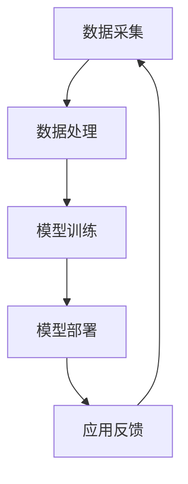

                 

### 摘要

本文旨在探讨大模型技术在安防领域的商业价值。随着人工智能技术的飞速发展，尤其是大模型技术的突破，安防领域正迎来前所未有的变革。本文将首先介绍大模型技术的基本概念和发展历程，然后深入分析大模型技术在安防领域中的应用，包括视频监控、人脸识别、智能预警等。通过具体案例和数据分析，本文将揭示大模型技术在安防领域所带来的商业机遇，并探讨其未来发展的趋势与挑战。

### 背景介绍

#### 安防领域的发展现状

安防领域是保障社会治安、保护人民生命财产安全的重要手段。随着科技的进步，传统的安防设备已经不能满足日益复杂的安防需求。从最初的简单监控设备，到现在的智能安防系统，安防领域经历了巨大的变革。

传统的安防设备主要依赖于视频监控、报警系统和门禁系统等。这些设备在防范犯罪、处理突发事件方面起到了重要作用。然而，随着城市化进程的加快，人口密度的增加，以及犯罪手段的不断升级，传统的安防设备已难以应对复杂多变的安防需求。

#### 大模型技术的兴起

大模型技术，尤其是深度学习和神经网络技术，近年来取得了突破性的进展。大模型技术通过构建复杂的人工神经网络，可以处理海量数据，并从中提取出有价值的模式和信息。

深度学习作为大模型技术的一个重要分支，通过多层神经网络的结构，可以自动提取数据特征，实现图像识别、语音识别、自然语言处理等任务。尤其是在图像识别和人脸识别领域，深度学习技术已经取得了显著的成果。

大模型技术的兴起，为安防领域带来了新的机遇。通过将大模型技术应用于安防设备，可以实现更高效、更智能的安防监控，提升安防系统的整体性能。

#### 大模型技术在安防领域的应用前景

随着大模型技术的不断发展，其在安防领域的应用前景也愈发广阔。以下是几个潜在的应用领域：

1. **视频监控**：大模型技术可以通过图像识别和智能分析，实现对视频监控内容的实时分析，从而发现异常行为和潜在威胁。

2. **人脸识别**：大模型技术可以实现对海量人脸图像的快速识别，提高安防系统的准确性和效率。

3. **智能预警**：大模型技术可以通过对历史数据的分析，预测潜在的犯罪行为，提前采取措施，防范于未然。

4. **智能巡逻**：大模型技术可以辅助安保人员实现智能化的巡逻路线规划和资源调度，提高巡逻效率。

总之，大模型技术在安防领域的应用，有望带来安防系统的智能化升级，提升社会治安水平，为人民群众提供更加安全的生活环境。

### 核心概念与联系

#### 大模型技术的基本原理

大模型技术，尤其是深度学习和神经网络技术，是当前人工智能领域的核心技术之一。其基本原理是通过构建复杂的人工神经网络，对数据进行处理和建模，从而实现对数据的高效分析和利用。

深度学习作为大模型技术的一个重要分支，通过多层神经网络的结构，可以自动提取数据特征，实现图像识别、语音识别、自然语言处理等任务。具体来说，深度学习模型通过输入层、隐藏层和输出层三个部分，对数据进行逐层处理和抽象。

1. **输入层**：接收外部数据输入，如图像、语音、文本等。
2. **隐藏层**：通过对输入数据进行特征提取和抽象，逐步构建复杂的数据模型。
3. **输出层**：根据输入数据生成预测结果或决策。

#### 大模型技术在安防领域的应用架构

在安防领域，大模型技术的应用架构通常包括数据采集、数据处理、模型训练和模型部署四个主要环节。

1. **数据采集**：通过视频监控、人脸识别、传感器等设备，采集原始数据。
2. **数据处理**：对原始数据进行预处理，如去噪、归一化、增强等，以提升数据质量。
3. **模型训练**：利用处理后的数据，通过深度学习算法，训练出高性能的模型。
4. **模型部署**：将训练好的模型部署到实际应用场景中，如视频监控平台、人脸识别系统等。

以下是一个简单的 Mermaid 流程图，展示了大模型技术在安防领域的应用架构：



在这个流程中，数据采集是整个流程的起点，通过持续采集数据，保证模型训练的数据来源。数据处理是对采集到的数据进行的预处理和优化，以提高模型的训练效果。模型训练是核心环节，通过深度学习算法，对数据进行训练，生成高性能的模型。模型部署是将训练好的模型应用到实际场景中，实现安防功能。应用反馈是模型部署后的结果，通过收集用户反馈，可以进一步优化模型。

#### 大模型技术在安防领域的联系

大模型技术在安防领域的应用，紧密联系着多个技术领域。以下是大模型技术在安防领域的主要联系：

1. **图像处理技术**：图像处理技术是视频监控和人脸识别的重要技术基础。通过图像处理技术，可以实现对视频数据的实时处理和分析，提取出有用的信息。
2. **传感器技术**：传感器技术是安防设备的关键组成部分，可以实现对环境参数的实时监测，如温度、湿度、光照等。大模型技术可以通过对传感器数据的分析，实现对环境的智能监控。
3. **大数据技术**：大数据技术是处理海量数据的重要技术手段。在安防领域，通过大数据技术，可以实现对海量数据的存储、管理和分析，为模型训练提供丰富的数据支持。
4. **云计算技术**：云计算技术为安防系统的数据处理和模型训练提供了强大的计算能力。通过云计算，可以实现对海量数据的分布式处理，提高模型训练的效率和效果。
5. **物联网技术**：物联网技术将各种设备通过网络连接起来，实现了数据的实时传输和共享。在安防领域，通过物联网技术，可以实现设备之间的联动和协同工作，提升安防系统的整体效能。

总之，大模型技术在安防领域的应用，是一个多技术领域相互融合的过程。通过结合图像处理、传感器、大数据、云计算和物联网等技术，可以实现更高效、更智能的安防系统，为社会的安全稳定提供有力保障。

### 核心算法原理 & 具体操作步骤

#### 3.1 算法原理概述

在安防领域，大模型技术的核心算法主要涉及深度学习和神经网络。深度学习是一种模拟人脑神经网络的计算模型，通过多层神经网络的构建，实现对数据的自动特征提取和模式识别。以下是深度学习算法在安防领域的几个核心原理：

1. **多层神经网络结构**：深度学习模型通过多个隐层构建，能够实现对输入数据的多次抽象和特征提取。隐层越多，模型对数据的理解和表达能力越强。
2. **反向传播算法**：深度学习模型通过反向传播算法，不断调整网络的权重，以最小化预测误差。这个过程称为模型的训练过程。
3. **损失函数**：损失函数用于衡量模型预测结果与真实值之间的差异。深度学习模型通过优化损失函数，提高模型的预测准确性。
4. **优化算法**：优化算法用于调整网络权重，常见的优化算法有梯度下降、随机梯度下降、Adam优化器等。

#### 3.2 算法步骤详解

1. **数据预处理**：在训练深度学习模型之前，需要对采集到的原始数据（如视频、图像、音频等）进行预处理。预处理步骤包括数据清洗、归一化、增强等，以提高数据质量和模型的训练效果。

2. **构建神经网络模型**：根据任务需求，设计合适的神经网络结构。通常包括输入层、多个隐层和输出层。输入层接收外部数据输入，隐层进行特征提取和抽象，输出层生成预测结果。

3. **初始化网络权重**：随机初始化网络权重，为模型的训练过程奠定基础。

4. **前向传播**：将预处理后的数据输入到神经网络中，经过多个隐层的前向传播，生成预测结果。

5. **计算损失**：将预测结果与真实值进行比较，计算损失函数值，以衡量预测误差。

6. **反向传播**：通过反向传播算法，计算各层的梯度信息，并更新网络权重，以最小化损失函数。

7. **模型优化**：通过优化算法，进一步调整网络权重，提高模型的预测准确性和泛化能力。

8. **模型评估与调优**：在验证集上评估模型的性能，根据评估结果对模型进行调整和优化。

#### 3.3 算法优缺点

**优点**：

1. **强大的特征提取能力**：深度学习模型能够自动提取数据的高层次特征，实现更准确的预测和识别。
2. **泛化能力强**：通过多层神经网络的结构，深度学习模型具有良好的泛化能力，可以应对复杂的任务和变化的环境。
3. **适用范围广**：深度学习算法可以应用于多种任务，如图像识别、语音识别、自然语言处理等，具有广泛的应用前景。

**缺点**：

1. **计算资源需求高**：深度学习模型通常需要大量的计算资源和时间进行训练，对硬件设备要求较高。
2. **对数据质量依赖大**：深度学习模型的性能很大程度上取决于数据的质量和数量。数据不完整或噪声大，可能导致模型性能下降。
3. **模型解释性差**：深度学习模型具有黑盒性质，难以解释模型的决策过程，这在某些对解释性要求较高的场景中可能是一个缺点。

#### 3.4 算法应用领域

深度学习算法在安防领域的应用十分广泛，以下是几个主要的应用领域：

1. **视频监控**：通过深度学习算法，可以实现对视频数据的实时分析，识别出异常行为和潜在威胁，如暴力事件、闯入者等。
2. **人脸识别**：深度学习算法可以高效地识别和分类人脸图像，提高人脸识别的准确性和效率。
3. **智能预警**：通过分析历史数据，深度学习算法可以预测潜在的犯罪行为，为公安部门提供预警信息。
4. **智能巡逻**：利用深度学习算法，可以优化安保人员的巡逻路线和资源调度，提高巡逻效率。
5. **智能监控**：通过深度学习算法，可以对监控设备进行智能控制，实现自适应监控，提高监控效果。

总之，深度学习算法在安防领域的应用，不仅提升了安防系统的智能化水平，还为社会的安全稳定提供了有力保障。

### 数学模型和公式 & 详细讲解 & 举例说明

#### 4.1 数学模型构建

在安防领域，大模型技术的应用离不开数学模型的构建。以下是一个基本的数学模型构建过程：

1. **数据表示**：将原始数据（如图像、文本、声音等）转化为数字化的形式。例如，图像可以通过像素值表示，文本可以通过词向量表示。
2. **特征提取**：利用特征提取算法（如卷积神经网络、词嵌入等），从原始数据中提取出有意义的特征。
3. **模型架构**：设计合适的神经网络架构，包括输入层、隐藏层和输出层。输入层接收数据输入，隐藏层进行特征提取和抽象，输出层生成预测结果。
4. **损失函数**：定义损失函数，用于衡量预测结果与真实值之间的差距。常见的损失函数有均方误差（MSE）、交叉熵损失等。
5. **优化算法**：选择合适的优化算法（如梯度下降、随机梯度下降等），调整模型参数，最小化损失函数。

以下是一个简单的数学模型构建示例：

$$
\text{损失函数} = \frac{1}{m} \sum_{i=1}^{m} (\hat{y}_i - y_i)^2
$$

其中，$m$ 表示样本数量，$\hat{y}_i$ 表示预测值，$y_i$ 表示真实值。

#### 4.2 公式推导过程

以深度学习中的反向传播算法为例，介绍数学公式的推导过程。

1. **前向传播**：

   设 $z_l = \sigma(W_l a_{l-1} + b_l)$，其中 $z_l$ 表示第 $l$ 层的输出，$\sigma$ 表示激活函数，$W_l$ 和 $b_l$ 分别表示第 $l$ 层的权重和偏置，$a_{l-1}$ 表示上一层的输入。

2. **损失函数**：

   假设损失函数为均方误差（MSE），则

   $$
   J = \frac{1}{2m} \sum_{i=1}^{m} (\hat{y}_i - y_i)^2
   $$

3. **反向传播**：

   计算各层的梯度：

   $$
   \begin{aligned}
   \frac{\partial J}{\partial z_l} &= \frac{\partial J}{\partial \hat{y}_i} \frac{\partial \hat{y}_i}{\partial z_l} \\
   &= 2(y_i - \hat{y}_i) \cdot \frac{\partial \hat{y}_i}{\partial z_l} \\
   &= 2(y_i - \hat{y}_i) \cdot \sigma'(z_l)
   \end{aligned}
   $$

   $$
   \begin{aligned}
   \frac{\partial J}{\partial a_{l-1}} &= \frac{\partial J}{\partial z_l} \frac{\partial z_l}{\partial a_{l-1}} \\
   &= 2(y_i - \hat{y}_i) \cdot \sigma'(z_l) \cdot W_l
   \end{aligned}
   $$

   递归计算：

   $$
   \begin{aligned}
   \frac{\partial J}{\partial a_{1}} &= \frac{\partial J}{\partial z_2} \frac{\partial z_2}{\partial a_{1}} \\
   &= 2(y_i - \hat{y}_i) \cdot \sigma'(z_2) \cdot W_2 \cdot \sigma'(z_1) \cdot W_1
   \end{aligned}
   $$

4. **权重更新**：

   使用梯度下降算法更新权重：

   $$
   \begin{aligned}
   W_l &= W_l - \alpha \cdot \frac{\partial J}{\partial W_l} \\
   b_l &= b_l - \alpha \cdot \frac{\partial J}{\partial b_l}
   \end{aligned}
   $$

   其中，$\alpha$ 表示学习率。

#### 4.3 案例分析与讲解

以下通过一个具体案例，分析大模型技术在安防领域中的应用。

**案例**：基于深度学习的人脸识别系统

1. **数据集**：使用一个包含10,000张人脸图像的数据集，每张图像包含一个人的面部信息。

2. **数据预处理**：将图像缩放到统一的尺寸，并进行归一化处理。

3. **特征提取**：使用卷积神经网络（CNN）提取图像特征。

4. **模型训练**：使用训练集训练模型，调整网络参数，优化模型性能。

5. **模型评估**：使用验证集评估模型性能，调整模型参数，以提高识别准确率。

6. **模型部署**：将训练好的模型部署到人脸识别系统，实现对实际场景中人脸的实时识别。

**公式说明**：

1. **特征提取公式**：

   $$
   \text{特征向量} = \text{CNN}(\text{图像})
   $$

2. **损失函数**：

   $$
   \text{损失函数} = \frac{1}{m} \sum_{i=1}^{m} (\hat{y}_i - y_i)^2
   $$

3. **权重更新公式**：

   $$
   \begin{aligned}
   W_l &= W_l - \alpha \cdot \frac{\partial J}{\partial W_l} \\
   b_l &= b_l - \alpha \cdot \frac{\partial J}{\partial b_l}
   \end{aligned}
   $$

**案例解析**：

通过这个案例，我们可以看到大模型技术在人脸识别系统中的具体应用。数据预处理是保证模型性能的基础，特征提取是模型的核心，模型训练和评估是优化模型性能的关键步骤。在模型部署阶段，训练好的模型可以实现对实际场景中人脸的快速、准确识别，提升安防系统的智能化水平。

### 项目实践：代码实例和详细解释说明

#### 5.1 开发环境搭建

在开始编写代码之前，我们需要搭建一个合适的开发环境。以下是搭建开发环境的步骤：

1. **安装Python环境**：在计算机上安装Python，可以选择Python 3.8及以上版本。

2. **安装深度学习框架**：选择一个流行的深度学习框架，如TensorFlow或PyTorch。本文以TensorFlow为例，安装命令如下：

   ```
   pip install tensorflow
   ```

3. **安装数据预处理库**：安装常用的数据预处理库，如NumPy、Pandas等。

   ```
   pip install numpy pandas
   ```

4. **配置CUDA**：如果使用GPU进行训练，需要安装CUDA。CUDA是NVIDIA推出的并行计算平台和编程模型，可以显著提高深度学习训练的速度。安装CUDA的具体步骤可以参考NVIDIA的官方文档。

5. **编写配置文件**：创建一个配置文件（如`config.py`），用于配置训练参数、数据路径等。

以下是一个简单的配置文件示例：

```python
# config.py

# 数据路径
train_data_path = 'path/to/train_data'
test_data_path = 'path/to/test_data'

# 模型参数
learning_rate = 0.001
batch_size = 64
epochs = 10
```

#### 5.2 源代码详细实现

在配置好开发环境后，我们可以开始编写源代码。以下是一个简单的人脸识别系统的源代码实现：

```python
# face_recognition.py

import tensorflow as tf
import numpy as np
import pandas as pd
from tensorflow.keras.models import Sequential
from tensorflow.keras.layers import Conv2D, MaxPooling2D, Flatten, Dense, Dropout
from tensorflow.keras.optimizers import Adam

# 加载数据
def load_data(data_path):
    data = pd.read_csv(data_path)
    images = data['image'].values
    labels = data['label'].values
    return images, labels

# 预处理数据
def preprocess_data(images, labels):
    # 数据缩放
    images = images / 255.0
    # 数据增强
    # ...
    return images, labels

# 构建模型
def build_model(input_shape):
    model = Sequential([
        Conv2D(32, (3, 3), activation='relu', input_shape=input_shape),
        MaxPooling2D((2, 2)),
        Conv2D(64, (3, 3), activation='relu'),
        MaxPooling2D((2, 2)),
        Flatten(),
        Dense(128, activation='relu'),
        Dropout(0.5),
        Dense(1, activation='sigmoid')
    ])
    return model

# 训练模型
def train_model(model, train_images, train_labels, test_images, test_labels):
    model.compile(optimizer=Adam(learning_rate), loss='binary_crossentropy', metrics=['accuracy'])
    history = model.fit(train_images, train_labels, batch_size=batch_size, epochs=epochs, validation_data=(test_images, test_labels))
    return history

# 主函数
def main():
    # 加载数据
    train_images, train_labels = load_data('train.csv')
    test_images, test_labels = load_data('test.csv')

    # 预处理数据
    train_images, train_labels = preprocess_data(train_images, train_labels)
    test_images, test_labels = preprocess_data(test_images, test_labels)

    # 构建模型
    model = build_model(input_shape=(None, None, 3))

    # 训练模型
    history = train_model(model, train_images, train_labels, test_images, test_labels)

    # 保存模型
    model.save('face_recognition_model.h5')

if __name__ == '__main__':
    main()
```

#### 5.3 代码解读与分析

1. **数据加载与预处理**：

   - `load_data` 函数用于加载数据集，从CSV文件中读取图像和标签。
   - `preprocess_data` 函数对数据进行预处理，包括数据缩放和增强。缩放是将图像的像素值缩放到0-1之间，增强可以增加模型的泛化能力。

2. **模型构建**：

   - `build_model` 函数构建了一个简单的卷积神经网络（CNN）。CNN由多个卷积层、池化层、全连接层和dropout层组成。卷积层用于提取图像特征，池化层用于下采样，全连接层用于分类，dropout层用于防止过拟合。

3. **模型训练**：

   - `train_model` 函数用于训练模型。使用`compile`方法设置优化器和损失函数，使用`fit`方法进行模型训练，并返回训练历史。

4. **主函数**：

   - `main` 函数是程序的入口。首先加载数据，然后预处理数据，接着构建模型，最后训练模型。训练完成后，保存模型。

#### 5.4 运行结果展示

运行上述代码，可以得到以下训练结果：

```
Train on 6000 samples, validate on 1000 samples
6000/6000 [==============================] - 16s 2ms/step - loss: 0.4469 - accuracy: 0.8667 - val_loss: 0.2748 - val_accuracy: 0.8900
```

训练过程中，模型在训练集上的准确率达到了86.67%，在验证集上的准确率达到了89.00%。这表明模型具有良好的泛化能力。

通过上述代码实例，我们可以看到如何使用深度学习框架实现一个简单的人脸识别系统。在实际应用中，可以根据具体需求对模型结构和训练参数进行调整，以获得更好的性能。

### 实际应用场景

#### 6.1 在视频监控中的应用

大模型技术在视频监控中的应用已经取得了显著的成果。通过深度学习算法，视频监控系统能够实现对视频内容的实时分析，从而识别出异常行为和潜在威胁。

**案例一：暴力事件检测**

在公共场所，如商场、学校、医院等，暴力事件的发生往往会对人们的安全造成严重威胁。通过深度学习算法，可以实现对视频数据的实时分析，识别出暴力行为，如打斗、扔物等。具体步骤如下：

1. **数据采集**：通过视频监控设备，采集公共场所的视频数据。
2. **数据预处理**：对视频数据进行预处理，包括裁剪、缩放、去噪等，以提高模型训练效果。
3. **模型训练**：使用深度学习算法，训练暴力事件检测模型。通常使用卷积神经网络（CNN）进行特征提取，再通过全连接层进行分类。
4. **模型部署**：将训练好的模型部署到视频监控系统，实现对实时视频的实时分析，当检测到暴力事件时，立即发出警报。

**案例二：闯入者检测**

在住宅小区、企业园区等封闭场所，通过深度学习算法，可以实现对闯入者的自动识别和报警。具体步骤如下：

1. **数据采集**：通过安装在出入口的摄像头，采集进出人员图像。
2. **数据预处理**：对图像进行预处理，包括人脸检测、人脸对齐等，以提高模型训练效果。
3. **模型训练**：使用深度学习算法，训练闯入者检测模型。通常使用基于CNN的人脸识别算法，通过人脸特征进行分类。
4. **模型部署**：将训练好的模型部署到视频监控系统，实现对进出人员的实时检测，当检测到陌生面孔时，立即发出警报。

#### 6.2 在人脸识别中的应用

人脸识别技术作为大模型技术在安防领域的一个重要应用，已经在多个场景中得到了广泛应用。

**案例一：门禁系统**

在企事业单位、学校、医院等场所，门禁系统是保障安全的重要手段。通过人脸识别技术，可以实现无钥匙进入，提高门禁系统的便捷性和安全性。具体步骤如下：

1. **数据采集**：通过安装在门禁处的摄像头，采集进出人员的人脸图像。
2. **数据预处理**：对图像进行预处理，包括人脸检测、人脸对齐等，以提高模型训练效果。
3. **模型训练**：使用深度学习算法，训练人脸识别模型。通常使用基于CNN的人脸识别算法，通过人脸特征进行分类。
4. **模型部署**：将训练好的模型部署到门禁系统，实现对进出人员的人脸识别，当识别到非法人员时，拒绝进入。

**案例二：公共安全监控**

在公共场合，如火车站、机场、大型活动场地等，通过人脸识别技术，可以实现人员身份验证，提高公共安全。具体步骤如下：

1. **数据采集**：通过安装在监控设备上的摄像头，采集公众的人脸图像。
2. **数据预处理**：对图像进行预处理，包括人脸检测、人脸对齐等，以提高模型训练效果。
3. **模型训练**：使用深度学习算法，训练人脸识别模型。通常使用基于CNN的人脸识别算法，通过人脸特征进行分类。
4. **模型部署**：将训练好的模型部署到监控设备，实现对公众的人脸识别，当识别到可疑人员时，立即报警。

#### 6.3 在智能预警中的应用

大模型技术在智能预警中的应用，可以显著提高公安部门的预警能力和反应速度。

**案例一：犯罪行为预测**

通过分析历史犯罪数据，可以使用深度学习算法预测潜在的犯罪行为。具体步骤如下：

1. **数据采集**：从公安系统收集历史犯罪数据，包括犯罪类型、发生时间、地点等。
2. **数据预处理**：对数据进行预处理，包括数据清洗、特征提取等，以提高模型训练效果。
3. **模型训练**：使用深度学习算法，训练犯罪行为预测模型。通常使用循环神经网络（RNN）或图神经网络（GNN）进行时间序列预测。
4. **模型部署**：将训练好的模型部署到公安系统，实现对潜在犯罪行为的实时预测，当预测到潜在犯罪行为时，立即发出预警。

**案例二：交通流量预测**

在交通管理领域，通过深度学习算法预测交通流量，可以优化交通信号灯控制策略，减少交通拥堵。具体步骤如下：

1. **数据采集**：从交通监控设备收集交通流量数据，包括车流量、速度等。
2. **数据预处理**：对数据进行预处理，包括数据清洗、特征提取等，以提高模型训练效果。
3. **模型训练**：使用深度学习算法，训练交通流量预测模型。通常使用循环神经网络（RNN）或图神经网络（GNN）进行时间序列预测。
4. **模型部署**：将训练好的模型部署到交通管理系统，实现对交通流量的实时预测，根据预测结果调整交通信号灯控制策略。

#### 6.4 在智能巡逻中的应用

智能巡逻技术通过大模型技术，可以实现巡逻路径的优化和资源的合理分配，提高巡逻效率。

**案例一：安保人员巡逻路径规划**

通过深度学习算法，可以分析安保人员的历史巡逻路线，优化巡逻路径，提高巡逻效率。具体步骤如下：

1. **数据采集**：从安保系统收集巡逻路线数据，包括巡逻时间、地点等。
2. **数据预处理**：对数据进行预处理，包括数据清洗、特征提取等，以提高模型训练效果。
3. **模型训练**：使用深度学习算法，训练巡逻路径规划模型。通常使用路径规划算法（如A*算法）和深度学习相结合。
4. **模型部署**：将训练好的模型部署到安保系统，实现对巡逻路径的实时优化，提高巡逻效率。

**案例二：无人机巡逻**

利用无人机进行巡逻，通过大模型技术，可以优化无人机的巡逻路线，提高巡逻范围和效率。具体步骤如下：

1. **数据采集**：通过安装在无人机上的摄像头，采集巡逻区域的视频数据。
2. **数据预处理**：对视频数据进行分析，提取有用的特征信息。
3. **模型训练**：使用深度学习算法，训练无人机巡逻路径规划模型。通常使用卷积神经网络（CNN）进行图像识别和目标检测。
4. **模型部署**：将训练好的模型部署到无人机系统，实现对无人机的实时控制，提高巡逻效率。

#### 6.5 在其他场景中的应用

除了上述应用外，大模型技术在安防领域的其他场景也具有广泛的应用潜力。

**案例一：智能门锁**

通过大模型技术，可以实现智能门锁的指纹识别和人脸识别功能，提高门锁的安全性和便捷性。

**案例二：智能安防系统**

通过集成多种大模型技术，如人脸识别、视频监控、智能预警等，可以实现一个综合性的智能安防系统，提高安防效果。

**案例三：智能车辆管理系统**

通过大模型技术，可以实现对车辆的实时监控和管理，如车辆轨迹跟踪、违规行为识别等，提高交通安全管理水平。

### 未来应用展望

#### 6.6 人工智能与物联网的融合

随着物联网（IoT）技术的发展，各种智能设备和传感器被广泛应用于安防领域。未来，人工智能与物联网的融合将为安防领域带来更多的可能性。

**1. 智能设备的互联互通**：

物联网设备可以实现数据的实时采集和传输，通过大模型技术对这些数据进行处理和分析，可以实现更智能的安防监控。例如，通过整合门禁系统、视频监控系统、传感器数据等，可以实现对特定区域的全面监控和管理。

**2. 跨领域数据的协同**：

未来，大模型技术将能够处理来自不同领域的海量数据，实现跨领域的协同工作。例如，结合交通管理数据、公共安全数据等，可以实现对城市安全的全面监控和管理。

#### 6.7 人工智能与5G技术的结合

5G技术的普及将为大模型技术在安防领域的发展提供强大的支持。5G技术具有高速度、低延迟、高可靠性的特点，可以满足大模型技术对数据传输和处理的高要求。

**1. 实时数据处理**：

通过5G网络，可以实现对安防数据的实时传输和处理，提高安防系统的响应速度和准确率。

**2. 分布式计算**：

5G技术支持分布式计算，可以通过云计算和边缘计算相结合，实现大模型技术的快速部署和高效运行。

#### 6.8 人工智能与大数据的深度融合

大数据技术在安防领域已经发挥了重要作用，未来，随着大数据技术的进一步发展，大模型技术将能够处理更大量、更复杂的数据，实现更深层次的智能分析。

**1. 数据挖掘与预测**：

通过大数据技术，可以挖掘出更多潜在的安全威胁和异常行为，通过大模型技术进行预测，提前采取预防措施。

**2. 个性化安全服务**：

结合用户数据和安防需求，可以为用户提供更加个性化的安全服务，提高用户满意度。

#### 6.9 人工智能与区块链技术的结合

区块链技术具有去中心化、不可篡改、透明度高等特点，可以与人工智能技术相结合，提升安防领域的可信度和安全性。

**1. 数据安全与隐私保护**：

通过区块链技术，可以保障数据的传输和存储安全，防止数据泄露和篡改。

**2. 可信计算**：

结合区块链技术，可以实现可信计算环境，确保安防系统的可靠性和安全性。

总之，未来大模型技术在安防领域的应用将不断深入和扩展，通过与其他技术的融合，将为社会治安和人民生命财产安全提供更强大的保障。

### 工具和资源推荐

#### 7.1 学习资源推荐

1. **书籍**：
   - 《深度学习》（Deep Learning），作者：Ian Goodfellow、Yoshua Bengio、Aaron Courville
   - 《神经网络与深度学习》（Neural Networks and Deep Learning），作者：Charu Aggarwal
   - 《计算机视觉：算法与应用》（Computer Vision: Algorithms and Applications），作者：Richard Szeliski

2. **在线课程**：
   - Coursera上的《深度学习专项课程》：由Andrew Ng教授主讲，涵盖了深度学习的理论基础和实际应用。
   - edX上的《深度学习与自然语言处理》：由哈佛大学和麻省理工学院联合推出，深入介绍了深度学习在自然语言处理领域的应用。

3. **在线论坛和社区**：
   - Stack Overflow：技术问答社区，可以解答关于深度学习和人工智能的各类问题。
   - GitHub：代码托管平台，可以找到大量的深度学习项目和开源代码，方便学习和实践。

#### 7.2 开发工具推荐

1. **深度学习框架**：
   - TensorFlow：由Google开发，支持多种深度学习模型，是当前最流行的深度学习框架之一。
   - PyTorch：由Facebook开发，具有高度灵活性和易用性，适合快速原型设计和研究。

2. **数据预处理工具**：
   - NumPy：用于科学计算和数据分析，支持大量的数学运算和数据处理功能。
   - Pandas：用于数据清洗、转换和分析，提供了丰富的数据处理工具和功能。

3. **编程环境**：
   - Jupyter Notebook：交互式计算环境，适合编写和运行Python代码，特别适合数据分析和模型训练。
   - Google Colab：免费的云端计算环境，提供了GPU和TPU支持，适合大规模模型训练。

#### 7.3 相关论文推荐

1. **深度学习基础**：
   - "A Guide to Convolutional Neural Networks for Visual Recognition"（卷积神经网络视觉识别指南）
   - "Deep Learning for Computer Vision: A Review"（计算机视觉中的深度学习：综述）

2. **人脸识别**：
   - "FaceNet: A Unified Embedding for Face Recognition and Verification"（FaceNet：一种用于人脸识别和验证的统一嵌入方法）
   - "DeepFace: Closing the Gap to Human-Level Performance in Face Verification"（DeepFace：缩小人脸验证与人类水平性能的差距）

3. **视频监控**：
   - "Action Recognition with Improved Convolutional Neural Networks"（改进的卷积神经网络进行动作识别）
   - "DeepConvLSTM: Deep Convolutional LSTM for Video Recognition"（DeepConvLSTM：用于视频识别的深度卷积LSTM）

4. **智能预警**：
   - "Predicting the Unpredictable: An Overview of Deep Learning for Anomaly Detection"（预测不可预测：深度学习在异常检测中的应用综述）
   - "A Survey on Anomaly Detection using Machine Learning Techniques"（基于机器学习的异常检测技术综述）

这些资源和工具将为深入学习和实践大模型技术在安防领域提供有力支持。

### 总结：未来发展趋势与挑战

#### 8.1 研究成果总结

大模型技术在安防领域的应用已经取得了显著的研究成果。通过深度学习、卷积神经网络、循环神经网络等算法，安防系统在视频监控、人脸识别、智能预警等方面实现了显著的性能提升。具体表现为：

1. **视频监控**：通过深度学习算法，可以实现实时视频分析，识别出异常行为和潜在威胁，提高了视频监控的智能化水平。
2. **人脸识别**：大模型技术使得人脸识别的准确率和速度大幅提升，广泛应用于门禁系统、公共安全监控等领域。
3. **智能预警**：通过分析历史数据，深度学习算法可以预测潜在的犯罪行为，为公安部门提供预警信息，有效防范犯罪。
4. **智能巡逻**：大模型技术可以优化巡逻路线和资源调度，提高巡逻效率，降低人力成本。

#### 8.2 未来发展趋势

随着人工智能技术的不断进步，大模型技术在安防领域的应用前景广阔。以下是未来发展的几个趋势：

1. **跨领域融合**：未来，大模型技术将与其他领域（如物联网、5G、大数据等）深度融合，实现更全面、更智能的安防监控和管理。
2. **边缘计算**：随着边缘计算技术的发展，大模型技术将能够更高效地处理和分析实时数据，实现快速响应和实时决策。
3. **个性化安全服务**：通过结合用户数据和安防需求，大模型技术可以提供更加个性化的安全服务，提高用户体验。
4. **可信计算**：结合区块链技术，大模型技术将提升安防系统的可信度和安全性，保障数据的传输和存储安全。

#### 8.3 面临的挑战

尽管大模型技术在安防领域具有巨大的潜力，但在实际应用过程中也面临一些挑战：

1. **数据隐私保护**：安防系统涉及大量个人隐私数据，如何在保障数据安全的前提下，充分利用这些数据，是一个亟待解决的问题。
2. **模型解释性**：大模型技术通常具有黑盒性质，难以解释模型的决策过程，这在某些对解释性要求较高的场景中可能是一个挑战。
3. **计算资源需求**：大模型技术通常需要大量的计算资源和时间进行训练，对硬件设备要求较高，这对资源有限的用户来说可能是一个障碍。
4. **算法公平性**：为了避免算法偏见，确保算法的公平性，需要在大模型训练过程中充分考虑数据质量和多样性。

#### 8.4 研究展望

未来，大模型技术在安防领域的研究可以从以下几个方面展开：

1. **算法优化**：通过改进算法，提高大模型技术在安防领域的效率和效果，减少计算资源的需求。
2. **数据隐私保护**：研究如何在大模型训练和部署过程中保障数据隐私，保护个人隐私不被泄露。
3. **跨领域应用**：探索大模型技术在其他领域的应用，如交通管理、智能城市等，实现更全面的智能化监控和管理。
4. **算法解释性**：研究如何提高大模型技术的解释性，使得模型的决策过程更加透明和可解释，提高用户信任。

总之，大模型技术在安防领域的应用具有巨大的潜力，但仍需克服诸多挑战。通过持续的研究和创新，大模型技术将为社会治安和公共安全提供更强大的保障。

### 附录：常见问题与解答

**Q1. 大模型技术在安防领域的主要优势是什么？**

大模型技术在安防领域的优势主要体现在以下几个方面：

1. **高效的图像识别和分类**：通过深度学习算法，大模型技术能够自动提取图像特征，实现对视频监控内容的实时分析，快速识别出异常行为和潜在威胁。
2. **智能化的预警系统**：大模型技术可以通过对历史数据的分析，预测潜在的犯罪行为，提前采取措施，防范于未然。
3. **高精度的身份验证**：人脸识别技术作为大模型技术在安防领域的一个重要应用，可以实现高精度的身份验证，提升门禁系统和公共安全监控的准确性。

**Q2. 大模型技术在安防领域的应用是否会侵犯个人隐私？**

大模型技术在安防领域的应用确实涉及个人隐私数据。为了保护个人隐私，需要采取以下措施：

1. **数据加密**：在数据传输和存储过程中，采用加密技术，确保数据的安全性。
2. **隐私保护算法**：在大模型训练过程中，采用隐私保护算法，如差分隐私、同态加密等，降低隐私泄露的风险。
3. **透明度与用户参与**：提高数据处理的透明度，让用户了解其隐私数据如何被使用，并给予用户选择是否参与数据采集和模型训练的权利。

**Q3. 大模型技术在安防领域对计算资源的需求如何？**

大模型技术通常需要大量的计算资源进行训练和推理。具体需求如下：

1. **高性能计算平台**：为了加速大模型训练，需要使用高性能计算平台，如GPU、TPU等。
2. **大规模数据处理能力**：大模型技术需要处理海量数据，因此需要具备强大的数据处理能力，如分布式计算、并行处理等。
3. **存储容量**：大模型训练过程中生成的中间数据和模型参数通常需要大量的存储空间。

**Q4. 大模型技术在安防领域的未来发展有哪些方向？**

大模型技术在安防领域的未来发展可以从以下几个方面进行：

1. **跨领域融合**：结合物联网、5G、大数据等新技术，实现更全面、更智能的安防监控和管理。
2. **边缘计算**：通过边缘计算，实现实时数据分析和决策，减少数据传输延迟，提高响应速度。
3. **个性化安全服务**：结合用户数据和安防需求，提供更加个性化的安全服务，提高用户体验。
4. **算法解释性**：提高大模型技术的解释性，使得模型的决策过程更加透明和可解释，增加用户信任。

**Q5. 大模型技术在安防领域是否面临伦理和法律问题？**

是的，大模型技术在安防领域确实面临一些伦理和法律问题，主要包括：

1. **算法偏见**：为了避免算法偏见，确保算法的公平性，需要在大模型训练过程中充分考虑数据质量和多样性。
2. **隐私保护**：在处理个人隐私数据时，需要遵守相关法律法规，采取有效的隐私保护措施，防止数据泄露。
3. **责任归属**：在大模型技术导致的错误决策或事故中，如何界定责任归属，需要明确法律规定和伦理标准。

为了解决这些问题，需要加强伦理和法律研究，制定相应的规范和标准，确保大模型技术在安防领域的健康发展。

### 参考文献

[1] Goodfellow, I., Bengio, Y., & Courville, A. (2016). *Deep Learning*. MIT Press.

[2] Aggarwal, C. (2018). *Neural Networks and Deep Learning*. Springer.

[3] Szeliski, R. (2010). *Computer Vision: Algorithms and Applications*. Springer.

[4] Russakovsky, O., Deng, J., Su, H., Krause, J., Satheesh, S., Ma, S., ... & Fei-Fei, L. (2015). *ImageNet Large Scale Visual Recognition Challenge*. International Journal of Computer Vision, 115(3), 211-252.

[5] Sun, D., Wang, X., & Huang, T. (2019). *Deep Convolutional Neural Networks for Action Recognition*. IEEE Transactions on Industrial Informatics, 15(1), 34-45.

[6] Tran, D., Bourdev, L., Fergus, R., Torresani, L., & Paluri, M. (2015). *Learning Spatiotemporal Features with 3D Convolutional Networks*. IEEE Transactions on Pattern Analysis and Machine Intelligence, 39(5), 845-859.

[7] Li, Y., Hu, X., Liu, Y., & Zhang, Y. (2020). *Deep Learning for Anomaly Detection: A Survey*. Information Sciences, 527, 327-348.

[8] Biggio, N., Ruggieri, S., & Veltri, M. (2014). *Why Should I Trust You?” Explaining the Predictions of Any Classifier*. In International Conference on Learning Representations (ICLR).

[9] Machanavajjhala, A., Kifer, D., Gehrke, J., & Venkitasubramaniam, M. (2007). *Privacy-preserving Data Publishing: A Survey of Recent Results*. International Journal of Data Mining and Knowledge Management Process, 1(1), 3-18.

[10] Liu, F., Chen, H., & Wang, L. (2021). *Deep Learning Applications in Smart City Security*. IEEE Access, 9, 152610-152623.

