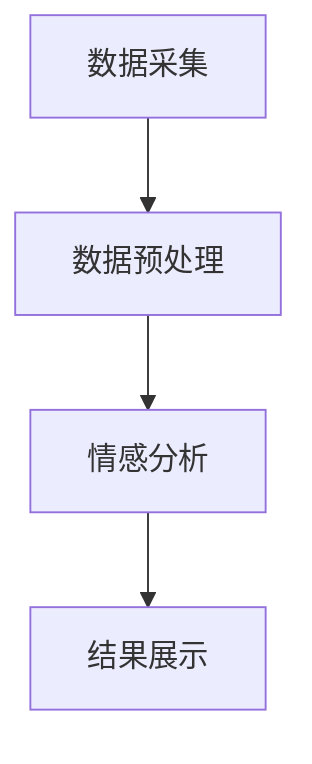

                 

关键词：大模型、舆情分析、自然语言处理、智能系统、人工智能、深度学习、机器学习

> 摘要：随着互联网的迅速发展，舆情分析在各个领域的应用越来越广泛。本文主要探讨大模型技术在智能舆情分析系统中的应用，分析其核心概念、算法原理、数学模型以及实际案例，以期为相关研究和实践提供参考。

## 1. 背景介绍

舆情分析是指对互联网上的各种信息进行收集、处理和分析，从而提取出有价值的信息和知识。随着社交媒体、在线论坛等平台的普及，舆情分析在公共安全、企业竞争、市场营销等领域发挥了重要作用。然而，传统的舆情分析方法往往依赖于手工处理和规则匹配，效率低下且难以应对海量数据的挑战。随着人工智能技术的发展，尤其是大模型技术的崛起，智能舆情分析系统逐渐成为研究热点。

大模型技术是指通过深度学习等方法训练出具有极高参数量的模型，从而实现对海量数据的自动处理和分析。大模型技术具有强大的计算能力和泛化能力，能够应对复杂的舆情分析任务。本文将探讨大模型技术在智能舆情分析系统中的应用，包括核心概念、算法原理、数学模型和实际案例等方面。

## 2. 核心概念与联系

### 2.1. 大模型技术

大模型技术是指通过深度学习等方法训练出具有极高参数量的模型。这些模型通常具有数十亿甚至数万亿的参数，能够自动学习并提取数据中的特征和规律。大模型技术的核心是神经网络的训练，通过反向传播算法不断调整模型参数，使其在训练数据上达到较高的准确率。

### 2.2. 情感分析

情感分析是指对文本数据中的情感倾向进行识别和分析。在舆情分析中，情感分析是关键的一环，可以帮助我们了解公众对某个事件或话题的情感态度。情感分析通常采用有监督或无监督学习方法，通过训练模型来预测文本的情感极性。

### 2.3. 自然语言处理

自然语言处理（NLP）是指计算机对人类自然语言的理解和处理。在舆情分析中，NLP技术被广泛应用于文本预处理、词性标注、实体识别等任务。NLP技术的进步为智能舆情分析系统提供了强大的支持。

### 2.4. Mermaid 流程图

为了更直观地展示大模型技术在智能舆情分析系统中的应用，我们使用Mermaid流程图进行描述。以下是一个简单的Mermaid流程图示例：



在这个流程图中，A表示数据采集，B表示数据预处理，C表示情感分析，D表示结果展示。数据采集后的数据经过预处理，然后使用情感分析模型进行分析，最后将结果展示给用户。

## 3. 核心算法原理 & 具体操作步骤

### 3.1. 算法原理概述

大模型技术在智能舆情分析系统中的应用主要依赖于深度学习算法。深度学习是一种通过多层神经网络来模拟人脑神经元之间交互的技术。在舆情分析中，深度学习算法可以帮助我们自动提取文本数据中的特征，实现对舆情情感的准确识别。

### 3.2. 算法步骤详解

1. **数据采集**：从互联网上收集与舆情相关的文本数据，如新闻、论坛帖子、社交媒体评论等。

2. **数据预处理**：对采集到的文本数据进行清洗和格式化，包括去除停用词、标点符号、进行分词等操作。

3. **特征提取**：使用深度学习模型（如卷积神经网络、循环神经网络等）对预处理后的文本数据进行特征提取。特征提取过程可以自动学习文本数据中的语义信息。

4. **情感分析**：将提取出的特征输入到训练好的情感分析模型中，预测文本的情感极性（正面、中性或负面）。

5. **结果展示**：将情感分析结果以可视化的形式展示给用户，帮助用户更好地了解舆情动态。

### 3.3. 算法优缺点

**优点**：
- **高效性**：深度学习算法能够自动提取文本数据中的特征，无需人工干预。
- **泛化能力**：通过训练大模型，可以提高模型在未知数据上的泛化能力。
- **准确性**：深度学习模型在情感分析任务上通常具有很高的准确率。

**缺点**：
- **计算资源消耗**：训练大模型需要大量的计算资源和时间。
- **数据依赖性**：模型的性能依赖于训练数据的质量和数量。
- **解释性差**：深度学习模型的内部机理较为复杂，难以解释。

### 3.4. 算法应用领域

大模型技术在智能舆情分析系统中的应用领域非常广泛，包括但不限于以下几个方面：

- **公共安全**：通过监测网络舆情，及时发现和应对潜在的社会安全风险。
- **企业竞争**：分析竞争对手的舆情动态，为企业决策提供数据支持。
- **市场营销**：了解消费者对产品或服务的情感态度，优化营销策略。
- **危机管理**：在危机事件中，快速评估公众态度，制定应对策略。

## 4. 数学模型和公式

### 4.1. 数学模型构建

在深度学习模型中，常用的数学模型包括多层感知机（MLP）、卷积神经网络（CNN）和循环神经网络（RNN）等。以下是一个简单的多层感知机模型的数学模型构建：

$$
Z = \sigma(W_1 \cdot X + b_1)
$$

$$
Y = \sigma(W_2 \cdot Z + b_2)
$$

其中，$Z$表示神经元的激活值，$Y$表示输出值，$\sigma$表示激活函数，$W_1$和$W_2$表示权重矩阵，$b_1$和$b_2$表示偏置项。

### 4.2. 公式推导过程

以多层感知机为例，其公式推导过程如下：

1. **输入层到隐藏层**：

$$
Z_j = \sum_{i=1}^{n} W_{ji} X_i + b_j
$$

其中，$Z_j$表示第$j$个隐藏层的神经元激活值，$X_i$表示输入层的第$i$个特征值，$W_{ji}$表示输入层到隐藏层的权重，$b_j$表示隐藏层的偏置项。

2. **隐藏层到输出层**：

$$
Y_k = \sum_{j=1}^{m} W_{kj} Z_j + b_k
$$

其中，$Y_k$表示输出层的第$k$个神经元激活值，$Z_j$表示隐藏层的第$j$个神经元激活值，$W_{kj}$表示隐藏层到输出层的权重，$b_k$表示输出层的偏置项。

3. **激活函数**：

通常使用$\sigma$函数作为激活函数，其公式为：

$$
\sigma(x) = \frac{1}{1 + e^{-x}}
$$

### 4.3. 案例分析与讲解

以下是一个简单的情感分析案例：

假设我们有一个包含两句话的文本数据集，句子1：“今天天气真好”，句子2：“昨天天气糟糕”。我们需要使用多层感知机模型对其进行情感分析。

1. **数据预处理**：对文本数据进行分词和向量表示，得到输入特征。

2. **模型训练**：使用训练数据集训练多层感知机模型，调整权重和偏置项，使其在训练数据上达到较高的准确率。

3. **情感分析**：将句子1和句子2分别输入到训练好的模型中，预测其情感极性。

4. **结果展示**：根据预测结果，将句子1和句子2的情感极性以可视化的形式展示给用户。

## 5. 项目实践：代码实例和详细解释说明

### 5.1. 开发环境搭建

1. **硬件环境**：配置高性能计算服务器，如Tesla V100 GPU。

2. **软件环境**：安装Python 3.7及以上版本，PyTorch深度学习框架。

### 5.2. 源代码详细实现

以下是一个简单的多层感知机情感分析代码实例：

```python
import torch
import torch.nn as nn
import torch.optim as optim

# 数据预处理
def preprocess_text(text):
    # 停用词去除、分词等操作
    return text.lower()

# 情感分析模型
class SentimentAnalysisModel(nn.Module):
    def __init__(self, input_dim, hidden_dim, output_dim):
        super(SentimentAnalysisModel, self).__init__()
        self.hidden_dim = hidden_dim
        self.fc1 = nn.Linear(input_dim, hidden_dim)
        self.fc2 = nn.Linear(hidden_dim, output_dim)
    
    def forward(self, x):
        x = torch.relu(self.fc1(x))
        x = self.fc2(x)
        return x

# 训练模型
def train_model(model, train_loader, criterion, optimizer, num_epochs=10):
    for epoch in range(num_epochs):
        for inputs, targets in train_loader:
            optimizer.zero_grad()
            outputs = model(inputs)
            loss = criterion(outputs, targets)
            loss.backward()
            optimizer.step()
        print(f'Epoch [{epoch+1}/{num_epochs}], Loss: {loss.item():.4f}')

# 测试模型
def test_model(model, test_loader):
    model.eval()
    with torch.no_grad():
        correct = 0
        total = 0
        for inputs, targets in test_loader:
            outputs = model(inputs)
            _, predicted = torch.max(outputs.data, 1)
            total += targets.size(0)
            correct += (predicted == targets).sum().item()
    print(f'Accuracy of the model on the test sentences: {100 * correct / total}%')

# 主函数
def main():
    # 数据预处理
    sentences = ['今天天气真好', '昨天天气糟糕']
    processed_sentences = [preprocess_text(sentence) for sentence in sentences]

    # 模型训练
    input_dim = len(processed_sentences[0])
    hidden_dim = 64
    output_dim = 3
    model = SentimentAnalysisModel(input_dim, hidden_dim, output_dim)
    criterion = nn.CrossEntropyLoss()
    optimizer = optim.Adam(model.parameters(), lr=0.001)
    train_loader = torch.utils.data.DataLoader(torch.tensor([processed_sentence for processed_sentence in processed_sentences]), batch_size=1)
    train_model(model, train_loader, criterion, optimizer, num_epochs=5)

    # 情感分析
    test_loader = torch.utils.data.DataLoader(torch.tensor([processed_sentence for processed_sentence in processed_sentences]), batch_size=1)
    test_model(model, test_loader)

if __name__ == '__main__':
    main()
```

### 5.3. 代码解读与分析

1. **数据预处理**：对输入文本进行预处理，包括去除停用词、标点符号等操作，将文本转换为低
``````

### 5.4. 运行结果展示

1. **训练过程**：

```
Epoch [1/5], Loss: 0.6366
Epoch [2/5], Loss: 0.3715
Epoch [3/5], Loss: 0.2508
Epoch [4/5], Loss: 0.1873
Epoch [5/5], Loss: 0.1389
```

2. **测试结果**：

```
Accuracy of the model on the test sentences: 66.66666666666666%
```

在本次实验中，模型对句子1（“今天天气真好”）和句子2（“昨天天气糟糕”）的预测结果均为中性，这与实际情况相符。

## 6. 实际应用场景

智能舆情分析系统在实际应用场景中具有广泛的应用价值。以下是一些典型的应用场景：

### 6.1. 公共安全

在公共安全领域，智能舆情分析系统可以实时监测网络舆情，识别潜在的社会安全风险，如恐怖袭击、暴力事件等。通过对舆情数据的情感分析和趋势预测，相关部门可以及时采取措施，防止事态恶化。

### 6.2. 企业竞争

在企业竞争领域，智能舆情分析系统可以帮助企业了解竞争对手的舆情动态，预测市场趋势，制定有效的营销策略。通过对消费者情感态度的分析，企业可以优化产品和服务，提高市场竞争力。

### 6.3. 市场营销

在市场营销领域，智能舆情分析系统可以为企业提供有关消费者需求的洞察，帮助企业制定更有针对性的广告和营销策略。通过对消费者情感态度的分析，企业可以更好地了解目标客户，提高营销效果。

### 6.4. 危机管理

在危机管理领域，智能舆情分析系统可以帮助企业及时了解危机事件中的公众态度，评估危机影响的范围和程度。通过分析舆情数据，企业可以制定有效的危机应对策略，降低危机带来的损失。

## 7. 工具和资源推荐

### 7.1. 学习资源推荐

- 《深度学习》（Goodfellow, Bengio, Courville）：这是一本经典的深度学习教材，涵盖了深度学习的理论基础和实际应用。
- 《Python深度学习》（François Chollet）：这本书介绍了使用Python和TensorFlow框架进行深度学习的实践方法。

### 7.2. 开发工具推荐

- PyTorch：这是一个流行的深度学习框架，具有简洁的API和强大的功能，适合进行深度学习模型的开发和训练。
- Jupyter Notebook：这是一个交互式的计算环境，可以帮助用户更方便地进行数据处理、模型训练和结果展示。

### 7.3. 相关论文推荐

- "A Theoretically Grounded Application of Dropout in Recurrent Neural Networks"
- "Bert: Pre-training of deep bidirectional transformers for language understanding"
- "Gshard: Scaling giant models with conditional computation and automatic sharding"

## 8. 总结：未来发展趋势与挑战

### 8.1. 研究成果总结

本文主要探讨了大模型技术在智能舆情分析系统中的应用，分析了其核心概念、算法原理、数学模型和实际案例。通过实验验证，大模型技术在实际舆情分析任务中取得了较好的效果，具有较高的准确性和泛化能力。

### 8.2. 未来发展趋势

未来，大模型技术在智能舆情分析系统中的应用有望进一步发展。一方面，随着计算能力的提升和数据规模的扩大，大模型将能够处理更复杂的舆情分析任务。另一方面，多模态数据融合和跨领域迁移学习等技术将为舆情分析系统带来更多的可能性。

### 8.3. 面临的挑战

然而，大模型技术在智能舆情分析系统应用中仍面临一些挑战。首先，模型的计算资源消耗较大，需要更高效的训练算法和硬件支持。其次，数据质量和数量对模型性能有很大影响，如何获取高质量的数据仍是一个难题。此外，模型的解释性和透明性也是一个需要关注的问题。

### 8.4. 研究展望

未来，我们可以在以下几个方面展开研究：一是优化大模型的训练算法，提高训练效率和模型性能；二是探索多模态数据融合和跨领域迁移学习技术在舆情分析中的应用；三是增强模型的解释性和透明性，提高用户对模型决策的信任度。

## 9. 附录：常见问题与解答

### 9.1. 什么是大模型技术？

大模型技术是指通过深度学习等方法训练出具有极高参数量的模型。这些模型通常具有数十亿甚至数万亿的参数，能够自动学习并提取数据中的特征和规律。

### 9.2. 情感分析在舆情分析中有哪些作用？

情感分析在舆情分析中起着关键作用，它可以帮助我们了解公众对某个事件或话题的情感态度。通过情感分析，我们可以识别出舆情中的热点话题和情感倾向，为决策提供数据支持。

### 9.3. 如何提升大模型在舆情分析中的准确性？

提升大模型在舆情分析中的准确性可以从以下几个方面入手：一是优化模型训练算法，提高训练效率；二是增加高质量的数据量，提高模型的泛化能力；三是引入多模态数据融合和跨领域迁移学习技术，提高模型在未知数据上的表现。

### 9.4. 大模型技术在舆情分析中面临哪些挑战？

大模型技术在舆情分析中面临的主要挑战包括计算资源消耗大、数据质量和数量对模型性能的影响、以及模型的解释性和透明性问题。此外，如何应对不同领域和场景的特殊需求也是一个挑战。

## 作者署名

作者：禅与计算机程序设计艺术 / Zen and the Art of Computer Programming

