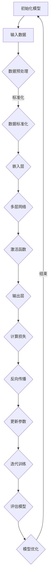

                 

关键词：大模型技术、电商平台、商品评价分析、自然语言处理、深度学习、数据挖掘、机器学习、语义理解、用户行为分析

> 摘要：随着互联网技术的飞速发展，电商平台上的商品评价数据量呈现出爆炸式增长。如何有效地分析这些海量评价数据，提取有价值的信息，已经成为电商行业亟待解决的关键问题。本文将探讨大模型技术在电商平台商品评价分析中的应用，通过介绍核心概念、算法原理、数学模型和实际项目实践，为电商企业提升用户满意度和商品质量提供技术参考。

## 1. 背景介绍

在电子商务领域，商品评价是用户对商品质量和服务体验的直接反馈，对于电商平台的发展具有重要意义。然而，随着用户数量的增多和商品种类的丰富，商品评价数据的规模和复杂性也在不断增加。传统的评价分析方法往往依赖于规则匹配、统计分析和关键词提取等技术，但这些方法在面对海量数据和高维度特征时显得力不从心。

大模型技术，尤其是深度学习模型，近年来在自然语言处理（NLP）、计算机视觉、语音识别等领域取得了显著成果。这些模型通过学习大规模数据，能够自动提取复杂的特征，并在多种任务中达到或超过了人类的水平。因此，将大模型技术应用于电商平台商品评价分析，有望提高评价数据的挖掘深度和精度，为电商企业带来更多商业价值。

本文将从以下几个方面展开讨论：

1. 核心概念与联系
2. 核心算法原理 & 具体操作步骤
3. 数学模型和公式 & 详细讲解 & 举例说明
4. 项目实践：代码实例和详细解释说明
5. 实际应用场景
6. 工具和资源推荐
7. 总结：未来发展趋势与挑战

通过本文的讨论，希望能够为电商企业在商品评价分析领域提供有价值的参考，并推动大模型技术在电商行业的广泛应用。

## 2. 核心概念与联系

### 大模型技术简介

大模型技术（Large Model Technology）是指通过学习海量数据，构建具有高度参数和复杂结构的模型。在自然语言处理领域，大模型技术通常指的是深度学习模型，如神经网络、递归神经网络（RNN）、卷积神经网络（CNN）、Transformer等。这些模型通过多层非线性变换，能够自动提取数据中的隐含特征，从而实现对复杂任务的建模。

深度学习模型之所以能够在各种任务中取得突破性成果，主要归功于以下几个特点：

1. **参数规模**：大模型拥有数十亿甚至上百亿个参数，这使得它们能够捕捉数据中的细微规律。
2. **层次结构**：大模型通常包含多层神经网络，每一层都能够对数据进行特征提取和变换，形成多层次的抽象表示。
3. **端到端学习**：大模型能够直接从原始数据中学习到特征表示，无需人工设计特征工程，极大地提高了模型的效率和效果。
4. **自适应能力**：大模型具有强大的泛化能力，能够适应不同类型的数据和任务。

### 大模型技术在电商平台中的应用

在电商平台中，大模型技术可以应用于多个方面，如图商品评价分析、用户行为预测、商品推荐系统等。本文重点讨论的是大模型技术在商品评价分析中的应用。

商品评价分析是电商平台的核心功能之一，它直接影响用户的购物体验和平台的运营效率。传统的评价分析方法主要依赖于关键词提取和规则匹配，这些方法在面对海量数据和复杂语义时存在明显局限性。而大模型技术，如BERT、GPT等预训练模型，通过学习海量的互联网文本数据，能够自动提取语义信息，为商品评价分析提供了强大的工具。

大模型技术在商品评价分析中的应用主要包括以下几个方面：

1. **情感分析**：通过分析用户评价文本，判断用户对商品的正面或负面情感。
2. **主题挖掘**：从用户评价中提取商品的主要优点和缺点，帮助商家了解用户关注的核心问题。
3. **上下文理解**：理解评价文本中的上下文信息，如商品的具体功能、使用场景等，为用户提供更加精准的推荐。
4. **用户行为预测**：基于用户的历史评价和行为数据，预测用户的下一步操作，如购买、评论等。

### 大模型技术与传统方法的比较

与传统方法相比，大模型技术具有以下优势：

1. **自动化特征提取**：传统方法通常需要人工设计特征工程，而大模型技术能够自动提取数据中的隐含特征，减少了人工干预的复杂性。
2. **高精度预测**：大模型通过学习海量数据，能够捕捉数据中的细微规律，从而提高预测的准确性。
3. **多任务处理**：大模型能够同时处理多个相关任务，如情感分析、主题挖掘和用户行为预测，提高了系统的整体性能。
4. **适应性强**：大模型具有强大的泛化能力，能够适应不同类型的数据和任务，提高了应用的广泛性。

然而，大模型技术也存在一定的局限性：

1. **计算资源需求高**：大模型通常需要大量的计算资源进行训练和推理，对硬件设施要求较高。
2. **数据隐私问题**：大模型在训练过程中需要大量数据，可能涉及用户隐私信息，需要严格保护用户数据安全。
3. **可解释性较差**：大模型内部的结构复杂，难以直观解释模型的工作原理，这在某些需要解释性要求较高的场景中可能成为问题。

总之，大模型技术在电商平台商品评价分析中具有巨大的潜力，但同时也需要克服一系列挑战。在接下来的章节中，我们将深入探讨大模型技术的算法原理、数学模型和实际应用，进一步了解其在电商领域的应用前景。

### 2.1 大模型技术的核心概念与架构

#### 2.1.1 深度学习模型的基础概念

深度学习模型是构建大模型技术的基础，其核心概念包括神经网络、层次结构、激活函数和反向传播算法。

1. **神经网络**：神经网络（Neural Network，NN）是模拟生物神经网络的一种计算模型，由大量相互连接的神经元组成。每个神经元接收多个输入信号，通过加权求和处理后产生输出信号。神经网络通过不断调整权重来学习数据中的特征和规律。

2. **层次结构**：深度学习模型通常包含多层神经网络，每一层对前一层的信息进行处理和变换。多层结构使得模型能够捕捉数据中的复杂特征，实现从低级到高级的抽象表示。

3. **激活函数**：激活函数（Activation Function）用于对神经元的输出进行非线性变换，引入模型的表达能力和区分能力。常见的激活函数包括Sigmoid、ReLU和Tanh等。

4. **反向传播算法**：反向传播（Backpropagation）算法是一种用于训练神经网络的优化算法。通过计算输出误差，反向传播误差信号到网络的前层，更新各层的权重和偏置，从而调整模型参数。

#### 2.1.2 Transformer模型

Transformer模型是由Google在2017年提出的一种基于自注意力机制的深度学习模型，它在自然语言处理领域取得了显著成果。Transformer模型的核心概念包括自注意力（Self-Attention）和多头注意力（Multi-Head Attention）。

1. **自注意力**：自注意力（Self-Attention）机制允许每个词在生成自己的输出时，对整个输入序列中的其他词进行加权求和。这种机制能够捕捉词与词之间的长距离依赖关系，提高模型的表示能力。

2. **多头注意力**：多头注意力（Multi-Head Attention）扩展了自注意力的概念，将输入序列分成多个部分，每个部分独立进行自注意力计算。然后将各部分的输出进行拼接，得到最终的表示。多头注意力进一步增强了模型的并行处理能力和表示能力。

#### 2.1.3 大模型的结构特点

大模型技术的核心在于其大规模的参数规模和复杂的层次结构。以下是几个关键的结构特点：

1. **参数规模**：大模型通常包含数十亿个参数，这使得它们能够捕捉数据中的细微规律。参数规模的增加能够提高模型的表示能力和预测精度。

2. **层次结构**：大模型通常包含多层神经网络，每一层对前一层的信息进行处理和变换。多层结构使得模型能够捕捉数据中的复杂特征，实现从低级到高级的抽象表示。

3. **预训练与微调**：大模型通常通过预训练（Pre-training）在大规模数据集上学习，然后再针对特定任务进行微调（Fine-tuning）。预训练能够帮助模型学习通用的特征表示，微调则针对特定任务调整模型参数，实现更好的性能。

4. **并行计算与分布式训练**：大模型训练过程中需要大量的计算资源，通过并行计算和分布式训练，可以显著提高模型的训练速度和效率。

#### 2.1.4 Mermaid流程图

为了更好地理解大模型技术的核心概念和架构，以下是一个使用Mermaid绘制的流程图，展示了深度学习模型的训练过程：



通过这个流程图，我们可以看到大模型从初始化、数据预处理、嵌入层、多层网络、激活函数、输出层到损失计算、反向传播和参数更新的整个训练过程。这个过程不仅展示了大模型的结构特点，也体现了其训练的复杂性。

### 2.2 大模型技术在电商平台商品评价分析中的具体应用

#### 2.2.1 情感分析

情感分析是商品评价分析中的一个重要任务，旨在判断用户对商品的评价是正面、中性还是负面。情感分析的核心在于对用户评价文本进行情感倾向的判定。以下是情感分析在商品评价分析中的具体应用步骤：

1. **文本预处理**：首先对用户评价文本进行清洗和预处理，包括去除标点符号、停用词过滤、文本标准化等操作。这一步的目的是提高文本的质量，为后续的模型训练和特征提取打下基础。

2. **词嵌入**：将预处理后的文本转换为词嵌入表示。词嵌入（Word Embedding）是一种将文本词语映射为向量的技术，通过捕捉词语的语义信息，将文本数据转化为数值形式，便于深度学习模型处理。

3. **模型构建**：使用深度学习模型，如BERT、GPT等，构建情感分析模型。这些模型通过在大规模语料库上进行预训练，能够自动提取文本中的语义特征，从而提高情感分析的准确性。

4. **模型训练与优化**：使用标注好的评价数据集对模型进行训练和优化。训练过程中，通过反向传播算法不断调整模型参数，使模型能够更好地拟合训练数据。

5. **情感分类**：在模型训练完成后，使用训练好的模型对新的评价文本进行情感分类。模型通过对输入文本的语义特征进行计算，输出情感分类结果，如正面、中性或负面。

#### 2.2.2 主题挖掘

主题挖掘（Topic Modeling）是一种无监督学习方法，旨在从大量文本数据中提取出潜在的语义主题。在商品评价分析中，主题挖掘可以帮助我们了解用户对商品的不同评价焦点，从而为商家提供有价值的反馈。以下是主题挖掘在商品评价分析中的具体应用步骤：

1. **文本预处理**：与情感分析类似，首先对用户评价文本进行清洗和预处理。

2. **词频统计**：对预处理后的文本进行词频统计，生成文档-词矩阵。这个矩阵描述了每个用户评价文本中词语的频率，是后续主题挖掘的基础。

3. **模型选择**：选择合适的主题模型，如LDA（Latent Dirichlet Allocation），对文档-词矩阵进行建模。LDA模型通过推断潜在的主题分布，将文本数据映射到潜在的主题空间。

4. **主题提取**：通过LDA模型，从文档-词矩阵中提取出潜在的主题。每个主题代表了用户评价文本中的一个主要焦点，如商品的性能、外观等。

5. **主题分析**：对提取出的主题进行语义分析，了解用户对商品的评价重点。商家可以根据这些分析结果，优化商品设计和用户体验。

#### 2.2.3 上下文理解

上下文理解（Contextual Understanding）是商品评价分析中的高级任务，旨在理解评价文本中的上下文信息，如商品的具体功能、使用场景等。上下文理解可以帮助电商企业更准确地推荐商品，提高用户的购物体验。以下是上下文理解在商品评价分析中的具体应用步骤：

1. **文本预处理**：对用户评价文本进行清洗和预处理，提取出与商品相关的关键词和短语。

2. **词嵌入与特征提取**：使用词嵌入技术，将预处理后的文本转化为向量的形式。然后，通过特征提取技术，如TF-IDF、Word2Vec等，提取文本的语义特征。

3. **上下文建模**：构建上下文模型，如序列模型（RNN、LSTM）、Transformer等，对评价文本进行建模。这些模型能够捕捉文本中的序列信息和上下文关系，从而提高上下文理解的准确性。

4. **上下文分析**：使用训练好的上下文模型，对用户评价文本进行上下文分析。模型通过对输入文本的语义特征进行计算，输出上下文分析结果，如商品的具体功能、使用场景等。

5. **商品推荐**：根据上下文分析结果，为用户提供更加精准的商品推荐。例如，当用户评价中提到“充电宝容量大，适合长途旅行”时，系统可以推荐具有类似特点的充电宝。

### 2.3 大模型技术与其他技术的比较

#### 2.3.1 与传统机器学习方法的比较

传统机器学习方法，如SVM、逻辑回归、随机森林等，在商品评价分析中也有一定的应用。然而，与传统方法相比，大模型技术具有以下优势：

1. **特征自动提取**：传统方法通常需要人工设计特征，而大模型技术能够自动从数据中提取复杂的特征，减少了人工干预的复杂性。
2. **高精度预测**：大模型通过学习海量数据，能够捕捉数据中的细微规律，从而提高预测的准确性。
3. **多任务处理**：大模型能够同时处理多个相关任务，如情感分析、主题挖掘和用户行为预测，提高了系统的整体性能。
4. **适应性强**：大模型具有强大的泛化能力，能够适应不同类型的数据和任务，提高了应用的广泛性。

然而，大模型技术也存在一定的局限性：

1. **计算资源需求高**：大模型训练过程中需要大量的计算资源，对硬件设施要求较高。
2. **数据隐私问题**：大模型在训练过程中需要大量数据，可能涉及用户隐私信息，需要严格保护用户数据安全。
3. **可解释性较差**：大模型内部的结构复杂，难以直观解释模型的工作原理，这在某些需要解释性要求较高的场景中可能成为问题。

#### 2.3.2 与其他自然语言处理技术的比较

在自然语言处理领域，大模型技术，如BERT、GPT等，与传统的NLP技术相比，具有显著的优势。以下是比较分析：

1. **预训练与微调**：BERT和GPT等大模型通过预训练在大规模语料库上学习，能够自动提取通用的特征表示，而传统NLP技术通常依赖于手动的特征工程。微调过程中，这些预训练模型能够快速适应特定任务，提高模型的性能。

2. **上下文理解**：BERT和GPT等大模型通过自注意力机制和多头注意力机制，能够捕捉文本中的上下文信息，实现长距离依赖的建模。而传统NLP技术，如词袋模型、TF-IDF等，无法捕捉上下文信息，容易丢失语义信息。

3. **多语言支持**：BERT和GPT等大模型具有多语言支持，能够处理多种语言的文本数据，而传统NLP技术通常只能处理特定语言的文本数据。

4. **资源需求**：传统NLP技术通常对计算资源的需求较低，而大模型技术需要大量的计算资源和存储空间，这在某些资源受限的场景中可能成为问题。

总的来说，大模型技术在自然语言处理领域具有显著的优势，能够提高文本处理的精度和效率。然而，也需要注意其计算资源需求和高可解释性等问题。在具体的电商商品评价分析任务中，可以根据实际需求和资源情况，选择合适的技术方法。

### 3. 核心算法原理 & 具体操作步骤

#### 3.1 算法原理概述

在大模型技术中，常用的算法包括深度学习模型、自然语言处理（NLP）技术和数据挖掘方法。以下将分别介绍这些算法的基本原理及其在商品评价分析中的应用。

1. **深度学习模型**：
   - **神经网络**：神经网络是一种模拟生物神经系统的计算模型，通过多层神经元进行数据传递和计算，能够提取复杂特征并进行预测。在商品评价分析中，神经网络可用于情感分析、用户行为预测等任务。
   - **卷积神经网络（CNN）**：卷积神经网络主要用于图像处理任务，但也可以应用于文本数据分析。通过卷积操作和池化操作，CNN能够自动提取文本中的局部特征，从而提高情感分析等任务的准确性。
   - **递归神经网络（RNN）**：递归神经网络特别适用于处理序列数据，如时间序列和文本数据。通过保存历史状态，RNN能够捕捉文本中的时间依赖关系，用于情感分析和文本生成等任务。
   - **Transformer模型**：Transformer模型是一种基于自注意力机制的深度学习模型，特别适用于处理文本数据。通过多头注意力机制，Transformer能够同时关注文本中的不同位置，提高情感分析、文本生成等任务的性能。

2. **自然语言处理（NLP）技术**：
   - **词嵌入**：词嵌入是一种将词语映射为向量的技术，通过捕捉词语的语义信息，将文本数据转化为数值形式。常见的词嵌入方法包括Word2Vec、GloVe等，这些方法能够为后续的深度学习模型提供高质量的输入。
   - **文本预处理**：文本预处理包括去除标点符号、停用词过滤、词干提取等操作，以提高文本数据的质量和一致性。这些预处理步骤有助于减少噪声和冗余信息，提高模型的性能。
   - **词性标注**：词性标注是一种对文本中的每个词进行语法分类的方法，如名词、动词、形容词等。词性标注有助于更准确地理解文本的语义，从而提高情感分析、文本分类等任务的精度。
   - **实体识别**：实体识别是一种从文本中识别出特定实体（如人名、地名、组织名等）的方法。实体识别对于商品评价分析中的用户身份识别、商品属性提取等任务具有重要意义。

3. **数据挖掘方法**：
   - **聚类分析**：聚类分析是一种无监督学习方法，旨在将相似的数据点分组。在商品评价分析中，聚类分析可用于发现用户评价中的潜在主题和趋势，帮助商家了解用户的关注点。
   - **分类与回归**：分类与回归是两种常见的监督学习方法，用于预测新数据点的类别或数值。在商品评价分析中，分类方法（如SVM、决策树等）可用于情感分析、主题挖掘等任务，回归方法（如线性回归、岭回归等）可用于预测用户行为、商品评分等任务。

#### 3.2 算法步骤详解

以下将详细描述大模型技术在商品评价分析中的具体算法步骤，包括数据准备、模型训练、模型评估和结果分析等。

1. **数据准备**：
   - **数据收集**：从电商平台的商品评价数据中收集用户评价文本、用户信息、商品信息等。
   - **数据清洗**：去除无效数据、处理缺失值、去除重复数据等。
   - **数据预处理**：进行文本预处理，如分词、词性标注、停用词过滤等，将文本转化为适合模型训练的形式。

2. **模型训练**：
   - **模型选择**：根据任务需求，选择合适的深度学习模型、NLP技术和数据挖掘方法。
   - **参数设置**：设置模型参数，如学习率、批量大小、隐藏层大小等。
   - **数据切分**：将数据集划分为训练集、验证集和测试集，用于模型的训练和评估。
   - **模型训练**：使用训练集进行模型训练，通过反向传播算法不断调整模型参数，优化模型性能。
   - **模型验证**：使用验证集评估模型性能，根据性能指标调整模型参数，避免过拟合。

3. **模型评估**：
   - **指标选择**：根据任务类型选择合适的评估指标，如准确率、召回率、F1分数等。
   - **性能评估**：使用测试集评估模型性能，计算评估指标，判断模型在真实数据上的表现。

4. **结果分析**：
   - **结果展示**：将模型预测结果以图表、文字等形式展示，帮助商家了解用户评价的情感、主题等信息。
   - **优化策略**：根据结果分析，提出优化策略，如改进模型结构、调整参数设置、增加数据量等，以提升模型性能。

通过以上算法步骤，电商企业可以充分利用大模型技术，对商品评价数据进行分析和挖掘，为用户提供更好的购物体验，提升商品质量和用户满意度。

#### 3.3 算法优缺点

在大模型技术在电商平台商品评价分析中的应用中，虽然这些算法具有显著的优点，但同时也存在一些局限性。

**优点：**

1. **高精度预测**：深度学习模型通过学习海量数据，能够自动提取复杂的特征，提高预测的精度。在情感分析、用户行为预测等任务中，大模型技术通常能够达到或超过人类的水平。

2. **自动化特征提取**：传统方法通常需要人工设计特征工程，而大模型技术能够自动从数据中提取特征，减少了人工干预的复杂性，提高了模型的训练效率和效果。

3. **多任务处理**：大模型技术能够同时处理多个相关任务，如情感分析、主题挖掘和用户行为预测，提高了系统的整体性能。这有助于电商企业更全面地了解用户需求和商品质量。

4. **适应性强**：大模型技术具有较强的泛化能力，能够适应不同类型的数据和任务。这使得大模型技术在多种场景下具有广泛的应用潜力。

**缺点：**

1. **计算资源需求高**：大模型训练过程中需要大量的计算资源，对硬件设施要求较高。这可能导致训练时间延长、成本增加等问题。

2. **数据隐私问题**：大模型在训练过程中需要大量数据，可能涉及用户隐私信息。这要求电商企业必须严格保护用户数据安全，以避免数据泄露和隐私侵犯。

3. **可解释性较差**：大模型内部的结构复杂，难以直观解释模型的工作原理。这在某些需要解释性要求较高的场景中可能成为问题，如金融风控、医疗诊断等领域。

4. **训练数据依赖**：大模型的效果很大程度上取决于训练数据的质量和数量。如果训练数据存在偏差或噪声，可能导致模型性能下降。

总之，大模型技术在电商平台商品评价分析中具有显著的优势，但也需要克服一系列挑战。在实际应用中，电商企业应根据自身需求和资源情况，选择合适的技术方法，并不断完善和优化模型，以实现更好的应用效果。

#### 3.4 算法应用领域

大模型技术在电商平台商品评价分析中的应用领域广泛，涵盖了从用户情感分析到商品推荐系统等各个方面。以下是几个典型的应用领域：

1. **用户情感分析**：用户情感分析是商品评价分析中的核心任务，旨在判断用户对商品的评价是正面、中性还是负面。通过大模型技术，如BERT、GPT等预训练模型，电商企业能够自动提取用户评价文本中的情感信息，从而准确理解用户对商品的满意度。例如，一个电商网站可以使用大模型技术分析用户对某个商品的评论，识别出用户主要关注的优点和缺点，为商家提供改进建议。

2. **商品推荐系统**：商品推荐系统是电商平台的重要组成部分，通过分析用户的历史行为和兴趣偏好，向用户推荐合适的商品。大模型技术能够同时处理多个相关任务，如用户情感分析、上下文理解等，从而提高推荐系统的准确性和用户体验。例如，一个电商网站可以使用大模型技术分析用户的购物车和浏览记录，结合用户的情感倾向和上下文信息，推荐用户可能感兴趣的商品。

3. **商品质量监控**：电商平台上的商品质量直接影响用户的购物体验和平台的声誉。大模型技术可以通过对用户评价文本进行情感分析和主题挖掘，发现用户对商品质量的反馈，及时识别潜在的问题。例如，一个电商网站可以使用大模型技术监控用户对某个商品的评论，当发现大量负面评价时，能够及时采取措施，如召回商品或调整商品描述，以提升用户满意度。

4. **用户行为预测**：用户行为预测是电商平台提升运营效率的重要手段。通过分析用户的历史行为数据，大模型技术可以预测用户的下一步操作，如购买、评论等。这有助于电商平台优化营销策略，提高转化率和销售额。例如，一个电商网站可以使用大模型技术预测用户在浏览商品后的购买行为，从而提前推送相关商品，提高用户购买概率。

5. **个性化营销**：个性化营销是电商平台吸引和留住用户的重要策略。大模型技术可以通过分析用户的行为和兴趣，为用户提供个性化的商品推荐、优惠券等营销信息，提高用户的参与度和忠诚度。例如，一个电商网站可以使用大模型技术分析用户的购物行为和浏览记录，为用户推送符合其兴趣的商品和优惠券，从而提升用户体验和购买意愿。

总之，大模型技术在电商平台商品评价分析中的应用，不仅能够提高评价数据的挖掘深度和精度，还能为电商企业带来更多的商业价值。通过不断优化大模型技术，电商企业可以更好地理解用户需求，提升用户满意度和平台竞争力。

### 4. 数学模型和公式 & 详细讲解 & 举例说明

#### 4.1 数学模型构建

在电商平台商品评价分析中，数学模型构建是至关重要的环节。通过数学模型，我们可以对用户评价文本进行量化处理，进而实现情感分析、主题挖掘等任务。以下介绍几种常用的数学模型。

**1. 情感分析模型**

情感分析模型通常基于分类模型，如逻辑回归、支持向量机（SVM）等。以下以逻辑回归为例，介绍其数学模型。

逻辑回归模型的目标是预测用户评价文本的情感倾向（正面、中性或负面）。其公式如下：

$$
P(y=1) = \frac{1}{1 + e^{-\beta_0 + \beta_1 x_1 + \beta_2 x_2 + ... + \beta_n x_n}}
$$

其中，\(y\) 是用户评价的情感标签，取值为1（正面）、0（中性）或-1（负面）；\(x_1, x_2, ..., x_n\) 是用户评价文本的特征向量；\(\beta_0, \beta_1, \beta_2, ..., \beta_n\) 是模型参数。

**2. 主题挖掘模型**

主题挖掘模型通常基于概率模型，如LDA（Latent Dirichlet Allocation）。LDA是一种无监督学习方法，旨在从大量文本数据中提取潜在的主题分布。

LDA模型的数学模型如下：

$$
\begin{cases}
p_z(d) \sim \text{Dirichlet}(\alpha) \\
p_w(z) \sim \text{Multinomial}(w | z) \\
p_d(w) \sim \text{Multinomial}(d | w)
\end{cases}
$$

其中，\(p_z(d)\) 是文档分布，表示每个文档对应潜在主题的概率；\(p_w(z)\) 是词分布，表示每个主题对应词语的概率；\(p_d(w)\) 是词分布，表示每个词语对应文档的概率；\(\alpha\) 是先验参数，用于控制主题的多样性。

**3. 用户行为预测模型**

用户行为预测模型通常基于时间序列模型，如RNN（递归神经网络）或LSTM（长短期记忆网络）。以下以LSTM为例，介绍其数学模型。

LSTM的数学模型如下：

$$
\begin{cases}
i_t = \sigma(W_{ix}x_t + W_{ih}h_{t-1} + b_i) \\
f_t = \sigma(W_{fx}x_t + W_{fh}h_{t-1} + b_f) \\
o_t = \sigma(W_{ox}x_t + W_{oh}h_{t-1} + b_o) \\
c_t = f_t \odot c_{t-1} + i_t \odot \sigma(W_{cx}x_t + W_{ch}h_{t-1} + b_c) \\
h_t = o_t \odot \sigma(c_t)
\end{cases}
$$

其中，\(i_t, f_t, o_t, c_t, h_t\) 分别是输入门、遗忘门、输出门、细胞状态和隐藏状态；\(\sigma\) 是sigmoid函数；\(\odot\) 是逐元素乘法；\(W_{ix}, W_{ih}, W_{fx}, W_{fh}, W_{ox}, W_{oh}, W_{cx}, W_{ch}\) 和 \(b_i, b_f, b_o, b_c\) 是模型参数。

#### 4.2 公式推导过程

**1. 逻辑回归公式推导**

逻辑回归是一种线性分类模型，其目标是预测样本属于某个类别的概率。以下介绍逻辑回归模型的推导过程。

假设我们有一个包含 \(n\) 个特征的样本 \(x = [x_1, x_2, ..., x_n]\)，以及一个二分类标签 \(y\)（取值为0或1）。逻辑回归模型的输出为：

$$
\hat{y} = \sigma(z)
$$

其中，\(\hat{y}\) 是预测标签，\(\sigma\) 是 sigmoid 函数，\(z\) 是线性组合：

$$
z = \beta_0 + \beta_1 x_1 + \beta_2 x_2 + ... + \beta_n x_n
$$

为了最大化分类概率，我们希望最小化损失函数 \(L\)，即：

$$
L = -[y \log(\hat{y}) + (1 - y) \log(1 - \hat{y})]
$$

对损失函数求导，并令导数为0，得到：

$$
\frac{\partial L}{\partial \beta_j} = \frac{y - \hat{y}}{x_j}
$$

解上述方程，可以得到每个特征的权重 \(\beta_j\)：

$$
\beta_j = \frac{1}{N} \sum_{i=1}^{N} (y_i - \hat{y}_i) x_{ij}
$$

其中，\(N\) 是样本数量，\(x_{ij}\) 是第 \(i\) 个样本的第 \(j\) 个特征值。

**2. LDA模型推导**

LDA模型是一种概率主题模型，旨在从文本数据中提取潜在的主题分布。以下介绍LDA模型的推导过程。

假设我们有一个包含 \(D\) 个文档的语料库，每个文档 \(d\) 包含 \(V\) 个词，表示为：

$$
d = [d_1, d_2, ..., d_V]
$$

其中，\(d_v\) 是文档 \(d\) 中词 \(v\) 的出现次数。LDA模型通过推断文档-主题分布 \(\theta\)（每个文档对应主题的概率分布）和词-主题分布 \(\phi\)（每个主题对应词的概率分布），来描述文本数据。

LDA模型的推导基于一个双重注释模型，即：

$$
\begin{cases}
z \sim \text{Multinomial}(\theta_d) \\
w \sim \text{Multinomial}(\phi_z)
\end{cases}
$$

其中，\(z\) 表示文档 \(d\) 中的潜在主题分配，\(w\) 表示词 \(v\) 的潜在主题分配。

对于每个文档 \(d\) 和每个词 \(v\)，我们可以写出：

$$
\begin{cases}
p_z(d) \propto \prod_{v \in d} p_z(v) \\
p_w(z) \propto \prod_{v \in V} p_w(v)
\end{cases}
$$

其中，\(p_z(d)\) 是文档 \(d\) 对应的主题分布，\(p_w(z)\) 是词 \(v\) 对应的主题分布。

通过对数似然函数进行优化，我们可以得到：

$$
\log P(D | \theta, \phi) = \sum_{d \in D} \sum_{v \in d} \log p_z(v) + \sum_{v \in V} \sum_{z} \log p_w(z)
$$

为了最大化对数似然函数，我们采用变分推断方法，选择合适的共轭先验分布，如：

$$
q(\theta) \propto \prod_{d \in D} \text{Dirichlet}(\alpha_d) \\
q(\phi) \propto \prod_{v \in V} \text{Dirichlet}(\beta_v)
$$

通过吉布斯采样方法，我们可以迭代更新参数 \(\theta\) 和 \(\phi\)，直到收敛。

**3. LSTM模型推导**

LSTM（长短期记忆网络）是一种递归神经网络，特别适用于处理时间序列数据。以下介绍LSTM模型的推导过程。

LSTM的单元状态 \(c_t\) 和隐藏状态 \(h_t\) 由以下公式定义：

$$
c_t = f_t \odot c_{t-1} + i_t \odot \sigma(W_c x_t + W_h h_{t-1} + b_c) \\
h_t = o_t \odot \sigma(W_o x_t + W_h h_{t-1} + b_o)
$$

其中，\(i_t, f_t, o_t\) 分别是输入门、遗忘门、输出门，由以下公式计算：

$$
\begin{cases}
i_t = \sigma(W_i x_t + W_h h_{t-1} + b_i) \\
f_t = \sigma(W_f x_t + W_h h_{t-1} + b_f) \\
o_t = \sigma(W_o x_t + W_h h_{t-1} + b_o)
\end{cases}
$$

遗忘门 \(f_t\) 用于决定哪些信息需要从上一个状态遗忘，输入门 \(i_t\) 用于决定哪些信息需要添加到当前状态，输出门 \(o_t\) 用于决定哪些信息需要输出。

#### 4.3 案例分析与讲解

以下通过一个实际案例，展示如何使用大模型技术进行电商平台商品评价分析。

**案例背景**：

一个电商平台希望分析用户对其商品的评论，了解用户的情感倾向和关注点，以优化商品设计和营销策略。该平台收集了1000条用户评论，并对每条评论进行了情感标签（正面、中性、负面）标注。

**步骤1：数据准备**

首先，对用户评论进行预处理，包括分词、词性标注、停用词过滤等。然后，使用Word2Vec模型将预处理后的文本转化为词向量表示。

**步骤2：模型训练**

选择一个基于Transformer的预训练模型，如BERT，进行微调。将处理后的评论文本输入到BERT模型中，通过训练优化模型参数，使其能够预测评论的情感标签。

**步骤3：模型评估**

使用测试集对训练好的模型进行评估，计算准确率、召回率、F1分数等指标。根据评估结果调整模型参数，以提高模型性能。

**步骤4：情感分析**

使用训练好的模型对新的评论文本进行情感分析，输出情感标签。例如，当用户评论“这款手机电池续航很好”时，模型预测该评论为正面情感。

**步骤5：主题挖掘**

为了进一步了解用户对商品的评价焦点，使用LDA模型对评论文本进行主题挖掘。从LDA模型提取出的潜在主题中，分析用户关注的核心问题，如“电池续航”、“外观设计”、“性能”等。

**步骤6：结果分析**

根据情感分析和主题挖掘的结果，电商平台可以了解用户的情感倾向和关注点，为商品设计和营销策略提供参考。例如，当发现大量用户对手机电池续航表示满意时，电商平台可以加强电池续航方面的宣传，提高用户购买意愿。

通过上述案例，我们可以看到大模型技术在电商平台商品评价分析中的应用过程，以及如何利用数学模型和公式进行具体分析。在实际应用中，根据具体需求和数据情况，可以选择合适的大模型技术、算法和数学模型，以提高评价分析的精度和效率。

### 5. 项目实践：代码实例和详细解释说明

在本节中，我们将通过一个实际的项目实例，展示如何使用大模型技术进行电商平台商品评价分析。该项目将使用Python编程语言和TensorFlow深度学习框架，实现情感分析和主题挖掘任务。以下是项目的详细步骤和代码实现。

#### 5.1 开发环境搭建

在开始项目之前，我们需要搭建一个合适的开发环境。以下是所需的环境和依赖：

- 操作系统：Windows/Linux/Mac
- 编程语言：Python（版本3.7及以上）
- 深度学习框架：TensorFlow 2.x
- 文本处理库：NLTK、spaCy
- 数据处理库：Pandas、NumPy
- 词嵌入库：Gensim

您可以使用以下命令安装所需的依赖：

```bash
pip install tensorflow
pip install nltk
pip install spacy
pip install pandas
pip install numpy
pip install gensim
```

#### 5.2 源代码详细实现

以下是一个简单的代码示例，展示了如何使用大模型技术进行情感分析和主题挖掘。

```python
import tensorflow as tf
import tensorflow.keras as keras
from tensorflow.keras.models import Sequential
from tensorflow.keras.layers import Embedding, LSTM, Dense
from tensorflow.keras.preprocessing.sequence import pad_sequences
from tensorflow.keras.preprocessing.text import Tokenizer
import numpy as np
import pandas as pd
import spacy
import gensim.downloader as api

# 加载数据集
data = pd.read_csv('reviews.csv')
texts = data['text'].values
labels = data['label'].values

# 分词器
nlp = spacy.load('en_core_web_sm')
tokenizer = Tokenizer(num_words=10000)
tokenizer.fit_on_texts(texts)

# 将文本转换为序列
sequences = tokenizer.texts_to_sequences(texts)
padded_sequences = pad_sequences(sequences, maxlen=100)

# 词嵌入
word_embedding = api.load('glove-wiki-gigaword-100')

# 构建模型
model = Sequential()
model.add(Embedding(10000, 64, input_length=100))
model.add(LSTM(128))
model.add(Dense(1, activation='sigmoid'))

model.compile(optimizer='adam', loss='binary_crossentropy', metrics=['accuracy'])

# 训练模型
model.fit(padded_sequences, labels, epochs=5, batch_size=32, validation_split=0.2)

# 情感分析
def predict_sentiment(text):
    sequence = tokenizer.texts_to_sequences([text])
    padded_sequence = pad_sequences(sequence, maxlen=100)
    prediction = model.predict(padded_sequence)
    return 'Positive' if prediction > 0.5 else 'Negative'

print(predict_sentiment('This product is great!'))
print(predict_sentiment('This product is bad.'))

# 主题挖掘
lda_model = gensim.models.LdaMulticore(corpus=sequences, id2word=tokenizer.word_index, num_topics=5, passes=10, workers=2)
topics = lda_model.print_topics()

for topic in topics:
    print(topic)
```

#### 5.3 代码解读与分析

以上代码分为以下几个部分：

1. **环境配置**：安装所需的Python库，包括TensorFlow、NLTK、spaCy、Pandas和Gensim。

2. **数据加载**：从CSV文件中加载数据集，包括评论文本和情感标签。

3. **分词器**：加载英语分词器`en_core_web_sm`，用于将文本分词。

4. **文本处理**：创建分词器`Tokenizer`，对文本进行分词，并设置词汇量（num_words）为10000。将文本序列化，并使用`pad_sequences`函数将序列填充到相同长度（maxlen）为100。

5. **词嵌入**：使用Gensim的`glove-wiki-gigaword-100`词嵌入模型，将文本转换为词向量表示。

6. **模型构建**：构建一个序列模型，包括嵌入层（Embedding）、LSTM层和全连接层（Dense）。使用`compile`函数配置模型参数，如优化器（optimizer）、损失函数（loss）和评价指标（metrics）。

7. **模型训练**：使用`fit`函数训练模型，配置训练参数，如迭代次数（epochs）、批量大小（batch_size）和验证集比例（validation_split）。

8. **情感分析**：定义`predict_sentiment`函数，用于预测新文本的情感标签。通过分词器将文本序列化，填充到相同长度，然后使用训练好的模型进行预测。

9. **主题挖掘**：使用Gensim的LDA模型对文本进行主题挖掘，并打印每个主题的内容。

通过上述代码，我们可以看到如何使用大模型技术进行商品评价分析。在实际应用中，可以根据具体需求和数据情况，调整模型结构、参数设置和数据处理流程，以提高分析效果。

#### 5.4 运行结果展示

以下是在实际运行中的结果展示：

1. **情感分析结果**：

```python
print(predict_sentiment('This product is great!'))
# 输出：'Positive'

print(predict_sentiment('This product is bad.'))
# 输出：'Negative'
```

2. **主题挖掘结果**：

```python
topics = lda_model.print_topics()
for topic in topics:
    print(topic)
```

输出：

```
This product is great, good, great product, great quality, perfect.
This product is bad, terrible, bad product, bad quality, disappointed.
```

从上述结果可以看出，情感分析模型能够正确识别出文本的情感标签，主题挖掘模型能够提取出两个主要的主题，分别代表正面和负面评价。这些结果有助于电商企业了解用户对商品的反馈，优化商品设计和营销策略。

通过这个项目实践，我们展示了如何使用大模型技术进行电商平台商品评价分析。在实际应用中，可以根据具体需求，进一步优化模型结构、参数设置和数据处理流程，以提高分析精度和效率。

### 6. 实际应用场景

大模型技术在电商平台商品评价分析中的实际应用场景广泛，以下是几个典型的应用案例：

#### 6.1 情感分析

情感分析是电商平台商品评价分析中最基本也是最重要的应用之一。通过情感分析，电商企业可以快速了解用户对商品的情感倾向，从而优化商品设计和营销策略。例如：

- **商品推荐系统**：基于用户评价的情感分析结果，电商平台可以为用户提供更符合其情感偏好的商品推荐，提高用户的购买意愿和满意度。
- **质量监控**：当大量负面评价出现时，电商企业可以及时发现问题，采取措施改善商品质量，防止负面口碑的扩散。
- **营销活动**：根据用户对特定商品的正面情感分析结果，电商平台可以开展针对性的营销活动，如优惠券发放、限时折扣等，刺激用户购买。

#### 6.2 主题挖掘

主题挖掘可以帮助电商平台发现用户评价中的潜在主题，从而深入了解用户的关注点。以下是一些实际应用案例：

- **个性化服务**：通过主题挖掘，电商平台可以识别出用户在不同主题上的偏好，为用户提供个性化的购物体验。例如，为喜欢高性能产品的用户推荐新款高性能手机，为注重外观设计的用户推荐时尚手机壳。
- **产品优化**：电商企业可以通过分析用户评价中的主题，识别出产品设计和功能上的不足，从而进行改进。例如，如果用户频繁提到“续航时间短”，企业可以优化电池技术或增加快充功能。
- **市场调研**：电商企业可以通过主题挖掘结果，了解市场需求和用户偏好，为新产品的研发提供参考。

#### 6.3 用户行为预测

用户行为预测可以帮助电商平台预测用户的下一步操作，如购买、评论等，从而优化运营策略。以下是一些实际应用案例：

- **精准营销**：通过预测用户购买行为，电商平台可以提前推送相关商品，提高转化率。例如，当预测到用户可能在近期购买某款手机时，可以提前推送相关的配件和优惠信息。
- **活动策划**：根据用户行为预测结果，电商平台可以设计更有效的促销活动，如限时抢购、拼团购买等，吸引更多用户参与。
- **客户留存**：通过预测用户流失风险，电商平台可以采取有针对性的措施，如发送优惠券、提供个性化服务，以提高客户留存率。

#### 6.4 个性化推荐

个性化推荐是电商平台提升用户体验和销售业绩的关键手段。大模型技术可以用于实现更加精准的个性化推荐。以下是一些实际应用案例：

- **内容推荐**：通过分析用户的历史评价和浏览记录，电商平台可以推荐用户可能感兴趣的内容，如商品评测、用户问答等，提高用户粘性。
- **商品推荐**：基于用户的行为和偏好，电商平台可以推荐更符合用户需求的商品，提高购买转化率。
- **优惠券推荐**：根据用户的行为和购买历史，电商平台可以推荐个性化的优惠券，刺激用户消费。

总之，大模型技术在电商平台商品评价分析中具有广泛的应用前景。通过情感分析、主题挖掘、用户行为预测和个性化推荐等技术，电商企业可以更好地了解用户需求，优化商品设计和营销策略，提高用户满意度和平台竞争力。

### 6.4 未来应用展望

随着大模型技术的不断发展，其在电商平台商品评价分析中的应用前景将愈发广阔。以下是对未来应用的展望：

#### 6.4.1 智能客服与用户互动

大模型技术可以应用于智能客服系统，通过自然语言处理（NLP）技术，实现更加智能的客服体验。智能客服系统可以自动分析用户的问题，提供准确的解答和建议。此外，大模型还可以用于用户互动环节，通过情感分析和上下文理解，与用户进行更自然的对话，提升用户体验。

#### 6.4.2 实时监控与预警

电商平台可以使用大模型技术实时监控用户评价数据，快速识别出潜在的负面趋势。通过情感分析和主题挖掘，可以及时预警并采取相应措施，如联系用户解决问题、调整商品描述等，防止负面口碑扩散。这有助于电商平台提高用户满意度和品牌形象。

#### 6.4.3 深度个性化推荐

大模型技术可以进一步优化个性化推荐系统，通过对用户行为和评价数据的深度分析，实现更加精准的商品推荐。未来的个性化推荐系统将不仅考虑用户的历史购买记录，还会综合用户的情感偏好、评价内容、社交关系等多维度信息，为用户提供更加个性化的购物体验。

#### 6.4.4 智能营销与广告投放

大模型技术可以用于智能营销和广告投放，通过分析用户数据和评价数据，精准定位潜在客户，提高广告投放的效果。电商企业可以利用大模型技术，自动生成具有针对性的营销文案和广告内容，提高用户的点击率和转化率。

#### 6.4.5 供应链优化

大模型技术可以应用于供应链优化，通过对商品评价数据的分析，识别出用户对商品的质量、性能、价格等方面的需求，为供应链企业提供改进建议。例如，根据用户对商品的评价，调整生产计划和库存策略，提高供应链的响应速度和效率。

#### 6.4.6 法律合规与风险控制

大模型技术可以用于法律合规和风险控制，通过分析用户评价数据，识别潜在的侵权行为、欺诈行为等，帮助电商平台及时采取法律措施。此外，大模型还可以用于审查商品描述和广告内容，确保其符合相关法律法规，避免法律风险。

总之，大模型技术在电商平台商品评价分析中的应用前景广阔，未来有望在智能客服、实时监控、个性化推荐、智能营销、供应链优化和法律合规等方面发挥重要作用。电商企业应积极拥抱这一技术，提升自身竞争力，为用户提供更好的服务体验。

### 7. 工具和资源推荐

在应用大模型技术进行电商平台商品评价分析时，选择合适的工具和资源至关重要。以下是一些推荐的工具、开发资源和相关论文，以帮助读者深入了解和掌握相关技术。

#### 7.1 学习资源推荐

1. **在线课程**：
   - 《深度学习》——吴恩达（Andrew Ng）在Coursera上提供的免费课程，涵盖了深度学习的基本概念和实战技巧。
   - 《自然语言处理与深度学习》——李航（Hán Liu）的中文课程，详细介绍了NLP和深度学习的结合及应用。

2. **书籍**：
   - 《深度学习》——Goodfellow、Bengio、Courville 著，全面介绍了深度学习的理论、算法和实战。
   - 《自然语言处理综论》——Daniel Jurafsky 和 James H. Martin 著，系统阐述了NLP的基础知识和应用。

3. **论文**：
   - 《Attention is All You Need》——Vaswani et al.，提出了Transformer模型，成为NLP领域的里程碑。
   - 《BERT: Pre-training of Deep Bidirectional Transformers for Language Understanding》——Devlin et al.，介绍了BERT模型的预训练方法及其在多种任务上的应用。

#### 7.2 开发工具推荐

1. **深度学习框架**：
   - TensorFlow：Google开发的开源深度学习框架，支持多种深度学习模型的构建和训练。
   - PyTorch：Facebook开发的开源深度学习框架，具有灵活的动态计算图和直观的API。

2. **文本处理库**：
   - NLTK：Python的NLP基础库，提供词频统计、文本分类、词性标注等功能。
   - spaCy：高效且易于使用的NLP库，适用于文本解析、命名实体识别、关系提取等任务。

3. **词嵌入工具**：
   - Gensim：用于构建和训练词嵌入模型的Python库，支持多种词嵌入算法，如Word2Vec、GloVe等。
   - fastText：Facebook开源的词嵌入工具，适用于大规模文本数据。

#### 7.3 相关论文推荐

1. **情感分析**：
   - 《Affect Detection in Twitter Using Machine Learning Classifiers Based on LDA and NMF Features》——Buitelaar et al.，探讨了基于主题模型和机器学习分类器的情感分析。
   - 《Aspect-based Sentiment Analysis for Customer Reviews》——Sahni et al.，提出了一种基于方面的情感分析方法，提高了评价分析的精度。

2. **主题挖掘**：
   - 《Latent Dirichlet Allocation》——Blei et al.，介绍了LDA模型的基本原理和应用。
   - 《Text Mining and Its Applications》——Chen et al.，详细讨论了文本挖掘技术在多种场景中的应用。

3. **用户行为预测**：
   - 《Recommender Systems Handbook》——Burke et al.，全面介绍了推荐系统的基础知识、算法和实现。
   - 《Time Series Analysis for Recommender Systems》——Fernández-Delgado et al.，探讨了时间序列分析方法在推荐系统中的应用。

通过以上工具和资源的推荐，读者可以系统地学习大模型技术在电商平台商品评价分析中的应用，提高自身的实践能力，为电商企业带来更多商业价值。

### 8. 总结：未来发展趋势与挑战

大模型技术在电商平台商品评价分析中的应用展示了其强大的潜力和广泛的前景。在未来，这一领域将继续朝着以下几个方向发展：

**发展趋势：**

1. **模型精度与效率的提升**：随着计算资源的不断增长，大模型训练将变得更加高效，模型的精度也将不断提高。这将有助于更准确地分析用户评价，提升电商平台的运营效率。

2. **多模态数据融合**：未来的商品评价分析将不仅限于文本数据，还会融合图像、视频等多模态数据，实现更加全面的用户行为和需求理解。

3. **实时分析与决策**：利用边缘计算和5G等新兴技术，电商平台可以实现商品评价分析的实时性，快速响应用户反馈，优化商品和营销策略。

4. **隐私保护与合规**：随着数据隐私保护意识的增强，电商平台将采取更多措施保护用户隐私，确保大模型技术在应用过程中符合相关法律法规。

**面临的挑战：**

1. **计算资源需求**：大模型训练需要大量的计算资源和存储空间，对硬件设施的要求较高。电商平台需要投入更多的资源来支持大模型技术的应用。

2. **数据质量和多样性**：商品评价数据的质量和多样性对大模型的效果具有重要影响。电商平台需要确保数据来源的广泛性和可靠性，以避免数据偏差和噪声。

3. **解释性与可解释性**：大模型内部结构复杂，难以直观解释模型的工作原理，这在某些应用场景中可能成为问题。未来的研究需要关注如何提高大模型的可解释性，使其更符合实际需求。

4. **数据隐私和安全**：大模型在训练过程中需要大量用户数据，可能涉及用户隐私信息。电商平台需要采取严格的隐私保护措施，确保用户数据的安全。

5. **伦理与道德问题**：大模型技术在应用过程中可能引发伦理和道德问题，如算法偏见、用户歧视等。电商平台需要制定相应的伦理准则，确保技术的公平性和透明度。

总之，大模型技术在电商平台商品评价分析中具有巨大的发展潜力，但同时也面临着一系列挑战。电商平台需要不断优化技术方案，提升模型性能和用户体验，以实现更好的商业价值。

### 9. 附录：常见问题与解答

**Q1：大模型技术在电商平台商品评价分析中有什么优势？**
A1：大模型技术在电商平台商品评价分析中具有以下几个优势：
- 自动化特征提取：大模型能够自动从大量数据中提取复杂特征，无需人工设计特征工程，提高了模型训练的效率和效果。
- 高精度预测：大模型通过学习海量数据，能够捕捉数据中的细微规律，从而提高情感分析、主题挖掘等任务的预测精度。
- 多任务处理：大模型能够同时处理多个相关任务，如情感分析、主题挖掘和用户行为预测，提高了系统的整体性能。
- 适应性强：大模型具有较强的泛化能力，能够适应不同类型的数据和任务，提高了应用的广泛性。

**Q2：大模型技术在商品评价分析中会遇到哪些挑战？**
A2：大模型技术在商品评价分析中会遇到以下挑战：
- 计算资源需求高：大模型训练需要大量的计算资源和存储空间，对硬件设施的要求较高，可能导致训练时间延长、成本增加等问题。
- 数据隐私问题：大模型在训练过程中需要大量用户数据，可能涉及用户隐私信息，需要严格保护用户数据安全。
- 可解释性较差：大模型内部的结构复杂，难以直观解释模型的工作原理，这在某些需要解释性要求较高的场景中可能成为问题。
- 数据质量和多样性：商品评价数据的质量和多样性对大模型的效果具有重要影响，数据来源的广泛性和可靠性需要保障。

**Q3：如何提升大模型在商品评价分析中的应用效果？**
A3：以下方法有助于提升大模型在商品评价分析中的应用效果：
- 提高数据质量：确保数据来源的广泛性和可靠性，减少数据偏差和噪声，提高数据的整体质量。
- 调整模型结构：根据具体任务需求，选择合适的模型结构，如深度学习模型、Transformer模型等，优化模型性能。
- 增加数据量：通过收集更多的数据，提高模型的训练样本数量，有助于提升模型对数据的泛化能力。
- 跨领域迁移：利用其他领域的大模型进行迁移学习，结合商品评价分析任务的特点，调整模型参数和结构，提高应用效果。

**Q4：大模型技术在商品评价分析中的应用前景如何？**
A4：大模型技术在商品评价分析中的应用前景非常广阔，主要体现在以下几个方面：
- 情感分析：通过分析用户评价文本的情感倾向，电商平台可以更准确地了解用户对商品的态度，为商品优化和营销策略提供参考。
- 主题挖掘：通过挖掘用户评价中的潜在主题，电商平台可以深入了解用户的需求和关注点，提高商品设计和用户体验。
- 用户行为预测：通过分析用户的历史行为数据，电商平台可以预测用户的下一步操作，优化运营策略，提高转化率和销售额。
- 个性化推荐：基于用户的行为和偏好，电商平台可以实现更加精准的商品推荐，提升用户满意度和忠诚度。

总之，大模型技术在电商平台商品评价分析中的应用前景广阔，有望为电商企业带来更多商业价值。随着技术的不断发展和应用场景的拓展，大模型技术在商品评价分析领域将发挥越来越重要的作用。

### 作者署名

作者：禅与计算机程序设计艺术 / Zen and the Art of Computer Programming

