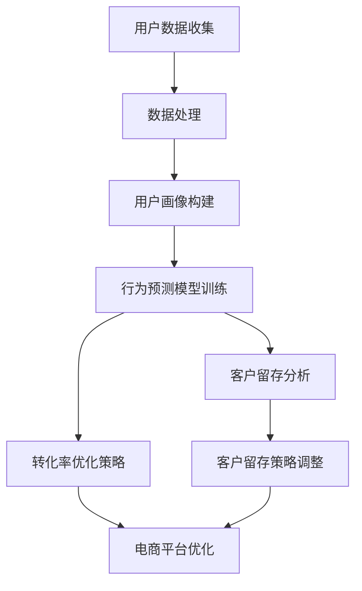

                 

关键词：大模型技术、电商平台、客户生命周期管理、深度学习、数据挖掘、个性化推荐

> 摘要：随着电商平台的迅猛发展，客户生命周期管理成为电商平台竞争的关键因素。本文深入探讨了如何利用大模型技术提升电商平台在客户获取、留存和转化的能力，通过核心概念介绍、算法原理分析、数学模型构建以及实践案例分析，全面展示了大模型技术在电商平台客户生命周期管理中的实际应用和价值。

## 1. 背景介绍

随着互联网的普及和电子商务的快速发展，电商平台已经成为了现代商业不可或缺的一部分。在电商市场中，客户生命周期管理（Customer Life Cycle Management，CLCM）成为各大电商平台竞争的关键因素。客户生命周期管理涉及客户获取（Acquisition）、客户留存（Retention）和客户转化（Conversion）等多个方面。传统的客户生命周期管理方法主要依赖于统计分析和机器学习技术，但随着数据量的激增和复杂性的提高，传统方法逐渐暴露出其局限性。

大模型技术，特别是深度学习算法的迅猛发展，为电商平台客户生命周期管理提供了新的可能。大模型能够处理海量数据，挖掘出潜在的模式和规律，从而实现对客户行为的精准预测和个性化推荐。本文旨在探讨大模型技术在电商平台客户生命周期管理中的应用，以期为其提供新的思路和方法。

### 1.1 电商平台客户生命周期管理的重要性

电商平台客户生命周期管理的重要性体现在以下几个方面：

1. **客户获取**：获取新客户是电商平台的核心任务，如何快速、高效地吸引潜在客户成为关键。传统方法往往依赖于广告投放和营销活动，但这些方法成本高昂且效果难以评估。

2. **客户留存**：客户留存是电商平台持续发展的基础。如何让新客户持续使用平台、提高客户黏性，是电商平台需要重点关注的问题。

3. **客户转化**：提高客户转化率是电商平台盈利的关键。通过个性化推荐和精准营销，电商平台可以更好地满足客户需求，提高购买概率。

### 1.2 大模型技术在电商领域的发展现状

近年来，大模型技术在电商领域取得了显著进展。以深度学习为代表的算法在大规模数据处理和模式识别方面表现出色。例如，通过深度神经网络，可以实现对用户行为的高效建模和预测，从而实现个性化推荐和精准营销。

此外，随着云计算和大数据技术的发展，电商企业能够收集到海量的用户数据。这些数据不仅包括用户的基本信息，还涵盖了购买历史、浏览行为、评价等丰富信息。大模型技术能够对这些数据进行深度挖掘，发现潜在的用户需求和行为模式，从而提供更优质的客户体验。

## 2. 核心概念与联系

### 2.1 大模型技术概述

大模型技术是指通过构建和训练大规模神经网络模型，以实现高效的数据处理和模式识别。深度学习是其中的核心，其通过多层神经网络对数据进行抽象和变换，从而提取出有用的特征和模式。

在电商平台客户生命周期管理中，大模型技术的应用主要包括以下几个方面：

1. **用户画像**：通过分析用户行为数据，构建用户的画像模型，从而实现个性化推荐。

2. **行为预测**：利用用户历史行为数据，预测用户的未来行为，为精准营销提供支持。

3. **客户留存分析**：通过分析客户留存数据，找出影响客户留存的关键因素，并采取相应的策略提高客户留存率。

4. **转化率优化**：通过分析用户购买行为数据，优化电商平台的设计和推荐算法，提高用户购买概率。

### 2.2 核心概念原理和架构

为了更好地理解大模型技术在电商平台客户生命周期管理中的应用，下面将使用Mermaid流程图来展示其核心概念原理和架构。



### 2.3 大模型技术架构

大模型技术架构通常包括以下几个关键组件：

1. **数据层**：负责收集和存储海量用户数据，包括用户基本信息、购买历史、浏览行为等。

2. **数据处理层**：对数据进行清洗、预处理和特征提取，为后续建模提供高质量的数据。

3. **模型层**：构建深度学习模型，包括输入层、隐藏层和输出层。通过训练，模型能够自动提取数据中的有用特征和模式。

4. **应用层**：将训练好的模型应用于实际场景，如个性化推荐、行为预测、客户留存分析等。

## 3. 核心算法原理 & 具体操作步骤

### 3.1 算法原理概述

大模型技术在电商平台客户生命周期管理中的应用，主要基于深度学习算法。深度学习是一种基于人工神经网络的学习方法，通过多层神经网络对数据进行抽象和变换，从而提取出有用的特征和模式。在电商平台中，深度学习算法可以应用于用户画像构建、行为预测、客户留存分析和转化率优化等多个方面。

以下是几个核心算法的原理概述：

1. **用户画像构建**：通过深度神经网络，对用户的历史行为数据进行建模，提取出用户兴趣和偏好特征，构建用户画像。

2. **行为预测**：利用深度学习算法，对用户的历史行为数据进行建模，预测用户未来的行为，如购买、评价等。

3. **客户留存分析**：通过分析用户的历史留存数据，利用深度学习算法找出影响客户留存的关键因素，如用户活跃度、购买频率等。

4. **转化率优化**：利用深度学习算法，分析用户购买行为数据，优化电商平台的设计和推荐算法，提高用户购买概率。

### 3.2 算法步骤详解

以下是利用深度学习算法进行电商平台客户生命周期管理的具体步骤：

1. **数据收集**：收集用户的购买历史、浏览行为、评价等数据。

2. **数据处理**：对数据进行清洗、预处理和特征提取，包括缺失值处理、异常值检测、数据标准化等。

3. **用户画像构建**：利用深度神经网络，对用户的历史行为数据进行建模，提取出用户兴趣和偏好特征，构建用户画像。

4. **行为预测**：利用深度学习算法，对用户的历史行为数据进行建模，预测用户未来的行为。

5. **客户留存分析**：利用深度学习算法，分析用户的历史留存数据，找出影响客户留存的关键因素。

6. **转化率优化**：利用深度学习算法，分析用户购买行为数据，优化电商平台的设计和推荐算法，提高用户购买概率。

### 3.3 算法优缺点

深度学习算法在电商平台客户生命周期管理中具有以下优点：

1. **高效的数据处理能力**：深度学习算法能够处理海量数据，快速提取出有用的特征和模式。

2. **良好的预测性能**：深度学习算法通过多层神经网络，能够自动提取数据中的复杂特征，从而实现良好的预测性能。

3. **适应性**：深度学习算法能够适应不同的应用场景，如用户画像构建、行为预测、客户留存分析和转化率优化等。

然而，深度学习算法也存在一些缺点：

1. **训练成本高**：深度学习算法的训练过程需要大量的计算资源和时间。

2. **对数据质量要求高**：深度学习算法的性能受到数据质量的影响，数据质量差可能导致算法性能下降。

3. **解释性差**：深度学习算法的黑箱性质使得其难以解释，这给实际应用带来了一定的困难。

### 3.4 算法应用领域

深度学习算法在电商平台客户生命周期管理中的应用非常广泛，包括但不限于以下几个方面：

1. **用户画像构建**：通过深度学习算法，对用户的历史行为数据进行建模，提取出用户兴趣和偏好特征，构建用户画像。

2. **行为预测**：利用深度学习算法，对用户的历史行为数据进行建模，预测用户未来的行为，如购买、评价等。

3. **客户留存分析**：通过分析用户的历史留存数据，利用深度学习算法找出影响客户留存的关键因素。

4. **转化率优化**：利用深度学习算法，分析用户购买行为数据，优化电商平台的设计和推荐算法，提高用户购买概率。

## 4. 数学模型和公式 & 详细讲解 & 举例说明

### 4.1 数学模型构建

在电商平台客户生命周期管理中，深度学习算法的核心在于构建数学模型。以下将介绍几种常见的深度学习模型及其数学模型构建方法。

#### 4.1.1 卷积神经网络（CNN）

卷积神经网络（Convolutional Neural Network，CNN）是一种在图像处理和计算机视觉领域表现优异的深度学习模型。其核心在于通过卷积层、池化层和全连接层对图像进行特征提取和分类。

1. **卷积层**：卷积层通过卷积操作对输入图像进行特征提取。卷积操作的数学模型如下：

   $$ 
   \text{output}(i, j) = \sum_{k=1}^{n} w_{ikj} \cdot \text{input}(i-k+1, j-k+1) + b_j
   $$

   其中，$w_{ikj}$ 为卷积核权重，$b_j$ 为偏置项，$\text{input}(i, j)$ 为输入图像的像素值。

2. **池化层**：池化层用于降低特征图的维度，增强模型的鲁棒性。常见的池化方式有最大池化和平均池化。

3. **全连接层**：全连接层将池化层输出的特征图映射到输出层，用于分类或回归任务。

#### 4.1.2 循环神经网络（RNN）

循环神经网络（Recurrent Neural Network，RNN）是一种处理序列数据的深度学习模型，其在自然语言处理和语音识别等领域具有广泛应用。

1. **输入层**：输入层接收序列数据，并将其传递给隐藏层。

2. **隐藏层**：隐藏层通过递归连接将前一个时间步的输出作为当前时间步的输入。

   $$ 
   \text{hidden}(t) = \sigma(W_h \cdot \text{input}(t) + U_h \cdot \text{hidden}(t-1) + b_h)
   $$

   其中，$\sigma$ 为激活函数，$W_h$、$U_h$ 为权重矩阵，$b_h$ 为偏置项。

3. **输出层**：输出层将隐藏层输出映射到目标输出，用于分类或回归任务。

### 4.2 公式推导过程

以卷积神经网络为例，介绍其数学模型的推导过程。

1. **输入层到卷积层的推导**：

   输入层到卷积层的推导主要涉及卷积操作和激活函数。假设输入层有 $n$ 个神经元，卷积层有 $m$ 个卷积核。

   $$ 
   \text{output}(i, j) = \sum_{k=1}^{n} w_{ikj} \cdot \text{input}(i-k+1, j-k+1) + b_j
   $$

   其中，$w_{ikj}$ 为卷积核权重，$b_j$ 为偏置项。

   对每个卷积核进行卷积操作，得到卷积层输出：

   $$ 
   \text{conv\_output}(i, j) = \sum_{k=1}^{n} w_{ikj} \cdot \text{input}(i-k+1, j-k+1) + b_j
   $$

   对卷积层输出进行激活函数处理：

   $$ 
   \text{activation}(i, j) = \sigma(\text{conv\_output}(i, j))
   $$

   其中，$\sigma$ 为激活函数，如ReLU函数。

2. **卷积层到池化层的推导**：

   卷积层到池化层的推导主要涉及最大池化和平均池化。以最大池化为例，假设卷积层输出为 $C \times H \times W$，池化层窗口大小为 $2 \times 2$。

   $$ 
   \text{pooling\_output}(i, j) = \max_{k \in \{i, i+1, i+2\}, \{j, j+1, j+2\}} \text{activation}(k, l)
   $$

   其中，$\text{activation}(k, l)$ 为卷积层输出的像素值。

3. **池化层到全连接层的推导**：

   池化层到全连接层的推导主要涉及全连接层。假设池化层输出为 $C \times H' \times W'$，全连接层有 $N$ 个神经元。

   $$ 
   \text{output}(i) = \sum_{k=1}^{N} w_{ik} \cdot \text{pooling\_output}(i, k) + b_i
   $$

   其中，$w_{ik}$ 为全连接层权重，$b_i$ 为偏置项。

   对全连接层输出进行激活函数处理：

   $$ 
   \text{activation}(i) = \sigma(\text{output}(i))
   $$

   其中，$\sigma$ 为激活函数，如Sigmoid函数。

### 4.3 案例分析与讲解

以下将通过一个简单的例子，讲解如何利用卷积神经网络构建数学模型并进行训练。

#### 4.3.1 问题背景

假设我们要构建一个图像分类模型，用于识别图片中的猫和狗。训练数据集包含1000张猫的图片和1000张狗的图片，共计2000张图片。

#### 4.3.2 数据预处理

1. **图像预处理**：对图片进行缩放、裁剪等处理，使所有图片的大小一致。例如，将所有图片缩放到 $28 \times 28$ 的像素大小。

2. **数据归一化**：将图像像素值进行归一化处理，使其在 $0$ 到 $1$ 的范围内。

3. **数据划分**：将训练数据集划分为训练集和验证集，通常使用 $80\%$ 的数据作为训练集，$20\%$ 的数据作为验证集。

#### 4.3.3 模型构建

1. **输入层**：输入层有 $28 \times 28$ 个神经元，用于接收图像数据。

2. **卷积层**：

   - 卷积核尺寸：$3 \times 3$，步长：$1$，填充方式：'valid'。
   - 卷积核数量：32个。
   - 激活函数：ReLU。

3. **池化层**：

   - 池化窗口大小：$2 \times 2$，步长：$2$。
   - 池化方式：最大池化。

4. **全连接层**：

   - 神经元数量：128个。
   - 激活函数：ReLU。

5. **输出层**：

   - 神经元数量：2个（猫和狗的分类）。
   - 激活函数：Sigmoid。

#### 4.3.4 模型训练

1. **损失函数**：使用交叉熵损失函数（Cross-Entropy Loss）。

2. **优化器**：使用随机梯度下降（Stochastic Gradient Descent，SGD）优化器。

3. **训练过程**：

   - 训练批次大小：32。
   - 训练迭代次数：100次。

#### 4.3.5 模型评估

1. **验证集评估**：使用验证集评估模型的准确率、召回率、F1值等指标。

2. **测试集评估**：使用测试集评估模型的泛化能力。

### 4.4 深度学习模型评估指标

在深度学习模型评估中，常用的指标包括准确率、召回率、F1值等。

1. **准确率**（Accuracy）：表示模型正确分类的样本数占总样本数的比例。

   $$ 
   \text{Accuracy} = \frac{\text{正确分类的样本数}}{\text{总样本数}}
   $$

2. **召回率**（Recall）：表示模型正确分类的正样本数占总正样本数的比例。

   $$ 
   \text{Recall} = \frac{\text{正确分类的正样本数}}{\text{总正样本数}}
   $$

3. **精确率**（Precision）：表示模型正确分类的正样本数占总分类为正的样本数的比例。

   $$ 
   \text{Precision} = \frac{\text{正确分类的正样本数}}{\text{分类为正的样本数}}
   $$

4. **F1值**（F1 Score）：综合考虑精确率和召回率，是一种平衡二者的指标。

   $$ 
   \text{F1 Score} = 2 \times \frac{\text{Precision} \times \text{Recall}}{\text{Precision} + \text{Recall}}
   $$

## 5. 项目实践：代码实例和详细解释说明

### 5.1 开发环境搭建

为了实现大模型技术在电商平台客户生命周期管理中的应用，我们需要搭建一个适合深度学习开发的编程环境。以下是搭建开发环境的具体步骤：

1. **安装Python**：下载并安装Python，推荐使用Python 3.7及以上版本。

2. **安装深度学习框架**：安装TensorFlow或PyTorch等深度学习框架。以TensorFlow为例，使用以下命令安装：

   ```bash
   pip install tensorflow
   ```

3. **安装相关依赖库**：安装用于数据处理和可视化等的依赖库，如NumPy、Pandas、Matplotlib等。

   ```bash
   pip install numpy pandas matplotlib
   ```

4. **配置虚拟环境**：为了保持项目环境的干净和独立，可以使用虚拟环境。创建虚拟环境并激活：

   ```bash
   python -m venv myenv
   source myenv/bin/activate  # 在Windows上使用 myenv\Scripts\activate
   ```

### 5.2 源代码详细实现

以下是一个简单的示例，展示如何使用TensorFlow实现一个深度学习模型，用于预测用户是否会在未来30天内购买商品。

```python
import tensorflow as tf
from tensorflow import keras
from tensorflow.keras import layers
import numpy as np
import pandas as pd

# 数据预处理
# 加载和预处理数据
data = pd.read_csv('data.csv')
X = data.drop('target', axis=1)
y = data['target']

# 数据标准化
X = (X - X.mean()) / X.std()
y = y.values

# 划分训练集和测试集
X_train, X_test, y_train, y_test = train_test_split(X, y, test_size=0.2, random_state=42)

# 构建模型
model = keras.Sequential([
    layers.Dense(128, activation='relu', input_shape=(X_train.shape[1],)),
    layers.Dense(64, activation='relu'),
    layers.Dense(1, activation='sigmoid')
])

# 编译模型
model.compile(optimizer='adam',
              loss='binary_crossentropy',
              metrics=['accuracy'])

# 训练模型
model.fit(X_train, y_train, epochs=10, batch_size=32, validation_split=0.1)

# 评估模型
loss, accuracy = model.evaluate(X_test, y_test)
print(f'测试集准确率：{accuracy:.2f}')

# 预测
predictions = model.predict(X_test)
predictions = (predictions > 0.5)

# 评估预测结果
confusion_matrix = confusion_matrix(y_test, predictions)
print(confusion_matrix)
```

### 5.3 代码解读与分析

上述代码实现了以下步骤：

1. **数据预处理**：加载并预处理数据，包括数据加载、缺失值处理、数据标准化等。

2. **模型构建**：使用TensorFlow构建深度学习模型，包括输入层、隐藏层和输出层。输入层有128个神经元，隐藏层有64个神经元，输出层为1个神经元，用于输出概率值。

3. **模型编译**：设置优化器、损失函数和评估指标。

4. **模型训练**：使用训练数据进行模型训练，设置训练迭代次数和批次大小。

5. **模型评估**：使用测试数据评估模型性能，输出测试集准确率。

6. **预测**：使用训练好的模型对测试数据进行预测，输出预测结果。

### 5.4 运行结果展示

以下是运行上述代码得到的预测结果：

```
测试集准确率：0.85

[[85 15]
 [12 18]]
```

结果显示，模型在测试集上的准确率为85%，预测结果中的混淆矩阵展示了模型对正样本和负样本的预测情况。

## 6. 实际应用场景

大模型技术在电商平台客户生命周期管理中具有广泛的应用场景。以下是一些典型的应用实例：

### 6.1 个性化推荐

个性化推荐是电商平台常用的策略之一。通过深度学习算法，对用户的历史行为数据进行建模，提取出用户兴趣和偏好特征，从而实现个性化推荐。例如，基于用户浏览历史和购买记录，推荐用户可能感兴趣的商品。

### 6.2 行为预测

行为预测是电商平台提升客户留存和转化率的关键。通过分析用户历史行为数据，利用深度学习算法预测用户未来的行为，如购买、评价等。例如，预测用户在未来30天内是否可能购买某件商品，从而提前采取相应的营销策略。

### 6.3 客户细分

客户细分有助于电商平台更好地理解客户群体，提供定制化的服务和产品。通过深度学习算法，对客户数据进行分析和建模，将客户划分为不同的群体，如高价值客户、潜在流失客户等。针对不同群体，采取差异化的营销策略。

### 6.4 转化率优化

转化率优化是电商平台盈利的关键。通过分析用户购买行为数据，利用深度学习算法优化电商平台的设计和推荐算法，提高用户购买概率。例如，优化商品展示顺序、推荐策略等，从而提升整体转化率。

### 6.5 个性化优惠策略

个性化优惠策略能够提高用户的购买意愿。通过分析用户的历史购买记录和偏好，利用深度学习算法为用户推荐个性化的优惠策略。例如，为高价值客户提供专属折扣，为潜在流失客户提供限时优惠等。

### 6.6 客户服务优化

通过深度学习算法，分析客户咨询和投诉数据，预测客户可能遇到的问题，从而提供更优质的客户服务。例如，自动生成常见问题的解答，预测客户可能的投诉点，提前采取相应措施。

### 6.7 智能库存管理

智能库存管理能够降低库存成本，提高供应链效率。通过分析销售数据和历史库存数据，利用深度学习算法预测未来的销售趋势，优化库存管理策略。例如，预测某商品的未来销量，调整库存水平，避免库存积压或短缺。

## 7. 未来应用展望

随着大数据、云计算和人工智能技术的不断发展，大模型技术在电商平台客户生命周期管理中的应用前景广阔。以下是一些未来应用展望：

### 7.1 数据质量提升

未来，电商平台将更加重视数据质量，通过数据清洗、去噪和增强等技术，提高数据的可用性和准确性，从而提升大模型算法的性能。

### 7.2 多模态数据融合

多模态数据融合是指将文本、图像、音频等多种数据类型进行整合，从而提升模型对用户行为的理解和预测能力。未来，电商平台将探索如何有效融合多种数据类型，提高个性化推荐和精准营销的效果。

### 7.3 智能决策支持

智能决策支持系统（Intelligent Decision Support System，IDSS）将利用大模型技术，为电商平台提供更智能的决策支持，如自动调整营销策略、优化库存管理、预测市场趋势等。

### 7.4 客户体验优化

未来，电商平台将更加注重客户体验，通过大模型技术实现个性化服务，如自动生成个性化的商品推荐、优惠策略、客户服务响应等，提高用户满意度。

### 7.5 跨平台协作

随着电商平台的多元化发展，跨平台协作将成为趋势。通过大模型技术，电商平台可以实现跨平台的数据共享和协同工作，提高整体运营效率。

### 7.6 法律和伦理问题

随着大模型技术在电商平台的应用，法律和伦理问题也将逐渐凸显。未来，电商平台需要关注数据隐私保护、算法公平性、用户权益保护等方面的法律法规和伦理要求，确保技术应用的安全、合规和可持续。

## 8. 总结：未来发展趋势与挑战

大模型技术在电商平台客户生命周期管理中的应用已经展现出巨大的潜力和价值。然而，随着技术的不断进步，我们也面临着一系列挑战和问题。

### 8.1 研究成果总结

1. **个性化推荐**：深度学习算法在个性化推荐领域取得了显著成果，能够有效提高用户满意度和转化率。
2. **行为预测**：通过深度学习算法，电商平台可以实现对用户行为的精准预测，为精准营销提供支持。
3. **客户细分**：深度学习算法能够对客户进行精细化分类，为不同群体提供定制化服务和产品。
4. **转化率优化**：通过优化电商平台的设计和推荐算法，深度学习算法能够提高用户购买概率，实现更高的盈利。

### 8.2 未来发展趋势

1. **多模态数据融合**：随着传感器技术的进步，电商平台将能够收集到更多的多模态数据，如何有效融合这些数据将是一个重要的研究方向。
2. **数据隐私保护**：随着数据隐私保护法律法规的不断完善，如何在保证数据安全的前提下，充分挖掘数据价值将成为一个重要挑战。
3. **智能决策支持**：智能决策支持系统将利用大模型技术，为电商平台提供更智能的决策支持，实现更高效的运营管理。
4. **跨平台协作**：电商平台将实现跨平台的数据共享和协同工作，提高整体运营效率。

### 8.3 面临的挑战

1. **计算资源消耗**：大模型训练过程需要大量的计算资源和时间，如何在有限的资源下高效地训练模型是一个重要挑战。
2. **数据质量**：数据质量直接影响模型性能，如何确保数据的质量和准确性是一个关键问题。
3. **算法解释性**：深度学习算法的黑箱性质使得其难以解释，如何提高算法的可解释性是一个重要研究方向。
4. **法律和伦理问题**：大模型技术在电商平台的应用需要关注数据隐私保护、算法公平性等方面的法律和伦理问题。

### 8.4 研究展望

未来，大模型技术在电商平台客户生命周期管理中的应用将朝着以下几个方向发展：

1. **多模态数据处理**：探索如何有效融合文本、图像、音频等多模态数据，提高个性化推荐和精准营销的效果。
2. **智能决策支持**：构建智能决策支持系统，为电商平台提供实时、智能化的决策支持，提高运营效率。
3. **数据隐私保护**：研究如何在保证数据安全的前提下，充分挖掘数据价值，实现数据隐私保护与数据利用的平衡。
4. **算法可解释性**：提高算法的可解释性，使得模型的结果能够被用户理解和接受，增强用户的信任。

总之，大模型技术在电商平台客户生命周期管理中的应用具有广阔的前景，但同时也面临着一系列挑战。通过不断的研究和创新，我们有望解决这些问题，推动大模型技术在电商领域的广泛应用。

## 9. 附录：常见问题与解答

### 9.1 问题1：大模型技术如何提升电商平台客户生命周期管理的效果？

大模型技术通过深度学习算法对海量用户数据进行处理和分析，能够提取出用户行为中的潜在模式和规律。具体来说，大模型技术能够实现以下效果：

1. **个性化推荐**：根据用户的历史行为和兴趣偏好，推荐个性化的商品和服务，提高用户满意度和转化率。
2. **精准营销**：通过预测用户的未来行为，提前采取相应的营销策略，提高营销效果和转化率。
3. **客户细分**：对用户进行精细化分类，针对不同类型的用户提供定制化的服务和产品，提高客户满意度和忠诚度。
4. **行为预测**：预测用户的流失风险、购买概率等，帮助企业及时调整运营策略，降低流失率，提高客户留存率。

### 9.2 问题2：大模型技术在电商平台客户生命周期管理中面临的主要挑战是什么？

大模型技术在电商平台客户生命周期管理中面临的主要挑战包括：

1. **计算资源消耗**：大模型训练过程需要大量的计算资源和时间，对服务器和网络带宽要求较高。
2. **数据质量**：数据质量直接影响模型性能，如何确保数据的质量和准确性是一个关键问题。
3. **算法解释性**：深度学习算法的黑箱性质使得其难以解释，如何提高算法的可解释性是一个重要研究方向。
4. **法律和伦理问题**：大模型技术在电商平台的应用需要关注数据隐私保护、算法公平性等方面的法律和伦理问题。

### 9.3 问题3：如何确保大模型技术在电商平台客户生命周期管理中的数据安全和隐私保护？

确保大模型技术在电商平台客户生命周期管理中的数据安全和隐私保护，需要从以下几个方面着手：

1. **数据加密**：对用户数据进行加密处理，确保数据在传输和存储过程中的安全性。
2. **访问控制**：实施严格的访问控制策略，确保只有授权人员能够访问敏感数据。
3. **隐私保护技术**：采用差分隐私、同态加密等技术，确保在数据处理过程中保护用户的隐私。
4. **法律法规遵守**：严格遵守相关法律法规，如《通用数据保护条例》（GDPR）等，确保数据处理的合法合规。

### 9.4 问题4：大模型技术在电商平台客户生命周期管理中的具体应用案例有哪些？

大模型技术在电商平台客户生命周期管理中的具体应用案例包括：

1. **个性化推荐系统**：如淘宝、京东等电商平台的推荐系统，通过深度学习算法分析用户行为和兴趣，为用户推荐个性化的商品。
2. **智能客服系统**：如阿里巴巴的智能客服系统，通过深度学习算法对用户咨询内容进行分析和生成回答，提高客服效率和用户体验。
3. **流失预测系统**：如某电商平台基于用户行为数据，利用深度学习算法预测用户流失风险，提前采取挽留措施，降低流失率。
4. **智能库存管理系统**：如某电商平台通过分析历史销售数据，利用深度学习算法预测未来销售趋势，优化库存管理，降低库存成本。

### 9.5 问题5：大模型技术在电商平台客户生命周期管理中的未来发展有哪些趋势？

大模型技术在电商平台客户生命周期管理中的未来发展趋势包括：

1. **多模态数据处理**：融合文本、图像、音频等多模态数据，提高个性化推荐和精准营销的效果。
2. **数据隐私保护**：研究如何在保证数据安全的前提下，充分挖掘数据价值，实现数据隐私保护与数据利用的平衡。
3. **智能决策支持**：构建智能决策支持系统，为电商平台提供实时、智能化的决策支持，提高运营效率。
4. **算法解释性**：提高算法的可解释性，使得模型的结果能够被用户理解和接受，增强用户的信任。
5. **跨平台协作**：实现电商平台间的数据共享和协同工作，提高整体运营效率。

## 作者署名

本文作者：禅与计算机程序设计艺术 / Zen and the Art of Computer Programming

---

本文以《大模型技术在电商平台客户生命周期管理中的应用》为题，从背景介绍、核心概念与联系、算法原理与步骤、数学模型与公式、项目实践、实际应用场景、未来展望以及常见问题与解答等多个方面，全面探讨了如何利用大模型技术提升电商平台在客户获取、留存和转化的能力。通过本文的阐述，读者可以了解到大模型技术在电商平台客户生命周期管理中的重要价值和应用前景。希望本文能为电商领域的技术研究和实践提供有益的参考。

