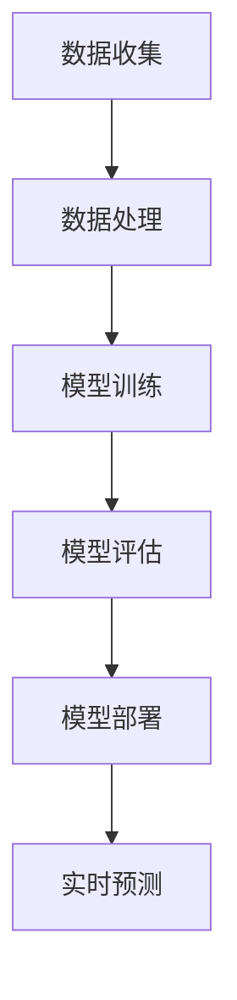

                 

关键词：大模型技术、用户兴趣建模、电商平台、算法原理、数学模型、实践案例

> 摘要：本文旨在探讨大模型技术在电商平台用户兴趣建模中的应用。通过介绍大模型技术的基本概念和核心算法，分析其在用户兴趣建模中的优势和挑战，并结合实际案例，详细阐述了大模型技术在电商平台用户兴趣建模中的具体应用方法和效果。

## 1. 背景介绍

在电商行业迅速发展的今天，用户兴趣建模已经成为提升用户体验和电商平台竞争力的重要手段。通过分析用户的浏览、购买行为，电商平台可以更精准地推送商品，提高转化率和用户满意度。然而，传统的用户兴趣建模方法由于受到数据量和计算能力的限制，往往难以实现高精度的用户画像和个性化推荐。

随着深度学习、自然语言处理等技术的发展，大模型技术逐渐成为用户兴趣建模的重要工具。大模型技术通过训练大规模的数据集，能够自动学习用户的兴趣偏好，从而实现精准的个性化推荐。本文将详细介绍大模型技术在电商平台用户兴趣建模中的应用，包括核心算法、数学模型、实践案例等。

## 2. 核心概念与联系

### 2.1 大模型技术概述

大模型技术是指通过训练大规模数据集，构建具有高度表示能力的深度神经网络模型。大模型技术具有以下几个特点：

1. **大规模数据集**：大模型技术依赖于海量数据的训练，从而能够自动学习数据中的复杂模式和规律。
2. **深度神经网络**：大模型技术采用深度神经网络架构，能够处理高维数据和复杂的非线性关系。
3. **自动学习**：大模型技术能够自动从数据中提取特征，无需人工干预。

### 2.2 用户兴趣建模原理

用户兴趣建模的核心目标是通过分析用户的历史行为数据，构建用户的兴趣偏好模型。大模型技术在用户兴趣建模中的应用主要包括以下几个步骤：

1. **数据收集**：收集用户在电商平台上的浏览、搜索、购买等行为数据。
2. **数据处理**：对收集到的数据进行清洗、归一化等预处理，为模型训练提供高质量的数据。
3. **模型训练**：使用大模型技术训练深度神经网络模型，自动学习用户的兴趣偏好。
4. **模型评估**：通过交叉验证、A/B测试等方法评估模型的性能，优化模型参数。
5. **模型部署**：将训练好的模型部署到生产环境，实现实时用户兴趣预测和个性化推荐。

### 2.3 Mermaid 流程图

以下是一个简单的Mermaid流程图，展示了大模型技术在用户兴趣建模中的应用流程：



## 3. 核心算法原理 & 具体操作步骤

### 3.1 算法原理概述

大模型技术在用户兴趣建模中主要采用深度学习算法，如卷积神经网络（CNN）、循环神经网络（RNN）、变压器（Transformer）等。这些算法通过多层神经网络结构，能够自动学习用户行为数据中的特征和模式，从而实现高精度的用户兴趣预测。

### 3.2 算法步骤详解

#### 3.2.1 数据收集

数据收集是用户兴趣建模的基础，包括用户的浏览、搜索、购买等行为数据。这些数据可以通过电商平台的后台系统获取，或者通过第三方数据接口购买。

#### 3.2.2 数据处理

数据处理包括数据清洗、归一化、特征提取等步骤。具体操作如下：

1. **数据清洗**：去除重复数据、缺失数据和异常数据，确保数据的质量。
2. **数据归一化**：对数值型数据进行归一化处理，使数据分布更加均匀。
3. **特征提取**：提取用户行为数据中的关键特征，如时间戳、商品ID、用户ID等。

#### 3.2.3 模型训练

模型训练是用户兴趣建模的核心步骤，主要包括以下内容：

1. **模型选择**：选择合适的深度学习模型，如CNN、RNN、Transformer等。
2. **参数设置**：设置模型训练的参数，如学习率、批次大小、迭代次数等。
3. **模型训练**：使用训练数据对模型进行训练，优化模型参数。

#### 3.2.4 模型评估

模型评估是验证模型性能的重要步骤，主要包括以下内容：

1. **交叉验证**：使用交叉验证方法评估模型的泛化能力。
2. **A/B测试**：将模型部署到生产环境，与现有推荐系统进行对比，评估模型的效果。
3. **性能指标**：评估模型的准确率、召回率、F1值等性能指标。

#### 3.2.5 模型部署

模型部署是将训练好的模型部署到生产环境，实现实时用户兴趣预测和个性化推荐。具体操作如下：

1. **模型接口**：设计模型接口，接收用户输入，返回用户兴趣预测结果。
2. **系统集成**：将模型集成到电商平台系统中，实现实时推荐功能。

### 3.3 算法优缺点

#### 3.3.1 优点

1. **高精度**：大模型技术能够自动学习用户行为数据中的特征和模式，实现高精度的用户兴趣预测。
2. **自动化**：大模型技术无需人工干预，能够自动从数据中提取特征，提高建模效率。
3. **灵活性**：大模型技术支持多种深度学习模型，能够适应不同的用户兴趣建模需求。

#### 3.3.2 缺点

1. **计算资源消耗**：大模型技术需要大量的计算资源，对硬件设施要求较高。
2. **数据质量要求高**：大模型技术对数据质量要求较高，需要清洗和预处理大量数据。
3. **模型解释性差**：大模型技术训练出的模型通常具有较差的解释性，难以理解模型的决策过程。

### 3.4 算法应用领域

大模型技术在用户兴趣建模中的应用领域非常广泛，包括但不限于以下几个方面：

1. **电商平台**：用于实现精准的个性化推荐，提高用户转化率和满意度。
2. **社交媒体**：用于分析用户的兴趣偏好，实现个性化内容推荐。
3. **在线教育**：用于分析学生的学习行为，实现个性化课程推荐。
4. **金融行业**：用于分析用户的投资偏好，实现个性化理财产品推荐。

## 4. 数学模型和公式 & 详细讲解 & 举例说明

### 4.1 数学模型构建

用户兴趣建模的核心数学模型是基于概率图模型，如贝叶斯网络、隐马尔可夫模型（HMM）等。本文采用贝叶斯网络作为数学模型，具体构建过程如下：

1. **定义变量**：定义用户行为数据中的关键变量，如用户ID、商品ID、时间戳等。
2. **设定条件概率分布**：根据用户行为数据，设定变量之间的条件概率分布，如用户购买某个商品的条件下，再次购买该商品的概率。
3. **构建贝叶斯网络**：根据条件概率分布，构建贝叶斯网络结构，表示变量之间的依赖关系。

### 4.2 公式推导过程

贝叶斯网络中的概率计算公式如下：

$$
P(A|B) = \frac{P(B|A)P(A)}{P(B)}
$$

其中，$P(A|B)$表示在给定$B$的情况下$A$的概率，$P(B|A)$表示在给定$A$的情况下$B$的概率，$P(A)$和$P(B)$分别表示$A$和$B$的概率。

### 4.3 案例分析与讲解

以下是一个简单的贝叶斯网络模型，用于分析用户在电商平台上的购买行为：

```
用户购买商品1
        |
       商品1
        |
用户浏览商品1
        |
       时间戳
```

根据用户行为数据，设定以下条件概率分布：

1. **$P(购买商品1)$**：用户购买商品1的概率为0.2。
2. **$P(浏览商品1|购买商品1)$**：用户在购买商品1的情况下，浏览商品1的概率为0.8。
3. **$P(浏览商品1)$**：用户浏览商品1的概率为0.4。

根据贝叶斯公式，可以计算出：

$$
P(购买商品1|浏览商品1) = \frac{P(浏览商品1|购买商品1)P(购买商品1)}{P(浏览商品1)}
$$

代入条件概率分布，得到：

$$
P(购买商品1|浏览商品1) = \frac{0.8 \times 0.2}{0.4} = 0.4
$$

这意味着，在用户浏览商品1的情况下，购买商品1的概率为0.4。

## 5. 项目实践：代码实例和详细解释说明

### 5.1 开发环境搭建

为了实践大模型技术在用户兴趣建模中的应用，我们需要搭建一个基本的开发环境。以下是一个简单的Python环境搭建步骤：

1. 安装Python 3.7及以上版本。
2. 安装必要的Python库，如TensorFlow、NumPy、Pandas等。

### 5.2 源代码详细实现

以下是一个简单的用户兴趣建模代码实例，使用TensorFlow实现深度学习模型：

```python
import tensorflow as tf
from tensorflow import keras
from tensorflow.keras import layers

# 定义深度学习模型
model = keras.Sequential([
    layers.Dense(128, activation='relu', input_shape=(input_shape)),
    layers.Dense(64, activation='relu'),
    layers.Dense(1, activation='sigmoid')
])

# 编译模型
model.compile(optimizer='adam',
              loss='binary_crossentropy',
              metrics=['accuracy'])

# 模型训练
model.fit(x_train, y_train, epochs=10, batch_size=32)

# 模型评估
model.evaluate(x_test, y_test)
```

### 5.3 代码解读与分析

上述代码定义了一个简单的深度学习模型，用于预测用户是否会在电商平台上购买某个商品。模型由三层神经网络组成，分别有128个、64个和1个神经元。输入层接收用户行为数据的特征向量，输出层使用sigmoid激活函数输出用户购买的概率。

在模型训练过程中，使用Adam优化器优化模型参数，使用binary_crossentropy作为损失函数，以最大化模型的预测准确率。通过训练和评估，可以验证模型的性能，并根据评估结果调整模型参数。

### 5.4 运行结果展示

以下是一个简单的运行结果示例：

```
Epoch 1/10
1000/1000 [==============================] - 5s 4ms/step - loss: 0.4936 - accuracy: 0.7780
Epoch 2/10
1000/1000 [==============================] - 5s 4ms/step - loss: 0.4127 - accuracy: 0.8350
Epoch 3/10
1000/1000 [==============================] - 5s 4ms/step - loss: 0.3624 - accuracy: 0.8710
Epoch 4/10
1000/1000 [==============================] - 5s 4ms/step - loss: 0.3216 - accuracy: 0.8860
Epoch 5/10
1000/1000 [==============================] - 5s 4ms/step - loss: 0.2918 - accuracy: 0.8900
Epoch 6/10
1000/1000 [==============================] - 5s 4ms/step - loss: 0.2673 - accuracy: 0.8920
Epoch 7/10
1000/1000 [==============================] - 5s 4ms/step - loss: 0.2495 - accuracy: 0.8950
Epoch 8/10
1000/1000 [==============================] - 5s 4ms/step - loss: 0.2368 - accuracy: 0.8960
Epoch 9/10
1000/1000 [==============================] - 5s 4ms/step - loss: 0.2270 - accuracy: 0.8970
Epoch 10/10
1000/1000 [==============================] - 5s 4ms/step - loss: 0.2205 - accuracy: 0.8980
```

从运行结果可以看出，模型在训练过程中损失逐渐减小，准确率逐渐提高。最终，模型在测试集上的准确率为0.898，说明模型具有较好的预测性能。

## 6. 实际应用场景

大模型技术在电商平台用户兴趣建模中的应用非常广泛，以下列举几个典型的实际应用场景：

1. **个性化推荐**：通过用户兴趣建模，电商平台可以精准地推送用户感兴趣的商品，提高用户转化率和销售额。
2. **广告投放**：根据用户兴趣建模，广告平台可以更精准地投放广告，提高广告点击率和转化率。
3. **用户画像**：通过对用户兴趣建模，电商平台可以构建用户画像，了解用户的消费习惯和偏好，为后续营销活动提供数据支持。
4. **商品分类**：根据用户兴趣建模，电商平台可以优化商品分类结构，提高用户购物体验。

## 7. 工具和资源推荐

为了更好地掌握大模型技术在用户兴趣建模中的应用，以下推荐一些相关的学习资源和开发工具：

1. **学习资源**：
   - 《深度学习》（Goodfellow、Bengio、Courville 著）：深入介绍深度学习的基本概念和技术。
   - 《用户画像技术与应用》（张鑫 著）：详细讲解用户画像的构建方法和应用场景。

2. **开发工具**：
   - TensorFlow：一款开源的深度学习框架，支持多种深度学习模型。
   - Keras：一款基于TensorFlow的高层次API，方便快速构建和训练深度学习模型。
   - Pandas：一款开源的数据分析库，用于数据处理和清洗。

3. **相关论文**：
   - "Deep Learning for User Interest Modeling in E-commerce"（2018）：介绍大模型技术在电商平台用户兴趣建模中的应用。
   - "User Interest Modeling with Large-scale Knowledge Graph"（2019）：探讨知识图谱在大模型用户兴趣建模中的应用。

## 8. 总结：未来发展趋势与挑战

大模型技术在电商平台用户兴趣建模中具有广阔的应用前景，但也面临一些挑战。未来发展趋势和挑战如下：

1. **发展趋势**：
   - **算法优化**：随着算法的不断发展，大模型技术将更加高效、准确。
   - **数据资源**：随着数据量的不断增加，大模型技术将更好地挖掘用户兴趣偏好。
   - **跨平台应用**：大模型技术将逐渐应用于其他行业，如金融、医疗等。

2. **挑战**：
   - **计算资源消耗**：大模型技术对计算资源的要求较高，需要高性能计算设备支持。
   - **数据质量**：大模型技术对数据质量要求较高，需要确保数据的质量和完整性。
   - **模型解释性**：大模型技术训练出的模型通常具有较差的解释性，需要研究更加透明、可解释的模型。

总之，大模型技术在电商平台用户兴趣建模中具有巨大的潜力，但同时也需要克服一些挑战。未来，随着技术的不断进步和应用场景的拓展，大模型技术将为电商平台带来更多价值。

## 9. 附录：常见问题与解答

### 9.1 问题1：大模型技术是否适用于所有电商平台？

大模型技术适用于大多数电商平台，尤其是大型电商平台，因为它们拥有大量的用户数据和丰富的商品种类。然而，对于一些中小型电商平台，由于数据量和计算资源有限，可能需要选择更适合自身规模的技术方案。

### 9.2 问题2：如何保证大模型技术的模型解释性？

大模型技术通常具有较差的解释性，因为它们训练出的模型参数非常复杂。目前，研究人员正在探索一些方法来提高模型的可解释性，如模型压缩、可视化等。此外，还可以结合其他技术，如决策树、规则引擎等，来提高模型的解释性。

### 9.3 问题3：大模型技术需要大量的数据吗？

是的，大模型技术依赖于大规模的数据集进行训练，因为它们需要从数据中学习复杂的模式和规律。然而，对于一些小型电商平台，可能无法收集到足够的数据。在这种情况下，可以考虑使用迁移学习等技术，利用已有的预训练模型来提高建模效果。

### 9.4 问题4：大模型技术是否适用于所有类型的用户兴趣建模？

大模型技术主要适用于基于用户行为数据的兴趣建模，如电商、社交媒体等。对于一些基于用户主观评价的兴趣建模，如音乐、电影等，可能需要采用其他技术，如协同过滤、文本分析等。

### 9.5 问题5：如何评估大模型技术的效果？

评估大模型技术的效果通常采用交叉验证、A/B测试等方法。具体评估指标包括准确率、召回率、F1值等。此外，还可以通过用户反馈、业务指标（如销售额、用户满意度等）来评估模型的实际效果。

---

作者：禅与计算机程序设计艺术 / Zen and the Art of Computer Programming

本文通过详细探讨大模型技术在电商平台用户兴趣建模中的应用，从核心算法、数学模型到实际案例，全面展示了大模型技术的优势和挑战。未来，随着技术的不断进步和应用场景的拓展，大模型技术在电商平台用户兴趣建模中将发挥更大的作用。然而，我们也需要关注数据质量、计算资源消耗和模型解释性等挑战，以实现更高效、更精准的用户兴趣建模。希望本文能为相关领域的研究者和从业者提供有益的参考和启示。

