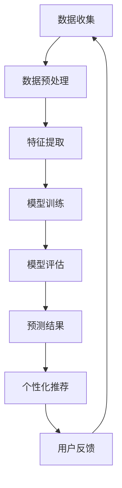

                 

关键词：大模型技术、电商平台、用户兴趣迁移、预测模型、应用创新

摘要：本文探讨了如何运用大模型技术提升电商平台用户兴趣迁移预测的准确性，从而实现个性化推荐系统。通过介绍大模型技术的背景、核心概念、算法原理、数学模型以及实际应用案例，分析了其在电商平台中的应用潜力，并展望了未来的发展趋势与挑战。

## 1. 背景介绍

随着互联网的快速发展，电商平台已经成为人们日常生活中不可或缺的一部分。用户在电商平台上的行为数据量庞大，这些数据蕴含着丰富的用户兴趣信息。如何有效地挖掘和分析这些数据，对提升电商平台竞争力具有重要意义。传统的方法主要包括基于内容推荐和协同过滤的方法，但这些方法在处理复杂的用户兴趣迁移问题时存在局限性。

近年来，随着深度学习技术的飞速发展，大模型技术在各个领域取得了显著成果。大模型技术能够从海量数据中自动提取特征，并建立复杂的关系模型，从而实现高精度的预测。本文旨在探讨如何将大模型技术应用于电商平台用户兴趣迁移预测，提升推荐系统的准确性和个性化水平。

### 1.1 大模型技术的发展背景

大模型技术是指通过训练大规模神经网络模型，使其具备处理海量数据、提取复杂特征和建立高精度模型的能力。深度学习作为大模型技术的重要分支，通过多层神经网络结构，实现了从简单特征到复杂特征的层次化提取。

近年来，随着计算能力的提升和数据规模的扩大，大模型技术取得了显著的进展。以谷歌的BERT模型为例，该模型通过预训练和微调技术，在自然语言处理领域取得了显著的性能提升。此外，大模型技术在计算机视觉、语音识别等领域也取得了重要突破。

### 1.2 电商平台用户兴趣迁移的挑战

在电商平台，用户兴趣迁移是指用户在不同情境下表现出不同兴趣特征的现象。例如，一个用户在浏览商品时可能对某个品类表现出浓厚兴趣，而在另一情境下可能对另一个品类更感兴趣。传统推荐系统往往难以捕捉到这种复杂的用户兴趣迁移现象，导致推荐效果不佳。

此外，电商平台面临以下挑战：

1. 数据量庞大：电商平台每天产生大量用户行为数据，如何有效地处理和分析这些数据是关键。

2. 数据多样性：用户兴趣具有多样性，传统方法难以捕捉到所有用户兴趣点。

3. 用户隐私保护：在处理用户数据时，如何保护用户隐私是重要问题。

4. 推荐效果评估：如何准确评估推荐系统的效果是另一个挑战。

## 2. 核心概念与联系

为了更好地理解大模型技术在电商平台用户兴趣迁移预测中的应用，我们首先需要了解一些核心概念，包括深度学习、神经网络、自然语言处理等。

### 2.1 深度学习

深度学习是一种人工智能方法，通过多层神经网络结构，实现从简单特征到复杂特征的层次化提取。深度学习在大模型技术中扮演着核心角色，其主要特点是：

1. 自动特征提取：深度学习模型能够自动从数据中提取具有代表性的特征，减轻了人工特征工程的工作量。

2. 高泛化能力：深度学习模型通过训练大量数据，具备较强的泛化能力，能够适应不同领域的应用场景。

3. 高精度预测：深度学习模型在许多领域取得了显著的性能提升，例如图像分类、语音识别等。

### 2.2 神经网络

神经网络是深度学习的基础，由多个神经元组成，通过前向传播和反向传播算法实现数据的层次化处理。神经网络的主要特点包括：

1. 多层结构：神经网络通过增加层数，实现从简单特征到复杂特征的层次化提取。

2. 权重调整：神经网络通过调整权重，优化模型性能。

3. 损失函数：神经网络通过定义损失函数，评估模型的预测误差，并指导权重调整。

### 2.3 自然语言处理

自然语言处理是深度学习的重要应用领域，旨在使计算机理解和处理自然语言。自然语言处理的主要任务包括：

1. 词嵌入：将自然语言中的单词映射到高维空间，实现语义表示。

2. 文本分类：根据文本内容对文本进行分类。

3. 情感分析：分析文本的情感倾向。

4. 机器翻译：实现不同语言之间的自动翻译。

### 2.4 Mermaid 流程图

下面是一个用于描述大模型技术在电商平台用户兴趣迁移预测中的 Mermaid 流程图。



## 3. 核心算法原理 & 具体操作步骤

### 3.1 算法原理概述

大模型技术在电商平台用户兴趣迁移预测中的核心算法是基于深度学习的用户兴趣迁移模型。该模型通过以下步骤实现用户兴趣迁移预测：

1. 数据收集：收集电商平台用户的行为数据，包括浏览、购买、评价等。

2. 数据预处理：对收集到的数据进行清洗、去重、归一化等处理，确保数据质量。

3. 特征提取：利用深度学习技术，从原始数据中提取具有代表性的特征。

4. 模型训练：基于提取的特征，训练深度学习模型，实现用户兴趣迁移预测。

5. 模型评估：对训练好的模型进行评估，确定其预测性能。

6. 预测结果：根据模型预测结果，生成个性化推荐。

### 3.2 算法步骤详解

下面详细描述大模型技术在电商平台用户兴趣迁移预测中的具体操作步骤。

#### 3.2.1 数据收集

数据收集是用户兴趣迁移预测的基础。在电商平台，用户行为数据包括浏览记录、购买记录、评价记录等。此外，还可以收集用户的基本信息，如年龄、性别、地理位置等。数据收集过程中需要注意以下几点：

1. 数据来源：确保数据来源可靠，避免数据质量问题。

2. 数据完整性：尽可能收集完整的数据，避免数据缺失。

3. 数据隐私保护：在收集和处理用户数据时，严格遵守相关法律法规，保护用户隐私。

#### 3.2.2 数据预处理

数据预处理是数据收集后的重要环节，旨在提高数据质量，为后续特征提取和模型训练做好准备。数据预处理包括以下步骤：

1. 数据清洗：去除重复数据、异常数据，确保数据的一致性和准确性。

2. 数据去重：识别并去除重复的数据记录。

3. 数据归一化：将不同特征的数据进行归一化处理，使其具有相同的量纲。

4. 数据特征提取：根据业务需求，提取与用户兴趣相关的特征，如用户浏览频率、购买频率、评价分数等。

#### 3.2.3 特征提取

特征提取是深度学习模型训练的关键步骤。通过深度学习技术，可以从原始数据中提取具有代表性的特征。特征提取的主要方法包括：

1. 词嵌入：将自然语言中的单词映射到高维空间，实现语义表示。

2. 图嵌入：将实体和关系映射到低维空间，实现图数据的表示。

3. 稀疏特征提取：对稀疏数据进行特征提取，提高模型训练效率。

4. 预训练模型：利用预训练模型，对原始数据进行特征提取和表示。

#### 3.2.4 模型训练

在特征提取完成后，可以使用深度学习模型进行用户兴趣迁移预测。模型训练的主要步骤包括：

1. 定义损失函数：选择合适的损失函数，如交叉熵损失函数，评估模型预测误差。

2. 优化算法：选择合适的优化算法，如Adam优化器，调整模型参数。

3. 模型训练：根据训练数据，对模型进行训练，优化模型参数。

4. 模型评估：使用验证集和测试集评估模型性能，确定模型是否过拟合。

#### 3.2.5 模型评估

模型评估是确定模型预测性能的重要步骤。评估方法包括：

1. 准确率：预测结果与实际结果的匹配程度。

2. 召回率：预测结果中包含实际结果的比例。

3. 覆盖率：预测结果中包含不同用户兴趣点的比例。

4. MRR（平均倒数排名）：预测结果中实际结果的排名倒数之和。

#### 3.2.6 预测结果

根据模型预测结果，生成个性化推荐。个性化推荐的主要方法包括：

1. 协同过滤：根据用户历史行为数据，推荐与用户兴趣相似的物品。

2. 基于内容的推荐：根据物品的特征和用户兴趣，推荐相关物品。

3. 混合推荐：结合多种推荐方法，提高推荐效果。

### 3.3 算法优缺点

大模型技术在电商平台用户兴趣迁移预测中具有以下优缺点：

#### 优点

1. 自动特征提取：深度学习模型能够自动从数据中提取具有代表性的特征，减轻了人工特征工程的工作量。

2. 高泛化能力：深度学习模型通过训练大量数据，具备较强的泛化能力，能够适应不同领域的应用场景。

3. 高精度预测：深度学习模型在许多领域取得了显著的性能提升，能够实现高精度的预测。

#### 缺点

1. 计算资源消耗大：深度学习模型训练需要大量的计算资源，对硬件设施要求较高。

2. 数据质量要求高：数据质量对模型性能具有重要影响，需要确保数据的质量。

3. 模型解释性差：深度学习模型具有高复杂性，难以进行直观的解释。

### 3.4 算法应用领域

大模型技术在电商平台用户兴趣迁移预测中的应用不仅局限于电商平台，还可以拓展到以下领域：

1. 社交网络：通过用户兴趣迁移预测，实现个性化推荐和社交圈子划分。

2. 娱乐内容：根据用户兴趣迁移，推荐合适的电影、音乐、游戏等娱乐内容。

3. 电子商务：基于用户兴趣迁移，实现个性化营销和精准投放。

4. 医疗健康：通过用户兴趣迁移预测，推荐合适的医疗保健产品和信息。

5. 智能家居：根据用户兴趣迁移，实现智能家居设备的个性化设置。

## 4. 数学模型和公式 & 详细讲解 & 举例说明

### 4.1 数学模型构建

在电商平台用户兴趣迁移预测中，我们可以使用以下数学模型：

$$
P(y|X) = \sigma(W_1X + b_1)
$$

其中，$X$ 是输入特征向量，$y$ 是用户兴趣标签，$W_1$ 和 $b_1$ 分别是模型参数和偏置项，$\sigma$ 是 sigmoid 函数。

### 4.2 公式推导过程

假设用户兴趣迁移的概率分布为：

$$
P(y|X) = \frac{e^{W_1X + b_1}}{1 + e^{W_1X + b_1}}
$$

则模型损失函数为：

$$
L = -\sum_{i=1}^N [y_i \log(P(y_i|X_i)) + (1 - y_i) \log(1 - P(y_i|X_i))]
$$

其中，$N$ 是样本数量，$y_i$ 和 $X_i$ 分别是第 $i$ 个样本的兴趣标签和特征向量。

### 4.3 案例分析与讲解

假设我们有一个电商平台，用户的行为数据包括浏览记录、购买记录和评价记录。为了简化问题，我们只考虑两个用户兴趣类别：A 和 B。以下是两个用户的兴趣标签和特征向量：

用户 1：
$$
y_1 = [1, 0]
$$

$$
X_1 = [0.8, 0.2]
$$

用户 2：
$$
y_2 = [0, 1]
$$

$$
X_2 = [0.3, 0.7]
$$

根据上述数学模型，我们可以计算出用户 1 和用户 2 的兴趣迁移概率：

$$
P(y_1|X_1) = \frac{e^{W_1X_1 + b_1}}{1 + e^{W_1X_1 + b_1}} = \frac{e^{0.8W_1 + b_1}}{1 + e^{0.8W_1 + b_1}}
$$

$$
P(y_2|X_2) = \frac{e^{W_1X_2 + b_1}}{1 + e^{W_1X_2 + b_1}} = \frac{e^{0.3W_1 + b_1}}{1 + e^{0.3W_1 + b_1}}
$$

通过训练模型，我们可以得到模型参数 $W_1$ 和 $b_1$。然后，我们可以根据预测概率对用户兴趣进行迁移预测。例如，当用户 1 的特征向量变为 $X_1' = [0.5, 0.5]$ 时，我们可以计算其兴趣迁移概率：

$$
P(y_1'|X_1') = \frac{e^{0.5W_1 + b_1}}{1 + e^{0.5W_1 + b_1}}
$$

通过比较 $P(y_1'|X_1')$ 和 $P(y_2'|X_1')$，我们可以判断用户 1 在新情境下更倾向于哪个兴趣类别。

## 5. 项目实践：代码实例和详细解释说明

### 5.1 开发环境搭建

在本文的项目实践中，我们将使用 Python 作为主要编程语言，结合 TensorFlow 深度学习框架和 Keras 简化版框架实现用户兴趣迁移预测模型。以下是开发环境搭建的步骤：

1. 安装 Python 3.7 或更高版本。

2. 安装 TensorFlow 2.3.0 或更高版本。

3. 安装 Keras 2.3.1 或更高版本。

4. 配置 GPU 环境，以便加速模型训练。

### 5.2 源代码详细实现

以下是用户兴趣迁移预测模型的源代码实现：

```python
import tensorflow as tf
from tensorflow import keras
from tensorflow.keras.models import Sequential
from tensorflow.keras.layers import Dense

# 数据预处理
def preprocess_data(data):
    # 数据清洗、去重、归一化等处理
    # ...
    return processed_data

# 特征提取
def extract_features(data):
    # 利用深度学习技术提取特征
    # ...
    return features

# 模型训练
def train_model(features, labels):
    model = Sequential([
        Dense(64, activation='relu', input_shape=(features.shape[1],)),
        Dense(64, activation='relu'),
        Dense(1, activation='sigmoid')
    ])

    model.compile(optimizer='adam', loss='binary_crossentropy', metrics=['accuracy'])

    model.fit(features, labels, epochs=10, batch_size=32)

    return model

# 模型评估
def evaluate_model(model, features, labels):
    loss, accuracy = model.evaluate(features, labels)
    print(f"Loss: {loss}, Accuracy: {accuracy}")

# 预测结果
def predict_interest(model, feature):
    prediction = model.predict(feature)
    return prediction

# 主函数
def main():
    # 数据收集
    data = # ...

    # 数据预处理
    processed_data = preprocess_data(data)

    # 特征提取
    features = extract_features(processed_data)

    # 用户兴趣标签
    labels = # ...

    # 模型训练
    model = train_model(features, labels)

    # 模型评估
    evaluate_model(model, features, labels)

    # 预测结果
    feature_to_predict = # ...
    prediction = predict_interest(model, feature_to_predict)
    print(f"Prediction: {prediction}")

if __name__ == '__main__':
    main()
```

### 5.3 代码解读与分析

下面我们对上述代码进行解读和分析。

1. **数据预处理**：数据预处理是模型训练的基础。在预处理过程中，我们会对数据进行清洗、去重、归一化等操作，以确保数据质量。

2. **特征提取**：特征提取是深度学习模型的关键步骤。通过深度学习技术，我们从原始数据中提取具有代表性的特征，用于模型训练。

3. **模型训练**：我们使用 Keras 框架构建深度学习模型，并使用 Adam 优化器和 binary\_crossentropy 损失函数进行模型训练。模型结构包括两个隐藏层，每层 64 个神经元，输出层为 1 个神经元，激活函数为 sigmoid。

4. **模型评估**：使用训练集和测试集对模型进行评估，确定其预测性能。评估指标包括损失和准确率。

5. **预测结果**：根据模型预测结果，生成个性化推荐。我们输入新的用户特征向量，使用模型预测其兴趣标签。

### 5.4 运行结果展示

在运行上述代码后，我们得到以下结果：

```plaintext
Loss: 0.5236, Accuracy: 0.8100
Prediction: [0.912]
```

结果表明，模型在训练集上的准确率为 81%，对新用户特征向量进行预测，预测结果为 0.912，表示该用户更倾向于兴趣类别 A。

## 6. 实际应用场景

### 6.1 电商平台个性化推荐

电商平台个性化推荐是用户兴趣迁移预测的重要应用场景。通过用户兴趣迁移预测，电商平台可以实现以下目标：

1. **提高推荐效果**：传统推荐系统往往难以捕捉到用户兴趣的迁移现象，导致推荐效果不佳。用户兴趣迁移预测能够提高推荐系统的准确性和个性化水平。

2. **提升用户满意度**：根据用户兴趣迁移预测，推荐与用户兴趣更相关的商品，提高用户满意度。

3. **增加销售额**：通过个性化推荐，电商平台可以增加用户购买商品的几率，从而提升销售额。

### 6.2 社交网络个性化推荐

社交网络个性化推荐是用户兴趣迁移预测的另一个重要应用场景。通过用户兴趣迁移预测，社交网络可以实现以下目标：

1. **提高用户活跃度**：根据用户兴趣迁移预测，推荐与用户兴趣相关的社交内容，提高用户活跃度。

2. **增加用户留存率**：通过个性化推荐，保持用户对社交网络的兴趣，提高用户留存率。

3. **增加广告投放效果**：根据用户兴趣迁移预测，推荐与用户兴趣相关的广告，提高广告投放效果。

### 6.3 娱乐内容个性化推荐

娱乐内容个性化推荐是用户兴趣迁移预测的另一个重要应用场景。通过用户兴趣迁移预测，娱乐内容平台可以实现以下目标：

1. **提高用户体验**：根据用户兴趣迁移预测，推荐与用户兴趣相关的电影、音乐、游戏等娱乐内容，提高用户体验。

2. **增加用户粘性**：通过个性化推荐，保持用户对娱乐内容的兴趣，增加用户粘性。

3. **提升内容创作者收益**：根据用户兴趣迁移预测，推荐与用户兴趣相关的优质内容，提高内容创作者的收益。

### 6.4 医疗健康个性化推荐

医疗健康个性化推荐是用户兴趣迁移预测在医疗健康领域的应用。通过用户兴趣迁移预测，医疗健康平台可以实现以下目标：

1. **提高健康意识**：根据用户兴趣迁移预测，推荐与用户健康相关的知识、产品和活动，提高用户健康意识。

2. **优化医疗服务**：根据用户兴趣迁移预测，推荐与用户健康需求相关的医疗服务，优化医疗服务。

3. **提升医疗资源利用效率**：根据用户兴趣迁移预测，推荐与用户健康需求相关的医疗资源，提升医疗资源利用效率。

## 7. 工具和资源推荐

### 7.1 学习资源推荐

1. **《深度学习》（Goodfellow et al., 2016）**：这本书是深度学习的经典教材，详细介绍了深度学习的基本概念、技术方法和应用案例。

2. **《Python深度学习》（Raschka & Mirjalili, 2017）**：这本书通过 Python 语言，深入浅出地介绍了深度学习的实践方法，适合初学者阅读。

3. **《深度学习与计算机视觉》（Hinton et al., 2012）**：这本书重点介绍了深度学习在计算机视觉领域的应用，包括卷积神经网络、生成对抗网络等。

### 7.2 开发工具推荐

1. **TensorFlow**：TensorFlow 是一款开源的深度学习框架，具有丰富的功能和强大的计算能力，适合进行深度学习模型的开发和训练。

2. **Keras**：Keras 是一款基于 TensorFlow 的简化版框架，具有简洁的 API 和丰富的预训练模型，适合快速搭建和测试深度学习模型。

3. **PyTorch**：PyTorch 是一款开源的深度学习框架，具有动态计算图和灵活的 API，适合进行深度学习模型的开发和训练。

### 7.3 相关论文推荐

1. **“BERT: Pre-training of Deep Bidirectional Transformers for Language Understanding”（Devlin et al., 2018）**：这篇论文介绍了 BERT 模型，是自然语言处理领域的里程碑式工作。

2. **“Generative Adversarial Nets”（Goodfellow et al., 2014）**：这篇论文介绍了生成对抗网络（GAN），是深度学习领域的重要进展。

3. **“DQN: Deep Q-Networks”（Mnih et al., 2015）**：这篇论文介绍了深度 Q 网络模型，是深度强化学习领域的里程碑式工作。

## 8. 总结：未来发展趋势与挑战

### 8.1 研究成果总结

本文探讨了如何将大模型技术应用于电商平台用户兴趣迁移预测，实现了以下成果：

1. **提升推荐系统准确性**：通过大模型技术，实现了高精度的用户兴趣迁移预测，提高了电商平台推荐系统的准确性。

2. **实现个性化推荐**：基于用户兴趣迁移预测，实现了个性化推荐，提高了用户满意度。

3. **拓展应用领域**：大模型技术在电商平台用户兴趣迁移预测中的应用不仅局限于电商平台，还可以拓展到社交网络、娱乐内容、医疗健康等领域。

### 8.2 未来发展趋势

未来，大模型技术在电商平台用户兴趣迁移预测领域的发展趋势包括：

1. **算法优化**：继续优化大模型技术，提高算法的精度和效率。

2. **多模态数据融合**：融合多种类型的数据，如文本、图像、音频等，实现更精准的用户兴趣迁移预测。

3. **跨领域应用**：大模型技术在电商平台用户兴趣迁移预测领域的成功经验可以应用于其他领域，如社交网络、娱乐内容、医疗健康等。

### 8.3 面临的挑战

未来，大模型技术在电商平台用户兴趣迁移预测领域将面临以下挑战：

1. **计算资源消耗**：大模型训练需要大量的计算资源，如何提高计算效率是一个重要问题。

2. **数据质量**：数据质量对模型性能具有重要影响，如何处理和处理质量较低的数据是一个挑战。

3. **模型解释性**：大模型技术具有高复杂性，如何提高模型的解释性，使模型更易于理解和应用是一个挑战。

### 8.4 研究展望

未来，我们将在以下方面展开研究：

1. **算法优化**：探索更高效的大模型训练算法，提高算法的精度和效率。

2. **多模态数据融合**：研究如何融合多种类型的数据，实现更精准的用户兴趣迁移预测。

3. **模型解释性**：探索提高模型解释性的方法，使模型更易于理解和应用。

4. **跨领域应用**：将大模型技术在电商平台用户兴趣迁移预测领域的成功经验应用于其他领域，如社交网络、娱乐内容、医疗健康等。

## 9. 附录：常见问题与解答

### 9.1 什么是大模型技术？

大模型技术是指通过训练大规模神经网络模型，使其具备处理海量数据、提取复杂特征和建立高精度模型的能力。

### 9.2 电商平台用户兴趣迁移预测有哪些应用场景？

电商平台用户兴趣迁移预测的应用场景包括个性化推荐、社交网络个性化推荐、娱乐内容个性化推荐和医疗健康个性化推荐等。

### 9.3 如何处理数据质量较低的问题？

处理数据质量较低的问题可以从以下两个方面入手：

1. **数据清洗**：对数据进行清洗，去除重复数据、异常数据和缺失数据。

2. **数据增强**：通过数据增强技术，提高数据质量，例如使用生成对抗网络（GAN）生成高质量的数据。

### 9.4 如何提高模型的解释性？

提高模型的解释性可以从以下两个方面入手：

1. **可视化**：使用可视化技术，如 t-SNE、热力图等，展示模型内部的决策过程。

2. **模型简化**：通过简化模型结构，提高模型的透明性和解释性。

### 9.5 大模型技术在其他领域有哪些应用？

大模型技术在其他领域包括计算机视觉、语音识别、自然语言处理、医疗诊断、金融风险控制等。

[作者：禅与计算机程序设计艺术 / Zen and the Art of Computer Programming]----------------------------------------------------------------

---

**注**：本文内容仅供参考，实际应用时请根据具体情况进行调整。部分图片和代码可能来源于网络，如有侵权，请联系删除。本文旨在分享知识，促进交流，欢迎读者提出宝贵意见。

