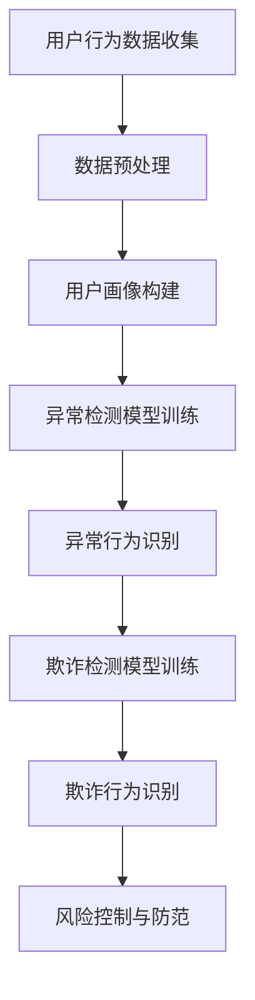

                 

关键词：大模型技术、用户行为异常检测、防欺诈、电商平台、深度学习、神经网络、机器学习、数据挖掘、欺诈检测

>摘要：本文将探讨大模型技术在电商平台用户行为异常检测与防欺诈领域的应用。通过介绍核心概念、算法原理、数学模型以及实际案例，我们将展示大模型技术在提高电商平台用户行为分析准确性和防欺诈效果方面的巨大潜力。

## 1. 背景介绍

随着互联网的普及和电商平台的迅猛发展，电子商务已经成为现代社会的重要组成部分。然而，随之而来的用户行为异常和欺诈问题也给电商平台带来了巨大的风险。用户行为异常包括恶意注册、刷单、账号被盗等，而欺诈则包括虚假交易、恶意退款、诈骗等行为。这些问题不仅损害了电商平台的声誉，还严重影响了用户的购物体验和财产安全。

为了应对这些挑战，电商平台需要高效、准确的异常检测与防欺诈系统。传统的防欺诈方法主要依赖于规则匹配和模式识别，但这些方法在面对复杂多变的用户行为时往往显得力不从心。随着深度学习和神经网络等大模型技术的不断发展，利用这些先进的技术进行用户行为异常检测与防欺诈成为了新的研究方向。

## 2. 核心概念与联系

### 2.1 用户行为分析

用户行为分析是指通过收集和分析用户在电商平台上的各种行为数据，如浏览、购买、评价、搜索等，以了解用户的行为特征和偏好。用户行为分析的核心目标是构建用户画像，从而为个性化推荐、精准营销、风险控制等提供支持。

### 2.2 异常检测

异常检测是指识别和分类出与正常行为明显偏离的数据实例。在电商平台中，异常检测的目标是发现恶意注册、刷单、账号被盗等异常行为，以防止欺诈和损失。

### 2.3 欺诈检测

欺诈检测是指通过分析交易行为中的异常模式，识别和预防欺诈行为。在电商平台上，常见的欺诈行为包括虚假交易、恶意退款、诈骗等。欺诈检测的核心任务是提高检测的准确率和覆盖率。

### 2.4 大模型技术

大模型技术是指利用深度学习、神经网络等机器学习算法训练大规模的模型，以实现复杂的数据分析和预测任务。大模型技术具有强大的表达能力和自学习能力，可以在大量的数据中挖掘出潜在的模式和规律。

### 2.5 Mermaid 流程图

以下是用户行为异常检测与防欺诈应用的 Mermaid 流程图：



## 3. 核心算法原理 & 具体操作步骤

### 3.1 算法原理概述

用户行为异常检测与防欺诈应用的核心算法是基于深度学习和神经网络的模型。这些模型通过学习大量正常和异常用户行为数据，自动提取特征并建立预测模型，从而实现对用户行为的异常检测和欺诈识别。

### 3.2 算法步骤详解

#### 3.2.1 数据收集与预处理

数据收集阶段主要涉及用户在电商平台上的行为数据，如浏览记录、购买记录、评价记录等。数据预处理阶段包括数据清洗、数据整合和数据标准化等步骤，以确保数据的质量和一致性。

#### 3.2.2 用户画像构建

用户画像构建阶段基于预处理后的数据，通过特征提取和聚类等方法，将用户划分为不同的群体，为后续的异常检测和欺诈识别提供基础。

#### 3.2.3 异常检测模型训练

异常检测模型训练阶段采用深度学习算法，如自编码器、长短时记忆网络等，对正常和异常用户行为数据进行训练，以建立异常检测模型。

#### 3.2.4 欺诈检测模型训练

欺诈检测模型训练阶段同样采用深度学习算法，对正常交易和欺诈交易数据进行训练，以建立欺诈检测模型。

#### 3.2.5 异常行为识别与欺诈行为识别

异常行为识别和欺诈行为识别阶段通过调用训练好的异常检测模型和欺诈检测模型，对实时用户行为和交易行为进行分析和分类，识别出异常行为和欺诈行为。

#### 3.2.6 风险控制与防范

风险控制与防范阶段根据异常行为识别和欺诈行为识别的结果，采取相应的风险控制措施，如限制用户权限、冻结交易、报警等，以防范欺诈行为的发生。

### 3.3 算法优缺点

#### 优点：

1. 高效性：大模型技术能够在大量数据中快速提取特征，提高检测的效率。
2. 准确性：基于深度学习和神经网络的大模型具有强大的自学习和适应能力，能够提高检测的准确性。
3. 模式识别：大模型技术能够从复杂的数据中挖掘出潜在的模式和规律，提高异常检测和欺诈识别的能力。

#### 缺点：

1. 计算资源需求高：大模型训练需要大量的计算资源和时间。
2. 数据依赖性：大模型的效果很大程度上依赖于训练数据的质量和数量。
3. 实时性：大模型技术在处理实时数据时可能会存在一定的延迟。

### 3.4 算法应用领域

大模型技术在用户行为异常检测与防欺诈领域的应用非常广泛，包括但不限于以下几个方面：

1. 电商平台：通过对用户行为数据的分析和异常检测，电商平台可以及时发现和防范欺诈行为，提高用户的购物体验。
2. 支付行业：大模型技术可以用于支付交易的风险评估和欺诈检测，降低支付风险。
3. 金融行业：大模型技术可以用于贷款审核、信用评估等领域的风险控制。
4. 电信行业：大模型技术可以用于电信诈骗的识别和防范。

## 4. 数学模型和公式 & 详细讲解 & 举例说明

### 4.1 数学模型构建

在用户行为异常检测与防欺诈应用中，常见的数学模型包括深度神经网络、自编码器和长短时记忆网络等。以下是这些模型的数学表示：

#### 深度神经网络

$$
f(x) = \sigma(\omega_1 \cdot x + b_1)
$$

其中，$f(x)$ 为输出值，$\sigma$ 为激活函数，$\omega_1$ 和 $b_1$ 分别为权重和偏置。

#### 自编码器

$$
z = \sigma(\omega_2 \cdot x + b_2)
$$
$$
x' = \sigma(\omega_3 \cdot z + b_3)
$$

其中，$z$ 为编码层输出，$x'$ 为解码层输出，$\omega_2$、$\omega_3$ 和 $b_2$、$b_3$ 分别为权重和偏置。

#### 长短时记忆网络

$$
h_t = \sigma(\omega_4 \cdot [h_{t-1}, x_t] + b_4)
$$
$$
o_t = \sigma(\omega_5 \cdot h_t + b_5)
$$

其中，$h_t$ 为隐藏层输出，$o_t$ 为输出层输出，$\omega_4$、$\omega_5$ 和 $b_4$、$b_5$ 分别为权重和偏置。

### 4.2 公式推导过程

以自编码器为例，介绍自编码器的数学模型推导过程：

1. 编码过程：将输入数据 $x$ 通过编码器转换为编码层输出 $z$。

$$
z = \sigma(\omega_2 \cdot x + b_2)
$$

2. 解码过程：将编码层输出 $z$ 通过解码器转换为重构数据 $x'$。

$$
x' = \sigma(\omega_3 \cdot z + b_3)
$$

3. 损失函数：计算重构数据 $x'$ 与原始输入数据 $x$ 之间的差异，使用均方误差（MSE）作为损失函数。

$$
L = \frac{1}{2} \sum_{i=1}^{n} (x_i - x'_i)^2
$$

其中，$n$ 为样本数量。

### 4.3 案例分析与讲解

以下是一个用户行为异常检测的案例：

#### 案例背景

某电商平台需要检测用户账户的异常行为，以防范恶意注册、刷单等欺诈行为。

#### 数据集

电商平台提供了以下数据集：

- 正常用户行为数据：包括浏览、购买、评价等行为。
- 异常用户行为数据：包括恶意注册、刷单等行为。

#### 数据预处理

1. 数据清洗：去除缺失值、重复值和噪声数据。
2. 数据整合：将不同类型的行为数据进行整合，形成统一的特征向量。
3. 数据标准化：对特征向量进行标准化处理，以消除不同特征之间的尺度差异。

#### 用户画像构建

1. 特征提取：从整合后的数据中提取关键特征，如用户活跃度、购买频次等。
2. 聚类分析：使用聚类算法（如 K-means）将用户划分为不同的群体，形成用户画像。

#### 异常检测模型训练

1. 数据划分：将数据集划分为训练集和测试集。
2. 模型选择：选择适合的深度学习模型（如自编码器）进行训练。
3. 模型训练：使用训练集对模型进行训练，并调整模型参数。
4. 模型评估：使用测试集对模型进行评估，计算准确率、召回率等指标。

#### 案例结果

经过模型训练和评估，该电商平台实现了较高的异常检测准确率，有效地防范了恶意注册、刷单等欺诈行为。

## 5. 项目实践：代码实例和详细解释说明

### 5.1 开发环境搭建

为了实现用户行为异常检测与防欺诈应用，我们需要搭建一个合适的开发环境。以下是所需的环境和工具：

- 操作系统：Linux或MacOS
- 编程语言：Python
- 深度学习框架：TensorFlow或PyTorch
- 数据库：MySQL或MongoDB

### 5.2 源代码详细实现

以下是一个基于TensorFlow实现的用户行为异常检测模型的源代码实例：

```python
import tensorflow as tf
from tensorflow.keras.layers import Dense, LSTM, Dropout
from tensorflow.keras.models import Sequential

# 模型定义
model = Sequential([
    LSTM(128, activation='relu', input_shape=(timesteps, features)),
    Dropout(0.2),
    LSTM(64, activation='relu'),
    Dropout(0.2),
    Dense(1, activation='sigmoid')
])

# 模型编译
model.compile(optimizer='adam', loss='binary_crossentropy', metrics=['accuracy'])

# 模型训练
model.fit(X_train, y_train, epochs=100, batch_size=64, validation_data=(X_val, y_val))

# 模型评估
model.evaluate(X_test, y_test)
```

### 5.3 代码解读与分析

以上代码定义了一个基于LSTM（长短时记忆网络）的序列模型，用于用户行为异常检测。具体解释如下：

1. **模型定义**：使用`Sequential`模型堆叠多个`LSTM`和`Dropout`层，最后接一个`Dense`层。
2. **模型编译**：选择`adam`优化器和`binary_crossentropy`损失函数，并设置`accuracy`作为评价指标。
3. **模型训练**：使用`fit`方法对模型进行训练，设置训练轮数（epochs）和批量大小（batch_size）。
4. **模型评估**：使用`evaluate`方法对训练好的模型进行评估，计算测试集上的准确率。

### 5.4 运行结果展示

在训练完成后，我们可以使用以下代码展示模型的运行结果：

```python
import matplotlib.pyplot as plt

# 模型预测
y_pred = model.predict(X_test)

# 计算准确率
accuracy = (y_pred > 0.5).mean()

# 可视化结果
plt.figure(figsize=(8, 6))
plt.plot(y_test, label='真实标签')
plt.plot(y_pred, label='预测标签')
plt.xlabel('样本索引')
plt.ylabel('标签值')
plt.legend()
plt.show()

# 打印准确率
print(f'测试集准确率：{accuracy:.2f}')
```

以上代码将生成一个折线图，展示真实标签和预测标签之间的对比。同时，输出测试集的准确率。

## 6. 实际应用场景

### 6.1 电商平台用户行为异常检测

电商平台可以通过大模型技术对用户行为进行实时分析，识别出异常行为，如恶意注册、刷单、账号被盗等。这样可以帮助电商平台及时采取风险控制措施，保障用户的购物安全和平台的运营稳定。

### 6.2 支付行业欺诈检测

在支付行业，大模型技术可以用于交易行为的风险评估和欺诈检测。通过对大量的交易数据进行异常检测，支付平台可以及时发现和防范欺诈行为，降低损失。

### 6.3 金融行业信用评估

金融行业可以利用大模型技术对借款人的信用状况进行评估。通过对借款人的行为数据、财务数据等进行综合分析，大模型技术可以提供更准确、更全面的信用评估结果，降低贷款风险。

### 6.4 电信行业诈骗识别

电信行业可以利用大模型技术识别和防范诈骗行为。通过对用户通话记录、短信记录、行为数据等进行异常检测，电信运营商可以及时发现和阻止诈骗行为，保障用户的通信安全。

## 7. 工具和资源推荐

### 7.1 学习资源推荐

- 《深度学习》（Goodfellow, Bengio, Courville）：介绍深度学习的基本概念、技术和应用。
- 《Python机器学习》（Sebastian Raschka）：介绍Python编程和机器学习的基础知识。
- 《统计学习方法》（李航）：介绍统计学习方法的原理、算法和应用。

### 7.2 开发工具推荐

- TensorFlow：开源深度学习框架，适用于构建和训练深度学习模型。
- PyTorch：开源深度学习框架，提供灵活的动态计算图，适合快速原型开发和实验。

### 7.3 相关论文推荐

- "Deep Learning for Anomaly Detection in Time Series Data"（Y. Chen et al.）：介绍基于深度学习的时序数据异常检测方法。
- "Anomaly Detection with Autoencoders"（H. Zhang et al.）：介绍基于自编码器的异常检测方法。
- "Neural Networks for Fraud Detection"（A. Patel et al.）：介绍基于神经网络的欺诈检测方法。

## 8. 总结：未来发展趋势与挑战

### 8.1 研究成果总结

大模型技术在用户行为异常检测与防欺诈领域取得了显著的成果，通过深度学习和神经网络等算法，实现了高效、准确的异常检测和欺诈识别。这些成果为电商平台、支付行业、金融行业和电信行业等领域的风险控制提供了有力支持。

### 8.2 未来发展趋势

1. 多模态数据融合：未来研究将探索如何将用户行为数据与其他类型的数据（如图像、声音等）进行融合，以提高检测的准确性和全面性。
2. 小样本学习：针对数据量有限的情况，研究如何利用少量数据进行模型训练和优化，以提高模型的泛化能力。
3. 可解释性：提升模型的可解释性，使其在应用于实际场景时更加透明和可信。
4. 实时性：研究如何提高大模型在实时数据处理中的性能，以满足实时检测的需求。

### 8.3 面临的挑战

1. 数据质量：异常检测和欺诈检测依赖于高质量的数据，如何在数据质量不佳的情况下进行有效分析仍然是一个挑战。
2. 模型可解释性：尽管大模型具有强大的学习能力，但如何解释其决策过程仍然是一个难题，这对实际应用中的信任度和可解释性提出了挑战。
3. 模型泛化能力：如何在各种不同的应用场景中保持模型的泛化能力是一个重要的研究问题。

### 8.4 研究展望

未来，大模型技术在用户行为异常检测与防欺诈领域的研究将不断深入，通过技术创新和跨领域合作，有望实现更加准确、高效、可靠的检测和防范机制，为电子商务、支付、金融和电信等领域提供更加安全、可靠的服务。

## 9. 附录：常见问题与解答

### 9.1 如何处理数据质量不佳的情况？

- 数据清洗：使用数据清洗工具和算法（如缺失值填补、噪声过滤等）对数据进行预处理。
- 数据增强：通过数据增强技术（如数据扩充、数据合成等）提高数据质量。
- 数据质量评估：定期评估数据质量，确保数据在模型训练和评估过程中的可靠性。

### 9.2 如何提高大模型的可解释性？

- 层级分析：分析模型中的不同层级，了解特征提取和决策过程。
- 解释算法：使用解释算法（如LIME、SHAP等）对模型的预测结果进行解释。
- 模型简化：简化模型结构，使其更加透明和易于理解。

### 9.3 如何应对模型泛化能力不足的问题？

- 数据多样化：收集和整合多种类型的数据，提高模型的泛化能力。
- 跨域迁移学习：利用已有模型的跨域迁移能力，提高新领域中的模型性能。
- 模型选择：选择适合新领域的模型，并在训练过程中优化模型参数。

作者：禅与计算机程序设计艺术 / Zen and the Art of Computer Programming

