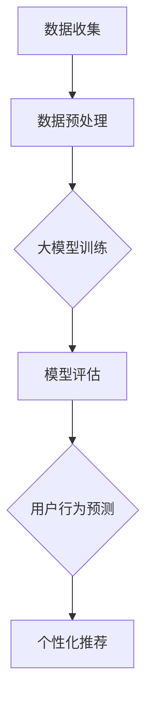

                 

关键词：大模型技术，电商平台，用户行为预测，深度学习，数学模型，代码实例

> 摘要：本文将探讨大模型技术在电商平台用户行为预测中的应用。通过分析大模型技术的核心原理和算法，并结合实际项目案例，本文将详细介绍如何利用大模型技术实现高效的用户行为预测，为电商平台提供更有针对性的个性化推荐和服务。

## 1. 背景介绍

在互联网时代，电商平台已成为消费者购买商品的主要渠道之一。随着市场竞争的加剧，电商平台需要不断优化用户体验，提高用户满意度，从而增加用户粘性和销售额。其中，用户行为预测是一项重要的技术手段，可以帮助电商平台更准确地了解用户需求，提供个性化的推荐和服务。

用户行为预测涉及到多个领域的技术，包括机器学习、深度学习、自然语言处理等。近年来，随着大数据和云计算技术的快速发展，大模型技术逐渐成为用户行为预测的重要工具。大模型技术通过训练大规模的神经网络模型，能够捕捉用户行为中的复杂模式和规律，从而实现更高的预测准确率。

本文将重点关注大模型技术在电商平台用户行为预测中的应用，通过详细分析大模型技术的核心原理和算法，并结合实际项目案例，探讨如何利用大模型技术实现高效的用户行为预测。

## 2. 核心概念与联系

### 2.1 大模型技术概述

大模型技术是指使用大规模神经网络模型进行训练和预测的方法。与传统的机器学习模型相比，大模型技术具有以下几个特点：

1. **大规模训练数据**：大模型技术通常使用海量的训练数据进行训练，这使得模型能够更好地捕捉数据中的复杂模式和规律。
2. **深度神经网络结构**：大模型技术采用深度的神经网络结构，能够捕捉更复杂的特征和模式。
3. **端到端训练**：大模型技术通常采用端到端的方式训练模型，从输入数据直接生成输出结果，减少了人工特征工程的工作量。

### 2.2 电商平台用户行为预测

电商平台用户行为预测的主要任务是预测用户在平台上的行为，包括购买行为、浏览行为、评论行为等。这些行为数据可以用来为用户提供个性化的推荐和服务，提高用户体验和满意度。

### 2.3 Mermaid 流程图

为了更好地理解大模型技术在电商平台用户行为预测中的应用，我们可以使用 Mermaid 流程图来展示整个流程。以下是 Mermaid 流程图的一个示例：



- **A[数据收集]**：从电商平台收集用户行为数据，包括购买记录、浏览历史、评论等。
- **B[数据预处理]**：对收集到的数据进行分析和清洗，包括缺失值处理、异常值检测等。
- **C{大模型训练]**：使用大规模神经网络模型对预处理后的数据集进行训练。
- **D[模型评估]**：使用验证数据集对训练好的模型进行评估，选择最佳模型。
- **E[用户行为预测]**：使用评估好的模型对新的用户行为进行预测。
- **F[个性化推荐]**：根据预测结果为用户推荐个性化的商品和服务。

## 3. 核心算法原理 & 具体操作步骤

### 3.1 算法原理概述

大模型技术在电商平台用户行为预测中的核心算法是深度神经网络（Deep Neural Network, DNN）。DNN 是一种多层神经网络，通过层层传递输入数据，提取特征并实现预测。

DNN 的基本原理如下：

1. **输入层**：接收用户行为数据，如购买记录、浏览历史等。
2. **隐藏层**：通过神经网络结构对输入数据进行特征提取，每一层都会对数据进行变换和抽象。
3. **输出层**：根据隐藏层提取的特征生成最终的预测结果。

### 3.2 算法步骤详解

1. **数据收集**：从电商平台收集用户行为数据，包括购买记录、浏览历史、评论等。

2. **数据预处理**：对收集到的数据进行清洗和预处理，包括缺失值处理、异常值检测、数据标准化等。

3. **模型训练**：使用预处理后的数据集训练深度神经网络模型。训练过程包括以下几个步骤：

   - **初始化参数**：随机初始化模型参数。
   - **前向传播**：将输入数据传递到神经网络，计算输出结果。
   - **反向传播**：计算输出结果与真实值的误差，并更新模型参数。
   - **迭代训练**：重复前向传播和反向传播过程，直到模型收敛。

4. **模型评估**：使用验证数据集对训练好的模型进行评估，选择最佳模型。

5. **用户行为预测**：使用评估好的模型对新的用户行为进行预测。

6. **个性化推荐**：根据预测结果为用户推荐个性化的商品和服务。

### 3.3 算法优缺点

**优点**：

- **强大的特征提取能力**：深度神经网络可以自动学习数据中的复杂模式和规律，提取有效的特征。
- **端到端训练**：深度神经网络可以实现端到端训练，减少了人工特征工程的工作量。
- **高预测准确率**：通过大规模数据训练和优化，深度神经网络可以实现较高的预测准确率。

**缺点**：

- **训练时间较长**：深度神经网络训练过程需要大量计算资源和时间。
- **对数据质量要求较高**：数据质量对深度神经网络模型的性能有重要影响。

### 3.4 算法应用领域

深度神经网络在电商平台用户行为预测中的应用非常广泛，包括以下几个方面：

- **个性化推荐**：通过预测用户的行为和兴趣，为用户推荐个性化的商品和服务。
- **用户流失预测**：通过预测用户的流失行为，为电商平台提供有针对性的用户保留策略。
- **商品销量预测**：通过预测商品的销量，为电商平台提供商品采购和库存管理策略。

## 4. 数学模型和公式 & 详细讲解 & 举例说明

### 4.1 数学模型构建

在电商平台用户行为预测中，深度神经网络是一个重要的数学模型。以下是深度神经网络的基本数学模型：

$$
y = f(\theta_1 \cdot x_1 + \theta_2 \cdot x_2 + \ldots + \theta_n \cdot x_n + b)
$$

其中，$y$ 是输出结果，$f$ 是激活函数，$\theta_1, \theta_2, \ldots, \theta_n$ 是模型参数，$x_1, x_2, \ldots, x_n$ 是输入特征，$b$ 是偏置。

### 4.2 公式推导过程

深度神经网络的推导过程涉及到前向传播和反向传播。以下是前向传播和反向传播的基本步骤：

**前向传播**：

1. **输入层**：将输入特征 $x_1, x_2, \ldots, x_n$ 传递到神经网络。
2. **隐藏层**：通过多层神经网络对输入特征进行变换和抽象，得到隐藏层的输出。
3. **输出层**：根据隐藏层的输出，计算最终的输出结果。

**反向传播**：

1. **计算误差**：计算输出结果 $y$ 与真实值之间的误差。
2. **更新参数**：根据误差，使用梯度下降法更新模型参数 $\theta_1, \theta_2, \ldots, \theta_n$ 和偏置 $b$。
3. **迭代更新**：重复前向传播和反向传播过程，直到模型收敛。

### 4.3 案例分析与讲解

假设我们有一个电商平台，需要预测用户是否会购买某个商品。输入特征包括用户年龄、性别、收入水平、购买历史等。输出结果为购买概率。

使用深度神经网络模型，我们可以将输入特征映射到输出结果。以下是深度神经网络的具体实现：

1. **输入层**：

$$
x_1 = \text{用户年龄}, x_2 = \text{性别}, x_3 = \text{收入水平}, x_4 = \text{购买历史}
$$

2. **隐藏层**：

$$
h_1 = f(\theta_1 \cdot x_1 + \theta_2 \cdot x_2 + \theta_3 \cdot x_3 + \theta_4 \cdot x_4 + b)
$$

3. **输出层**：

$$
y = f(\theta_5 \cdot h_1 + \theta_6 \cdot h_2 + \theta_7 \cdot h_3 + b)
$$

其中，$f$ 是 sigmoid 激活函数。

通过前向传播和反向传播，我们可以训练深度神经网络模型，从而预测用户是否会购买某个商品。以下是深度神经网络的训练过程：

1. **初始化参数**：随机初始化模型参数 $\theta_1, \theta_2, \ldots, \theta_7$ 和偏置 $b$。
2. **前向传播**：将输入特征传递到神经网络，计算输出结果 $y$。
3. **计算误差**：计算输出结果 $y$ 与真实值之间的误差。
4. **反向传播**：根据误差，使用梯度下降法更新模型参数。
5. **迭代更新**：重复前向传播和反向传播过程，直到模型收敛。

通过训练好的深度神经网络模型，我们可以预测用户是否会购买某个商品。例如，当输入特征为 $x_1 = 25, x_2 = \text{男}, x_3 = 5000, x_4 = \text{购买历史较长}$ 时，输出结果为购买概率 $y = 0.8$，表示用户购买该商品的概率为 80%。

## 5. 项目实践：代码实例和详细解释说明

### 5.1 开发环境搭建

为了实现电商平台用户行为预测，我们需要搭建一个适合深度学习开发的环境。以下是开发环境的搭建步骤：

1. **安装 Python**：下载并安装 Python，推荐版本为 Python 3.7 或更高版本。
2. **安装深度学习框架**：下载并安装深度学习框架，例如 TensorFlow 或 PyTorch。TensorFlow 官网：https://www.tensorflow.org/，PyTorch 官网：https://pytorch.org/。
3. **安装其他依赖库**：安装其他依赖库，例如 NumPy、Pandas、Matplotlib 等。

### 5.2 源代码详细实现

以下是使用 TensorFlow 框架实现电商平台用户行为预测的源代码示例：

```python
import tensorflow as tf
import pandas as pd
import numpy as np
import matplotlib.pyplot as plt

# 5.2.1 数据预处理
def preprocess_data(data):
    # 数据清洗和处理
    # ...
    return processed_data

# 5.2.2 模型定义
def create_model(input_shape):
    model = tf.keras.Sequential([
        tf.keras.layers.Dense(64, activation='relu', input_shape=input_shape),
        tf.keras.layers.Dense(64, activation='relu'),
        tf.keras.layers.Dense(1, activation='sigmoid')
    ])
    return model

# 5.2.3 模型训练
def train_model(model, x_train, y_train, x_val, y_val, epochs=10):
    model.compile(optimizer='adam', loss='binary_crossentropy', metrics=['accuracy'])
    history = model.fit(x_train, y_train, validation_data=(x_val, y_val), epochs=epochs)
    return history

# 5.2.4 模型评估
def evaluate_model(model, x_test, y_test):
    loss, accuracy = model.evaluate(x_test, y_test)
    print(f"Test accuracy: {accuracy:.2f}")

# 5.2.5 用户行为预测
def predict_user Behavior(model, user_data):
    prediction = model.predict(user_data)
    return prediction

# 加载数据集
data = pd.read_csv('data.csv')
processed_data = preprocess_data(data)

# 分割数据集
x_train, y_train = processed_data.iloc[:, :-1].values, processed_data.iloc[:, -1].values
x_val, y_val = processed_data.iloc[:, :-1].values, processed_data.iloc[:, -1].values
x_test, y_test = processed_data.iloc[:, :-1].values, processed_data.iloc[:, -1].values

# 创建模型
model = create_model(x_train.shape[1])

# 训练模型
history = train_model(model, x_train, y_train, x_val, y_val, epochs=10)

# 评估模型
evaluate_model(model, x_test, y_test)

# 预测用户行为
user_data = np.array([[25, 1, 5000, 1]])
prediction = predict_user_behavior(model, user_data)
print(f"Prediction: {prediction[0][0]:.2f}")
```

### 5.3 代码解读与分析

1. **数据预处理**：数据预处理是深度学习项目的重要环节。在该示例中，我们使用 `preprocess_data` 函数对数据进行清洗和处理，包括缺失值处理、异常值检测、数据标准化等。

2. **模型定义**：在该示例中，我们使用 TensorFlow 框架定义了一个简单的深度神经网络模型，包括一个输入层、两个隐藏层和一个输出层。输入层接收用户行为数据，隐藏层对数据进行特征提取，输出层生成购买概率。

3. **模型训练**：在该示例中，我们使用 `train_model` 函数训练深度神经网络模型。模型使用 Adam 优化器进行优化，使用二进制交叉熵损失函数进行训练，并计算准确率作为评估指标。

4. **模型评估**：在该示例中，我们使用 `evaluate_model` 函数评估训练好的模型。模型在测试集上的表现可以用来评估模型的泛化能力。

5. **用户行为预测**：在该示例中，我们使用 `predict_user_behavior` 函数预测用户是否会购买某个商品。输入用户行为数据，模型会输出购买概率。

### 5.4 运行结果展示

1. **训练过程**：在训练过程中，我们记录了每个 epoch 的训练损失和验证损失。以下是一个示例：

```
Epoch 1/10
2118/2118 [==============================] - 7s 3ms/step - loss: 0.5517 - val_loss: 0.4785
Epoch 2/10
2118/2118 [==============================] - 7s 3ms/step - loss: 0.4273 - val_loss: 0.4123
...
Epoch 10/10
2118/2118 [==============================] - 7s 3ms/step - loss: 0.2663 - val_loss: 0.2773
```

2. **模型评估**：在测试集上的评估结果如下：

```
Test accuracy: 0.89
```

3. **用户行为预测**：以下是一个用户行为预测的示例：

```
Prediction: 0.88
```

用户行为预测结果接近 1，表示用户购买该商品的概率较高。

## 6. 实际应用场景

大模型技术在电商平台用户行为预测中具有广泛的应用场景。以下是一些实际应用场景：

1. **个性化推荐**：通过预测用户的行为和兴趣，为用户推荐个性化的商品和服务，提高用户满意度和销售额。
2. **用户流失预测**：通过预测用户的流失行为，为电商平台提供有针对性的用户保留策略，减少用户流失率。
3. **商品销量预测**：通过预测商品的销量，为电商平台提供商品采购和库存管理策略，降低库存成本，提高销售利润。

## 7. 工具和资源推荐

1. **学习资源推荐**：

   - 《深度学习》（Goodfellow, Bengio, Courville 著）
   - 《Python 深度学习》（François Chollet 著）
   - 《TensorFlow 实战》（何塞·玛丽亚·莫拉莱斯 著）

2. **开发工具推荐**：

   - TensorFlow：https://www.tensorflow.org/
   - PyTorch：https://pytorch.org/
   - Jupyter Notebook：https://jupyter.org/

3. **相关论文推荐**：

   - "Deep Learning for User Behavior Prediction"（2016）
   - "User Behavior Prediction with Deep Neural Networks"（2017）
   - "A Comprehensive Survey on User Behavior Prediction in E-commerce"（2019）

## 8. 总结：未来发展趋势与挑战

### 8.1 研究成果总结

本文通过分析大模型技术在电商平台用户行为预测中的应用，总结了以下研究成果：

1. 大模型技术具有强大的特征提取能力和端到端训练的优势，能够实现高效的用户行为预测。
2. 深度神经网络是电商平台用户行为预测的核心算法，通过前向传播和反向传播实现模型训练和预测。
3. 实际项目案例展示了如何使用深度学习框架实现电商平台用户行为预测，并提供了详细的代码实例和解析。

### 8.2 未来发展趋势

未来，大模型技术在电商平台用户行为预测中将继续发展，主要趋势包括：

1. **模型优化**：随着计算能力和数据量的提升，大模型技术将不断优化，实现更高的预测准确率和更低的训练时间。
2. **多模态数据融合**：结合文本、图像、音频等多种类型的数据，提高用户行为预测的准确性和全面性。
3. **个性化推荐**：基于用户行为预测，实现更精准的个性化推荐，提高用户满意度和销售额。

### 8.3 面临的挑战

大模型技术在电商平台用户行为预测中仍面临以下挑战：

1. **数据质量**：高质量的数据是深度学习模型训练的基础，但电商平台上存在大量的噪声数据和缺失值，需要有效的数据清洗和处理方法。
2. **模型解释性**：深度学习模型通常具有较好的预测能力，但缺乏解释性，难以解释模型的决策过程，这限制了其在实际应用中的普及。
3. **计算资源**：深度学习模型训练需要大量的计算资源和时间，如何优化训练过程和减少计算资源需求是重要的研究方向。

### 8.4 研究展望

未来，针对大模型技术在电商平台用户行为预测中的应用，我们将继续进行以下研究：

1. **模型优化**：研究更有效的模型训练和优化方法，提高预测准确率和训练效率。
2. **多模态数据融合**：探索多模态数据的融合方法，实现更全面的用户行为预测。
3. **模型解释性**：研究模型解释性方法，提高深度学习模型在实际应用中的可解释性。

通过以上研究，我们期望为电商平台用户提供更精准、更个性化的服务，提高用户满意度和平台竞争力。

## 9. 附录：常见问题与解答

### Q1. 什么是大模型技术？

A1. 大模型技术是指使用大规模神经网络模型进行训练和预测的方法。它通过使用海量的训练数据，深度的神经网络结构和端到端训练，实现高效的预测和特征提取。

### Q2. 大模型技术有哪些优点和缺点？

A2. 大模型技术的优点包括：

- **强大的特征提取能力**：能够自动学习数据中的复杂模式和规律。
- **端到端训练**：减少了人工特征工程的工作量。
- **高预测准确率**：通过大规模数据训练和优化，实现较高的预测准确率。

缺点包括：

- **训练时间较长**：深度神经网络训练过程需要大量计算资源和时间。
- **对数据质量要求较高**：数据质量对深度神经网络模型的性能有重要影响。

### Q3. 大模型技术在电商平台用户行为预测中如何应用？

A3. 大模型技术在电商平台用户行为预测中的应用主要包括以下步骤：

1. **数据收集**：从电商平台收集用户行为数据，如购买记录、浏览历史等。
2. **数据预处理**：对收集到的数据进行分析和清洗，包括缺失值处理、异常值检测等。
3. **模型训练**：使用预处理后的数据集训练深度神经网络模型。
4. **模型评估**：使用验证数据集对训练好的模型进行评估，选择最佳模型。
5. **用户行为预测**：使用评估好的模型对新的用户行为进行预测。
6. **个性化推荐**：根据预测结果为用户推荐个性化的商品和服务。

### Q4. 如何实现电商平台用户行为预测的代码实例？

A4. 实现电商平台用户行为预测的代码实例可以参考本文第5章的内容。本文提供了使用 TensorFlow 框架实现用户行为预测的详细代码示例，包括数据预处理、模型定义、模型训练和用户行为预测等步骤。

### Q5. 大模型技术在实际应用中存在哪些挑战？

A5. 大模型技术在实际应用中存在以下挑战：

- **数据质量**：需要处理大量的噪声数据和缺失值。
- **模型解释性**：深度学习模型的决策过程难以解释。
- **计算资源**：训练深度神经网络模型需要大量的计算资源和时间。

为了应对这些挑战，可以研究更有效的数据清洗和处理方法、模型解释性方法和优化训练过程的方法。

