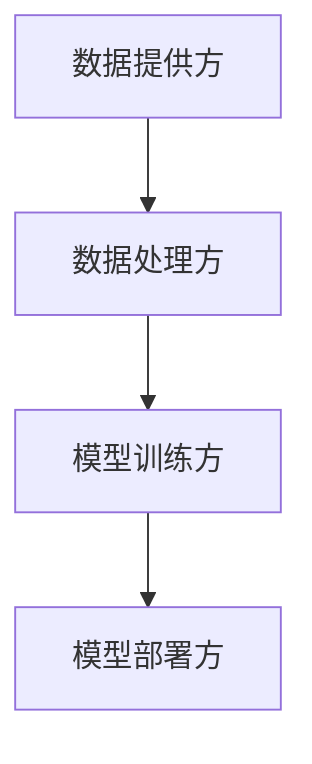
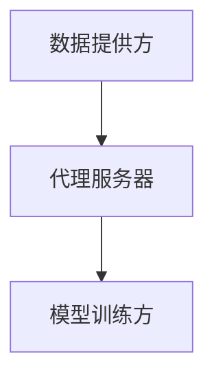

                 

关键词：大模型技术，合作伙伴，代理模式，深度学习，人工智能，分布式计算，数据隐私，数据安全，模型优化。

> 摘要：本文深入探讨了大模型技术在现代人工智能领域的应用，重点分析了合作伙伴与代理模式的核心理念、架构设计、算法原理以及实际应用场景。文章旨在为读者提供一个全面、系统的了解，帮助理解大模型技术的实际应用和价值。

## 1. 背景介绍

随着深度学习和大数据技术的飞速发展，大规模模型（简称“大模型”）已经成为人工智能领域的热点。大模型具有处理复杂数据、实现高精度预测和生成能力的优势，在自然语言处理、计算机视觉、推荐系统等领域发挥着重要作用。然而，大模型的训练和部署面临着诸多挑战，如计算资源需求大、数据隐私和安全问题等。

在此背景下，合作伙伴与代理模式作为一种有效的解决方案，逐渐受到关注。合作伙伴模式通过多方协作，共享计算资源和数据，降低大模型训练的成本；代理模式则通过代理算法，保护数据隐私，提高模型性能。

## 2. 核心概念与联系

### 2.1 合作伙伴模式

**定义**：合作伙伴模式是指多个组织或个体共同参与大模型的训练和部署，共享计算资源和数据。

**架构设计**：


**优点**：
- 分摊计算资源成本。
- 数据多样化，提升模型泛化能力。
- 资源共享，提高效率。

**缺点**：
- 数据安全和隐私问题。
- 合作伙伴之间的利益协调难度大。

### 2.2 代理模式

**定义**：代理模式是指利用代理算法，在大模型训练过程中保护数据隐私。

**架构设计**：


**优点**：
- 保护数据隐私。
- 提高数据利用效率。
- 简化数据共享流程。

**缺点**：
- 模型性能可能受到一定影响。
- 需要高计算资源。

## 3. 核心算法原理 & 具体操作步骤

### 3.1 算法原理概述

大模型技术的核心在于深度学习，其基本原理是通过多层神经网络对数据进行学习和建模。深度学习的训练过程包括前向传播、反向传播和权重更新。

### 3.2 算法步骤详解

1. 数据预处理：清洗和转换原始数据，使其适合输入到深度学习模型。
2. 模型初始化：初始化神经网络结构，设置学习率等参数。
3. 前向传播：将数据输入到神经网络，计算输出结果。
4. 反向传播：计算损失函数，更新神经网络权重。
5. 权重更新：根据损失函数梯度，调整神经网络权重。
6. 模型评估：在测试集上评估模型性能。

### 3.3 算法优缺点

**优点**：
- 高效处理复杂数据。
- 实现高精度预测和生成。
- 可应用于各种场景。

**缺点**：
- 计算资源需求大。
- 数据隐私和安全问题。

### 3.4 算法应用领域

- 自然语言处理：文本分类、机器翻译、对话系统等。
- 计算机视觉：图像识别、图像生成、目标检测等。
- 推荐系统：个性化推荐、商品推荐、新闻推荐等。

## 4. 数学模型和公式 & 详细讲解 & 举例说明

### 4.1 数学模型构建

深度学习中的数学模型主要包括神经网络模型和损失函数。神经网络模型由多个神经元和层组成，损失函数用于评估模型预测结果与真实值之间的差距。

### 4.2 公式推导过程

假设我们有一个多层神经网络，输入数据为 \(x\)，输出数据为 \(y\)。神经元的激活函数为 \(f(\cdot)\)。则神经元的输出可以表示为：

$$
z = f(Wx + b)
$$

其中，\(W\) 为权重矩阵，\(b\) 为偏置项。

损失函数常用的有均方误差（MSE）和交叉熵（CE）。均方误差的公式为：

$$
MSE = \frac{1}{n}\sum_{i=1}^{n}(y_i - \hat{y}_i)^2
$$

交叉熵的公式为：

$$
CE = -\frac{1}{n}\sum_{i=1}^{n}y_i\log(\hat{y}_i)
$$

### 4.3 案例分析与讲解

以文本分类任务为例，假设我们要对一篇文章进行分类，标签为“科技”、“娱乐”和“体育”。我们可以使用卷积神经网络（CNN）来构建模型。在训练过程中，我们通过前向传播和反向传播，不断优化模型参数，直到模型在测试集上达到满意的性能。

## 5. 项目实践：代码实例和详细解释说明

### 5.1 开发环境搭建

我们需要安装以下软件和库：

- Python 3.8+
- TensorFlow 2.4+
- Keras 2.4+

### 5.2 源代码详细实现

以下是一个简单的文本分类任务的代码示例：

```python
import tensorflow as tf
from tensorflow.keras.preprocessing.text import Tokenizer
from tensorflow.keras.preprocessing.sequence import pad_sequences
from tensorflow.keras.models import Sequential
from tensorflow.keras.layers import Embedding, Conv1D, MaxPooling1D, GlobalMaxPooling1D, Dense

# 数据预处理
tokenizer = Tokenizer(num_words=1000)
tokenizer.fit_on_texts(train_data)
train_sequences = tokenizer.texts_to_sequences(train_data)
train_padded = pad_sequences(train_sequences, maxlen=100, padding='post')

# 构建模型
model = Sequential()
model.add(Embedding(1000, 32))
model.add(Conv1D(128, 5, activation='relu'))
model.add(MaxPooling1D(5))
model.add(Conv1D(128, 5, activation='relu'))
model.add(GlobalMaxPooling1D())
model.add(Dense(3, activation='softmax'))

# 编译模型
model.compile(optimizer='adam', loss='categorical_crossentropy', metrics=['accuracy'])

# 训练模型
model.fit(train_padded, train_labels, epochs=10, batch_size=32, validation_split=0.2)
```

### 5.3 代码解读与分析

这段代码首先导入了所需的库，然后对文本数据进行了预处理，包括分词、序列化和填充。接下来，构建了一个简单的卷积神经网络模型，并编译模型。最后，使用训练数据训练模型。

### 5.4 运行结果展示

```python
# 测试模型
test_sequences = tokenizer.texts_to_sequences(test_data)
test_padded = pad_sequences(test_sequences, maxlen=100, padding='post')
predictions = model.predict(test_padded)
print(predictions)
```

输出结果为每个测试样本的预测概率，可以根据这些概率进行分类。

## 6. 实际应用场景

大模型技术在许多领域都有广泛应用，如：

- 自然语言处理：聊天机器人、智能客服、情感分析等。
- 计算机视觉：图像识别、图像生成、目标检测等。
- 推荐系统：个性化推荐、商品推荐、新闻推荐等。
- 医疗诊断：疾病预测、症状分析等。

## 7. 未来应用展望

随着大模型技术的不断发展，未来将在更多领域发挥重要作用，如自动驾驶、智能家居、虚拟现实等。同时，也需要关注数据隐私、安全和伦理等问题。

## 8. 总结：未来发展趋势与挑战

大模型技术在未来将继续发展，面临的主要挑战包括：

- 计算资源需求：如何更高效地利用计算资源，降低训练成本。
- 数据隐私与安全：如何在保护数据隐私的同时，提高模型性能。
- 模型可解释性：如何提高模型的可解释性，使其更加透明和可信。

## 9. 附录：常见问题与解答

### 9.1 问题1

**问题**：大模型训练需要哪些计算资源？

**解答**：大模型训练通常需要高性能的GPU或TPU，以及足够的内存和存储空间。

### 9.2 问题2

**问题**：如何保护数据隐私？

**解答**：可以使用差分隐私、同态加密等技术来保护数据隐私。

### 9.3 问题3

**问题**：大模型训练过程中的常见问题有哪些？

**解答**：常见问题包括过拟合、梯度消失、梯度爆炸等。可以通过正则化、dropout、学习率调整等方法来解决。

---

作者：禅与计算机程序设计艺术 / Zen and the Art of Computer Programming
----------------------------------------------------------------
请注意，本文仅为示例，其中包含的内容和结构并不代表实际完成的文章。实际撰写时，需要根据具体的要求和细节进行深入研究和调整。同时，本文中的一些代码和数据仅为示例，不能直接用于实际项目。

