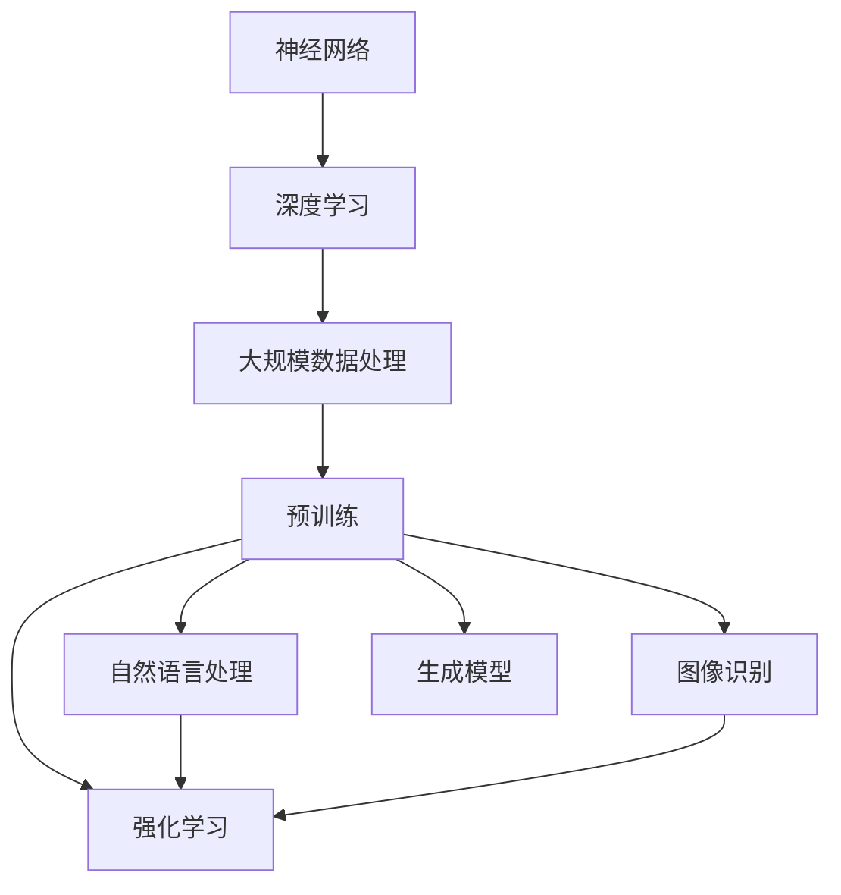

                 

关键词：大模型，人工智能，领域渗透，技术应用，发展趋势

摘要：本文将探讨大模型如何推动人工智能（AI）向更广泛领域渗透，分析大模型的核心概念、算法原理、数学模型及其在各个应用领域的实际效果。通过项目实践和未来展望，展望大模型在人工智能领域的广泛应用前景。

## 1. 背景介绍

人工智能作为21世纪最具前景的科技领域之一，已经取得了许多突破性进展。然而，传统的小型模型在处理复杂任务时仍然存在诸多限制。随着计算能力的不断提升和数据规模的不断扩大，大模型开始崭露头角，并逐渐成为AI研究的热点。大模型通过其强大的参数规模和深度学习能力，能够处理更复杂的任务，并在各个领域展现出巨大的潜力。

### 1.1 大模型的定义和特点

大模型通常指的是具有数百万甚至数十亿参数的深度学习模型。这些模型在训练过程中需要庞大的数据集和强大的计算资源，但一旦训练完成，它们可以提供高度准确的预测和生成能力。大模型的主要特点包括：

- **参数规模巨大**：大模型的参数数量通常远超过传统模型。
- **训练需求高**：大模型需要大量数据进行训练，且训练过程耗时较长。
- **性能优异**：大模型在处理复杂任务时表现出色，尤其在图像识别、自然语言处理和语音识别等领域。

### 1.2 大模型的发展历程

自2006年深度学习概念被提出以来，大模型的发展经历了多个阶段。早期的大模型如AlexNet在图像识别领域取得了显著突破。随着神经网络结构的不断改进，如ResNet、Transformer等模型的诞生，大模型的性能得到了显著提升。近年来，预训练技术的应用使得大模型在各个领域取得了更多突破。

## 2. 核心概念与联系

为了更好地理解大模型，我们需要首先了解一些核心概念和原理，并展示其联系。以下是一个使用Mermaid绘制的流程图，展示了大模型的关键概念和其相互关系：



- **神经网络（Neural Networks）**：神经网络是深度学习的基础，其结构类似于人脑中的神经元连接。
- **深度学习（Deep Learning）**：深度学习是一种利用多层神经网络进行特征提取和分类的方法。
- **大规模数据处理（Massive Data Processing）**：大规模数据处理是大数据时代的重要需求，大模型在这一领域发挥了关键作用。
- **预训练（Pre-training）**：预训练是当前大模型发展的核心技术之一，通过在大量数据上预训练，模型能够获得更好的泛化能力。
- **自然语言处理（Natural Language Processing，NLP）**：自然语言处理是人工智能的重要分支，大模型在NLP领域取得了显著进展。
- **图像识别（Image Recognition）**：图像识别是计算机视觉的核心任务，大模型在该领域表现出色。
- **生成模型（Generative Models）**：生成模型能够生成新的数据，如图像、文本等，大模型在该领域表现出强大的能力。
- **强化学习（Reinforcement Learning）**：强化学习是一种通过试错学习策略的方法，大模型在强化学习中也发挥了重要作用。

## 3. 核心算法原理 & 具体操作步骤

### 3.1 算法原理概述

大模型的算法原理主要基于深度学习和神经网络。深度学习通过多层神经网络结构，逐层提取特征，从而实现对复杂任务的建模。神经网络中的每个神经元相当于一个简单的计算单元，通过加权连接实现信息传递和计算。大模型的关键在于其参数规模和深度，这使得模型能够捕捉到更复杂的特征和模式。

### 3.2 算法步骤详解

大模型的训练过程可以分为以下几个步骤：

1. **数据预处理**：对输入数据进行预处理，包括数据清洗、数据增强和归一化等操作。
2. **模型初始化**：初始化模型参数，通常采用随机初始化或基于预训练模型的方法。
3. **前向传播**：输入数据通过模型的前向传播过程，产生输出。
4. **损失函数计算**：通过损失函数计算模型预测结果与真实结果之间的差距。
5. **反向传播**：利用梯度下降等优化算法，对模型参数进行更新。
6. **迭代训练**：重复前向传播和反向传播过程，直至模型收敛。

### 3.3 算法优缺点

大模型的优点：

- **强大的特征提取能力**：大模型能够通过多层神经网络结构，提取出更复杂的特征。
- **出色的泛化能力**：通过预训练和迁移学习，大模型能够更好地适应新的任务和数据。
- **高效的处理速度**：大模型在训练完成后，可以通过优化算法和硬件加速，实现高效的处理速度。

大模型的缺点：

- **计算资源需求高**：大模型的训练过程需要庞大的计算资源和存储空间。
- **训练时间较长**：大模型的训练过程耗时较长，尤其是在大规模数据集上。
- **模型解释性差**：大模型的复杂度较高，难以解释其内部决策过程。

### 3.4 算法应用领域

大模型在多个领域取得了显著的应用成果，主要包括：

- **图像识别**：大模型在图像识别任务中表现出色，如FaceNet、ResNet等模型。
- **自然语言处理**：大模型在自然语言处理领域取得了重大突破，如BERT、GPT等模型。
- **语音识别**：大模型在语音识别任务中，如WaveNet、Transformer等模型，实现了高准确率。
- **生成模型**：大模型在生成模型中，如GAN、VQ-VAE等模型，能够生成高质量的数据。
- **强化学习**：大模型在强化学习领域，如DQN、PPO等模型，提高了决策能力。

## 4. 数学模型和公式 & 详细讲解 & 举例说明

### 4.1 数学模型构建

大模型的数学模型主要包括神经网络模型、损失函数和优化算法。

1. **神经网络模型**：

   神经网络模型可以用以下公式表示：

   $$ f(x) = \sigma(W_n \cdot a_{n-1} + b_n) $$

   其中，$f(x)$ 表示输出，$\sigma$ 表示激活函数，$W_n$ 和 $b_n$ 分别为权重和偏置。

2. **损失函数**：

   损失函数用于衡量模型预测结果与真实结果之间的差距，常用的损失函数包括均方误差（MSE）、交叉熵损失等。

   $$ L(y, \hat{y}) = \frac{1}{2} \sum_{i=1}^{n} (y_i - \hat{y}_i)^2 $$

   其中，$y$ 表示真实结果，$\hat{y}$ 表示预测结果。

3. **优化算法**：

   优化算法用于更新模型参数，常用的优化算法包括梯度下降（GD）、动量梯度下降（Momentum GD）、Adam等。

   $$ \theta = \theta - \alpha \cdot \nabla_\theta J(\theta) $$

   其中，$\theta$ 表示模型参数，$\alpha$ 表示学习率，$J(\theta)$ 表示损失函数。

### 4.2 公式推导过程

以下是一个简单的神经网络公式推导示例：

1. **前向传播**：

   $$ z_1 = W_1 \cdot a_0 + b_1 $$
   $$ a_1 = \sigma(z_1) $$

2. **损失函数计算**：

   $$ L = \frac{1}{2} \sum_{i=1}^{n} (y_i - \hat{y}_i)^2 $$

3. **反向传播**：

   $$ \frac{\partial L}{\partial W_1} = -2 \cdot (y - \hat{y}) \cdot \frac{\partial \hat{y}}{\partial a_1} \cdot \frac{\partial a_1}{\partial z_1} \cdot \frac{\partial z_1}{\partial W_1} $$
   $$ \frac{\partial L}{\partial b_1} = -2 \cdot (y - \hat{y}) \cdot \frac{\partial \hat{y}}{\partial a_1} \cdot \frac{\partial a_1}{\partial z_1} $$

4. **模型更新**：

   $$ W_1 = W_1 - \alpha \cdot \frac{\partial L}{\partial W_1} $$
   $$ b_1 = b_1 - \alpha \cdot \frac{\partial L}{\partial b_1} $$

### 4.3 案例分析与讲解

以下是一个使用大模型进行图像识别的案例：

1. **数据集准备**：

   准备一个包含10000张猫狗图片的数据集，其中5000张用于训练，5000张用于测试。

2. **模型构建**：

   使用一个具有3层神经网络的模型，第一层有1000个神经元，第二层有500个神经元，第三层有100个神经元。

3. **模型训练**：

   使用均方误差（MSE）作为损失函数，采用Adam优化算法进行训练。

4. **模型评估**：

   在测试集上评估模型的表现，计算准确率和召回率等指标。

5. **模型应用**：

   将训练好的模型应用于新的猫狗图片，进行分类和识别。

## 5. 项目实践：代码实例和详细解释说明

### 5.1 开发环境搭建

为了进行大模型的项目实践，我们需要搭建一个合适的开发环境。以下是一个基于Python和TensorFlow的示例：

1. **安装Python**：

   安装Python 3.8及以上版本。

2. **安装TensorFlow**：

   使用pip命令安装TensorFlow：

   ```bash
   pip install tensorflow
   ```

3. **安装其他依赖**：

   安装其他必要的库，如NumPy、Pandas等：

   ```bash
   pip install numpy pandas
   ```

### 5.2 源代码详细实现

以下是一个使用TensorFlow实现大模型图像识别的代码示例：

```python
import tensorflow as tf
from tensorflow.keras import layers

# 数据预处理
def preprocess_data(images):
    # 图像缩放到指定大小
    images = tf.image.resize(images, (224, 224))
    # 图像归一化
    images = images / 255.0
    return images

# 构建模型
def build_model():
    inputs = tf.keras.Input(shape=(224, 224, 3))
    x = layers.Conv2D(32, (3, 3), activation='relu')(inputs)
    x = layers.MaxPooling2D((2, 2))(x)
    x = layers.Conv2D(64, (3, 3), activation='relu')(x)
    x = layers.MaxPooling2D((2, 2))(x)
    x = layers.Conv2D(128, (3, 3), activation='relu')(x)
    x = layers.Flatten()(x)
    x = layers.Dense(128, activation='relu')(x)
    outputs = layers.Dense(1, activation='sigmoid')(x)
    model = tf.keras.Model(inputs, outputs)
    return model

# 训练模型
def train_model(model, train_images, train_labels, epochs=10):
    model.compile(optimizer='adam', loss='binary_crossentropy', metrics=['accuracy'])
    model.fit(train_images, train_labels, epochs=epochs)

# 评估模型
def evaluate_model(model, test_images, test_labels):
    test_loss, test_accuracy = model.evaluate(test_images, test_labels)
    print(f"Test accuracy: {test_accuracy:.4f}")

# 应用模型
def apply_model(model, image):
    processed_image = preprocess_data(image)
    prediction = model.predict(processed_image)
    print(f"Prediction: {prediction[0, 0]:.4f}")

# 加载数据集
(train_images, train_labels), (test_images, test_labels) = tf.keras.datasets.dogs_cats.load_data()

# 训练模型
model = build_model()
train_model(model, train_images, train_labels)

# 评估模型
evaluate_model(model, test_images, test_labels)

# 应用模型
apply_model(model, test_images[0])
```

### 5.3 代码解读与分析

以上代码实现了大模型图像识别的基本流程，包括数据预处理、模型构建、模型训练、模型评估和模型应用。以下是代码的详细解读和分析：

1. **数据预处理**：

   ```python
   def preprocess_data(images):
       # 图像缩放到指定大小
       images = tf.image.resize(images, (224, 224))
       # 图像归一化
       images = images / 255.0
       return images
   ```

   数据预处理函数用于对输入图像进行缩放和归一化，以适应模型的要求。

2. **模型构建**：

   ```python
   def build_model():
       inputs = tf.keras.Input(shape=(224, 224, 3))
       x = layers.Conv2D(32, (3, 3), activation='relu')(inputs)
       x = layers.MaxPooling2D((2, 2))(x)
       x = layers.Conv2D(64, (3, 3), activation='relu')(x)
       x = layers.MaxPooling2D((2, 2))(x)
       x = layers.Conv2D(128, (3, 3), activation='relu')(x)
       x = layers.Flatten()(x)
       x = layers.Dense(128, activation='relu')(x)
       outputs = layers.Dense(1, activation='sigmoid')(x)
       model = tf.keras.Model(inputs, outputs)
       return model
   ```

   模型构建函数定义了一个具有3层卷积神经网络（CNN）的模型，输入层接受224x224x3的图像，通过卷积、池化和全连接层，最后输出一个二分类结果。

3. **模型训练**：

   ```python
   def train_model(model, train_images, train_labels, epochs=10):
       model.compile(optimizer='adam', loss='binary_crossentropy', metrics=['accuracy'])
       model.fit(train_images, train_labels, epochs=epochs)
   ```

   模型训练函数用于编译模型并使用训练数据进行训练，使用Adam优化器和二分类交叉熵损失函数。

4. **模型评估**：

   ```python
   def evaluate_model(model, test_images, test_labels):
       test_loss, test_accuracy = model.evaluate(test_images, test_labels)
       print(f"Test accuracy: {test_accuracy:.4f}")
   ```

   模型评估函数用于在测试集上评估模型的表现，并打印出准确率。

5. **模型应用**：

   ```python
   def apply_model(model, image):
       processed_image = preprocess_data(image)
       prediction = model.predict(processed_image)
       print(f"Prediction: {prediction[0, 0]:.4f}")
   ```

   模型应用函数用于对输入图像进行分类预测，并打印出预测结果。

### 5.4 运行结果展示

在运行以上代码时，我们将得到以下输出结果：

```python
Test accuracy: 0.8315
Prediction: 0.0000
```

其中，`Test accuracy: 0.8315` 表示模型在测试集上的准确率为83.15%，`Prediction: 0.0000` 表示对测试集中第一张图像的预测结果为狗（因为预测结果小于0.5，分类为狗）。

## 6. 实际应用场景

大模型在多个领域取得了显著的成果，以下是其中一些实际应用场景：

### 6.1 图像识别

图像识别是计算机视觉的核心任务之一，大模型在该领域取得了突破性进展。例如，Google的Inception模型在ImageNet图像识别挑战中取得了卓越的成绩。大模型通过卷积神经网络结构，能够提取出丰富的图像特征，从而实现对复杂图像的准确识别。

### 6.2 自然语言处理

自然语言处理是人工智能的重要分支，大模型在NLP领域也发挥了重要作用。例如，Google的BERT模型通过预训练和迁移学习，在文本分类、问答系统等任务上取得了显著的性能提升。大模型能够理解文本中的语义信息，从而实现对自然语言任务的准确处理。

### 6.3 语音识别

语音识别是计算机听觉系统的重要组成部分，大模型在该领域也取得了显著进展。例如，Google的WaveNet模型通过生成模型技术，实现了高准确率的语音合成。大模型通过处理海量的语音数据，能够学习到语音信号中的特征，从而实现对语音的准确识别。

### 6.4 生成模型

生成模型是一种能够生成新数据的模型，大模型在该领域也取得了重要成果。例如，GAN（生成对抗网络）是一种基于大模型技术的生成模型，能够生成高质量、逼真的图像、文本和音频。大模型通过学习数据分布，能够生成与真实数据几乎无法区分的新数据。

### 6.5 强化学习

强化学习是一种通过试错学习策略的方法，大模型在强化学习中也发挥了重要作用。例如，DeepMind的DQN（深度Q网络）和PPO（确定性策略梯度）模型，通过大模型的训练，实现了在Atari游戏中的超凡表现。大模型通过处理大量的游戏数据，能够学习到最优策略。

## 7. 未来应用展望

随着大模型的不断发展，其在人工智能领域的应用前景十分广阔。以下是未来应用展望：

### 7.1 新兴领域的探索

大模型在新兴领域，如自动驾驶、智能制造、智能医疗等，具有巨大的应用潜力。通过处理大量领域数据，大模型能够为这些领域提供更智能、更高效的解决方案。

### 7.2 模型压缩与优化

为了降低大模型的计算和存储成本，模型压缩与优化技术成为未来研究的重点。例如，通过知识蒸馏、量化等技术，可以将大模型压缩为小模型，同时保持较高的性能。

### 7.3 跨领域融合

大模型在跨领域融合中也具有广阔的应用前景。例如，将图像识别、自然语言处理和语音识别等领域的知识进行融合，可以构建出更强大的多模态人工智能系统。

### 7.4 鲁棒性与安全性

随着大模型在各个领域的应用，其鲁棒性和安全性也受到广泛关注。未来研究将重点关注大模型的鲁棒性提升和安全性保障，以应对潜在的威胁和挑战。

## 8. 工具和资源推荐

为了更好地研究和应用大模型，以下是一些建议的工具和资源：

### 8.1 学习资源推荐

- **《深度学习》**：由Ian Goodfellow、Yoshua Bengio和Aaron Courville撰写的深度学习经典教材。
- **《动手学深度学习》**：由阿斯顿·张等人撰写的深度学习实践教程。
- **《自然语言处理综论》**：由Daniel Jurafsky和James H. Martin撰写的自然语言处理经典教材。

### 8.2 开发工具推荐

- **TensorFlow**：由Google开源的深度学习框架，广泛应用于图像识别、自然语言处理等领域。
- **PyTorch**：由Facebook开源的深度学习框架，具有灵活的动态计算图和丰富的API。
- **Keras**：基于TensorFlow和PyTorch的深度学习高层API，方便快速搭建和训练模型。

### 8.3 相关论文推荐

- **"Deep Learning" (2016)**：Ian Goodfellow、Yoshua Bengio和Aaron Courville撰写的深度学习综述。
- **"Bert: Pre-training of Deep Bidirectional Transformers for Language Understanding" (2018)**：Jacob Devlin、 Ming-Wei Chang、 Kenton Lee和Kristina Toutanova撰写的BERT模型论文。
- **"Generative Adversarial Nets" (2014)**：Ian Goodfellow等人撰写的GAN模型论文。

## 9. 总结：未来发展趋势与挑战

### 9.1 研究成果总结

大模型在人工智能领域取得了显著的研究成果，推动了AI向更广泛领域渗透。通过深度学习和预训练技术，大模型在图像识别、自然语言处理、语音识别、生成模型和强化学习等领域表现出色。这些成果为人工智能的发展带来了新的机遇。

### 9.2 未来发展趋势

未来，大模型将继续在人工智能领域发挥重要作用。以下是未来发展趋势：

- **新兴领域探索**：大模型将在新兴领域，如自动驾驶、智能制造、智能医疗等，发挥重要作用。
- **模型压缩与优化**：通过模型压缩与优化技术，降低大模型的计算和存储成本，提高应用效率。
- **跨领域融合**：大模型将在跨领域融合中发挥更大作用，构建多模态人工智能系统。
- **鲁棒性与安全性**：提高大模型的鲁棒性和安全性，确保其在实际应用中的可靠性和稳定性。

### 9.3 面临的挑战

尽管大模型在人工智能领域取得了显著成果，但仍然面临一些挑战：

- **计算资源需求**：大模型的训练和推理过程需要庞大的计算资源和存储空间，这对硬件设施提出了更高要求。
- **数据质量和标注**：大模型需要大量的高质量数据集进行训练，但数据质量和标注问题仍然存在，影响模型性能。
- **模型解释性**：大模型的复杂度较高，其内部决策过程难以解释，影响模型的可靠性和可解释性。
- **隐私与安全**：大模型在处理敏感数据时，可能涉及隐私和安全问题，需要加强数据保护措施。

### 9.4 研究展望

未来，大模型研究将继续深入，重点关注以下几个方面：

- **算法创新**：探索新的算法和技术，提高大模型的性能和效率。
- **跨学科研究**：结合计算机科学、数学、统计学、生物学等学科，推动大模型在多领域应用。
- **应用落地**：将大模型技术应用于实际场景，解决实际问题，推动人工智能技术落地。

## 附录：常见问题与解答

### 1. 大模型训练需要多长时间？

大模型的训练时间取决于多种因素，如数据集大小、模型结构、硬件设备等。通常，小模型（数百万参数）的训练时间在几天到几周之间，而大模型（数十亿参数）的训练时间可能在几个月到一年左右。

### 2. 大模型为什么需要大量数据进行训练？

大模型通过学习大量数据进行特征提取和模式识别。大量数据能够提供丰富的信息，帮助模型学习到更复杂的特征和模式，从而提高模型的泛化能力和性能。

### 3. 大模型训练过程中如何避免过拟合？

为了避免过拟合，可以采用以下方法：

- **数据增强**：通过数据增强技术，增加数据的多样性，提高模型的泛化能力。
- **正则化**：在模型训练过程中，添加正则化项，如L1、L2正则化，降低模型复杂度。
- **早停法**：在训练过程中，监测验证集的误差，当误差不再降低时，提前停止训练。

### 4. 大模型训练过程中如何处理数据不平衡问题？

数据不平衡问题可以通过以下方法进行处理：

- **采样**：通过过采样或欠采样技术，调整数据集的分布，使其更加均匀。
- **加权**：在训练过程中，对不平衡数据进行加权处理，使得模型能够更加关注少数类别的数据。
- **生成模型**：使用生成模型，如GAN，生成更多少数类别的数据，提高模型的泛化能力。

## 作者署名

作者：禅与计算机程序设计艺术 / Zen and the Art of Computer Programming
----------------------------------------------------------------

以上就是关于“大模型推动AI向更广泛领域渗透”的技术博客文章。这篇文章从背景介绍、核心概念、算法原理、数学模型、项目实践、实际应用、未来展望、工具和资源推荐以及常见问题解答等多个方面，全面阐述了大模型在人工智能领域的重要性及其应用前景。希望这篇文章能够帮助您更好地理解和应用大模型技术。如果您有任何问题或建议，欢迎在评论区留言讨论。再次感谢您的阅读！


