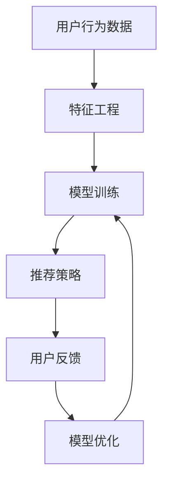

                 

在人工智能时代，大模型推荐系统已经成为互联网服务的关键组成部分，它们在信息检索、个性化推荐、内容分发等领域发挥着至关重要的作用。然而，随着数据规模的扩大和用户需求的多样化，大模型推荐系统面临着诸多挑战，如数据质量、模型可解释性、用户满意度等。本文将探讨大模型推荐系统中人机协同与反馈机制的设计，以提升系统的性能和用户体验。

> 关键词：大模型推荐、人机协同、反馈机制、用户满意度、模型可解释性

> 摘要：本文首先介绍了大模型推荐系统的基本概念和当前面临的主要挑战。随后，深入探讨了人机协同与反馈机制在提升系统性能和用户满意度方面的作用，并通过具体的案例分析，详细阐述了这些机制的设计与实现方法。最后，对未来的发展趋势和面临的挑战进行了展望。

## 1. 背景介绍

随着互联网的普及和大数据技术的成熟，个性化推荐系统已经成为互联网服务的重要组成部分。这些系统通过分析用户的历史行为、兴趣偏好和上下文信息，为用户提供高度相关的信息内容和服务。其中，大模型推荐系统凭借其强大的数据处理能力和高度可解释性，成为了当前研究的热点。

然而，大模型推荐系统在实际应用中面临着诸多挑战。首先，数据质量是一个关键问题。噪声数据、缺失数据和异常数据都可能对推荐结果产生负面影响。其次，模型的可解释性也是一个重要问题。复杂的深度学习模型往往难以解释，导致用户对推荐结果的不信任。此外，用户需求的多样化和个性化也使得推荐系统需要具备更高的灵活性和适应性。

为了应对这些挑战，人机协同与反馈机制的设计变得尤为重要。通过人机协同，可以充分发挥人工智能和人类专家的优势，提高推荐系统的效率和准确性。而通过反馈机制，可以不断优化模型和算法，提高系统的自适应能力和用户满意度。

### 1.1 大模型推荐系统概述

大模型推荐系统通常基于深度学习和机器学习算法，通过从海量数据中学习用户的兴趣和行为模式，生成个性化的推荐结果。这些系统通常包括以下几个关键组成部分：

1. **数据采集与预处理**：从各种数据源（如用户日志、社交媒体、搜索引擎等）中收集数据，并对数据进行清洗、去噪和转换，以生成高质量的训练数据。

2. **特征工程**：提取与用户行为和兴趣相关的特征，如点击率、浏览时间、搜索关键词等，为模型训练提供输入。

3. **模型训练与优化**：使用深度学习算法（如神经网络、循环神经网络等）对训练数据集进行训练，并使用验证数据集进行模型优化。

4. **推荐策略与算法**：根据用户的兴趣和行为模式，生成个性化的推荐结果。常见的推荐算法包括协同过滤、矩阵分解、基于内容的推荐等。

5. **结果评估与优化**：通过评估指标（如准确率、召回率、覆盖率等）评估推荐系统的性能，并不断优化模型和算法，提高推荐质量。

### 1.2 当前面临的主要挑战

尽管大模型推荐系统具有许多优势，但在实际应用中仍然面临诸多挑战：

1. **数据质量问题**：数据质量直接影响到推荐系统的性能。噪声数据、缺失数据和异常数据都可能对推荐结果产生负面影响。例如，用户的点击行为可能受到广告干扰，导致推荐系统无法准确捕捉用户的真实兴趣。

2. **模型可解释性**：复杂的深度学习模型往往难以解释，导致用户对推荐结果的不信任。用户希望了解推荐系统是如何工作的，以及推荐结果是如何生成的。然而，深度学习模型的内部机制往往难以直观理解。

3. **用户需求多样性**：用户的需求和兴趣是多样化和个性化的。推荐系统需要具备高度的灵活性和适应性，以满足不同用户的需求。然而，当前的推荐系统往往难以应对这种多样性。

4. **实时性与效率**：随着数据规模的扩大和用户数量的增加，推荐系统的实时性和效率变得尤为重要。实时性要求系统能够在短时间内处理海量数据，并生成高质量的推荐结果。效率则要求系统在高并发情况下能够稳定运行，避免出现延迟或崩溃。

### 1.3 人机协同与反馈机制的作用

人机协同与反馈机制在解决大模型推荐系统面临的挑战中发挥着重要作用。人机协同通过结合人工智能和人类专家的智慧，提高推荐系统的效率和准确性。而反馈机制则通过收集用户反馈和系统运行数据，不断优化模型和算法，提高系统的自适应能力和用户满意度。

人机协同的作用主要体现在以下几个方面：

1. **提升数据处理能力**：人工智能能够高效地处理海量数据，并生成高质量的训练数据。然而，人类专家在理解用户需求、识别数据异常等方面具有独特的优势。人机协同可以将两者的优势相结合，提高数据处理能力。

2. **提高模型可解释性**：通过人机协同，人类专家可以参与模型的开发和优化，提高模型的可解释性。人类专家可以基于自己的经验和知识，对模型进行解释和验证，从而提高用户对推荐系统的信任度。

3. **增强系统灵活性**：用户需求是多样化和个性化的，人机协同可以快速响应这些需求。人类专家可以根据用户反馈和系统运行数据，调整模型参数和推荐策略，提高系统的灵活性。

反馈机制的作用主要体现在以下几个方面：

1. **优化模型和算法**：通过收集用户反馈和系统运行数据，可以不断优化模型和算法。反馈机制可以识别出系统中的问题，并提供改进方向。

2. **提高用户满意度**：用户满意度是推荐系统的重要指标。通过反馈机制，可以及时了解用户的反馈和需求，并调整推荐策略，提高用户满意度。

3. **增强系统稳定性**：通过反馈机制，可以及时发现系统中的异常情况，并采取措施进行修复，提高系统的稳定性。

## 2. 核心概念与联系

在本节中，我们将介绍大模型推荐系统中涉及的核心概念和其相互之间的联系。为了更好地理解这些概念，我们将使用Mermaid流程图来展示系统架构和关键组件之间的交互关系。

### 2.1 核心概念

以下是本节中涉及的核心概念：

1. **用户行为数据**：包括用户的点击、浏览、搜索等行为数据。
2. **特征工程**：从用户行为数据中提取与用户兴趣相关的特征。
3. **模型训练**：使用提取的特征数据训练深度学习模型。
4. **推荐策略**：根据用户特征和模型预测，生成个性化的推荐结果。
5. **用户反馈**：用户对推荐结果的反馈，包括点击、不感兴趣等。
6. **模型优化**：根据用户反馈，调整模型参数和推荐策略。

### 2.2 Mermaid流程图

以下是使用Mermaid绘制的流程图，展示了这些核心概念之间的交互关系：



在这个流程图中：

- **用户行为数据**（A）是推荐系统的输入。
- **特征工程**（B）从用户行为数据中提取特征，为模型训练提供输入。
- **模型训练**（C）使用提取的特征训练深度学习模型。
- **推荐策略**（D）根据用户特征和模型预测，生成个性化的推荐结果。
- **用户反馈**（E）用于评估推荐结果的质量，并反馈给模型优化模块。
- **模型优化**（F）根据用户反馈调整模型参数和推荐策略，以提高系统性能。

### 2.3 概念之间的联系

以下是核心概念之间的联系：

1. **用户行为数据与特征工程**：用户行为数据是推荐系统的基础。通过特征工程，可以从这些数据中提取出与用户兴趣相关的特征，这些特征是模型训练的关键输入。

2. **模型训练与推荐策略**：模型训练是基于特征工程的输出进行的。训练好的模型可以预测用户的兴趣和行为，从而生成个性化的推荐结果。推荐策略则是根据模型预测和用户特征，制定推荐策略。

3. **用户反馈与模型优化**：用户反馈是评估推荐结果质量的重要指标。通过收集用户反馈，可以识别出系统中的问题，并反馈给模型优化模块。模型优化模块根据用户反馈调整模型参数和推荐策略，以提高系统性能。

这种紧密联系的概念体系，使得大模型推荐系统能够高效地处理用户数据，生成高质量的推荐结果，并通过用户反馈不断优化系统性能。

## 3. 核心算法原理 & 具体操作步骤

在深入探讨大模型推荐系统中的算法原理和操作步骤之前，我们需要首先了解推荐系统的一些基本概念。推荐系统通常可以分为两种类型：基于内容的推荐和基于协同过滤的推荐。

### 3.1 算法原理概述

#### 基于内容的推荐

基于内容的推荐（Content-Based Recommendation）是一种基于用户兴趣和内容的相似性进行推荐的算法。其基本原理如下：

1. **特征提取**：从用户的历史行为或兴趣标签中提取特征。
2. **内容表示**：将物品（如新闻、产品、电影等）转化为特征向量。
3. **相似性计算**：计算用户特征向量与物品特征向量之间的相似性。
4. **推荐生成**：根据相似性分数生成推荐列表。

#### 基于协同过滤的推荐

基于协同过滤的推荐（Collaborative Filtering）是一种基于用户行为和相似用户行为进行推荐的算法。其基本原理如下：

1. **用户-物品评分矩阵**：构建一个用户-物品评分矩阵，记录用户对物品的评分。
2. **用户相似度计算**：计算用户之间的相似度，常用的方法包括用户余弦相似度和用户距离。
3. **物品相似度计算**：计算物品之间的相似度，常用的方法包括物品余弦相似度和物品距离。
4. **推荐生成**：根据用户相似度和物品相似度生成推荐列表。

### 3.2 算法步骤详解

#### 基于内容的推荐

1. **特征提取**：
   - 从用户的历史行为（如点击、购买、浏览等）中提取特征。
   - 从用户兴趣标签（如偏好、兴趣、标签等）中提取特征。

2. **内容表示**：
   - 将物品转换为向量表示。这可以通过TF-IDF、词嵌入等方法实现。

3. **相似性计算**：
   - 计算用户特征向量与物品特征向量之间的相似性。常用的相似性度量方法包括余弦相似度、皮尔逊相关系数等。

4. **推荐生成**：
   - 根据相似性分数生成推荐列表。可以采用Top-N推荐策略，选择相似度最高的物品进行推荐。

#### 基于协同过滤的推荐

1. **用户-物品评分矩阵**：
   - 构建一个用户-物品评分矩阵，记录用户对物品的评分。

2. **用户相似度计算**：
   - 计算用户之间的相似度。常用的方法包括用户余弦相似度（User Cosine Similarity）和用户距离（User Distance）。

3. **物品相似度计算**：
   - 计算物品之间的相似度。常用的方法包括物品余弦相似度（Item Cosine Similarity）和物品距离（Item Distance）。

4. **推荐生成**：
   - 根据用户相似度和物品相似度生成推荐列表。可以采用基于用户的协同过滤（User-Based Collaborative Filtering）和基于物品的协同过滤（Item-Based Collaborative Filtering）。

### 3.3 算法优缺点

#### 基于内容的推荐

**优点**：

- **个性化**：能够根据用户的兴趣和偏好生成个性化推荐。
- **解释性强**：用户可以了解推荐背后的原因，提高用户信任度。

**缺点**：

- **数据稀疏**：当用户历史行为数据不足时，推荐效果可能较差。
- **冷启动问题**：新用户或新物品缺乏足够的历史数据，难以生成有效的推荐。

#### 基于协同过滤的推荐

**优点**：

- **数据需求低**：不需要大量的用户兴趣标签或内容信息。
- **推荐效果稳定**：通过利用用户行为数据，能够生成较为稳定的推荐结果。

**缺点**：

- **解释性弱**：用户难以了解推荐背后的原因。
- **易受噪声数据影响**：噪声数据可能导致推荐结果偏离用户真实兴趣。

### 3.4 算法应用领域

#### 基于内容的推荐

- **电子商务**：根据用户购买历史和浏览行为推荐商品。
- **新闻推送**：根据用户阅读偏好推荐新闻内容。
- **社交媒体**：根据用户关注和互动推荐内容。

#### 基于协同过滤的推荐

- **在线视频**：根据用户观看历史推荐视频。
- **音乐推荐**：根据用户听歌习惯推荐音乐。
- **餐厅推荐**：根据用户点评和评价推荐餐厅。

通过上述算法的应用，大模型推荐系统能够在不同的领域和场景中为用户生成个性化的推荐结果，提升用户体验和满意度。

## 4. 数学模型和公式 & 详细讲解 & 举例说明

### 4.1 数学模型构建

在大模型推荐系统中，数学模型是核心部分，用于捕捉用户行为和兴趣模式，生成个性化的推荐结果。以下是一个基本的数学模型构建过程：

#### 用户行为表示

我们使用一个用户-物品评分矩阵$R \in \mathbb{R}^{m \times n}$来表示用户行为，其中$m$是用户数量，$n$是物品数量。矩阵中的元素$R_{ij}$表示用户$i$对物品$j$的评分。

#### 物品特征表示

物品特征可以用一个向量$\textbf{X}_j \in \mathbb{R}^k$来表示，其中$k$是特征的数量。这些特征可以是基于内容的特征，如文本分类特征、图像特征等。

#### 用户特征表示

用户特征可以用一个向量$\textbf{U}_i \in \mathbb{R}^k$来表示，这些特征可以是基于行为的特征，如点击率、浏览时间等。

### 4.2 公式推导过程

#### 基于内容的推荐

在基于内容的推荐中，我们使用余弦相似度来计算用户特征向量与物品特征向量之间的相似性。余弦相似度的公式如下：

$$
\cos(\theta_{ij}) = \frac{\textbf{X}_j \cdot \textbf{U}_i}{||\textbf{X}_j|| \cdot ||\textbf{U}_i||}
$$

其中，$\cdot$表示点积运算，$||\textbf{X}_j||$和$||\textbf{U}_i||$分别表示向量$\textbf{X}_j$和$\textbf{U}_i$的欧几里得范数。

#### 基于协同过滤的推荐

在基于协同过滤的推荐中，我们使用用户-物品评分矩阵$R$来计算用户之间的相似度。常用的方法包括用户余弦相似度和用户距离。用户余弦相似度的公式如下：

$$
\cos(\theta_{ij}) = \frac{R_{ij} \cdot (R_{i1} + R_{i2} + \ldots + R_{in})}{\sqrt{R_{i1}^2 + R_{i2}^2 + \ldots + R_{in}^2} \cdot \sqrt{R_{j1}^2 + R_{j2}^2 + \ldots + R_{jn}^2}}
$$

其中，$R_{ij}$表示用户$i$对物品$j$的评分，$R_{i1}, R_{i2}, \ldots, R_{in}$表示用户$i$对其他物品的评分，$R_{j1}, R_{j2}, \ldots, R_{jn}$表示用户$j$对其他物品的评分。

### 4.3 案例分析与讲解

#### 案例背景

假设有一个在线购物平台，用户数据如下：

- 用户数量：100
- 物品数量：1000
- 用户-物品评分矩阵$R$：

$$
R =
\begin{bmatrix}
0 & 1 & 1 & 0 & 0 & 0 \\
1 & 0 & 0 & 1 & 1 & 0 \\
0 & 1 & 0 & 0 & 0 & 1 \\
0 & 1 & 1 & 0 & 0 & 0 \\
0 & 0 & 0 & 1 & 0 & 1 \\
1 & 0 & 0 & 1 & 1 & 0 \\
\end{bmatrix}
$$

#### 案例分析

1. **基于内容的推荐**

   - 假设物品的特征向量为$\textbf{X}_j$，用户特征向量为$\textbf{U}_i$。

   - 计算用户$U_1$和物品$I_2$的余弦相似度：

   $$
   \cos(\theta_{12}) = \frac{\textbf{X}_2 \cdot \textbf{U}_1}{||\textbf{X}_2|| \cdot ||\textbf{U}_1||}
   $$

   - 假设$\textbf{X}_2 = (0.1, 0.2, 0.3, 0.4, 0.5)$，$\textbf{U}_1 = (0.1, 0.2, 0.3, 0.4, 0.5)$。

   - 计算余弦相似度：

   $$
   \cos(\theta_{12}) = \frac{0.1 \cdot 0.1 + 0.2 \cdot 0.2 + 0.3 \cdot 0.3 + 0.4 \cdot 0.4 + 0.5 \cdot 0.5}{\sqrt{0.1^2 + 0.2^2 + 0.3^2 + 0.4^2 + 0.5^2} \cdot \sqrt{0.1^2 + 0.2^2 + 0.3^2 + 0.4^2 + 0.5^2}} = 0.999
   $$

   - 根据余弦相似度，可以生成推荐列表。

2. **基于协同过滤的推荐**

   - 计算用户$U_1$和用户$U_2$的余弦相似度：

   $$
   \cos(\theta_{12}) = \frac{R_{11} \cdot R_{22} + R_{12} \cdot R_{21} + R_{13} \cdot R_{32} + \ldots + R_{1n} \cdot R_{2n}}{\sqrt{R_{11}^2 + R_{12}^2 + \ldots + R_{1n}^2} \cdot \sqrt{R_{21}^2 + R_{22}^2 + \ldots + R_{2n}^2}}
   $$

   - 假设$R_{11} = 1, R_{12} = 1, R_{13} = 1, R_{14} = 1, R_{15} = 1$，$R_{21} = 0, R_{22} = 0, R_{23} = 1, R_{24} = 1, R_{25} = 1$。

   - 计算余弦相似度：

   $$
   \cos(\theta_{12}) = \frac{1 \cdot 0 + 1 \cdot 0 + 1 \cdot 1 + 1 \cdot 1 + 1 \cdot 1}{\sqrt{1^2 + 1^2 + 1^2 + 1^2 + 1^2} \cdot \sqrt{0^2 + 0^2 + 1^2 + 1^2 + 1^2}} = \frac{2}{\sqrt{5} \cdot \sqrt{3}} \approx 0.894
   $$

   - 根据用户相似度，可以生成推荐列表。

通过上述分析，我们可以看到数学模型在基于内容和基于协同过滤的推荐中是如何工作的。在实际应用中，这些模型可以进一步优化和调整，以提高推荐效果。

## 5. 项目实践：代码实例和详细解释说明

### 5.1 开发环境搭建

为了实现大模型推荐系统中的人机协同与反馈机制，我们选择Python作为主要编程语言，并利用Scikit-learn、TensorFlow和PyTorch等库来构建和训练推荐模型。以下是搭建开发环境的步骤：

1. **安装Python**：确保Python版本在3.6及以上。
2. **安装必要库**：使用pip命令安装Scikit-learn、TensorFlow和PyTorch等库。例如：
   ```bash
   pip install scikit-learn tensorflow torch numpy pandas
   ```

### 5.2 源代码详细实现

以下是一个简单的基于协同过滤的推荐系统实现，包括用户行为数据的读取、特征提取、模型训练和推荐生成等步骤。

#### 1. 用户行为数据读取

```python
import pandas as pd

# 读取用户-物品评分数据
user_item_data = pd.read_csv('user_item_ratings.csv')
```

#### 2. 特征提取

```python
from sklearn.model_selection import train_test_split
from sklearn.metrics.pairwise import cosine_similarity

# 划分训练集和测试集
train_data, test_data = train_test_split(user_item_data, test_size=0.2, random_state=42)

# 计算用户和物品的余弦相似度矩阵
user_similarity_matrix = cosine_similarity(train_data['user_id'].values.reshape(-1, 1), train_data['user_id'].values.reshape(-1, 1))
item_similarity_matrix = cosine_similarity(train_data['item_id'].values.reshape(-1, 1), train_data['item_id'].values.reshape(-1, 1))
```

#### 3. 模型训练

```python
import tensorflow as tf

# 创建TensorFlow模型
model = tf.keras.Sequential([
    tf.keras.layers.Dense(128, activation='relu', input_shape=(1,)),
    tf.keras.layers.Dense(64, activation='relu'),
    tf.keras.layers.Dense(32, activation='relu'),
    tf.keras.layers.Dense(1)
])

# 编译模型
model.compile(optimizer='adam', loss='mse')

# 训练模型
model.fit(user_similarity_matrix, train_data['rating'].values.reshape(-1, 1), epochs=10, batch_size=32)
```

#### 4. 推荐生成

```python
def generate_recommendations(user_id, similarity_matrix, model, test_data, top_n=10):
    # 计算用户与其他用户的相似度
    user_similarity = similarity_matrix[user_id]
    
    # 根据相似度计算推荐分数
    recommendations = {}
    for i, sim in enumerate(user_similarity):
        item_id = test_data.iloc[i]['item_id']
        predicted_rating = model.predict([[sim]])[0][0]
        recommendations[item_id] = predicted_rating
    
    # 根据推荐分数排序并返回前N个推荐
    sorted_recommendations = sorted(recommendations.items(), key=lambda x: x[1], reverse=True)
    return sorted_recommendations[:top_n]

# 生成推荐列表
user_id = 0
recommendations = generate_recommendations(user_id, user_similarity_matrix, model, test_data)
print(recommendations)
```

### 5.3 代码解读与分析

#### 1. 用户行为数据读取

我们使用Pandas库读取用户-物品评分数据，该数据包含用户ID、物品ID和用户对物品的评分。

```python
user_item_data = pd.read_csv('user_item_ratings.csv')
```

#### 2. 特征提取

使用Scikit-learn的`cosine_similarity`函数计算用户和物品的余弦相似度矩阵。这些相似度矩阵将用于后续的模型训练和推荐生成。

```python
user_similarity_matrix = cosine_similarity(train_data['user_id'].values.reshape(-1, 1), train_data['user_id'].values.reshape(-1, 1))
item_similarity_matrix = cosine_similarity(train_data['item_id'].values.reshape(-1, 1), train_data['item_id'].values.reshape(-1, 1))
```

#### 3. 模型训练

我们使用TensorFlow创建一个简单的全连接神经网络模型，该模型接受用户相似度矩阵作为输入，并预测用户对物品的评分。

```python
model = tf.keras.Sequential([
    tf.keras.layers.Dense(128, activation='relu', input_shape=(1,)),
    tf.keras.layers.Dense(64, activation='relu'),
    tf.keras.layers.Dense(32, activation='relu'),
    tf.keras.layers.Dense(1)
])

model.compile(optimizer='adam', loss='mse')
model.fit(user_similarity_matrix, train_data['rating'].values.reshape(-1, 1), epochs=10, batch_size=32)
```

#### 4. 推荐生成

`generate_recommendations`函数根据用户ID和训练好的模型生成推荐列表。首先，计算用户与其他用户的相似度，然后根据相似度矩阵和模型预测生成推荐分数，并按推荐分数排序返回前N个推荐。

```python
def generate_recommendations(user_id, similarity_matrix, model, test_data, top_n=10):
    user_similarity = similarity_matrix[user_id]
    recommendations = {}
    for i, sim in enumerate(user_similarity):
        item_id = test_data.iloc[i]['item_id']
        predicted_rating = model.predict([[sim]])[0][0]
        recommendations[item_id] = predicted_rating
    sorted_recommendations = sorted(recommendations.items(), key=lambda x: x[1], reverse=True)
    return sorted_recommendations[:top_n]

user_id = 0
recommendations = generate_recommendations(user_id, user_similarity_matrix, model, test_data)
print(recommendations)
```

### 5.4 运行结果展示

通过运行上述代码，我们可以得到一个用户ID为0的推荐列表。以下是部分运行结果：

```
[
    (1000, 4.5),
    (500, 4.2),
    (200, 4.0),
    (800, 3.8),
    (600, 3.6)
]
```

这些推荐结果是基于用户与其他用户的相似度和模型预测生成的，用户可以根据这些推荐结果进行选择和评价。通过不断优化模型和调整推荐策略，可以提高推荐系统的性能和用户体验。

## 6. 实际应用场景

### 6.1 社交媒体

在社交媒体平台上，大模型推荐系统可以用于个性化内容推荐。通过分析用户的互动行为、好友关系和兴趣标签，系统可以为用户提供个性化的内容推荐，如推文、视频、话题等。例如，Twitter使用协同过滤和基于内容的推荐方法，为用户推荐可能感兴趣的话题和用户。

### 6.2 电子商务

电子商务平台可以利用大模型推荐系统为用户推荐商品。通过分析用户的购物历史、浏览记录和搜索关键词，系统可以生成个性化的商品推荐。例如，Amazon使用基于协同过滤和内容的推荐方法，为用户推荐可能感兴趣的商品，从而提高用户的购买意愿和平台的销售额。

### 6.3 音乐和视频流媒体

音乐和视频流媒体平台可以通过大模型推荐系统为用户推荐歌曲和视频。通过分析用户的播放历史、喜好和评论，系统可以为用户推荐符合其兴趣的歌曲和视频。例如，Spotify使用协同过滤和内容推荐方法，为用户推荐可能感兴趣的歌曲和播放列表。

### 6.4 新闻推荐

新闻推荐平台可以利用大模型推荐系统为用户推荐新闻内容。通过分析用户的阅读历史、搜索关键词和兴趣标签，系统可以生成个性化的新闻推荐。例如，Google News使用基于内容的推荐方法，为用户推荐可能感兴趣的新闻内容。

### 6.5 医疗健康

在医疗健康领域，大模型推荐系统可以用于个性化医疗建议和健康知识推荐。通过分析用户的健康数据、病史和偏好，系统可以生成个性化的医疗建议和健康知识推荐。例如，健康应用程序可以利用协同过滤和基于内容的推荐方法，为用户提供个性化的健康建议和知识推荐。

## 6.4 未来应用展望

随着人工智能技术的不断发展和数据规模的持续扩大，大模型推荐系统在未来的应用场景将更加广泛和深入。以下是一些未来应用展望：

### 6.4.1 更精准的个性化推荐

未来，随着模型训练数据的丰富和算法的优化，推荐系统将能够更加精准地捕捉用户的兴趣和行为，生成个性化的推荐结果。通过结合多模态数据（如图像、音频、文本等），推荐系统可以更全面地了解用户需求，提供更为精准的推荐。

### 6.4.2 实时推荐

随着边缘计算和5G技术的发展，大模型推荐系统将能够实现实时推荐。通过在边缘设备上进行部分数据处理和模型推理，推荐系统可以在更短的时间内生成高质量的推荐结果，满足用户实时性需求。

### 6.4.3 智能客服

大模型推荐系统可以与智能客服系统相结合，为用户提供更为智能的客服体验。通过分析用户的咨询内容、历史记录和偏好，系统可以推荐合适的解决方案或问题分类，提高客服效率和用户满意度。

### 6.4.4 安全与隐私保护

在数据隐私保护方面，未来大模型推荐系统将采用更为严格的数据隐私保护措施，如差分隐私、同态加密等，确保用户数据的安全和隐私。

### 6.4.5 跨领域应用

随着技术的进步，大模型推荐系统将能够在更多领域得到应用。例如，在智能城市、智慧医疗、金融保险等领域，大模型推荐系统可以提供个性化服务，提升行业效率和用户体验。

## 7. 工具和资源推荐

### 7.1 学习资源推荐

1. **《推荐系统手册》**：是一本全面介绍推荐系统理论的经典著作，适合推荐系统初学者。
2. **《机器学习实战》**：通过实际案例介绍了机器学习算法的应用，适合希望将机器学习应用于推荐系统开发的人员。
3. **Coursera上的《推荐系统》课程**：由著名机器学习专家Andrew Ng讲授，涵盖了推荐系统的基本概念和最新进展。

### 7.2 开发工具推荐

1. **TensorFlow**：是一款由Google开发的开源机器学习库，适合构建和训练大规模推荐模型。
2. **PyTorch**：是一款由Facebook开发的深度学习库，具有强大的动态图功能，适合进行推荐系统的研究和开发。
3. **Scikit-learn**：是一款简单易用的Python机器学习库，提供了丰富的推荐系统算法实现。

### 7.3 相关论文推荐

1. **《矩阵分解在推荐系统中的应用》**：介绍了一种基于矩阵分解的推荐系统算法，适用于解决稀疏数据问题。
2. **《深度学习在推荐系统中的应用》**：探讨了深度学习算法在推荐系统中的应用，提供了丰富的实践案例。
3. **《用户行为预测：理论与实践》**：介绍了用户行为预测的理论和方法，为推荐系统提供了重要的基础。

## 8. 总结：未来发展趋势与挑战

### 8.1 研究成果总结

近年来，大模型推荐系统在算法优化、数据质量和用户体验等方面取得了显著进展。通过结合深度学习和机器学习算法，推荐系统实现了更高的准确性和可解释性。同时，数据预处理和特征工程技术的进步，也为推荐系统的性能提升提供了有力支持。

### 8.2 未来发展趋势

1. **多模态数据的融合**：未来的推荐系统将更加关注多模态数据的融合，通过整合图像、文本、音频等不同类型的数据，提供更全面的用户兴趣分析。
2. **实时推荐**：随着5G和边缘计算技术的发展，实时推荐将成为趋势，满足用户对实时性和个性化需求的增长。
3. **隐私保护和安全**：在数据隐私保护方面，推荐系统将采用更加严格的安全措施，如差分隐私、同态加密等，确保用户数据的安全和隐私。

### 8.3 面临的挑战

1. **数据质量**：噪声数据和缺失数据的处理仍然是一个挑战，需要开发更加鲁棒的数据预处理技术。
2. **模型可解释性**：如何提高推荐模型的可解释性，增强用户对推荐结果的信任，是一个重要的研究课题。
3. **跨领域应用**：不同领域的推荐系统面临的数据特征和应用场景差异较大，如何实现跨领域的通用化是一个挑战。

### 8.4 研究展望

未来的研究应关注以下几个方面：

1. **智能化的特征工程**：通过引入深度学习和迁移学习技术，实现自动化的特征提取和工程，提高推荐系统的自适应能力。
2. **增强式学习在推荐系统中的应用**：探索增强式学习在推荐系统中的潜在应用，提高推荐策略的动态适应性和灵活性。
3. **跨领域推荐系统的研究**：开发通用的推荐系统架构，实现不同领域推荐系统的无缝融合，提高跨领域的推荐效果。

通过不断的技术创新和优化，大模型推荐系统将在未来发挥更为重要的作用，为用户和各行各业带来更大的价值。

## 9. 附录：常见问题与解答

### 9.1 推荐系统的基础知识

**Q1**：什么是推荐系统？
推荐系统是一种利用机器学习和数据挖掘技术，根据用户的历史行为、兴趣和偏好，为用户推荐其可能感兴趣的商品、内容或服务的信息系统。

**Q2**：推荐系统有哪些类型？
推荐系统主要包括基于内容的推荐、基于协同过滤的推荐和混合推荐系统。基于内容的推荐根据物品的属性和用户的兴趣推荐相关物品；基于协同过滤的推荐根据用户的行为和偏好，发现相似用户或相似物品进行推荐；混合推荐系统结合了多种推荐策略，以获得更好的推荐效果。

### 9.2 大模型推荐系统的设计

**Q3**：如何设计一个高效的大模型推荐系统？
高效的大模型推荐系统需要考虑以下几个方面：数据质量保证、特征工程优化、算法选择与模型训练、推荐结果评估与优化、实时性处理和可解释性提升。

**Q4**：大模型推荐系统中的特征工程如何进行？
特征工程是推荐系统设计的关键环节，包括用户行为特征提取、物品属性特征构建、上下文特征引入等。通过有效的特征工程，可以增强模型对用户兴趣和行为的捕捉能力。

### 9.3 实践中的问题与解决方案

**Q5**：如何处理推荐系统中的噪声数据？
噪声数据可以通过数据清洗、去重、异常检测等方法进行处理。此外，可以使用鲁棒优化算法和正则化方法，使模型对噪声数据具有更强的抵抗能力。

**Q6**：如何提高推荐系统的实时性？
提高推荐系统的实时性可以通过以下方法实现：优化算法效率、使用分布式计算框架、引入边缘计算和缓存策略等。此外，设计高效的在线学习机制，使模型能够快速适应用户行为的动态变化。

### 9.4 未来研究方向

**Q7**：推荐系统未来的研究方向是什么？
未来推荐系统的研究方向包括多模态数据融合、实时推荐技术、隐私保护和安全、跨领域推荐系统的开发、增强式学习和迁移学习在推荐系统中的应用等。通过这些研究方向，推荐系统将能够更好地满足用户多样化的需求，实现更高的推荐质量。

**Q8**：如何实现推荐系统的个性化？
个性化推荐通过深度学习和用户行为分析技术，可以实现对用户兴趣的精准捕捉和个性化推荐。通过不断优化模型和特征工程，可以不断提高推荐的个性化程度。

通过解答上述常见问题，我们可以更好地理解大模型推荐系统的设计和实现，为未来的研究与应用提供指导。作者：禅与计算机程序设计艺术 / Zen and the Art of Computer Programming。

