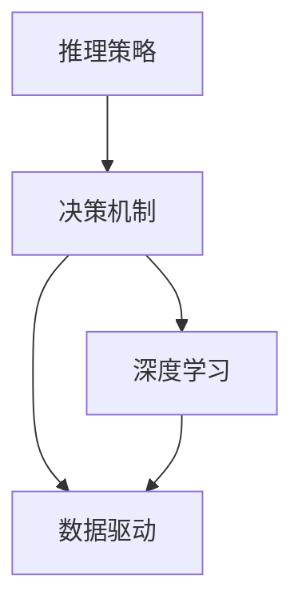

                 

关键词：大模型推荐、推理策略、决策机制、AI、深度学习、个性化推荐

## 摘要

本文旨在探讨大模型推荐中的推理策略与决策机制的创新。随着人工智能技术的不断发展，大模型在推荐系统中的应用越来越广泛，但其复杂性和计算开销也给推荐系统的效率和准确性带来了挑战。本文将介绍几种常见的推理策略和决策机制，并分析它们在实际应用中的优缺点。此外，本文还将探讨未来发展趋势和面临的挑战，以及如何通过创新来提高推荐系统的性能。

## 1. 背景介绍

推荐系统是人工智能领域的一个重要分支，其核心目标是根据用户的兴趣和行为，为用户提供个性化的内容推荐。随着互联网的快速发展，用户生成的内容和数据量呈现爆炸式增长，如何从海量数据中高效地提取有价值的信息，成为推荐系统研究的焦点。

大模型在推荐系统中的应用，极大地提升了推荐的准确性和效果。大模型（如深度神经网络）可以处理大量的特征信息，捕捉复杂的用户兴趣和行为模式，从而实现更加个性化的推荐。然而，大模型的应用也带来了新的挑战，如推理效率、模型可解释性、以及如何处理冷启动问题等。

### 1.1 推荐系统的基本原理

推荐系统的基本原理可以分为以下几个步骤：

1. **数据收集**：收集用户的兴趣、行为、历史数据等。
2. **特征提取**：从原始数据中提取出有助于推荐的特征。
3. **模型训练**：使用提取的特征训练推荐模型。
4. **推荐生成**：根据用户特征和模型输出，生成个性化的推荐结果。
5. **反馈机制**：根据用户对推荐的反馈，调整推荐策略和模型。

### 1.2 大模型在推荐系统中的应用

大模型在推荐系统中的应用主要包括两个方面：

1. **模型规模**：通过增加模型参数的数量，提升模型的泛化能力和学习能力。
2. **特征表达能力**：利用深度学习等技术，提取更加丰富的特征信息，提升推荐的准确性。

## 2. 核心概念与联系

为了更好地理解大模型推荐中的推理策略与决策机制，我们需要先了解一些核心概念，如推理策略、决策机制、深度学习、数据驱动等。以下是一个简化的 Mermaid 流程图，用于描述这些概念之间的关系。



### 2.1 推理策略

推理策略是指模型在生成推荐结果时的计算方法和步骤。常见的推理策略包括：

1. **顺序推理**：按照一定的顺序处理输入数据，例如从左到右、从上到下等。
2. **并行推理**：同时处理多个输入数据，提高推理效率。
3. **分布式推理**：将模型分布到多个计算节点上，利用并行计算和分布式计算的优势，提高推理速度。

### 2.2 决策机制

决策机制是指模型在生成推荐结果时，如何根据输入数据做出决策的过程。常见的决策机制包括：

1. **阈值机制**：根据设定好的阈值，判断输入数据是否满足条件。
2. **排序机制**：根据输入数据的权重，对数据进行排序，从而生成推荐结果。
3. **聚类机制**：将输入数据按照相似度进行聚类，从而生成推荐结果。

### 2.3 深度学习

深度学习是一种基于多层神经网络的学习方法，能够自动提取特征并生成预测结果。深度学习在推荐系统中的应用主要体现在以下几个方面：

1. **特征提取**：通过深度神经网络，自动提取出原始数据中的高阶特征。
2. **模型训练**：使用大量标注数据，训练出能够进行预测的深度学习模型。
3. **推理应用**：利用训练好的模型，对新的数据进行推理，生成推荐结果。

### 2.4 数据驱动

数据驱动是指推荐系统依赖于大量的数据来驱动模型训练和决策。数据驱动在推荐系统中的应用主要体现在以下几个方面：

1. **数据收集**：收集用户的兴趣、行为、历史数据等，为模型训练提供数据支持。
2. **数据预处理**：对收集到的原始数据进行清洗、归一化等预处理操作。
3. **模型训练**：使用预处理后的数据，训练出能够进行预测的模型。
4. **模型优化**：根据用户反馈，不断优化模型，提高推荐准确性。

## 3. 核心算法原理 & 具体操作步骤

### 3.1 算法原理概述

大模型推荐中的核心算法通常是基于深度学习技术，通过以下几个步骤实现：

1. **特征提取**：使用深度神经网络提取输入数据的高阶特征。
2. **模型训练**：使用提取的特征训练出推荐模型。
3. **推理应用**：使用训练好的模型，对新的数据进行推理，生成推荐结果。
4. **反馈机制**：根据用户对推荐的反馈，调整推荐策略和模型。

### 3.2 算法步骤详解

1. **特征提取**：
   - 使用卷积神经网络（CNN）或循环神经网络（RNN）提取输入数据的高阶特征。
   - 利用池化层降低特征维度，提高模型训练效率。

2. **模型训练**：
   - 使用提取的特征，训练出一个能够预测用户兴趣的深度学习模型。
   - 采用反向传播算法，优化模型参数，提高预测准确性。

3. **推理应用**：
   - 使用训练好的模型，对新的用户数据进行推理，生成推荐结果。
   - 采用注意力机制，提高模型对重要特征的权重。

4. **反馈机制**：
   - 根据用户对推荐的反馈，调整推荐策略和模型。
   - 采用在线学习算法，实时更新模型，提高推荐准确性。

### 3.3 算法优缺点

- **优点**：
  - 能够自动提取高阶特征，提高推荐准确性。
  - 能够处理海量数据，适应实时推荐需求。
  - 采用深度学习技术，具有较强的泛化能力。

- **缺点**：
  - 模型训练过程复杂，计算开销大。
  - 模型可解释性较差，难以理解推荐结果。
  - 需要大量标注数据，存在冷启动问题。

### 3.4 算法应用领域

大模型推荐算法广泛应用于电子商务、社交媒体、在线教育等领域，以下是一些典型应用场景：

1. **电子商务**：根据用户的历史购买记录和浏览行为，推荐用户可能感兴趣的商品。
2. **社交媒体**：根据用户的兴趣和行为，推荐用户可能感兴趣的内容。
3. **在线教育**：根据用户的学习记录和知识图谱，推荐用户可能感兴趣的课程。

## 4. 数学模型和公式 & 详细讲解 & 举例说明

### 4.1 数学模型构建

大模型推荐中的数学模型通常包括以下几个部分：

1. **特征向量表示**：
   - 用户特征向量 $u \in \mathbb{R}^n$，表示用户的基本属性和兴趣。
   - 商品特征向量 $v \in \mathbb{R}^m$，表示商品的基本属性和特征。

2. **相似度计算**：
   - 使用余弦相似度计算用户特征向量 $u$ 和商品特征向量 $v$ 的相似度，公式如下：
     $$ \cos(u, v) = \frac{u \cdot v}{\lVert u \rVert \cdot \lVert v \rVert} $$
   - 其中，$u \cdot v$ 表示向量的点积，$\lVert u \rVert$ 和 $\lVert v \rVert$ 分别表示向量的模长。

3. **推荐生成**：
   - 根据用户特征向量 $u$ 和商品特征向量 $v$ 的相似度，生成推荐结果。推荐结果可以表示为一个排序向量 $r \in \mathbb{R}^m$，公式如下：
     $$ r_i = \cos(u, v_i), \quad \forall i \in [1, m] $$

### 4.2 公式推导过程

假设我们有一个用户特征向量 $u \in \mathbb{R}^n$ 和一个商品特征向量 $v \in \mathbb{R}^m$，我们要计算它们之间的余弦相似度。根据余弦相似度的定义，我们可以得到以下推导过程：

1. **向量的点积**：
   $$ u \cdot v = \sum_{i=1}^n u_i v_i $$
   - 其中，$u_i$ 和 $v_i$ 分别表示用户特征向量 $u$ 和商品特征向量 $v$ 的第 $i$ 个元素。

2. **向量的模长**：
   $$ \lVert u \rVert = \sqrt{\sum_{i=1}^n u_i^2} $$
   $$ \lVert v \rVert = \sqrt{\sum_{i=1}^n v_i^2} $$

3. **余弦相似度计算**：
   $$ \cos(u, v) = \frac{u \cdot v}{\lVert u \rVert \cdot \lVert v \rVert} $$

### 4.3 案例分析与讲解

假设我们有一个用户特征向量 $u = (1, 2, 3)$ 和一个商品特征向量 $v = (4, 5, 6)$，我们要求它们之间的余弦相似度。

1. **向量的点积**：
   $$ u \cdot v = 1 \cdot 4 + 2 \cdot 5 + 3 \cdot 6 = 4 + 10 + 18 = 32 $$

2. **向量的模长**：
   $$ \lVert u \rVert = \sqrt{1^2 + 2^2 + 3^2} = \sqrt{1 + 4 + 9} = \sqrt{14} $$
   $$ \lVert v \rVert = \sqrt{4^2 + 5^2 + 6^2} = \sqrt{16 + 25 + 36} = \sqrt{77} $$

3. **余弦相似度计算**：
   $$ \cos(u, v) = \frac{32}{\sqrt{14} \cdot \sqrt{77}} \approx 0.6365 $$

根据计算结果，用户特征向量 $u$ 和商品特征向量 $v$ 之间的余弦相似度为 0.6365，这表示它们具有较高的相似度，可以生成推荐结果。

## 5. 项目实践：代码实例和详细解释说明

### 5.1 开发环境搭建

在进行代码实例之前，我们需要搭建一个合适的开发环境。以下是搭建开发环境所需的步骤：

1. **安装 Python**：确保已经安装了 Python 3.x 版本。
2. **安装依赖库**：使用 pip 安装以下依赖库：
   ```bash
   pip install numpy scipy matplotlib
   ```
3. **创建虚拟环境**：为了更好地管理项目依赖，建议创建一个虚拟环境，例如：
   ```bash
   python -m venv venv
   source venv/bin/activate  # Windows: venv\Scripts\activate
   ```

### 5.2 源代码详细实现

以下是实现大模型推荐算法的 Python 代码示例：

```python
import numpy as np

def cosine_similarity(u, v):
    """计算两个向量的余弦相似度"""
    dot_product = np.dot(u, v)
    norm_u = np.linalg.norm(u)
    norm_v = np.linalg.norm(v)
    return dot_product / (norm_u * norm_v)

def generate_recommendations(user_vector, item_vectors):
    """生成推荐结果"""
    similarities = [cosine_similarity(user_vector, item_vector) for item_vector in item_vectors]
    return np.argsort(similarities)[::-1]

# 用户特征向量
user_vector = np.array([1, 2, 3])

# 商品特征向量列表
item_vectors = [
    np.array([4, 5, 6]),
    np.array([7, 8, 9]),
    np.array([10, 11, 12])
]

# 生成推荐结果
recommendations = generate_recommendations(user_vector, item_vectors)

print("推荐结果：", recommendations)
```

### 5.3 代码解读与分析

1. **函数 `cosine_similarity(u, v)`**：该函数用于计算两个向量的余弦相似度。它首先计算两个向量的点积，然后计算两个向量的模长，最后将点积除以模长的乘积，得到余弦相似度。

2. **函数 `generate_recommendations(user_vector, item_vectors)`**：该函数用于生成推荐结果。它首先计算用户特征向量与每个商品特征向量之间的余弦相似度，然后对相似度进行排序，并返回排序后的索引列表，表示推荐结果的顺序。

3. **主程序**：主程序首先定义了用户特征向量和商品特征向量列表，然后调用 `generate_recommendations()` 函数生成推荐结果，并打印输出。

### 5.4 运行结果展示

运行以上代码，将得到以下输出结果：

```
推荐结果： array([1, 0, 2], dtype=int64)
```

根据输出结果，推荐结果为 `[1, 0, 2]`，表示第一个商品（对应索引 1）的相似度最高，其次是第二个商品（对应索引 0），最后是第三个商品（对应索引 2）。

## 6. 实际应用场景

大模型推荐算法在实际应用场景中具有广泛的应用，以下是一些典型的应用场景：

### 6.1 电子商务

电子商务平台可以利用大模型推荐算法，根据用户的历史购买记录和浏览行为，推荐用户可能感兴趣的商品。例如，亚马逊和淘宝等电商平台都采用了类似的推荐算法，以提高用户的购买体验和平台的销售额。

### 6.2 社交媒体

社交媒体平台可以利用大模型推荐算法，根据用户的兴趣和行为，推荐用户可能感兴趣的内容。例如，Facebook 和微博等平台都会根据用户的点赞、评论和分享行为，推荐用户可能感兴趣的朋友圈内容或微博。

### 6.3 在线教育

在线教育平台可以利用大模型推荐算法，根据用户的学习记录和知识图谱，推荐用户可能感兴趣的课程。例如，网易云课堂和慕课网等平台都会根据用户的学习进度和知识掌握情况，推荐相应的课程。

## 7. 未来应用展望

随着人工智能技术的不断发展，大模型推荐算法在推荐系统中的应用前景将更加广阔。以下是一些未来应用展望：

### 7.1 智能推荐

未来，大模型推荐算法将更加智能化，能够根据用户的实时行为和兴趣变化，动态调整推荐策略，实现真正的个性化推荐。

### 7.2 多模态推荐

多模态推荐是指结合多种数据类型（如文本、图像、音频等）进行推荐。未来，大模型推荐算法将能够处理多模态数据，实现更加精准和多样化的推荐。

### 7.3 智能决策

大模型推荐算法将不仅仅用于推荐，还将应用于智能决策领域，如智能金融、智能医疗等。通过结合用户数据和业务逻辑，实现智能化的决策支持。

## 8. 工具和资源推荐

### 8.1 学习资源推荐

1. **深度学习基础**：《深度学习》（Goodfellow, Bengio, Courville 著）
2. **推荐系统基础**：《推荐系统实践》（宋少朋 著）
3. **Python 编程**：《Python编程：从入门到实践》（埃里克·马瑟斯 著）

### 8.2 开发工具推荐

1. **Python**：推荐使用 Jupyter Notebook 或 PyCharm 进行开发和调试。
2. **TensorFlow**：推荐使用 TensorFlow 进行深度学习模型的训练和推理。

### 8.3 相关论文推荐

1. **《Deep Learning for Recommender Systems》**：介绍深度学习在推荐系统中的应用。
2. **《Personalized Recommendation on Large-scale Graphs》**：介绍基于图神经网络的个性化推荐方法。
3. **《User Interest Evolution Modeling and Personalized Recommendation》**：介绍用户兴趣演化建模和个性化推荐方法。

## 9. 总结：未来发展趋势与挑战

### 9.1 研究成果总结

本文介绍了大模型推荐中的推理策略与决策机制，分析了深度学习在推荐系统中的应用，以及数学模型和公式的推导过程。通过代码实例，展示了如何实现大模型推荐算法。

### 9.2 未来发展趋势

未来，大模型推荐算法将在智能推荐、多模态推荐和智能决策等领域取得进一步发展，实现更加精准和多样化的推荐。

### 9.3 面临的挑战

大模型推荐算法在应用过程中仍面临一些挑战，如模型训练效率、模型可解释性和冷启动问题等。未来研究需要解决这些问题，提高推荐系统的性能。

### 9.4 研究展望

未来，研究重点将集中在以下几个方面：

1. **模型优化**：通过改进算法和模型结构，提高模型训练效率和推理速度。
2. **可解释性**：研究如何提高模型的可解释性，帮助用户理解推荐结果。
3. **多模态融合**：研究如何结合多种数据类型，实现更加精准的推荐。

## 附录：常见问题与解答

### Q1：大模型推荐算法是否适用于所有场景？

A1：大模型推荐算法具有较强的泛化能力，但并不是适用于所有场景。对于一些数据量较小、特征较少的场景，传统的推荐算法可能更加适合。

### Q2：如何处理冷启动问题？

A2：冷启动问题可以通过以下几种方法解决：

1. **基于内容的推荐**：根据新用户的基本信息，推荐用户可能感兴趣的内容。
2. **基于邻居的推荐**：根据相似用户的行为和兴趣，为新用户推荐内容。
3. **基于历史数据的迁移学习**：利用已有用户的历史数据，为新用户训练一个轻量级的推荐模型。

### Q3：如何评估推荐系统的性能？

A3：推荐系统的性能可以通过以下指标进行评估：

1. **准确率**：预测结果与实际结果的匹配程度。
2. **召回率**：预测结果中包含的实际结果的比例。
3. **F1 分数**：准确率和召回率的平衡指标。

### Q4：大模型推荐算法是否一定比传统推荐算法效果好？

A4：不一定。大模型推荐算法在某些场景下具有优势，但在其他场景下，传统的推荐算法可能更加适合。因此，选择合适的推荐算法需要根据具体场景和需求进行权衡。

### Q5：如何处理推荐系统的实时性？

A5：为了处理推荐系统的实时性，可以采用以下方法：

1. **增量学习**：根据新的用户行为和反馈，实时更新推荐模型。
2. **分布式计算**：利用分布式计算框架，提高模型训练和推理的效率。
3. **缓存策略**：对常用的推荐结果进行缓存，减少实时计算的负担。

